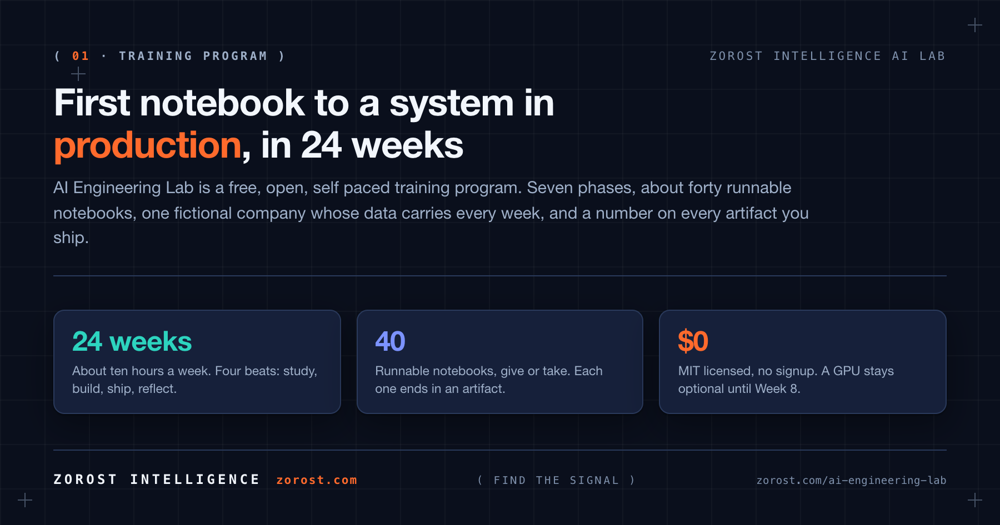
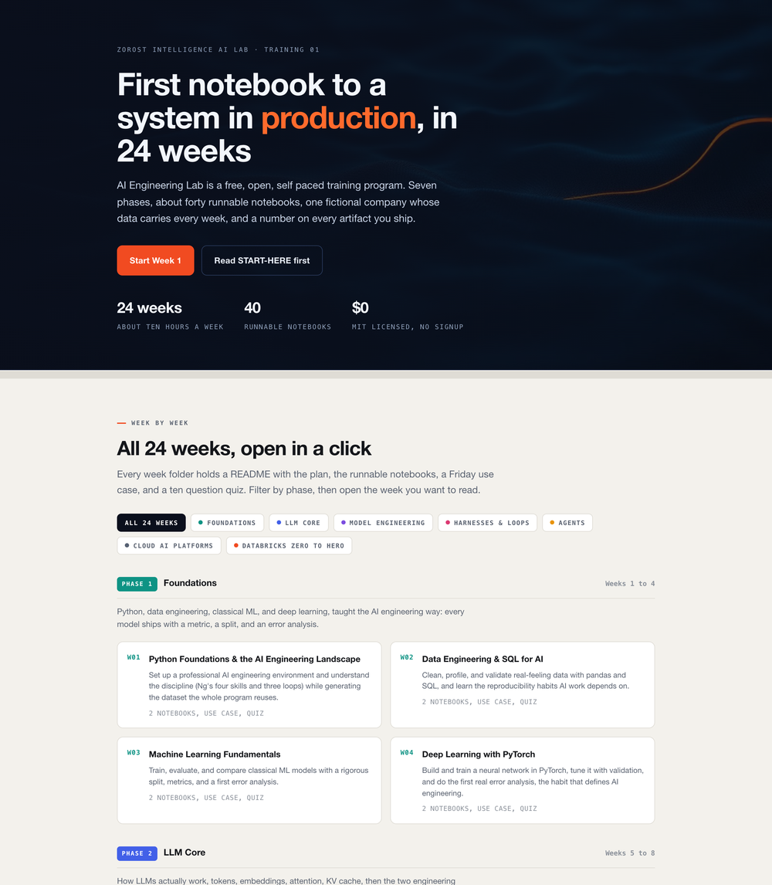
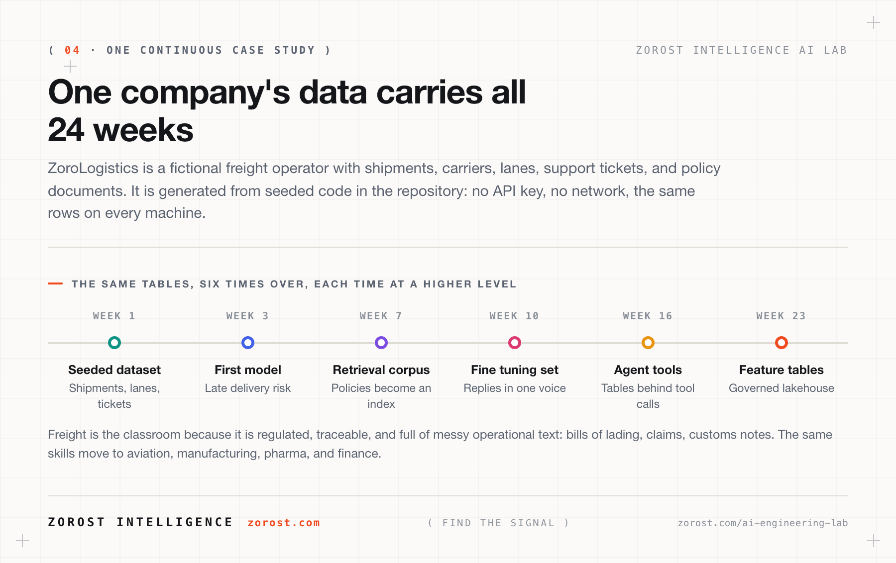
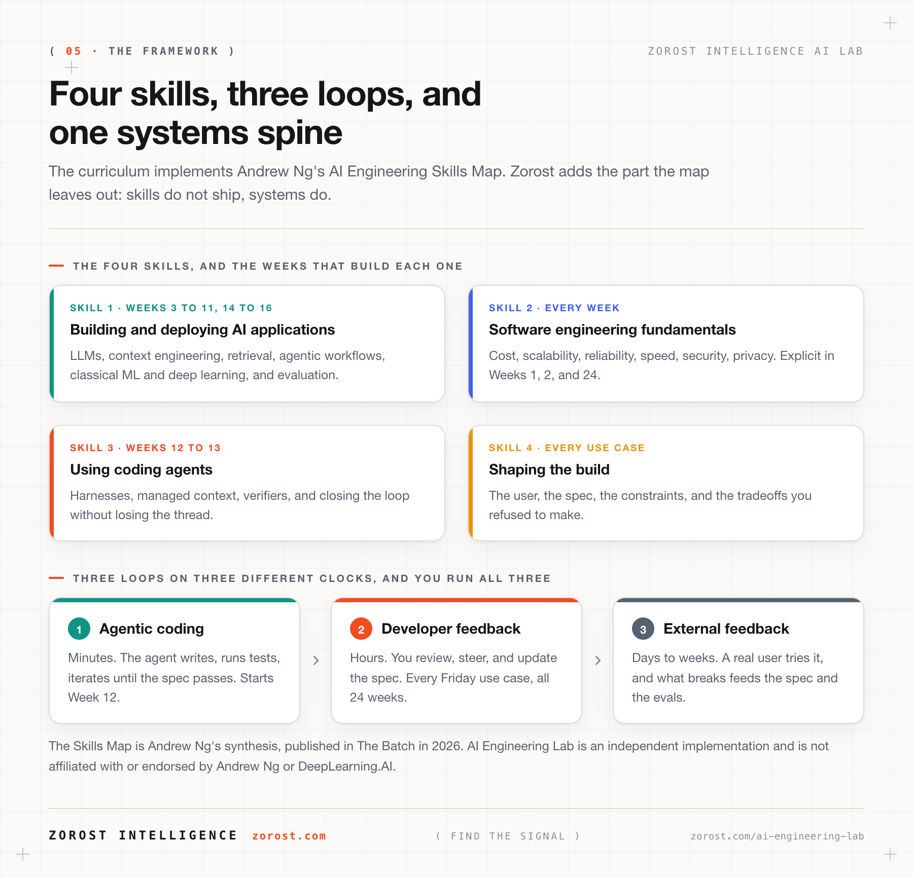
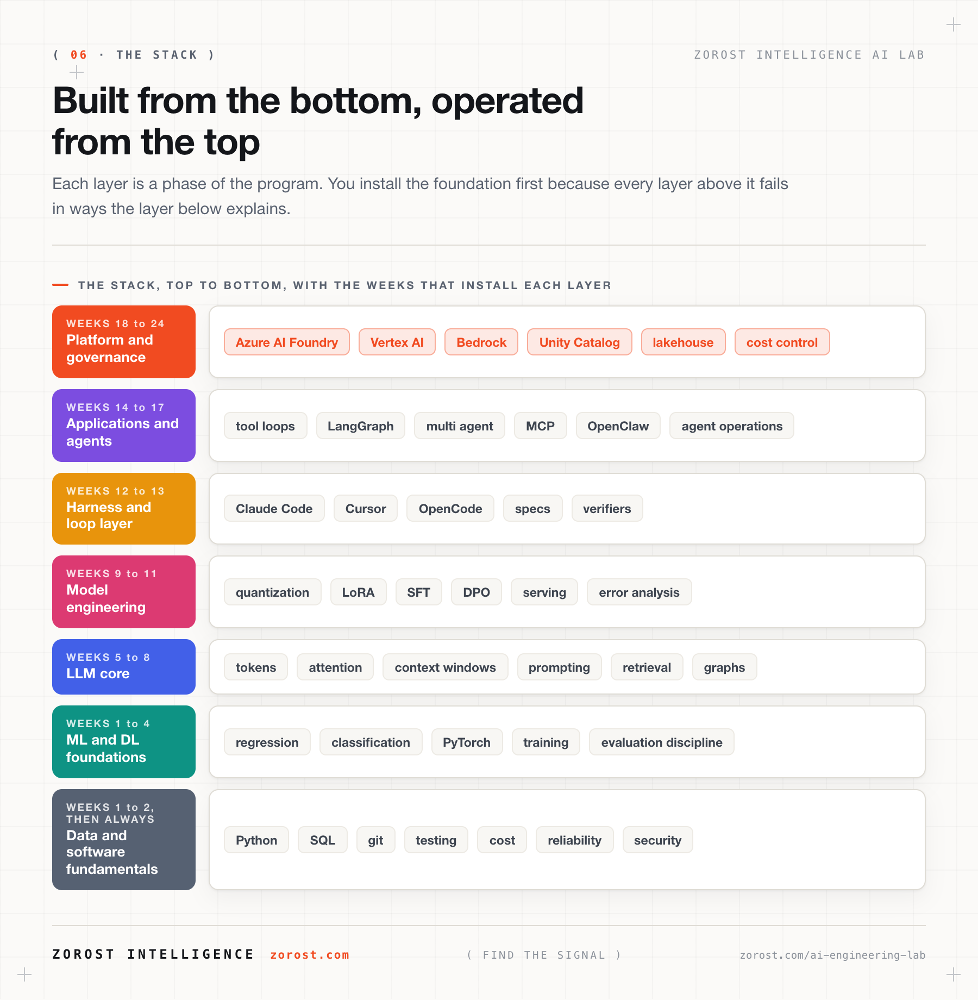

<div align="center">



[](LICENSE)
[](curriculum/README.ja.md)
[](curriculum/README.ja.md)
[](https://zorost.github.io/AI-Engineering-Lab/)

**日本語版** · [英語版](README.md) ·
**[最初に読む](START-HERE.ja.md)** ·
[24週間の一覧](curriculum/README.ja.md) ·
[Reference](reference/) ·
[用語集](reference/GLOSSARY.ja.md) · [英語版](reference/GLOSSARY.md) ·
[Roadmap](ROADMAP.md)

Zorost Intelligence AI Labが開発 · Washington, DC ·
[zorost.com/ai-engineering-lab](https://zorost.com/ai-engineering-lab)

</div>

---

## まず始める

```bash
git clone https://github.com/zorost/AI-Engineering-Lab.git
cd AI-Engineering-Lab
python -m pip install -r requirements.txt
```

1. **プログラミングやAIが初めてですか？** まず **[START-HERE.ja.md](START-HERE.ja.md)** を読んでください。使うツール、進む順番、問題が起きたときの対処を説明しています。
2. **[`curriculum/week-01`](curriculum/week-01/README.ja.md) を開きます。** 環境を構築し、その後の全週で再利用するデータセットを生成します。最初の8週間にGPUは不要です。
3. **トラッカーを開きます。** [`curriculum/tracking`](curriculum/tracking/README.md) の月曜日の行から始めます。

必要な情報は各週からリンクされています。次に何を読むかを推測する必要はありません。

## これは何か

AI Engineering Labは、Pythonの基礎から本番品質のAIシステムまで、**24週間**で学ぶ無料・オープン・自習型の **training program** です。機械学習と深層学習、LLMの内部構造、prompt/context engineering、ベクトル検索を使ったRAG、量子化、LoRAとDPOによるfine-tuning、評価ハーネス、coding-agent harness、AI agentとModel Context Protocol、Azure AI Foundry、Google Vertex AI、AWS Bedrock、そしてDatabricks lakehouseをゼロから本番運用まで扱います。

このプログラムは **[Zorost Intelligence AI Lab](https://zorost.com/ai-lab)** が開発しています。2時間で終わるprompt講座ではありません。生成AI、applied machine learning、Databricks modernizationのチームに新しく加わるエンジニアへ、Labが渡すカリキュラムを想定しています。実際に手を動かし、ユースケースを通し、本番で壊れる点にも正直であることを重視します。「読むだけでなく実行できるAI engineer roadmap」を探しているなら、これがそのためのプログラムです。毎週、実行可能な成果物で終わります。

毎週、1つの概念と1つの成果物を組み合わせます。

- **ユースケース。** 24週間を通して続く、架空の物流会社のケーススタディ。
- **実行可能なNotebook。** Python、SQL、PySparkを使い、ローカルまたは無料のcloud notebookで実行します。
- **スコア。** Week 3以降は、metricとerror noteが付くまで完了とはみなしません。

> **対象者:** AIを開発に取り入れたいsoftware developer、engineeringへ進みたいanalyst、学生・キャリアチェンジャー、技術系founder。ソフトウェアをインストールできるコンピューター、週約10時間、基本的なコンピューター操作が必要です。Python経験、GPU、有料API keyは必要ありません。
>
> **対象外:** model architectureの研究職を目指す人、週末だけのprompt workshopを探している人。

## オンラインでプログラムを見る

cloneする前に、カリキュラム全体をページとして読むこともできます。
**[zorost.github.io/AI-Engineering-Lab](https://zorost.github.io/AI-Engineering-Lab/)** に24週間の一覧があり、各週の目的から直接そのフォルダーへ移動できます。導入を日本語で読む場合は、まず [START-HERE.ja.md](START-HERE.ja.md) を開いてください。

[](https://zorost.github.io/AI-Engineering-Lab/)

## 24週間の旅


| Phase | Weeks | 到達点 |
|---|---|---|
| **1 · Foundations** | 1〜4 | Python、data、machine learning、deep learningを学び、最初から評価の視点を持つ |
| **2 · LLM core** | 5〜8 | token、transformer、prompt/context engineering、retrieval、graph、local modelを扱う |
| **3 · Model engineering** | 9〜11 | 量子化、LoRA/DPOによるfine-tuning、serving、evalとerror analysisを行う |
| **4 · Harnesses and loops** | 12〜13 | Claude Code、Cursor、OpenCode、DeepSeek Harnessとspec-driven loopを使う |
| **5 · Agents** | 14〜17 | single agent、multi-agent、MCP、OpenClaw、Hermes、agent operationsを構築する |
| **6 · Cloud AI platforms** | 18〜20 | Azure、Vertex、Bedrockの3つのcloudで同じagentを動かし比較する |
| **7 · Databricks zero to hero** | 21〜24 | lakehouse、Unity Catalog、PySpark、Lakeflow、AI Search、Genie、本番capstoneを完成させる |

週ごとの詳細は [curriculum/README.ja.md](curriculum/README.ja.md)、図を使った全体像は [curriculum/learning-path.md](curriculum/learning-path.md) を見てください。

## 1週間の進め方


| Beat | いつ | やること |
|---|---|---|
| **Study** | 月〜火 | その週のREADMEと、そこからリンクされているknowledge-baseを読む |
| **Build** | 水〜木 | Notebookを実行し、変更を加え、意図的に1つ壊してみる |
| **Ship** | 金 | ユースケース演習を行い、成果物1つ・数字1つ・正直なメモ1つを提出する |
| **Reflect** | 金〜日 | 10問のquiz（8問正解で合格）を解き、trackerを更新する |

Week 3以降、すべてのAI成果物にはmetricと短いerror analysis noteを付けます。この習慣がプログラムの核心です。

## 1つの会社を24週間使う



あなたは架空の運送会社 **ZoroLogistics** のAI engineering teamです。Week 1で生成するdatasetは、Week 2のSQL演習、Week 3のtraining data、Week 7のretrieval corpus、Week 10のfine-tuning set、Week 16のagent tools、Week 23のfeature tablesへ引き継がれます。24個の独立したdemoではなく、互いにつながった成果物のportfolioを完成させます。

freightを教材にするのは、規制・追跡可能性が重要で、運用上の複雑なテキストが多いからです。学んだskillは、航空、製造、製薬、政府、金融にも応用できます。これはZorostが実際に支援する業界です。

## リポジトリの中身


```
AI-Engineering-Lab/
├── START-HERE.ja.md       # 日本語の初日ガイド
├── curriculum/            # 24週間のprogram、manifest、Excel tracker
│   └── week-01/*.ja.*     # Week 1の日本語ガイドとNotebook
├── reference/             # 各週から参照する資料
│   ├── knowledge-base/    #   14個のconcept file
│   ├── skills/            #   Claude Code、Cursor、OpenCode、Ollamaなどのtool guide
│   ├── agents/            #   OpenClaw、Hermes、MCPなどのagent pattern
│   ├── platforms/         #   Azure、Vertex、Bedrock、Databricks
│   ├── resources/         #   週ごとに対応付けた無料の外部course
│   └── GLOSSARY.ja.md     #   用語集（日本語版）
├── zoro/                  # ケーススタディ用のseed済みdata toolkit
├── data/                  # 生成したtableの保存先（gitignore対象）
├── scripts/               # リポジトリのmaintenanceとcheck
├── docs/                  # GitHub Pagesのprogram site
└── assets/                # 図
```

日本語版は、英語の原文と並行して少しずつ追加します。コマンド、コード、API名はそのまま使えるように表記しています。

## プログラムのframework

このcurriculumは **Andrew NgのAI Engineering Skills Map** と、AI時代のsoftwareを作るための **3つのloop** を実装します。Zorostは、skillだけではshipできず、systemとして届ける必要があるという視点を加えています。



> Skills MapはAndrew Ngが2026年にThe Batchで公開した統合です。AI Engineering Labは独立した実装であり、Andrew NgまたはDeepLearning.AIと提携・推奨関係にはありません。詳しくは [Zorostの解説](https://zorost.com/ai-engineering-skills-map-training-guide) を参照してください。



## 費用

無料です。プログラムはMIT licenseで、signupもありません。Week 1〜13はlocal model、無料tierのAPI、またはAPI不要の経路があります。Week 18〜24はcloudのfree tierを使い、範囲内に収める方法も各週で説明します。GPUはWeek 8まで任意です。

## 困ったとき

1. エラー全文を読み直します。最後の行が問題を示します。
2. その週の `exercises.md` のヒントと [用語集](reference/GLOSSARY.ja.md) を確認します。
3. GitHub issueには、週番号、実行した内容、tracebackを書きます。
4. report、security、conductに関する連絡は **info@zorost.com** へ送ります。

[contributing](.github/CONTRIBUTING.md)、[code of conduct](.github/CODE_OF_CONDUCT.md)、[security](.github/SECURITY.md)も参照してください。

## Zorost Intelligence AI Labについて

[Zorost Intelligence](https://zorost.com)は、accuracy、traceability、complianceが不可欠な組織向けに、AIとdata platformを設計・開発・運用しています。このプログラムは **AI Lab** が開発し、[zorost.com/ai-lab](https://zorost.com/ai-lab#training) のTraining 01として公開しています。Labのopen test benchは [AI Fieldwork](https://zorost.com/ai-lab/fieldwork) です。

このリポジトリの原文はZorost Intelligenceの著作物です。vendor platformについては各ファイルのSourcesに記載し、第三者のcourse materialは転載していません。

## License

MIT。詳しくは [LICENSE](LICENSE) を見てください。自由に学び、自由に作り、Zorost Intelligenceを表示してください。

---
© 2026 Zorost Intelligence LLC · [zorost.com](https://zorost.com) · [@ZorostAI](https://x.com/ZorostAI) · info@zorost.com
