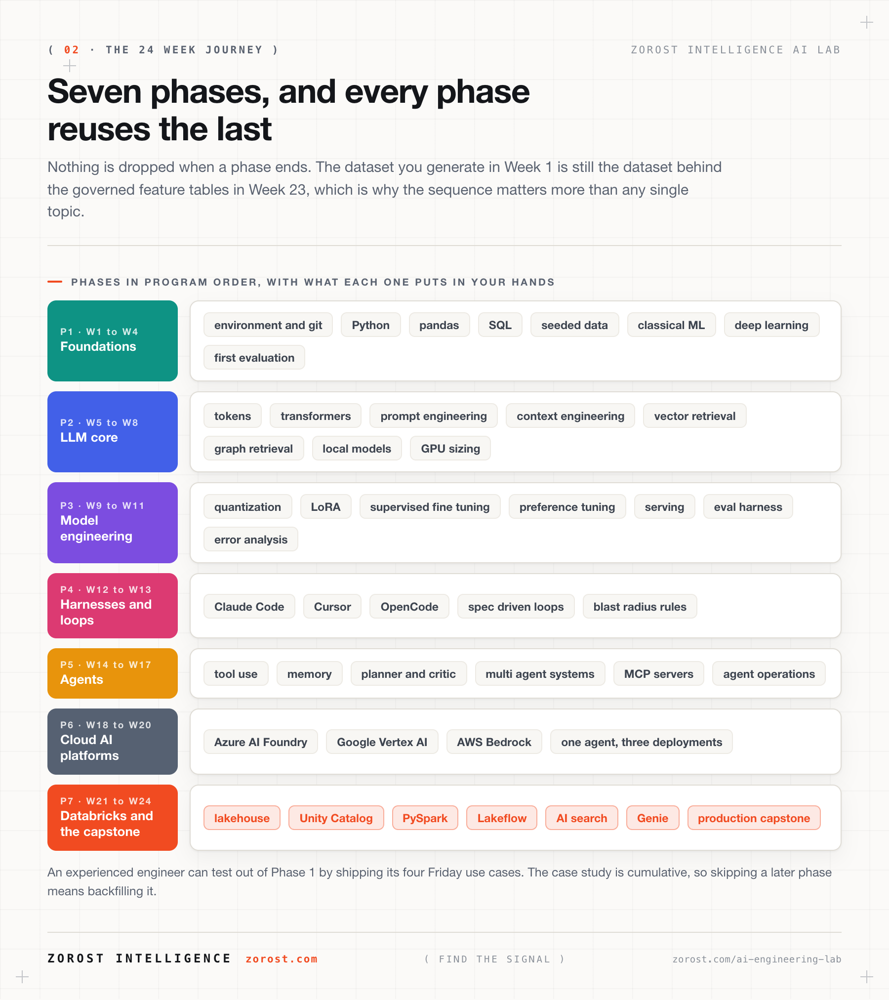
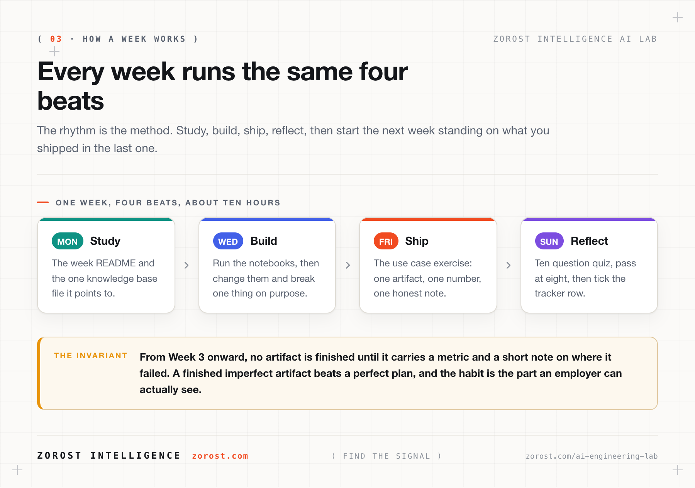
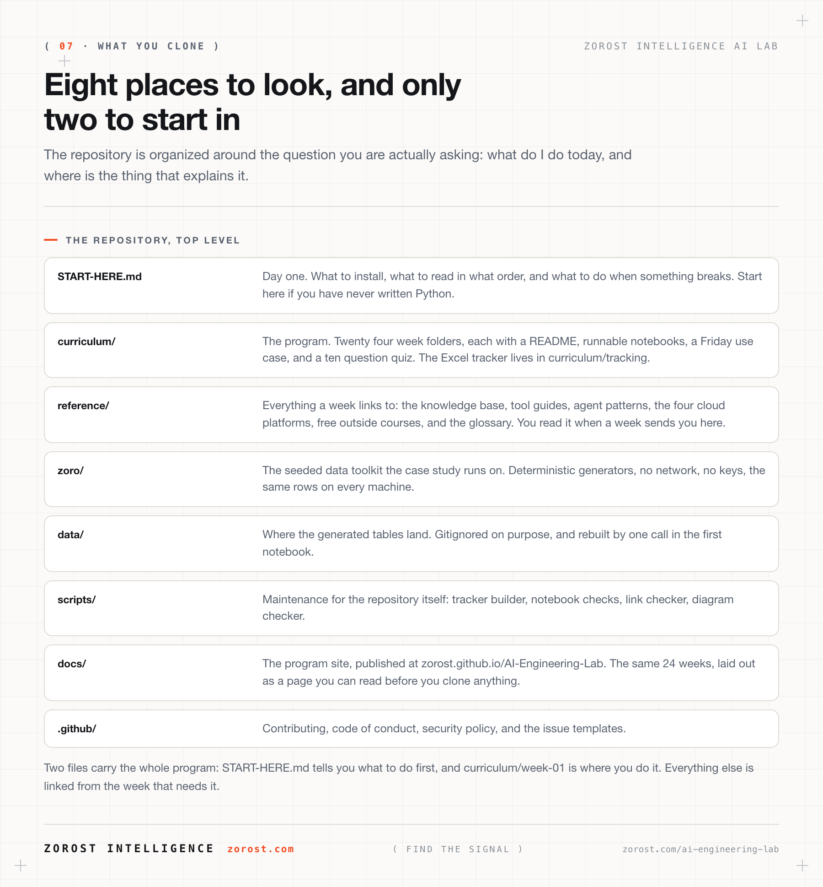

# START HERE: A Complete Beginner's Guide to AI Engineering Lab

> Never written a line of Python? Never touched an LLM API? This page is for you.
> Read it top to bottom once, it takes about 15 minutes, and you will know exactly
> how to start, what to expect, and what to do when you get stuck.
>
> **日本語版:** [START-HERE.ja.md](START-HERE.ja.md)

**Part of AI Engineering Lab · Developed by [Zorost Intelligence AI Lab](https://zorost.com) · zorost.com**

---

## 1. What is this repository?

AI Engineering Lab is a **free, open, self-paced training program** that turns a motivated
beginner into a working AI engineer in **24 weeks** (about 10 hours per week).

"AI engineer" here means someone who can **design, build, evaluate, and ship software
that uses AI**, not someone who invents new model architectures at a research lab. You
will learn how large language models (LLMs) work, how to prompt and evaluate them, how
to run models on your own machine, how to fine-tune them, how to build AI agents, how
to use AI coding tools professionally, and how to deploy everything on real cloud
platforms, ending with a production capstone on Databricks.

Everything is taught through **one continuous fictional case study**: you are the AI
engineering team at **ZoroLogistics**, a freight company. The dataset you generate in
Week 1 is still being used in Week 24, so you finish with a connected portfolio, not
24 unrelated toy demos.

## 2. Who is this for (and do I need to know anything first)?

**You need:**

- A computer you can install software on (Windows, macOS, or Linux all work)
- About **10 hours per week** for 24 weeks (or go slower, it is self-paced)
- Basic computer literacy: installing apps, unzipping files, using a web browser

**You do NOT need:**

- Any programming experience, Week 1 teaches Python from zero
- Any math beyond high-school algebra, every formula is explained in plain language
  with code you can run to *see* it
- A powerful computer or GPU, Weeks 1 to 8 run fine on an ordinary laptop; when GPUs
  matter (Week 8 onward), the program shows free and cheap options
- Money, every tool in Weeks 1 to 13 is free; the cloud weeks (18 to 24) use free tiers,
  and each one tells you exactly how to stay inside them

**This program is a good fit if you are:** a software developer adding AI to your
toolkit, a data analyst moving toward engineering, a student or career-changer, or a
technical founder who wants to build AI features without hand-waving.

**It is probably *not* the right fit if** you want a research career in model
architecture (look at a deep-learning theory course instead) or a 2-hour "prompt
engineering crash course" (this is the opposite of that).

## 3. Your first hour: exact steps

Do these now, in order. Each step links to the details when you need them.

1. **Get the repository onto your computer.**
   - Easiest: click the green **Code** button on the GitHub page → **Download ZIP** →
     unzip it somewhere memorable like `Documents/ai-engineering-lab`.
   - Better (taught in Week 1): install [Git](https://git-scm.com/downloads) and run
     `git clone https://github.com/zorost/AI-Engineering-Lab.git` in a terminal.
2. **Skim the map.** Open [`curriculum/learning-path.md`](curriculum/learning-path.md)
   and look at the diagrams. You are not memorizing anything, just getting the shape
   of the journey.
3. **Open Week 1.** Go to [`curriculum/week-01/README.md`](curriculum/week-01/README.md).
   It walks you through installing Python, VS Code, and Jupyter, the three tools
   everything else runs on, with screenshots-level detail for all three operating
   systems.
4. **Get your progress tracker.** Open
   [`curriculum/tracking/ai-engineering-lab-24-week-tracker.xlsx`](curriculum/tracking/)
   in Excel, Google Sheets, or LibreOffice. Fill in your name and start date. You will
   check off every task as you complete it, the dashboard builds your motivation for you.
5. **Follow the weekly rhythm.** Every week has the same five beats:

   | Beat | When | What you do |
   |---|---|---|
   | **Study** | Mon to Tue | Read the week's README and the linked knowledge-base file |
   | **Build** | Wed to Thu | Run the week's Jupyter notebooks, then modify them |
   | **Ship** | Friday | Complete the use-case exercise, a concrete artifact |
   | **Reflect** | Fri to Sun | Take the 10-question quiz (pass = 8/10), tick off the tracker |

6. **When a term confuses you**, look it up in the [`reference/GLOSSARY.md`](reference/GLOSSARY.md),
   every term in the program is defined there in plain language.

That's it. Week 1 takes it from there, one small step at a time.

## 4. How the pieces fit together (the 60-second mental model)

- **`curriculum/`**: the 24 weeks. This is your main path; everything else supports it.
- **`reference/knowledge-base/`**: the concepts, distilled. Each week links to one of these 14
  files for depth. You can also read them standalone as a reference library.
- **`reference/skills/`**: short how-to cards for specific tools (Claude Code, Cursor, Ollama,
  OpenRouter…). Reach for these the moment you need the exact command.
- **`reference/agents/` and `reference/platforms/`**: deep dives that Weeks 14 to 24 build on.
- **`zoro/` + `data/`**: the ZoroLogistics synthetic-data toolkit. Week 1 shows you
  how to use it; you never need to touch its internals unless you want to.
- **`reference/skills/agent-skills/`**: ready-to-install procedures for AI *agents* (the kind
  of skill a harness loads). You won't need these until Week 12, when you start
  building *with* coding agents.
- **`reference/resources/`**: a curated catalog of free courses from the major AI companies
  (Anthropic, Google, NVIDIA, Hugging Face, and more), each mapped to the program
  weeks it complements.
- **`reference/GLOSSARY.md`**: every technical term in the program, in plain language.
- **`ROADMAP.md` / `CHANGELOG.md`**: where the program is going and what changed.

## 5. The five rules that make this work

1. **Run every notebook yourself.** Reading code is not learning to code. The program
   is built so that the doing *is* the lesson, a notebook you only read teaches you
   about 10% of what it teaches when you run it and break it.
2. **Ship the Friday use case even when it's ugly.** A finished, imperfect artifact
   with a score beats a perfect plan. The score is how you know you're done.
3. **Change one thing at a time.** When something works (or breaks), you want to know
   *which* change did it. This single habit, more than any tool, is what the program
   is really teaching.
4. **When stuck for more than 30 minutes, use the escape hatches** (Section 6).
   Struggling is part of learning; being blocked for days is not.
5. **Keep the tracker honest.** Future-you will make decisions based on that dashboard.
   "Done" means you shipped the artifact, not that you read the page.

## 6. Stuck? The escape hatches, in order

1. **Re-read the error message: the whole thing.** The last line names the problem;
   the lines above it name the place. Beginners stop reading too early.
2. **Check the week's `exercises.md`**: it has a hints section written for exactly
   the failures past learners hit.
3. **Search the [`reference/GLOSSARY.md`](reference/GLOSSARY.md)** if the blocker is a term you don't
   understand.
4. **Ask an AI assistant to explain the error**: paste the full traceback and ask
   "explain this like I'm new to Python." (From Week 12 you'll do this *professionally*
   with coding agents; using one informally from day one is encouraged.)
5. **Open a GitHub Issue** with the week number, what you ran, and the full error.
   The maintainers and other learners watch them.

## 7. Frequently asked questions

**How long does it really take?**
24 weeks at ~10 hours/week is the design point. If you already know Python and SQL,
Weeks 1 to 2 go fast. If you can only give 5 hours a week, take 48 weeks, the cadence
matters more than the calendar.

**Do I need a GPU?**
Not until Week 8, and even then a small model on CPU works for the core exercises.
Week 8 teaches the full landscape: Apple Silicon (Metal), NVIDIA (CUDA), cloud GPUs
by the hour, and free tiers, with a VRAM-sizing method so you can predict what your
hardware can run before you download anything.

**Do I need to pay for API keys?**
No. Every required exercise has a free path: local models (Ollama), free-tier API
routes (OpenRouter `:free` models), or cloud free tiers. Where a paid option is
*noticeably better*, the week says so and tells you the expected cost in dollars.

**Can I skip ahead?**
You can, but the case study is cumulative, Week 9's quantization lab uses Week 8's
local model, which uses Week 7's RAG bot, which uses Week 1's data. If you skip,
expect to backfill. Experienced engineers sometimes test out of Weeks 1 to 4 by doing
the four Friday use cases; if all four are easy, start at Week 5.

**Is this affiliated with Andrew Ng or DeepLearning.AI?**
No. The program is an independent implementation of the publicly described AI
Engineering Skills Map framework (see [`README.md`](README.md#the-framework-behind-the-program)),
researched from public sources and official vendor documentation. All writing is
original Zorost Intelligence work, MIT-licensed.

**What do I get at the end?**
A portfolio you can show: 43 executed notebooks, a fine-tuned model, a RAG agent,
a multi-agent system with its own MCP server, deployments on three clouds, an eval
harness you built yourself, and a governed Databricks lakehouse capstone, plus the
tracker dashboard that proves the journey.

**Something in the repo is wrong or outdated.**
Probably! AI tooling moves fast. That's a contribution opportunity:
[`.github/CONTRIBUTING.md`](.github/CONTRIBUTING.md) explains how to file an issue or open a pull
request. Fixing a stale command *is* part of the training.

---

© 2026 Zorost Intelligence LLC · [zorost.com](https://zorost.com)
