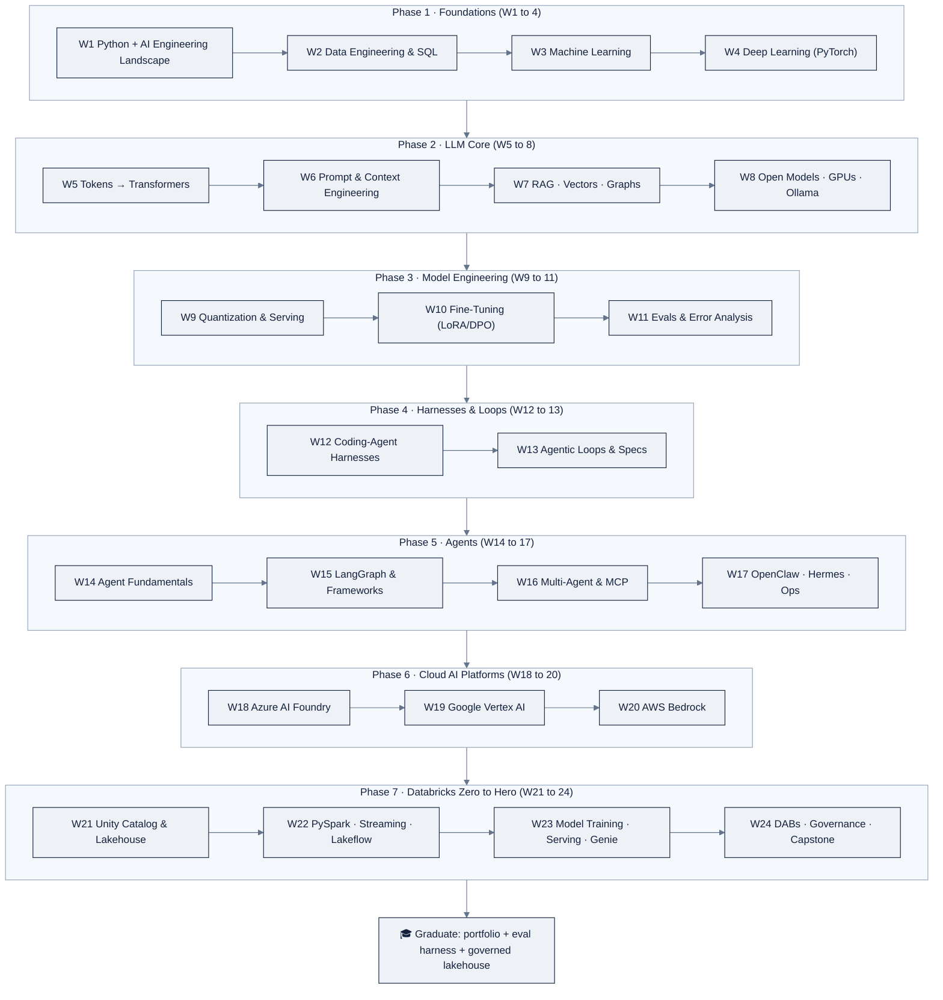
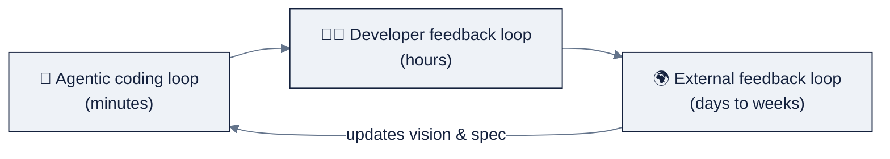

# AI Engineering Lab: Learning Path

The program is one continuous arc, not 24 separate courses. Here is the visual
map, and the skill map underneath it.

## The arc

The same arc as a live diagram (renders on GitHub):

## The skill map underneath (Andrew Ng, *The AI Engineering Skills Map*, 2026)

The four skills are not four separate weeks, they layer on top of each other:

| Ng skill | Primary weeks | You practice it as… |
|---|---|---|
| **Building & deploying AI applications** (blocks + evals/error analysis) | 3 to 11, 14 to 16, 21 to 23 | Every model and agent ships with a metric, an eval, and error analysis |
| **Software engineering fundamentals** (named tradeoffs) | 1 to 2, then every week | Each use case names cost, scale, reliability, speed, security, privacy tradeoffs |
| **Using coding agents** (managed context, verifiers, loops) | 12 to 13, then every week | From Week 12 you build *with* agents: spec, rules file, verifier, loop |
| **Shaping the build** (user, spec, refused tradeoff) | 12 to 13, 24 | Every use case starts with: who is the user, what is the spec, what we refuse |

And the three loops run continuously:

- **Agentic coding loop**: from Week 12: agent writes → tests → you verify against spec.
- **Developer feedback loop**: every Friday use case: you review, steer, and update the spec.
- **External feedback loop**: Weeks 13, 17, 24: share the artifact with someone real,
  capture what breaks, and feed it back into the spec and the evals.

## The ZoroLogistics case study arc

```mermaid
%%{init:{"theme":"base","fontFamily":"Helvetica Neue,Helvetica,Arial,sans-serif","flowchart":{"curve":"basis","padding":14,"nodeSpacing":45,"rankSpacing":55},"themeVariables":{"fontSize":"15px","background":"#FFFFFF","primaryColor":"#EEF2F7","primaryTextColor":"#14213D","primaryBorderColor":"#14213D","secondaryColor":"#FFF1E3","secondaryTextColor":"#14213D","tertiaryColor":"#E7F4F1","tertiaryTextColor":"#14213D","lineColor":"#64748B","textColor":"#14213D","edgeLabelBackground":"#FFFFFF","clusterBkg":"#F5F8FC","clusterBorder":"#94A3B8","nodeBorder":"#14213D","mainBkg":"#EEF2F7","titleColor":"#14213D"}}}%%
flowchart LR
    D["Week 1<br/>Synthetic shipment data"] --> C["Week 2<br/>Clean, profile, SQL"]
    C --> M["Week 3 to 4<br/>ETA prediction (ML → DL)"]
    M --> L["Week 5 to 8<br/>LLM: docs, prompts, RAG, local model"]
    L --> Q["Week 9 to 11<br/>Quantize, fine-tune, evaluate"]
    Q --> A["Week 14 to 16<br/>Support agent + multi-agent team"]
    A --> O["Week 17<br/>OpenClaw personal assistant"]
    O --> X["Week 18 to 20<br/>Same agent on Azure / Google / AWS"]
    X --> DB["Week 21 to 24<br/>ZoroLogistics Lakehouse Intelligence on Databricks"]
```

Every artifact feeds the next phase, the dataset from Week 1 becomes the feature
table in Week 23; the Week 11 eval harness gates the Week 18 cloud deployment.

---
© 2026 Zorost Intelligence LLC · https://zorost.com
