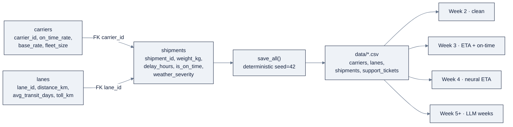

# Week 01: Python基礎とAI Engineeringの全体像

> **日本語版** · [英語版](README.md) · [Week 1の演習](exercises.ja.md) · [Week 1のクイズ](quiz.ja.md)
>
> AI Engineering Labの一部 · [Zorost Intelligence AI Lab](https://zorost.com)が開発 · Week 01 of 24 · Section: Foundations · Category: Python & Environment
> 🎯 **Use case:** seed付きのZoroLogistics synthetic dataset（shipments、carriers、lanes）を生成し、後続の全週で再利用する。

## 問題

ZoroLogisticsには、トラックとは関係なく、これからの23週間すべてに関係する問題があります。**土台にできるdataがない**のです。会社はon-time prediction、ETA model、support triage agent、governed lakehouseを作りたいと考えています。しかしその前に、*信頼できるほど堅牢で、現実的な問題も含むdataset*を用意しなければなりません。「きれいな」demo CSVをdownloadすれば、Week 2でcleanするものがなく、Week 3でdata leakageを見つけられず、Week 11で意味のあるerror analysisもできません。チームメンバーがそれぞれ別のrandom seedでdataを生成すれば、誰も他の人の数字を再現できません。これは、AI projectを始まる前から壊す典型的な「works on my machine」病です。

今週はこのfoundationの問題を3つの方法で解決します。第一に、**reproducible environment**を整えます。interpreterとdependenciesを固定し、cleanなGit workflowを使うことで、「自分の環境で動く」を「forkをcloneした見知らぬ人でも動く」に変えます。第二に、`zoro/data.py`のseed付きgeneratorから **100,000行のZoroLogistics dataset** を生成します。後の週で実際に作業できるよう、duplicates、`NaN` weights、`NaN` lane distancesというdata-quality flawを意図的に埋め込んでいます。第三に、**data dictionary**をshipします。これは各columnの意味を見知らぬ人に伝える、人が読めるschemaです。この週がなければ、後の週は砂の上のdemoになります。この週を終えれば、プログラム全体が使い回す **configuration baseline**（同じseed、同じ会社）を自分で管理できます。

## 目標

- [ ] 金曜日までに、reproducibleなPython environment（uvまたはconda）を構築し、environment-check notebookを合格させる。readiness scoreは6/6。
- [ ] 金曜日までに、repoをfork・cloneし、branchを作成してcommitし、GitHubでpull requestを開ける。
- [ ] 固定seedで `zoro.data` から100,000行のZoroLogistics datasetを生成し、AI workでdeterminismが不可欠な理由を説明できる。
- [ ] 生成された全columnについて、名前、dtype、business meaningを記載したdata dictionaryをshipする。見知らぬ人が読める成果物にする。

## 日ごとの計画

| Day | Study | Run | Ship | Time |
|---|---|---|---|---|
| **Mon** | [`reference/knowledge-base/01-ai-engineering-discipline.md`](../../reference/knowledge-base/01-ai-engineering-discipline.md)を読む。VS Code、Python（uv/conda）、Gitを設定する | repoをfork・cloneし、working branchを作成する | 自分のforkでgreenな `git status` | 約2.5時間 |
| **Tue** | Python refresher：types、functions、classes、collections、comprehensions | `01-environment-and-tools.ja.ipynb` のNumPy cell（array、broadcast、mask）を実行する | refresher cellsをエラーなく実行する | 約2時間 |
| **Wed** | seedの習慣とreproducibility | environment-check notebookを最初から最後まで実行する | readiness scoreを記録する（6/6を目指す） | 約1.5時間 |
| **Thu** | synthetic data generation。`zoro/data.py` のschemaを読む | `02-zorologistics-data-generator.ja.ipynb` のpreview cellsを実行する | 各tableを1件以上preview表示する | 約2時間 |
| **Fri** | data dictionaryとinspectable artifact | `save_all()` → `data/`。`data-dictionary.md`を書く | datasetとdictionaryをcommitし、PRを開く | 約3時間 |
| **Sat** | 週の復習 | quiz（`quiz.ja.md`、8/10で合格）を受ける | scoreをNotesに記録する | 約45分 |

## 概念

今週は新しいsyntaxを大量に覚える週ではなく、**discipline**を身につける週です。先に [`reference/knowledge-base/01-ai-engineering-discipline.md`](../../reference/knowledge-base/01-ai-engineering-discipline.md) を読んでください。これはprogram全体の背骨です。覚える一文はこれです：*AI outputは予測できない。* LLMが何を返すか、training済みmodelが新しいexampleに何をpredictするかは分かりません。Zorostの方法はこの事実への回答です。**metricをshipし、error analysisをshipし、制御できるrandom drawをすべてreproducibleにする。** そうすればmetricが明日も同じ意味を持ちます。

### 1. AI engineerとは：4つのskillと3つのloop

Andrew Ngの *AI Engineering Skills Map* は **4つのskill** を挙げています。(1) AI applicationのbuildingとdeployment、(2) software engineering fundamentals、(3) coding agentの利用、(4) buildの方向付けです。これは4つの別々のcourseではなく、毎週適用する4つの視点です。Week 1は主にskill 2、fundamentalsにあたります。Zorostがskill 2をさらに明確に表現すると、coding agentがcodeを書くとき、90秒で100個ものtradeoffが決まり、reviewしなければならない完成diffとして返ってきます。**実行できないものはreviewできません。** また、reproduceできないものは実行できません。だからenvironmentを先に整えます。

Ngは0-to-1のproduct buildingを、異なる時間軸で回る **3つのloop** として捉えています（完全な表はdiscipline fileを参照）。

| Loop | Cadence | 起きること |
|---|---|---|
| Agentic coding | 数分 | agentがcodeを書き、testを実行し、spec/evalがpassするまでiterateする |
| Developer feedback | 数分〜数時間 | 人間がproductを調べ、featureとflowの方向を決める |
| External feedback | 数時間〜数週間 | real userの反応でvisionが更新され、specも更新される |

Week 12〜13で、この3つのloopをmental modelとして使います。今週はloop 2の最小版、つまり自分でenvironmentとdataをreviewするところから始めます。

### 2. ZoroLogisticsのcase studyとprogram map

**ZoroLogistics**は架空のfreight companyです。Zorostが実際に関わる、規制とtraceabilityを重視する業界をモデルにしています（discipline fileの「Use case connection」を参照）。その世界は `zoro/data.py` の7つのgenerator、`carriers()`、`lanes()`、`shipments()`、`support_tickets()`、`policy_docs()`、`bol_samples()`、`save_all()` にあります。3つのcore tableは、programの残りで何度もjoinするrelational shapeを作ります。

shipmentsはdenormalizeしたtextではなく、**foreign key**（`carrier_id`、`lane_id`）を持ちます。このjoin構造をWeek 2のSQLで利用します。各tableをboundaryとcontractとして扱うのは、Zorostのsystems-engineering spineを小さく体験することでもあります。

| Generator | 生成するもの | 主なcolumn | Rows（seed 42） |
|---|---|---|---|
| `carriers(20, seed=7)` | carrier master | `carrier_id`、`on_time_rate`、`base_rate_usd_per_km_ton`、`fleet_size` | 20 |
| `lanes(20, seed=11)` | route master | `lane_id`、`origin`、`destination`、`distance_km`、`avg_transit_days` | 20 |
| `shipments(100_000, seed=42)` | fact table | `shipment_id`、`carrier_id`、`lane_id`、`delay_hours`、`is_on_time`、`weather_severity` | 100,200 |
| `support_tickets(2_000, seed=99)` | support ticket | `ticket_id`、`shipment_id`、`category`、`priority`、`text` | 2,000 |

### 3. Environment：VS Code、uv/conda、Jupyter

**pinned environment**は、すべてを支える床です。`uv`（またはconda）は、lockfile付きのisolated interpreterを作ります。これがないと「works on my machine」に隠れたdependency差分が、Week 1ではなくWeek 23で現れます。environment-check notebookは、これを **測れるgate** にします。Python ≥3.10、`numpy` と `zoro` のimport、Gitが存在しwork tree内にいることを確認し、**6点満点のreadiness score**を表示します。数字が6でなければ何かが壊れています。Jupyter（またはVS Codeのnotebook interface）は、全週のlabを実行するruntimeです。

### 4. GitとGitHub：fork、branch、commit、PR

Gitは、**自分のwork**にとってのreproducibility layerです。dataにとってseedが果たす役割と同じです。24週間繰り返すworkflowは、repoを **fork**し、forkを **clone**し、変更ごとに **branch**を作り、意味のあるmessageで **commit**し、pushして **pull request**を開くことです。Week 1のnotebookにあるGit check（`git rev-parse --is-inside-work-tree`、`git branch --show-current`）は、金曜日にgenerated datasetをcommitする前の最低限の確認です。

### 5. PythonとNumPyの基礎

このprogramのほぼすべてのmodelは、多次元arrayを通ります。実務の90%をカバーする4つの動作は、arrayを作る、`shape`/`dtype`を調べる、axisに沿ってreduceする、そして **broadcast**（小さなarrayを対応するaxisで大きなarrayに合わせる）です。

refresherでは、typesとfunctions、classes（Week 4で`nn.Module`というclassに出会います）、collections、**comprehensions**を扱います。その上に、生成dataをdiskへ書き、Week 2で再読み込みするためのfiles、JSON、CSVがあります。

generator notebookには、これらをつなぐ具体的な流れがあります。**list comprehension**で25個のrowからなるdata dictionary（`[(table, column, dtype, meaning) for ...]`）を作り、pandasでMarkdownに書き出し、`save_all()`で各tableを`to_csv`にserializeします。同じloopでmemory上に作り、diskへserializeし、翌週reloadする。これがprogram全体のdata lifecycleです。DataFrame内では`delay_hours`、`weight_kg`、`value_usd`がNumPy arrayとして動き、Week 2の`.mean()`、`.median()`、boolean castは、それらのarrayへのNumPy reductionです。

### 6. deterministic seed付きのsynthetic data generation

**seed**は、pseudorandom generatorが毎回同じsequenceを出すようにする固定integerです。現代的な書き方は `numpy.random.default_rng(seed)` で、legacyのglobal `np.random.seed`に代わるものです。`zoro/data.py` のgenerator functionはseedを受け取り、`shipments(100_000, seed=42)`はどのmachineでも同じdataを生成します。

**実例1：seedのcontract。** environment notebookの `first_five(seed)` は、`default_rng(seed).integers(0, 1_000_000, size=5)`で5つのintegerを生成します。seed `42`では `[89250, 773956, 654571, 438878, 433015]` になり、2回呼んでも同じです。seed `7`では `[944904, 625095, 684179, 897213, 578292]` になります。同じseedなら同じdata、異なるseedなら異なるdataです。この単純な事実により、見知らぬ人がWeek 23であなたのforkを再実行し、同じ数字を得られます。

| Approach | Reproducibility | Thread safety | 判定 |
|---|---|---|---|
| `np.random.seed(42)`（legacy） | fragile。hidden globalの順序をlibrary callが変えられる | unsafe | 避ける |
| `numpy.random.default_rng(seed)` | solid。local generatorがsequenceを再生する | safe | これを使う |

**実例2：data volumeの予算。** seed `42`で`save_all()`を実行すると、4つのtableができます。carriers 20行、lanes 20行、shipments 100,200行、support tickets 2,000行、合計 **102,240行** です。shipmentが100,000行ではないのは、generatorがdata-quality issueを意図的に仕込むためです。`df.sample(frac=0.002)`で **200行のduplicate**を追加し、0.3%のsampleで **301個の`weight_kg`を空**にします。lanesには別の問題があり、20 laneの5%をsampleして **1個の`distance_km`を空**にします。これがWeek 2の探索場所です。先に見ておくことで、cleaningが驚きではなくhuntになります。

## うまくいかない理由

**global seed**が入り込んだ瞬間にreproducibilityは壊れます。`np.random.seed(42)`はhidden globalなので、library callが順番を変えると2回の同じrunが分岐します。notebookのcellを順番どおりに実行しない、途中のcellで再seedする、`save_all()`のrelative pathがnotebook folderを基準に解決される、こうした場合も壊れます。generator notebookが`zoro/` directoryまで親をたどるのは、repo rootを見つけるためです。「realism」のために`datetime.now()`やclock依存のrandomnessを使うのも、findingを再現できなくします。さらにlockfileのないenvironmentは後で壊れます。dependencyが静かにupdateされ、modelの挙動が変わっても、Git historyには差分が残りません。

4つの問題へのfixは同じです。すべてをseedし、pathをrepo rootに解決し、environmentをpinします。このdisciplineを今週身につけます。さらに深く学ぶときは、discipline fileの「four skills」「three loops」、そしてconfiguration baselineが必要な理由を説明する「systems-engineering spine」を読んでください。

## Notebook walkthrough

**`notebooks/01-environment-and-tools.ja.ipynb`** は6つのcheckを行うself-testです。最初のcellで、walk-up loopを使ってrepo rootを`sys.path`に追加します。**Check 1**はPython 3.10+、**Check 2**は`numpy`と`zoro`（`zoro.__version__`も表示）を確認します。**Check 3**は7つの`zoro.data` generatorが存在し、`carriers(20, seed=7)`が期待したcolumnを返すかを確認します。**Check 4**は`git --version`、`git rev-parse --is-inside-work-tree`、`git branch --show-current`をshellから実行します。NumPy refresher cellでは`(3, 4)` arrayを作り、column meanを計算し、`(4,)` offsetをbroadcastし、`> 5`のelement数を数えます。seed cellは`first_five(42)`を2回実行しdeterminismを証明します。最後のcellが6つのflagを合計し、**`READINESS_SCORE`**を表示します。これが記録する数字です。

**`notebooks/02-zorologistics-data-generator.ja.ipynb`** は3つのcore table（`carriers(20, seed=7)`、`lanes(20, seed=11)`、`shipments(2_000, seed=42)`）をpreviewし、`weight_kg`、`value_usd`、`delay_hours`の`dtypes`と`describe()`を表示します。その後 `data.save_all(out_dir=repo/"data", seed=42, n=100_000)` を呼び、`data/data-dictionary.md`を25個の`(table, column, dtype, meaning)` tupleから作ります。verification cellはCSVをreloadしてrow countをassertし、3つのplanted issue（duplicate、`NaN` weight、`NaN` distance）の数を表示します。最後は **`TOTAL_ROWS_GENERATED`**、default seedでは102,240を表示します。「正しい」出力は、readiness scoreが6、4つのassertがpass、totalが一致することです。

notebookを変更するときは、`zoro/data.py`ではなく **inputだけ**を変更します。Standard exerciseでは`data.save_all(...)`の`seed`と`n`（およびpreview cell）を変えます。schemaは固定されたまま、valuesが変わります。Portfolio exerciseではdictionary listを拡張するか、`df.dtypes`からprogrammatically再生成してschema driftを防ぎます。environment notebookのcellはread-onlyのcheckです。変更するのはenvironmentだけで、readiness scoreが反応します。verification cellのassertが失敗したら、別seedで再生成したか、`data/`に余計なfileが入っています。seed 42で`save_all()`を再実行して確認してください。

## Use case（Friday）

**Deliverable:** (a) score 6のgreenなenvironment-check notebook、(b) generated `data/` directory（100,000件以上のshipment、carriers、lanes、tickets、すべてseed付き）、(c) 全columnを記載した`data/data-dictionary.md`を含むworking forkです。

**Zorost gate:** 見知らぬ人があなたのforkをcloneし、同じseedで`python -m zoro.data`（またはgenerator notebook）を実行して同じrow countを得られること。また、どのseedがどのtableを作り、planted data-quality issueがどこにあり、各columnがfreightの何を意味するかを1行ずつ説明できること。seedがなければshipできません。

**Stretch variant:** CSVだけの`save_all()`を、Parquet（`ships.to_parquet(...)`）も書き出す版にします。また各tableのdtypeからprogrammatically `schema.json`を作り、data dictionaryを手書きではなく生成します。

## よくあるpitfall

| Pitfall | なぜ起きるか | Fix |
|---|---|---|
| readiness scoreが6未満で止まる | `zoro`が`sys.path`にない、またはGit未導入・work tree外 | walk-up path cellを実行する。実際のrepoで`git init`/cloneし、各FAIL行を読む |
| legacy `np.random.seed` | tutorial由来の古い習慣 | `numpy.random.default_rng(seed)`を使う。modernでlocal、thread-safe |
| `data/`が間違ったfolderに書かれる | `save_all()`がcwdを基準にresolveする | notebookと同じくrepo rootを見つけて`out_dir`をresolveする |
| non-deterministicな「realism」 | realisticに見せるため`datetime.now()`やunseeded RNGを使う | generatorには必ずseedを渡す。realismはclockではなくdistributionで作る |
| `data/`のbloatやsecretをcommitする | `.gitignore`を忘れた、`.env`をcommitした | generated CSVをcurriculum folderに置かない。keyを決してcommitしない |
| 「works on my machine」 | interpreter/dependenciesがunpin | lockfile付きのuv/condaを使い、environment checkにversionを記録する |
| datasetをcopyしてgenerationを省略する | reproducibility lessonを回避している | seed付きで`zoro.data`から必ず再生成する。CSVはsourceではなくcache |

## Glossary

- **Seed**: pseudorandom generatorが毎回同じsequenceを再現する固定integer。
- **Determinism**: 同じinput（とseed）なら、runごとに同じoutputになる性質。
- **Reproducibility**: 見知らぬ人があなたのworkを再実行して同じ数字を得られること。determinismとpinned environmentの組み合わせ。
- **`default_rng`**: NumPyのmodernでlocal、thread-safeなrandom generator factory。
- **Foreign key**: 別tableのprimary keyを参照するcolumn（例：`shipments.carrier_id`）。
- **Data dictionary**: 各columnをdtypeとbusiness meaningに対応付けた、人が読めるmap。
- **Configuration baseline**: 後のworkが積み上がる、正確に記録されたstate（data、version、seed）。
- **Fork / clone / branch / PR**: shared repoへcontributeするためのGit workflow。
- **Readiness score**: environment notebookの0〜6のself-check。6は「buildの準備完了」を意味する。
- **Synthetic data**: real PIIを使わず、実データの構造と問題をまねてprogrammatically生成するdata。

## Self-check（quiz）

[`quiz.ja.md`](quiz.ja.md) を開き、10問すべてに答えます。合格ラインは **8/10** です。各問題には、対応するConceptsのsubsectionまたはnotebook cellが記載されています。

## Exercises

4つのgraded exerciseがあります。**Easy**（environment checkを実行してscoreを記録）、**Standard**（別seedで小さなdatasetを再生成しschemaが安定していることを証明）、**Stretch**（clean shellからstandalone `generate_small.py`を実行）、**Portfolio**（generator outputとdata dictionaryをprogram最初のinspectable artifactとしてcommit）です。各hintは [`exercises.ja.md`](exercises.ja.md) にあります。

## Sources

- NumPy random generator（`Generator`、`default_rng`）：https://numpy.org/doc/stable/reference/random/generator.html
- NumPy documentation：https://numpy.org/doc/stable/
- pandas documentation：https://pandas.pydata.org/docs/
- Python environment tooling（uv）：https://docs.astral.sh/uv/
- Git documentation：https://git-scm.com/doc
- GitHub flow（fork、branch、commit、PR）：https://docs.github.com/en/get-started/using-git/about-git
- Andrew Ng, *The AI Engineering Skills Map*, The Batch issue 366：https://www.deeplearning.ai/the-batch/issue-366
- Andrew Ng, *Three Key Loops for Building Great Software*：https://www.deeplearning.ai/the-batch/three-key-loops-for-building-great-software
- Fereydun Hashemi（Zorost）, *The AI Engineering Skills Map, turned into a training plan*：https://zorost.com/ai-engineering-skills-map-training-guide
- Zorost Intelligence：https://zorost.com
