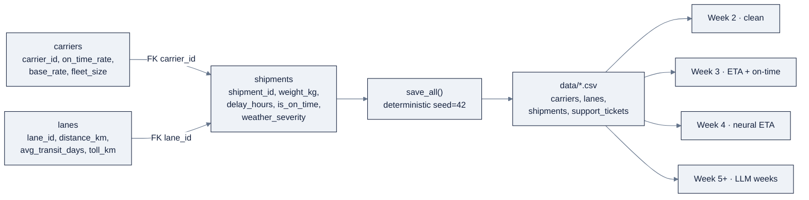

# Week 01: Python Foundations & the AI Engineering Landscape

> **日本語版:** [README.ja.md](README.ja.md)
>
> Part of AI Engineering Lab · Developed by Zorost Intelligence AI Lab · Week 01 of 24 · Section: Foundations · Category: Python & Environment
> 🎯 Use case: Generate the seeded ZoroLogistics synthetic dataset (shipments, carriers, lanes) that every future week reuses.

## The problem

ZoroLogistics has a problem that has nothing to do with trucks and everything to do with the next 23 weeks: **there is no data to build on.** The company wants on-time prediction, an ETA model, a support triage agent, and a governed lakehouse, but before any of that, someone has to produce a dataset that is *reliable enough to trust and flawed enough to be realistic.* If you download a "clean" demo CSV, Week 2 has nothing to clean, Week 3 has nothing to leak, and Week 11 has no error analysis worth writing. If every team member generates the data with a different random seed, nobody can reproduce anyone else's numbers, the classic "works on my machine" disease that kills AI projects before they start.

This week you solve the foundation problem three ways. First, you stand up a **reproducible environment**, pinned interpreter, pinned dependencies, a clean Git workflow, so that "runs for me" becomes "runs for a stranger who clones my fork." Second, you generate the **100,000-row ZoroLogistics dataset** from the seeded generators in `zoro/data.py`, with the data-quality flaws (duplicates, `NaN` weights, `NaN` lane distances) deliberately planted so later weeks have real work. Third, you ship a **data dictionary**, a human-readable schema that tells a stranger what every column means. Without this week, every later week is a demo built on sand. With it, you own the *configuration baseline* that the whole program reuses: same seed, same company.

## Objectives

- [ ] By Friday you can stand up a reproducible Python environment (uv or conda) and prove it with a passing environment-check notebook whose readiness score is 6/6.
- [ ] By Friday you can fork and clone the repo, create a branch, commit, and open a pull request on GitHub.
- [ ] By Friday you can generate the 100,000-row ZoroLogistics dataset from `zoro.data` under a fixed seed, and explain why determinism is a non-negotiable for AI work.
- [ ] By Friday you can ship a data dictionary that names every generated column, its dtype, and its business meaning, an artifact a stranger can read.

## Day-by-day plan

| Day | Study | Run | Ship | Time |
|---|---|---|---|---|
| **Mon** | Read [`reference/knowledge-base/01-ai-engineering-discipline.md`](../../reference/knowledge-base/01-ai-engineering-discipline.md); set up VS Code, Python (uv/conda), and Git | Fork + clone the repo; create a working branch | A green `git status` on your own fork | ~2.5 h |
| **Tue** | Python refresher: types, functions, classes, collections, comprehensions | `01-environment-and-tools.ipynb` NumPy cell (array, broadcast, mask) | Run the refresher cells without errors | ~2 h |
| **Wed** | The seed habit and reproducibility | Run the environment-check notebook end-to-end | Readiness score recorded (aim for 6/6) | ~1.5 h |
| **Thu** | Synthetic data generation; read `zoro/data.py` schemas | `02-zorologistics-data-generator.ipynb` preview cells | One-of-each-table preview printed | ~2 h |
| **Fri** | Data dictionaries and inspectable artifacts | `save_all()` → `data/`; write `data-dictionary.md` | Commit the dataset + dictionary; open a PR | ~3 h |
| **Sat** | Review the week | Take the quiz (`quiz.md`, 8/10 to pass) | Record the score in Notes | ~45 min |

## Concepts

This week is less about new syntax and more about installing a **discipline**. Read [`reference/knowledge-base/01-ai-engineering-discipline.md`](../../reference/knowledge-base/01-ai-engineering-discipline.md) first, it is the spine of the whole program, and the one sentence to internalize is this: *AI outputs are unpredictable.* You do not know what an LLM will return, and you do not know what a trained model will predict on a new example. The entire Zorost method is a response to that fact: **ship a metric, ship an error analysis, and make every random draw reproducible** so the metric means the same thing tomorrow.

### 1. What an AI engineer is: four skills, three loops

Andrew Ng's *AI Engineering Skills Map* names **four skills**: (1) building and deploying AI applications, (2) software engineering fundamentals, (3) using coding agents, and (4) shaping the build. They are not four courses; they are four lenses applied to every week. Week 1 lives mostly in skill 2, the fundamentals. Zorost's sharper version of skill 2 is worth repeating: when a coding agent writes code, a hundred tradeoffs are made in ninety seconds and handed back as a finished diff. **Reviewing that requires more fluency than writing it did.** You cannot review what you cannot run, and you cannot run what you cannot reproduce, which is why the environment comes first.

Ng also frames 0-to-1 product building as **three loops on different clocks** (see the discipline file for the full table):

| Loop | Cadence | What happens |
|---|---|---|
| Agentic coding | minutes | An agent writes code, runs tests, iterates until spec/evals pass |
| Developer feedback | minutes to hours | A human examines the product and steers features and flow |
| External feedback | hours to weeks | Real users; updates your vision, which updates the spec |

The three loops are the mental model for Weeks 12 to 13. This week you run the smallest version of loop 2: a human (you) reviewing your own environment and data.

### 2. The ZoroLogistics case study and the program map

**ZoroLogistics** is a fictional freight company modeled on the regulated, traceability-first industries Zorost actually serves (see the discipline file's "Use case connection"). Its world lives in `zoro/data.py` as seven generators: `carriers()`, `lanes()`, `shipments()`, `support_tickets()`, `policy_docs()`, `bol_samples()`, and `save_all()`. The three core tables form a relational shape you will rejoin for the rest of the program:

Shipments store **foreign keys** (`carrier_id`, `lane_id`), not denormalized text, that join structure is exactly what Week 2's SQL exploits, and it is a small taste of the "interface control" Zorost's systems-engineering spine demands: each table is a boundary with a contract.

| Generator | Produces | Key columns | Rows (seed 42) |
|---|---|---|---|
| `carriers(20, seed=7)` | Carrier master | `carrier_id`, `on_time_rate`, `base_rate_usd_per_km_ton`, `fleet_size` | 20 |
| `lanes(20, seed=11)` | Route master | `lane_id`, `origin`, `destination`, `distance_km`, `avg_transit_days` | 20 |
| `shipments(100_000, seed=42)` | The fact table | `shipment_id`, `carrier_id`, `lane_id`, `delay_hours`, `is_on_time`, `weather_severity` | 100,200 |
| `support_tickets(2_000, seed=99)` | Support tickets | `ticket_id`, `shipment_id`, `category`, `priority`, `text` | 2,000 |

### 3. Environments: VS Code, uv/conda, Jupyter

A **pinned environment** is the floor under everything. `uv` (or conda) creates an isolated interpreter with a lockfile; without it, "works on my machine" hides a real dependency difference that will surface in Week 23, not Week 1. The environment-check notebook turns this from advice into a **measurable gate**: it checks Python ≥3.10, imports `numpy` and `zoro`, confirms Git is present and you are inside a work tree, and prints a **readiness score out of 6**. Either the number is 6, or something is broken. Jupyter (or VS Code's notebook interface) is the runtime for every week's labs.

### 4. Git & GitHub: fork, branch, commit, PR

Git is the reproducibility layer for *your work* the way seeds are for *your data*. The workflow you'll repeat for 24 weeks: **fork** the repo, **clone** your fork, create a **branch** per change, **commit** with a meaningful message, push, and open a **pull request**. The notebook's Git check (`git rev-parse --is-inside-work-tree`, `git branch --show-current`) is the bare minimum before the Friday use case, where you commit the generated dataset.

### 5. Python and NumPy fundamentals

The refresher covers the four moves that cover 90% of real use: types and functions, classes (you'll meet `nn.Module` as a class in Week 4), collections, and **comprehensions**. On top of those sit the NumPy moves that every model in this program flows through: create an array, inspect its `shape`/`dtype`, reduce along an axis (`a.mean(axis=0)`), and **broadcast** (align a smaller array against a larger one along a matching axis). Files, JSON, and CSV handling are how the generated data lands on disk and how Week 2 reloads it.

A concrete thread ties all of this together inside the generator notebook: a **list comprehension** builds the 25-row data dictionary (`[(table, column, dtype, meaning) for ...]`), pandas writes it to Markdown, and `save_all()` serializes each table with `to_csv`. The same loop, build in memory, serialize to disk, reload next week, is the entire data lifecycle of the program. NumPy sits underneath it all: once inside a DataFrame, `delay_hours`, `weight_kg`, and `value_usd` are NumPy arrays, and Week 2's `.mean()`, `.median()`, and boolean casts are all NumPy reductions over those arrays.

### 6. Synthetic data generation with deterministic seeds

A **seed** is a fixed integer that makes a pseudorandom generator emit the same sequence on every run and every machine. The modern form is `numpy.random.default_rng(seed)`; it replaced the legacy global `np.random.seed`. The generator functions in `zoro/data.py` take a seed so that `shipments(100_000, seed=42)` is byte-identical everywhere.

**Worked example 1: the seed contract.** The environment notebook's `first_five(seed)` function draws five integers from `default_rng(seed).integers(0, 1_000_000, size=5)`. With seed `42` it returns `[89250, 773956, 654571, 438878, 433015]`, and it returns the *same five numbers* on the second call. Seed `7` returns `[944904, 625095, 684179, 897213, 578292]`. Same seed → same data; different seed → different data. That single fact is what lets a stranger re-run your fork in Week 23 and get your numbers.

| Approach | Reproducibility | Thread safety | Verdict |
|---|---|---|---|
| `np.random.seed(42)` (legacy) | Fragile, a hidden global any library call can re-order | Not safe | Avoid |
| `numpy.random.default_rng(seed)` | Solid, a local generator replays its sequence | Safe | Use everywhere |

**Worked example 2: the data volume budget.** `save_all()` under seed `42` produces four tables: 20 carriers, 20 lanes, 100,200 shipments, and 2,000 support tickets, **102,240 total rows**. The shipment count is *not* 100,000 because the generator deliberately plants data-quality issues: `df.sample(frac=0.002)` concatenates **200 duplicate rows** (~0.2%), and a 0.3% sample blanks **301 `weight_kg` values**. Lanes get their own flaw: `lanes_df.sample(frac=0.05)` blanks **1 `distance_km`** (5% of 20 lanes). These planted defects are Week 2's hunting grounds, seeing them now makes cleaning a *hunt*, not a surprise.

### How it breaks

Reproducibility breaks the moment a **global seed** sneaks back in: `np.random.seed(42)` is a hidden global that any library call can re-order, so two "identical" runs diverge. It also breaks when a notebook cell is run out of order (a cell that re-seeds mid-flow), when `save_all()` writes to a relative path resolved against the *notebook folder* instead of the repo root (the generator notebook walks up to the `zoro/` directory precisely to avoid this), and when someone "improves" the generator to use `datetime.now()` or wall-clock randomness for realism, realism that destroys the ability to reproduce a finding. Finally, an environment without a lockfile breaks *later*: a silently-updated dependency changes a model's behavior and the diff is invisible in your Git history. The fix for all four is the same discipline this week installs: seed everything, resolve paths to the repo root, and pin the environment.

For deeper dives: the discipline file's "four skills" and "three loops" sections, and the "systems-engineering spine" for why a configuration baseline matters.

## Notebook walkthrough

**`notebooks/01-environment-and-tools.ipynb`** is a six-check self-test. The first cell inserts the repo root onto `sys.path` with a defensive walk-up loop, then **Check 1** verifies Python 3.10+ and **Check 2** imports `numpy` and `zoro` (it prints `zoro.__version__`). **Check 3** confirms all seven `zoro.data` generators exist and that `carriers(20, seed=7)` returns rows with the expected columns. **Check 4** shells out to `git --version`, `git rev-parse --is-inside-work-tree`, and `git branch --show-current`. The NumPy refresher cell builds a `(3, 4)` array, computes column means, broadcasts a `(4,)` offset, and counts elements `> 5`. The seed cell runs `first_five(42)` twice to prove determinism. The final cell sums six flags and prints **`READINESS_SCORE`**, the number you record.

**`notebooks/02-zorologistics-data-generator.ipynb`** previews the three core tables (`carriers(20, seed=7)`, `lanes(20, seed=11)`, `shipments(2_000, seed=42)`), prints their `dtypes` and a `describe()` of `weight_kg`, `value_usd`, and `delay_hours`, then calls `data.save_all(out_dir=repo/"data", seed=42, n=100_000)`. It emits `data/data-dictionary.md` from a hard-coded list of `(table, column, dtype, meaning)` tuples, 25 column definitions. The verification cell reloads the CSVs and asserts the row counts, then prints the three planted-issue counts (duplicates, `NaN` weights, `NaN` distances). The final cell prints **`TOTAL_ROWS_GENERATED`**, 102,240 under the default seed. "Correct" output means the readiness score is 6, the four asserts pass, and the total matches.

To adapt the notebooks, modify only the *inputs*, never `zoro/data.py` itself. The Standard exercise changes the `seed` and `n` arguments in the `data.save_all(...)` call (and the preview cells), the schema stays fixed while the values shift. The Portfolio exercise extends the dictionary list in the "data dictionary" cell, or better, regenerates it programmatically from `df.dtypes` so it can't drift from the schema. The environment notebook's cells are read-only checks; the only thing you change there is your *environment*, so the readiness score responds. If the verification cell's asserts ever fail, you've either regenerated with a different seed or a stray file landed in `data/`, re-run `save_all()` with seed 42 and re-check.

## The use case (Friday)

**Deliverable:** a working fork with (a) a green environment-check notebook (score 6), (b) the generated `data/` directory (100,000+ shipments plus carriers, lanes, and tickets, all seeded), and (c) a `data/data-dictionary.md` naming every column.

**Zorost gate:** a stranger can clone your fork, run `python -m zoro.data` (or the generator notebook) with the same seed, and get the same row counts, and you can show them, line by line, *what the generator did*: which seed produced which table, where the planted data-quality issues live, and what each column means in freight terms. No seed, no ship.

**Stretch variant:** replace the CSV-only `save_all()` call with a version that also writes Parquet (`ships.to_parquet(...)`), and add a `schema.json` describing each table's dtypes programmatically from `df.dtypes`, so the data dictionary is generated, not hand-typed.

## Common pitfalls

| Pitfall | Why it happens | Fix |
|---|---|---|
| Readiness score stuck below 6 | `zoro` not on `sys.path`, or Git not installed/outside a work tree | Run the walk-up path cell; `git init`/clone into a real repo; read each FAIL line |
| Legacy `np.random.seed` | Old habits from tutorials | Use `numpy.random.default_rng(seed)`; it is the modern, local, thread-safe form |
| `data/` written to the wrong folder | `save_all()` resolves `out_dir` relative to cwd | Resolve `out_dir` against the repo root (walk up to `zoro/`), as the notebook does |
| Non-deterministic "realism" | Using `datetime.now()` or unseeded RNG to look realistic | Every generator takes a seed; realism comes from distributions, not wall-clock randomness |
| Committing `data/` bloat or secrets | Forgetting `.gitignore`; committing `.env` | Keep the generated CSVs out of the *curriculum* folder; never commit keys |
| "Works on my machine" | Unpinned interpreter/dependencies | Use uv/conda with a lockfile; record versions in the environment check |
| Copying the dataset instead of generating it | Bypassing the reproducibility lesson | Always regenerate from `zoro.data` under the seed; the CSV is a *cache*, not the source |

## Glossary

- **Seed**: a fixed integer that makes a pseudorandom generator reproduce the same sequence every run.
- **Determinism**: the property that the same inputs (and seed) produce the same outputs, run after run.
- **Reproducibility**: a stranger can re-run your work and get your numbers; determinism plus a pinned environment.
- **`default_rng`**: NumPy's modern, local, thread-safe random generator factory.
- **Foreign key**: a column whose values reference the primary key of another table (e.g. `shipments.carrier_id`).
- **Data dictionary**: a human-readable map of every column to its dtype and business meaning.
- **Configuration baseline**: the exact, recorded state (data, versions, seed) that later work builds on.
- **Fork / clone / branch / PR**: the Git workflow for contributing to a shared repo.
- **Readiness score**: the environment notebook's 0 to 6 self-check; 6 means "ready to build."
- **Synthetic data**: programmatically generated data that mimics real structure and flaws without real PII.

## Self-check (quiz)

Open [`quiz.md`](quiz.md) and answer all 10 questions. The passing bar is **8/10**; each question names the Concepts subsection or notebook cell it comes from.

## Exercises

Four graded exercises, **Easy** (run the environment check and record the score), **Standard** (regenerate a smaller dataset with a different seed and prove the schema is stable), **Stretch** (a standalone `generate_small.py` run from a clean shell), and **Portfolio** (commit the generator output + data dictionary as the program's first inspectable artifact). Hints for each live in [`exercises.md`](exercises.md).

## Sources

- NumPy random generator (`Generator`, `default_rng`): https://numpy.org/doc/stable/reference/random/generator.html
- NumPy documentation: https://numpy.org/doc/stable/
- pandas documentation: https://pandas.pydata.org/docs/
- Python environment tooling (uv): https://docs.astral.sh/uv/
- Git documentation: https://git-scm.com/doc
- GitHub flow (fork, branch, PR): https://docs.github.com/en/get-started/using-git/about-git
- Andrew Ng, *The AI Engineering Skills Map*, The Batch issue 366: https://www.deeplearning.ai/the-batch/issue-366
- Andrew Ng, *Three Key Loops for Building Great Software*: https://www.deeplearning.ai/the-batch/three-key-loops-for-building-great-software
- Fereydun Hashemi (Zorost), *The AI Engineering Skills Map, turned into a training plan*: https://zorost.com/ai-engineering-skills-map-training-guide
- Zorost Intelligence: https://zorost.com
