# Week 02: AIのためのData EngineeringとSQL

> **日本語版** · [英語版](README.md) · [演習](exercises.ja.md) · [クイズ](quiz.ja.md)
> AI Engineering Labの一部 · Week 02 of 24 · Section: Foundations · Category: Data & SQL
> · Notebooks: [01-pandas-cleaning.ipynb](notebooks/01-pandas-cleaning.ipynb) · [02-sql-with-duckdb.ipynb](notebooks/02-sql-with-duckdb.ipynb)

## 問題

ZoroLogisticsはたった今100,000行を超えるshipment rowを生成しました。そして、generatorがflawを意図的に仕込んだため、このdataは *realのfreight dataが汚れるのとまったく同じ仕方で汚れています* 。**200行のduplicate shipment row**（同じtruckが二重に数えられている）、**301個の欠損 `weight_kg` 値**、**1個の欠損lane `distance_km`** があります。このraw fileを信頼するdownstreamのconsumerが一人でもいれば、damageは静かに複利で積み上がります。duplicateはon-time rateとあらゆるcountを膨らませ、欠損distanceはWeek 3のETA modelが学習する穴になり、欠損weightはinvoiceの計算を壊します。さらに悪いことに、*そもそも「clean」が何を意味するのか誰も書き留めていない* ので、二人のanalystが同じfileを異なる方法で「fix」し、どの数字についても永遠に合意できません。

今週がなければ、ZoroLogisticsが持つのはdata swampです。downstreamのすべてのmodelがraw fileのqualityを引き継ぎ、「AIが間違った答えを出す」責任はmodelに押し付けられますが、本当のroot causeはmodelが読んだtableにあります。今週を終えれば、会社は **silver table** を手にします。cleanされ、conformされ、再実行可能なvalidation suiteでgateされたtable、そしてそれに *questionを投げかける* ためのSQL skillです。これは、Zorostのdiscipline fileが間違ったAI答えの背後で最も一般的なroot causeと呼ぶもの、すなわち **data engineering** の週です。modelは読むtableと同じ程度にしか良くなれず、今週からそのtableの所有者はあなたです。

## 目標

- [ ] 金曜日までに、raw `shipments.csv` をloadし、仕込まれたすべてのdata-quality issue（duplicate、`NaN` weight、`NaN` distance）を見つけ、document化し、fixできる。
- [ ] 金曜日までに、「silver」tableがpassしなければならない、10以上の明示的でpandera styleのcheckからなるvalidation suiteを書ける。
- [ ] 金曜日までに、SQL（DuckDB）でanalyticsのquestionに答えられる。carrier/lane/month別のon-time rate、window function、top-lane analysis。
- [ ] 金曜日までに、clean済みのsilver datasetと、すべてのcleaning decisionとその根拠をdocument化したprofile reportをshipできる。

## 日ごとの計画

| Day | Study | Run | Ship | Time |
|---|---|---|---|---|
| **Mon** | data-qualityの概念。[`reference/knowledge-base/02-ml-dl-fundamentals.md`](../../reference/knowledge-base/02-ml-dl-fundamentals.md) §2（splits）を読み、"no leakage"のruleを確認する | pandas refresher：`filter`、`groupby`、`merge`、`dtypes` | 「clean」の意味についてのNotes | 約2時間 |
| **Tue** | 欠損data、outlier、profiling | `01-pandas-cleaning.ipynb` Step 1〜3（profileとplanted issueの発見） | 5つのdata issueをcount付きでdocument化 | 約2.5時間 |
| **Wed** | SQLのjoin、aggregation、window function | `02-sql-with-duckdb.ipynb`（carrier/lane/month別on-time、window、top lane） | SQL結果を記録する | 約2.5時間 |
| **Thu** | data validation。明示的なinvariant | `01-pandas-cleaning.ipynb` Step 5（12-check gate） | passするvalidation suite（12/12） | 約2時間 |
| **Fri** | dataset versioningとreproducibility | clean→validate→saveをend-to-endで再実行し、reportを書く | silver tableとvalidation reportをcommit | 約3時間 |
| **Sat** | 週の復習 | quiz（`quiz.md`、8/10で合格）を受ける | scoreをNotesに記録する | 約45分 |

## 概念

次の三週間のdiscipline fileは [`reference/knowledge-base/02-ml-dl-fundamentals.md`](../../reference/knowledge-base/02-ml-dl-fundamentals.md) ですが、今週の本当の主題は **すべてのmodelの下にあるdata path** です。一つのレンズを通して読んでください。*metricは、それを生み出したdataと同じ分だけしか誠実ではない。* tableにduplicate rowがあればon-time rateは膨らみ、lane distanceの三分の一が `NaN` なら、ETA modelは穴の上で学習します。cleaningは「本物の」AIの前にやる雑用ではなく、それこそが *AI engineering* です。

### 1. pandas：filter、group、join、pivot、dtypes

pandasはtableを **shape** する道具です。その大半をカバーする五つの動詞があります。`df[df.col > 0]` で **filter**、`df.groupby("commodity")["weight_kg"].transform("median")` でgroup内を埋める **group** 化、`df.merge(lanes, on="lane_id", how="left")` で **join**（foreign keyのmaster dataを再結合する）、`df.pivot_table(...)` でlong tableをwideにする **pivot**、そして `df.dtypes` でphysical typeをinspectすること。cleaning notebookはこれらすべてを使います。`shipments` を `lanes` と `carriers` にmergeし、group-aware medianで欠損weightをimputeします。

### 2. 欠損data、outlier、data quality

real dataには三種類の欠陥があります。**欠損data**（`NaN`）にはdecisionが必要です。rowをdropするか、値をimputeするか、carry forwardするか。そしてそのdecisionは *記録されなければなりません* 。**Outlier**（200時間「遅延」したshipmentや、−5 kgのweight）は、genuineな極値かcorruptionかのどちらかで、どちらかはprofilingが教えてくれます。**Structural defect**（duplicate、`planned_arrival` がその `planned_departure` より前、どこも指していないforeign key）は、正当に見えるため最も危険です。generatorは一番目と三番目を仕込み、profilingはそのすべてを表面化させます。

| 種類 | このdataでの例 | 典型的なfix |
|---|---|---|
| Missing | `NaN` の `weight_kg`（301）、`NaN` の `distance_km`（1） | Impute（group-aware median）またはdrop、そして記録する |
| Outlier | `delay_hours` は最大227.88 h | まずprofileする。genuineなextremeかcorruptionかを決める |
| Structural | duplicate row（200）、どこも指していないFK | Deduplicateする。referential integrityを強制する |

### 3. Profilingとsummary statistics

fixする前にprofileします。`df.shape`、`df.dtypes`、`df.describe()`、`df.isna().sum()` は、一つの値に触れる前に *いくつ、どこに、どれほど極端か* を答えます。notebookのStep 1は `weight_kg`、`value_usd`、`delay_hours` のnumeric summaryをprintし、続いてStep 3が深掘りします。非正のweight、不可能なtransit row、on-time share。countを知るまでは、imputation strategyを選べません。

### 4. DuckDBによるSQL：join、aggregation、window function

Python/pandasはtableをshapeし、**SQLはそれにquestionを投げかけます**。SQLは、これからDuckDBと、後にはSparkと、Week 21〜24にはDatabricks lakehouseと話すための言葉です。DuckDBはzero-installのembedded analytical databaseです。serverなしで、in-processのDataFramesの上で直接SQLを実行します。今週重要な三つの動詞は次のとおりです。

| 動詞 | 何をするか | Week 2での例 |
|---|---|---|
| **Join** | foreign key経由でmaster dataを再結合する | `JOIN carriers c ON s.carrier_id = c.carrier_id` |
| **Aggregate** | rowをgroupにcollapseしてreduceする | `AVG(CAST(s.is_on_time AS INT))` per carrier/lane/month |
| **Window** | *すべてのrowを保持したまま* group横断で値を計算する | `RANK() OVER (PARTITION BY month ORDER BY on_time_rate DESC)` |

**Window function** は理解が難しいものです。`GROUP BY` はrowを *collapse* しますが、windowはslideするgroup横断で値を計算しつつ各rowを保持します。したがって各carrierを *その月の中で* rankでき、DuckDBの `QUALIFY` はwindow結果に直接filterをかけます（「各月のtop 2 carrier」が一つの句で書けます）。経験則はこうです。groupごとに一行が欲しければ `GROUP BY`、neighborに依存するper-row値、rank、累積、移動平均が必要ならwindowです。

| Question | Tool | Example |
|---|---|---|
| 「groupごとのrateは？」 | `GROUP BY` | carrier / lane / month別のon-time rate |
| 「各group内で誰が上位か？」 | window + `RANK()` / `QUALIFY` | 各月のtop-2 carrier |

### 5. 明示的なcheckによるdata validation（pandera）

cleanされたtableは *主張* であり、validation suiteは *証拠* です。notebookは12個の実行可能なinvariantを書きます。duplicateなし、`NaN` weightなし、weightはすべて正、`carrier_id`/`lane_id` のreferential integrity、`is_on_time` はboolean、`delay_hours` は `[-48, 240]` 内、など。それぞれがPASS/FAILをprintする `assert` styleの `check(name, cond)` です。これはprogram全体が築くのと同じverification disciplineです（requirementに結び付いたeval。[`reference/knowledge-base/01-ai-engineering-discipline.md`](../../reference/knowledge-base/01-ai-engineering-discipline.md) §"Verification"を参照）。panderaはこれを、将来のどんなbatchでも再実行できるschemaへと形式化します。

### 6. dataset versioningとreproducibility

Week 1から続くreproducibilityの糸は、ここでも続きます。raw dataはseedから再生成可能で、cleaning recipeは *記録されている* ため、`raw → silver` は一つのコマンドで再現できます。Week 21〜24はこの同じlogicをDatabricksの **medallion pipeline**（bronze → silver → gold）へと発展させます。「silver」をfolder名ではなく **contract** として扱ってください。既知のschema、既知のinvariant、passするsuite。

**実例1：cleaningの算術。** seed 42では、rawのshipments tableは100,200行です。`drop_duplicates()` が **200行** を取り除き、100,000行になります。301個の `NaN` weightは **commodityごとのmedian** で埋められます（全体のmedianは852.0 kg。commodity別のmedianはconstruction materialsの843 kgからapparel/paperの858 kgまで）。1個の `NaN` lane distanceは、全体のmedian distanceで埋められます。防御的なdrop（非正のweight、不可能なtransit）は **0行** を取り除きます。それ自体が有用な発見です。それらの欠陥は *存在しない* ので、silver tableはちょうど **100,000行** に着地します。これらの数字を一つずつreportに書き込むことが、pipelineをauditableにするものです。

**実例2：on-time rateはbooleanの平均。** 注目のKPIは `AVG(CAST(is_on_time AS INT))` です。`is_on_time` を0/1にcastすると、booleanは、その平均がそのままrateになる数値になります。100,000行のsilver rowのうち **79,566行がon time** → `0.7957`、すなわち **79.6%** のon-time rate（そして **20.4%** がlate）。この一行が、後続のすべてのmodelがpredict（Week 3〜4）するかimproveするかの対象になるKPIであり、rateとはbinaryの平均にすぎない理由を示しています。

**実例3：windowはaggregateができないquestionを投げる。** on-time rateをmonth別にgroup化すると、一月は **0.7897**（78.97%）と出ます。window queryはさらに、plainな `GROUP BY` が答えられない *別の* questionを投げます。「各月をリードしているのはどのcarrierか？」`RANK() OVER (PARTITION BY month ORDER BY on_time_rate DESC)` に `QUALIFY rnk <= 2` を組み合わせると、month groupをcollapseせずに、各月のtop二つのcarrierを返します。全体のtop carrier（C016、on-time 88.96%）が毎月リードするとは限りません。windowは、単一のaggregateが隠してしまう月ごとのleadershipを露出させます。これが「rateはいくらか」と「誰が、いつ勝っているか」の違いです。

```mermaid
%%{init:{"theme":"base","fontFamily":"Helvetica Neue,Helvetica,Arial,sans-serif","flowchart":{"curve":"basis","padding":14,"nodeSpacing":45,"rankSpacing":55},"themeVariables":{"fontSize":"15px","background":"#FFFFFF","primaryColor":"#EEF2F7","primaryTextColor":"#14213D","primaryBorderColor":"#14213D","secondaryColor":"#FFF1E3","secondaryTextColor":"#14213D","tertiaryColor":"#E7F4F1","tertiaryTextColor":"#14213D","lineColor":"#64748B","textColor":"#14213D","edgeLabelBackground":"#FFFFFF","clusterBkg":"#F5F8FC","clusterBorder":"#94A3B8","nodeBorder":"#14213D","mainBkg":"#EEF2F7","titleColor":"#14213D"}}}%%
flowchart LR
    A[raw shipments.csv<br/>100,200 rows] --> B[Profile<br/>shape, dtypes, describe, isna]
    B --> C[Find planted issues<br/>200 dupes · 301 NaN weight · 1 NaN distance]
    C --> D[Clean<br/>drop dupes · impute weight by commodity median<br/>impute distance by global median]
    D --> E["Validate<br/>12 checks: dupes, NaNs, referential integrity, ranges"]
    E -->|all PASS| F[silver/ tables + validation-report.md]
    E -->|any FAIL| C
    F --> G[DuckDB SQL<br/>joins, aggregates, windows]
```

### うまくいかない理由

cleaningは、**profileする前にimputeする** と壊れます（per-group medianが正しいのにglobal medianで埋める。もっと悪いと、countする *前に* 埋めるのでaudit trailが失われる）。**いくつ捨てたかを記録せずにduplicateをdropする** と壊れます。downstreamのcountが変わり、誰も理由を言えません。**validation checkが黙ってpassする** と壊れます。間違ったinvariantを検査したためです（例：埋めたばかりのcolumnで「`NaN` なし」をcheckする。これは循環です）。**trainのみではなく全datasetでnormalizeする** と壊れます。このleakageのdecisionはWeek 3のものですが、習慣はここから始まります。そして、cleaningを一回限りの作業として扱うと壊れます。再実行可能なsuiteがなければ、次のbatchはdirtyなまま届き、「silver」contractは蒸発します。どの場合もfixは同じです。うるさくfailするgate付きの、記録されたrecipeです。

さらに深く学ぶには：discipline fileの「systems-engineering spine」（verificationこそcheckの置き場所）、そして来週必要になるtime-aware splitについては [`reference/knowledge-base/02-ml-dl-fundamentals.md`](../../reference/knowledge-base/02-ml-dl-fundamentals.md) §2。

## Notebook walkthrough

**`notebooks/01-pandas-cleaning.ipynb`** はcommit済みのCSVsを読み込み（`data/` がなければin-memoryで再生成し）、それからprofileします。Step 1は `shape`、`dtypes`、三つのnumeric columnの `describe()`、columnごとのnull countをprintします。Step 2は三つのplanted issueを正確にcountします。Step 3は *仕込まれていない* もの、非正のweight、不可能なtransit row、on-time shareを見つけます。Step 4は四つのcleaning decision（dupeのdrop、commodity medianによるweightのimpute、medianによるdistanceのimpute、防御的なdrop）を実行し、それぞれのcountをprintします。Step 5は **12-check gate** を実行し、`CHECKS_PASSED: 12 of 12` をprintします。Step 6は `data/silver/`（三つのtable）と `validation-report.md` を書き出します。最後のcellは **`CHECKS_PASSED`** と **`SILVER_ROW_COUNT`**、あなたが記録すべき二つの数字をprintします。

**`notebooks/02-sql-with-duckdb.ipynb`** は `%pip` でduckdbをinstallし、`con.register(...)` で三つのtableをregisterしてから、五つのqueryを実行します。company全体のon-time rate。on-time rateによるtop-5 carrierとbottom-5 lane。月別on-time rate（`date_trunc('month', planned_departure)`）。各月top-2 carrierのための **window function**（`RANK() OVER (PARTITION BY month ORDER BY on_time_rate DESC)` に `QUALIFY rnk <= 2`）。そしてtop-lane analysis（shipment数、平均 `delay_hours`、合計 `value_usd`）。最後のcellは **`OVERALL_ON_TIME_RATE`** をprintします。期待値は≈ 0.7957。「正しい」出力は、12/12のcheckがpass、silver row countが100,000、on-time rateが≈ 79.6%です。

変更するcell：Standard exerciseはStep 4のcleaning decisionを変えます（weightに *global* medianを試し、group-aware版との違いを記録する）し、Step 3の深いprofilingで見つかった、仕込まれていないdefectをdocument化します。Stretch exerciseは月別on-time queryをwindow functionで書き直し、`GROUP BY` の結果に対する `np.allclose` assertionを追加します。validationのStep 5は、決して緩めてはいけない唯一のcellです。一つでもcheckがfailしたら、そのtableはsilverではありません。silver row countが100,200とprintされたら `drop_duplicates()` を忘れています。on-time rateが1.0とprintされたらbooleanのcastを間違えています。金曜日のprofile reportは、これらの数字に根拠を添えて書き下ろしたものであり、decisionごとに一行ずつ書きます。

## Use case（Friday）

**Deliverable:** clean済みのshipment tableを含む `data/silver/` directory、12のcheckとそのpass/failを列挙する `validation-report.md`、そしてすべてのcleaning decision（何を見つけ、何をしたか、なぜか）をdocument化したprofile report。

**Zorost gate:** 見知らぬ人があなたのcleaning notebookをraw CSVから再実行し、まったく同じsilver tableを再現できること。そしてreportを読んで、*cleanerが何をしたか*、どのrowをdropし、どの `NaN` を（何で）imputeし、どのcheckが結果をgateしているかを確認できること。before/afterの数字（duplicate count、`NaN` のcount、row count）を見せられ、各decisionを一文で擁護できること。

**Stretch variant:** notebookの手書きの `check()` listを、実際の **pandera** の `DataFrameSchema` に置き換え、pipelineを単一の実行可能な `data/make_silver.py` scriptにします。こうして `python make_silver.py` が、再生成、clean、validate、silverへの書き出しを一つのコマンドで行います。

## よくあるpitfall

| Pitfall | なぜ起きるか | Fix |
|---|---|---|
| `NaN` をcountする前にimputeする | profileより先に「fix」したがる | まずprofileする。countを記録し、imputeし、再checkする |
| `groupby(...).transform("median")` があるgroupで `NaN` を返す | そのgroupの値が *すべて* `NaN` | 空のgroupには全体のmedianにfallbackする |
| duplicateを黙ってdropする | before/afterのcountがない | `before_rows - len(ships)` をprintして記録する |
| 循環するvalidation check | 埋めた *後* に「`NaN` なし」をcheckする | 重要な性質をvalidateし、imputation前のraw `NaN` countを一つ残しておく |
| `CAST(is_on_time AS INT)` が失敗する | columnはbooleanなのにengineがtextとして扱う | `AVG` の前に（DuckDBで）明示的に `INT` にcastする |
| referential-integrity checkがrowをskipする | `isin()` を間違ったtableのkeyに対して評価した | master側の *primary* keyに対して *foreign* keyでjoinする |
| 「silver」をcontractではなくfolder扱いする | gateのないnaming convention | 新しいbatchごとに12-check suiteを再実行する。FAILならbuildをfailさせる |

## Glossary

- **Bronze / silver / gold**: medallionの各層。rawのlanding data、clean/conform済みdata、消費向けのaggregated data。
- **Profiling**: cleaningの前にshape、dtypes、summary stats、missingnessを測ること。
- **Imputation**: 欠損値を計算した値（例：median）で埋めること。decisionとして記録する。
- **Duplicate row**: 同一のrowが重複すること。downstreamのあらゆるcountを膨らませる。
- **Foreign key / primary key**: 別tableのrowを参照するcolumn / 一意に識別するcolumn。
- **Referential integrity**: すべてのforeign keyの値が、既存のprimary keyと一致すること。
- **Join**: 共通のkey上で二つのtableのrowを結合すること。
- **Aggregation**: rowをgroupにcollapseしてreduceすること（count、avg、sum）。
- **Window function**: すべてのrowを保持したままgroup横断で計算される値（例：`RANK() OVER`）。
- **Validation suite**: tableが「clean」とみなされるためにpassすべき、実行可能なinvariant。
- **DuckDB**: DataFramesの上でSQLを実行する、embeddedでin-processのanalytical database。
- **pandera**: dataframeのcheckを形式化するschema/validation library。

## Self-check（quiz）

[`quiz.md`](quiz.md) を開き、10問すべてに答えます。合格ラインは **8/10** です。各問題には、対応するConceptsのsubsectionまたはnotebook cellが記載されています。

## Exercises

四つのgraded exerciseがあります。**Easy**（cleaning notebookを実行してcountを記録）、**Standard**（五つのplanted issueをevidence付きでdocument化）、**Stretch**（on-time queryをwindow functionで書き直し、一致をassertする）、**Portfolio**（cleaningを実行可能な `make_silver.py` にする）。各hintは [`exercises.md`](exercises.md) にあります。

## Sources

- pandas user guide（missing data、merge/groupby）：https://pandas.pydata.org/docs/user_guide/index.html
- pandas `groupby` documentation：https://pandas.pydata.org/docs/user_guide/groupby.html
- DuckDB SQL documentation：https://duckdb.org/docs/sql/introduction
- DuckDB Python API：https://duckdb.org/docs/api/python/overview
- DuckDB window functions：https://duckdb.org/docs/sql/window_functions
- pandera documentation：https://pandera.readthedocs.io/
- Andrew Ng, *The AI Engineering Skills Map*, The Batch issue 366：https://www.deeplearning.ai/the-batch/issue-366
- Fereydun Hashemi（Zorost）, *The AI Engineering Skills Map, turned into a training plan*：https://zorost.com/ai-engineering-skills-map-training-guide
- Aurélien Géron, *Hands-On Machine Learning*, 3rd ed. (O'Reilly, 2022)：https://www.oreilly.com/library/view/hands-on-machine-learning/9781098125967/
