# Week 02: Data Engineering & SQL for AI

> Part of AI Engineering Lab · Week 02 of 24 · Section: Foundations · Category: Data & SQL
> 🎯 Use case: Clean and profile the raw shipment dataset into an analytics-ready "silver" table.

## The problem

ZoroLogistics just generated 100,000+ shipment rows, and, because the generator planted its flaws on purpose, the data is *dirty in exactly the ways real freight data is dirty.* There are **200 duplicate shipment rows** (the same truck counted twice), **301 missing `weight_kg` values**, and **1 missing lane `distance_km`**. If any downstream consumer trusts this raw file, the damage compounds silently: duplicates inflate the on-time rate and every count; missing distances become a hole the Week 3 ETA model trains on; missing weights break invoice math. Worse, *nobody has written down what "clean" even means*, so two analysts will "fix" the same file two different ways and never agree on a number.

Without this week, ZoroLogistics has a data swamp: every model downstream inherits the raw file's quality, and "the AI gives wrong answers" is blamed on the model when the real root cause is the table it read. With this week, the company gets a **silver table**, cleaned, conformed, and gated by a re-runnable validation suite, plus the SQL skills to *ask questions* of it. This is the week Zorost's discipline file calls the single most common root cause behind wrong AI answers: **data engineering**. A model is only as good as the table it reads, and starting now, you own that table.

## Objectives

- [ ] By Friday you can load the raw `shipments.csv` and find, document, and fix every planted data-quality issue (duplicates, `NaN` weights, `NaN` distances).
- [ ] By Friday you can write a validation suite of at least 10 explicit, pandera-style checks that a "silver" table must pass.
- [ ] By Friday you can answer analytics questions in SQL (DuckDB): on-time rate by carrier/lane/month, window functions, and top-lane analysis.
- [ ] By Friday you can ship a cleaned silver dataset plus a profile report that documents every cleaning decision and its rationale.

## Day-by-day plan

| Day | Study | Run | Ship | Time |
|---|---|---|---|---|
| **Mon** | Data-quality concepts; read [`reference/knowledge-base/02-ml-dl-fundamentals.md`](../../reference/knowledge-base/02-ml-dl-fundamentals.md) §2 (splits) for the "no leakage" rule | pandas refresher: `filter`, `groupby`, `merge`, `dtypes` | Notes on what "clean" means | ~2 h |
| **Tue** | Missing data, outliers, profiling | `01-pandas-cleaning.ipynb` Steps 1 to 3 (profile + find planted issues) | Document 5 data issues with counts | ~2.5 h |
| **Wed** | SQL joins, aggregations, window functions | `02-sql-with-duckdb.ipynb` (on-time by carrier/lane/month, windows, top lanes) | Recorded SQL results | ~2.5 h |
| **Thu** | Data validation; explicit invariants | `01-pandas-cleaning.ipynb` Step 5 (the 12-check gate) | A passing validation suite (12/12) | ~2 h |
| **Fri** | Dataset versioning and reproducibility | Re-run clean→validate→save end-to-end; write the report | Silver tables + validation report committed | ~3 h |
| **Sat** | Review the week | Take the quiz (`quiz.md`, 8/10 to pass) | Record the score in Notes | ~45 min |

## Concepts

The discipline file for the next three weeks is [`reference/knowledge-base/02-ml-dl-fundamentals.md`](../../reference/knowledge-base/02-ml-dl-fundamentals.md), but this week's real subject is the **data path underneath every model**. Read it through one lens: *a metric is only as honest as the data that produced it.* If your table has duplicate rows, your on-time rate is inflated; if a third of lane distances are `NaN`, your ETA model trains on a hole. Cleaning is not janitorial work done before the "real" AI, it *is* the AI engineering.

### 1. pandas: filter, group, join, pivot, dtypes

pandas is how you **shape** a table. The five verbs that cover most of it: `df[df.col > 0]` to **filter**, `df.groupby("commodity")["weight_kg"].transform("median")` to **group** and fill within groups, `df.merge(lanes, on="lane_id", how="left")` to **join** (re-attach a foreign key's master data), `df.pivot_table(...)` to **pivot** a long table wide, and `df.dtypes` to inspect physical types. The cleaning notebook uses all of them: it merges `shipments` with `lanes` and `carriers`, then uses a group-aware median to impute missing weight.

### 2. Missing data, outliers, and data quality

Real data has three species of defect. **Missing data** (`NaN`) needs a decision: drop the row, impute a value, or carry it forward, and the decision must be *recorded*. **Outliers** (a shipment "delayed" 200 hours, or a weight of −5 kg) can be genuine extremes or corruption; profiling tells you which. **Structural defects** (duplicates, a `planned_arrival` before its `planned_departure`, a foreign key pointing nowhere) are the most dangerous because they look valid. The generator plants the first and third; profiling surfaces all of them.

| Species | Example in this data | Typical fix |
|---|---|---|
| Missing | `NaN` `weight_kg` (301), `NaN` `distance_km` (1) | Impute (group-aware median) or drop, then record it |
| Outlier | `delay_hours` up to 227.88 h | Profile first; decide genuine extreme vs. corruption |
| Structural | duplicate rows (200), FK pointing nowhere | Deduplicate; enforce referential integrity |

### 3. Profiling and summary statistics

Profile before you fix. `df.shape`, `df.dtypes`, `df.describe()`, and `df.isna().sum()` answer *how many, where, and how extreme* before you touch a value. The notebook's Step 1 prints a numeric summary of `weight_kg`, `value_usd`, and `delay_hours`, then Step 3 digs deeper: non-positive weights, impossible transit rows, and the on-time share. You cannot choose an imputation strategy until you know the counts.

### 4. SQL with DuckDB: joins, aggregations, window functions

Python/pandas shapes a table; **SQL asks questions of it**, and SQL is how you will talk to DuckDB now, Spark later, and the Databricks lakehouse in Weeks 21 to 24. DuckDB is a zero-install embedded analytical database: it runs SQL directly over your DataFrames in-process, no server. The three verbs that matter this week:

| Verb | What it does | Week 2 example |
|---|---|---|
| **Join** | Re-attach master data via a foreign key | `JOIN carriers c ON s.carrier_id = c.carrier_id` |
| **Aggregate** | Collapse rows into a group and reduce | `AVG(CAST(s.is_on_time AS INT))` per carrier/lane/month |
| **Window** | Compute a value across a group *while keeping every row* | `RANK() OVER (PARTITION BY month ORDER BY on_time_rate DESC)` |

A **window function** is the subtle one: `GROUP BY` *collapses* rows; a window computes a value across a sliding group but keeps each row, so you can rank every carrier *within* its own month, and DuckDB's `QUALIFY` filters on the window result directly ("top 2 carriers per month" is one clause). The rule of thumb: prefer `GROUP BY` when you want one row per group, and a window when you need a per-row value that depends on its neighbors, a rank, a running total, or a moving average.

| Question | Tool | Example |
|---|---|---|
| "What is the rate per group?" | `GROUP BY` | on-time rate by carrier / lane / month |
| "Who ranks within each group?" | window + `RANK()` / `QUALIFY` | top-2 carriers per month |

### 5. Data validation (pandera) with explicit checks

A cleaned table is a *claim*; a validation suite is the *proof*. The notebook writes 12 executable invariants, no duplicates, no `NaN` weights, all weights positive, referential integrity for `carrier_id`/`lane_id`, `is_on_time` boolean, `delay_hours` within `[-48, 240]`, and more, each an `assert`-style `check(name, cond)` that prints PASS/FAIL. This is the same verification discipline the whole program builds on (an eval tied to a requirement; see [`reference/knowledge-base/01-ai-engineering-discipline.md`](../../reference/knowledge-base/01-ai-engineering-discipline.md) §"Verification"). pandera formalizes this into a schema you can re-run on any future batch.

### 6. Dataset versioning and reproducibility

The reproducibility thread from Week 1 continues: the raw data is regenerable from a seed, and the cleaning recipe is *recorded*, so `raw → silver` is reproducible with one command. Weeks 21 to 24 turn this exact logic into a Databricks **medallion pipeline** (bronze → silver → gold). Treat "silver" not as a folder name but as a **contract**: known schema, known invariants, passing suite.

**Worked example 1: the cleaning arithmetic.** Under seed 42 the raw shipments table has 100,200 rows. `drop_duplicates()` removes **200** rows → 100,000. The 301 `NaN` weights are filled with the **per-commodity median** (overall median 852.0 kg; commodity medians run 843 kg for construction materials to 858 kg for apparel/paper). The 1 `NaN` lane distance is filled with the global median distance. The defensive drops (non-positive weight, impossible transit) remove **0 rows**, a useful finding in itself: those defects are *not* present, so the silver table lands at exactly **100,000 rows**. Writing each of these numbers into the report is what makes the pipeline auditable.

**Worked example 2: the on-time rate is a mean of a boolean.** The headline KPI is `AVG(CAST(is_on_time AS INT))`. Casting `is_on_time` to 0/1 turns a boolean into a number whose average *is* the rate: of 100,000 silver rows, **79,566 are on time** → `0.7957`, i.e. a **79.6%** on-time rate (and **20.4%** late). This one line is the KPI every later model either predicts (Week 3 to 4) or improves, and it illustrates why a rate is just a mean of a binary.

**Worked example 3: a window asks what an aggregate can't.** Grouping on-time rate by month shows January at **0.7897** (78.97%). The window query then asks a *different* question a plain `GROUP BY` cannot answer: "which carriers lead *each* month?" `RANK() OVER (PARTITION BY month ORDER BY on_time_rate DESC)` with `QUALIFY rnk <= 2` returns the top two carriers per month *without collapsing the month groups*. The top carrier overall (C016 at 88.96% on-time) does not necessarily lead every month, the window exposes that month-to-month leadership, which a single aggregate hides. That is the difference between "what is the rate" and "who is winning, and when."

```mermaid
%%{init:{"theme":"base","fontFamily":"Helvetica Neue,Helvetica,Arial,sans-serif","flowchart":{"curve":"basis","padding":14,"nodeSpacing":45,"rankSpacing":55},"themeVariables":{"fontSize":"15px","background":"#FFFFFF","primaryColor":"#EEF2F7","primaryTextColor":"#14213D","primaryBorderColor":"#14213D","secondaryColor":"#FFF1E3","secondaryTextColor":"#14213D","tertiaryColor":"#E7F4F1","tertiaryTextColor":"#14213D","lineColor":"#64748B","textColor":"#14213D","edgeLabelBackground":"#FFFFFF","clusterBkg":"#F5F8FC","clusterBorder":"#94A3B8","nodeBorder":"#14213D","mainBkg":"#EEF2F7","titleColor":"#14213D"}}}%%
flowchart LR
    A[raw shipments.csv<br/>100,200 rows] --> B[Profile<br/>shape, dtypes, describe, isna]
    B --> C[Find planted issues<br/>200 dupes · 301 NaN weight · 1 NaN distance]
    C --> D[Clean<br/>drop dupes · impute weight by commodity median<br/>impute distance by global median]
    D --> E["Validate<br/>12 checks: dupes, NaNs, referential integrity, ranges"]
    E -->|all PASS| F[silver/ tables + validation-report.md]
    E -->|any FAIL| C
    F --> G[DuckDB SQL<br/>joins, aggregates, windows]
```

### How it breaks

Cleaning breaks when you **impute before profiling** (filling with the global median when a per-group median is correct, or worse, filling *before* counting so you lose the audit trail). It breaks when you **drop duplicates without recording how many**, the downstream count changes and nobody can say why. It breaks when a **validation check silently passes** because you tested the wrong invariant (e.g. checking "no `NaN`" on a column you just imputed, which is circular). It breaks when you **normalize on the full dataset instead of train-only**, that leakage decision belongs to Week 3, but the habit starts here. And it breaks when you treat cleaning as a one-off: without a re-runnable suite, the next batch arrives dirty and the "silver" contract evaporates. The fix in every case is the same: a recorded recipe with a gate that fails loudly.

For deeper dives: the discipline file's "systems-engineering spine" (verification is where the checks belong) and [`reference/knowledge-base/02-ml-dl-fundamentals.md`](../../reference/knowledge-base/02-ml-dl-fundamentals.md) §2 for the time-aware split you'll need next week.

## Notebook walkthrough

**`notebooks/01-pandas-cleaning.ipynb`** loads the committed CSVs (or regenerates them in-memory if `data/` is missing), then profiles: Step 1 prints `shape`, `dtypes`, a `describe()` of the three numeric columns, and per-column null counts. Step 2 counts the three planted issues precisely. Step 3 finds the *un*planted ones, non-positive weights, impossible transit rows, and the on-time share. Step 4 performs the four cleaning decisions (drop dupes, impute weight by commodity median, impute distance by median, defensive drops) and prints each count. Step 5 runs the **12-check gate** and prints `CHECKS_PASSED: 12 of 12`. Step 6 writes `data/silver/` (three tables) plus `validation-report.md`. The final cell prints **`CHECKS_PASSED`** and **`SILVER_ROW_COUNT`**, the two numbers you record.

**`notebooks/02-sql-with-duckdb.ipynb`** installs duckdb via `%pip`, registers the three tables with `con.register(...)`, then runs five queries: the company-wide on-time rate; top-5 carriers and bottom-5 lanes by on-time rate; on-time rate by month (`date_trunc('month', planned_departure)`); a **window function** (`RANK() OVER (PARTITION BY month ORDER BY on_time_rate DESC)` with `QUALIFY rnk <= 2`) for top-2 carriers per month; and a top-lane analysis (shipments, avg `delay_hours`, summed `value_usd`). The final cell prints **`OVERALL_ON_TIME_RATE`**, expect ≈ 0.7957. "Correct" output: 12/12 checks pass, silver row count 100,000, and the on-time rate ≈ 79.6%.

Cells to modify: the Standard exercise changes Step 4's cleaning decisions (try a *global* median for weight and note how the group-aware one differs) and documents the un-planted defects surfaced in Step 3's deeper profiling. The Stretch exercise rewrites the on-time-by-month query with a window function and adds an `np.allclose` assertion against the `GROUP BY` result. The validation Step 5 is the one cell you must *not* loosen, if any check fails, the table is not silver. If the silver row count prints 100,200 you forgot `drop_duplicates()`; if the on-time rate prints 1.0 you cast the boolean wrong. The Friday profile report is simply these numbers written down with their rationale, one line per decision.

## The use case (Friday)

**Deliverable:** a `data/silver/` directory with the cleaned shipment table, a `validation-report.md` listing 12 checks and their pass/fail, and a profile report documenting every cleaning decision (what you found, what you did, why).

**Zorost gate:** a stranger can re-run your cleaning notebook from the raw CSV, reproduce your exact silver table, and read your report to see *what the cleaner did*, which rows it dropped, which `NaN`s it imputed (and with what), and which checks gate the result. You can show the before/after numbers (duplicate count, `NaN` counts, row count) and defend each decision in one sentence.

**Stretch variant:** replace the notebook's hand-rolled `check()` list with an actual **pandera** `DataFrameSchema`, and make the pipeline a single runnable `data/make_silver.py` script, so `python make_silver.py` regenerates, cleans, validates, and writes silver in one command.

## Common pitfalls

| Pitfall | Why it happens | Fix |
|---|---|---|
| Imputing before counting `NaN`s | Eager to "fix" before profiling | Profile first; record the count, then impute, then re-check |
| `groupby(...).transform("median")` returning `NaN` for a group | A group with *all*-`NaN` values | Fall back to the global median for empty groups |
| Dropping duplicates silently | No before/after count | Print and record `before_rows - len(ships)` |
| Circular validation checks | Checking "no `NaN`" *after* filling | Validate the property that matters, and keep one raw `NaN` count from before imputation |
| `CAST(is_on_time AS INT)` failing | The column is boolean but the engine treats it as text | Cast explicitly to `INT` (DuckDB) before `AVG` |
| Referential-integrity check skipping rows | `isin()` evaluated on the wrong table's key | Join on the *foreign* key against the master's *primary* key |
| Treating "silver" as a folder, not a contract | Naming convention without a gate | Re-run the 12-check suite on any new batch; fail the build on any FAIL |

## Glossary

- **Bronze / silver / gold**: the medallion tiers: raw landing data, cleaned/conformed data, aggregated data for consumption.
- **Profiling**: measuring shape, dtypes, summary stats, and missingness before cleaning.
- **Imputation**: filling a missing value with a computed one (e.g. a median), recorded as a decision.
- **Duplicate row**: an identical row repeated, inflating every downstream count.
- **Foreign key / primary key**: a column referencing / uniquely identifying rows in another table.
- **Referential integrity**: every foreign-key value matches an existing primary key.
- **Join**: combining rows from two tables on a shared key.
- **Aggregation**: collapsing rows into groups and reducing (count, avg, sum).
- **Window function**: a value computed across a group while keeping every row (e.g. `RANK() OVER`).
- **Validation suite**: executable invariants a table must pass to be considered "clean."
- **DuckDB**: an embedded, in-process analytical database that runs SQL over DataFrames.
- **pandera**: a schema/validation library that formalizes dataframe checks.

## Self-check (quiz)

Open [`quiz.md`](quiz.md) and answer all 10 questions. The passing bar is **8/10**; each question names the Concepts subsection or notebook cell it comes from.

## Exercises

Four graded exercises, **Easy** (run the cleaning notebook and record the counts), **Standard** (document the five planted issues with evidence), **Stretch** (rewrite the on-time query with a window function and assert agreement), and **Portfolio** (turn cleaning into a runnable `make_silver.py`). Hints for each live in [`exercises.md`](exercises.md).

## Sources

- pandas user guide (missing data, merge/groupby): https://pandas.pydata.org/docs/user_guide/index.html
- pandas `groupby` documentation: https://pandas.pydata.org/docs/user_guide/groupby.html
- DuckDB SQL documentation: https://duckdb.org/docs/sql/introduction
- DuckDB Python API: https://duckdb.org/docs/api/python/overview
- DuckDB window functions: https://duckdb.org/docs/sql/window_functions
- pandera documentation: https://pandera.readthedocs.io/
- Andrew Ng, *The AI Engineering Skills Map*, The Batch issue 366: https://www.deeplearning.ai/the-batch/issue-366
- Fereydun Hashemi (Zorost), *The AI Engineering Skills Map, turned into a training plan*: https://zorost.com/ai-engineering-skills-map-training-guide
- Aurélien Géron, *Hands-On Machine Learning*, 3rd ed. (O'Reilly, 2022): https://www.oreilly.com/library/view/hands-on-machine-learning/9781098125967/
