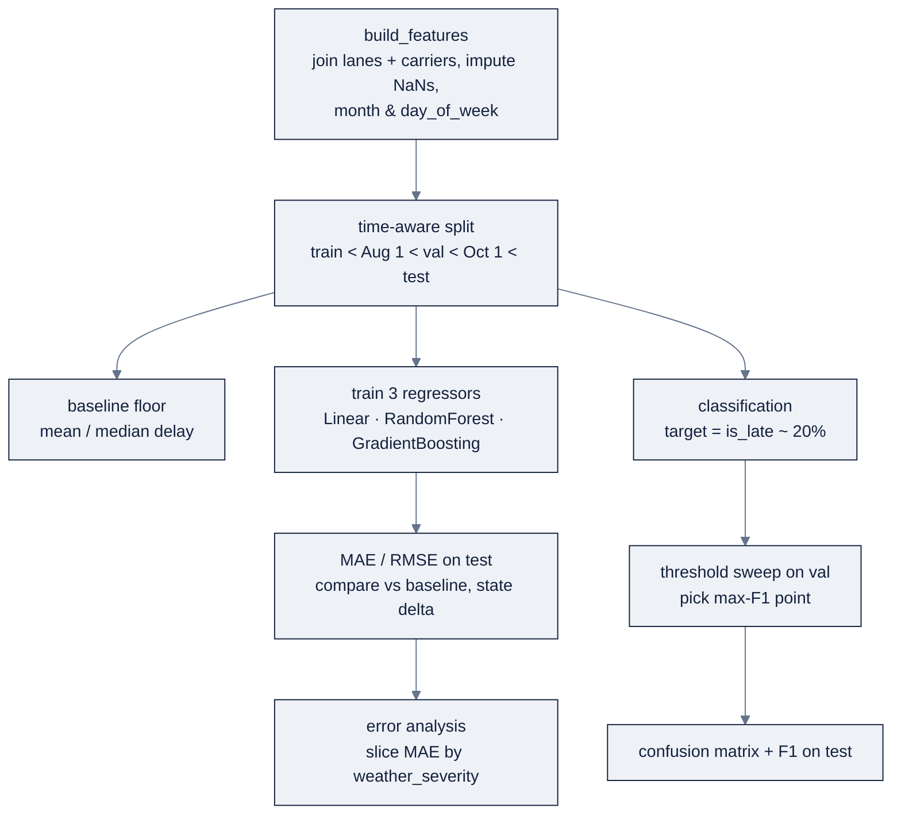

# Week 03: Machine Learningの基礎

> **日本語版** · [英語版](README.md) · [演習](exercises.ja.md) · [クイズ](quiz.ja.md)
> AI Engineering Labの一部 · Week 03 of 24 · Section: Foundations · Category: Classical ML
> · Notebooks: [01-eta-regression-baseline.ipynb](notebooks/01-eta-regression-baseline.ipynb) · [02-on-time-classification.ipynb](notebooks/02-on-time-classification.ipynb)

## 問題

ZoroLogisticsは、顧客に *トラックが実際にいつ到着するか* を伝え、*どのshipmentが約束した時間帯を外すリスクがあるか* を知りたいと考えています。naiveなapproachは当て推量です。過去を平均するか、すべてのshipmentがon timeだと仮定します。平均はshipmentごとに約**5時間**外れ、「全員on time」は~80%の確率で正しく、*lateになる20%のshipment* にはまったく役に立ちません。そしてまさにそのshipmentこそ、返金、破られたSLAs、怒りの電話を引き起こすものです。businessにはmodelが必要ですが、その数字が信頼できなければmodelは無価値です。

今週がなければ、ZoroLogisticsは、*learnした* modelと*未来を暗記した* modelの違いを言えません。randomにshuffleされたsplitは、十二月のshipment（holiday混雑込み）にmodelを訓練させ、その間に一月のshipmentがtest setに座ることを許します。modelは過去を「予測」して、出荷されるまで素晴らしく見えます。今週を終えれば、会社はdisciplineの効いたbaselineを手にします。**time-aware split**（過去でtrainし、未来でtestする）、**modelより先に選ばれたmetric**（ETAには時間単位のMAE、on-timeにはlate classのF1）、そしてmodelが *どこで* 失敗するかを名指しする **最初のerror analysis** です。これが、program全体の中心となる習慣、*modelより先にmetricを選ぶ、splitなしには何も信じない*、がインストールされる週です。

## 目標

- [ ] 金曜日までに、time-awareなtrain/validation/test splitを構築し、random shuffleがなぜ未来をleakするのかを説明できる。
- [ ] 金曜日までに、ETAのために三つのscikit-learn regressorを訓練し、mean/median baselineとMAE/RMSEで比較できる。
- [ ] 金曜日までに、on-time classifierを訓練し、precision/recall/F1、thresholdのtradeoff、confusion matrixを報告できる。
- [ ] 金曜日までに、metric、split、top error sourceを記載したWeek 3 model cardをshipできる。

## 日ごとの計画

| Day | Study | Run | Ship | Time |
|---|---|---|---|---|
| **Mon** | [`reference/knowledge-base/02-ml-dl-fundamentals.md`](../../reference/knowledge-base/02-ml-dl-fundamentals.md) §1〜7（supervised learning、splits、metrics、baselines）を読む | `01-eta-regression-baseline.ipynb` のfeature-table + splitのcell | Notes：modelより先にmetric | 約2時間 |
| **Tue** | regression、MAE/RMSE、baseline | baseline + 三regressorのcell | 4行の比較表（baseline + 3 model） | 約2.5時間 |
| **Wed** | time-aware split、cross-validation、feature scaling | splitを再実行。`TimeSeriesSplit` を試す | 公平な比較をlogに残す | 約2.5時間 |
| **Thu** | classification、precision/recall/F1、threshold | `02-on-time-classification.ipynb` をend-to-endで | confusion matrix + threshold sweep | 約2.5時間 |
| **Fri** | bias/variance、error analysis | errorをweatherでsliceし、model cardを書く | `week-03-model-card.md` をcommit | 約3時間 |
| **Sat** | 週の復習 | quiz（`quiz.md`、8/10で合格）を受ける | scoreをNotesに記録する | 約45分 |

## 概念

notebookに触れる前に [`reference/knowledge-base/02-ml-dl-fundamentals.md`](../../reference/knowledge-base/02-ml-dl-fundamentals.md) を読んでください。これが今週の正確なspecです。通底するのは、classical ML向けに言い換えたNgの中心ideaです。**modelより先にmetricを選び、splitなしには何も信じない。** 数字のないmodelはdemoです。splitのない数字は当て推量です。

### 1. 教師あり学習：regression vs classification

**教師あり学習** とは、label付きexampleのことです。それぞれの入力行がtargetを持ち、modelはinputs → targetをlearnします。二つのfamilyはtargetだけが違います。**regression** は連続値（ここでは `delay_hours`、実際の到着マイナス計画）を予測し、**classification** はcategory（on-time vs. late）を予測します。codeの形は同一で、変わるのはlossとmetricだけです。notebookは `delay_hours` を直接予測します。なぜなら `planned_arrival + predicted_delay` が調整済みETA *であり* 、delayを予測することはETA修正量を予測することだからです。

| | Regression | Classification |
|---|---|---|
| Target | `delay_hours`（連続） | `is_late`（0/1） |
| 最適化するloss | MSE | binary cross-entropy |
| Headline metric | MAE（時間） | late classのF1 |

### 2. train/val/test split：freightにはtime-aware

訓練に使ったdataを評価には使いません。標準的なdisciplineは三つの disjoint な集合です。**train**（fit）、**validation**（hyperparameterのtune）、**test**（一度だけ報告）。freightにはさらに硬いruleがあります。**時系列で割り、決してshuffleしない。** shipment dataは時系列で、weather、holiday、混雑は一年の間にdriftします。randomなshuffleは「未来」のshipmentが訓練にleakし、「過去」がtestに座ることを許します。この **leakage** はすべてのmetricを膨らませ、modelが過去について素晴らしく見えるようにします。

**実例1：time-aware split。** dataは2025-01-01から2025-12-30までを跨ぎます。cut date `CUT1="2025-08-01"` と `CUT2="2025-10-01"` で、splitは **58,392 train / 16,749 validation / 24,859 test** 行に着地します。およそ58% / 17% / 25%です。splitが（shuffleではなく）`planned_departure` 上であるため、すべての訓練行はすべてのvalidation行より前、さらにすべてのtest行より前です。modelは未来を見ることが *禁止* されます。間のvalidation windowは、testに触れずにhyperparameterをtuneするためにだけ存在します。Week 4はまさにこのsliceでwidth/dropout/weight-decayをtuneし、test setは最後まで封印されたままです。

### 3. scikit-learn：linear model、tree、ensemble

標準的なtabularのはしごで、どれも同じ `ColumnTransformer`（numericはscale、categoricalはone-hot）でwrapするので比較は公平になります。**LinearRegression**（linear baseline）、**RandomForestRegressor**（bagged tree）、**GradientBoostingRegressor**（逐次boosting）です。treeは生のthresholdでsplitするためscalingが要りませんが、pipelineはすべてのmodelを同一の入力に保ちます。classificationでは **LogisticRegression** と **RandomForestClassifier** を使い、どちらも `predict_proba` の確率を出します。

### 4. metrics：MAE、RMSE、accuracy、precision/recall、F1

| Task | Headline metric | 理由 | Watch metric |
|---|---|---|---|
| ETA regression | **MAE**（時間） | 「平均でX時間外れる」と読める | **RMSE** がerrorのtailを露出させる |
| on-time classification | **late classのF1** | targetがimbalanced。accuracyは嘘をつく | precision-recall curve、costを重み付けしたthreshold |

**MAE** は少数の巨大なmissにrobustです。**RMSE** はerrorを二乗するためtailを罰します。RMSE ≫ MAEなら、少数のshipmentが劇的に外れており、それらがerror analysisの優先事項です。targetがimbalancedなとき、**accuracyはheadlineとして禁止されます**。~20%がlateなら、「常にon time」は~80%のaccuracyを取りながら、すべてのlate shipmentを見逃します。**Precision**（flagしたもののうち本物だった割合）と **recall**（lateのうち捕捉できた割合）はthresholdに対してtradeoffし、**F1** はその調和平均です。

### 5. cross-validationとfeature scaling

単一のheld-out foldは訓練dataを浪費し、noisyな推定を与えます。**k-fold cross-validation** はheld-outするfoldをrotateしてscoreを平均します。時系列dataには **time-series cross-validation**（`TimeSeriesSplit`）を使い、foldが常に時間的に前進するようにします。randomなk-foldが十二月のshipmentを一月の訓練foldにshuffleすれば、time-aware splitが取り除いたまさにそのleakageを再導入します。**Feature scaling** はdistance/gradientベースのmodelに効きます。標準化（z-score）かmin-maxか。そして決定的なのは、**scalerをtrainだけでfitし**、その後val/testにtransformすることです。そうしないとtestの統計量が訓練にleakします。tree ensembleはscalingを一切必要としない、これがtabularのdefault baselineである理由の一つです。

**bias/variance** の分解は、比較表がなぜそのように見えるかを説明します。linear modelは **bias** が高く（23個のfeatureに直線しか引けない）、それでもここではより柔軟なgradient boosterと互角です。余分な柔軟性がこのnoisyなtargetではほとんど買えない、というhintです。訓練で卓越しvalidationで崩れるmodelは **variance** が高い（overfitting）です。Week 4のlearning curveは、そのgapを単一のtest数から推測するのではなく、直接 *見る* 場所です。

### 6. bias、variance、overfitting、baseline

errorは **bias**（単純すぎる → underfit）、**variance**（敏感すぎる → overfit）、そして抑えられないnoiseに分解されます。**Baseline** は、本物のsolutionが超えなければならない床です。regressionでは訓練targetのmean/medianを予測し、classificationでは多数classを予測します。ZoroLogisticsのすべての成果物はbaselineと比較し、deltaを述べます。

**実例2：負けないbaseline。** `delay_hours` は強く右に裾を引きます（median **0.73 h**、mean **3.56 h**、max **227.88 h**）。test setでは **median baselineがMAE 3.795 h**、**mean baselineが5.088 h**、三つのmodelは **LinearRegression 4.843 h、GradientBoosting 4.871 h、RandomForest 5.581 h** に着地します。median baselineは *すべてのmodelに勝ちます*。教科書的な誠実な結果です。長い裾のtargetではrobustなmedianは超えにくく、model cardにとって正しい結論は「deltaは負。linear/gradient-boostingの組は4.85 h近辺で互角」です。それを正直に報告することは、都合よく選んだ勝利より価値があります。

| Model | Test MAE（時間） | vs. median baseline（3.795 h） |
|---|---|---|
| LinearRegression | 4.843 | +1.05 悪い |
| GradientBoosting | 4.871 | +1.08 悪い |
| RandomForest | 5.581 | +1.79 悪い |

**実例3：businessが棲むのはthreshold。** defaultの0.5 thresholdでのLogisticRegressionは **precision 0.570 / recall 0.059 / F1 0.107** を取ります。late shipmentの6%しか捕捉できません。thresholdをsweepすると、**0.20** がvalidation F1を **0.384** で最大化することが分かります。held-out test setではそれは **F1 0.379**（precision 0.311、recall 0.486）になります。thresholdを上げ下げすると、誤報（安い：能動的な通知）と見逃し（高い：破られたSLA）の間で動作点が動き、confusion matrixはそのtradeをfalse positiveとfalse negativeの間のshiftとして *見える形に* します。

### うまくいかない理由

splitは、**shuffleされたcross-validation**（訓練に未来のshipmentが入る）、時間を無視する **randomな `train_test_split`**、そして **scalerのleak** で壊れます。分割前に全dataで `StandardScaler` をfitすると、test setのmeanと分散が訓練に入り込みます。metricは、imbalancedなtargetで **accuracyを報告する**（すべてのlate shipmentを見逃しながら「80%正確」）、あるいはdelayなのか総時間なのかを述べずに **生のtransit timeでMAE** を報告すると壊れます。baselineは *存在しない* と壊れます。「何にも勝っていない」modelは検証不能です。そして全体は、thresholdのtune中に **test setに二度以上触れる** と壊れます。validationでtuneし、testではちょうど一度だけ評価する。さもなければ「誠実な」数字はもう一つのoverfitした数字になります。

さらに深く学ぶには：discipline fileの§2〜7（splits、metrics、baselines）、そしてevals + error analysisが定義的なskillである理由については [`reference/knowledge-base/01-ai-engineering-discipline.md`](../../reference/knowledge-base/01-ai-engineering-discipline.md) §"Building and deploying AI applications"。

## Notebook walkthrough

**`notebooks/01-eta-regression-baseline.ipynb`** は、一つの `build_features()` 関数でfeature tableを構築し（`lanes`/`carriers` のjoin、planted NaNsのimpute、`month`/`day_of_week` のderive）、`NUM_COLS`（7 numeric）と `CAT_COLS`（`weather_severity`、`commodity`）を `ColumnTransformer` 経由で定義し、`CUT1`/`CUT2` で時系列にsplitします。baseline cellはtestでmean/medianのMAE/RMSEを計算します。model cellはLinearRegression、RandomForest、GradientBoostingをfitして比較DataFrameをprintします。error-analysis cellはMAEで最良のmodelを選び、`|pred − y|` を `weather_severity` でsliceします。最後のcellは **`BEST_TEST_MAE`** と **`BEST_TEST_RMSE`** をprintします。median baselineは **3.8 h** 近く、modelは **4.8〜5.6 h** 近くを期待してください（baselineが勝ちます。正直に記録する）。

**`notebooks/02-on-time-classification.ipynb`** は同じfeature/splitを再構築し、labelを `is_late = (~is_on_time)` に反転し、late share（~20%）をprintします。LogisticRegressionとRandomForestをfitし、0.5でprecision/recall/F1を報告し、続いて19個のthresholdをsweepしてmax-F1の動作点を見つけ、0.5と選んだthresholdでのconfusion matrixをprintし、最後にtestで評価します。最後のcellはprecision/recall付きの **`BEST_TEST_F1`**（≈0.38）をprintします。「正しい」出力：splitのsizeが一致（~58k/17k/25k）、late share ≈ 0.20、そしてlate classのF1がそのthresholdとともに報告されていること。

変更するcell：Standard exerciseは、regression notebookの `models` dictに四つ目のentry（例：`HistGradientBoostingRegressor`）を追加します。同じpipeline wrapper、同じsplit。これで比較は公平なままです。Stretch exerciseは単一の `CUT1`/`CUT2` splitを `TimeSeriesSplit` に置き換え、foldのMAEsを平均します。classification notebookでは、`np.linspace(0.05, 0.95, 19)` のsweepが動作点を選ぶ唯一の場所です。confusion matrixとtest F1はその選択を引き継ぐので、test labelに対してthresholdをtuneしてはいけません。正しいrunは、すべての数字を *そのsplitとbaseline deltaとともに* 述べます。splitの日付とmedian baselineなしの裸の「MAE 4.87」は結果ではありません。metric、split、top error sourceの三つのfieldこそ、Week 3 model cardが記録すべきものです。

## Use case（Friday）

**Deliverable:** 三つのものを載せたWeek 3 model card（`week-03-model-card.md`）。headline metric（ETAにはMAE、on-timeにはlate classのF1）、それを生み出した正確なsplit（cut dateであって「80/20」ではない）、そしてerrorをsliceして見つかった単一の最大error source（weather、あるlane、あるcarrier）。

**Zorost gate:** 見知らぬ人があなたのmodel cardを読み、notebookから数字を再現できること。同じsplit、同じseed、同じmetric。そしてあなたは *modelが何を間違えたか* を見せられます。topのerror clusterと、その原因に関する一文の仮説です。error analysisのないmetricは、成果物の半分です。

**Stretch variant:** 単一のvalidation splitを `TimeSeriesSplit` cross-validationに置き換え、foldをまたぐMAEのmean ± stdを報告します。さらに比較に四つ目のmodel `HistGradientBoostingRegressor` を追加し、baselineに対するdeltaを述べます。

## よくあるpitfall

| Pitfall | なぜ起きるか | Fix |
|---|---|---|
| 時系列dataへのrandom `train_test_split` | freightが時系列であることを忘れる | 明示的なcut dateで `planned_departure` 上でsplitする |
| scalerを全dataでfit | 便利だから（`StandardScaler().fit(X)`） | trainだけで `fit` し、val/testには `transform` |
| late classでaccuracyを報告 | default metricの習慣 | `is_late` でF1/precision/recallを報告し、生のaccuracyは決して使わない |
| tuning中にtest setに触れる | thresholdを「確認」したくなる | **val** でthresholdをsweep。testはちょうど一度だけ評価 |
| baselineなし | 当然の答えをskipする | まずmean/median（と多数class）を計算し、deltaを述べる |
| MAEなしでRMSEを報告 | 一つの数字に偏る | 両方報告する。RMSE ≫ MAEは重いerror tailの印 |
| `delay_hours` のskewを無視 | targetが正規分布だと仮定 | median baselineを使う。長い裾で強いことを期待する |

## Glossary

- **Supervised learning**: label付きinputからtargetへのmappingを学ぶこと。
- **Regression / classification**: 連続値を予測するか、categoryを予測するか。
- **Time-aware split**: 時系列で割り、訓練が常にvalidation/testより前になるようにすること。
- **Leakage**: 未来（やtest）の情報が訓練を汚染し、metricを膨らませること。
- **MAE / RMSE**: 平均絶対誤差（典型的な外れ）と二乗平均平方根誤差（tailを罰する）。
- **Precision / recall / F1**: 誤報率、見逃し率、そしてその調和平均。
- **Threshold**: classifierのscoreをlabelに変える確率の切り替え点。
- **Confusion matrix**: classifierのdecisionのTP/FP/FN/TN会計。
- **Baseline**: 本物のmodelが超えるべきnaiveなmodel（mean/median/多数class）。
- **Cross-validation**: held-out foldをrotateして安定性を推定する。freightでは時間的に前へ。
- **Bias / variance**: underfitting（単純すぎる）とoverfitting（敏感すぎる）のerror。
- **Model card**: modelのmetric、split、top error sourceの一頁の記録。

## Self-check（quiz）

[`quiz.md`](quiz.md) を開き、10問すべてに答えます。合格ラインは **8/10** です。各問題には、対応するConceptsのsubsectionまたはnotebook cellが記載されています。

## Exercises

四つのgraded exerciseがあります。**Easy**（regression notebookを実行してMAE/RMSEを記録）、**Standard**（四つ目のregressorを追加してdeltaを述べる）、**Stretch**（時系列cross-validation）、**Portfolio**（model card + experiment logをcommit）。各hintは [`exercises.md`](exercises.md) にあります。

## Sources

- scikit-learn user guide：https://scikit-learn.org/stable/user_guide.html
- scikit-learn `TimeSeriesSplit`：https://scikit-learn.org/stable/modules/generated/sklearn.model_selection.TimeSeriesSplit.html
- scikit-learn metrics：https://scikit-learn.org/stable/modules/classes.html#module-sklearn.metrics
- scikit-learn supervised learning（linear model、forest、boosting）：https://scikit-learn.org/stable/supervised_learning.html
- Andrew Ng, *The AI Engineering Skills Map*, The Batch issue 366：https://www.deeplearning.ai/the-batch/issue-366
- Andrew Ng, *Improve Agentic Performance with Evals and Error Analysis, Part 1*：https://www.deeplearning.ai/the-batch/improve-agentic-performance-with-evals-and-error-analysis-part-1
- Fereydun Hashemi（Zorost）, *The AI Engineering Skills Map, turned into a training plan*：https://zorost.com/ai-engineering-skills-map-training-guide
- Aurélien Géron, *Hands-On Machine Learning*, 3rd ed. (O'Reilly, 2022)：https://www.oreilly.com/library/view/hands-on-machine-learning/9781098125967/
