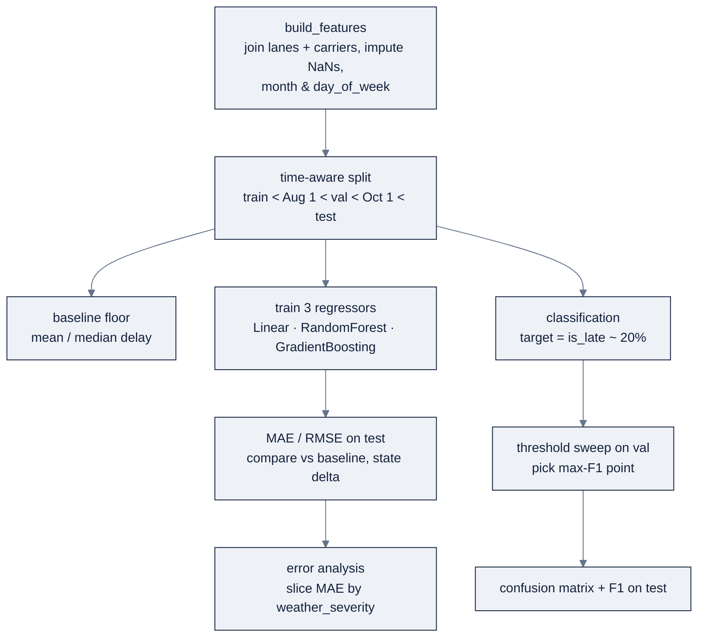

# Week 03: Machine Learning Fundamentals

> Part of AI Engineering Lab · Week 03 of 24 · Section: Foundations · Category: Classical ML
> 🎯 Use case: Baseline ETA (estimated time of arrival) regression and on-time classification from shipment features.

## The problem

ZoroLogistics wants to tell a customer *when the truck will actually arrive*, and to know *which shipments are at risk of missing their promised window.* The naive approach is to guess: average the past, or assume every shipment is on time. The average is wrong by about **5 hours** per shipment; "everyone's on time" is right ~80% of the time and *useless for the 20% of shipments that go late*, which are precisely the ones that trigger refunds, breached SLAs, and angry calls. The business needs a model, but a model is worthless if its number is not trustworthy.

Without this week, ZoroLogistics can't tell the difference between a model that *learned* and one that *memorized the future*. A randomly-shuffled split would let a December shipment (with its holiday congestion) train the model while a January shipment sits in the test set, the model "predicts" the past and looks brilliant until it ships. With this week, the company gets a disciplined baseline: a **time-aware split** (train on the past, test on the future), a **metric chosen before the model** (MAE in hours for ETA, F1 on the late class for on-time), and a **first error analysis** that names *where* the model fails. This is the week the whole program's core habit, *pick the metric before the model, trust nothing without a split*, is installed.

## Objectives

- [ ] By Friday you can build a time-aware train/validation/test split and explain why random shuffling would leak the future.
- [ ] By Friday you can train three scikit-learn regressors for ETA and compare them on MAE/RMSE against a mean/median baseline.
- [ ] By Friday you can train an on-time classifier and report precision/recall/F1, a threshold tradeoff, and a confusion matrix.
- [ ] By Friday you can ship a Week 3 model card that states the metric, the split, and the top error source.

## Day-by-day plan

| Day | Study | Run | Ship | Time |
|---|---|---|---|---|
| **Mon** | Read [`reference/knowledge-base/02-ml-dl-fundamentals.md`](../../reference/knowledge-base/02-ml-dl-fundamentals.md) §1 to 7 (supervised learning, splits, metrics, baselines) | `01-eta-regression-baseline.ipynb` feature-table + split cells | Notes: metric before model | ~2 h |
| **Tue** | Regression, MAE/RMSE, baselines | The baseline + three-regressor cells | A 4-row comparison table (baseline + 3 models) | ~2.5 h |
| **Wed** | Time-aware split, cross-validation, feature scaling | Re-run the split; try `TimeSeriesSplit` | A fair comparison logged | ~2.5 h |
| **Thu** | Classification, precision/recall/F1, threshold | `02-on-time-classification.ipynb` end-to-end | Confusion matrix + threshold sweep | ~2.5 h |
| **Fri** | Bias/variance, error analysis | Slice errors by weather; write the model card | `week-03-model-card.md` committed | ~3 h |
| **Sat** | Review the week | Take the quiz (`quiz.md`, 8/10 to pass) | Record the score in Notes | ~45 min |

## Concepts

Read [`reference/knowledge-base/02-ml-dl-fundamentals.md`](../../reference/knowledge-base/02-ml-dl-fundamentals.md) before touching a notebook, it is the precise spec for this week. The through-line is Ng's core idea restated for classical ML: **pick the metric before the model, and trust nothing without a split.** A model without a number is a demo; a number without a split is a guess.

### 1. Supervised learning: regression vs classification

**Supervised learning** means labeled examples: each input row carries a target, and the model learns inputs → target. The two families differ only in the target: **regression** predicts a continuous number (here `delay_hours`, the actual-minus-planned arrival), while **classification** predicts a category (on-time vs. late). The code shape is identical; what changes is the loss and the metric. The notebooks predict `delay_hours` directly, because `planned_arrival + predicted_delay` *is* the adjusted ETA, predicting the delay is predicting the ETA correction.

| | Regression | Classification |
|---|---|---|
| Target | `delay_hours` (continuous) | `is_late` (0/1) |
| Loss optimized | MSE | binary cross-entropy |
| Headline metric | MAE (hours) | F1 on the late class |

### 2. Train/val/test splits: time-aware for freight

You never evaluate on data you trained on. The standard discipline is three disjoint sets, **train** (fit), **validation** (tune hyperparameters), **test** (report once). Freight adds a hard rule: **split chronologically, never shuffle.** Shipment data is a time series; weather, holidays, and congestion drift across the year. A random shuffle lets a "future" shipment leak into training while a "past" one sits in test, **leakage**, which inflates every metric and makes the model look brilliant on the past.

**Worked example 1: the time-aware split.** The data spans 2025-01-01 to 2025-12-30. With cut dates `CUT1="2025-08-01"` and `CUT2="2025-10-01"`, the split lands on **58,392 train / 16,749 validation / 24,859 test** rows, roughly 58% / 17% / 25%. Because the split is on `planned_departure` (not a shuffle), every training row precedes every validation row precedes every test row: the model is *prohibited* from seeing the future. The middle validation window exists specifically so you can tune hyperparameters without touching test, Week 4 tunes width/dropout/weight-decay on exactly this slice, and the test set stays sealed until the very end.

### 3. scikit-learn: linear models, trees, ensembles

The standard tabular ladder, all wrapped in the same `ColumnTransformer` (scale numerics, one-hot categoricals) so the comparison is fair: **LinearRegression** (a linear baseline), **RandomForestRegressor** (bagged trees), and **GradientBoostingRegressor** (sequential boosting). Trees split on raw thresholds and don't need scaling, but the pipeline keeps every model on identical inputs. Classification uses **LogisticRegression** and **RandomForestClassifier**, each emitting `predict_proba` probabilities.

### 4. Metrics: MAE, RMSE, accuracy, precision/recall, F1

| Task | Headline metric | Why | Watch metric |
|---|---|---|---|
| ETA regression | **MAE** (hours) | Reads as "off by X hours on average" | **RMSE** surfaces the error tail |
| On-time classification | **F1 on the late class** | Imbalanced target; accuracy lies | Precision-recall curve, cost-weighted threshold |

**MAE** is robust to a few huge misses; **RMSE** squares errors, so it punishes the tail, if RMSE ≫ MAE, a few shipments are dramatically wrong, and those are your error-analysis priority. **Accuracy is banned** as a headline when the target is imbalanced: with ~20% late, "always on time" scores ~80% accuracy while missing every late shipment. **Precision** (of what you flagged, how much was real) and **recall** (of what was late, how much you caught) trade off against the threshold; **F1** is their harmonic mean.

### 5. Cross-validation and feature scaling

A single held-out fold wastes training data and gives a noisy estimate. **k-fold cross-validation** rotates which fold is held out and averages the scores; for time-ordered data use **time-series cross-validation** (`TimeSeriesSplit`) so folds always go forward in time, a random k-fold that shuffles a December shipment into a January training fold reintroduces the exact leakage the time-aware split removed. **Feature scaling** matters for distance/gradient-based models: standardize (z-score) or min-max, and, critically, **fit the scaler on train only**, then transform val/test, or you leak test statistics into training. Tree ensembles skip scaling entirely, which is one reason they're the default tabular baseline.

The **bias/variance** split explains *why* the comparison table looks the way it does. A linear model has high **bias** (it can only draw a straight line through 23 features) yet here it ties the more flexible gradient booster, a hint that the extra flexibility buys little on this noisy target. A model that excels on training and collapses on validation has high **variance** (overfitting); the Week 4 learning curves are where you'll learn to *see* that gap directly, not just infer it from a single test number.

### 6. Bias, variance, overfitting, baselines

Error decomposes into **bias** (too simple → underfit), **variance** (too sensitive → overfit), and irreducible noise. **Baselines** are the floor a real solution must beat: for regression, predict the mean/median of the training target; for classification, the majority class. Every ZoroLogistics deliverable compares against a baseline and states the delta.

**Worked example 2: the baseline that refuses to lose.** `delay_hours` is heavily right-skewed (median **0.73 h**, mean **3.56 h**, max **227.88 h**). On the test set the **median baseline scores MAE 3.795 h**, the **mean baseline 5.088 h**, and the three models land at **LinearRegression 4.843 h, GradientBoosting 4.871 h, RandomForest 5.581 h**. The median baseline *beats every model*, a textbook, honest result: on a long-tailed target, the robust median is hard to beat, and the correct conclusion for the model card is "the delta is negative; the linear/gradient-boosting pair ties near 4.85 h." Reporting that honestly is worth more than a cherry-picked win.

| Model | Test MAE (hours) | vs. median baseline (3.795 h) |
|---|---|---|
| LinearRegression | 4.843 | +1.05 worse |
| GradientBoosting | 4.871 | +1.08 worse |
| RandomForest | 5.581 | +1.79 worse |

**Worked example 3: the threshold is where the business lives.** The LogisticRegression at the default 0.5 threshold scores **precision 0.570 / recall 0.059 / F1 0.107**, it catches only 6% of late shipments. Sweeping the threshold finds that **0.20** maximizes validation F1 at **0.384**; on the held-out test set that becomes **F1 0.379** (precision 0.311, recall 0.486). Raising/lowering the threshold moves the operating point between false alarms (cheap: a proactive notification) and misses (costly: a breached SLA), and the confusion matrix makes that trade *visible* as a shift between false positives and false negatives.

### How it breaks

The split breaks with **shuffled cross-validation** (a future shipment in training), with a **random `train_test_split`** that ignores time, and with **leaking the scaler**: fitting `StandardScaler` on the full data before splitting lets the test set's mean and variance into training. The metric breaks when someone reports **accuracy on an imbalanced target** ("80% accurate" while missing every late shipment), or **MAE on raw transit time** without stating whether it's delay or total hours. The baseline breaks when it's *absent*, a model that "beat nothing" is unverifiable. And the whole thing breaks when the **test set is touched more than once** during threshold tuning: tune on validation, then evaluate on test exactly once, or the "honest" number becomes another overfit number.

For deeper dives: the discipline file's §2 to 7 (splits, metrics, baselines) and [`reference/knowledge-base/01-ai-engineering-discipline.md`](../../reference/knowledge-base/01-ai-engineering-discipline.md) §"Building and deploying AI applications" for why evals + error analysis is the defining skill.

## Notebook walkthrough

**`notebooks/01-eta-regression-baseline.ipynb`** builds the feature table in one `build_features()` function (join `lanes`/`carriers`, impute planted NaNs, derive `month`/`day_of_week`), defines `NUM_COLS` (7 numeric) and `CAT_COLS` (`weather_severity`, `commodity`) through a `ColumnTransformer`, and splits chronologically with `CUT1`/`CUT2`. The baseline cell computes mean/median MAE/RMSE on test; the model cell fits LinearRegression, RandomForest, and GradientBoosting and prints a comparison DataFrame. The error-analysis cell picks the best model by MAE and slices `|pred − y|` by `weather_severity`. The final cell prints **`BEST_TEST_MAE`** and **`BEST_TEST_RMSE`**, expect the median baseline near **3.8 h** and the models near **4.8 to 5.6 h** (the baseline wins; record it honestly).

**`notebooks/02-on-time-classification.ipynb`** rebuilds the same features/split, flips the label to `is_late = (~is_on_time)`, and prints the late share (~20%). It fits LogisticRegression and RandomForest, reports precision/recall/F1 at 0.5, then sweeps 19 thresholds to find the max-F1 operating point, prints the confusion matrix at 0.5 vs. the chosen threshold, and finally evaluates on test. The final cell prints **`BEST_TEST_F1`** (≈0.38) with precision/recall. "Correct" output: the split sizes match (~58k/17k/25k), the late share ≈ 0.20, and the F1 on the late class is reported with its threshold.

Cells to modify: the Standard exercise appends a fourth entry (e.g. `HistGradientBoostingRegressor`) to the `models` dict in the regression notebook, same pipeline wrapper, same split, so the comparison stays fair. The Stretch exercise swaps the single `CUT1`/`CUT2` split for `TimeSeriesSplit` and averages the fold MAEs. In the classification notebook, the `np.linspace(0.05, 0.95, 19)` sweep is the one place you choose the operating point; the confusion matrix and test F1 inherit that choice, so never tune the threshold against the test labels. A correct run states every number *with* its split and its baseline delta, a bare "MAE 4.87" without the split dates and the median baseline is not a result. Those three fields, metric, split, top error source, are exactly what the Week 3 model card must record.

## The use case (Friday)

**Deliverable:** a Week 3 model card (`week-03-model-card.md`) with three things, the headline metric (MAE for ETA, F1 on the late class for on-time), the exact split that produced it (cut dates, not "80/20"), and the single biggest error source found by slicing errors (weather, a lane, a carrier).

**Zorost gate:** a stranger can read your model card and reproduce your numbers from the notebooks, same split, same seed, same metrics, and you can show them *what the model got wrong*: the top error cluster and your one-sentence hypothesis for its cause. A metric without an error analysis is half a deliverable.

**Stretch variant:** replace the single validation split with `TimeSeriesSplit` cross-validation and report mean ± std of MAE across folds, then add the fourth model `HistGradientBoostingRegressor` to the comparison and state its delta against the baseline.

## Common pitfalls

| Pitfall | Why it happens | Fix |
|---|---|---|
| Random `train_test_split` on time data | Forgetting freight is a time series | Split on `planned_departure` with explicit cut dates |
| Fitting the scaler on all data | Convenience (`StandardScaler().fit(X)`) | `fit` on train only, then `transform` val/test |
| Reporting accuracy on the late class | Default metric habit | Report F1/precision/recall on `is_late`, never raw accuracy |
| Touching the test set during tuning | Wanting to "check" the threshold | Sweep thresholds on **val**; evaluate test exactly once |
| No baseline | Skipping the obvious answer | Compute mean/median (and majority-class) first; state the delta |
| Reporting RMSE without MAE | Over-indexing on one number | Report both; RMSE ≫ MAE flags a heavy error tail |
| Ignoring the skew in `delay_hours` | Assuming a normal target | Use the median baseline; expect it to be strong on long tails |

## Glossary

- **Supervised learning**: learning a mapping from labeled inputs to a target.
- **Regression / classification**: predicting a continuous value vs. a category.
- **Time-aware split**: splitting chronologically so training always precedes validation/test.
- **Leakage**: future (or test) information contaminating training, inflating metrics.
- **MAE / RMSE**: mean absolute error (typical miss) vs. root mean squared error (penalizes the tail).
- **Precision / recall / F1**: false-alarm rate, miss rate, and their harmonic mean.
- **Threshold**: the probability cutoff that turns a classifier's score into a label.
- **Confusion matrix**: the TP/FP/FN/TN accounting of a classifier's decisions.
- **Baseline**: the naive model (mean/median/majority class) a real model must beat.
- **Cross-validation**: rotating held-out folds to estimate stability, forward in time for freight.
- **Bias / variance**: underfitting (too simple) vs. overfitting (too sensitive) error.
- **Model card**: a one-page record of a model's metric, split, and top error source.

## Self-check (quiz)

Open [`quiz.md`](quiz.md) and answer all 10 questions. The passing bar is **8/10**; each question names the Concepts subsection or notebook cell it comes from.

## Exercises

Four graded exercises, **Easy** (run the regression notebook and record MAE/RMSE), **Standard** (add a fourth regressor and state the delta), **Stretch** (time-series cross-validation), and **Portfolio** (commit the model card + experiment log). Hints for each live in [`exercises.md`](exercises.md).

## Sources

- scikit-learn user guide: https://scikit-learn.org/stable/user_guide.html
- scikit-learn `TimeSeriesSplit`: https://scikit-learn.org/stable/modules/generated/sklearn.model_selection.TimeSeriesSplit.html
- scikit-learn metrics: https://scikit-learn.org/stable/modules/classes.html#module-sklearn.metrics
- scikit-learn supervised learning (linear models, forests, boosting): https://scikit-learn.org/stable/supervised_learning.html
- Andrew Ng, *The AI Engineering Skills Map*, The Batch issue 366: https://www.deeplearning.ai/the-batch/issue-366
- Andrew Ng, *Improve Agentic Performance with Evals and Error Analysis, Part 1*: https://www.deeplearning.ai/the-batch/improve-agentic-performance-with-evals-and-error-analysis-part-1
- Fereydun Hashemi (Zorost), *The AI Engineering Skills Map, turned into a training plan*: https://zorost.com/ai-engineering-skills-map-training-guide
- Aurélien Géron, *Hands-On Machine Learning*, 3rd ed. (O'Reilly, 2022): https://www.oreilly.com/library/view/hands-on-machine-learning/9781098125967/
