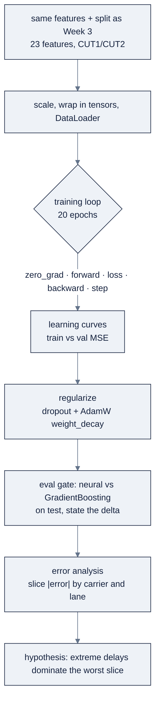

# Week 04: PyTorchで学ぶDeep Learning

> **日本語版** · [英語版](README.md) · [演習](exercises.ja.md) · [クイズ](quiz.ja.md)
> AI Engineering Labの一部 · Week 04 of 24 · Section: Foundations · Category: Deep Learning
> · Notebooks: [01-pytorch-tensors-and-autograd.ipynb](notebooks/01-pytorch-tensors-and-autograd.ipynb) · [02-mlp-eta-train-and-eval.ipynb](notebooks/02-mlp-eta-train-and-eval.ipynb)

## 問題

ZoroLogisticsにはWeek 3で動くgradient-boostingのETA modelがあり、*正直に訓練・評価すれば* neural networkがもっと良くなるかもしれない、という疑いがあります。誘惑はdisciplineをskipすることです。大きなMLPを訓練し、訓練lossが下がるのを見て、勝利を宣言する。しかしneural netはtoolboxで最も速いoverfitterです。noiseを暗記でき、tuneされていないlearning rateで発散し、*静かに* failします。その出力は、modelが壊れていてもそれっぽく見える数字です。そしてrandom forestと違い、feature importanceを一目見て何をlearnしたか知ることはできません。error analysisで尋問しなければなりません。

今週がなければ、ZoroLogisticsが手にするのはmodelではなくdemoです。訓練curveが急落しvalidation curveが浮上するnotebookが、「neural modelが勝った」としてshipされます。今週を終えれば、会社はdemo builderとAI engineerを分けるdisciplineを手にします。Week 3と同じtime-aware splitで訓練された **正則化済みMLP**、gradient-boosting baselineとの比較で *勝ち負けに関わらずdeltaを明示* し、modelがどこで失敗するかを名指しし、その理由を仮説として述べる **最初のcarrier・lane別error analysis** です。今週の正直な結果は示唆的です。小さなMLPは **MAE ≈ 4.99 h** に対しbaselineは **4.87 h**、**0.12 h** 負ける事実上の互角です。これは *正しい* 結果であり、それを素直に報告することこそが今週の要点です。

## 目標

- [ ] 金曜日までに、tensorを構築し、computation graphを読み、autogradがgradientを計算してくれることを実演できる。
- [ ] 金曜日までに、DataLoader、training loop、learning curveを使って `delay_hours` regressionのMLPを訓練できる。
- [ ] 金曜日までに、dropoutとweight decayを適用し、validation splitで少なくとも三つのhyperparameterをtuneできる。
- [ ] 金曜日までに、carrier/lane別の最大error clusterを名指しし仮説を述べたerror-analysis noteをshipできる。

## 日ごとの計画

| Day | Study | Run | Ship | Time |
|---|---|---|---|---|
| **Mon** | [`reference/knowledge-base/02-ml-dl-fundamentals.md`](../../reference/knowledge-base/02-ml-dl-fundamentals.md) §8〜12（tensor、autograd、training loop、regularization）を読む | `01-pytorch-tensors-and-autograd.ipynb` のtensor + autogradのcell | 手計算によるgradient check | 約2時間 |
| **Tue** | training loop。loss vs. metric | MLP notebookをend-to-endで実行。curveをplot | 最初のlearning curveの読み取り | 約2.5時間 |
| **Wed** | 正則化（dropout、weight decay）、hyperparameter | width、dropout、weight decayを **val** でtune | 最良のval-MAEの組み合わせ | 約2.5時間 |
| **Thu** | evalとerror analysis | testでneural vs baselineを比較。carrier/laneでslice | error-cluster表 | 約2.5時間 |
| **Fri** | 予測できない出力 → eval | error-analysis noteを書く | `week-04-model-card.md` をcommit | 約3時間 |
| **Sat** | 週の復習 | quiz（`quiz.md`、8/10で合格）を受ける | scoreをNotesに記録する | 約45分 |

## 概念

Deep learningは、Week 3の教師あり学習を超えて *新しい概念を何も* 追加しません。変わるのはmodel family（gradient descentでend-to-endに訓練される、parameter化された関数のstack）と訓練の方法（batching、optimizer、regularization）です。Week 3のすべて、metricを先に、time-aware split、baseline、は引き続き適用され、しかも今はもっと重要です。neural netはrandom forestより速くoverfitし、より静かにfailするからです。

### 1. tensorとdevice（GPU/MPS）

**tensor** はdtypeとdeviceを持つ多次元arrayです。scalarはrank-0、vectorはrank-1、matrixはrank-2、matrixのbatchはrank-3です。PyTorchでは `B` 個のexampleが `D` 個のfeatureを持つbatchは `(B, D)` tensorで、GPU（やApple MPS）への移動は `.to(device)` 一つです。Week 1〜4は意図的にCPUのみです。modelはlaptopで十分なほど小さい。しかしtensorのdevice abstractionこそが、後で *同じ* codeをdatacenter GPUで動かせるようにするものです。

### 2. autogradとcomputation graph

PyTorchは `requires_grad=True` のtensor上のすべての操作を **computation graph** に記録します。scalar lossを計算した後、`loss.backward()` の一回の呼び出しがそのgraphを逆向きにたどり、すべてのparameterの `.grad` を埋めます。あなたはforwardの数学を書き、frameworkがgradientを導出します。これが「automatic differentiation」です。

**実例1：頭の中で計算できるgradient。** `f(x) = x²` では `df/dx = 2x`、だから `x = 3` でのgradientは `6.0` です。notebookのautograd cellはまさにそれをassertします。別のcellは `w = [2.0, -1.0]` で二乗和loss `loss = (w**2).sum()` を構築します。`sum(w²)` のgradientは `2w` なので、`w.grad` は `[4.0, -2.0]` をprintします。この二つのcheckがmental modelのすべてです。**backwardはchain ruleからgradientを埋める。**

### 3. `nn.Module`、linear layer、activation

`nn.Module` はparameterを保持します。**linear layer** は `y = xW + b` を計算します。**activation** は非線形性を挿入します（これがないと、積み重ねたlinear layerは一つに崩壊します）。ReLUはhidden layerの主力で、regression netの最終layerは単一出力かつactivation *なし* です（delayは任意の実数値を取れます）。notebook 1のtoy MLPは `Linear(3,16) → ReLU → Linear(16,1)`、notebook 2のETA MLPは `Linear(n_in,128) → ReLU → Dropout → Linear(128,64) → ReLU → Linear(64,1)` です。

### 4. loss、optimizer、training loop

**loss** は微分可能な単一の数値です（regressionではMSE）。**optimizer** はgradientを使って重みを更新します（AdamWはdecoupled weight decay付きのAdam）。**training loop** は五行で、どのmodelでも同一です。

```python
for xb, yb in loader:        # a batch of inputs and targets
    opt.zero_grad()          # clear last step's gradients
    loss = loss_fn(model(xb), yb)
    loss.backward()          # autograd fills .grad
    opt.step()               # optimizer updates weights
```

forward、loss、backward、step。この五行を記憶に刻んでください。これがprogramの残りのengineです。

| 行 | 目的 |
|---|---|
| `opt.zero_grad()` | 前stepのgradientが蓄積されないようclearする |
| `loss = loss_fn(model(xb), yb)` | forward pass、続いてerrorを測る |
| `loss.backward()` | autogradがgraphをたどり `.grad` を埋める |
| `opt.step()` | optimizerがgradientから重みを更新する |

### 5. batch、DataLoader、learning curve

example一つずつのgradient descentはnoisyで、全datasetでは高くつきます。**batching** はmini-batch（ここでは256）でgradientを計算してstepします。安く、悪い極小から逃げられる程度にnoisyで、GPUに優しい。`DataLoader` は訓練dataをshuffleし（val/testの順序は決してshuffleしない）batchを供給します。**learning curve** はepochごとのtrainとvalidation lossをplotした、最も重要な診断手段です。値だけでなくcurve間の *gap* を読みます。二つのnotebookは意図的に両極端を使い、対比を見える化します。notebook 1のtoy MLPは *完全な* 200行datasetを一括で訓練し（batch = 全部、`lr=0.05`）、notebook 2のETA MLPは `lr=1e-3` でepochごとに228のmini-batchをstepします。full-batchのtoy runは速く、lossがほぼゼロに落ちるのを見られるほど安定です。mini-batch runは58,000行で本物のmodelがgeneralizeする方法です。

**実例2：curveの読み方。** ETA modelは256ずつのbatchで58,392行を訓練するので、各epochは **228 batch** をloopに通します。23 feature（7 numeric + 4 one-hot weather + 12 one-hot commodity）で、最初のepochは **train MSE 82.5 / val MSE 76.8** をprintし、20 epochの最後には **train 80.0 / val 76.4** です。gapは小さく安定したまま。modelはoverfittingして *おらず*、val MSEのplateauは、それ以上epochを重ねてもあまり得がないことを示しています。

| curveの形 | 診断 | 対応 |
|---|---|---|
| 両方高くて平坦 | underfitting | capacityかより良いfeatureを追加 |
| trainが低くvalが高く、gapが拡大 | overfitting | dropout、weight decay、data追加 |
| 両方低く収束 | healthy | さらに訓練してもよい |

### 6. 正則化：dropoutとweight decay

どちらも同じ症状（trainがvalよりはるかに良い）を、別の仕組みで攻撃します。**dropout** は *訓練中のみ* activationの一部をrandomにゼロにします（すべてのforward passは間引かれたnetworkです）。**weight decay** は二乗重みpenaltyをlossに追加します（PyTorchではoptimizerの `weight_decay=` 引数です）。必要かどうかを知る誠実な方法は、learning curveのgapです。

| Regularizer | 仕組み | 使うとき |
|---|---|---|
| Dropout | activationの一部をrandomにゼロにする。訓練中のみ | 単一のneuronが不可欠になっている |
| Weight decay | lossに二乗重みpenaltyを追加する | 重みが大きくなり、関数がギザギザになる |

### 7. 予測できない出力 → evalとerror analysis

これが今週が *インストール* する習慣で、Ngがteamの速度の最大の予測因子と位置づけるものです。**evalとerror analysis**（[`reference/knowledge-base/01-ai-engineering-discipline.md`](../../reference/knowledge-base/01-ai-engineering-discipline.md) を参照）。あなたのneural ETAは *test setでWeek 3 baselineと比較され、deltaが明示されなければ* なりません（eval gate）。*それから* errorを **carrierとlane** でsliceし、最大のclusterを見つけ、仮説を立てます。metricは *どれだけ間違っているか* を、error analysisは *どこを見るべきか* を教えます。

**実例3：正直な直接対決。** held-out test setでneural MLPは **MAE 4.987 h / RMSE 9.377 h**、再訓練したgradient-boosting baselineは **MAE 4.871 h / RMSE 9.372 h** です。**deltaは+0.116 h**、MLPは平均で約7分負けています。事実上の互角です。絶対errorをcarrierでsliceすると、最悪のcarrierは **C002の6.68 h**（平均~5.0 hに対し）、最悪のlaneは **L016の5.78 h** です。正しい仮説は「modelが悪い」ではなく「少数の極端なdelayがそれらのsliceを支配している。networkのせいにする前にweatherと季節性を確認せよ」です。そのnoteこそが成果物です。



### うまくいかない理由

loopは四つの古典的な方法で壊れます。**`opt.zero_grad()` を忘れる** とbatchをまたいでgradientが蓄積し、訓練が発散します。**`model.eval()` を忘れる** と推論でもdropoutが有効のままになり、test予測が汚染されます。**100倍のlearning rate** はlossを爆発させます（Week 4のexerciseは意図的にこれを誘発し、curveからその惨状を読み取ります）。**scalerを全dataでfitする** とval/testの統計量が訓練にleakします。さらに概念的に、**baseline比較をskipする** と壊れます。自分自身の訓練lossに対してだけ「改善した」neural netは何も証明しません。**tune中にtest setに触れる** 場合も同様です。width/dropout/weight decayはvalidationだけでtuneし、testはちょうど一度だけ評価します。そして **勝利を期待する** ときも壊れます。tabular dataでは、小さなMLPはしばしばよくtuneされたgradient-boosting baselineに *迫る* だけです。成果物は勝利ではなくdisciplineです。

さらに深く学ぶには：discipline fileの§8〜12、そして予測できない出力がなぜevalとerror analysisを要求するかについては [`reference/knowledge-base/01-ai-engineering-discipline.md`](../../reference/knowledge-base/01-ai-engineering-discipline.md) §"Building and deploying AI applications"。

## Notebook walkthrough

**`notebooks/01-pytorch-tensors-and-autograd.ipynb`** はtorchをimportし、deviceを検出し（ここではCPU）、`torch.manual_seed(0)` でseedを固定してから、`(2, 3)` tensorを構築して `shape`/`dtype`/`device` とmatrix積 `a @ b` を示します。autograd cellは `x**2` が `x=3` でgrad `6.0` を、`(w**2).sum()` が `w=[2,-1]` で `[4,-2]` を出すことを証明します。toy-MLP cellは `TinyMLP` を定義し、完全にlinearなdata（`y = 2*x0 − 1.5*x1 + 0.5*x2` + noise）で400 epoch訓練し、最終lossをprintします。ほぼゼロならsignalをlearnしたということです。最後のcellは **`TOY_MLP_FINAL_LOSS`** をprintします。

**`notebooks/02-mlp-eta-train-and-eval.ipynb`** はWeek 3のfeatureとsplitを再構築し、`prep.fit_transform(train)` でscaleし（trainのみでfit）、tensorを `TensorDataset`/`DataLoader` でwrapし（batch 256、shuffleはtrainのみ）、dropout付きの `EtaMLP` を定義して、epochごとのtrainとval MSEを記録する20-epoch loopを実行します。learning curveをplotし、testで評価し、同じsplitで `GradientBoostingRegressor` を再訓練し、両方のMAE/RMSEと **delta** をprintしてから、絶対errorを `carrier_id` と `lane_id` でsliceし（各 Worst 5）、最大clusterと仮説をprintします。最後のcellは **`NEURAL_TEST_MAE`**、**`BASELINE_TEST_MAE`**、**`DELTA`** をprintします。≈ 4.99 vs. 4.87、delta ≈ +0.12を期待してください。「正しい」出力：curveは小さく安定したgapを示し、deltaは *明示され*（勝ちでも負けでも）、error clusterに仮説が添えられていること。

変更するcell：Standard exerciseはちょうど一行、learning rate（`lr=1e-3` → `lr=0.1`）かscaling stepを変え、printされたcurveから惨状を読み取ります。Stretch exerciseは固定の `width=128`、`dropout=0.1`、`weight_decay=1e-4` を、validationでscoreする小さなgrid loopに置き換えます。二つのseed（`torch.manual_seed(0)` と共有の `CUT1`/`CUT2`/feature builder）には触れないでください。触れるとneural vs baseline比較が公平な直接対決でなくなります。正しいrunは三つの数字に加えてworst-carrierとworst-laneの表をprintします。成果物はそれらの数字 *とともに* 仮説であり、数字だけでは決してありません。metricの前にcurveを読んでください。拡大するtrain/val gapはoverfitting、高くて平坦なpairはunderfittingです。

## Use case（Friday）

**Deliverable:** model card v2（`week-04-model-card.md`）。neural test MAE、比較対象のWeek-3 baseline MAE、そしてerror-analysis note（carrierおよび/またはlane別の最大error clusterと、その原因に関する一文の仮説）。

**Zorost gate:** 見知らぬ人があなたの訓練notebookを再実行し（同じseed、同じsplit、同じhyperparameter）、あなたのtest MAEを再現できること。そしてあなたは *modelがどこで失敗するか* を見せられます。errorが集中するcarrier/lane sliceと、その理由の仮説です。数字と「なぜ」は一緒にshipされるか、どちらもshipされません。

**Stretch variant:** validation MAEで駆動する小さな **hyperparameter sweep**（hidden width × dropout × weight decay）を実行し、最良の組み合わせを記録してから、testをちょうど一度だけ評価します。さらに二つ目のmodel（例：より広いnetかより浅いnet）を追加し、余分なcapacityがgapを助けたか傷つけたかを示します。

## よくあるpitfall

| Pitfall | なぜ起きるか | Fix |
|---|---|---|
| lossが発散する | learning rateが高すぎる（または `zero_grad` なし） | LRを下げる。`backward()` の前に必ず `opt.zero_grad()` |
| 推論でもdropoutが有効 | `model.eval()` を忘れる | validation/testでは `model.eval()` + `torch.no_grad()` を呼ぶ |
| gradientの蓄積 | `zero_grad()` の欠落 | 毎batch loopの先頭で `opt.zero_grad()` を置く |
| scalerを全dataでfit | 分割前に `prep.fit_transform(df)` | trainのみでfitし、val/testにtransform |
| curveの誤読 | 値を見て、gapを見ていない | *gap* を読む。拡大gap＝overfitting、高く平坦＝underfitting |
| test setでtuneする | 「もう一度だけ確認」したくなる | validationでtune。testにはちょうど一度だけ触れる |
| baseline比較なし | 訓練lossを信じている | Week 3 baselineを同じsplitで再訓練し、deltaを明示する |
| MLPが勝つと期待する | tabular dataでのdeep netの過大評価 | 互角/敗北を正直に報告する。成果物はdiscipline |

## Glossary

- **Tensor**: dtypeとdeviceを持つ多次元array。
- **Autograd**: 記録されたcomputation graphによるPyTorchの自動微分。
- **`requires_grad`**: tensorがbackprop用に操作を記録するようにするflag。
- **`nn.Module`**: parameterを保持するmodel構成要素のPyTorch base class。
- **Linear layer**: `y = xW + b`。基本的なaffine構成要素。
- **Activation**: layer間の非線形性（ReLU、sigmoid）。
- **Loss vs. metric**: 最適化するもの（MSE）と報告するもの（MAE）。
- **Optimizer**: gradientから重みを更新するalgorithm（Adam/AdamW）。
- **Training loop**: `zero_grad → forward → loss → backward → step`。
- **Batch / DataLoader**: exampleのmini-batch。shuffleして供給するiterator。
- **Dropout / weight decay**: overfittingと戦う二つのregularizer。
- **Learning curve**: epochごとのtrainとvalidation loss。gapを読む。

## Self-check（quiz）

[`quiz.md`](quiz.md) を開き、10問すべてに答えます。合格ラインは **8/10** です。各問題には、対応するConceptsのsubsectionまたはnotebook cellが記載されています。

## Exercises

四つのgraded exerciseがあります。**Easy**（tensor/autograd notebookを実行してgradientを確認）、**Standard**（一つを壊してcurveから診断する）、**Stretch**（validationで三つのhyperparameterをtuneし、testは一度だけ）、**Portfolio**（error-analysis note付きのmodel card v2をcommit）。各hintは [`exercises.md`](exercises.md) にあります。

## Sources

- PyTorch documentation：https://pytorch.org/docs/stable/
- PyTorch autograd tutorial：https://pytorch.org/tutorials/beginner/blitz/autograd_tutorial.html
- PyTorch `nn` / `DataLoader` / optimizers：https://pytorch.org/docs/stable/nn.html
- scikit-learn user guide：https://scikit-learn.org/stable/user_guide.html
- Andrew Ng, *The AI Engineering Skills Map*, The Batch issue 366：https://www.deeplearning.ai/the-batch/issue-366
- Andrew Ng, *Improve Agentic Performance with Evals and Error Analysis, Part 1*：https://www.deeplearning.ai/the-batch/improve-agentic-performance-with-evals-and-error-analysis-part-1
- Fereydun Hashemi（Zorost）, *The AI Engineering Skills Map, turned into a training plan*：https://zorost.com/ai-engineering-skills-map-training-guide
- Aurélien Géron, *Hands-On Machine Learning*, 3rd ed. (O'Reilly, 2022)：https://www.oreilly.com/library/view/hands-on-machine-learning/9781098125967/
