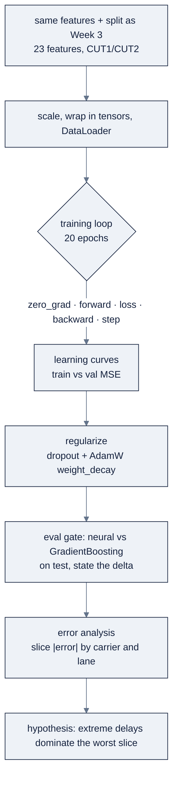

# Week 04: Deep Learning with PyTorch

> Part of AI Engineering Lab · Week 04 of 24 · Section: Foundations · Category: Deep Learning
> 🎯 Use case: A neural ETA model that beats the Week 3 baseline, with a first error analysis by carrier and lane.

## The problem

ZoroLogistics has a working gradient-boosting ETA model from Week 3, and a suspicion that a neural network could do better *if it's trained and evaluated honestly*. The temptation is to skip the discipline: train a big MLP, watch the training loss fall, and declare victory. But a neural net is the fastest overfitter in the toolbox: it can memorize noise, diverge on an untuned learning rate, and fail *silently*, its output is a number that looks plausible even when the model is broken. And unlike a random forest, you can't glance at feature importances to see what it learned; you have to interrogate it with an error analysis.

Without this week, ZoroLogistics gets a demo, not a model: a notebook whose training curve plunges while the validation curve drifts up, shipped as "the neural model won." With this week, the company gets the discipline that separates an AI engineer from a demo builder: a **regularized MLP** trained on the same time-aware split as Week 3, compared against the gradient-boosting baseline *with the delta stated, win or lose*, and a **first error analysis by carrier and lane** that names where the model fails and hypothesizes why. The honest result this week is instructive: the small MLP lands at **MAE ≈ 4.99 h** versus the baseline's **4.87 h**, a virtual tie that loses by **0.12 h**. That's a *correct* outcome, and reporting it straight is the point.

## Objectives

- [ ] By Friday you can build tensors, read a computation graph, and demonstrate autograd computing gradients for you.
- [ ] By Friday you can train an MLP for `delay_hours` regression with a DataLoader, a training loop, and learning curves.
- [ ] By Friday you can apply dropout and weight decay, then tune at least three hyperparameters on the validation split.
- [ ] By Friday you can ship an error-analysis note that names the biggest error cluster by carrier/lane and states a hypothesis.

## Day-by-day plan

| Day | Study | Run | Ship | Time |
|---|---|---|---|---|
| **Mon** | Read [`reference/knowledge-base/02-ml-dl-fundamentals.md`](../../reference/knowledge-base/02-ml-dl-fundamentals.md) §8 to 12 (tensors, autograd, training loop, regularization) | `01-pytorch-tensors-and-autograd.ipynb` tensor + autograd cells | Hand-computed gradient check | ~2 h |
| **Tue** | The training loop; loss vs. metric | Run the MLP notebook end-to-end; plot the curves | First learning-curve read | ~2.5 h |
| **Wed** | Regularization (dropout, weight decay); hyperparameters | Tune width, dropout, weight decay on **val** | Best val-MAE combo | ~2.5 h |
| **Thu** | Evals + error analysis | Compare neural vs baseline on test; slice by carrier/lane | Error-cluster table | ~2.5 h |
| **Fri** | Unpredictable outputs → evals | Write the error-analysis note | `week-04-model-card.md` committed | ~3 h |
| **Sat** | Review the week | Take the quiz (`quiz.md`, 8/10 to pass) | Record the score in Notes | ~45 min |

## Concepts

Deep learning adds *no new concept* beyond Week 3's supervised learning, it changes the model family (a stack of parameterized functions trained end-to-end with gradient descent) and how you train it (batching, optimizers, regularization). Everything from Week 3, metric first, time-aware split, baseline, still applies, and now matters more, because a neural net overfits faster and fails more silently than a random forest.

### 1. Tensors and device (GPU/MPS)

A **tensor** is a multi-dimensional array with a dtype and a device. A scalar is rank-0, a vector rank-1, a matrix rank-2, a batch of matrices rank-3. In PyTorch a batch of `B` examples with `D` features is a `(B, D)` tensor, and moving it to a GPU (or Apple MPS) is one `.to(device)` call. Weeks 1 to 4 are CPU-only by design, the models are small enough that a laptop is fine, but the tensor device abstraction is what later lets the *same* code run on a datacenter GPU.

### 2. Autograd and the computation graph

PyTorch records every operation on a `requires_grad=True` tensor into a **computation graph**. After you compute a scalar loss, one call to `loss.backward()` walks that graph in reverse and fills `.grad` on every parameter. You write the forward math; the framework derives the gradients, "automatic differentiation."

**Worked example 1: the gradient you can do in your head.** For `f(x) = x²`, `df/dx = 2x`, so at `x = 3` the gradient is `6.0`, the notebook's autograd cell asserts exactly that. A second cell builds a sum-of-squares loss `loss = (w**2).sum()` at `w = [2.0, -1.0]`; because the gradient of `sum(w²)` is `2w`, `w.grad` prints `[4.0, -2.0]`. These two checks are the entire mental model: **backward fills gradients from the chain rule.**

### 3. `nn.Module`, linear layers, activations

An `nn.Module` holds parameters; a **linear layer** computes `y = xW + b`; an **activation** inserts non-linearity (without it, stacked linear layers collapse into one). ReLU is the hidden-layer workhorse; the final layer of a regression net has a single output and *no* activation (a delay can be any real value). The toy MLP in notebook 1 is `Linear(3,16) → ReLU → Linear(16,1)`; the ETA MLP in notebook 2 is `Linear(n_in,128) → ReLU → Dropout → Linear(128,64) → ReLU → Linear(64,1)`.

### 4. Loss, optimizers, and the training loop

The **loss** is a single differentiable number (MSE for regression); the **optimizer** uses the gradients to update weights (AdamW = Adam with decoupled weight decay). The **training loop** is five lines, identical for every model:

```python
for xb, yb in loader:        # a batch of inputs and targets
    opt.zero_grad()          # clear last step's gradients
    loss = loss_fn(model(xb), yb)
    loss.backward()          # autograd fills .grad
    opt.step()               # optimizer updates weights
```

Forward, loss, backward, step, commit those five lines to memory; they are the engine of the rest of the program.

| Line | Purpose |
|---|---|
| `opt.zero_grad()` | Clear last step's gradients so they don't accumulate |
| `loss = loss_fn(model(xb), yb)` | Forward pass, then measure the error |
| `loss.backward()` | Autograd walks the graph and fills `.grad` |
| `opt.step()` | Optimizer updates the weights from the gradients |

### 5. Batches, DataLoader, learning curves

Gradient descent one example at a time is noisy; on the whole dataset it's expensive. **Batching** computes the gradient on a mini-batch (here 256) and steps, cheap, noisy enough to escape bad minima, and GPU-friendly. `DataLoader` shuffles training data (never val/test order) and hands out batches. **Learning curves** plot train vs. validation loss per epoch and are the single most important diagnostic: read the *gap* between the curves, not just the values. The two notebooks deliberately use both extremes so the contrast is visible: the toy MLP in notebook 1 trains on the *full* 200-row dataset at once (batch = everything, `lr=0.05`), while the ETA MLP in notebook 2 steps through 228 mini-batches per epoch at `lr=1e-3`. The full-batch toy run is fast and stable enough to watch the loss fall to near zero; the mini-batch run is how a real model generalizes on 58,000 rows.

**Worked example 2: reading the curves.** The ETA model trains on 58,392 rows in batches of 256, so each epoch runs **228 batches** through the loop. With 23 features (7 numeric + 4 one-hot weather + 12 one-hot commodity), the first epoch prints **train MSE 82.5 / val MSE 76.8**; by the last of 20 epochs it is **train 80.0 / val 76.4**. The gap stays small and stable: the model is *not* overfitting, and the val MSE plateau says more epochs won't help much.

| Curve shape | Diagnosis | Action |
|---|---|---|
| Both high and flat | Underfitting | Add capacity or better features |
| Train low, val high, widening gap | Overfitting | Dropout, weight decay, more data |
| Both low and converging | Healthy | Maybe train longer |

### 6. Regularization: dropout and weight decay

Both attack the same symptom (train much better than val) through different mechanisms: **dropout** randomly zeroes a fraction of activations *during training only* (every forward pass is a thinned network), and **weight decay** adds a squared-weight penalty to the loss (in PyTorch it's the `weight_decay=` argument on the optimizer). The honest way to know whether you need them is the learning-curve gap.

| Regularizer | Mechanism | Use when |
|---|---|---|
| Dropout | Randomly zeroes a fraction of activations, training only | A single neuron becomes indispensable |
| Weight decay | Adds a squared-weight penalty to the loss | Weights grow large and the function gets jagged |

### 7. Unpredictable outputs → evals + error analysis

This is the habit the week *installs*, and the one Ng ranks as the biggest predictor of team velocity: **evals + error analysis** (see [`reference/knowledge-base/01-ai-engineering-discipline.md`](../../reference/knowledge-base/01-ai-engineering-discipline.md)). Your neural ETA must be *compared against the Week 3 baseline on the test set with the delta stated*, the eval gate, *then* you slice errors by **carrier and lane**, find the biggest cluster, and form a hypothesis. A metric tells you *how wrong*; error analysis tells you *where to look*.

**Worked example 3: the honest head-to-head.** On the held-out test set the neural MLP scores **MAE 4.987 h / RMSE 9.377 h**; the retrained gradient-boosting baseline scores **MAE 4.871 h / RMSE 9.372 h**. The **delta is +0.116 h**, the MLP loses by about 7 minutes on average, a virtual tie. Slicing absolute error by carrier shows the worst carrier **C002 at 6.68 h** (vs. the ~5.0 h average) and the worst lane **L016 at 5.78 h**. The correct hypothesis is not "the model is bad" but "a few extreme delays dominate those slices, check weather and seasonality before blaming the network." That note is the deliverable.



### How it breaks

The loop breaks in four classic ways. **Forgetting `opt.zero_grad()`** accumulates gradients across batches and training diverges; **forgetting `model.eval()`** leaves dropout on at inference, corrupting test predictions. **A 100× learning rate** makes the loss explode (the Week 4 exercise deliberately induces this and reads the wreck from the curve); **fitting the scaler on all data** leaks val/test statistics into training. It also breaks *conceptually* when you **skip the baseline comparison**, a neural net that "improved" only against its own training loss proves nothing, or when you **touch the test set while tuning**: tune width/dropout/weight decay on validation only, then evaluate test exactly once. And it breaks when you **expect a win**: on tabular data a small MLP often only *approaches* a well-tuned gradient-boosting baseline; the discipline, not the victory, is the deliverable.

For deeper dives: the discipline file's §8 to 12, and [`reference/knowledge-base/01-ai-engineering-discipline.md`](../../reference/knowledge-base/01-ai-engineering-discipline.md) §"Building and deploying AI applications" for why unpredictable outputs demand evals + error analysis.

## Notebook walkthrough

**`notebooks/01-pytorch-tensors-and-autograd.ipynb`** imports torch, detects the device (CPU here), seeds `torch.manual_seed(0)`, then builds a `(2, 3)` tensor and shows `shape`/`dtype`/`device` plus a matrix multiply `a @ b`. The autograd cell proves `x**2` at `x=3` yields grad `6.0`, and `(w**2).sum()` at `w=[2,-1]` yields `[4,-2]`. The toy-MLP cell defines `TinyMLP`, trains 400 epochs on exactly-linear data (`y = 2*x0 − 1.5*x1 + 0.5*x2` + noise), and prints the final loss, near zero means it learned the signal. The final cell prints **`TOY_MLP_FINAL_LOSS`**.

**`notebooks/02-mlp-eta-train-and-eval.ipynb`** rebuilds the Week 3 features and split, scales with `prep.fit_transform(train)` (fit on train only), wraps tensors in `TensorDataset`/`DataLoader` (batch 256, shuffle train only), defines `EtaMLP` with dropout, and runs a 20-epoch loop that records train and val MSE per epoch. It plots the learning curves, evaluates on test, retrains `GradientBoostingRegressor` on the same split, prints both MAE/RMSE and the **delta**, then slices absolute error by `carrier_id` and `lane_id` (worst 5 each) and prints the biggest cluster + a hypothesis. The final cell prints **`NEURAL_TEST_MAE`**, **`BASELINE_TEST_MAE`**, and **`DELTA`**, expect ≈ 4.99 vs. 4.87, delta ≈ +0.12. "Correct" output: curves show a small stable gap, the delta is *stated* (win or lose), and an error cluster is named with a hypothesis.

Cells to modify: the Standard exercise changes exactly one line, the learning rate (`lr=1e-3` → `lr=0.1`) or the scaling step, and reads the wreck from the printed curves. The Stretch exercise replaces the fixed `width=128`, `dropout=0.1`, and `weight_decay=1e-4` with a small grid loop scored on validation. Leave the two seeds (`torch.manual_seed(0)` and the shared `CUT1`/`CUT2`/feature builder) untouched, or the neural-vs-baseline comparison stops being a fair head-to-head. A correct run prints three numbers plus the worst-carrier and worst-lane tables; the deliverable is those numbers *together with* the hypothesis, never the numbers alone. Read the curves before the metrics: a widening train/val gap is overfitting, and a flat-high pair is underfitting.

## The use case (Friday)

**Deliverable:** a model card v2 (`week-04-model-card.md`) with the neural test MAE, the Week-3 baseline MAE it was compared against, and an error-analysis note: the biggest error cluster (by carrier and/or lane) plus a one-sentence hypothesis for its cause.

**Zorost gate:** a stranger can re-run your training notebook (same seed, same split, same hyperparameters) and reproduce your test MAE, and you can show them *where the model fails*, the carrier/lane slice where error concentrates, and your hypothesis for why. The number and the "why" ship together, or neither ships.

**Stretch variant:** run a small **hyperparameter sweep** (hidden width × dropout × weight decay) driven by validation MAE, record the best combo, and only then evaluate test once, then add a second model (e.g. a wider net or a shorter one) and show whether the extra capacity helped or hurt the gap.

## Common pitfalls

| Pitfall | Why it happens | Fix |
|---|---|---|
| Diverging loss | Learning rate too high (or no `zero_grad`) | Lower the LR; always `opt.zero_grad()` before `backward()` |
| Dropout active at inference | Forgetting `model.eval()` | Call `model.eval()` + `torch.no_grad()` for validation/test |
| Gradient accumulation | Missing `zero_grad()` | Place `opt.zero_grad()` at the top of every batch loop |
| Scaler fit on all data | `prep.fit_transform(df)` before splitting | Fit on train only, transform val/test |
| Misreading the curves | Looking at values, not the gap | Read the *gap*; a widening gap = overfitting, flat-high = underfitting |
| Tuning on the test set | Wanting "one more check" | Tune on validation; touch test exactly once |
| No baseline comparison | Believing the training loss | Retrain the Week 3 baseline on the same split; state the delta |
| Expecting the MLP to win | Overestimating deep nets on tabular data | Report the tie/loss honestly; the discipline is the deliverable |

## Glossary

- **Tensor**: a multi-dimensional array with a dtype and a device.
- **Autograd**: PyTorch's automatic differentiation via a recorded computation graph.
- **`requires_grad`**: the flag that makes a tensor record operations for backprop.
- **`nn.Module`**: PyTorch's base class for parameter-holding model components.
- **Linear layer**: `y = xW + b`; the basic affine building block.
- **Activation**: a non-linearity (ReLU, sigmoid) between layers.
- **Loss vs. metric**: what you optimize (MSE) vs. what you report (MAE).
- **Optimizer**: the algorithm (Adam/AdamW) that updates weights from gradients.
- **Training loop**: `zero_grad → forward → loss → backward → step`.
- **Batch / DataLoader**: mini-batch of examples; the iterator that shuffles and yields them.
- **Dropout / weight decay**: the two regularizers that fight overfitting.
- **Learning curve**: train vs. validation loss per epoch; read the gap.

## Self-check (quiz)

Open [`quiz.md`](quiz.md) and answer all 10 questions. The passing bar is **8/10**; each question names the Concepts subsection or notebook cell it comes from.

## Exercises

Four graded exercises, **Easy** (run the tensor/autograd notebook and confirm the gradient), **Standard** (break one thing and diagnose it from the curves), **Stretch** (tune three hyperparameters on validation, then test once), and **Portfolio** (commit model card v2 with the error-analysis note). Hints for each live in [`exercises.md`](exercises.md).

## Sources

- PyTorch documentation: https://pytorch.org/docs/stable/
- PyTorch autograd tutorial: https://pytorch.org/tutorials/beginner/blitz/autograd_tutorial.html
- PyTorch `nn` / `DataLoader` / optimizers: https://pytorch.org/docs/stable/nn.html
- scikit-learn user guide: https://scikit-learn.org/stable/user_guide.html
- Andrew Ng, *The AI Engineering Skills Map*, The Batch issue 366: https://www.deeplearning.ai/the-batch/issue-366
- Andrew Ng, *Improve Agentic Performance with Evals and Error Analysis, Part 1*: https://www.deeplearning.ai/the-batch/improve-agentic-performance-with-evals-and-error-analysis-part-1
- Fereydun Hashemi (Zorost), *The AI Engineering Skills Map, turned into a training plan*: https://zorost.com/ai-engineering-skills-map-training-guide
- Aurélien Géron, *Hands-On Machine Learning*, 3rd ed. (O'Reilly, 2022): https://www.oreilly.com/library/view/hands-on-machine-learning/9781098125967/
