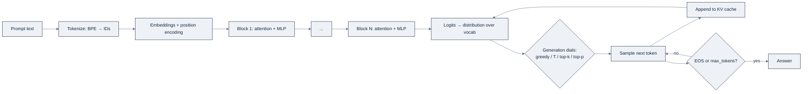

# Week 05: LLMsの仕組み——TokenからTransformerまで

> **日本語版** · [英語版](README.md) · [演習](exercises.ja.md) · [クイズ](quiz.ja.md)
> AI Engineering Labの一部 · Week 05 of 24 · Section: LLM Core · Category: LLM Internals
> · Notebooks: [01-tokenization-lab.ipynb](notebooks/01-tokenization-lab.ipynb) · [02-embeddings-and-attention-lab.ipynb](notebooks/02-embeddings-and-attention-lab.ipynb)

## 問題

ZoroLogisticsは一日に100,000件のshipment noteを、carrier更新、exception log、support ticketとして処理しており、経営層はそれぞれをops desk向けに要約するLLMを求めています。誰かがpromptを書く前に、誰かがお金のquestionに答えなければなりません。*これはいくらかかり、そもそもmodelは我々のcallをwindowに収められるのか？* naiveな答え、「ただのtextでしょ、wordsは安い」は、quietに月五桁のコストがかかるsummarizerをshipする、あるいはtoken budgetを誰も測らなかったことが本当のfaultなのにmodelが「混乱した」と責めるteamの作り方です。

今週は、その後のすべてのdecisionを読めるようにするmental modelを構築します。LLMはmemoを送るreasoning engineではありません。**next-token predictor** です。あなたのpromptをtokenとして読み、vectorに変換し、attentionで文脈を集め、次のtokenをsampleする。これを繰り返します。cost、latency、memory、予測不可能性はすべて、この一つの事実から導かれます。これがなければ「なぜ遅いのか？」「なぜ請求が跳ねたのか？」に答えはありません。あれば、realのshipment noteをtokenizeし、callの価格を一円単位で計算し、「ZoroLogistics」というbrand名が四tokenで「shipment」が一tokenかかる理由を説明できます。

before/afterは具体的です。beforeでは、ops teamが `chars / 4` のruleでcostを当て、carrier codeが余分なsubwordに分割されるため20%過少見積もります。afterでは、固定seedから再現される、noteごとと100k callごとのドル金額をprintする設定可能な `$/Mtok` estimatorをshipします。

## 目標

金曜日までにできるようになること:

- [ ] LLMが「答える」ときに何をするかを一文で説明する（学習済みdistributionから次のtokenを、繰り返しsampleする）。そしてrequestをend-to-endで追う。tokens → embeddings → attention blocks → distribution → sample。
- [ ] `tiktoken` でrealのfreight textをtokenizeし、`chars / 4` の当て推量ではなく *実際の* token countで、OpenAI互換のcallを設定可能な `$/Mtok` で値付けする。
- [ ] sentence transformerでcommodity descriptionをembedし、cosine similarityでrankする。なぜ似た意味が近くに位置するのかを説明する。
- [ ] NumPyでscaled dot-product attentionとcausal maskを実装し、attention重み行列を読んで、どのtokenがどのtokenに注目するかを言う。

## 日ごとの計画

| Day | Study | Run / build | Ship | Time |
|---|---|---|---|---|
| **Mon** | tokenization（BPE、vocab、token count）とembeddings。[`reference/knowledge-base/03-llm-core-concepts.md`](../../reference/knowledge-base/03-llm-core-concepts.md) §1〜2 | `01-tokenization-lab.ipynb` のcell 0〜6を流し読み | Notes：一文mental model + BPEが「ZoroLogistics」を分割する理由 | 約2時間 |
| **Tue** | self-attention、transformer block、KV cache（§3〜6） | notebook 1をend-to-endで実行。`$/Mtok` estimatorを追加 | realのnote一枚のtoken-costの数字 | 約2時間 |
| **Wed** | embeddings。word vs. contextual、cosine similarity（§2） | `02-embeddings-and-attention-lab.ipynb` Part 1を実行 | 3つのqueryに対するTop-3 commodity match | 約2時間 |
| **Thu** | codeでのattention。causal masking。generation dial（§3、§10） | notebook 2 Part 2を実行。重みheatmapを読む | 声に出して説明できるattention行列 | 約2時間 |
| **Fri** | end-to-end pipeline diagramを復習（§"How the pieces fit together"） | use caseを組み立てる。estimator + similarity search、固定seed | 金曜日の成果物 + 一段落のnote | 約3時間 |

*（Sat: Week 5のquizを受ける。checklistは `exercises.md` 参照。）*

## 概念

まず [`reference/knowledge-base/03-llm-core-concepts.md`](../../reference/knowledge-base/03-llm-core-concepts.md) を読んでください。この節が地図で、あのfileが地形です。discipline全体が一つの事実に懸かっています。**LLMは次のtokenを予測する。** knowledge baseを参照せず、内なる独白で「決定」せず、callの間で永続するmemoryも持ちません。語彙上の学習済みdistributionから、一度に一つのtokenをsampleします。AI engineerとしてのあなたの仕事は、tokenと確率について考えることであって、modelを擬人化することではありません。

### Tokenizationは正面玄関

modelは文字ではなく **token** を読みます。tokenizerはtextをsubwordの断片に切り、それぞれを整数のIDにmapします。**BPE（byte-pair encoding）** は、最も頻出する隣接文字pairを繰り返しmergeしてvocabを構築します。だからよく使う語は単一tokenになり（"shipment"）、珍しい語や造語は分割されます（"ZoroLogistics" → `Z` / `oro` / `Log` / `istics`、四token。tracking code `ZRL-10042` は五token）。これが、IDs、code、emojiだらけのfreight textで `chars / 4` 推定がズレる理由です。同じ情報でも、内容によってtokenize結果が大きく変わります。notebookはこれを `cl100k_base`（GPT-4と `text-embedding-3` の背後にあるtokenizer）で直接測ります。

| textの種類 | Chars | Tokens | Chars/token |
|---|---|---|---|
| 英文prose | 90 | 17 | 5.3 |
| Shipment note | 214 | 41 | 5.2 |
| Bill of lading | 364 | 123 | 3.0 |
| Support ticket | 67 | 20 | 3.4 |
| Python code | 92 | 28 | 3.3 |
| Commodity名 | 162 | 30 | 5.4 |
| Unicode/emoji | 49 | 15 | 3.3 |

proseはcompact（~5 chars/token）で、IDsやcodeはtokenを食います（~3）。だからrealのtokenizerなしのcost推定は、freight pipelineが満載しているまさにそのfieldで、*方向的に* 間違えます。token countはcostに直接効きます。`cost = (input_tokens × $/input_token) + (output_tokens × $/output_token)`。百万tokenあたりで価格付けされ、outputは通常inputの数倍です。

### Embeddings：wordがvectorになる

tokenizerは各tokenにIDを与え、**embedding** は次元 `d` のvectorを与えます。似た意味が近くに来るように学習されます。二つのlevelが重要です。**word（static）embedding** は語ごとに一つのvectorを割り当てるので、"bank"はriverbankも送金も同じ一つのvectorです。**contextual embedding**、transformerが産出するもの、は同じ語でも文脈ごとに *異なる* vectorを与えます。"river bank"の"bank"と"bank transfer"の"bank"は別方向を指します。contextual embeddingは多義性を扱え、検索でindexし（Week 7）、類似度で比較するのはこのvectorです。vectorは共有の幾何空間に住むので、二つのvector間の **cosine similarity** が意味的な近さを測ります。「このqueryに最も似ているcommodity descriptionはどれか」の背後にあるprimitiveで、notebook 2はこれをtop-3 rankingに変えます。

### Self-attention：tokenが会話する仕組み

attentionはtoken *間* で情報を動かします。各tokenのembeddingは、学習済み行列で三つのvectorに射影されます。**Query**（「何を探しているか？」）、**Key**（「何を持っているか？」）、**Value**（「何を提供するか？」）。scaled dot-product attentionは、各tokenについて他のすべてのtokenのkeyとのscoreを計算し、scaleし、合計1になるようsoftmaxで重みにし、valueを混ぜます。

```
Attention(Q, K, V) = softmax(Q·Kᵀ / √d_k) · V
```

`√d_k` で割るのは、次元が大きくなるとsoftmaxが飽和するのを防ぐためです。**multi-head** attentionは複数のheadを異なる射影で並走させ、headごとに専門化できます（一つはsyntax、一つはshipment ID、一つは日付）。生成中の **causal mask** は現位置より後の位置をすべてゼロにし（下三角mask）、tokenが未来を覗かないようにします。これがincrementalな一tokenずつの生成を可能にするものでもあります。**transformer block** はattentionと小さなMLPを **residual connection**（`x ← x + …`）と **layer norm** で包み、**position encoding**（最近のmodelは **RoPE**）が各tokenがどのslotにいるかをattentionに教えます。attention自体は順序を知覚できないからです。このblockを数十段積むと、最後のtokenの最終vectorが語彙全体上のdistributionに射影されます。

### KV cache：長い文書がmemoryを食う理由

token *n+1* を予測するため、modelはtoken *1…n* に注目します。毎stepでそのprefix全体を再計算するのは二乗の仕事です。**KV cache** は過去の各tokenのKeyとValueを保存するので、新しいtokenは自分のQ/K/Vだけを計算し、cacheに対してattendします。stepあたりのcomputeはO(n²)からO(n)に下がり、生成はmemory-boundになります。cacheは線形に伸びます。おおよそ `2 × layers × heads × head_dim × seq_len × bytes_per_param`。長い文書は、*答えが短くても* 高くつきます。prefillがcacheを構築し、それがresidentであり続けるからです。これがprompt cachingとcontext-budgetのdiscipline（Week 6）の背後にあるleverです。

### 生成：distribution → text

最終distributionが与えられると、**greedy** decodeは最高確率のtokenを取ります（決定的、extraction向き）。**sampling** はdistributionに従って引きます（多様、tuningが必要）。三つのdialがsamplingを形づくります。

| Dial | 何をするか | 使う場面 |
|---|---|---|
| Temperature（T） | logitsをTで割る。T<1は鋭く、T>1は平坦に | 決定的extraction vs. 創造的draft |
| Top-k | 最も確率の高いk個のtokenに制限する | junkな裾を安く除去 |
| Top-p（nucleus） | 質量pに達する最小の集合を保持する | adaptive cutoff、汎用default |
| max_tokens / EOS | 長さの上限、停止を許す | cost上限、暴走出力の防止 |

### MoE、そしてmodelが「知っている」仕組み

dense transformerはすべてのtokenを同じMLPに通します。**mixture-of-experts（MoE）** modelは多数の小さなMLPsを持ち、**router** が各tokenをtop-1/2のexpertに送ります。総parameterは巨大、tokenあたりcomputeは控えめ。ただし *すべての* expertがresidentでなければならず、MoE modelはmemoryを食います。知識が入る経路は三つあり、時期順に並べると:

| 仕組み | 重みは変わる？ | Cost | 可逆性 |
|---|---|---|---|
| In-context learning（ICL。zero/few-shot） | No | 最安 | 最高。promptを変えるだけ |
| Retrieval（RAG、Week 7） | No | 中 | 高い。corpusを再indexする |
| Fine-tuning（Week 10） | Yes | 最高 | 最低。重みを再訓練/rollback |

engineerのdefault順序は **ICL first、次にretrieval、最後にfine-tuning** です。最後に、**context window** とは、modelが一度のcallでattendできる最大token数です。capabilityであると同時にbillでもあり、習慣はこれを予算化することです（Week 6）。



### 実例1：shipment note一枚のtoken budget

notebookのestimator（`estimate_cost`、`01-tokenization-lab.ipynb` のcell 10）は、設定可能な `$/Mtok` でcallの価格を計算します。実際のdataに対するrealな `cl100k_base` countを使うと:

- system prompt "Summarize this shipment note into 3 bullet points for an ops agent." → **16 token**。
- 最初に生成されたshipment note（214文字）→ **41 token**（~5.2 chars/tokenであって、4では *ない* ことに注意）。
- 3-bulletの要約と仮定 → **60 output token**。

```
input  = 16 + 41 = 57 tokens → 57 / 1e6 × $1.00  = $0.000057
output = 60 tokens           → 60 / 1e6 × $3.00  = $0.000180
per-call cost ≈ $0.000237
```

scaleしてみます。seed付きの50 noteは平均~30 tokenなので、`per_call_in ≈ 16 + 30 = 46` tokenです。$1.00/$3.00 per Mtokで100,000 note/日とすると:

```
46 / 1e6 × $1.00 + 60 / 1e6 × $3.00 ≈ $0.000226 × 100,000 ≈ $22.58/day
```

この単一の数字が、「かっこいいdemo」と「ops budgetに収まるか」の分かれ目です。ここから見えるlever、system promptの短縮、要約の上限、flagged shipmentだけの要約、はまさにWeek 6で使うものです。価格pairを$0.50/$1.50に下げると同じ一日は **$11.29** です。exerciseは、その変更を再実行してdeltaを示すことです。

### 実例2：KV-cacheのサイジング

答えが短くても長い文書がなぜ痛いのか？ 7B-class model（32 layer、32 head、head_dim 128）を4,096-token context、FP16（2 bytes/param）で考えます:

```
KV cache = 2 × layers × heads × head_dim × seq_len × bytes_per_param
         = 2 × 32 × 32 × 128 × 4096 × 2 bytes
         ≈ 2.15 GB
```

modelの重み自体はFP16で~14 GBですが、単一の長いrequestの *resident* なcacheは~2.15 GBを追加し、100件の並行する長文summarizerは~215 GBのKV cacheをVRAMに保持します。長い文書は **computeを膨らませるより、batch sizeとVRAMをはるかに強く制約します**。これが、modelに投げる *前に* chunkし、truncateし、要約する実用的な理由であって、「もっと大きいwindowを使う」ではありません。Week 8はこの算術をmodel pickerに変えます。

### うまくいかない理由

今週の技法が防ぐfailure modeと、skipしたときに持ち込むfailure mode:

- **`chars / 4` 当て推量。** freightのIDsとcarrier codeは~3 chars/tokenでtokenizeされるので、prose向けのruleは、高くつくfieldまさにそこで15〜25%過少に数えます。常にrealのtokenizerで測ること。
- **KV cacheの忘却。** computeについてだけ考え、memoryを無視する。答えが20 tokenでも、長い入力でboxはVRAMを使い果たします。
- **causal mask off。** 下三角maskがないとmodelは未来のtokenにattendします。訓練では「未来を予測して、出荷まで素晴らしく見える」。生成ではincrementalに動かせません。
- **modelをreasoner扱いする。** next tokenをsampleしているだけです。「modelが忘れた」は大抵「windowが追い出した」か「promptが制約を運ばなかった」です。
- **extractionでtemperatureが高すぎる。** classification/extractionのcallはほぼgreedy（T≈0）を望みます。samplingは分散を加え、それを「間違った答え」としてdebugすることになります。
- **model横断のtoken比較。** 二つのmodelは「同じ」1,000語を異なるtoken countとして読むので、あるtokenizerで見積もったbillは別のものでは間違っています。

## Notebook walkthrough

**`01-tokenization-lab.ipynb`**（CPUのみ、internet不要）。cell 2が、template（"departed {city} sorting hub"、"reefer unit {code} fault…"）から50件のrealisticなshipment noteを生成するgeneratorにseedを固定します。cell 4は *"ZoroLogistics ships pharmaceutical freight from Houston to New Orleans."* でBPEのencode/decode往復を実行し、`decode(encode(text)) == text` をassertします。cell 6がお金のcellです。`"shipment"`、`"ZoroLogistics"`、`"pharmaceuticals"`、`"🚚"`、`"ZRL-10042"`、`"unfathomable"`をtokenizeしてsubword片をprintします。「ZoroLogistics」が四tokenに、emojiが三tokenに分割されるのを見てください。cell 8は七種類のtext型でchars/token表を構築します（上の表）。cell 10が `estimate_cost` を定義し、cell 12が100,000 note/日にscaleします。最後のcellは `WEEK5_NB1_DAILY_COST_USD` をprintします。seed付きdata、$1.00/$3.00で **≈ 22.58**。「正しい」出力は数式ではなく、$20s前半の数字です。

**`02-embeddings-and-attention-lab.ipynb`**（⚠️ 一回限りのmodel downloadにinternetが必要。deterministicなoffline fallback付き）。cell 2は12個のcommodity記述子（"pharmaceuticals and medical supplies needing cold-chain handling"、"industrial chemicals and solvents with hazmat placards"…）と三つのqueryを定義します。*"temperature-sensitive medical cargo that must stay cold."* も含まれます。cell 4は `all-MiniLM-L6-v2`（384-dim）をloadするか、seed付きhash embeddingにfallbackします。cell 6ですべてをembedし、queryごとのtop-3 cosine matchをprintします。最初のqueryの正しいtop-1は **pharmaceuticals**（またはperishables）で、"furniture"では決してありません。Part 2は `scaled_dot_product_attention` と `causal_mask` をNumPyで実装し（cell 8〜10）、cell 12で5-tokenの列 `["shipment", "delayed", "due", "to", "storm"]` をidentity射影の単一headに通し、重み行列とASCII heatmapをprintします。heatmapを読んでください。最初のtokenは自分自身にだけattendし、最後のtokenはそれ以前のすべてにattendします（下三角pattern）。最後のcellは `WEEK5_NB2_TOP1_SIMILARITY`、最初のqueryのtop-1 cosineをprintします。realなembedderでは **0.7〜0.8** 近く（hash fallbackは低い値でも正しいcommodityを一位にします）。

## Use case（Friday）

**Deliverable:** shipment noteのtoken-cost estimator（callあたりtoken数 vs. window size）とcommodity similarity search。両方を、ドル金額とtop-3 matchを説明する一段落のnoteとともにforkにcommitします。

**Zorost gate:** 見知らぬ人がinspectでき、あなたが何をしたかを見せられること。noteごとのtoken count、callごと *と* 100,000 callごとのドルcost、各queryのtop-3 commodity matchが、固定seedから再現されて見えること。

**Stretch variant:** notebook 1を、shipment noteの代わりに `data.bol_samples(20, seed=5)` に対して再実行し、同じ価格pairで二列のcost表（note-summarizer vs. BoL-extractor）を作り、BoLの~3 chars/tokenがなぜ文字あたり高くつくinputなのかを一文で書きます。

## よくあるpitfall

| Pitfall | 症状 | Fix |
|---|---|---|
| `chars / 4` でcostを見積もる | IDまじりのfreightでbillが20%ズレる | `tiktoken`（`cl100k_base`）で測る |
| output tokenの無視 | inputだけでcost modeling | 必ずoutput項を足す。inputの3倍の価格です |
| 一つのtokenizerが全modelに合うと仮定 | provider間で数字がdrift | modelごとに再tokenize。どのtokenizerか記録する |
| heatmapの誤読 | causalとdense attentionを区別できない | 下三角patternを確認。未来のcellは~0です |
| NumPy attentionのsoftmax overflow | `nan` の重み | `exp` の前に行maxを引く（notebookはそうしています） |
| 「open weights」を無料で動く扱い | costとlicenseの混同 | costはtoken。licenseはWeek 8です |
| 高いtemperatureでextractionを実行 | 非決定的な「間違った」答え | extractionはT≈0に設定。draftでのみsampleする |
| sizingでKV cacheを忘れる | 長文・短答でOOM | 重み予算に `2·L·H·hd·seq·bpp` を足す |

## Glossary

- **Token**: modelが読むsubword単位。cost、latency、windowの通貨。
- **BPE**: byte-pair encoding。頻出の隣接pairをmergeしてvocabを構築する。珍しい語がsubwordに分割される理由。
- **Embedding**: token/文のdense vector。近さ＝意味の類似。
- **Contextual embedding**: 文脈の関数としてのtoken vector（"bank"は二方向を指す）。
- **Cosine similarity**: 正規化した内積。二つのvectorの向きの一致を測る。−1から1。
- **Self-attention**: すべてのtokenがQ/K/V経由で他のすべてのtokenから文脈を集める。
- **Causal mask**: tokenが未来を見ないようにする下三角mask。
- **KV cache**: 過去のkey/valueを保存し、生成をstepあたりO(n²)でなくO(n)にする。
- **MoE**: mixture-of-experts。routerが各tokenを多数のMLPsのうち少数へ送る。memoryとcomputeの交換。
- **Temperature / top-k / top-p**: 確率distributionを選ばれたtokenに変えるdial。
- **Context window**: 一度のcallでmodelがattendできる最大token数。capabilityでありbillでもある。

## Self-check（quiz）

概念とnotebook codeをカバーする十問が [`quiz.md`](quiz.md) にあります。合格ラインは **8/10** です。

## Exercises

四つのgraded exercise（easy / standard / stretch / portfolio）があります。token-costの再実行、新しいtext型、二head attentionへの拡張、そして `token_budget.py` CLIです。各hintは [`exercises.md`](exercises.md) にあります。

## Sources

- Jay Alammar, *The Illustrated Transformer*：https://jalammar.github.io/illustrated-transformer/
- Alammar & Grootendorst, *How Transformer LLMs Work*（DeepLearning.AI）：https://www.deeplearning.ai/short-courses/how-transformer-llms-work/
- Hugging Face, *Tokenizers documentation*：https://huggingface.co/docs/tokenizers/
- Hugging Face, *Transformers documentation*：https://huggingface.co/docs/transformers/
- OpenAI, *tiktoken*：https://github.com/openai/tiktoken
- sentence-transformers / SBERT：https://www.sbert.net/
- Andrew Ng, *The AI Engineering Skills Map*：https://www.deeplearning.ai/the-batch/issue-366
- Zorost Signals, *Context engineering: treat the window as a budget*：https://zorost.com/context-engineering-budget
- Zorost Signals, *The AI Engineering Skills Map, turned into a training plan*：https://zorost.com/ai-engineering-skills-map-training-guide
