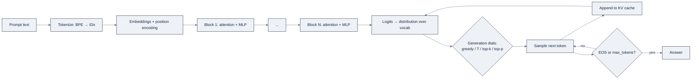

# Week 05, How LLMs Work: Tokens to Transformers

> Part of AI Engineering Lab · Week 05 of 24 · Section: LLM Core · Category: LLM Internals
> 🎯 Use case: Shipment-note token cost estimator plus embedding similarity search over commodity descriptions.

## The problem

ZoroLogistics runs 100,000 shipment notes a day through carrier updates, exception logs, and support tickets, and leadership wants an LLM to summarize each one for the ops desk. Before anyone writes a prompt, someone has to answer the money question: *what will this cost, and will the model even fit our calls in its window?* The naive answer, "it's just text, words are cheap", is how teams ship a summarizer that quietly costs five figures a month, or blames the model for "getting confused" when the real fault was a token budget nobody measured.

This week builds the mental model that makes every later decision legible. An LLM is not a reasoning engine you send a memo to; it is a **next-token predictor**: it reads your prompt as tokens, converts them to vectors, gathers context with attention, and samples the next token, repeatedly. Cost, latency, memory, and unpredictability all fall out of that one fact. Without it, "why is this slow?" and "why did the bill jump?" have no answer. With it, you can tokenize a real shipment note, price the call to the penny, and explain why a brand name like "ZoroLogistics" costs four tokens while "shipment" costs one.

The before/after is concrete: before, the ops team guesses cost with a `chars / 4` rule and under-budgets by 20% because carrier codes split into extra subwords; after, they ship a configurable `$/Mtok` estimator that prints a per-note and per-100k-call dollar figure reproduced from a fixed seed.

## Objectives

By Friday you can:

- [ ] Explain in one sentence what an LLM does when it "answers" (it samples the next token from a learned distribution, repeatedly), and trace a request end to end: tokens → embeddings → attention blocks → distribution → sample.
- [ ] Tokenize real freight text with `tiktoken` and use the *actual* token count, never a `chars / 4` guess, to price an OpenAI-compatible call at a configurable `$/Mtok`.
- [ ] Embed commodity descriptions with a sentence transformer and rank them by cosine similarity, explaining *why* similar meanings land near each other.
- [ ] Implement scaled dot-product attention and a causal mask in NumPy, and read an attention-weight matrix to say which token attends to which.

## Day-by-day plan

| Day | Study | Run / build | Ship | Time |
|---|---|---|---|---|
| **Mon** | Tokenization (BPE, vocab, token counts) and embeddings in [`reference/knowledge-base/03-llm-core-concepts.md`](../../reference/knowledge-base/03-llm-core-concepts.md) §1 to 2 | Skim `01-tokenization-lab.ipynb` cells 0 to 6 | Notes: the one-sentence mental model + why BPE splits "ZoroLogistics" | ~2 h |
| **Tue** | Self-attention, transformer blocks, KV cache (§3 to 6) | Run notebook 1 end-to-end; add the `$/Mtok` estimator | Token-cost number for a real note | ~2 h |
| **Wed** | Embeddings: word vs. contextual, cosine similarity (§2) | Run `02-embeddings-and-attention-lab.ipynb` Part 1 | Top-3 commodity matches for the 3 queries | ~2 h |
| **Thu** | Attention in code; causal masking; generation dials (§3, §10) | Run notebook 2 Part 2; read the weight heatmap | Attention matrix you can explain out loud | ~2 h |
| **Fri** | Review the end-to-end pipeline diagram (§"How the pieces fit together") | Assemble the use case: estimator + similarity search, fixed seed | Friday deliverable + one-paragraph note | ~3 h |

*(Sat: take the Week 5 quiz, see the checklist in `exercises.md`.)*

## Concepts

Read [`reference/knowledge-base/03-llm-core-concepts.md`](../../reference/knowledge-base/03-llm-core-concepts.md) first; this section is the map, that file is the terrain. The whole discipline hangs on one fact: **an LLM predicts the next token.** It does not consult a knowledge base, "decide" in some inner monologue, or hold persistent memory between calls, it samples from a learned distribution over the vocabulary, one token at a time. Your job as an AI engineer is to reason about tokens and probabilities, not to anthropomorphize the model.

### Tokenization is the front door

Models read **tokens**, not characters. A tokenizer cuts text into subword pieces, each mapped to an integer ID. **BPE (byte-pair encoding)** builds the vocabulary by repeatedly merging the most frequent adjacent character pair, so common words become single tokens ("shipment") while rare or invented ones split ("ZoroLogistics" → `Z` / `oro` / `Log` / `istics`, four tokens; the tracking code `ZRL-10042` → five tokens). This is why a `chars / 4` estimate drifts on freight text full of IDs, codes, and emoji: the same information tokenizes very differently depending on what it is. The notebook measures it directly with `cl100k_base` (the tokenizer behind GPT-4 and `text-embedding-3`):

| Text type | Chars | Tokens | Chars/token |
|---|---|---|---|
| English prose | 90 | 17 | 5.3 |
| Shipment note | 214 | 41 | 5.2 |
| Bill of lading | 364 | 123 | 3.0 |
| Support ticket | 67 | 20 | 3.4 |
| Python code | 92 | 28 | 3.3 |
| Commodity names | 162 | 30 | 5.4 |
| Unicode/emoji | 49 | 15 | 3.3 |

Prose is compact (~5 chars/token) and IDs/code are token-hungry (~3), so any cost estimate made without the real tokenizer is wrong in a *directional* way on exactly the fields a freight pipeline is full of. Token counts drive cost directly: `cost = (input_tokens × $/input_token) + (output_tokens × $/output_token)`, priced per million tokens with output usually several times input.

### Embeddings: words become vectors

A tokenizer gives each token an ID; an **embedding** gives it a vector of dimension `d`, learned so similar meanings land near each other. Two levels matter. **Word (static) embeddings** assign one vector per word, so "bank" gets a single vector whether it means a riverbank or a transfer. **Contextual embeddings**, what transformers produce, give the same word a *different* vector per context: "bank" in "river bank" vs. "bank transfer" points different ways. Contextual embeddings handle polysemy and are the vectors you index for retrieval (Week 7) and compare for similarity. Because vectors live in a shared geometric space, **cosine similarity** between two vectors measures semantic closeness, the primitive behind "which commodity description is most like this query," which notebook 2 turns into a top-3 ranking.

### Self-attention: how tokens talk

Attention moves information *between* tokens. Each token's embedding is projected into three vectors with learned matrices: **Query** ("what am I looking for?"), **Key** ("what do I contain?"), **Value** ("what do I contribute?"). Scaled dot-product attention computes, for every token, scores against every other token's key, scales them, softmaxes to weights summing to 1, and blends the values:

```
Attention(Q, K, V) = softmax(Q·Kᵀ / √d_k) · V
```

Dividing by `√d_k` stops the softmax from saturating as the dimension grows; **multi-head** attention runs several such heads in parallel with different projections so different heads can specialize (one tracks syntax, one tracks a shipment ID, one tracks dates). During generation a **causal mask** zeroes out every position after the current one (a lower-triangular mask), so a token never peeks at the future, which is also what makes incremental, one-token-at-a-time generation possible. A **transformer block** then wraps attention and a small MLP in **residual connections** (`x ← x + …`) and **layer norm**, and a **position encoding** (modern models use **RoPE**) tells attention which slot each token occupies, since attention itself is order-blind. Stack dozens of these blocks and the final vector for the last token is projected into a distribution over the whole vocabulary.

### The KV cache: why long documents cost memory

To predict token *n+1* the model attends over tokens *1…n*; recomputing that whole prefix every step is quadratic work. The **KV cache** stores each past token's Key and Value, so each new token only computes Q/K/V for itself and attends against the cache, compute per step falls from O(n²) to O(n), and generation becomes memory-bound. The cache grows linearly: roughly `2 × layers × heads × head_dim × seq_len × bytes_per_param`. Long documents are therefore expensive *even when the answer is short*, because the prefill still builds the cache and it stays resident, the lever behind prompt caching and context-budget discipline (Week 6).

### Generation: distribution → text

Given the final distribution, **greedy** decoding takes the highest-probability token (deterministic, good for extraction); **sampling** draws according to the distribution (varied, needs tuning). Three dials shape sampling:

| Dial | What it does | Use it for |
|---|---|---|
| Temperature (T) | Divides logits by T; T<1 sharpens, T>1 flattens | Deterministic extraction vs. creative drafting |
| Top-k | Restricts to the k most probable tokens | Removing the junk tail cheaply |
| Top-p (nucleus) | Keeps the smallest set reaching mass p | Adaptive cutoff, general-purpose default |
| max_tokens / EOS | Bounds length, allows stopping | Cost caps, preventing runaway output |

### MoE, and how a model "knows"

A dense transformer routes every token through the same MLP; a **mixture-of-experts (MoE)** model keeps many smaller MLPs and a **router** that sends each token to the top-1/2 experts, huge total parameters, modest compute per token, but *all* experts must stay resident, so MoE models are memory-hungry. Knowledge enters three ways, ordered by when:

| Mechanism | Weight change? | Cost | Reversibility |
|---|---|---|---|
| In-context learning (ICL: zero/few-shot) | No | Cheapest | Highest, change the prompt |
| Retrieval (RAG, Week 7) | No | Medium | High, re-index the corpus |
| Fine-tuning (Week 10) | Yes | Highest | Lowest, retrain/rollback weights |

The engineer's default order is **ICL first, then retrieval, then fine-tuning**. Finally, the **context window** is the maximum tokens a model can attend to in one call; it is a capability *and* a bill, and the habit is to budget it (Week 6).



### Worked example 1: the token budget for one shipment note

The notebook's estimator (`estimate_cost`, cell 10 of `01-tokenization-lab.ipynb`) prices a call at a configurable `$/Mtok`. Using the real `cl100k_base` counts for the actual data:

- System prompt "Summarize this shipment note into 3 bullet points for an ops agent." → **16 tokens**.
- First generated shipment note (214 characters) → **41 tokens** (note it is ~5.2 chars/token, *not* 4).
- Assumed 3-bullet summary → **60 output tokens**.

```
input  = 16 + 41 = 57 tokens → 57 / 1e6 × $1.00  = $0.000057
output = 60 tokens           → 60 / 1e6 × $3.00  = $0.000180
per-call cost ≈ $0.000237
```

Scale it: the 50 seeded notes average ~30 tokens each, so `per_call_in ≈ 16 + 30 = 46` tokens. Over 100,000 notes/day at $1.00/$3.00 per Mtok:

```
46 / 1e6 × $1.00 + 60 / 1e6 × $3.00 ≈ $0.000226 × 100,000 ≈ $22.58/day
```

That single number is the difference between "cool demo" and "does this fit the ops budget." The levers it exposes, shorten the system prompt, cap the summary, summarize only flagged shipments, are exactly what Week 6 spends on. Drop the price pair to $0.50/$1.50 and the same day costs **$11.29**; the exercise is to re-run that change and show the delta.

### Worked example 2: KV-cache sizing

Why does a long document hurt even when the answer is short? Take a 7B-class model (32 layers, 32 heads, head_dim 128) at a 4,096-token context, FP16 (2 bytes/param):

```
KV cache = 2 × layers × heads × head_dim × seq_len × bytes_per_param
         = 2 × 32 × 32 × 128 × 4096 × 2 bytes
         ≈ 2.15 GB
```

The model weights themselves are ~14 GB at FP16, but the *resident* cache for a single long request adds ~2.15 GB, and 100 concurrent long-document summarizers hold ~215 GB of KV cache in VRAM. Long docs constrain **batch size and VRAM far more than they inflate compute**, which is the practical reason you chunk, truncate, or summarize *before* the model rather than "just use a bigger window." Week 8 turns this exact arithmetic into a model picker.

### How it breaks

The failure modes this week's technique prevents, and the ones it introduces if you skip it:

- **`chars / 4` guessing.** Freight IDs and carrier codes tokenize at ~3 chars/token, so a prose rule under-counts by 15 to 25% on exactly the expensive fields. Always measure with the real tokenizer.
- **Forgetting the KV cache.** You reason about compute and ignore memory; the box runs out of VRAM on long inputs even though the answer is 20 tokens.
- **Causal mask off.** Without the lower-triangular mask the model attends to future tokens, in training it "predicts the future and looks brilliant until it ships"; in generation it can't run incrementally.
- **Treating the model as a reasoner.** It is sampling next tokens; "the model forgot" is usually "the window evicted it" or "the prompt didn't carry the constraint."
- **Temperature too high on extraction.** A classification/extraction call wants near-greedy (T≈0); sampling adds variance you then debug as "wrong answers."
- **Cross-model token comparisons.** Two models read the "same" 1,000 words as different token counts, so a bill estimated on one tokenizer is wrong on another.

## Notebook walkthrough

**`01-tokenization-lab.ipynb`** (CPU only, no internet). Cell 2 seeds a generator that produces 50 realistic shipment notes from templates ("departed {city} sorting hub", "reefer unit {code} fault…"). Cell 4 runs a BPE encode/decode round-trip on *"ZoroLogistics ships pharmaceutical freight from Houston to New Orleans."* and asserts `decode(encode(text)) == text`. Cell 6 is the money cell: it tokenizes `"shipment"`, `"ZoroLogistics"`, `"pharmaceuticals"`, `"🚚"`, `"ZRL-10042"`, `"unfathomable"` and prints the subword pieces, watch "ZoroLogistics" split into four tokens and the emoji into three. Cell 8 builds the chars/token table across seven text types (the table above). Cell 10 defines `estimate_cost`; cell 12 scales to 100,000 notes/day. The final cell prints `WEEK5_NB1_DAILY_COST_USD`, **≈ 22.58** with the seeded data at $1.00/$3.00. "Correct" output is a number in the low $20s, not a formula.

**`02-embeddings-and-attention-lab.ipynb`** (⚠️ internet for the one-time model download; deterministic offline fallback included). Cell 2 defines 12 commodity descriptors ("pharmaceuticals and medical supplies needing cold-chain handling", "industrial chemicals and solvents with hazmat placards"…) plus three queries, including *"temperature-sensitive medical cargo that must stay cold."* Cell 4 loads `all-MiniLM-L6-v2` (384-dim) or falls back to a seeded hash embedding. Cell 6 embeds everything and prints the top-3 cosine matches per query, the correct top-1 for the first query is **pharmaceuticals** (or perishables), never "furniture." Part 2 implements `scaled_dot_product_attention` and `causal_mask` in NumPy (cells 8 to 10) and, in cell 12, runs a 5-token sequence `["shipment", "delayed", "due", "to", "storm"]` through one head with an identity projection, printing the weight matrix and an ASCII heatmap. Read the heatmap: the first token attends only to itself, the last attends to everything before it (the lower-triangular pattern). The final cell prints `WEEK5_NB2_TOP1_SIMILARITY`, the top-1 cosine for the first query, near **0.7 to 0.8** with the real embedder (the hash fallback is lower but still ranks the right commodity first).

## The use case (Friday)

**Deliverable:** the shipment-note token-cost estimator (tokens per call vs. window size) and the commodity similarity search, both committed to your fork with a one-paragraph note explaining the dollar figure and the top-3 matches.

**Zorost gate:** a stranger can inspect it and you can show what it did, they can see the per-note token count, the dollar cost per call *and* per 100,000 calls, and the top-3 commodity matches for each query, all reproduced from a fixed seed.

**Stretch variant:** re-run notebook 1 against `data.bol_samples(20, seed=5)` instead of shipment notes, and build a two-column cost table (note-summarizer vs. BoL-extractor) at the same price pair, then write one sentence on why the BoL's ~3 chars/token makes it the more expensive input per character.

## Common pitfalls

| Pitfall | Symptom | Fix |
|---|---|---|
| Estimating cost with `chars / 4` | Bill is 20% off on ID-heavy freight | Measure with `tiktoken` (`cl100k_base`) |
| Ignoring output tokens | Cost modeled on input only | Always add the output term; it is priced 3× input |
| Assuming one tokenizer fits all models | Numbers drift across providers | Re-tokenize per model; record which tokenizer |
| Reading the heatmap wrong | Can't tell causal from dense attention | Check the lower-triangular pattern; future cells are ~0 |
| Softmax overflow in the NumPy attention | `nan` weights | Subtract the row max before `exp` (the notebook does) |
| Treating "open weights" as free to run | Confusing cost and licensing | Cost is tokens; licensing is Week 8 |
| Running extraction at high temperature | Non-deterministic "wrong" answers | Set T≈0 for extraction; sample only for drafting |
| Forgetting the KV cache in sizing | OOM on long docs, short answer | Add `2·L·H·hd·seq·bpp` to the weight budget |

## Glossary

- **Token**: the subword unit a model reads; the currency of cost, latency, and the window.
- **BPE**: byte-pair encoding; builds a vocabulary by merging frequent adjacent pairs, which is why rare words split into subwords.
- **Embedding**: a dense vector for a token/sentence; closeness = semantic similarity.
- **Contextual embedding**: a token's vector as a function of its context ("bank" points two ways).
- **Cosine similarity**: normalized dot product measuring how aligned two vectors are, −1 to 1.
- **Self-attention**: every token gathers context from every other token via Q/K/V.
- **Causal mask**: a lower-triangular mask that stops tokens from seeing the future.
- **KV cache**: stored past keys/values that make generation O(n) instead of O(n²) per step.
- **MoE**: mixture-of-experts; a router sends each token to a few of many MLPs, trading memory for compute.
- **Temperature / top-k / top-p**: the dials that turn a probability distribution into chosen tokens.
- **Context window**: the maximum tokens a model can attend to in one call; a capability and a bill.

## Self-check (quiz)

Ten questions covering the concepts and the notebook code are in [`quiz.md`](quiz.md), the passing bar is **8/10**.

## Exercises

Four graded exercises (easy / standard / stretch / portfolio), the token-cost re-run, a new text type, a two-head attention extension, and a `token_budget.py` CLI. Hints for each are in [`exercises.md`](exercises.md).

## Sources

- Jay Alammar, *The Illustrated Transformer*: https://jalammar.github.io/illustrated-transformer/
- Alammar & Grootendorst, *How Transformer LLMs Work* (DeepLearning.AI): https://www.deeplearning.ai/short-courses/how-transformer-llms-work/
- Hugging Face, *Tokenizers documentation*: https://huggingface.co/docs/tokenizers/
- Hugging Face, *Transformers documentation*: https://huggingface.co/docs/transformers/
- OpenAI, *tiktoken*: https://github.com/openai/tiktoken
- sentence-transformers / SBERT: https://www.sbert.net/
- Andrew Ng, *The AI Engineering Skills Map*: https://www.deeplearning.ai/the-batch/issue-366
- Zorost Signals, *Context engineering: treat the window as a budget*: https://zorost.com/context-engineering-budget
- Zorost Signals, *The AI Engineering Skills Map, turned into a training plan*: https://zorost.com/ai-engineering-skills-map-training-guide
