# Week 07: RAG、Vector SearchとKnowledge Graph

> **日本語版** · [英語版](README.md) · [演習](exercises.ja.md) · [クイズ](quiz.ja.md)
> AI Engineering Labの一部 · Week 07 of 24 · Section: LLM Core · Category: Retrieval & Graphs
> · Notebooks: [01-rag-policy-bot.ipynb](notebooks/01-rag-policy-bot.ipynb) · [02-knowledge-graph-lab.ipynb](notebooks/02-knowledge-graph-lab.ipynb)

## 問題

ZoroLogisticsのsupport deskは毎日同じpolicy質問に答えています。*「200 Whのlithium batteryを配送できるか？」「shipmentが7日遅れたらrefundはいくらか？」*。そしてfoundation model単体ではこれらに答えられません。ZoroLogisticsのpolicy libraryでtrainingされていないため、拒否するか、推測するか、*他人の* policyの古い記憶から答えるかのどれかです。誘惑的なfixはpolicy folder全体をpromptに貼ることですが、これはwindowを壊し、さらに悪いことに、*どのruleが* 答えを生んだのか証明する手段のない答えを返します。dangerous goodsに関する間違った答えが規制上の結果を伴う以上、これは使い物になりません。

今週は二つのgrounding道具をbuildします。**Retrieval-augmented generation（RAG）** は *関連する* passageをfetchし、そこからcitation付きで答えます。そして **knowledge graph** はvectorが捉えられない関係を捉えます。「Houstonを避けてLong Beachへの最安routeは何か？」はsimilarity searchではなくgraph traversalです。Before/afterは具体的です。beforeではsupport agentはticketごとに五つのpolicy PDFsを読みます。afterではbotが十の未見の質問に、主張ごとに `doc_id` + section citationを付けて答え、**recall@5** をanswer qualityと *別の* 数値としてreportできます。これが「botが動く」と「どこで・なぜ失敗するかを見せられる」の違いです。

## 目標

金曜日までに、次のことができるようになります。

- [ ] 七段階のRAG pipeline（ingest → chunk → embed → index → retrieve → rerank → generate）を説明し、quality問題の大半が住むstageを指摘できる。
- [ ] `data.policy_docs()` をsection-awareなsplitterでchunkし、10問のgolden setで **recall@k** を、answer qualityと *別々に* reportできる。
- [ ] hybrid retriever（dense + keyword、reciprocal rank fusionで融合）をbuildしてcross-scoreでrerankし、vector-onlyに対するrecall deltaを示せる。
- [ ] carrier → lane → port graphをbuildし、「cheapest route」と「degree centrality」のqueryに `networkx` で、そしてNeo4jが使えるならCypherでも答えられる。

## 日ごとの計画

| Day | Study | Run / build | Ship | Time |
|---|---|---|---|---|
| **Mon** | [`reference/knowledge-base/05-rag-graph-engineering.md`](../../reference/knowledge-base/05-rag-graph-engineering.md) §1〜2でRAGが存在する理由とpipeline | `01-rag-policy-bot.ipynb` のcell 0〜4（chunking）を流し読みする | Notes: RAG = grounding、freshness、permissions | 約2時間 |
| **Tue** | Chunkingとvector store（§3〜4） | notebook 1をChroma index + vector-only recallまで実行する | Vector-only recall@5の数値 | 約2時間 |
| **Wed** | Hybrid searchとrerank（§5〜6） | hybrid + rerankのcellを実行する | Recall delta（vector vs. hybrid） | 約2時間 |
| **Thu** | Graph: nodes/edges/Cypher。graphがvectorに勝つとき（§9） | `02-knowledge-graph-lab.ipynb` をend-to-endで実行する | Degree-centrality ranking + cheapest route | 約2時間 |
| **Fri** | Retrieval evalとgroundedness（§7）、GraphRAG（§9.3） | use caseを組み立てる。citation付きで10問に答える | 金曜日のdeliverable + miss log | 約3時間 |

*（Sat: Week 7のquizを受け、`exercises.md` のchecklistを確認する。）*

## 概念

まず [`reference/knowledge-base/05-rag-graph-engineering.md`](../../reference/knowledge-base/05-rag-graph-engineering.md) を読んでください。RAGはproduction順に三つの理由で存在します。**grounding**（答えがcitation可能なtextに固定されること）、**freshness**（retrainではなくre-index）、そして **permissions**（promptの中ではなくretrievalの前にindexをfilterすること）。これは *pipeline* であり、そのqualityは **model問題である前にdata問題** です。正しいdocumentがindexに入っていて、最新で、正しくchunkされているかどうかが、model以上に答えを決めます。

### 七段階のpipeline

```mermaid
%%{init:{"theme":"base","fontFamily":"Helvetica Neue,Helvetica,Arial,sans-serif","flowchart":{"curve":"basis","padding":14,"nodeSpacing":45,"rankSpacing":55},"themeVariables":{"fontSize":"15px","background":"#FFFFFF","primaryColor":"#EEF2F7","primaryTextColor":"#14213D","primaryBorderColor":"#14213D","secondaryColor":"#FFF1E3","secondaryTextColor":"#14213D","tertiaryColor":"#E7F4F1","tertiaryTextColor":"#14213D","lineColor":"#64748B","textColor":"#14213D","edgeLabelBackground":"#FFFFFF","clusterBkg":"#F5F8FC","clusterBorder":"#94A3B8","nodeBorder":"#14213D","mainBkg":"#EEF2F7","titleColor":"#14213D"}}}%%
flowchart LR
    A[Ingest<br/>PDFs/HTML/policies] --> B[Chunk<br/>split into units]
    B --> C[Embed<br/>dense vectors]
    C --> D[Index<br/>vector store + metadata]
    D --> E[Retrieve<br/>vector + keyword]
    E --> F[Rerank<br/>cross-encoder]
    F --> G[Generate<br/>answer + citations]
```



各stageはsystemが壊れうる場所ですが、最も重要なのは二つのdesign ruleです。**retrievalとgenerationを別々に測る** こと（下の§evals）、そしてすべてのchunkに **source metadata**（`doc_id`、section）を持たせること。そうすればcitationはparaphraseではなくpointerになります。Query側のtechnique、query rewriting、multi-query expansion、**HyDE**（*hypotheticalな* 答えをembedしてそれでsearchする）は、corpusに手を触れずにrecallを回復します。ただしそれぞれにmodel call一回分のcostがかかります。

### Chunking: retrievalの単位

chunkはretrievalが返すものなので、そのsizeは測って決めるper-corpusの選択です。

| Strategy | 分割方法 | Tradeoff |
|---|---|---|
| Fixed-size | N tokens/charsごと | 単純。文の途中で切れる |
| Sentence / paragraph | 文境界で | きれい。複数文にまたがるfactは依然splitされうる |
| Recursive / structural | 見出し単位、さらに細分割 | 構造を尊重。構造化されたsourceが必要 |
| Semantic | similarityが下がる点で分割 | 関連するtextをまとめて保持。構築が遅い |
| Overlapping window | 固定size + overlap | 端のcontextを回復。tokenが重複する |

notebookは **section-aware** なchunkingを使います。`## ` 見出しで分割するため、各chunkは `doc_id` とsection名を持つ、一貫した一つのpolicy sectionになります。大きすぎると答えのparagraphが隣接chunkに希釈され、小さすぎるとchunkはその意味を作っていたcontextを失います。いくつかの（size、overlap）設定でrecallを測って選び、**embedding modelはindexのschemaの一部** であることを覚えてください。modelを変えたらcorpus全体をre-embedしなければなりません。

### Vector database

Vector storeはqueryに最も近いvectorを探します。通常はapproximate nearest-neighbor（ANN）searchを使います。選択はmanageability対scaleのtradeoffです。

| Store | Type | 強み | 注意点 |
|---|---|---|---|
| Chroma | Embedded library | zero-opsなprototyping。Python-native | 非分散。production前に成長して手に負えなくなる |
| FAISS | In-memory library | 最速のbrute/ANN。一つのcomponent | persistence/filteringは自分で作る |
| pgvector | Postgres extension | vectorがrelational dataの隣に置ける。SQL joins | ANN tuningは手動 |
| Weaviate | Dedicated server | 一級のhybrid + filtering | もう一つserviceを運用する |
| Managed（Pinecone/Qdrant/Milvus、cloud-native） | Managed/cloud | Scale、QPS、managed indexing | Costとlock-in。dataがVPC外に出る可能性 |

product以上に重要なpattern：**vector、chunk text、source metadataを同じrecordに保存する** こと。こうすればretrievalはcitation可能でfilter可能な単位を返し、裸のvector idを返すことはありません。

### Hybrid searchとreranking

Dense vectorは *意味* を捉えますが *正確なterm*（policy id、part number）を見落とします。keyword search（BM25）はその鏡像です。**Hybrid searchは両方を実行してfuse** します。**Reciprocal Rank Fusion（RRF）** は、各list内の位置でcandidateをrankし、reciprocal rankを合計します。score normalizationは不要です。**Reranking** はその後、queryとpassageを *一緒に* 読む、より強いcross-encoderで上位candidateを再採点します。これは単一で最もleverageの高いretrieval upgradeであり、generationに比べれば安価です。*広くretrieveし（50〜100）、狭くrerankする（3〜8）*。

### Retrieval eval: generationと別々に測る

最もよくあるRAGのmistakeは、最終answerだけを測ることです。block-3のgateは明示的です。**retrievalをgenerationと別々に測る。** (query → relevant-document) pairのgolden set上で使います。

| Retrieval metric | 定義 | 答えるquestion |
|---|---|---|
| Recall@k | relevant chunkがtop-kに入っているqueryの割合 | 正しいtextをfetchしたか？ |
| MRR | 最初の正しいchunkの1/rankの平均 | 正しいchunkは上位にあるか？ |
| nDCG | 位置割引付きのgraded relevance | 最良のchunkが最良の順に並んでいるか？ |
| Precision@k | 返されたchunkのうちrelevantなものの割合 | 無駄なtokenをjunkに使っていないか？ |

generation layerはその後、RAGの「triad」で別々に採点されます。**context relevance**、**groundedness**（すべてのclaimがcitation済みpassageに支えられているか？）、**answer relevance**。この分離がdiagnosisを可能にします。recall@kが低いのはindexing/chunkingの問題。recallが高いのにgroundednessが低いのはprompt/generationの問題で、直す場所が違います。

### Knowledge graph: graphがvectorに勝つとき

Vectorは *similarity* を捉え、graphは *relationship* を捉えます。**property graph** はentityを **node** として、関係をproperty付きの **edge** として、両方にlabelを付けて保存します：`(:Carrier {name:"Atlas Freight"})-[:SERVES {cost:4200, days:12}]->(:Lane)-[:ARRIVES_AT]->(:Port)`。Graphは **multi-hop** のquestion（「RotterdamとShanghaiの両方にserveするcarrierは？」）、**explicitなrelationship**、**制約付きshortest path**（「port Xを避けた最安route」）、regulatorが求める **正確なsymbolicな答え** で勝ちます。**Cypher**（Neo4j）はこれらを宣言的に表現します：`MATCH (c:Carrier)-[:SERVES]->(la:Lane)-[:ARRIVES_AT]->(p:Port {code:"LGB"}) RETURN c.name, la.cost ORDER BY la.cost`。**GraphRAG** は *corpusから* graphをbuildし、単一chunkでは答えられない *globalな* 要約questionに答えます。costはより重いingestion pipelineです。覚えるべきhybrid：**入り口はvector、walkはgraph。**

Vector indexはsnapshotであり、snapshotは古くなります。だからdata pathをownするとは、indexを一度buildすること以上に三つのことを意味します。**freshness**（indexがいつbuildされたかを知り、変更時にre-ingestする）、**permissions**（promptではなくretrieval時にfilterする。filter済みindexはretrieveしていないものを返せない）、そして **lineage**（どのdocument/chunk/versionが答えを生んだかを記録し、claimがsourceにtraceできるようにする）。Query側のtechnique、query rewriting、multi-query expansion、HyDEは、corpusに手を触れずにrecallを回復します。ただしそれぞれにmodel call一回分のpriceがかかります。recallがbinding constraintなら価値があり、index自体が問題なら無駄です。

### 実例1: retrieval recallの算術

notebookのgolden setは10のhand-writtenなquestionで、それぞれrelevantな `doc_id` にmapされています（例：*「shipmentがどれだけ遅れれば10%のfreight refundを受けられるか？」* → `POL-002`、*「200 Whのlithium batteryを配送できるか？」* → `POL-003`）。`recall_at_k` は、relevantな `doc_id` がtop-k chunkのどこかに現れたら、そのquestionをhitとして数えます。

```
vector-only recall@5   = 7 hits / 10 questions = 0.70
hybrid + rerank recall@5 = 9 hits / 10 questions = 0.90
```

算術は極めて単純で、*hits ÷ 10*。それこそがpointです。recall@kは *「そもそも正しいdocumentをfetchしたか」* を評価するだけで、answer qualityについては何も言いません。vector-onlyがmissした二問（例えば *"customs hold storage fees"* のような、chunkの表現がquestionと異なるexact-term query）は、hybrid searchのkeyword armで回復され、rerankerが正しいchunkをtopに動かします。**0.70 → 0.90 delta** をretrievalの数値としてreportし、groundednessは *answers* 上の別の数値として測ってください。

### 実例2: RRF fusionの算術

RRFはscore normalizationなしで二つのranked listをfuseします。あるchunkがvector searchで **#1**、keyword searchで **#3** にrankされたとします（notebookは定数 `k=60` を使います）。

```
RRF(rank_vec=1, rank_kw=3) = 1/(60+1) + 1/(60+3)
                            = 0.01639 + 0.01587
                            = 0.03226
```

合計reciprocal rankが最も高いcandidateが勝ちます。両listで **#1** のchunkは `1/61 + 1/61 = 0.03279` を獲得し、#1/#3のchunkを上回ります。まさに望む挙動です。二つのretrieval signal間の合意が、単一の強いsignalをrankで上回ります。`hybrid_search` cellはその後、top-10のRRF candidateをcosine cross-scoreでrerankし、`rrf` と `cross_score` を付けたtop-kを返します。

### うまくいかない理由

- **Garbage in。** 欠けている、古い、mis-parseされたdocumentは、modelがどれだけ良くてもrecallの上限を決めます。まずingestionを直す。
- **Chunk境界での分割。** 答えの文が半分に切られ、どちらの半分もretrieveされません。習慣ではなく測定でchunk sizeを直す。
- **Embedding-model drift。** 別のmodelでre-indexするとsimilarityが静かに壊れます。modelはindex schemaの一部です。
- **Prompt内のpermissions。** 「見る権利のないものを見せるな」というinstructionは願望です。searchの *前に* indexをfilterする。
- **単一のend-to-end score。** 低いrecallと低いgroundednessが混同され、間違ったlayerを直すことになります。両方をreportする。
- **GraphRAGの過剰使用。** lookup型のquestionにはvector RAGの方が安くて十分です。graphはmulti-hop/global queryでcostに見合います。

## Notebook walkthrough

**`01-rag-policy-bot.ipynb`**（⚠️ embedderにinternetが必要。generationにはkeyまたはOllamaが必要。retrievalはofflineで動く）。Cell 2は `data.policy_docs()` をloadします。四つのpolicy document（`POL-001` shipping、`POL-002` refunds、`POL-003` dangerous goods、`POL-004` customs）、各約330〜530 chars。Cell 4は `section_aware_chunks` を定義し（`## ` で分割、heading + `doc_id` を保持）、最初の六つのchunkをprintします。Cell 6は `all-MiniLM-L6-v2` でembedし（hash fallback）、Chroma（`zoro_policy`）にindexします。fallbackはbrute-forceなNumPy indexです。Cell 8は10問のgolden set、`vector_search`、`recall_at_k` を定義し、**vector-only recall@5** をprintします。Cell 10は `keyword_score` とRRF + cosine rerank付きの `hybrid_search` を追加し、**hybrid + rerank recall@5** と *"customs hold fees"* のtop-3 exampleをprintします。Cell 12はhosted keyまたはlocal Ollama経由でのcitation付きgenerationです。最後のcellは `WEEK7_NB1_RECALL_AT_5`（hybrid+rerank recall、target **≥ 0.90**）をprintします。

**`02-knowledge-graph-lab.ipynb`**（`networkx`。Neo4jはoptional）。Cell 2は `data.carriers(20, seed=7)` と `data.lanes(20, seed=11)` をloadします。Cell 4は `carrier`/`lane`/`port` nodeと `SERVES`/`ARRIVES_AT` edgeを持つ `DiGraph` をbuildします。`cost = base_rate × distance` で、NaN distanceは埋められてgraphはconnectedのままです。種類別に分けたnode数とedge数をprintします。Cell 6は `degree_centrality` でcarrierをrankします。networkのhub、つまり最も多くのlaneにserveするcarrierです。Cell 8は `cheapest_to_port` を定義し、最も頻出するportへの最安carrier→lane→port routeをprintします。Cell 10は最少hopの `shortest_path` とconstrained query（origin "Houston"を *除外した* 最安route）を示します。これはvector searchでは近似しかできません。Cell 12はCypherのtwinである `CREATE` setupと `MATCH … ORDER BY s.cost` のroute queryをprintし、`NEO4J_URI`/`NEO4J_PASSWORD` が設定されていればliveで実行します。最後のcellは `WEEK7_NB2_GRAPH_EDGES` と `WEEK7_NB2_CHEAPEST_ROUTE_USD`、graph size（edges）と最安route cost（ドル）をprintします。

## Use case（Friday）

**Deliverable:** RAG policy botが **citation付きで10の未見の質問に答え**（`doc_id` + section）、すべてのretrieval missに一行のroot-cause推測（chunking? embedding? query phrasing?）を付けたlogを残す。

**Zorost gate:** 見知らぬ人が成果物をinspectでき、あなたが何をしたかを見せられること。vector-only vs. hybrid+rerankのrecall@5の数値と、10問それぞれについてcitationされたpassageとそれが生んだanswerが見えること。

**Stretch variant:** graphに `via` constraintを追加します。*「選んだportを通るtop portへの最安route」* で、合計cost付きの完全なpathを返します。続けて各 `Port` nodeにembeddingを追加し、自然言語のquestionがsimilarityでgraphに入り、構造でwalkできるようにします。

## よくあるpitfall

| Pitfall | 症状 | Fix |
|---|---|---|
| 最終answerだけを測る | retrieval失敗とgeneration失敗を区別できない | recall@kとgroundednessを別々にreportする |
| 習慣でchunkingする | 答えが境界をまたいで分割される | chunk size/overlapをsweepし、recallを測る |
| Embedding modelを混ぜる | Similarityが静かに壊れる | model+versionを記録。変更時にre-embedする |
| Prompt内のpermissions | userが権限のないpassageを見る | searchの前にindexをfilterする |
| Source metadataがない | Citationがpointerではなくparaphraseになる | 各chunkに `doc_id` + sectionを保存する |
| Exact-term queryでvector-only | IDs/codeをmissする | keyword armを追加する（hybrid + RRF） |
| 狭すぎ・早すぎのrerank | 最良chunkがgeneration前に落ちる | 広くretrieve（50〜100）、狭くrerank（3〜8） |
| LookupにGraphRAG | 単純なquestionに重いpipeline | local/lookupにはvector RAG。multi-hopにはgraph |

## Glossary

- **RAG**: retrieval-augmented generation。model memoryの代わりにfetchしたpassageに答えをgroundingする。
- **Chunk**: source metadataを持つ、retrieval可能なtextの単位。
- **Embedding index**: similarity searchのためのchunk vectorのstore。
- **ANN**: approximate nearest-neighbor search。vector storeにおけるspeed/qualityのtradeoff。
- **Recall@k**: relevant documentがtop-kにretrieveされたqueryの割合。
- **MRR / nDCG**: rank-awareなretrieval metric（早い正解 = 高評価。graded relevance）。
- **Hybrid search**: dense + keyword retrievalを一つのrankingにfuseしたもの。
- **RRF**: reciprocal rank fusion。result list横断で1/(k+rank)を合計。score normalizationは不要。
- **Reranker**: query + passageを一緒に再採点するcross-encoder。
- **Groundedness**: answer内のすべてのclaimがcitation済みpassageに支えられているかどうか。
- **Knowledge graph**: propertyを持つnode（entity）とedge（relationship）。traversalでqueryする。
- **Cypher**: Neo4jの宣言的なgraph query言語（`MATCH`/`WHERE`/`RETURN`）。

## Self-check（quiz）

概念とnotebook codeをカバーする十問が [`quiz.md`](quiz.md) にあります。合格ラインは **8/10** です。

## Exercises

四つのgraded exercise（easy / standard / stretch / portfolio）、`k` sweep、二つの新しいgolden question、`via` constrained route、そして `policy_bot.py` CLI。各hintは [`exercises.md`](exercises.md) にあります。

## Sources

- Chroma: https://docs.trychroma.com/
- FAISS（Meta）: https://github.com/facebookresearch/faiss
- NetworkX documentation: https://networkx.org/documentation/stable/
- Neo4j, *Cypher Manual*: https://neo4j.com/docs/cypher-manual/current/
- Cohere, *Rerank*: https://docs.cohere.com/docs/rerank-overview
- Microsoft, *GraphRAG*: https://microsoft.github.io/graphrag/
- LlamaIndex, *RAG & evaluation guides*: https://docs.llamaindex.ai/
- LangChain, *RAG & retrieval docs*: https://python.langchain.com/
- sentence-transformers / SBERT: https://www.sbert.net/
- Zorost Signals, *The AI Engineering Skills Map, turned into a training plan*: https://zorost.com/ai-engineering-skills-map-training-guide
- Zorost Signals, *Context engineering: treat the window as a budget you spend*: https://zorost.com/context-engineering-budget
