# Week 07: RAG, Vector Search & Knowledge Graphs

> Part of AI Engineering Lab · Week 07 of 24 · Section: LLM Core · Category: Retrieval & Graphs
> 🎯 Use case: A shipping-policy Q&A bot (RAG with citations) plus a carrier-lane-port knowledge graph.

## The problem

ZoroLogistics' support desk answers the same policy questions every day, *"can I ship a 200 Wh lithium battery?", "what's the refund if my shipment is 7 days late?"*, and a foundation model alone can't answer them: it wasn't trained on ZoroLogistics' policy library, so it either refuses, guesses, or answers from a stale memory of *someone else's* policy. The tempting fix is to paste the whole policy folder into the prompt, but that blows the window and, worse, gives you answers with no way to prove *which rule* produced them, a non-starter when a wrong answer about dangerous goods has regulatory consequences.

This week builds the two grounding tools. **Retrieval-augmented generation (RAG)** fetches the *relevant* passages and answers from them with citations, and a **knowledge graph** captures the relationships a vector can't: *"what's the cheapest route to Long Beach, avoiding Houston?"* is a graph traversal, not a similarity search. The before/after is concrete: before, a support agent reads five policy PDFs per ticket; after, a bot answers ten unseen questions with a `doc_id` + section citation per claim, and you can report **recall@5** as a number *separate from* answer quality, the difference between "the bot works" and "you can show where it fails and why."

## Objectives

By Friday you can:

- [ ] Explain the seven-stage RAG pipeline (ingest → chunk → embed → index → retrieve → rerank → generate) and name the stage most quality problems live in.
- [ ] Chunk `data.policy_docs()` with a section-aware splitter and report **recall@k** on a 10-question golden set, *separately* from answer quality.
- [ ] Build a hybrid retriever (dense + keyword, fused with reciprocal rank fusion) and rerank by cross-score, then show the recall delta over vector-only.
- [ ] Build a carrier → lane → port graph and answer "cheapest route" and "degree centrality" queries, in `networkx`, and in Cypher if Neo4j is available.

## Day-by-day plan

| Day | Study | Run / build | Ship | Time |
|---|---|---|---|---|
| **Mon** | Why RAG + the pipeline in [`reference/knowledge-base/05-rag-graph-engineering.md`](../../reference/knowledge-base/05-rag-graph-engineering.md) §1 to 2 | Skim `01-rag-policy-bot.ipynb` cells 0 to 4 (chunking) | Notes: RAG = grounding, freshness, permissions | ~2 h |
| **Tue** | Chunking + vector stores (§3 to 4) | Run notebook 1 through the Chroma index + vector-only recall | Vector-only recall@5 number | ~2 h |
| **Wed** | Hybrid search + rerank (§5 to 6) | Run the hybrid + rerank cells | Recall delta (vector vs. hybrid) | ~2 h |
| **Thu** | Graphs: nodes/edges/Cypher; when graphs beat vectors (§9) | Run `02-knowledge-graph-lab.ipynb` end-to-end | Degree-centrality ranking + cheapest route | ~2 h |
| **Fri** | Retrieval evals + groundedness (§7); GraphRAG (§9.3) | Assemble the use case: 10 answered questions with citations | Friday deliverable + miss log | ~3 h |

*(Sat: take the Week 7 quiz, see the checklist in `exercises.md`.)*

## Concepts

Read [`reference/knowledge-base/05-rag-graph-engineering.md`](../../reference/knowledge-base/05-rag-graph-engineering.md) first. RAG exists for three reasons in production order: **grounding** (the answer is anchored to citable text), **freshness** (re-index instead of retrain), and **permissions** (filter the index before retrieval, not in the prompt). It is a *pipeline*, and its quality is a **data problem before it is a model problem**, whether the right document is in the index, current, and correctly chunked decides the answer more than the model does.

### The seven-stage pipeline

```mermaid
%%{init:{"theme":"base","fontFamily":"Helvetica Neue,Helvetica,Arial,sans-serif","flowchart":{"curve":"basis","padding":14,"nodeSpacing":45,"rankSpacing":55},"themeVariables":{"fontSize":"15px","background":"#FFFFFF","primaryColor":"#EEF2F7","primaryTextColor":"#14213D","primaryBorderColor":"#14213D","secondaryColor":"#FFF1E3","secondaryTextColor":"#14213D","tertiaryColor":"#E7F4F1","tertiaryTextColor":"#14213D","lineColor":"#64748B","textColor":"#14213D","edgeLabelBackground":"#FFFFFF","clusterBkg":"#F5F8FC","clusterBorder":"#94A3B8","nodeBorder":"#14213D","mainBkg":"#EEF2F7","titleColor":"#14213D"}}}%%
flowchart LR
    A[Ingest<br/>PDFs/HTML/policies] --> B[Chunk<br/>split into units]
    B --> C[Embed<br/>dense vectors]
    C --> D[Index<br/>vector store + metadata]
    D --> E[Retrieve<br/>vector + keyword]
    E --> F[Rerank<br/>cross-encoder]
    F --> G[Generate<br/>answer + citations]
```



Each stage is a place the system can go wrong, but the two design rules matter most: measure **retrieval and generation separately** (§evals below), and carry **source metadata** (`doc_id`, section) on every chunk so a citation is a pointer, not a paraphrase. Query-side techniques, query rewriting, multi-query expansion, **HyDE** (embed a *hypothetical* answer and search on it), recover recall without touching the corpus, each at the cost of an extra model call.

### Chunking: the unit of retrieval

The chunk is what retrieval returns, so its size is a measured, per-corpus choice:

| Strategy | How it splits | Tradeoff |
|---|---|---|
| Fixed-size | Every N tokens/chars | Simple; cuts sentences mid-thought |
| Sentence / paragraph | On sentence boundaries | Cleaner; a multi-sentence fact can still split |
| Recursive / structural | By headings, then sub-split | Respects structure; needs structured source |
| Semantic | Split when similarity drops | Keeps related text together; slow to build |
| Overlapping window | Fixed size + overlap | Recovers edge context; duplicates tokens |

The notebook uses **section-aware** chunking: it splits on `## ` headings so each chunk is one coherent policy section carrying its `doc_id` and section name. Too big and the answer's paragraph is diluted by neighbors; too small and the chunk loses the context that made it meaningful. Choose by measuring recall across a few (size, overlap) settings, and remember the **embedding model is part of the index's schema**: change models and you must re-embed the whole corpus.

### Vector databases

A vector store finds the vectors nearest a query, usually with approximate nearest-neighbor (ANN) search. The choice is a manageability-vs-scale tradeoff:

| Store | Type | Strengths | Watch out for |
|---|---|---|---|
| Chroma | Embedded library | Zero-ops prototyping; Python-native | Not distributed; outgrow it before production |
| FAISS | In-memory library | Fastest brute/ANN; a component | You build persistence/filtering yourself |
| pgvector | Postgres extension | Vectors next to relational data; SQL joins | ANN tuning is manual |
| Weaviate | Dedicated server | First-class hybrid + filtering | Operate another service |
| Managed (Pinecone/Qdrant/Milvus, cloud-native) | Managed/cloud | Scale, QPS, managed indexing | Cost and lock-in; data may leave the VPC |

The pattern that matters more than the product: **store the vector, the chunk text, and the source metadata in the same record**, so retrieval returns a citable, filterable unit, never a bare vector id.

### Hybrid search and reranking

Dense vectors catch *meaning* but miss *exact terms* (a policy id, a part number); keyword search (BM25) is the mirror image. **Hybrid search runs both and fuses** with **Reciprocal Rank Fusion (RRF)**, rank candidates by position in each list and sum reciprocal ranks, which needs no score normalization. **Reranking** then re-scores the top candidates with a stronger cross-encoder that reads query and passage *together*; it is the single highest-leverage retrieval upgrade, and cheap relative to generation, *retrieve wide (50 to 100), rerank narrow (3 to 8)*.

### Retrieval evals: measured separately from generation

The most common RAG mistake is measuring only the final answer. The block-3 gate is explicit: **measure retrieval separately from generation.** On a golden set of (query → relevant-document) pairs:

| Retrieval metric | Definition | What it answers |
|---|---|---|
| Recall@k | Fraction of queries where the relevant chunk is in the top-k | Did we fetch the right text? |
| MRR | Mean of 1/rank of the first correct chunk | Is the right chunk near the top? |
| nDCG | Graded relevance with position discount | Are the best chunks ordered best? |
| Precision@k | Fraction of returned chunks that are relevant | Are we wasting tokens on junk? |

The generation layer is then graded separately by the RAG "triad", **context relevance**, **groundedness** (is every claim supported by a cited passage?), **answer relevance**. The split makes diagnosis possible: low recall@k is an indexing/chunking problem; low groundedness with high recall is a prompt/generation problem, fixed in different places.

### Knowledge graphs: when graphs beat vectors

Vectors capture *similarity*; graphs capture *relationship*. A **property graph** stores entities as **nodes**, relationships as **edges** with properties, and labels on both: `(:Carrier {name:"Atlas Freight"})-[:SERVES {cost:4200, days:12}]->(:Lane)-[:ARRIVES_AT]->(:Port)`. Graphs win on **multi-hop** questions ("which carriers serve both Rotterdam and Shanghai?"), **explicit relationships**, **constrained shortest paths** ("cheapest route avoiding port X"), and **exact symbolic answers** regulators ask for. **Cypher** (Neo4j) expresses these declaratively: `MATCH (c:Carrier)-[:SERVES]->(la:Lane)-[:ARRIVES_AT]->(p:Port {code:"LGB"}) RETURN c.name, la.cost ORDER BY la.cost`. **GraphRAG** builds a graph *from the corpus* and answers *global* summarizing questions no single chunk can; the cost is a heavier ingestion pipeline. The hybrid to remember: **vector for entry, graph for the walk.**

A vector index is a snapshot, and a snapshot goes stale, so owning the data path means three things beyond building the index once: **freshness** (know when the index was built and re-ingest on change), **permissions** (filter at retrieval time, not in the prompt, a filtered index cannot return what it never retrieved), and **lineage** (record which document/chunk/version produced the answer so a claim traces to a source). Query-side techniques, query rewriting, multi-query expansion, HyDE, recover recall without touching the corpus, each at the price of an extra model call: worth it when recall is the binding constraint, wasted when the index itself is the problem.

### Worked example 1: retrieval recall math

The notebook's golden set is 10 hand-written questions, each mapped to its relevant `doc_id` (e.g. *"How late does a shipment have to be to get a 10% freight refund?"* → `POL-002`; *"Can I ship a 200 Wh lithium battery?"* → `POL-003`). `recall_at_k` counts a question as a hit if its relevant `doc_id` appears anywhere in the top-k chunks:

```
vector-only recall@5   = 7 hits / 10 questions = 0.70
hybrid + rerank recall@5 = 9 hits / 10 questions = 0.90
```

The arithmetic is dead simple, *hits ÷ 10*, and that's the point: recall@k rewards *"did we even fetch the right document,"* nothing about answer quality. Two questions that vector-only missed (say, an exact-term query like *"customs hold storage fees"* where the chunk's wording differs from the question) are recovered by the keyword arm of hybrid search; the reranker then moves the right chunk to the top. Report the **0.70 → 0.90 delta** as a retrieval number, and measure groundedness on the *answers* as a separate number.

### Worked example 2: RRF fusion arithmetic

RRF fuses two ranked lists without score normalization. Suppose a chunk is ranked **#1** by vector search and **#3** by keyword search (the notebook uses a constant `k=60`):

```
RRF(rank_vec=1, rank_kw=3) = 1/(60+1) + 1/(60+3)
                            = 0.01639 + 0.01587
                            = 0.03226
```

The candidate with the highest summed reciprocal rank wins. A chunk that is #1 in *both* lists scores `1/61 + 1/61 = 0.03279`, edging out the #1/#3 chunk, exactly the behavior you want: agreement across the two retrieval signals outranks a single strong signal. The `hybrid_search` cell then reranks the top-10 RRF candidates by cosine cross-score and returns the top-k with their `rrf` and `cross_score` attached.

### How it breaks

- **Garbage in.** A missing, stale, or mis-parsed document caps recall no matter how good the model is, fix ingestion first.
- **Chunk boundary splitting.** The answer's sentence is cut in half so neither half retrieves; fix by measuring chunk size, not by habit.
- **Embedding-model drift.** Re-indexing with a different model silently destroys similarity; the model is part of the index schema.
- **Permissions in the prompt.** "Don't show users what they can't see" written as an instruction is a wish; filter the index *before* search.
- **One end-to-end score.** Low recall and low groundedness get conflated and you fix the wrong layer; report both.
- **GraphRAG overkill.** For lookup-style questions, vector RAG is cheaper and enough; graphs earn their cost on multi-hop/global queries.

## Notebook walkthrough

**`01-rag-policy-bot.ipynb`** (⚠️ internet for the embedder; generation needs a key or Ollama; retrieval runs offline). Cell 2 loads `data.policy_docs()`, four policy documents (`POL-001` shipping, `POL-002` refunds, `POL-003` dangerous goods, `POL-004` customs), ~330 to 530 chars each. Cell 4 defines `section_aware_chunks` (splits on `## `, carries heading + `doc_id`) and prints the first six chunks. Cell 6 embeds with `all-MiniLM-L6-v2` (hash fallback) and indexes into Chroma (`zoro_policy`), falling back to a brute-force NumPy index. Cell 8 defines the 10-question golden set, `vector_search`, and `recall_at_k`, printing **vector-only recall@5**. Cell 10 adds `keyword_score` + `hybrid_search` with RRF and cosine rerank, printing **hybrid + rerank recall@5** plus a top-3 example for *"customs hold fees"*. Cell 12 is generation with citations via a hosted key or local Ollama. The final cell prints `WEEK7_NB1_RECALL_AT_5`, the hybrid+rerank recall (target **≥ 0.90**).

**`02-knowledge-graph-lab.ipynb`** (`networkx`; Neo4j optional). Cell 2 loads `data.carriers(20, seed=7)` and `data.lanes(20, seed=11)`. Cell 4 builds a `DiGraph` with `carrier`/`lane`/`port` nodes and `SERVES`/`ARRIVES_AT` edges, `cost = base_rate × distance`, NaN distances filled so the graph stays connected; it prints node and edge counts broken down by kind. Cell 6 ranks carriers by `degree_centrality`, the network's hubs, the carriers that serve the most lanes. Cell 8 defines `cheapest_to_port` and prints the cheapest carrier→lane→port route to the most common port. Cell 10 shows a fewest-hops `shortest_path` and a constrained query (cheapest route *excluding* origin "Houston"), which a vector search can only approximate. Cell 12 prints the Cypher twin, a `CREATE` setup plus a `MATCH … ORDER BY s.cost` route query, and runs it live if `NEO4J_URI`/`NEO4J_PASSWORD` are set. The final cells print `WEEK7_NB2_GRAPH_EDGES` and `WEEK7_NB2_CHEAPEST_ROUTE_USD`, the graph size (edges) and the cheapest route cost in dollars.

## The use case (Friday)

**Deliverable:** the RAG policy bot answers **10 unseen questions with citations** (`doc_id` + section), and you log every retrieval miss with a one-line root-cause guess (chunking? embedding? query phrasing?).

**Zorost gate:** a stranger can inspect it and you can show what it did, they can see the recall@5 number for vector-only vs. hybrid+rerank, and for each of the 10 questions the cited passages and the answer they produced.

**Stretch variant:** add a `via` constraint to the graph, *"cheapest route to the top port that passes through a chosen port"*, and return the full path with total cost; then add an embedding on each `Port` node so a natural-language question enters the graph by similarity and walks it by structure.

## Common pitfalls

| Pitfall | Symptom | Fix |
|---|---|---|
| Measuring only the final answer | Can't tell retrieval from generation failure | Report recall@k and groundedness separately |
| Chunking by habit | Answer split across a boundary | Sweep chunk size/overlap; measure recall |
| Mixing embedding models | Similarity silently wrong | Record model+version; re-embed on change |
| Permissions in the prompt | Users see unauthorized passages | Filter the index before search |
| No source metadata | Citation is a paraphrase, not a pointer | Store `doc_id` + section on every chunk |
| Vector-only on exact-term queries | Misses on IDs/codes | Add the keyword arm (hybrid + RRF) |
| Reranking to too few, too early | Best chunk dropped before generation | Retrieve wide (50 to 100), rerank narrow (3 to 8) |
| GraphRAG for a lookup | Heavy pipeline for a trivial question | Use vector RAG for local/lookup; graph for multi-hop |

## Glossary

- **RAG**: retrieval-augmented generation; ground the answer in fetched passages instead of model memory.
- **Chunk**: the retrievable unit of text, carrying its source metadata.
- **Embedding index**: a store of chunk vectors for similarity search.
- **ANN**: approximate nearest-neighbor search; the speed/quality tradeoff in vector stores.
- **Recall@k**: fraction of queries whose relevant document is in the top-k retrieved.
- **MRR / nDCG**: rank-aware retrieval metrics (early correct = better; graded relevance).
- **Hybrid search**: dense + keyword retrieval fused into one ranking.
- **RRF**: reciprocal rank fusion; sums 1/(k+rank) across result lists, no score normalization.
- **Reranker**: a cross-encoder that re-scores query + passage together.
- **Groundedness**: whether every claim in an answer is supported by a cited passage.
- **Knowledge graph**: nodes (entities) and edges (relationships) with properties, queried by traversal.
- **Cypher**: Neo4j's declarative graph query language (`MATCH`/`WHERE`/`RETURN`).

## Self-check (quiz)

Ten questions covering the concepts and notebook code are in [`quiz.md`](quiz.md), the passing bar is **8/10**.

## Exercises

Four graded exercises (easy / standard / stretch / portfolio), a `k` sweep, two new golden questions, a `via`-constrained route, and a `policy_bot.py` CLI. Hints for each are in [`exercises.md`](exercises.md).

## Sources

- Chroma: https://docs.trychroma.com/
- FAISS (Meta): https://github.com/facebookresearch/faiss
- NetworkX documentation: https://networkx.org/documentation/stable/
- Neo4j, *Cypher Manual*: https://neo4j.com/docs/cypher-manual/current/
- Cohere, *Rerank*: https://docs.cohere.com/docs/rerank-overview
- Microsoft, *GraphRAG*: https://microsoft.github.io/graphrag/
- LlamaIndex, *RAG & evaluation guides*: https://docs.llamaindex.ai/
- LangChain, *RAG & retrieval docs*: https://python.langchain.com/
- sentence-transformers / SBERT: https://www.sbert.net/
- Zorost Signals, *The AI Engineering Skills Map, turned into a training plan*: https://zorost.com/ai-engineering-skills-map-training-guide
- Zorost Signals, *Context engineering: treat the window as a budget you spend*: https://zorost.com/context-engineering-budget
