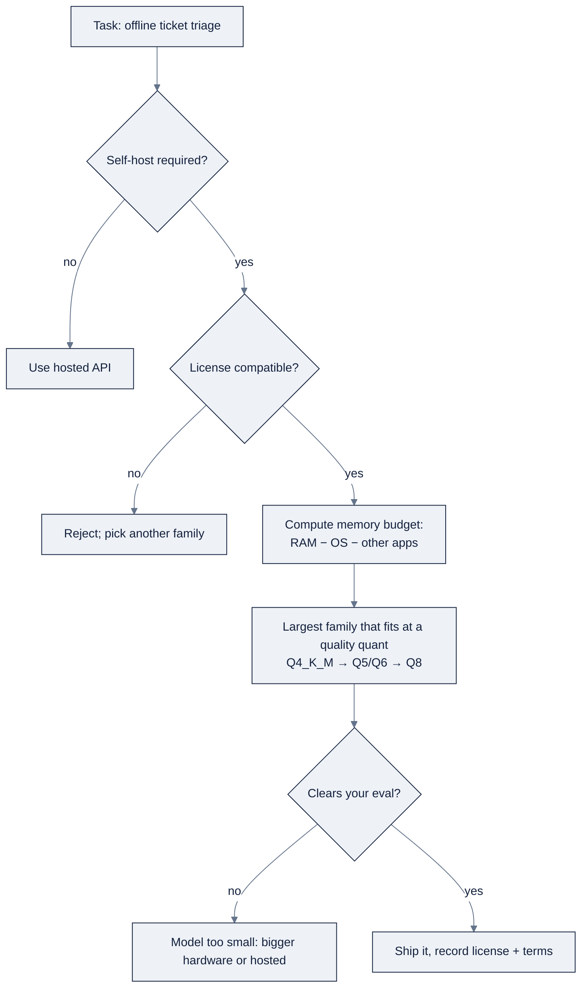

# Week 08: Open ModelsとLocal Inference — GPUs、Ollama、llama.cpp

> **日本語版** · [英語版](README.md) · [演習](exercises.ja.md) · [クイズ](quiz.ja.md)
> AI Engineering Labの一部 · Week 08 of 24 · Section: LLM Core · Category: Local Models & GPUs
> · Notebooks: [01-local-model-playground.ipynb](notebooks/01-local-model-playground.ipynb) · [02-vram-sizing-and-model-selection.ipynb](notebooks/02-vram-sizing-and-model-selection.ipynb)

## 問題

ZoroLogisticsは、**internet接続のない** クライアント先のaudit roomでsupport ticketのtriageをしようとしています。しかもticketには、laptopの外に決して出してはならないconsignee名とshipment詳細が含まれています。Hosted APIは二重に問題外です。privacyがdata egressを禁じ、air-gapがnetworkを禁じます。誘惑的なshortcutはleaderboardから「最良のmodel」を掴むことですが、70B modelは8 GB Windows laptopに載りませんし、「open weights」とopen licenseは同じではなく、技術的にはloadできるがdiskにpageするmodelは、memoryに留まる小さいmodelより遅いのです。

今週は、自分のhardwareでmodelを動かす流儀に習熟します。決定は常にこの順で回す三つのpartからなるquestionです。**self-hostが必要か、licenseは互換か、そして十分小さいmodelはtaskをこなせるか。** Before/afterは具体的です。beforeでは、teamは「CUDA」をinstallしてGPUが動いていると思い込みながら、modelは静かにCPUで動いています。afterでは、laptopでJSON-mode triageを実行し、**tokens/sec** をreportし、16 GB Macと8 GB Windows boxに対してmodel + quantを推奨するpickerを示せます。推定GB footprintとlicense付きです。

## 目標

金曜日までに、次のことができるようになります。

- [ ] open-weightとclosed modelを区別し、license（Apache-2.0 vs. MIT vs. Llama vs. Gemma）を読んで、modelが合法的にdeployできる場所を言える。
- [ ] local stackを操作できる。Ollama（CLI、Modelfile、JSON mode）、llama.cpp（GGUF、`-ngl`、`--ctx-size`）、MLX/LM Studio。そしてtokens/secをbenchmarkする。
- [ ] VRAM mathができる。`weights = bytes/param × params`、KV cache + activations + OS headroomの追加、そして7B/13B/70B sizing tableを読む。
- [ ] laptopでJSON-mode structured outputによるoffline ticket triageを実行し、16 GB（Mac）と8 GB（Windows）に収まるmodel + quantを選ぶ。

## 日ごとの計画

| Day | Study | Run / build | Ship | Time |
|---|---|---|---|---|
| **Mon** | [`reference/knowledge-base/08-local-inference-gpu.md`](../../reference/knowledge-base/08-local-inference-gpu.md) §1〜2でopen vs. closed、license、family | `02-vram-sizing-and-model-selection.ipynb` を流し読みする | Notes: 「open weights ≠ open license」 | 約2時間 |
| **Tue** | Local stack（§3） | Ollamaをinstall。`ollama pull llama3.2`。`01-local-model-playground.ipynb` のchat cellを実行 | 最初のlocal chat + tokens/sec | 約2時間 |
| **Wed** | GGUF + llama.cpp + MLX/LM Studio（§3） | ModelfileのJSON-triage cellを実行する | Structured triage output | 約2時間 |
| **Thu** | GPU setupと「GPUは動いているか」（§4） | notebook 2（VRAM math + picker）をend-to-endで実行 | 16 GBと8 GBへのpicker推奨 | 約2時間 |
| **Fri** | VRAM math（§5）、structured outputとprivacy（§7〜8） | use caseを組み立てる。triage + picker + benchmark表 | 金曜日のdeliverable + license notes | 約3時間 |

*（Sat: Week 8のquizを受け、`exercises.md` のchecklistを確認する。）*

## 概念

まず [`reference/knowledge-base/08-local-inference-gpu.md`](../../reference/knowledge-base/08-local-inference-gpu.md) を読んでください。完全なcommand referenceは [`reference/knowledge-base/research/03-harnesses-local-stacks.md`](../../reference/knowledge-base/research/03-harnesses-local-stacks.md) にあります。「Open weights」は *distribution* の事実、「open license」は *legal* の事実です。混同しないでください。

### Open vs. closedとlicense

**Closed model**（flagship GPT/Claude/Gemini tier）はAPI-onlyです。weightは決して見えません。**Open-weight model** はweightを公開するので、download、実行、quantize、fine-tuneができます。しかし、合法的に何をしてよいかを決めるのはdownload buttonではなくlicenseです。順番に三つのquestion: self-hostが必要か？ licenseは互換か？ taskに十分小さいmodelか？

| License | Type | 商用利用? | 注意点 |
|---|---|---|---|
| Apache-2.0 | Permissive | 可 | Attribution + patent grant。Qwen、いくつかのMistral release |
| MIT | Permissive | 可 | 非常に短い。DeepSeekのopen model、Phi-3 |
| Llama Community License | Custom（Meta） | 可、scale capまで | ~700M MAU threshold。attribution。大規模時のoutput再利用を制限 |
| Gemma Terms of Use | Custom（Google） | 可、制約付き | Prohibited-use list。OSI未承認 |
| Research-only | Custom | 不可 | 学習には良いがproductには不可 |

ZoroLogisticsのlabでは、**Apache-2.0/MITが安全なdefault** です。LlamaとGemmaは商用利用可能ですが、compliance fileに記録すべき条項を伴います。

### Model familyとHub workflow

| Family | Maker | Notes |
|---|---|---|
| Llama | Meta | General-purposeなdefault。最大のecosystem。Llama license |
| Mistral / Mixtral | Mistral AI | parameterあたりのqualityが高い。MixtralはMoE |
| Qwen | Alibaba | Apache-2.0。多言語/codingが強い。安全なlicense pick |
| Gemma | Google | 小さくdense。Gemma Terms of Use |
| Phi | Microsoft | 体格以上に強いtiny model。MIT |
| DeepSeek | DeepSeek AI | MIT。reasoning/codingが強い。MoE variantはtokenあたりが安い |

**license → size → task** の順で選びます。Hugging Face Hub workflowが毎日のloopです。まず **model card** を読み（license、quantization story、VRAM）、次に **GGUF** mirrorを取ります。llama.cpp/Ollama/LM Studioすべてが動かす、単一fileのquantized format（file名の `Q4_K_M`）です。**自分のeval setで検証する** こと。cardのbenchmarkを自分の数値として信じてはいけません。

### Local stack: 四つのruntime

| Runtime | 何であるか | 使うとき |
|---|---|---|
| Ollama | llama.cppの上のfriendlyなwrapper。CLI + REST + OpenAI互換endpoint | 最速のzero→動くpath。最初の立ち寄り先 |
| llama.cpp | C/C++のGGUF基盤。`-ngl`、`--ctx-size`、grammar decoding | 最大の制御。dependency-freeなbinary |
| LM Studio | Desktop GUI + local OpenAI互換server（`:1234/v1`） | Discovery。「このmodelはしっくりくるか？」 |
| MLX | unified memory上のAppleのframework | Apple Siliconで最速 |

Ollamaの **Modelfile** は `SYSTEM` promptと `PARAMETER temperature 0` を焼き込み、`--format json` が出力を制約します。llama.cppの **GGUF** は自己完結し（weight + tokenizer + chat template）、**grammar-constrained decoding** をsupportします。「JSONを出力してください」という懇願ではなくGBNF grammarによる、最も強いstructured-output保証です。Apple Siliconなら **MLX**（speed）またはOllama（simplicity）。NVIDIA Linux serverなら、throughputにはvLLM/SGLang、single-boxの制御にはllama.cppです。

### GPU setup: 「GPUは本当に動いているか？」

CUDAはdriver + toolkit + cuDNNが必要です。AppleはMetal/MPS（driver不要）、AMDはROCmを使います。「CUDAをinstallした」と「GPUが仕事をしている」を分けるchecklist: (1) OSがdeviceを認識する（`nvidia-smi`/`rocm-smi`）、(2) frameworkがbackendを見つける（`torch.cuda.is_available()`）、(3) 本物のtensorがそこで動く、(4) modelがend-to-endで動き、*かつ tokens/secを報告する*、(5) VRAMが枯渇していない。`-ngl` が低ければ、気づかずにCPUで動いています。**decode** tokens/secをreportしてください。userが感じるのはそれです（Apple Silicon上のMLX経由の7〜8B Q4でballpark ~20〜40 tokens/sec。CPU-onlyなら~5〜10）。

### VRAM math: decision engine

唯一のrule: **weights = bytes/param × params。** Formatがbytes/paramを決めます。

| Format | Bytes/param | 1B paramsあたりの~GB |
|---|---|---|
| FP32 | 4 | ~4 GB |
| FP16 / BF16 | 2 | ~2 GB |
| INT8 | 1 | ~1 GB |
| INT4 / GGUF Q4 | 0.5 | ~0.5 GB |

Weightは始まりにすぎません。**KV cache**（`2 × layers × heads × head_dim × seq_len × bytes_per_param`）、**activations**（weightの~10〜20%）、そして **OS headroom**（2〜4 GB）を追加します。Sizing table（weightのみ）:

| Model | FP16 | INT8 | INT4 (Q4) | Typical fit |
|---|---|---|---|---|
| 7B | ~14 GB | ~7 GB | ~4 GB | 8 GB (Q4) / 16 GB (FP16) |
| 13B | ~26 GB | ~13 GB | ~7 GB | 12〜16 GB (Q4) |
| 70B | ~140 GB | ~70 GB | ~35 GB | 2×24 GB (Q4) または 48〜80 GB |

**欲しいmodel sizeから始めて、headroom付きで収まる最大のquantを選ぶ**。決して「物理的にloadできる最大のmodel」ではありません。responsiveさを保つのはheadroomだからです。

### Local structured outputとprivacy

ModelがlocalだからといってJSONを諦める必要はありません。四つのruntimeすべてが構造を強制します。Ollamaの `format:"json"`、llama.cppの **grammar-constrained decoding**（GBNF grammarは出力を *証明可能に* validにする、最も強い保証）、LM Studio/MLXのOpenAI互換endpointはhosted APIと同じJSON-schema toolingを再利用します。Ticket triageでは、`{"category", "summary", "priority"}` を出力するgrammarが「valid JSONだがshapeが違う」というfailure classを完全に消し去ります。**promptの懇願ではなくgrammar/schemaを選ぶ** こと。

Local inferenceは、dataが建物の外に出られないときの答えでもあります。API callなし、token課金なし、第三者がtextを見ることもなし。Zorostのair-gapped・sovereign-AI deploymentがproductionで使っているpatternです。Air-gapped workflowは機械的です。接続されたmachineでGGUF + model card + licenseをdownloadし、条項を記録し、media経由でfileを移し、offline packageからruntimeをinstallし、networkを無効にして実行します。privacy、硬いlatency、zero-marginal-costのvolumeが求めるときはlocalを選ぶ。taskが本当にfrontier modelを必要とするときはAPIを選ぶ。ほとんどのproduction systemは、易しい/privacyに敏感なworkをlocalに、難しいworkをAPIに振り分けます。



### 実例1: Q4の7BのVRAM sizing

4,096 contextの7B-class model（32 layers、32 heads、head_dim 128）を考えます。

```
weights     = 7.0 × 0.5          = 3.50 GB   (Q4_K_M)
KV cache    = 2×32×32×128×4096×2 ≈ 2.15 GB  (FP16 cache)
activations = 0.12 × 3.50        = 0.42 GB
OS headroom = 2.00 GB
total       ≈ 8.07 GB
```

これは8 GB cardにも16 GB MacBookにも余裕を持って収まります。だからこそ、**local workのsweet spotはQ4の7〜8B** です。同じmodelをFP16で動かすには合計~19.8 GBが必要です（14 weight + 2.15 KV + 1.68 act + 2 OS）。だからFP16の7Bは8 GB cardに *収まりません* 。Q4の13Bは合計~12.6 GB、Q4の70Bは~51.9 GBで、24 GB card二枚、または64 GB M-series Macです。

### 実例2: 実hardware上のpicker

notebookの `pick_model` は、**余裕を持って収まる最大のmodel** を返します（2 GBのOS reserveに `0.8` comfort factorを上乗せ）。Offline triageに適用すると（`MIN_PARAMS["triage"] = 3.0`）:

```
16 GB MacBook (budget 16 × 0.8 = 12.8 GB):
  → Llama 3.1 8B at Q4_K_M  ≈ 8.63 GB  (Llama license)
  → Qwen2.5 7B at Q4_K_M    ≈ 7.90 GB  (Apache-2.0)   ← the license-safe pick

8 GB Windows laptop (budget 8 × 0.8 = 6.4 GB):
  → Llama 3.2 3B at Q4_K_M  ≈ 4.73 GB  (Llama)
  → Qwen2.5 3B at Q4_K_M    ≈ 4.89 GB  (Apache-2.0)
```

Taskを変えると推奨も変わります。`task="coding"` はfloorを7Bに上げます（16 GBでは引き続きLlama 3.1 8B Q4）。`task="reasoning"` は13Bに上げ、16 GB boxではpickerは **`None`** を返します。catalog内で最小のreasoning-class model（14B）はQ4で~14 GB必要で、12.8 GB budgetを超えるからです。この `None` こそが *教訓* です。taskがfloorを決め、hardwareがceilingを決めます。

### うまくいかない理由

- **GPU backend忘れ。** Modelは動くが `-ngl` が0で、CPUの上を這います。「CUDAを持っている」のにGPUが仕事をしていません。
- **Contextが小さすぎる。** 入力がtruncateされ、答えが狂います。`-c`/`num_ctx` を上げ、追加のKV memoryを計上する。
- **Boxに大きすぎるquant。** OOMまたはdisk paging。pageするmodelは、residentに留まる小さいmodelより遅い。一段下げる（Q8 → Q4_K_M）。
- **Model cardを信じた。** 実taskのqualityが期待外れ。shipする前に自分のevalを走らせる。
- **Licenseを無視した。** Compliance reviewでの驚き。最初にlicense + 条項を記録する。
- **Structured outputなし。** 下流のparse失敗。Promptの懇願ではなくJSON schemaまたはGBNF grammarを追加する。

## Notebook walkthrough

**`01-local-model-playground.ipynb`**（⚠️ Ollamaのinstallが必要）。Cell 2は `data.support_tickets(20, seed=99, n_shipments=10000)` から5つのsupport ticketをloadします。cell 3は `ollama list` を実行し、preference順（`llama3.2`、`qwen2.5:3b`、…）からprimary modelを選びます。Cell 5はone-shotの `ollama run MODEL "prompt"` chat、subprocess境界を通る最も単純なcallです。Cell 7は **Modelfile** を書き（`FROM <model>`、`SYSTEM You are a ZoroLogistics support triage assistant…`、`PARAMETER temperature 0`）、`zoro-triage` を作成し、`--format json` で `{"category", "priority", "summary"}` を返させます。続いて結果を `json.loads` し、parseしたdictをprintしてdataとして扱います（schemaはshapeを縛るだけで、truthは縛らない）。Cell 9は `benchmark` を定義し、繰り返しrunにわたって `ollama run --verbose` のstderrから **eval rate** をparseします。cell 11は、最大四つのinstall済みmodelにわたる比較表（model、tokens/sec、json_ok、output_len）を作ります。最後のcellは `WEEK8_NB1_TOKENS_PER_SEC`、primary modelの平均generation tokens/secをprintします（Ollamaがなければ **0.0**。Apple SiliconのMLX経由で20〜40なら健全な数値です）。

**`02-vram-sizing-and-model-selection.ipynb`**（純Python、GPU不要）。Cell 2はbytes/param表（`FP32 4.0 … INT4/Q4 0.5`）をprintします。cell 4は7B/13B/70B sizing表と「4-bitなら1B paramsあたり~1 GB」というrule of thumbです。cell 6は `kv_cache_gb` と `total_footprint` を定義し、7B @ FP16をsanity-checkします（weight + KV + activations + 2 GB OS reserveで合計~19.8 GB）。Cell 8は `CATALOG`（各modelに `layers`/`heads`/`head_dim` 付き）、`QUANTS`、`MIN_PARAMS`、`pick_model` を定義し、total footprintが `available_gb × 0.8` に収まる最大のmodelを返します。Cell 10は16 GB Macと8 GB Windowsのcaseに適用し、rank済みoptionと、license付きの推奨をprintします。最後のcellは `WEEK8_NB2_RECOMMENDED_FOOTPRINT_GB`、16 GB MacBookのpickの推定合計GB、**≈ 8.63**（Q4_K_MのLlama 3.1 8B）をprintします。

## Use case（Friday）

**Deliverable:** local model（JSON-mode output）を使ったlaptop上のoffline ticket triage。加えて、そのhardwareに合うmodel + quantを選ぶVRAM basedのmodel pickerと、commit済みのbackend benchmark表（tokens/sec）。

**Zorost gate:** 見知らぬ人が成果物をinspectでき、あなたが何をしたかを見せられること。本物のticketに対するtriage JSON、tokens/sec表、そして16 GB MacBookと8 GB Windows laptop両方に対するpickerの推奨と推定GB footprintが見えること。

**Stretch variant:** notebook 1に `num_ctx` sweep（2048 vs. 8192）を追加し、同じpromptについてtokens/secとVRAMのtradeoffを報告します。続けて大きい `seq_len` でpickerを再実行し、推奨（またはheadroom）がどう変わるかを示します。

## よくあるpitfall

| Pitfall | 症状 | Fix |
|---|---|---|
| GPU backendがない | 遅い。`-ngl` が0 | CUDA/Metal/ROCmでbuild/実行し、`-ngl` を上げる |
| Contextが小さすぎる | Truncateされた入力、間違った答え | `-c`/`num_ctx` を上げる。追加のKV memoryを計上する |
| Quantが大きすぎる | OOMまたはdisk paging | 一段下げる（Q8 → Q4_K_M） |
| Model cardを信じた | 実taskのqualityが低い | shipする前に自分のevalを走らせる |
| Licenseを無視した | Complianceの驚き | 最初にlicense + 条項を記録する |
| Structured outputがない | 下流のparse失敗 | JSON schemaまたはGBNF grammar |
| 「Open weights」をopen sourceだと思い込む | 間違った条項でdeploy | Download buttonではなくlicenseを読む |
| tokens/secの測定なし | 根拠のない「速い」 | *自分の* hardwareでdecode tokens/secを報告する |

## Glossary

- **Open-weight model**: weightが公開され、実行/quantize/fine-tuneが可能。自動的にopen sourceではない。
- **GGUF**: weight + tokenizer + chat templateを束ねる、単一fileのquantized format。
- **Quantization**: weightをより少ないbytes/param（INT8、INT4）で格納し、若干のquality costでVRAMを縮めること。
- **KV cache**: sequence長とともに増える、residentなkey/value memory。
- **Ollama**: 最も単純なlocal runtime（CLI、Modelfile、OpenAI互換endpoint）。
- **llama.cpp**: Ollama/LM Studioの下にあるC/C++のGGUF基盤。
- **MLX**: unified memory上のAppleのframework。Apple Siliconで最速。
- **CUDA / MPS / ROCm**: NVIDIA / Apple / AMDのGPU backend。
- **`-ngl`**: llama.cppでGPUにoffloadするlayer数。低い値 = 静かにCPUで動いている。
- **Tokens/sec (decode)**: generationのspeed。userが感じる数値。
- **VRAM headroom**: weight + KV + activationsの後に残る空きmemory。modelがresponsiveであり続くためのもの。

## Self-check（quiz）

概念とnotebook codeをカバーする十問が [`quiz.md`](quiz.md) にあります。合格ラインは **8/10** です。

## Exercises

四つのgraded exercise（easy / standard / stretch / portfolio）、task parameter sweep、二つの新しいcatalog model、`num_ctx` sweep、そして `model_picker.py` CLI。各hintは [`exercises.md`](exercises.md) にあります。

## Sources

- Ollama: https://ollama.com · https://github.com/ollama/ollama
- llama.cpp (GGUF): https://github.com/ggml-org/llama.cpp
- LM Studio: https://lmstudio.ai
- Apple MLX: https://github.com/ml-explore/mlx
- PyTorch installs (CUDA/ROCm): https://pytorch.org/get-started/locally/
- Hugging Face Hub: https://huggingface.co
- Hugging Face, *safetensors*: https://github.com/huggingface/safetensors
- DeepLearning.AI, *Open Source Models with Hugging Face*: https://www.deeplearning.ai/courses/open-source-models-hugging-face
- Zorost Intelligence, federal & sovereign AI, air-gapped deployments: https://zorost.com
