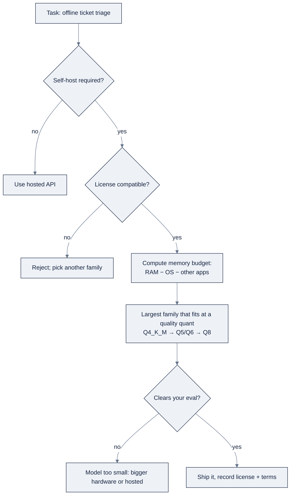

# Week 08, Open Models & Local Inference: GPUs, Ollama, llama.cpp

> Part of AI Engineering Lab · Week 08 of 24 · Section: LLM Core · Category: Local Models & GPUs
> 🎯 Use case: Run a local model to triage support tickets offline, plus a VRAM sizing calculator for model choice.

## The problem

ZoroLogistics is about to triage support tickets at a client-site audit room with **no internet**, and the tickets carry consignee names and shipment details that must never leave the laptop. A hosted API is off the table twice over: privacy forbids the data egress, and the air-gap forbids the network. The tempting shortcut is to grab "the best model" from a leaderboard, but a 70B model won't fit an 8 GB Windows laptop, "open weights" is not the same as an open license, and a model that technically loads but pages to disk is slower than a smaller one that stays in memory.

This week makes you fluent in running models on your own hardware. The decision is a three-part question, always in this order: **do I need to self-host, is the license compatible, and does a small-enough model do the task?** The before/after is concrete: before, the team installs "CUDA" and assumes the GPU is working while the model silently runs on CPU; after, they run a JSON-mode triage on a laptop, report **tokens/sec**, and point at a picker that recommends the model + quant for a 16 GB Mac and an 8 GB Windows box, with the estimated GB footprint and the license recorded.

## Objectives

By Friday you can:

- [ ] Distinguish open-weight from closed models, read a license (Apache-2.0 vs. MIT vs. Llama vs. Gemma) and say where a model may legally deploy.
- [ ] Operate the local stack, Ollama (CLI, Modelfile, JSON mode), llama.cpp (GGUF, `-ngl`, `--ctx-size`), and MLX/LM Studio, and benchmark tokens/sec.
- [ ] Do the VRAM math: `weights = bytes/param × params`, add KV cache + activations + OS headroom, and read the 7B/13B/70B sizing table.
- [ ] Run offline ticket triage with JSON-mode structured output on a laptop and pick a model + quant that fits 16 GB (Mac) and 8 GB (Windows).

## Day-by-day plan

| Day | Study | Run / build | Ship | Time |
|---|---|---|---|---|
| **Mon** | Open vs. closed, licenses, families in [`reference/knowledge-base/08-local-inference-gpu.md`](../../reference/knowledge-base/08-local-inference-gpu.md) §1 to 2 | Skim `02-vram-sizing-and-model-selection.ipynb` | Notes: "open weights ≠ open license" | ~2 h |
| **Tue** | The local stack (§3) | Install Ollama; `ollama pull llama3.2`; run `01-local-model-playground.ipynb` chat cell | First local chat + tokens/sec | ~2 h |
| **Wed** | GGUF + llama.cpp + MLX/LM Studio (§3) | Run the Modelfile JSON-triage cell | Structured triage output | ~2 h |
| **Thu** | GPU setup + "is my GPU working" (§4) | Run notebook 2 (VRAM math + picker) end-to-end | Picker recommendation for 16 GB & 8 GB | ~2 h |
| **Fri** | VRAM math (§5), structured outputs & privacy (§7 to 8) | Assemble the use case: triage + picker + benchmark table | Friday deliverable + license notes | ~3 h |

*(Sat: take the Week 8 quiz, see the checklist in `exercises.md`.)*

## Concepts

Read [`reference/knowledge-base/08-local-inference-gpu.md`](../../reference/knowledge-base/08-local-inference-gpu.md) first; [`reference/knowledge-base/research/03-harnesses-local-stacks.md`](../../reference/knowledge-base/research/03-harnesses-local-stacks.md) has the full command reference. "Open weights" is a *distribution* fact, "open license" is a *legal* fact, do not conflate them.

### Open vs. closed, and licenses

**Closed models** (flagship GPT/Claude/Gemini tiers) are API-only: you never see the weights. **Open-weight models** publish the weights so you can download, run, quantize, and fine-tune, but the license, not the download button, decides what you may legally do. The three questions in order: self-host needed? license compatible? small-enough model for the task?

| License | Type | Commercial use? | What to watch |
|---|---|---|---|
| Apache-2.0 | Permissive | Yes | Attribution + patent grant; Qwen, several Mistral releases |
| MIT | Permissive | Yes | Very short; DeepSeek's open models, Phi-3 |
| Llama Community License | Custom (Meta) | Yes, up to a scale cap | ~700M MAU threshold; attribution; restricts output reuse at scale |
| Gemma Terms of Use | Custom (Google) | Yes, with restrictions | Prohibited-use list; not OSI-approved |
| Research-only | Custom | No | Fine for learning, not for a product |

For ZoroLogistics labs, **Apache-2.0/MIT is the safe default**; Llama and Gemma are usable commercially but carry terms you must record in the compliance file.

### Model families and the Hub workflow

| Family | Maker | Notes |
|---|---|---|
| Llama | Meta | General-purpose default; largest ecosystem; Llama license |
| Mistral / Mixtral | Mistral AI | Strong quality-per-parameter; Mixtral is MoE |
| Qwen | Alibaba | Apache-2.0; strong multilingual/coding; the safe license pick |
| Gemma | Google | Small, dense; Gemma Terms of Use |
| Phi | Microsoft | Tiny models that punch above their weight; MIT |
| DeepSeek | DeepSeek AI | MIT; strong reasoning/coding; MoE variants cheap per token |

Pick by **license → size → task**. The Hugging Face Hub workflow is the everyday loop: read the **model card** first (license, quantization story, VRAM), then grab a **GGUF** mirror, the single-file quantized format (`Q4_K_M` in the filename) that llama.cpp/Ollama/LM Studio all run. **Verify on your own eval set**, never trust the card's benchmark as your number.

### The local stack: four runtimes

| Runtime | What it is | Use when |
|---|---|---|
| Ollama | Friendly wrapper over llama.cpp; CLI + REST + OpenAI-compatible endpoint | Fastest zero→working path; the first stop |
| llama.cpp | The C/C++ GGUF substrate; `-ngl`, `--ctx-size`, grammar decoding | Maximum control, dependency-free binary |
| LM Studio | Desktop GUI + local OpenAI-compatible server (`:1234/v1`) | Discovery, "does this model feel right?" |
| MLX | Apple's framework over unified memory | Fastest on Apple Silicon |

Ollama's **Modelfile** bakes in a `SYSTEM` prompt and `PARAMETER temperature 0`; `--format json` constrains output. llama.cpp's **GGUF** is self-contained (weights + tokenizer + chat template) and supports **grammar-constrained decoding**, the strongest structured-output guarantee, a GBNF grammar rather than a "please output JSON" plea. Apple Silicon → **MLX** (speed) or Ollama (simplicity); NVIDIA Linux server → vLLM/SGLang for throughput, llama.cpp for single-box control.

### GPU setup: "is my GPU actually working?"

CUDA needs a driver + toolkit + cuDNN; Apple uses Metal/MPS (no driver); AMD uses ROCm. The checklist that separates "I installed CUDA" from "my GPU is doing the work": (1) the OS sees the device (`nvidia-smi`/`rocm-smi`), (2) the framework finds the backend (`torch.cuda.is_available()`), (3) a real tensor runs on it, (4) a model runs end-to-end *and reports tokens/sec*, (5) VRAM isn't exhausted. If `-ngl` is low you are on CPU without realizing it. Report **decode** tokens/sec, that's what the user feels (a 7 to 8B Q4 on Apple Silicon via MLX is ballpark ~20 to 40 tokens/sec; CPU-only ~5 to 10).

### VRAM math: the decision engine

The one rule: **weights = bytes/param × params.** Format sets bytes/param:

| Format | Bytes/param | ~GB per 1B params |
|---|---|---|
| FP32 | 4 | ~4 GB |
| FP16 / BF16 | 2 | ~2 GB |
| INT8 | 1 | ~1 GB |
| INT4 / GGUF Q4 | 0.5 | ~0.5 GB |

Weights are only the start: add the **KV cache** (`2 × layers × heads × head_dim × seq_len × bytes_per_param`), **activations** (~10 to 20% of weights), and **OS headroom** (2 to 4 GB). The sizing table, weights only:

| Model | FP16 | INT8 | INT4 (Q4) | Typical fit |
|---|---|---|---|---|
| 7B | ~14 GB | ~7 GB | ~4 GB | 8 GB (Q4) / 16 GB (FP16) |
| 13B | ~26 GB | ~13 GB | ~7 GB | 12 to 16 GB (Q4) |
| 70B | ~140 GB | ~70 GB | ~35 GB | 2×24 GB (Q4) or 48 to 80 GB |

**Start from the model size you want, then choose the largest quant that fits with headroom**: never "the biggest model that will physically load," because headroom is what keeps it responsive.

### Local structured outputs, and privacy

You do not give up JSON just because the model is local. All four runtimes enforce structure: Ollama's `format:"json"`, llama.cpp's **grammar-constrained decoding** (a GBNF grammar makes output *provably* valid, the strongest guarantee), and LM Studio/MLX's OpenAI-compatible endpoints reuse the same JSON-schema tooling as a hosted API. For ticket triage, a grammar that emits `{"category", "summary", "priority"}` eliminates the "valid JSON but wrong shape" failure class entirely, **prefer a grammar/schema over a prompt plea**.

Local inference is also the answer when the data cannot leave the building: no API call, no token billing, no third party sees the text, the pattern Zorost's air-gapped and sovereign-AI deployments use in production. The air-gapped workflow is mechanical: on a connected machine download the GGUF + model card + license, record the terms, move the file across on media, install the runtime from an offline package, and run with the network disabled. Choose local when privacy, hard latency, or zero-marginal-cost volume demand it; choose the API when the task genuinely needs a frontier model, most production systems route easy/privacy-sensitive work local and hard work to an API.



### Worked example 1: VRAM sizing for a 7B at Q4

Take a 7B-class model (32 layers, 32 heads, head_dim 128) at 4,096 context:

```
weights     = 7.0 × 0.5          = 3.50 GB   (Q4_K_M)
KV cache    = 2×32×32×128×4096×2 ≈ 2.15 GB  (FP16 cache)
activations = 0.12 × 3.50        = 0.42 GB
OS headroom = 2.00 GB
total       ≈ 8.07 GB
```

That fits an 8 GB card or a 16 GB MacBook with room to spare, which is why **7 to 8B at Q4 is the sweet spot for local work**. The same model at FP16 needs ~19.8 GB total (14 weights + 2.15 KV + 1.68 act + 2 OS), which is why a 7B at FP16 does *not* fit an 8 GB card. A 13B at Q4 lands at ~12.6 GB total; a 70B at Q4 at ~51.9 GB, two 24 GB cards, or a 64 GB M-series Mac.

### Worked example 2: the picker on real hardware

The notebook's `pick_model` returns the **largest model that fits comfortably** (a `0.8` comfort factor on top of a 2 GB OS reserve). Applied to offline triage (`MIN_PARAMS["triage"] = 3.0`):

```
16 GB MacBook (budget 16 × 0.8 = 12.8 GB):
  → Llama 3.1 8B at Q4_K_M  ≈ 8.63 GB  (Llama license)
  → Qwen2.5 7B at Q4_K_M    ≈ 7.90 GB  (Apache-2.0)   ← the license-safe pick

8 GB Windows laptop (budget 8 × 0.8 = 6.4 GB):
  → Llama 3.2 3B at Q4_K_M  ≈ 4.73 GB  (Llama)
  → Qwen2.5 3B at Q4_K_M    ≈ 4.89 GB  (Apache-2.0)
```

Change the task and the recommendation changes: `task="coding"` raises the floor to 7B (still Llama 3.1 8B Q4 on 16 GB); `task="reasoning"` raises it to 13B, and on a 16 GB box the picker returns **`None`**, the smallest reasoning-class model in the catalog (14B) needs ~14 GB at Q4, over the 12.8 GB budget. That `None` *is* the lesson: task sets the floor, hardware sets the ceiling.

### How it breaks

- **Forgot the GPU backend.** The model runs, but `-ngl` is 0 and it crawls on CPU; you "have CUDA" but the GPU isn't doing the work.
- **Context too small.** Input gets truncated and answers go wrong; raise `-c`/`num_ctx` and account for the extra KV memory.
- **Quant too big for the box.** OOM or paging to disk, a model that pages is slower than a smaller one that stays resident; drop a tier (Q8 → Q4_K_M).
- **Trusted the model card.** Disappointing real-task quality; run your own eval before shipping.
- **Ignored the license.** A surprise at compliance review; record license + terms up front.
- **No structured output.** Downstream parse failures; add a JSON schema or GBNF grammar, not a prompt plea.

## Notebook walkthrough

**`01-local-model-playground.ipynb`** (⚠️ requires Ollama installed). Cell 2 loads 5 support tickets from `data.support_tickets(20, seed=99, n_shipments=10000)`; cell 3 runs `ollama list` and picks a primary model from a preference order (`llama3.2`, `qwen2.5:3b`, …). Cell 5 is a one-shot `ollama run MODEL "prompt"` chat, the simplest possible call through the subprocess boundary. Cell 7 writes a **Modelfile** (`FROM <model>`, `SYSTEM You are a ZoroLogistics support triage assistant…`, `PARAMETER temperature 0`), creates `zoro-triage`, and calls it with `--format json` to return `{"category", "priority", "summary"}`, then `json.loads` the result and prints the parsed dict, treating it as data (the schema constrains shape, never truth). Cell 9 defines `benchmark` and parses the **eval rate** from `ollama run --verbose` stderr across repeated runs; cell 11 builds a comparison table (model, tokens/sec, json_ok, output_len) across up to four installed models. The final cell prints `WEEK8_NB1_TOKENS_PER_SEC`, the mean generation tokens/sec for the primary model (**0.0** if Ollama is absent; 20 to 40 on Apple Silicon via MLX is a healthy number).

**`02-vram-sizing-and-model-selection.ipynb`** (pure Python, no GPU). Cell 2 prints the bytes/param table (`FP32 4.0 … INT4/Q4 0.5`); cell 4 the 7B/13B/70B sizing table and the "~1 GB per 1B params at 4-bit" rule of thumb; cell 6 defines `kv_cache_gb` and `total_footprint` and sanity-checks a 7B @ FP16 (~19.8 GB total with weights + KV + activations + a 2 GB OS reserve). Cell 8 defines `CATALOG` (each model with its `layers`/`heads`/`head_dim`), `QUANTS`, `MIN_PARAMS`, and `pick_model`, returning the largest model whose total footprint fits under `available_gb × 0.8`. Cell 10 applies it to the 16 GB Mac and 8 GB Windows cases, printing the ranked options and the recommendation with its license. The final cell prints `WEEK8_NB2_RECOMMENDED_FOOTPRINT_GB`, the estimated total GB of the 16 GB MacBook's pick, **≈ 8.63** (Llama 3.1 8B at Q4_K_M).

## The use case (Friday)

**Deliverable:** offline ticket triage on a laptop using a local model (JSON-mode output), plus the VRAM-based model picker choosing the model + quant for that hardware, with the backend benchmark table (tokens/sec) committed.

**Zorost gate:** a stranger can inspect it and you can show what it did, they can see the triage JSON for real tickets, the tokens/sec table, and the picker's recommendation with its estimated GB footprint for both a 16 GB MacBook and an 8 GB Windows laptop.

**Stretch variant:** add a `num_ctx` sweep (2048 vs. 8192) to notebook 1 and report the tokens/sec and VRAM tradeoff for the same prompt, then re-run the picker with the larger `seq_len` and show how the recommendation (or the headroom) shifts.

## Common pitfalls

| Pitfall | Symptom | Fix |
|---|---|---|
| GPU backend missing | Slow; `-ngl` is 0 | Build/run with CUDA/Metal/ROCm; raise `-ngl` |
| Context too small | Truncated input, wrong answers | Raise `-c`/`num_ctx`; account for extra KV memory |
| Quant too big | OOM or paging to disk | Drop a tier (Q8 → Q4_K_M) |
| Trusted the model card | Poor real-task quality | Run your own eval before shipping |
| Ignored the license | Compliance surprise | Record license + terms up front |
| No structured output | Downstream parse failures | JSON schema or GBNF grammar |
| "Open weights" assumed open source | Deploying under wrong terms | Read the license, not the download button |
| No tokens/sec measurement | "Fast" with no evidence | Report decode tokens/sec on *your* hardware |

## Glossary

- **Open-weight model**: weights are published so you can run/quantize/fine-tune; not automatically open source.
- **GGUF**: the single-file quantized format bundling weights + tokenizer + chat template.
- **Quantization**: storing weights at fewer bytes/param (INT8, INT4) to shrink VRAM at some quality cost.
- **KV cache**: resident key/value memory that grows with sequence length.
- **Ollama**: the simplest local runtime (CLI, Modelfile, OpenAI-compatible endpoint).
- **llama.cpp**: the C/C++ GGUF substrate under Ollama/LM Studio.
- **MLX**: Apple's framework over unified memory; fastest on Apple Silicon.
- **CUDA / MPS / ROCm**: the GPU backends for NVIDIA / Apple / AMD.
- **`-ngl`**: layers offloaded to the GPU in llama.cpp; low value = silently on CPU.
- **Tokens/sec (decode)**: generation speed; the number the user feels.
- **VRAM headroom**: memory left free after weights + KV + activations so the model stays responsive.

## Self-check (quiz)

Ten questions covering the concepts and notebook code are in [`quiz.md`](quiz.md), the passing bar is **8/10**.

## Exercises

Four graded exercises (easy / standard / stretch / portfolio), a task-parameter sweep, two new catalog models, a `num_ctx` sweep, and a `model_picker.py` CLI. Hints for each are in [`exercises.md`](exercises.md).

## Sources

- Ollama: https://ollama.com · https://github.com/ollama/ollama
- llama.cpp (GGUF): https://github.com/ggml-org/llama.cpp
- LM Studio: https://lmstudio.ai
- Apple MLX: https://github.com/ml-explore/mlx
- PyTorch installs (CUDA/ROCm): https://pytorch.org/get-started/locally/
- Hugging Face Hub: https://huggingface.co
- Hugging Face, *safetensors*: https://github.com/huggingface/safetensors
- DeepLearning.AI, *Open Source Models with Hugging Face*: https://www.deeplearning.ai/courses/open-source-models-hugging-face
- Zorost Intelligence, federal & sovereign AI, air-gapped deployments: https://zorost.com
