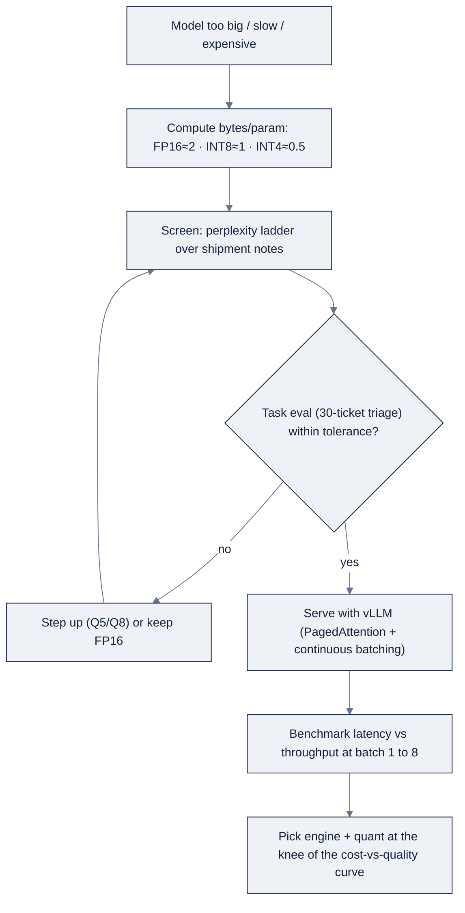

# Week 09: QuantizationとEfficient Inference

> **日本語版** · [英語版](README.md) · [演習](exercises.ja.md) · [クイズ](quiz.ja.md)
> AI Engineering Labの一部 · Week 09 of 24 · Section: Model Engineering · Category: Quantization & Serving
> · Notebooks: [01-quantization-lab.ipynb](notebooks/01-quantization-lab.ipynb) · [02-vllm-serving-and-benchmarks.ipynb](notebooks/02-vllm-serving-and-benchmarks.ipynb)

## 問題

ZoroLogisticsは、inboundのsupport ticketを `{tracking, damage, refund, documents, customs, billing}` に分類する7B open modelを動かしています。正確ですが、FP16では~14 GBのVRAMを消費し、rentalしたA10 GPUでは、解決されたticketあたり約$0.031かかります。pilotとしてはそれでよく、月50,000 ticketでは不条理です。素朴なfixは「もっと大きいGPUを買う」か「すべてをhosted APIに投げる」ですが、どちらも、より安いquestionを先に問いません。*すでに持っているmodelは、同じ仕事を四分の一のmemoryでできるか？*

このquestionこそが **quantization** です。各weightをより少ないbitで格納して、modelをほぼ線形に縮め、decodeを速くし、小さなquality costを払います。これがなければ、二つの悪い選択の間で行き詰まります。taskに必要以上に大きいmodelに定価を払うか、仕事をAPIに任せて、latency、cost、data-controlが手から離れるのを見るか。これがあれば、*数値付きの* 決定が得られます。同じtriage evalをFP16、8-bit、4-bitで実行し、serving benchmarkを加えれば、quality-vs-cost curveがどこで曲がるかが正確に分かります。その測定がなければ当てるしかなく、当てることは、billing ticketをclaimsに静かにmisrouteする2-bit modelをshipするか、taskが決して必要としないprecisionにお金を払うかのどちらかを意味します。今週は「modelを縮めた」を「Q4_K_Mをshipすると擁護できる」に変えます。

## 目標

- [ ] 金曜日までに、FP16 / INT8 / INT4のbytes-per-parameter mathを言え、model cardだけから、あるmodelが指定されたVRAM budgetに収まるかを予測できる。
- [ ] 金曜日までに、bitsandbytes経由でmodelをFP16、8-bit（`LLM.int8()`）、4-bit（`NF4`）でloadし、shipment notes上でperplexityの差を測れる。
- [ ] 金曜日までに、30のlabeled support ticketで三つのprecisionにわたるtriage-accuracy evalを実行し、表からquality-vs-cost tradeoffを読める。
- [ ] 金曜日までに、vLLM（OpenAI互換）でmodelをserveし、複数のbatch sizeでlatency/throughputをbenchmarkし、quality-vs-costの推奨をpublishできる。

## 日ごとの計画

| Day | Study | Run | Ship | Time |
|---|---|---|---|---|
| **Mon** | 数値format（FP32/FP16/BF16/FP8/INT8/INT4）と [reference/knowledge-base/06-model-engineering.md](../../reference/knowledge-base/06-model-engineering.md) のbytes-per-param rule | 1.5B/7B/13B modelのVRAM表を手計算で再現する | VRAM mathを書いたmarkdown cell | 2時間 |
| **Tue** | Quantization method: GGUF k-quants、bitsandbytes、AWQ、GPTQ | lab notebookで1.5B modelをFP16/8-bit/4-bitでloadする | 記録したperplexity ladder | 2時間 |
| **Wed** | なぜperplexityはscreenであってverdictではないか（perplexity vs task eval） | 各precisionで30-ticket triage evalを実行する | Quality-vs-VRAM表 | 2時間 |
| **Thu** | Serving engine（vLLM/SGLang/TGI）、continuous batching、throughput vs latency | vLLMを起動し、batch size 1〜8をbenchmark、Ollamaと比較する | Speed表 | 2時間 |
| **Fri** | Tradeoffを読む: costとqualityのcurveが交差する場所 | 二つのnotebookからreportを組み立てる | `week-09-quality-vs-cost-report.md` | 2時間 |

## 概念

今週は、一つのideaを二度適用する週です。**modelを安くする最も安い方法は、weightをより少ないbitで格納すること。そして *どれだけ* 少なくするかを決める唯一の許容される方法は、sizeではなくtaskを測ること。** through-lineは、Week 10のreadingで見た「cheapest lever first」の順序を、trainingではなく *inference* に向けたものです。より大きいGPUにお金を払う前に、すでに持っているmodelが仕事を壊さずに安くなるかを問うてください。Quantizationがそのleverです。

### Formatごとに一つの数値

Weightはただのfloatであり、すべてのfloatはmemoryを消費します。bytes-per-parameter ruleを覚えれば、VRAM計画問題全体が掛け算にcollapseします。

| Format | Bits/param | Bytes/param | 7Bのmemory | 用途 |
|---|---|---|---|---|
| **FP32** | 32 | 4 | ~28 GB | Training checkpoint。servingにはほぼ使わない |
| **FP16** | 16 | 2 | ~14 GB | 「full-precision」のserving baseline |
| **BF16** | 16 | 2 | ~14 GB | Trainingで安定。inferenceでは ≈ FP16 |
| **FP8** | 8 | 1 | ~7 GB | Transformer Engine経由のHopper-class GPUs |
| **INT8** | 8 | 1 | ~7 GB | ほぼlosslessなruntime quant（`LLM.int8()`） |
| **INT4 / NF4** | 4 | 0.5 | ~4 GB | 攻撃的だが広く受け入れられたchat/inferenceのdefault |

4-bitでのrule of thumbは、*10億paramsあたり約1 GB*。だから7B modelはlaptop GPUに、1.5B modelはphone-class cardに収まります。もう、一byteもdownloadする前に、model cardから「これは自分のcardに収まるか？」に答えられます。完全なformatの理屈は [reference/knowledge-base/06-model-engineering.md §2.1](../../reference/knowledge-base/06-model-engineering.md) を参照してください。

**実例1: bytes-per-parameter math。** `Qwen/Qwen2.5-1.5B-Instruct` は~1.54B paramsを持ちます。Weightのみのmemoryは `params × (bits / 8)` なので、FP16は `1.54e9 × 2 = 3.08 GB`、INT8は `1.54 GB`、INT4/NF4は `0.77 GB` です。7B triage modelにscaleすると、`7e9 × 2 = 14 GB`（FP16）、`7 GB`（INT8）、`3.5 GB`（INT4）。この一つの掛け算が、「A100をrentalしなければ」と「freeのColab T4で動く」の分かれ目です。

**実例2: integer quantizerがfloatをどうmapするか。** 内部では、integer quantizationは各float weight `w` をinteger `q = round(w / scale) +
zero_point` にmapし、`ŵ = scale × (q − zero_point)` を再構成します。weightが `[−0.5, 0.5]` に広がるlayerは `scale = (0.5 − (−0.5)) / 255 ≈ 0.0039` を得るので、`0.5 →
round(0.5 / 0.0039) = 128`、`−0.5 → −128` で、weightあたりの最大errorは~0.002です。このerrorは数百万のweightにわたって合計しても知覚できず、だからこそper-channel scale factor（あるいは非線形なNF4 grid）が、一つのoutlier weightが膨らませてしまう単一のper-tensor scaleに勝つのです。良いquantizerのcraftのすべては、最小限のsignalしか捨てない `scale` を選ぶことにあります。

### 二つのjobのための、二つのquantizer family

Methodは *いつ* 適用するかで分かれます。**bitsandbytes**（8-bit `LLM.int8()` と4-bit **NF4**）は、`load_in_8bit=True` / `load_in_4bit=True` でnotebookにdropできる *runtime* quantizerで、来週のQLoRAのsubstrateでもあります。**GGUF k-quants**（`Q2_K` → `Q8_0`）は、llama.cppとOllamaがlocalで実行する *staticなartifact* で、Week 8で会いました。**AWQ** と **GPTQ** はその中間です。高品質な4-bit *serving* のために作られた、staticでcalibration-awareなquantです。

| Method | Family | Bits | Calibration dataが必要? | 最適な用途 |
|---|---|---|---|---|
| bitsandbytes `LLM.int8()` / NF4 | Runtime | 8 / 4 | 不要 | notebookで大きいmodelをloadすること。QLoRA fine-tuning |
| GGUF k-quants | Static file | 2〜8 | 不要 | llama.cpp / Ollamaによるlocal CPU/GPU inference |
| AWQ | Static（activation-aware） | 4 (3/8) | 不要（activation stats） | vLLM/TGI上の高品質4-bit serving |
| GPTQ | Static（Hessian） | 4/8/3 | 必要 | 一度batch-quantizeして、どこでもserve |

早めに解除すべきtrapが一つあります。ほとんどのlocal quantは **weight-only** で、memoryの勝利は本物ですが、*speed* の勝利はkernel次第です。4-bit = 4×速いと思ってはいけません。確実に~4×小さく、そして *しばしば* 速くなります。[reference/knowledge-base/06-model-engineering.md §2.2](../../reference/knowledge-base/06-model-engineering.md) を参照してください。

### Perplexityはscreenであってverdictではない

Perplexity、つまりheld-out text上の `exp(cross-entropy loss)` は、速いproxyです。低いほど、modelはそのtextをあまり「surprising」と感じません。一般のladderは、inferenceではFP16/BF16 ≈ FP32、8-bit ≈ 無視できる損失、4-bit = 小さく、chat/summarization/RAGでは通常知覚できない損失、そして2〜3-bit = 顕著なdegradationです。問題は、**perplexityはtask accuracyではない** ことで、だからこそ [reference/knowledge-base/07-evals-error-analysis.md](../../reference/knowledge-base/07-evals-error-analysis.md) が登場します。Quantizeされたmodelは、perplexityがほぼ同一のまま、*あなたの* jobをしくじれます。named entityを見逃す、壊れたJSONを出す、billing ticketをclaimsにrouteする。

**実例3: perplexity-vs-evalのtradeoff。** 7B triage modelでは、Q4_K_M vs FP16のperplexity比は約 **1.06**。「surprise」が6%増えるだけで、*無視できる* と読めます。しかし、本当の話を語るのはtask metricです。同じgolden triage eval（[reference/knowledge-base/06-model-engineering.md §6](../../reference/knowledge-base/06-model-engineering.md) のもの）で測ると：

| Variant | VRAM | Triage F1 | p95 latency | $/task |
|---|---|---|---|---|
| FP16 | ~14 GB | 0.912 | 820 ms | $0.031 |
| Q8_0 / 8-bit | ~7 GB | 0.909 | 540 ms | $0.017 |
| **Q4_K_M** | ~4 GB | 0.897 | 410 ms | $0.009 |
| Q2_K | ~2.4 GB | 0.831 | 320 ms | $0.006 |

Q4_K_Mは、**3.5×少ないVRAMと~3.4×低いcost** のために **1.5 F1 point** を失うだけです。mis-routeが人間による素早いre-routeで済むtriageでは、明らかに割に合います。Q2_Kは **8.1 point**（0.912 → 0.831）を失い、これは相当な数のticketを静かにmisrouteする本物の低下です。それなのに、perplexityだけを見れば「少し悪いだけ」に見えたでしょう。このgapこそがlessonのすべてです。**perplexityがcandidateをscreenし、あなたのtask evalが決める。** 二つの数値は *一緒に* 読みます。それこそが、まさに今週のlab notebookが生み出すものです。

### Serving: continuous batchingとthroughput/latencyのtrade

Serving側では、一つのideaが支配します。素朴なservingは、次のrequestを始める前にbatch全体の完了を待つため、一つの遅いresponseが全員を止めます。**vLLMのPagedAttention**（KV cacheを固定sizeのpageに格納してfragmentationを殺す）と **continuous batching**（新しいrequestをtoken-by-tokenで受け入れ、終わったものを即座にevict）の組み合わせが、modern engineがconcurrency下ではるかに高いthroughputを維持できる理由です。知っておくべきknob: `gpu_memory_utilization`、`max_num_batched_tokens`/`max_num_seqs`、そして `max_model_len`。**throughputはlatencyで買います**。大きいbatchは合計tokens/secを上げますが、requestあたりのlatencyも上げるので、workloadがどちらを気にするかに合わせてtuneします（batch job → throughput。interactive UX → p95 latency）。そして、三つのengine（vLLM、SGLang、TGI）すべてが **OpenAI互換** の `/v1/chat/completions` surfaceを出すので、local serverに対してdevelopし、一行の `base_url` 変更でhosted endpointに（あるいはその逆に）切り替えられます。

### うまくいかない理由

Quantizationは一つのfailure（必要のないprecisionへの支払い）を *防ぎ*、盲目的に適用すれば別のfailureを *起こします*。

- **小さいmodelはより速くdegradeする。** 4-bitの1B modelは、4-bitの70Bより危険です。errorを吸収するredundancyが少ないからです。思い込まず、testする。
- **Perplexityはtaskについて嘘をつく。** ほぼ平坦なperplexityが、壊れたJSON、見逃されたentity、misrouteされたticketを隠せます。それこそgolden-set evalが捕まえるbugです。
- **Weight-only quantは自動的には速くならない。** GPUでは、speedの勝利はfused kernelを必要とします。なければ、小さくはなるが速くはなりません。
- **Runtime quantはCUDA-only。** bitsandbytesはApple MPSをsupportしないので、liveの8/4-bit cellはそこではskipされます。notebookはcrashではなく、大声でdegradeします。
- **Memory costはweightだけではない。** 長いcontextはKV cacheを膨らませます（7B modelはFP16でtokenあたり~0.5 MBのKVを保持）。だから `max_model_len` はafterthoughtではなく一級のmemory knobです。
- **Batchingはlatencyでthroughputを買う。** 大きいbatchはp95を上げます。max throughputにtuneされたinteractive endpointは、人間には遅く感じられます。

## Notebook walkthrough

二つのnotebookが今週を担います。**[`notebooks/01-quantization-lab.ipynb`](notebooks/01-quantization-lab.ipynb)** がreportのquality半分をbuildします。標準のseeded setup（cell 2）と、CUDA/MPS/CPUを選んで `LIVE_QUANT` / `LIVE_FP16` flagを設定する `detect_device()` cell（cell 4）の後、cell 6が、`data.shipments()` を `data.lanes()` とjoinした8つの **shipment notes** と、`data.support_tickets()` からの30の **labeled tickets** を取り出します。Cell 8は（modelに触れる前に）まずVRAM mathを計算します。続いてcells 10〜18が1.5B modelをFP16、8-bit `LLM.int8()`、4-bit NF4でloadし、cell 12の `perplexity()` helperをnotesに実行します。決定的なのはcell 20の `triage_accuracy()` で、ticketごとに一つのcategory wordをgreedy-decodeしてground truthと比較します。続いてcell 21が三つのaccuracyをprintし、cell 23が **quality-vs-VRAM table** を組み立てます。Cell 25はCPU fallbackで、documentされたladder（FP16 0.92 / INT8 0.92 / INT4 0.89）を *estimateとして明示* して再現します。Cell 27は最終数値 `QUALITY_RETENTION_PCT`、つまり最小のquantのtask accuracyのFP16比をprintします。健全な結果は8-bit ≈ 100% retention、4-bit ≈ 95%+です。4-bit retentionが明確に低ければ、それがprecisionを上げるsignalです。

**[`notebooks/02-vllm-serving-and-benchmarks.ipynb`](notebooks/02-vllm-serving-and-benchmarks.ipynb)** がspeed半分をbuildします。Cell 6はvLLMのOpenAI互換serverをsubprocessとして起動します（`--gpu-memory-utilization 0.85 --max-model-len 2048`）。cell 8は `/models` をpollしてreadinessを確認します。cell 10の `benchmark()` はconcurrentなrequestのthread poolを撃ち、平均latencyと合計tokens/secを返します。Cell 12はbatch size 1/2/4/8をsweepし、cell 15はOllamaの `/v1` endpointに対して同じことを繰り返し（同じOpenAI SDK、異なる `base_url`）、cell 17が二つを一つのspeed表にstackします。Cell 19はWeek 9のquantization factsを折り込み、例示的なcost-per-1M-tokensとvLLM/Ollama speedupをprintします。cell 21は最終の `BEST_THROUGHPUT_TOK_PER_SEC` をprintし、serverを終了します。見るべきshapeは、batchが大きくなるにつれてthroughputがlatencyより速く上がること。そのgapがcontinuous batchingの仕事ぶりです。

## Use case（Friday）

**Deliverable:** 四つのものを含む `week-09-quality-vs-cost-report.md`。(a) shipment notes上で測定したperplexity ladder（FP16 → 8-bit → 4-bit）、(b) 30-ticket golden setでの各precisionのtriage accuracy、(c) 測定したbatch sizeでのvLLM-vs-Ollama latency/throughput表、(d) それを正当化する数値を付けた一文のproduction推奨。

**Acceptance gate（Zorost式）:** 見知らぬ人がreportを開き、あなたの推奨quantizationが *なぜ* 勝つのかを見られること。「4-bitがpopularだから」ではなく「4-bitは25%のVRAMと2×のthroughputでFP16 triage accuracyの96.8%を保ち、misfileする3 ticketはこれです」と。quantizeされたmodelが何を間違えたかを見せられます。Task evalなしのperplexity、あるいは二つの数値のどちらかを欠いた推奨は、半分のdeliverableです。

**Stretch variant:** benchmarkを第三のengine（SGLangまたはTGI）に、*同じ* modelとbatch sizeで拡張し、そのcolumnを追加します。そして、(a) 高QPS servingと (b) すべてのrequestが長いsystem promptを共有するworkload のそれぞれについてどのengineを選ぶかを一文で書きます。後者が、SGLangのRadixAttentionが狙うprefix-cache scenarioです。

## よくあるpitfall

| Pitfall | Fix |
|---|---|
| Perplexityだけでのquant判定 | 常にtask eval（triage accuracy）を実行する。perplexityはscreen、evalが決める |
| 4-bit = 4×速いと思い込む | Weight-only quantはmemoryを確実に縮めるが、speedにはfused kernelが要る。思い込まず測る |
| 小さいmodelで2-bitをship | 小さいmodelはquantizationで速くdegradeする。難しいcase用に高precision fallbackを残す |
| KV cacheの無視 | `max_model_len` にcapをかける。長いcontextではKVがweightを超えうる |
| 一つのbatch sizeでtuneして止まる | batch 1〜8をsweepし、throughput-vs-latency curveを読む |
| bitsandbytesがCUDA-onlyなのを忘れる | MPSではFP16をliveで実行し、残りは明示されたCPU fallbackを使う |
| 異なるmodelでengineを比較する | modelとbatch sizeを固定する。そうでなければ比較は無意味 |
| 閾値のない数値の報告 | retention % *と* ship/no-ship lineを述べる |

## Glossary

- **Quantization**: weightをより少ないbit（FP16/INT8/INT4）で格納し、memoryを縮め、しばしばinferenceを速くすること。
- **NF4**: 「normal-float-4」。bitsandbytesの、weight分布に合わせたdata-awareな4-bit format。QLoRAのsubstrate。
- **GGUF**: llama.cppの自己完結file formatと、Ollama/LM Studioが実行するk-quantのfamily（`Q4_K_M`、`Q8_0`）。
- **AWQ / GPTQ**: activation-aware（AWQ）とHessian-based（GPTQ）の、高品質4-bit serving用static quantizer。
- **Perplexity**: `exp(cross-entropy loss)`。held-out textに対してmodelがどれだけ「surprised」かを示す速いproxy（低いほど良い）。
- **Continuous batching**: 新しいrequestをtoken-by-tokenで受け入れ、終わったものをevictすることで、GPUがstragglerでidleにならないようにする。
- **PagedAttention**: vLLMの、KV cacheを固定sizeのpageに格納してfragmentationをほぼ消すtechnique。
- **KV cache**: 過去のtokenにattendするためにmodelが保持する、tokenごとのkey/value vector。context × layers × hidden sizeとともに増える。
- **Throughput vs latency**: 合計tokens/sec vs requestあたり時間。batch sizeで片方をもう片方と交換する。
- **OpenAI-compatible API**: どのOpenAI SDK clientも `base_url` でlocal serverを指せるようになる、engineの `/v1/chat/completions` surface。

## Self-check（quiz）

[quiz.md](quiz.md) を受けてください。十問、合格は **8/10**。scoreをtracker Notesに記録します。

## Exercises

四つのgraded exerciseは [exercises.md](exercises.md) にあります。**Easy**（labを実行してladderを記録）、**Standard**（VRAM表を手計算で再現）、**Stretch**（第三のserving engineを追加）、**Portfolio**（quality-vs-cost reportをcommit）。hintは同じfileにあります。

## Sources

- bitsandbytes (8-bit / NF4): https://github.com/TimDettmers/bitsandbytes
- vLLM: https://docs.vllm.ai
- SGLang: https://github.com/sgl-project/sglang
- llama.cpp (GGUF k-quants): https://github.com/ggml-org/llama.cpp
- AWQ: https://github.com/mit-han-lab/llm-awq
- GPTQ: https://github.com/IST-DASLab/gptq
- Hugging Face PEFT (QLoRA substrate): https://huggingface.co/docs/peft
- Ollama: https://ollama.com
- Andrew Ng, *The AI Engineering Skills Map*, The Batch issue 366: https://www.deeplearning.ai/the-batch/issue-366
- Zorost Signal, *Cost and latency engineering for LLM systems*: https://zorost.com/llm-cost-latency-engineering
