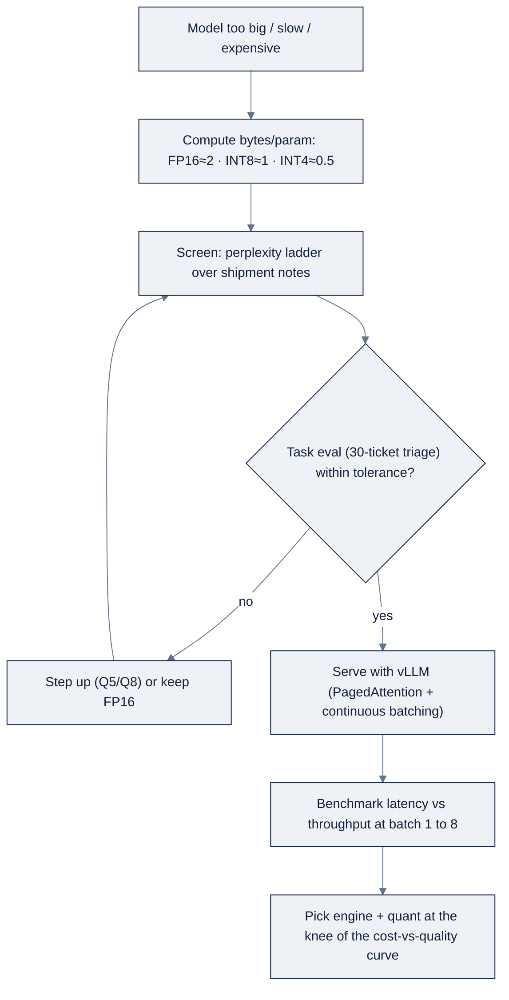

# Week 09: Quantization & Efficient Inference

> Part of AI Engineering Lab · Week 09 of 24 · Section: Model Engineering · Category: Quantization & Serving
> 🎯 Use case: Quantize the triage model, serve it with vLLM, and publish a quality-vs-cost report.

## The problem

ZoroLogistics runs a 7B open model that classifies inbound support tickets into
`{tracking, damage, refund, documents, customs, billing}`. It is accurate, but it
costs ~14 GB of VRAM in FP16 and, on a rented A10 GPU, about $0.031 per resolved
ticket. That is fine for a pilot and absurd at 50,000 tickets a month. The naive
fix is "buy a bigger GPU" or "call a hosted API for everything," but neither asks
the cheaper question first: *can the model we already have do the same job in a
quarter of the memory?*

That question is **quantization**, storing each weight in fewer bits so the model
shrinks almost linearly and decodes faster, at a small quality cost. Without it you
are stuck between two bad choices: pay full price for a model that is larger than
the task needs, or hand the job to an API and watch latency, cost, and data-control
slip away. With it, you get a decision *with numbers*: the same triage eval run at
FP16, 8-bit, and 4-bit, plus a serving benchmark, tells you exactly where the
quality-vs-cost curve bends. Without that measurement you guess; and guessing means
either shipping a 2-bit model that silently misroutes billing tickets to claims, or
paying for precision the task never needed. This week turns "I shrank a model" into
"I can defend shipping Q4_K_M."

## Objectives

- [ ] By Friday you can state the bytes-per-parameter math for FP16 / INT8 / INT4 and use it to predict, from a model card alone, whether a model fits a given VRAM budget.
- [ ] By Friday you can load a model in FP16, 8-bit (`LLM.int8()`), and 4-bit (`NF4`) via bitsandbytes and measure the perplexity difference on shipment notes.
- [ ] By Friday you can run a triage-accuracy eval on 30 labeled support tickets across the three precisions and read the quality-vs-cost tradeoff from the table.
- [ ] By Friday you can serve a model with vLLM (OpenAI-compatible), benchmark latency/throughput at multiple batch sizes, and publish a quality-vs-cost recommendation.

## Day-by-day plan

| Day | Study | Run | Ship | Time |
|---|---|---|---|---|
| **Mon** | Numeric formats (FP32/FP16/BF16/FP8/INT8/INT4) and the bytes-per-param rule in [reference/knowledge-base/06-model-engineering.md](../../reference/knowledge-base/06-model-engineering.md) | Reproduce the VRAM table by hand for 1.5B/7B/13B models | A markdown cell with your VRAM math | 2 h |
| **Tue** | Quantization methods: GGUF k-quants, bitsandbytes, AWQ, GPTQ | Load the 1.5B model in FP16/8-bit/4-bit in the lab notebook | Recorded perplexity ladder | 2 h |
| **Wed** | Why perplexity is a screen, not a verdict (perplexity vs task eval) | Run the 30-ticket triage eval at each precision | Quality-vs-VRAM table | 2 h |
| **Thu** | Serving engines (vLLM/SGLang/TGI), continuous batching, throughput vs latency | Start vLLM, benchmark batch sizes 1 to 8, compare Ollama | Speed table | 2 h |
| **Fri** | Read the tradeoff: where the cost and quality curves cross | Assemble the report from both notebooks | `week-09-quality-vs-cost-report.md` | 2 h |

## Concepts

This week is one idea applied twice: **the cheapest way to make a model cheaper is
to store its weights in fewer bits, and the only acceptable way to decide *how* few
is to measure the task, not the size.** The through-line is the "cheapest lever
first" order you saw in Week 10's reading, pointed at *inference* rather than
training. Before you pay for a bigger GPU, ask whether the model you already have
can be made cheaper without breaking the job. Quantization is that lever.

### One number per format

Weights are just floats, and every float costs memory. The whole VRAM-planning
problem collapses to multiplication once you memorize the bytes-per-parameter rule:

| Format | Bits/param | Bytes/param | Memory for 7B | Use |
|---|---|---|---|---|
| **FP32** | 32 | 4 | ~28 GB | Training checkpoints; almost never serving |
| **FP16** | 16 | 2 | ~14 GB | The "full-precision" serving baseline |
| **BF16** | 16 | 2 | ~14 GB | Training-stable; inference ≈ FP16 |
| **FP8** | 8 | 1 | ~7 GB | Hopper-class GPUs via Transformer Engine |
| **INT8** | 8 | 1 | ~7 GB | Near-lossless runtime quant (`LLM.int8()`) |
| **INT4 / NF4** | 4 | 0.5 | ~4 GB | Aggressive but widely accepted chat/inference default |

At 4-bit the rule of thumb is *roughly 1 GB per billion parameters*, which is why a
7B model fits on a laptop GPU and a 1.5B model fits on a phone-class card. You can
now answer "will this fit on my card?" from the model card before downloading a
single byte. See
[reference/knowledge-base/06-model-engineering.md §2.1](../../reference/knowledge-base/06-model-engineering.md)
for the full format rationale.

**Worked example 1: bytes-per-parameter math.** `Qwen/Qwen2.5-1.5B-Instruct` has
~1.54B parameters. Weight-only memory is `params × (bits / 8)`, so FP16 costs
`1.54e9 × 2 = 3.08 GB`, INT8 costs `1.54 GB`, and INT4/NF4 costs `0.77 GB`. Scale
it to the 7B triage model: `7e9 × 2 = 14 GB` (FP16), `7 GB` (INT8), `3.5 GB`
(INT4). That single multiplication is the difference between "I need to rent an
A100" and "this runs on the free Colab T4."

**Worked example 2: how an integer quantizer maps floats.** Under the hood, integer
quantization maps each float weight `w` to an integer `q = round(w / scale) +
zero_point` and reconstructs `ŵ = scale × (q − zero_point)`. A layer whose weights
span `[−0.5, 0.5]` gets `scale = (0.5 − (−0.5)) / 255 ≈ 0.0039`, so `0.5 →
round(0.5 / 0.0039) = 128` and `−0.5 → −128`, with a maximum error of ~0.002 per
weight. Summed over millions of weights, that error is imperceptible, and it is why
per-channel scale factors (or a nonlinear NF4 grid) beat a single per-tensor scale
that one outlier weight would inflate. The entire craft of a good quantizer is
choosing `scale` to throw away the least signal.

### Two families of quantizers, for two jobs

The methods split by *when* you apply them. **bitsandbytes** (8-bit `LLM.int8()` and
4-bit **NF4**) are *runtime* quantizers you drop into a notebook with
`load_in_8bit=True` / `load_in_4bit=True`, and they are also the substrate of
QLoRA next week. **GGUF k-quants** (`Q2_K` → `Q8_0`) are *static artifacts* llama.cpp
and Ollama run locally, which you met in Week 8. **AWQ** and **GPTQ** sit in between:
static, calibration-aware quants built for high-quality 4-bit *serving*.

| Method | Family | Bits | Needs calibration data? | Best fit |
|---|---|---|---|---|
| bitsandbytes `LLM.int8()` / NF4 | Runtime | 8 / 4 | No | Loading a big model in a notebook; QLoRA fine-tuning |
| GGUF k-quants | Static file | 2 to 8 | No | Local CPU/GPU inference via llama.cpp / Ollama |
| AWQ | Static (activation-aware) | 4 (3/8) | No (activation stats) | High-quality 4-bit serving on vLLM/TGI |
| GPTQ | Static (Hessian) | 4/8/3 | Yes | Batch-quantize once, serve anywhere |

One trap to defuse early: most local quants are **weight-only**, meaning the memory
win is real but the *speed* win depends on kernels. Do not assume 4-bit = 4× faster;
it is reliably ~4× smaller and *often* faster. See
[reference/knowledge-base/06-model-engineering.md §2.2](../../reference/knowledge-base/06-model-engineering.md).

### Perplexity is a screen, not a verdict

Perplexity, `exp(cross-entropy loss)` over held-out text, is the fast proxy: lower
means the model finds the text less "surprising." The general ladder is FP16/BF16 ≈
FP32 for inference, 8-bit ≈ negligible loss, 4-bit = small and usually imperceptible
for chat/summarization/RAG, and 2 to 3-bit = noticeable degradation. The problem is
that **perplexity is not task accuracy**, which is why
[reference/knowledge-base/07-evals-error-analysis.md](../../reference/knowledge-base/07-evals-error-analysis.md)
enters the picture. A quantized model can have near-identical perplexity and still
flub *your* job: miss a named entity, emit broken JSON, route a billing ticket to
claims.

**Worked example 3: the perplexity-vs-eval tradeoff.** On the 7B triage model, the
perplexity ratio of Q4_K_M vs FP16 is about **1.06**, a 6% "surprise" increase that
reads as *negligible*. But the task metric tells the real story. Measured on the same
golden triage eval (from [reference/knowledge-base/06-model-engineering.md §6](../../reference/knowledge-base/06-model-engineering.md)):

| Variant | VRAM | Triage F1 | p95 latency | $/task |
|---|---|---|---|---|
| FP16 | ~14 GB | 0.912 | 820 ms | $0.031 |
| Q8_0 / 8-bit | ~7 GB | 0.909 | 540 ms | $0.017 |
| **Q4_K_M** | ~4 GB | 0.897 | 410 ms | $0.009 |
| Q2_K | ~2.4 GB | 0.831 | 320 ms | $0.006 |

Q4_K_M loses only **1.5 F1 points** for **3.5× less VRAM and ~3.4× lower cost**,
clearly worth it for triage, where a mis-route is a quick human re-route. Q2_K loses
**8.1 points** (0.912 → 0.831), a real drop that would silently misroute a meaningful
share of tickets, yet its perplexity alone would have made it look "only slightly
worse." That gap is the entire lesson: **perplexity screens candidates; your task
eval decides.** The two numbers are read *together*, which is exactly what this
week's lab notebook produces.

### Serving: continuous batching and the throughput/latency trade

On the serving side, one idea dominates. Naive serving waits for a whole batch to
finish before starting the next request, one slow response stalls everyone. **vLLM's
PagedAttention** (KV cache stored in fixed-size pages, killing fragmentation) plus
**continuous batching** (new requests admitted token-by-token, finished ones evicted
immediately) is why a modern engine sustains far higher throughput under concurrency.
The knobs to know: `gpu_memory_utilization`, `max_num_batched_tokens`/`max_num_seqs`,
and `max_model_len`. **You buy throughput with latency**: a larger batch raises
aggregate tokens/sec but also per-request latency, so you tune toward whichever the
workload cares about (batch jobs → throughput; interactive UX → p95 latency). And
because all three engines (vLLM, SGLang, TGI) expose an **OpenAI-compatible**
`/v1/chat/completions` surface, you develop against a local server and switch to a
hosted endpoint, or vice versa, with a one-line `base_url` change.

### How it breaks

Quantization *prevents* one failure (paying for precision you do not need) and
*causes* others if applied blindly:

- **Small models degrade faster.** A 1B model at 4-bit is riskier than a 70B at
  4-bit, because there is less redundancy to absorb the error. Test, do not assume.
- **Perplexity lies about the task.** Near-flat perplexity can hide broken JSON, a
  missed entity, or a misrouted ticket, the exact bug a golden-set eval catches.
- **Weight-only quant is not automatically faster.** On GPU, the speed win needs
  fused kernels; without them you get smaller but not quicker.
- **Runtime quant is CUDA-only.** bitsandbytes does not support Apple MPS, so the
  live 8/4-bit cells skip there, the notebook degrades loudly instead of crashing.
- **The memory cost is not just weights.** Long context inflates the KV cache (a 7B
  model holds ~0.5 MB of KV *per token* at FP16), so `max_model_len` is a first-class
  memory knob, not an afterthought.
- **Batching buys throughput with latency.** A big batch raises p95; an interactive
  endpoint tuned for max throughput will feel slow to a human.

## Notebook walkthrough

Two notebooks carry the week. **[`notebooks/01-quantization-lab.ipynb`](notebooks/01-quantization-lab.ipynb)**
builds the quality half of the report. After the standard seeded setup (cell 2) and a
`detect_device()` cell (cell 4) that picks CUDA/MPS/CPU and sets `LIVE_QUANT` /
`LIVE_FP16` flags, cell 6 pulls 8 **shipment notes** from `data.shipments()` joined
with `data.lanes()` and 30 **labeled tickets** from `data.support_tickets()`. Cell 8
computes the VRAM math *first* (before touching a model), then cells 10 to 18 load the
1.5B model in FP16, 8-bit `LLM.int8()`, and 4-bit NF4 and run the `perplexity()`
helper from cell 12 over the notes. The decisive cell is cell 20's `triage_accuracy()`
greedy-decode one category word per ticket, compare to ground truth, followed by
cell 21, which prints the three accuracies, and cell 23, which assembles the
**quality-vs-VRAM table**. Cell 25 is the CPU fallback: it reproduces the documented
ladder (FP16 0.92 / INT8 0.92 / INT4 0.89) *clearly labelled as estimates*. Cell 27
prints the final number, `QUALITY_RETENTION_PCT`, the smallest quant's task accuracy
relative to FP16. A healthy result is 8-bit ≈ 100% retention and 4-bit ≈ 95%+; if
4-bit retention is materially lower, that is your signal to step up precision.

**[`notebooks/02-vllm-serving-and-benchmarks.ipynb`](notebooks/02-vllm-serving-and-benchmarks.ipynb)**
builds the speed half. Cell 6 starts a vLLM OpenAI-compatible server as a subprocess
(`--gpu-memory-utilization 0.85 --max-model-len 2048`); cell 8 polls `/models` for
readiness; cell 10's `benchmark()` fires a thread pool of concurrent requests and
returns mean latency and aggregate tokens/sec. Cell 12 sweeps batch sizes 1/2/4/8,
cell 15 repeats it against Ollama's `/v1` endpoint (same OpenAI SDK, different
`base_url`), and cell 17 stacks the two into one speed table. Cell 19 folds in the
Week 9 quantization facts and prints an illustrative cost-per-1M-tokens and the
vLLM/Ollama speedup; cell 21 prints the final `BEST_THROUGHPUT_TOK_PER_SEC` and
terminates the server. The shape to look for: throughput rises faster than latency
as batch grows, that gap is continuous batching doing its job.

## The use case (Friday)

**Deliverable:** a `week-09-quality-vs-cost-report.md` with four things, (a) the
measured perplexity ladder (FP16 → 8-bit → 4-bit) on shipment notes, (b) the triage
accuracy of each precision on the 30-ticket golden set, (c) the vLLM-vs-Ollama
latency/throughput table at your tested batch sizes, and (d) a one-sentence
production recommendation with the numbers that justify it.

**Acceptance gate (Zorost-style):** a stranger can open the report and see *why* your
recommended quantization wins, not "4-bit is popular" but "4-bit keeps 96.8% of FP16
triage accuracy at 25% of the VRAM and 2× the throughput, and here are the 3 tickets
it misfiles." You can show them what the quantized model got wrong. Perplexity without
the task eval, or a recommendation without both numbers, is half a deliverable.

**Stretch variant:** extend the benchmark to a third engine (SGLang or TGI) with the
*same* model and batch sizes, add its column, and write one sentence on which engine
you would pick for (a) high-QPS serving and (b) a workload where every request shares
a long system prompt, that is the prefix-cache scenario SGLang's RadixAttention
targets.

## Common pitfalls

| Pitfall | Fix |
|---|---|
| Judging a quant by perplexity alone | Always run the task eval (triage accuracy), perplexity screens, the eval decides |
| Assuming 4-bit = 4× faster | Weight-only quants shrink memory reliably but speed needs fused kernels; measure, do not assume |
| Shipping 2-bit on a small model | Small models degrade faster under quantization; keep a higher-precision fallback for hard cases |
| Ignoring the KV cache | Cap `max_model_len`; at long context KV can dwarf the weights |
| Tuning one batch size and stopping | Sweep batch 1 to 8 and read the throughput-vs-latency curve |
| Forgetting bitsandbytes is CUDA-only | On MPS, run FP16 live and use the clearly-labelled CPU fallback for the rest |
| Comparing engines with different models | Hold model and batch size fixed, or the comparison is meaningless |
| Reporting a number with no threshold | State the retention % *and* the ship/no-ship line |

## Glossary

- **Quantization**: storing weights in fewer bits (FP16/INT8/INT4) to shrink memory and often speed inference.
- **NF4**: "normal-float-4," bitsandbytes' data-aware 4-bit format tuned to the weight distribution; the substrate of QLoRA.
- **GGUF**: llama.cpp's self-contained file format plus a family of k-quants (`Q4_K_M`, `Q8_0`) run by Ollama/LM Studio.
- **AWQ / GPTQ**: activation-aware (AWQ) and Hessian-based (GPTQ) static quantizers built for high-quality 4-bit serving.
- **Perplexity**: `exp(cross-entropy loss)`; a fast proxy for how "surprised" a model is by held-out text (lower is better).
- **Continuous batching**: admitting new requests token-by-token and evicting finished ones, so the GPU never idles on a straggler.
- **PagedAttention**: vLLM's technique of storing the KV cache in fixed-size pages to nearly eliminate fragmentation.
- **KV cache**: the per-token key/value vectors a model must keep to attend to prior tokens; grows with context × layers × hidden size.
- **Throughput vs latency**: aggregate tokens/sec vs per-request time; you trade one for the other with batch size.
- **OpenAI-compatible API**: an engine's `/v1/chat/completions` surface that lets any OpenAI SDK client point at a local server via `base_url`.

## Self-check (quiz)

Take [quiz.md](quiz.md), 10 questions, pass with **8/10**. Record the score in your
tracker Notes.

## Exercises

The four graded exercises live in [exercises.md](exercises.md): **Easy** (run the lab,
record the ladder), **Standard** (reproduce the VRAM table by hand), **Stretch** (add a
third serving engine), **Portfolio** (commit the quality-vs-cost report). Hints are in
the same file.

## Sources

- bitsandbytes (8-bit / NF4): https://github.com/TimDettmers/bitsandbytes
- vLLM: https://docs.vllm.ai
- SGLang: https://github.com/sgl-project/sglang
- llama.cpp (GGUF k-quants): https://github.com/ggml-org/llama.cpp
- AWQ: https://github.com/mit-han-lab/llm-awq
- GPTQ: https://github.com/IST-DASLab/gptq
- Hugging Face PEFT (QLoRA substrate): https://huggingface.co/docs/peft
- Ollama: https://ollama.com
- Andrew Ng, *The AI Engineering Skills Map*, The Batch issue 366: https://www.deeplearning.ai/the-batch/issue-366
- Zorost Signal, *Cost and latency engineering for LLM systems*: https://zorost.com/llm-cost-latency-engineering
