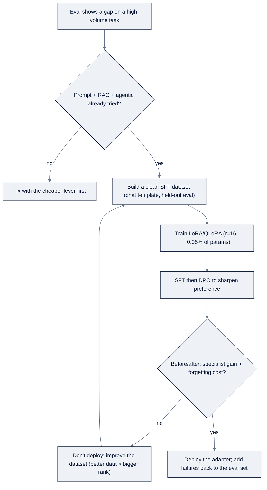

# Week 10: Fine-Tuning — LoRA、SFTとDPO

> **日本語版** · [英語版](README.md) · [演習](exercises.ja.md) · [クイズ](quiz.ja.md)
> AI Engineering Labの一部 · Week 10 of 24 · Section: Model Engineering · Category: Fine-tuning
> · Notebooks: [01-sft-dataset-and-lora-training.ipynb](notebooks/01-sft-dataset-and-lora-training.ipynb) · [02-dpo-and-before-after-evals.ipynb](notebooks/02-dpo-and-before-after-evals.ipynb)

## 問題

ZoroLogisticsのbase modelは、*ほぼ* すべてを正しくやります。Bill-of-lading extractionを頼むと厳密なJSON schemaからdriftし、support ticketのtriageを頼むと、「invoiceのweightが間違っている」を *billing* ではなく *documents* にrouteしてしまうことがopsが気づく程度には頻発します。これはRAGが埋められるknowledge gapではありません。答えはretrieveされたpassageの中にない。それは *behavior* です。promptで表現するには高くつき、retrieveされたtextでは表現不可能な、固定された出力shapeと社内のrouting style。測定されたevalが、prompting + RAG + toolingでも特定の大量targetに届かないことを示したとき、そのgapこそがweightに触るjustificationです。

問題は、fine-tuningに *まず* 手を伸ばすinstinctです。そしてfull fine-tuningは高価で、遅く、破壊的です。すべての1.5B（あるいは7B）paramsを更新することはGPU-hoursを消費し、modelがすでに持っているgeneral skillsを上書きしえます。今週の二つの道具、**LoRA/QLoRA**（paramsの~0.05%をtrainする）と **before/after eval**（specialist gainがgeneral costに見合うことを証明する）がなければ、fixに払い過ぎるか、他のすべてを密かにregressさせたadapterをshipすることになります。今週は、free-Colab budgetで測定されたgapを閉じることと、deploy/no-deploy判断を感覚ではなく数値の表として読むことを学びます。

## 目標

- [ ] 金曜日までに、Ngのselection order（prompt → RAG → agentic → fine-tune last）を言え、より安いleverがevalにfailした後でのみfine-tuningが正当化される具体的な理由を一つ挙げられる。
- [ ] 金曜日までに、`data.bol_samples()` のextractionと `data.support_tickets()` のtriage taskから、chat-template formatの~300例のSFT datasetをbuildできる。
- [ ] 金曜日までに、小さいbase modelにTRLの `SFTTrainer` でLoRA adapterをtrainし、loss curveを読める。
- [ ] 金曜日までに、~100のpreference pairを作り、小さなDPO stepを実行し、generic taskのcatastrophic-forgetting checkを含むbefore/after eval表をproduceできる。

## 日ごとの計画

| Day | Study | Run | Ship | Time |
|---|---|---|---|---|
| **Mon** | Selection orderとfine-tuningが *報われるとき*（[reference/knowledge-base/06-model-engineering.md](../../reference/knowledge-base/06-model-engineering.md) の§1、§3.1） | *あなたの* fine-tuneを正当化する測定済みgapを一文で述べる | 書いたjustification | 2時間 |
| **Tue** | SFT dataset設計、chat template、quality-vs-quantity | `bol_samples()` + `support_tickets()` から~300例のdatasetをbuildする | `sft_train.jsonl` + stats | 2時間 |
| **Wed** | LoRA/QLoRAのmechanics、rank/alpha、QLoRA recipe | `SFTTrainer` でadapterをtrainし、loss curveをcaptureする | `lora_adapter/` + loss curve | 2時間 |
| **Thu** | DPOとpreference data。catastrophic forgetting | ~100 pairをbuildし、DPO stepを実行し、before/afterを採点する | Before/after eval表 | 2時間 |
| **Fri** | Tradeを読む: gain vs forgetting | deploy/no-deploy decisionを書く | `week-10-before-after.md` | 2時間 |

## 概念

今週のthesisは、[reference/knowledge-base/06-model-engineering.md §1](../../reference/knowledge-base/06-model-engineering.md) から直接来ています。**fine-tuningは、測定されたgapによって正当化される最後のleverであって、最初のinstinctではない。** 順序は、managed-API prototype、次に *eval付きの* prompting/context engineering、次にRAG、次にagentic workflow、そしてようやくweightです。各stepは前のstepより元に戻しにくい。prompt変更は数秒でdeployでき、fine-tuneはGPU-hoursがかかり、他のskillをregressさせ、base modelが向上したらやり直しです。率直なrule: *prompting + RAG + toolingが届けないeval scoreを指差せないなら、trainする準備はできていません。*

### Fine-tuningが報われるとき（報われないとき）

Fine-tuningが正しい道具なのは、**style、tone、厳密な出力format、nicheなdomain vocabulary**、つまりpromptで表現するには高くつき、retrieveされたtextでは表現不可能なbehaviorと、大きいmodelのbehaviorを小さいspecialistにcompressすることに対してです。*新しいknowledge* には **報われません**（それはRAGの仕事です。変わるfactを保存する場所としてweightは間違っている。「昨四半期の価格を知っている」modelは今四半期にはすでに間違っています）。一回限りのpromptで直せるbehaviorや、clean dataがない場合にも報われません。

| Fine-tuneが報われる | Fine-tuneが報われない |
|---|---|
| Style/tone（「うちのsupport teamらしく書く」） | 新しい、または変わるfact（RAGを使う） |
| 厳密な出力format（固定JSON schema） | 一回限りの、promptで直せるbehavior |
| Domain vocabulary / 社内taxonomy | 高品質dataが少なすぎる |
| Compression: 小さいspecialistに大きいteacherを模倣させる | まず *測定して* いないgap |

### LoRA、QLoRA、DoRA: weightの一部だけをtrainする

Parameter-efficient fine-tuning（**PEFT**）はbase weightをfreezeし、新しいparameterの小さな集合だけをtrainします。**LoRA**（Low-Rank Adaptation）はweight updateを `ΔW = B·A` として分解します。`A` と `B` はrank `r` の小さなmatrixで、attention/MLP projectionに注入されます。**QLoRA** はLoRAを **4-bit NF4** のbase（あなたのWeek 9の道具）の上にstackし、7〜8Bのfine-tuneがfree Colab GPUや16 GB laptopに収まるようにします。**DoRA** は各weightをmagnitude + directionにsplitしてdirectionだけをadaptし、同じrankでしばしばfull fine-tuningにより近い結果を出します。[reference/knowledge-base/06-model-engineering.md §3.2](../../reference/knowledge-base/06-model-engineering.md) を参照してください。

**実例1: LoRAのparameter数のmath。** notebookは `Qwen/Qwen2.5-1.5B-Instruct`（hidden size 1536、MLP intermediate 8960）を `r=16`、`alpha=32` でtrainし、`q/k/v/o` projection（各1536→1536）と `gate/up/down`（各1536→8960）をtargetにします。shapeが `(in, out)` の各moduleに対して、LoRAは `r × (in + out)` のtrainable parameterを追加します。四つのattention projectionは `4 × 16 × 3072 = 196,608`、三つのMLP projectionは `3 × 16 × 10,496 = 503,808`。合計: **700,416 ≈ 0.70Mのtrainable parameter**。freezeされた~1.54Bに対して、modelの **約0.05%** で、「0.1〜1%」のPEFT rangeのど真ん中です。だからadapterは数MBに収まり、trainingはmemoryの一部で済みます。Rankはupdateに与える「自由度」の数で（style/formatなら `r=4-16`、より難しいshiftなら `r=32-64`）、`alpha ≈ 2·r` がupdateの強さの一般的なdefaultです。

| Task type | Rank `r` | Alpha | Notes |
|---|---|---|---|
| Style / tone / formatのみ | 8 | 16 | 最小capacity。overfit risk最小 |
| Domain behavior（extraction、classification） | 16〜32 | 32〜64 | 最も一般的な出発点 |
| 難しいtask shift（reasoning、tool use） | 64 | 128 | dataが十分にある場合のみ。overfittingに注意 |

### SFT: clean data上のimitation learning

Supervised fine-tuning（**SFT**）は、`(instruction → answer)` pair上のimitation learningです。内面化すべき唯一のrule: **数百のcleanで多様なon-taskなexampleが、数万のnoisyなexampleに勝る。** 小さいmodelはdataで支配的なpatternを何であれ内面化するので、garbage inは文字通りあなたが教えるものになります。model固有の **chat template**（`role`/`content` の `messages` array）に合わせ、別のeval setをhold outし、happy pathだけでなくerror analysisの *failure mode* をカバーしてください。[reference/knowledge-base/06-model-engineering.md §3.3](../../reference/knowledge-base/06-model-engineering.md) を参照してください。

### SFT → DPO → RLVR

SFTは *shape* を教え、**DPO**（Direct Preference Optimization）は *preference* を研ぎ澄まします。古典的RLHFは別途trainingしたreward modelと気難しいPPO loopを必要としますが、DPOはpreference signalを `(prompt, chosen, rejected)` pair上のsupervised風のobjectiveに直接foldします。より単純で、より安定で、しばしば同等です。**RLVR** はさらに先へ行き、learned rewardの代わりに *verifiableな* reward（testがpassするかしないか）を使います。実用的な順序は、まずSFT、次にDPO、そしてRLVRはverifiable rewardとさらにpushする理由があるときのみです。

| Objective | 最適化するもの | Data | 用途 |
|---|---|---|---|
| **SFT** | 良いanswerのimitation | `(instruction, answer)` | Style、format、task behavior、第一step |
| **DPO** | chosen > rejectedを直接 | `(prompt, chosen, rejected)` | Preference shaping。reward model不要 |
| **RLVR** | check可能なreward | Verifiable task + reward fn | Frontierのreasoning/coding gain |

### Frameworkとbudget

DefaultのPython stackは **TRL + PEFT**（`SFTTrainer`、`DPOTrainer`、`LoraConfig`）です。**Unsloth** は同じTRL APIの上に載るdrop-inのspeed/memory layer（2〜5×速く、~50〜70%少ないVRAM）で、**Axolotl** はfine-tuneを、reproducibleで共有可能なrunのためのYAML recipeに変えます。budgetの現実こそがpointです。7〜8BのQLoRA SFT runはfree Colab T4や16 GB MacBookに収まるので、fine-tuningに必要なのはdatacenterではなく *clean dataset* です。

### Loopはeval loop。そしてforgettingがcost

「Trainingがあった」は結果ではありません。同じgolden set上のbefore/afterの数値こそが結果で、だからこそ [reference/knowledge-base/07-evals-error-analysis.md](../../reference/knowledge-base/07-evals-error-analysis.md) が今週のco-readingです。そしてweightのtrainingは古いskillを *上書き* しうるので、すべてのfine-tuneには必須の **catastrophic-forgetting check** が伴います。modelがかつて上手にやれていたgeneric taskをhold outし、前後で採点し、specialist skillをgeneral competenceと交換してしまったadapterはshipを拒否してください。

**実例2: before/after decision。** Held-out setで、base modelはextraction field-F1 **0.60**、triage accuracy **0.72**、genericな五問check **0.95**。DPO adapter後: extraction **0.88**、triage **0.91**、generic **0.93**。notebookの最終数値は `net = (extraction delta) + (triage delta) − (forgetting cost)` = `(0.88−0.60) +
(0.91−0.72) − (0.95−0.93)` = `0.28 + 0.19 − 0.02 = +0.45`。Netが正 → specialist gainが小さなgeneric regressionを *稼いだ* → **deploy**。forgetting costがgainを上回っていたら（例: generic 0.95 → 0.80）、正直な答えは **don't deploy** で、それを数値で述べることは合格する結果です。二列二行の表（base vs fine-tuned × 新task vs general）が、誰でも（未来の自分を含めて）実際のtradeを見せる最小のartifactです。

### うまくいかない理由

Fine-tuningは「promptをもっと強く押し続ける」という迷走を *防ぎ*、誤用すれば次のfailureを *起こします*。

- **General skillのforgetting。** adapterが新しいtaskにoverfitしてgeneric checkをregressさせます。それこそbefore/after表が表面化するために存在するcostです。
- **Evalのmemorize。** 同じexampleでtrainして採点すると、数値はcapabilityではなくmemorizationを測ります。held-out setは妥協できません。
- **Template mismatch。** trainingされていないchat formatをmodelに与えると、runが静かにdegradeします。tokenizer固有のtemplateに合わせること。
- **Garbage dominance。** Noisyなdatasetは *支配的な* patternを教えます。cleanで多様なon-task dataが、多いnoisy rowに勝ります。
- **Rank/alphaの誤用。** Rankが高すぎる（あるいはepochが多すぎる）とoverfitします。train scoreが上がり、eval scoreが下がる。`r` やalphaを減らすことであって、epochを増やすのではありません。
- **Weightにfactを保存。** 揮発性のpolicy dataを「知っている」fine-tuneは古くなります。factはretrieveし、*behavior* をfine-tuneする。

## Notebook walkthrough

二つのnotebookが今週を担います。**[`notebooks/01-sft-dataset-and-lora-training.ipynb`](notebooks/01-sft-dataset-and-lora-training.ipynb)** がdatasetをbuildしてadapterをtrainします。Seeded setup（cell 2）の後、cell 6が `data.bol_samples()` から150の **extraction** exampleをbuildします。各exampleは、assistant turnが `bol["fields"]` のground-truth JSONである `messages` arrayです。cell 8は `data.support_tickets()` から150の **triage** exampleをbuildします。Cell 10が両者をcombineし、`sft_train.jsonl` を書き、exampleあたりの平均語数をprintします。Cell 11はtrain前のcost見積もり（QLoRA `r=16` → weight ~0.75 GB、300例、~38 optimizer step、T4に収まる）。Cell 15がLoRA configを設定し（`r=16, alpha=32`、targetは `q/k/v/o/gate/up/down`）、cell 17がbaseをloadします。CUDAでは **QLoRA**（4-bit NF4）、MPSではplain FP16 LoRAです。cell 18がそれをwrapし、`print_trainable_parameters()` をprintします（~0.70M trainable = ~0.05%を期待）。Cell 22が `SFTTrainer` を実行し（batch 2 × grad-accum 4、LR 2e-4、1 epoch）、loss historyをcaptureします。cell 24がstepごとのcurveをprintしてadapterをsaveし、cell 26が新しいextractionをsmoke-testします。Cell 28が最終の `SFT_FINAL_LOSS` と `SFT_EXAMPLES` をprintします。Cleanなrunはlossが下ってから平坦になります。step 0から平坦なら、LRが高すぎるかdataがtokenizeされていません。

**[`notebooks/02-dpo-and-before-after-evals.ipynb`](notebooks/02-dpo-and-before-after-evals.ipynb)** がtradeを測ります。Cell 6がeval set（20 BoLs、30 ticket、5 generic question）をhold outします。Cell 8が~100のpreference pairをbuildします。chosen = 正解、rejected = corruptされたweightかplausibleだが誤ったcategory。Cells 12〜14が三つのdeterministic helperで **before** 状態（base model）を採点します。cell 17が **DPO step**（`beta=0.1`、`r=8`）をtry/exceptでwrapして実行し、configの問題があればgracefulにdegradeします。cell 19が *同じ* setで **after** 状態を採点します。Cell 21が `delta` column付きのbefore/after表を組み立て、cell 23が最終の `BEFORE_AFTER_NET_GAIN` = extraction delta + triage delta − forgetting costをprintします。見るべきshapeは、specialist deltaが正で、generic regressionより明確に大きいこと。generic低下がgainより大きければ、数値は負になり、正直なdecisionは「don't deploy」です。

## Use case（Friday）

**Deliverable:** before/after eval表と、fine-tune済みmodelに対する一段落の **deploy/no-deploy decision**。表は *同じ* held-out setでbase modelとadapterを採点します。BoL field extraction、ticket triage、そしてgeneric task（forgetting check）。行ごとにmetricが付き、decisionは感覚ではなく数値の読みになります。

**Acceptance gate（Zorost式）:** 見知らぬ人が表を開き、fine-tuneが買った正確なdeltaを見られること。「triage accuracy 0.72 → 0.91、extraction field-F1 0.60 → 0.88、generic task 0.95 → 0.93」。そして *何が変わったか* を見せられます。adapterが正しくrouteするようになった具体的なticketと、立て続けに失敗し始めたgeneric answer。adapterがforgetting costを正当化するほどbaseを上回らないなら、正直な答えは **don't deploy** で、それを数値とともに言うことは合格する結果です。

**Stretch variant:** plain LoRAを **DoRA**（`LoraConfig` の `use_dora=True`）か4-bit QLoRA baseにswapし、他をすべて固定して、before/after表をplain-LoRA runと比較します。その追加mechanismが *あなたのtaskに* 見合ったか（一般的にではなく）を一文で書きます。

## よくあるpitfall

| Pitfall | Fix |
|---|---|
| Gapを測る前にfine-tuningする | まずeval付きのprompt + RAG + agenticを実行する。fine-tuneは測定されたmissのみ |
| Held-out eval setがない | Datasetをsplitする。trainとgradeは *別の* exampleで |
| Catastrophic forgettingの無視 | 常にgeneric taskのbefore/after checkを追加する。net gainでgateする |
| 間違ったchat templateを与える | Model固有の `messages` format（あるいはtokenizerのtemplate）を使う |
| Noisy dataで「dataは多いほど良い」 | 数百のcleanで多様なexampleが数千のnoisyに勝る |
| Overfitting（train up、eval down） | Rank/alphaかepochを減らす。overfit直しにepochを増やすことは決してしない |
| Loss curveを成功として読む | Lossはtrainingがあったことしか証明しない。*助けに* なったことを証明するのはevalだけ |
| 揮発性のfactをweightに保存 | Factはretrieve（RAG）する。fine-tuneはbehaviorのみ |

## Glossary

- **Fine-tuning**: task dataでtrainingを続け、modelのbehavior、format、styleを変えること。
- **PEFT**: parameter-efficient fine-tuning。baseをfreezeし、新しいparameterの小さな集合をtrainする。
- **LoRA**: low-rank adaptation。rank `r` の `ΔW = B·A` をattention/MLP層に注入する。
- **QLoRA**: bitsandbytesの4-bit NF4 baseの上のLoRA。大きいfine-tuneが一枚のcardに収まる。
- **DoRA**: magnitudeとdirectionを分離し、directionだけをadaptするweight-decomposed LoRA。
- **SFT**: supervised fine-tuning。`(instruction → answer)` pair上のimitation learning。
- **DPO**: direct preference optimization。`(prompt, chosen, rejected)` 上で、reward modelなしにtrainする。
- **Chat template**: model固有のmessage format。通常は `role`/`content` の `messages` array。
- **Catastrophic forgetting**: 狭いtaskでfine-tuningしたときにgeneral skillがregressすること。
- **Rank `r` / alpha**: LoRA updateのcapacity（`r`）と強さ（`alpha`）のknob。
- **Before/after eval**: baseとadapterを *同じ* held-out setで採点し、deltaを読むこと。

## Self-check（quiz）

[quiz.md](quiz.md) を受けてください。10問、合格は **8/10**。scoreをtracker Notesに記録します。

## Exercises

四つのgraded exerciseは [exercises.md](exercises.md) にあります。**Easy**（SFT notebookを実行し、loss + dataset sizeを記録）、**Standard**（新しいseed + 手書き50例でdatasetを再build）、**Stretch**（LoRAをDoRAまたはQLoRAにswap）、**Portfolio**（adapter + before/after表 + deploy decisionをcommit）。hintは同じfileにあります。

## Sources

- Hugging Face TRL (`SFTTrainer`, `DPOTrainer`): https://huggingface.co/docs/trl
- Hugging Face PEFT (`LoraConfig`, LoRA/QLoRA/DoRA): https://huggingface.co/docs/peft
- bitsandbytes (QLoRA 4-bit NF4): https://github.com/TimDettmers/bitsandbytes
- Unsloth: https://github.com/unslothai/unsloth
- Axolotl: https://github.com/axolotl-ai-cloud/axolotl
- Hugging Face Datasets: https://huggingface.co/docs/datasets
- MLflow (log the training run): https://mlflow.org/docs/latest/index.html
- Andrew Ng, *The AI Engineering Skills Map*, The Batch issue 366: https://www.deeplearning.ai/the-batch/issue-366
- Andrew Ng, *Improve Agentic Performance with Evals and Error Analysis, Part 2*: https://www.deeplearning.ai/the-batch/improve-agentic-performance-with-evals-and-error-analysis-part-2
- Fereydun Hashemi (Zorost), *The AI Engineering Skills Map, turned into a training plan*: https://zorost.com/ai-engineering-skills-map-training-guide
