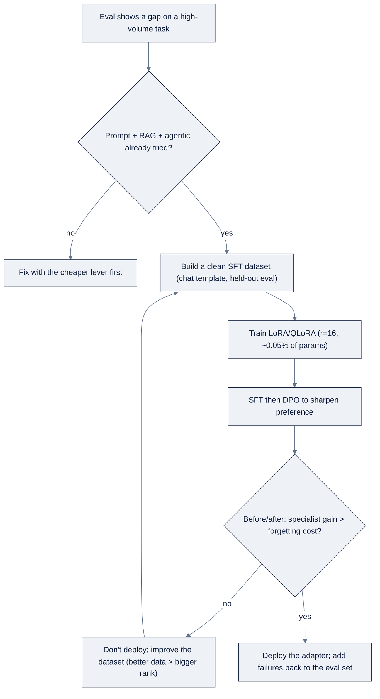

# Week 10, Fine-Tuning: LoRA, SFT & DPO

> Part of AI Engineering Lab · Week 10 of 24 · Section: Model Engineering · Category: Fine-tuning
> 🎯 Use case: Fine-tune a small open model on ZoroLogistics support tone and bill-of-lading entity extraction.

## The problem

ZoroLogistics' base model does *almost* everything right. Prompted for bill-of-lading
extraction, it drifts from the strict JSON schema; asked to triage a support ticket,
it routes "the invoice has the wrong weight" to *documents* instead of *billing*
often enough that ops notices. These are not knowledge gaps that RAG can fill, the
answer is not in a retrieved passage; it is a *behavior*: a fixed output shape and a
house routing style that are expensive to express in a prompt and impossible to
express in retrieved text. When a measured eval shows prompting + RAG + tooling
still miss a specific, high-volume target, that gap is the justification for
touching the weights.

The problem is that the instinct is to reach for fine-tuning *first*, and full
fine-tuning is expensive, slow, and destructive, updating all 1.5B (or 7B)
parameters costs GPU-hours and can overwrite the general skills the model already
has. Without this week's two tools, **LoRA/QLoRA** (train ~0.05% of the parameters)
and a **before/after eval** (prove the specialist gain is worth the general cost),
you either overpay for the fix or ship an adapter that secretly regressed
everything else. This week you learn to close a measured gap on a free-Colab budget
and to read the deploy/no-deploy decision as a table of numbers, not a feeling.

## Objectives

- [ ] By Friday you can state Ng's selection order (prompt → RAG → agentic → fine-tune last) and give one concrete reason fine-tuning is justified *only* after the cheaper levers fail an eval.
- [ ] By Friday you can build a ~300-example SFT dataset in chat-template format from `data.bol_samples()` extraction and `data.support_tickets()` triage tasks.
- [ ] By Friday you can train a LoRA adapter with TRL's `SFTTrainer` on a small base model and read the loss curve.
- [ ] By Friday you can create ~100 preference pairs, run a small DPO step, and produce a before/after eval table that includes a catastrophic-forgetting check on a generic task.

## Day-by-day plan

| Day | Study | Run | Ship | Time |
|---|---|---|---|---|
| **Mon** | The selection order and *when* fine-tuning pays (§1, §3.1 of [reference/knowledge-base/06-model-engineering.md](../../reference/knowledge-base/06-model-engineering.md)) | State, in one sentence, the measured gap that justifies *your* fine-tune | A written justification | 2 h |
| **Tue** | SFT dataset design, chat templates, quality-vs-quantity | Build the ~300-example dataset from `bol_samples()` + `support_tickets()` | `sft_train.jsonl` + stats | 2 h |
| **Wed** | LoRA/QLoRA mechanics, rank/alpha, the QLoRA recipe | Train the adapter with `SFTTrainer`; capture the loss curve | `lora_adapter/` + loss curve | 2 h |
| **Thu** | DPO and preference data; catastrophic forgetting | Build ~100 pairs, run a DPO step, grade before/after | Before/after eval table | 2 h |
| **Fri** | Read the trade: gain vs forgetting | Write the deploy/no-deploy decision | `week-10-before-after.md` | 2 h |

## Concepts

The week's thesis, straight from
[reference/knowledge-base/06-model-engineering.md §1](../../reference/knowledge-base/06-model-engineering.md),
is that **fine-tuning is the last lever, justified by a measured gap, not the first
instinct.** The order is a managed-API prototype, then prompting/context engineering
*with an eval*, then RAG, then an agentic workflow, and only then the weights. Each
step is harder to undo than the last: a prompt change deploys in seconds; a fine-tune
costs GPU-hours, can regress other skills, and must be re-run when the base model
improves. The blunt rule: *if you cannot point to an eval score that prompting + RAG
+ tooling fail to reach, you are not ready to train.*

### When fine-tuning pays (and when it doesn't)

Fine-tuning is the right tool for **style, tone, strict output format, and niche
domain vocabulary**, behaviors that are expensive to express in a prompt and
impossible to express in retrieved text, and for compressing a large model's
behavior into a small specialist. It does **not** pay for *new knowledge* (that is
RAG's job: weights are the wrong place to store facts that change, a model that
"knows" last quarter's prices is already wrong this quarter), for one-off
prompt-fixable behavior, or when you lack clean data.

| Fine-tune pays | Fine-tune does not pay |
|---|---|
| Style/tone ("write like our support team") | New or changing facts (use RAG) |
| Strict output format (fixed JSON schema) | One-off, prompt-fixable behavior |
| Domain vocabulary / house taxonomy | Too little high-quality data |
| Compression: teach a small specialist to mimic a large teacher | A gap you have not *measured* first |

### LoRA, QLoRA, DoRA: training a fraction of the weights

Parameter-efficient fine-tuning (**PEFT**) freezes the base weights and trains only a
small set of new parameters. **LoRA** (Low-Rank Adaptation) factors the weight update
as `ΔW = B·A` where `A` and `B` are small matrices of rank `r`, injected into the
attention/MLP projections. **QLoRA** stacks LoRA on a **4-bit NF4** base (your Week 9
tool) so a 7 to 8B fine-tune fits on a free Colab GPU or a 16 GB laptop. **DoRA** splits
each weight into magnitude + direction and adapts only the direction, often matching
full fine-tuning better at the same rank. See
[reference/knowledge-base/06-model-engineering.md §3.2](../../reference/knowledge-base/06-model-engineering.md).

**Worked example 1: LoRA parameter-count math.** The notebook trains
`Qwen/Qwen2.5-1.5B-Instruct` (hidden size 1536, MLP intermediate 8960) with `r=16`,
`alpha=32`, targeting `q/k/v/o` projections (1536→1536 each) and `gate/up/down`
(1536→8960 each). For each module of shape `(in, out)`, LoRA adds `r × (in + out)`
trainable parameters. The four attention projections cost `4 × 16 × 3072 = 196,608`;
the three MLP projections cost `3 × 16 × 10,496 = 503,808`. Total: **700,416 ≈ 0.70M
trainable parameters**, against ~1.54B frozen: **about 0.05%** of the model, squarely
in the "0.1 to 1%" PEFT range. That is why the adapter saves to a few MB and why
training needs a fraction of the memory. Rank is the number of "degrees of freedom"
you give the update (`r=4-16` for style/format, `r=32-64` for harder shifts), and
`alpha ≈ 2·r` is a common default for the update's strength.

| Task type | Rank `r` | Alpha | Notes |
|---|---|---|---|
| Style / tone / format only | 8 | 16 | Minimal capacity; least overfit risk |
| Domain behavior (extraction, classification) | 16 to 32 | 32 to 64 | The most common starting point |
| Hard task shift (reasoning, tool use) | 64 | 128 | Only with plenty of data; watch overfitting |

### SFT: imitation learning on clean data

Supervised fine-tuning (**SFT**) is imitation learning on `(instruction → answer)`
pairs. The single rule to internalize: **a few hundred clean, diverse, on-task
examples beat tens of thousands of noisy ones**, a small model internalizes whatever
pattern dominates the data, so garbage in is literally what you teach. Match the
model's native **chat template** (a `messages` array of `role`/`content`), hold out a
separate eval set, and cover the *failure modes* from your error analysis rather than
just the happy path. See
[reference/knowledge-base/06-model-engineering.md §3.3](../../reference/knowledge-base/06-model-engineering.md).

### SFT → DPO → RLVR

SFT teaches the *shape*; **DPO** (Direct Preference Optimization) sharpens the
*preference*. Classic RLHF needs a separately trained reward model and a finicky PPO
loop; DPO folds the preference signal directly into a supervised-style objective on
`(prompt, chosen, rejected)` pairs, simpler, more stable, and often as good. **RLVR**
goes further, using a *verifiable* reward (a test passes or it does not) instead of a
learned one. The practical sequence is SFT first, then DPO, then RLVR only with a
verifiable reward and a reason to push further.

| Objective | Optimizes | Data | Use |
|---|---|---|---|
| **SFT** | Imitation of good answers | `(instruction, answer)` | Style, format, task behavior, first step |
| **DPO** | Chosen > rejected, directly | `(prompt, chosen, rejected)` | Preference shaping; no reward model |
| **RLVR** | A checkable reward | Verifiable tasks + reward fn | Frontier reasoning/coding gains |

### Frameworks and budget

The default Python stack is **TRL + PEFT** (`SFTTrainer`, `DPOTrainer`, `LoraConfig`).
**Unsloth** is a drop-in speed/memory layer (2 to 5× faster, ~50 to 70% less VRAM) over the
same TRL API, and **Axolotl** turns a fine-tune into a YAML recipe for reproducible,
shareable runs. The budget reality is the point: a 7 to 8B QLoRA SFT run fits a free
Colab T4 or a 16 GB MacBook, so fine-tuning does not require a datacenter, it
requires a *clean dataset*.

### The loop is an eval loop: and forgetting is the cost

"Training happened" is not a result; the before/after number on the same golden set
is, which is why
[reference/knowledge-base/07-evals-error-analysis.md](../../reference/knowledge-base/07-evals-error-analysis.md)
is this week's co-reading. And because training weights can *overwrite* old skills,
every fine-tune carries a mandatory **catastrophic-forgetting check**: hold out a
generic task the model used to do well, grade it before and after, and refuse to ship
an adapter that traded your specialist skill for general competence.

**Worked example 2: the before/after decision.** On the held-out set, the base model
scores extraction field-F1 **0.60**, triage accuracy **0.72**, and a generic
five-question check **0.95**. After the DPO adapter: extraction **0.88**, triage
**0.91**, generic **0.93**. The notebook's final number is
`net = (extraction delta) + (triage delta) − (forgetting cost)` = `(0.88−0.60) +
(0.91−0.72) − (0.95−0.93)` = `0.28 + 0.19 − 0.02 = +0.45`. Positive net → the
specialist gains *earned* the tiny generic regression → **deploy**. Had the forgetting
cost exceeded the gains (e.g., generic 0.95 → 0.80), the honest answer is **don't
deploy**, and stating that with numbers is a passing result. The two-column,
two-row table (base vs fine-tuned × new-task vs general) is the minimum artifact that
lets anyone, including future you, see the actual trade.

### How it breaks

Fine-tuning *prevents* "prompt it harder forever" thrash, and *causes* these failures
if misused:

- **Forgetting the general skills.** The adapter overfits the new task and regresses
  the generic check, the exact cost the before/after table exists to surface.
- **Memorizing the eval.** Train and grade on the same examples and the number
  measures memorization, not capability; a held-out set is non-negotiable.
- **Template mismatch.** Feeding the model a chat format it was not trained on
  silently degrades the run; match the tokenizer's native template.
- **Garbage dominance.** A noisy dataset teaches the *dominant* pattern, clean,
  diverse, on-task beats many noisy rows.
- **Rank/alpha misuse.** Rank too high (or too many epochs) overfits: train score up,
  eval score down. Reduce `r` or alpha, do not add epochs.
- **Storing facts in weights.** A fine-tune that "knows" volatile policy data goes
  stale; retrieve facts, fine-tune *behavior*.

## Notebook walkthrough

Two notebooks carry the week. **[`notebooks/01-sft-dataset-and-lora-training.ipynb`](notebooks/01-sft-dataset-and-lora-training.ipynb)**
builds the dataset and trains the adapter. After the seeded setup (cell 2), cell 6
builds 150 **extraction** examples from `data.bol_samples()`, each a `messages`
array whose assistant turn is the ground-truth JSON of `bol["fields"]`, and cell 8
builds 150 **triage** examples from `data.support_tickets()`. Cell 10 combines them,
writes `sft_train.jsonl`, and prints mean words/example. Cell 11 is the pre-train cost
estimate (QLoRA `r=16` → ~0.75 GB weights, 300 examples, ~38 optimizer steps, fits a
T4). Cell 15 sets the LoRA config (`r=16, alpha=32`, targets `q/k/v/o/gate/up/down`);
cell 17 loads the base, **QLoRA** on CUDA (4-bit NF4) or plain FP16 LoRA on MPS,
and cell 18 wraps it, printing `print_trainable_parameters()` (expect ~0.70M trainable
= ~0.05%). Cell 22 runs `SFTTrainer` (batch 2 × grad-accum 4, LR 2e-4, 1 epoch) and
captures the loss history; cell 24 prints the step-wise curve and saves the adapter;
cell 26 smoke-tests a fresh extraction. Cell 28 prints the final
`SFT_FINAL_LOSS` and `SFT_EXAMPLES`. A clean run shows loss falling then flattening;
a flatline from step 0 means LR too high or data not tokenizing.

**[`notebooks/02-dpo-and-before-after-evals.ipynb`](notebooks/02-dpo-and-before-after-evals.ipynb)**
measures the trade. Cell 6 holds out the eval set (20 BoLs, 30 tickets, 5 generic
questions). Cell 8 builds ~100 preference pairs, chosen = correct, rejected = a
corrupted weight or a plausible-but-wrong category. Cells 12 to 14 grade the **before**
state (base model) with three deterministic helpers; cell 17 runs the **DPO step**
(`beta=0.1`, `r=8`) wrapped in a try/except so a config issue degrades gracefully;
cell 19 grades the **after** state on the *same* set. Cell 21 assembles the
before/after table with a `delta` column, and cell 23 prints the final
`BEFORE_AFTER_NET_GAIN` = extraction delta + triage delta − forgetting cost. The
shape to look for: specialist deltas positive and materially larger than any generic
regression, if the generic drop is bigger than the gains, the number is negative and
the honest decision is "don't deploy."

## The use case (Friday)

**Deliverable:** a before/after eval table plus a one-paragraph **deploy/no-deploy
decision** for the fine-tuned model. The table grades the base model and the adapter
on the *same* held-out set, BoL field extraction, ticket triage, and a generic task
(the forgetting check), with a metric per row, so the decision is a reading of
numbers rather than a feeling.

**Acceptance gate (Zorost-style):** a stranger can open the table and see the exact
delta the fine-tune bought, "triage accuracy 0.72 → 0.91, extraction field-F1 0.60 →
0.88, generic task 0.95 → 0.93", and you can show them *what changed*: the specific
tickets the adapter now routes correctly and the generic answers it started to fumble.
If the adapter does not beat the base by enough to justify its forgetting cost, the
honest answer is **don't deploy**, and saying so with the numbers is a passing result.

**Stretch variant:** swap plain LoRA for **DoRA** (`use_dora=True` in `LoraConfig`) or
switch to a 4-bit QLoRA base, keep everything else fixed, and compare the before/after
table against your plain-LoRA run. Write one sentence on whether the extra mechanism
was worth it *for your task*, not in general.

## Common pitfalls

| Pitfall | Fix |
|---|---|
| Fine-tuning before measuring a gap | Run prompt + RAG + agentic with an eval first; fine-tune only on a measured miss |
| No held-out eval set | Split the dataset; train and grade on *different* examples |
| Ignoring catastrophic forgetting | Always add a generic-task before/after check; gate on net gain |
| Feeding the wrong chat template | Use the model's native `messages` format (or the tokenizer's template) |
| "More data is better" with noisy data | A few hundred clean, diverse examples beat thousands of noisy ones |
| Overfitting (train up, eval down) | Reduce rank/alpha or epochs, never add epochs to fix overfit |
| Reading the loss curve as success | Loss proves training happened; only the eval proves it *helped* |
| Storing volatile facts in weights | Retrieve facts (RAG); fine-tune behavior only |

## Glossary

- **Fine-tuning**: continuing training on task data to change a model's behavior, format, or style.
- **PEFT**: parameter-efficient fine-tuning: freeze the base, train a small set of new parameters.
- **LoRA**: low-rank adaptation: `ΔW = B·A` of rank `r` injected into attention/MLP layers.
- **QLoRA**: LoRA on top of a 4-bit NF4 base via bitsandbytes; fits big fine-tunes on one card.
- **DoRA**: weight-decomposed LoRA that adapts direction separately from magnitude.
- **SFT**: supervised fine-tuning: imitation learning on `(instruction → answer)` pairs.
- **DPO**: direct preference optimization: trains on `(prompt, chosen, rejected)` with no reward model.
- **Chat template**: the model's native message format, usually a `messages` array of `role`/`content`.
- **Catastrophic forgetting**: the regression of general skills when fine-tuning on a narrow task.
- **Rank `r` / alpha**: the capacity (`r`) and strength (`alpha`) knobs of a LoRA update.
- **Before/after eval**: grading the base and the adapter on the *same* held-out set, then reading the delta.

## Self-check (quiz)

Take [quiz.md](quiz.md), 10 questions, pass with **8/10**. Record the score in your
tracker Notes.

## Exercises

The four graded exercises live in [exercises.md](exercises.md): **Easy** (run the SFT
notebook, record loss + dataset size), **Standard** (rebuild the dataset with a new
seed + 50 hand-written examples), **Stretch** (swap LoRA for DoRA or QLoRA), **Portfolio**
(commit the adapter + before/after table + deploy decision). Hints are in the same file.

## Sources

- Hugging Face TRL (`SFTTrainer`, `DPOTrainer`): https://huggingface.co/docs/trl
- Hugging Face PEFT (`LoraConfig`, LoRA/QLoRA/DoRA): https://huggingface.co/docs/peft
- bitsandbytes (QLoRA 4-bit NF4): https://github.com/TimDettmers/bitsandbytes
- Unsloth: https://github.com/unslothai/unsloth
- Axolotl: https://github.com/axolotl-ai-cloud/axolotl
- Hugging Face Datasets: https://huggingface.co/docs/datasets
- MLflow (log the training run): https://mlflow.org/docs/latest/index.html
- Andrew Ng, *The AI Engineering Skills Map*, The Batch issue 366: https://www.deeplearning.ai/the-batch/issue-366
- Andrew Ng, *Improve Agentic Performance with Evals and Error Analysis, Part 2*: https://www.deeplearning.ai/the-batch/improve-agentic-performance-with-evals-and-error-analysis-part-2
- Fereydun Hashemi (Zorost), *The AI Engineering Skills Map, turned into a training plan*: https://zorost.com/ai-engineering-skills-map-training-guide
