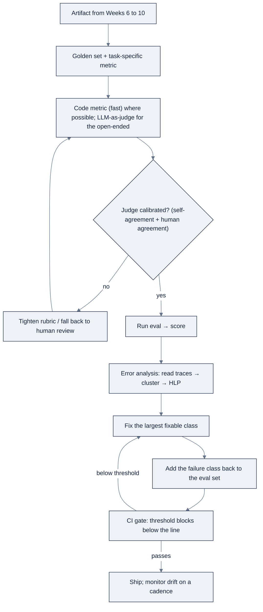

# Week 11: AI SystemのためのEvalとError Analysis

> **日本語版** · [英語版](README.md) · [演習](exercises.ja.md) · [クイズ](quiz.ja.md)
> AI Engineering Labの一部 · Week 11 of 24 · Section: Model Engineering · Category: Evaluation
> · Notebooks: [01-zoroeval-harness.ipynb](notebooks/01-zoroeval-harness.ipynb) · [02-error-analysis-workshop.ipynb](notebooks/02-error-analysis-workshop.ipynb)

## 問題

ZoroLogisticsはWeek 6〜10でartifactをshipしてきました。RAG answerer、ticket triager、bill-of-lading extractor、quantize済みmodel、fine-tune済みadapter。どれもdemoでは正しく見えました。しかし、従来のsoftwareは二値の正しさの概念を持ちます。testがpassするかしないか。一方、AI systemは **behaviorの分布** を持ちます。promptすれば、何が返ってくるか分かりません。この一つの事実が連鎖します。採点するdatasetがなければ、「良く見える」が唯一のevidenceで、vibesでshipするteamは静かにregressし、顧客から知らされます。thresholdがなければ、「green checkmark」は無意味です。そしてtraceがなければ、何かが壊れたとき、*どのstepが* 間違った答えを生んだのかを見られず、直すのではなく当てることになります。

今週は、予測できないoutputをshipできるものに変えるdisciplineをbuildします。**golden set**（実例から引いたlabeled input）、artifactごとのtask固有の **metric**、open-endedな答えのためのcalibrated rubricを持つ **LLM-as-judge**、そしてfailureをclusterし、最大のclassから直す **error-analysis loop** です。内面化すべきNgの主張は率直です。disciplineのあるevals + error-analysis processこそが、*teamがAI systemをどれだけ速く進められるかの単一最大の予測因子* です。virtueではなくvelocityについての主張です。Failureを測れるteamは速くshipできます。すべての変更が、数値を動かすか動かさないかのどちらかだからです。

## 目標

- [ ] 金曜日までに、三つのtask archetype、BoL field extraction、RAG groundedness、ticket triageのgolden setを、taskごとに正しいmetricとともに定義できる。
- [ ] 金曜日までに、anchoredな1〜5 rubricとper-field accuracy metricを備えた、再利用可能な `ZoroEval` classでLLM-as-judgeを実装できる。
- [ ] 金曜日までに、倍加sampleでjudge agreementを測り、human labelに対してrubricをcalibrateできる。
- [ ] 金曜日までに、error-analysis loop（traceを読む → cluster → 優先順位 → fix → evalに追加）を実行し、CI gateを、threshold未満でfailするcallable functionとして書ける。

## 日ごとの計画

| Day | Study | Run | Ship | Time |
|---|---|---|---|---|
| **Mon** | Eval設計、golden set、task固有metric（[reference/knowledge-base/07-evals-error-analysis.md](../../reference/knowledge-base/07-evals-error-analysis.md) + Ngのletters） | 三つのgolden setのmetric選択を書く | Taskごとのmetric表 | 2時間 |
| **Tue** | LLM-as-judge、rubric、judge bias/calibration | Groundedness rubric + `ZoroEval` classを実装する | `ZoroEval` + rubric | 2時間 |
| **Wed** | Judgeの信頼性。code vs model metric | Self-agreement + human labelに対するcalibrationを測る | Agreement数値 | 2時間 |
| **Thu** | Trace、HLP、error clustering | 50-traceのrun logをclusterし、top fixを選ぶ | Top-fix + HLP表 | 2時間 |
| **Fri** | CIでのeval。regression suite。drift monitoring | `ci_gate` を接続し、悪いartifactをblockする | ZoroEval v1 + gate script | 2時間 |

## 概念

[reference/knowledge-base/07-evals-error-analysis.md](../../reference/knowledge-base/07-evals-error-analysis.md) を全部読んでください。今週のspecであり、program全体のspineです。持つべき一つのidea: **AI outputはbooleanではなくdistribution**。あとはすべてここから派生します。Qualityがdistributionなら、採点するための **dataset** が必要です。**release gateは数値上のthreshold** であって、green checkmarkではありません。そして「良く見える」はevidenceではありません。AI systemについての正直な記述は統計的なものです。*この種類のquestionに、これくらいの頻度で正しく答える。そしてそれを裏付けるsampleがここにある。*

### Golden setとtask固有metric

**Golden set** は、inputとその正しいoutput、または許容output基準をpairにした、labeled collectionです。良いものは *実物または現実的な* inputから引かれ（でっち上げたcaseは問題ではなくあなたの信念をencodeします）、long tailをカバーし、codeと同じように **version管理されreviewされ**、tuningに使うものから **分離されています**。分離しなければ、数値はmemorizationを測ります。Sizeのrule: **最低三十のlabeled case、信頼のためには五十**。そしてerror analysisが新しいfailure classを見つけるたびに成長します。

Metricはtaskに合わせなければなりません。間違ったmetricの再利用は、teamが壊れたsystemを問題ないと納得してしまう経路です。

| Task shape | Metric family | ZoroLogisticsでの例 |
|---|---|---|
| Classification / extraction、単一の正解 | Accuracy、F1、exact-match | 「fieldはgold値と等しかったか？」 |
| Retrieval | Recall@k、precision@k、MRR | 「正しいdocumentはtop 5に入っていたか？」 |
| Generation、正しいが可変 | Rubric付きLLM-as-judge | 「答えはgroundedで完全か？」 |
| Structured output | Schema conformance + field-level match | 「ValidなJSONで、各fieldは正しいか？」 |

異なる二種類の数値がどちらも「evals」と呼ばれ、混同が典型的なmistakeです。

| | **Code metric** | **Model metric** |
|---|---|---|
| 測るもの | Deterministicなplumbing | 確率的なmodel output |
| 例 | JSONはparseされたか？ Latency < 2s？ | Categoryは正しかったか？ Claimはgroundedか？ |
| 性質 | 二値、速い、安い | 統計的、遅い、judgeかgolden setが必要 |
| 実行 | すべてのcommit（CI） | 定期的 / release時 |

Ngのguidance: **可能ならdeterministicなcode metricを使い**、judgeは本物にopen-endedな次元のために取っておく。Failureがregexやschema checkでcatchできるなら、judgeをそれに費やさないでください。

### LLM-as-judge、rubric、calibration

答えが多くの言い方で表せるとき、この要約は忠実か？ このresponseは丁寧か？ string matchingはfailするので、**rubric** に対して採点する（通常より強い）**LLM-as-judge** を使います。Rubricはtask固有で、**anchored**（各levelが形容詞ではなく具体的なfailureを名指す）で、**dimension-separated**（groundednessはhelpfulnessではない）でなければなりません。

**実例1: agreement数値付きのgroundedness rubric。** harnessは、notebook cell 12のrubricを使って、RAG answerを *groundednessのみ* で採点します。

```text
5, every factual claim is supported by the retrieved passage, and it cites it.
3, core answer supported, but it includes a claim (a number, date, detail)
    not present in the passage.
1, states a fact that contradicts the passage, or invents a rate/date/term.
```

Judge自身もmodelなので、noiseとbiasを持ちます。それを信頼するかどうかをgateする二つの数値があります。第一に、**倍加sampleでのself-agreement**: 同じ10のQ/A pairを二度採点し、完全一致を数えます。Judgeが10 pair中の9 pairで同じscoreを返せば、agreementは **0.90** で、rubricは信頼できるほど安定です。~0.60では、rubricは行動に移すには曖昧すぎます。第二に、**human labelに対するcalibration**: 自分のgradeをhold outし（notebook cell 21の `HUMAN_LABELS = [5,5,5,3,5,3,5,3,3,5]`）、judgeが±1以内に収まる頻度を数えます。Judgeが `[5,5,5,4,5,3,5,3,3,5]` を返し、すべてのhuman labelの±1以内 → calibration **1.00**。しかし *groundedな* 答え（human 5）を **1** と採点していたら（hallucinationだと主張して）、それはそのdimensionのsystematicなmissで、judgeを信じるのではなく、groundednessはhuman reviewにfallbackするでしょう。**Calibrateしていないjudgeは、truthの源ではなく、二つ目の未検証modelです。** 既知のjudge bias、position bias、verbosity/self-preference bias、driftは、順序のshuffle、pairwise comparisonの選好、model更新後の再calibrationで飼い慣らします。

### Trace、span、HLP

Agentic systemはstepの連続なので、debuggingの単位は **trace**、一つのinputに対してsystemが何をしたかの完全な記録です。中身は **span**（一つのmodel call、一つのtool呼び出し、一つのretrieval query。それぞれがinput/output/latency/costを持つ）でできています。Traceがあるからerror analysisが *可能に* なります。KBのworked traceは、support質問に「portalで追跡できます」と答えた例を示します。*正しい* 読みは、shipment lookup toolが一度も呼ばれず、retrievalがgenericなFAQを返したということで、workflowのfixです。spanがあるから見えるものです。**Human-level parity（HLP）** はlocalizationのheuristicです。failした各stepについて問うのは、*同じ情報を与えられた有能な人間なら、これを正しくやれただろうか？* Yesなら、systemは人間に劣る → **fixable**。人間もfailするなら、情報がそもそもなかった → **upstream**（modelではなくdata/intakeを直す）。

### Error-analysis loopとCIでのeval

Evalは *score* を与え、error analysisは *どのclusterを直すか* を教えます。Loop: **traceを読む → failureをclusterする → 頻度で優先順位を付ける → fixする → そのfailureをeval setに加え戻す**。そうすれば、そのclassは二度と静かにregressできません。

**実例2: clusteringとCI gate。** Workshop notebookは、Week 6〜10のartifactにわたる50 trace（16 correct、34 wrong）のdeterministicなseed-42 run logを生成します。34のwrong rowを `error_type` でclusterすると、`field_date_format`（8）、`hallucinated_rate`（8）、`retrieval_wrong_doc`（7）、`wrong_category`（7）、`low_confidence`（4）、そして `schema_invalid_json`（0）になります。HLPは、存在するすべてのclassを **fixable** とmarkします。ただし `schema_invalid_json` は別で、それは **upstream** です（人間にもschema contractが必要です）。Topのfixable class、つまりMM/DD vs DD/MMが静かに意味を変えてしまう `field_date_format` は、wrong traceの **8 / 34 ≈ 24%** をカバーし、だから今週まず値打ちのある一つの変更です。続いて `ci_gate(score, threshold)` が数値を権威に変えます。score `{triage 0.93, extraction 0.88, groundedness 0.95}` をthreshold `{0.90, 0.90, 0.95}` に対して判定すると、extraction行は **FAILs** し（0.88 < 0.90）、releaseは **block** されます。noと言えるgateこそ、人が信頼するgateです。一度だけ実行されるevalは珍品であり、すべての変更で実行されるeval（CIでのcode metric、release時のmodel metric）は **gate** です。



### うまくいかない理由

Evalはvibesでのshipを *防ぎ*、作り方を誤れば次のfailureを *起こします*。

- **でっち上げのgolden set。** 想像したcaseはあなたの前提をencodeします。実の顧客ticket一枚が、でっち上げ十枚に値します。
- **混ぜた「quality」score。** Groundedness + helpfulness + toneの平均は、*どの* 次元がregressしたかを隠します。次元は別々に採点し、重要なものでgateする。
- **Uncalibratedなjudge。** Human labelと照合されたことのないjudgeを信じるのは、二つ目の未検証modelを信じることです。
- **End-to-endのみの測定。** Retrievalを別々に採点しなければ、壊れている層がgenerationではなくretrievalだと見えません。
- **誰もblockしないthreshold。** Ship/no-ship lineのない数値は、誰も信じない数値です。
- **Traceへのpathなし。** Spanがなければ *どのstepが* failしたかを再構成できず、error analysisは当てずっぽうになります。
- **静的なeval set。** Toolを追加すればagentのfailure modeは変わります。Eval setはsystemとともに成長しなければならず、その編集はcleanupではなく一級のengineeringです。

## Notebook walkthrough

二つのnotebookが今週を担います。**[`notebooks/01-zoroeval-harness.ipynb`](notebooks/01-zoroeval-harness.ipynb)** がZoroEvalをbuildします。Cell 4は `OPENAI_API_KEY` を読み（未設定ならgracefulにskipし）、judgeとして `gpt-4o-mini` を選びます。Cells 6〜10が三つの **golden set** を定義します。`data.bol_samples()` からの20 BoLs（field-level exact matchで採点）、`data.policy_docs()` 上の10 RAG Q/A pair（groundednessで採点）、そして `data.support_tickets()` からの30 ticket（accuracyで採点）です。Cell 12はanchoredなgroundedness rubric（5/3/1）。cell 14は三つの責務を持つ `ZoroEval` class、code metric（`extraction_field_accuracy`、`triage_accuracy`）、`judge_groundedness` method、そして `runs` logです。Cell 16は、metricが良し悪しを区別できることを証明します（perfect vs 20%-noise label、perfect vs corrupt済みweight）。Cell 18は倍加sampleで **judge self-agreement** を測ります。cell 21〜22は `HUMAN_LABELS` に対して **calibrate** し、cell 24はjudge passを全実行します。Cell 26は最終値、`JUDGE_AGREEMENT`、`CALIBRATION_AGREEMENT`、そして `TRIAGE_ACC_NOISY`（常に実行されるcode metric）をprintします。健全なharnessは、inputをcorruptすればcode metricが下がることと、倍加sampleでもhuman labelでもjudge agreementが ≥ ~0.8 であることを示します。

**[`notebooks/02-error-analysis-workshop.ipynb`](notebooks/02-error-analysis-workshop.ipynb)** がloopを回します。Cell 4はdeterministicな50-trace run logを生成します。cell 6は *手で読むために* 良いtraceと悪いtraceをprintします。cell 8は `error_type` でfailureをclusterします。cell 10はHLP map（fixable vs upstream）を適用します。cell 13はtopのfixable classとそのcoverageを選びます。cell 15は `ci_gate(score, threshold)` を、PASS/FAILをprintしてbooleanを返すcallableとして定義します。cell 17はそれをsimulated releaseに適用し、extraction score（0.88）が0.90のbarにfailしてshipをblockします。Cell 19は `TOP_FIX_COVERAGE`（seed-42 runで≈0.235）と `GATE_PASS_RATE`（2/3）をprintします。Takeawayのcellが、discipline全体を一行にします。*五十caseを手で読み、分類し、数え、最大classを直し、eval setに加える。* 二つのnotebookは、後の週がimportして拡張するartifactを一緒に形成します。harnessがgolden setとjudgeを持ち、workshopがfix-and-ratchet loopを駆動し、gate scriptが、release時に両者を権威あるものにするthresholdです。

## Use case（Friday）

**Deliverable:** **ZoroEval v1**。再利用可能なharnessと、あるZoroLogistics artifactがthresholdを下回ったらblockするCI風gate script。三つのgolden set（extraction、RAG、triage）、calibrated judge、agreement測定、そしてdocument化されたerror-analysis pass（top failure cluster + あなたが適用したfix）を同梱します。

**Acceptance gate（Zorost式）:** 見知らぬ人が、あなたのWeek 6〜10のartifactの一つにZoroEvalを実行して、数値とpass/failが返るのを見られ、*harnessが何をしたか* をあなたが見せられること。どのgolden setか、どのrubric levelが発火したか、judgeが自分自身とあなたにどれだけ同意したか、gateがどのfailure clusterをcatchする設計か。Thresholdのないharnessや、誰もcalibrateしていないjudgeは、それ自体でgateにfailします。

**Stretch variant:** gateを実際のscript（`python -m zoroeval.gate`）にします。Eval scoreのJSONを読み、thresholdを適用し、pass/fail表をprintし、threshold未満なら非零でexitする。そして (a) 良いartifactをpassさせる様子と (b) わざと壊したartifactをblockする様子をdemoします。

## よくあるpitfall

| Pitfall | Fix |
|---|---|
| でっち上げのgolden set | 実trafficからcaseを引く。実ticket一枚が想像十枚に勝る |
| 混ぜた「quality」score | 次元は別々に採点する。最も重要なものでgateする |
| Uncalibrated judge | Human labelをhold outする。agreementが高い所だけjudgeを信じる |
| End-to-end採点のみ | Retrieval、generation、tool useを別々に測る |
| Thresholdのないmetric | 数値 *と* ship/no-ship lineを名指す |
| Trace/spanなし | Step種別、input/output、latency、cost、IDsをspanごとにlogする |
| 一番面白いclassを直す | *最大の* classから直す。賢さではなく頻度 |
| 成長しないeval set | 直したfailure classを加え戻し、regressできないようにする |

## Glossary

- **Eval**: あなたが本当に気にかけるfailure modeを、labeled set上で測る数値。
- **Golden set**: 正しいoutputとpairになったlabeled inputの、version管理されたcollection。Evalのdataset。
- **LLM-as-judge**: （通常より強い）modelに、rubricに対してopen-endedなoutputを採点させること。
- **Rubric**: 一つのdimensionについて、各score levelが何を意味するかの明示的でanchoredな定義。
- **Calibration**: Scoreを信じる前に、judgeをhuman labelと照合すること。
- **Self-agreement**: 倍加sampleでjudgeが同じscoreを返す頻度。安定性check。
- **Trace / span**: 一回のrunの完全な記録と、その中の一つのstep。
- **HLP (human-level parity)**: 「有能な人間ならこのstepを正しくやれただろうか？」というlocalization heuristic。
- **Error clustering**: Failureをclassにgroupingし、支配的なものを見つけること。
- **CI gate**: 越えたときにmergeやreleaseをblockする、eval上のthreshold。
- **Drift monitoring**: 静かなregressionをcatchするため、sampleしたlive trafficを定期的に採点すること。

## Self-check（quiz）

[quiz.md](quiz.md) を受けてください。10問、合格は **8/10**。scoreをtracker Notesに記録します。

## Exercises

四つのgraded exerciseは [exercises.md](exercises.md) にあります。**Easy**（harnessを実行し、agreementを記録）、**Standard**（第四のgolden setを追加）、**Stretch**（本物の `zoroeval.gate` script）、**Portfolio**（ZoroEval v1をeval harness + CI gate milestoneとしてcommit）。hintは同じfileにあります。

## Sources

- Andrew Ng, *Improve Agentic Performance with Evals and Error Analysis, Part 1 & 2*: https://www.deeplearning.ai/the-batch/improve-agentic-performance-with-evals-and-error-analysis-part-1 · https://www.deeplearning.ai/the-batch/improve-agentic-performance-with-evals-and-error-analysis-part-2
- Andrew Ng, *The AI Engineering Skills Map*, The Batch issue 366: https://www.deeplearning.ai/the-batch/issue-366
- Fereydun Hashemi (Zorost), *The AI Engineering Skills Map, turned into a training plan*: https://zorost.com/ai-engineering-skills-map-training-guide
- Hamel Husain, *Your AI Product Needs Evals*: https://hamel.dev/blog/posts/evals/
- DeepLearning.AI, *Evaluating and Debugging Generative AI*: https://learn.deeplearning.ai/courses/evaluating-debugging-generative-ai/
- DeepLearning.AI, *Building and Evaluating Advanced RAG*: https://www.deeplearning.ai/courses/building-evaluating-advanced-rag
- MLflow (track evals alongside models): https://mlflow.org/docs/latest/index.html
