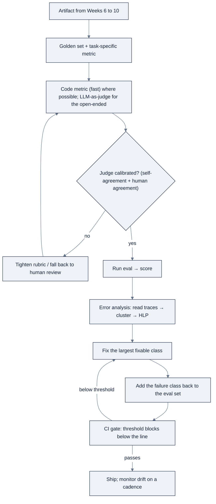

# Week 11: Evals & Error Analysis for AI Systems

> Part of AI Engineering Lab · Week 11 of 24 · Section: Model Engineering · Category: Evaluation
> 🎯 Use case: Build ZoroEval, the reusable eval harness that gates every ZoroLogistics AI artifact.

## The problem

ZoroLogistics has shipped artifacts in Weeks 6 to 10: a RAG answerer, a ticket triager,
a bill-of-lading extractor, a quantized model, a fine-tuned adapter. Each one looked
right in a demo. But conventional software has a binary correctness notion, the test
passes or it does not, while an AI system has a **distribution of behaviors**: prompt
it and you do not know what you will get back. That single fact cascades. Without a
dataset to grade against, "it looks better" is the only evidence, and a team that
ships on vibes regresses silently and finds out from a customer. Without a threshold,
a "green checkmark" is meaningless. And without traces, when something breaks you
cannot see *which step* produced the wrong answer, so you are guessing, not fixing.

This week builds the discipline that turns unpredictable output into something you
can ship: **golden sets** (labelled inputs drawn from real cases), a task-specific
**metric** per artifact, an **LLM-as-judge** with a calibrated rubric for open-ended
answers, and an **error-analysis loop** that clusters failures and fixes the biggest
class first. Ng's claim to internalize is blunt: a disciplined evals + error-analysis
process is *the single biggest predictor of how fast a team makes progress on an AI
system*, a claim about velocity, not virtue. Teams that can measure failure ship
faster, because every change either moves a number or it does not.

## Objectives

- [ ] By Friday you can define golden sets for three task archetypes, BoL field extraction, RAG groundedness, and ticket triage, with the right metric per task.
- [ ] By Friday you can implement an LLM-as-judge with an anchored 1 to 5 rubric and per-field accuracy metrics in a reusable `ZoroEval` class.
- [ ] By Friday you can measure judge agreement on a doubled sample and calibrate the rubric against human labels.
- [ ] By Friday you can run the error-analysis loop (read traces → cluster → prioritize → fix → add to eval) and write the CI gate as a callable function that fails below a threshold.

## Day-by-day plan

| Day | Study | Run | Ship | Time |
|---|---|---|---|---|
| **Mon** | Eval design, golden sets, task-specific metrics ([reference/knowledge-base/07-evals-error-analysis.md](../../reference/knowledge-base/07-evals-error-analysis.md) + Ng's letters) | Write the three golden sets' metric choices | Metric-per-task table | 2 h |
| **Tue** | LLM-as-judge, rubrics, judge bias/calibration | Implement the groundedness rubric + `ZoroEval` class | `ZoroEval` + rubric | 2 h |
| **Wed** | Judge reliability; code vs model metrics | Measure self-agreement + calibration vs human labels | Agreement numbers | 2 h |
| **Thu** | Traces, HLP, error clustering | Cluster the 50-trace run log; pick the top fix | Top-fix + HLP table | 2 h |
| **Fri** | Evals in CI; regression suites; drift monitoring | Wire `ci_gate`; block a bad artifact | ZoroEval v1 + gate script | 2 h |

## Concepts

Read
[reference/knowledge-base/07-evals-error-analysis.md](../../reference/knowledge-base/07-evals-error-analysis.md)
in full, it is this week's spec and the spine of the entire program. The one idea
to hold: **an AI output is a distribution, not a boolean**, and everything else
follows. If quality is a distribution you need a **dataset** to grade against; a
**release gate is a threshold on a number**, not a green checkmark; and "it looks
better" is not evidence. The honest statement about an AI system is statistical: *it
answers this class of question correctly about this often, and here is the sample
that establishes it.*

### Golden sets and task-specific metrics

A **golden set** is a labelled collection of inputs paired with their correct outputs
or acceptable-output criteria. Good ones are drawn from *real or realistic* inputs
(invented cases encode your beliefs, not the problem), cover the long tail, are
**versioned and reviewed** like code, and are **split from anything used for tuning**
else the number measures memorization. The size rule: **thirty labelled cases
minimum, fifty to be credible**, and it grows every time error analysis finds a new
failure class.

The metric must fit the task, reusing the wrong metric is how teams convince
themselves a broken system is fine:

| Task shape | Metric family | ZoroLogistics example |
|---|---|---|
| Classification / extraction, single right answer | Accuracy, F1, exact-match | "Did the field equal the gold value?" |
| Retrieval | Recall@k, precision@k, MRR | "Was the right document in the top 5?" |
| Generation, correct-but-variable | LLM-as-judge with a rubric | "Is the answer grounded and complete?" |
| Structured output | Schema conformance + field-level match | "Valid JSON, and each field right?" |

Two different kinds of number are both called "evals," and confusing them is a
classic mistake:

| | **Code metrics** | **Model metrics** |
|---|---|---|
| Measures | Deterministic plumbing | Probabilistic model output |
| Example | Did the JSON parse? Latency < 2s? | Was the category correct? Is the claim grounded? |
| Character | Binary, fast, cheap | Statistical, slower, needs a judge or golden set |
| Runs | Every commit (CI) | On schedule / at release |

Ng's guidance: use **deterministic code metrics when possible**, and reserve the
judge for the genuinely open-ended dimensions. If a failure can be caught by a regex
or a schema check, do not spend a judge on it.

### LLM-as-judge, rubrics, and calibration

When the answer can be phrased many ways, is this summary faithful? is this response
polite? string matching fails, so you use a (usually stronger) **LLM-as-judge**
graded against a **rubric**. A rubric must be task-specific, **anchored** (each level
names a concrete failure, not an adjective), and **dimension-separated** (groundedness
is not helpfulness).

**Worked example 1: a groundedness rubric with agreement numbers.** The harness
scores RAG answers on *groundedness only*, using the rubric from notebook cell 12:

```text
5, every factual claim is supported by the retrieved passage, and it cites it.
3, core answer supported, but it includes a claim (a number, date, detail)
    not present in the passage.
1, states a fact that contradicts the passage, or invents a rate/date/term.
```

The judge is itself a model, so it has noise and bias. Two numbers gate whether you
trust it. First, **self-agreement on a doubled sample**: grade the same 10 Q/A pairs
twice and count exact agreement. If the judge returns the same score on 9 of 10 pairs,
agreement is **0.90**, the rubric is stable enough to trust; at ~0.60 the rubric is
too vague to act on. Second, **calibration against human labels**: hold out your own
grades (notebook cell 21's `HUMAN_LABELS = [5,5,5,3,5,3,5,3,3,5]`) and count how often
the judge lands within ±1. Suppose the judge returns `[5,5,5,4,5,3,5,3,3,5]`, within
±1 of every human label → calibration **1.00**. But if it had scored a *grounded*
answer (human 5) as **1** (claiming hallucination), that is a systematic miss on the
dimension, and you would fall back to human review for groundedness rather than trust
the judge. **A judge you have not calibrated is a second unverified model, not a
source of truth.** Known judge biases, position bias, verbosity/self-preference
bias, and drift, are tamed by shuffling order, preferring pairwise comparison, and
re-calibrating after any model update.

### Traces, spans, and HLP

An agentic system is a sequence of steps, so the debugging unit is the **trace**, the
full record of what the system did on one input, made of **spans** (one model call,
one tool invocation, one retrieval query, each with inputs/outputs/latency/cost).
Traces make error analysis *possible*: the KB's worked trace shows a support question
answered with "track it on the portal" where the *right* read is that the shipment
lookup tool was never called and retrieval returned a generic FAQ, a workflow fix,
visible only because the spans are there. **Human-level parity (HLP)** is the
localization heuristic: for each failing step ask *would a competent human, given the
same information, have gotten this right?* If yes, the system underperforms a human →
**fixable**. If a human would also fail, the information was never there → **upstream**
(fix the data/intake, not the model).

### The error-analysis loop, and evals in CI

An eval gives you a *score*; error analysis tells you *which cluster to fix*. The loop:
**read traces → cluster failures → prioritize by frequency → fix → add the failure
back to the eval set**, so that class can never silently regress.

**Worked example 2: clustering and the CI gate.** The workshop notebook generates a
deterministic seed-42 run log of 50 traces (16 correct, 34 wrong) across the Week
6 to 10 artifacts. Clustering the 34 wrong rows by `error_type` gives `field_date_format`
(8), `hallucinated_rate` (8), `retrieval_wrong_doc` (7), `wrong_category` (7),
`low_confidence` (4), and `schema_invalid_json` (0). HLP marks every present class
**fixable** except `schema_invalid_json`, which would be **upstream** (even a human
needs a schema contract). The top fixable class, `field_date_format`, where MM/DD vs
DD/MM silently changes meaning, covers **8 / 34 ≈ 24%** of wrong traces, so it is the
one change worth making this week. Then `ci_gate(score, threshold)` turns the number
into authority: with scores `{triage 0.93, extraction 0.88, groundedness 0.95}` against
thresholds `{0.90, 0.90, 0.95}`, the extraction row **FAILs** (0.88 < 0.90) and the
release is **blocked**, a gate that is willing to say no is a gate people trust. An
eval that runs once is a curiosity; an eval that runs on every change (code metrics in
CI, model metrics at release) is a **gate**.



### How it breaks

Evals *prevent* shipping-on-vibes, and *cause* these failures if built wrong:

- **Invented golden sets.** Imagined cases encode your assumptions; one real customer
  ticket is worth ten invented ones.
- **A blended "quality" score.** Averaging groundedness + helpfulness + tone hides
  *which* dimension regressed; score dimensions separately, gate on the one that matters.
- **An uncalibrated judge.** Trusting a judge never checked against human labels is
  trusting a second unverified model.
- **Measuring end-to-end only.** If you never score retrieval separately, you cannot
  see that retrieval, not generation, is the broken layer.
- **A threshold nobody will block on.** A number with no ship/no-ship line is a number
  nobody trusts.
- **No path to the traces.** Without spans you cannot reconstruct *which step* failed;
  error analysis becomes guessing.
- **A static eval set.** An agent's failure modes change as you add tools, so the eval
  set must grow with the system, editing it is first-class engineering, not cleanup.

## Notebook walkthrough

Two notebooks carry the week. **[`notebooks/01-zoroeval-harness.ipynb`](notebooks/01-zoroeval-harness.ipynb)**
builds ZoroEval. Cell 4 reads `OPENAI_API_KEY` (graceful skip if unset) and picks
`gpt-4o-mini` as the judge. Cells 6 to 10 define the three **golden sets**: 20 BoLs from
`data.bol_samples()` (graded by field-level exact match), 10 RAG Q/A pairs over
`data.policy_docs()` (graded by groundedness), and 30 tickets from
`data.support_tickets()` (graded by accuracy). Cell 12 is the anchored groundedness
rubric (5/3/1); cell 14 is the `ZoroEval` class with three responsibilities, code
metrics (`extraction_field_accuracy`, `triage_accuracy`), the `judge_groundedness`
method, and a `runs` log. Cell 16 proves the metrics can tell good from bad (perfect
vs 20%-noise labels, perfect vs corrupted weights). Cell 18 measures **judge
self-agreement** on a doubled sample; cell 21 to 22 **calibrates** against `HUMAN_LABELS`;
cell 24 runs a full judge pass. Cell 26 prints the finals, `JUDGE_AGREEMENT`,
`CALIBRATION_AGREEMENT`, and `TRIAGE_ACC_NOISY` (the code metric that always runs). A
healthy harness shows code metrics that drop when you corrupt the input, plus judge
agreement ≥ ~0.8 on both the doubled sample and human labels.

**[`notebooks/02-error-analysis-workshop.ipynb`](notebooks/02-error-analysis-workshop.ipynb)**
runs the loop. Cell 4 generates the deterministic 50-trace run log; cell 6 prints good
and bad traces to *read by hand*; cell 8 clusters failures by `error_type`; cell 10
applies the HLP map (fixable vs upstream); cell 13 picks the top fixable class and its
coverage; cell 15 defines `ci_gate(score, threshold)` as a callable that prints
PASS/FAIL and returns a boolean; cell 17 applies it to a simulated release where the
extraction score (0.88) fails its 0.90 bar and blocks the ship. Cell 19 prints
`TOP_FIX_COVERAGE` (≈0.235 for the seed-42 run) and `GATE_PASS_RATE` (2/3). The
takeaway cell is the whole discipline in one line: *fifty cases, read by hand,
categorized, counted, largest class fixed, added to the eval set.* Together the two
notebooks form the artifact later weeks import and extend: the harness holds the
golden sets and the judge, the workshop drives the fix-and-ratchet loop, and the gate
script is the threshold that makes both of them authoritative at release time.

## The use case (Friday)

**Deliverable:** **ZoroEval v1**, a reusable harness plus a CI-style gate script that
blocks one ZoroLogistics artifact when it drops below threshold. It ships with the
three golden sets (extraction, RAG, triage), the calibrated judge, the agreement
measurement, and the documented error-analysis pass (top failure cluster + the fix you
applied).

**Acceptance gate (Zorost-style):** a stranger can run ZoroEval against one of your
Weeks 6 to 10 artifacts and watch it return a number and a pass/fail, and you can show
them *what the harness did*: which golden set, which rubric level fired, how often the
judge agreed with itself and with you, and which failure cluster the gate is designed
to catch. A harness with no threshold, or a judge nobody calibrated, fails the gate on
itself.

**Stretch variant:** turn the gate into a real script (`python -m zoroeval.gate`) that
reads a JSON of eval scores, applies thresholds, prints a pass/fail table, and exits
non-zero below threshold, then demonstrate it (a) passing a good artifact and (b)
blocking a deliberately broken one.

## Common pitfalls

| Pitfall | Fix |
|---|---|
| Invented golden set | Draw cases from real traffic; one real ticket beats ten imagined ones |
| Blended "quality" score | Score dimensions separately; gate on the one that matters most |
| Uncalibrated judge | Hold out human labels; trust the judge only where agreement is high |
| End-to-end scoring only | Measure retrieval, generation, and tool use separately |
| Metric with no threshold | Name the number *and* the ship/no-ship line |
| No traces/spans | Log step type, inputs/outputs, latency, cost, and IDs per span |
| Fixing the most interesting class | Fix the *largest* class first, frequency, not cleverness |
| Eval set that never grows | Add each fixed failure class back so it cannot regress |

## Glossary

- **Eval**: a number that measures the failure modes you actually care about, on a labelled set.
- **Golden set**: a versioned collection of labelled inputs paired with correct outputs; the eval's dataset.
- **LLM-as-judge**: using a (usually stronger) model to grade open-ended output against a rubric.
- **Rubric**: an explicit, anchored definition of what each score level means for one dimension.
- **Calibration**: checking a judge against human labels before trusting its scores.
- **Self-agreement**: how often a judge gives the same score on a doubled sample; a stability check.
- **Trace / span**: the full record of one run (trace) and one step inside it (span).
- **HLP (human-level parity)**: "would a competent human have gotten this step right?", a localization heuristic.
- **Error clustering**: grouping failures into classes to find the dominant one.
- **CI gate**: a threshold on an eval that, when crossed, blocks a merge or release.
- **Drift monitoring**: grading sampled live traffic on a cadence to catch silent regressions.

## Self-check (quiz)

Take [quiz.md](quiz.md), 10 questions, pass with **8/10**. Record the score in your
tracker Notes.

## Exercises

The four graded exercises live in [exercises.md](exercises.md): **Easy** (run the
harness, record agreement), **Standard** (add a fourth golden set), **Stretch** (a real
`zoroeval.gate` script), **Portfolio** (commit ZoroEval v1 as the eval-harness + CI-gate
milestone). Hints are in the same file.

## Sources

- Andrew Ng, *Improve Agentic Performance with Evals and Error Analysis, Part 1 & 2*: https://www.deeplearning.ai/the-batch/improve-agentic-performance-with-evals-and-error-analysis-part-1 · https://www.deeplearning.ai/the-batch/improve-agentic-performance-with-evals-and-error-analysis-part-2
- Andrew Ng, *The AI Engineering Skills Map*, The Batch issue 366: https://www.deeplearning.ai/the-batch/issue-366
- Fereydun Hashemi (Zorost), *The AI Engineering Skills Map, turned into a training plan*: https://zorost.com/ai-engineering-skills-map-training-guide
- Hamel Husain, *Your AI Product Needs Evals*: https://hamel.dev/blog/posts/evals/
- DeepLearning.AI, *Evaluating and Debugging Generative AI*: https://learn.deeplearning.ai/courses/evaluating-debugging-generative-ai/
- DeepLearning.AI, *Building and Evaluating Advanced RAG*: https://www.deeplearning.ai/courses/building-evaluating-advanced-rag
- MLflow (track evals alongside models): https://mlflow.org/docs/latest/index.html
