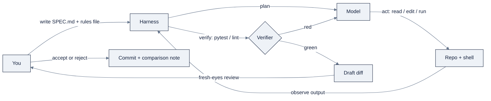

# Week 12: Coding-Agent Harnesses — Claude Code、Cursor、OpenCode、DSH

> **日本語版** · [英語版](README.md) · [演習](exercises.ja.md) · [クイズ](quiz.ja.md)
> AI Engineering Labの一部 · Week 12 of 24 · Section: Harnesses & Loops · Category: Harnesses
> · Notebooks: [01-harness-setup-and-comparison.ipynb](notebooks/01-harness-setup-and-comparison.ipynb)

## 問題

ZoroLogisticsのoperations analystが、shipment idを一つと、一つのquestionを抱えています。「これは実際にいつ到着して、どれだけ遅れたのか？」今日この答えを得るには、notebookを開き、`zoro` をimportし、Week 1のgeneratorが作った `data/shipments.csv` に触る必要があります。あなたにはそれでよくても、warehouseの現場にいるanalystには役に立ちません。今週の仕事は、これを一つのコマンドで動くtool、`eta-cli S0000001` に変えることです。このtoolはrowをprintしてexit `0` するか、idが見つからないときは明確な `stderr` messageとともにexit `2` します。

ねじれはここにあります。その大部分を自分で書くのではありません。あなたは **spec** を書き、coding-agent harnessに渡し、testがgreenになるまでagentをsteerします。このskillがないと、あなたがbottleneckになります。agentを遊ばせたまま、すべてのfunctionを手で打ち込むことになるからです。やり方を誤ると、agentは *自信満々で未検証の* ものを作ります。存在しないshipmentのETAをでっち上げ、誰かがその架空の数字で本物のtruckを走らせるまで、見事に見えます。before/afterは具体的です。beforeでは「shipment status」は同僚のために実行するnotebookです。afterでは、見知らぬ人がcloneして実行できる、test済みのCLIになります。あなたのspecどおりに、あなたが指揮したmachineがbuildしたものです。

## 目標

- [ ] 金曜日までに、少なくとも二つのharness（Claude Code + OpenCodeまたはDSH）をinstall・authenticateし、shellからのversion checkでそれぞれを確認できる。
- [ ] 金曜日までに、agentが実行できる `SPEC.md` を書ける。user、constraints、一つのrefused tradeoff、ETA CLIのための六項目のtest plan。
- [ ] 金曜日までに、CLIをbuildするようagentをdriveし、testを実行し、greenになるまでiterateし、その後同じtaskを二つ目のharnessで繰り返せる。
- [ ] 金曜日までに、notebookのcomparison worksheetに裏付けられた一ページのharness比較（plan、tokens、cost、quality）をshipできる。

## 日ごとの計画

| Day | Study | Run | Ship（その日までに） | Time |
|---|---|---|---|---|
| **Mon** | 四つのskill guideを読む。[`KB 09`](../../reference/knowledge-base/09-harnesses-tools.md) に目を通す | notebookのtool-check cell | 2つのharnessをinstall + authenticateし、version check | 約2時間 |
| **Tue** | `SPEC.md` の構造。refused-tradeoffの考え方 | templateを `specs/eta-cli-SPEC.md` にcopyし、すべてのbracketを埋める | 完全で、review済みのspec | 約1.5時間 |
| **Wed** | planningとexecutionの違い。verifier | harness AにCLIをbuildさせる。6項目のtest planを実行する | harness AでtestがgreenのCLI | 約2.5時間 |
| **Thu** | cost管理。OpenRouterのmodel routing | 同じspecをharness Bで再実行する。worksheetを埋める | 埋まったcomparison worksheet（plan/tokens/cost/quality） | 約2.5時間 |
| **Fri** | harness比較のwrite-up | 最終readiness cellを再実行する | `eta-cli` + 1ページの比較をcommit | 約1.5時間 |

## 概念

terminalを開く前にこのsectionを読んでください。Week 12の核心です。manifestのすべてのtopicを、出会う順に、比較を現実のものにする数字とともに扱います。

### Harnessとは何か

modelはagentではありません。modelはtokenを受け取り、tokenを返します。**harness** は、tokenを *work* に変える、modelとあなたのmachineの間のsoftwareです。四つのものを供給します（[`KB 09 §1`](../../reference/knowledge-base/09-harnesses-tools.md)）。

| Component | 何をするか | 今週なぜ重要か |
|---|---|---|
| **The loop** | Plan → act → observe → verify → 完了まで繰り返す | loopがなければagentは一つの答えの後で止まる |
| **Tools** | Shell、fileのread/edit/write、search、MCP server | toolsはmodelが `eta-cli` に触り `pytest` を実行する方法 |
| **Context management** | 毎turn何をwindowに入れるか、いつcompactするかを決める | focusしたbuildとcost爆発の違い |
| **Verifiers** | 「まだ壊れている、やり直せ」と言うtest、type check、linter | loopを閉じるsignal。下を参照 |

division of laborを暗記してください。**modelはreasoningを供給し、harnessはagencyを供給する。** 同じmodelを指した二つのharnessが違う結果を出すのはこのためです。四つのrowすべてで違うからです。harnessはmodelを賢くしません。modelに手と記憶とfeedback signalを与えるのです。

### Harness選びはfitの問題

「どのharnessが一番良いか？」は間違ったquestionです。正しいquestionは「どのsurfaceが、自分のteamがすでに働いているやり方に合うか？」です。今週触る四つです。

| Harness | Builder | Surface | Strengths | Cost model |
|---|---|---|---|---|
| **Claude Code** | Anthropic | Terminal CLI + headless `-p` | 仕上げられたdaily driver。`CLAUDE.md`、subagents、hooks、MCP、permission sandbox | Pro/Max subscriptionまたはpay-per-token API |
| **OpenCode** | SST | TUI + desktop/web/IDE | Terminal-native、model・provider agnostic。`AGENTS.md` + `opencode.json` | Free（MIT）。providerの料金を払う |
| **Cursor** | Anysphere | IDE（VS Code fork） | Tab + multi-file Agent。Rules。Cursor Router（Cost/Balance/Intelligence） | Free tier → Pro/Pro+/Ultra |
| **DSH** | DeepSeek | Web GUI + CLI + headless | Plugin-everything（Cordis）。skills、goals、subagents、workflows。append-only trace | Free（MIT）。model keyは自前 |

[`KB 09 §3`](../../reference/knowledge-base/09-harnesses-tools.md) からのdecision rule of thumb: terminal-nativeでscriptableなら **Claude Code** か **OpenCode**、編集中のcodeの隣にagentを住まわせるなら **Cursor**、完全なtraceを持つcomposableでinspectableなopen harnessなら **DSH**。四つとも最終的に同じもの、つまりあなたのmodel providerをcostとして払うので、決定はworkflowとcontrolの問題であって、価格ではありません。installする前に、[`reference/skills/claude-code.md`](../../reference/skills/claude-code.md)、[`reference/skills/cursor.md`](../../reference/skills/cursor.md)、[`reference/skills/opencode.md`](../../reference/skills/opencode.md)、[`reference/skills/deepseek-harness.md`](../../reference/skills/deepseek-harness.md) の詳細を読んでください。

### Rules files: 一番安いleverage

すべてのharnessはsession開始時に **project memory file** を読み込み、あなたのconventionsを再導出しないようにします。Claude Codeは `CLAUDE.md` を、OpenCodeは `AGENTS.md` を、Cursorは `.cursor/rules/*.mdc` を読みます。同じ仕事、違うfilename。良いrules fileは **compound** します。agentはあなたのbuild commandを当て推量しなくなり、すべてのteammateのagentが同じconventionsに従います。数行〜数十行で、commandとして書き、四つのsection — *このrepoが何か*、*commands*、*conventions*、そして *never-touch* list — で構成します（[`KB 09 §4`](../../reference/knowledge-base/09-harnesses-tools.md)）。

**never-touch** listは、単独で最も価値のある行です。**blast radius** を *前もって* encodeする場所だからです。`data/raw/`（出力ではなくgeneratorを編集する）、`secrets/`、`.env`、`*.key`。rules fileは「〜しないでと覚えていて」を、harnessが毎session強制するものに変えます。

### Managed context: 何を入れ、何を外に出すか

agentはあなたのrepoを「知っている」わけではありません。あなたが渡すsliceを知っています。**managed context** は、何をwindowに入れ、何を外に出すかを決めるdisciplineです（[`KB 09 §3`](../../reference/knowledge-base/09-harnesses-tools.md)）。spec、rules file、重要な少数のfileを渡し、残りは外に出します。

| 入れるもの | 入れないもの |
|---|---|
| `SPEC.md`、rules file、編集中の特定のsource file | promptに貼り付けた `data/` directory全体 |
| 失敗したtestの出力 | Secretsと `.env` の値 |
| 関連するfunctionとそのcall site | 「backgroundのために」という無関係なmodule |

これを具体化するrule: **長いcontextは理解ではなく、希釈である**、しかもcostでもある。全部を前もって貼るのではなく、pathを指し、残りはagent自身に開かせましょう。

### Planningとexecution

すべてのtaskを *plan*（spec: user、constraints、refused tradeoffs）と *execution*（編集）に分けます。まずplan-only modeでharnessを実行し、planを読み、それからexecutionをauthorizeします。二つを混ぜると、agentが頼んでもいない別のproductを黙ってbuildすることになります。

| | Planning | Execution |
|---|---|---|
| **答えるquestion** | 何が存在すべきで、何を交換してはならないか | それをどう存在させるか |
| **Artifact** | `SPEC.md`、完了の定義 | diff + greenなtest |
| **あなたが所有するもの** | specの一行一行 | 変更されたすべてのfileのreview |
| **Agentの仕事** | planを提案する。あなたが修正する | verifierがpassするまで編集、test、fix |

specは人間向けのdocumentではありません。**loopが照らし合わせて閉じる、完了の定義** です（[`KB 01 §3`](../../reference/knowledge-base/01-ai-engineering-discipline.md)）。これがWeek 13へのbridgeです。

### Subagentsと並列性

**subagent** は、harnessが自分自身のcontextの中でboundedな仕事をさせ、summaryを報告させる子です。重要な理由は二つあります（[`KB 09 §5`](../../reference/knowledge-base/09-harnesses-tools.md)）。**context isolation**（専門家が大きなfileを読み、重要なことだけを返すので、main contextが小さく保たれる）と **並列性**（独立したtaskが同時に走る）です。Claude Codeは `.claude/agents/` 配下で定義し、DSHはsubagents、forks、workflow-style fan-outを提供します。subagentは *独立した、明確にscopeされた* 仕事に使います。自分が理解していないcomplexityを隠すためではありません。

### OpenRouterとcost管理

**OpenRouter** は、一つのkeyと一つのOpenAI互換endpointで何百ものmodelに届くunified APIで、自動failoverとslugによるmodel切り替えを加えます（[`reference/skills/openrouter.md`](../../reference/skills/openrouter.md)）。harnessの *背後の* routing layerであり、cost比較を誠実にする方法でもあります。impact順のlevers（[`KB 09 §6`](../../reference/knowledge-base/09-harnesses-tools.md)）: **taskを狭くする**、**contextを削る**、**taskごとに正しいmodelを選ぶ**（mechanicalな編集には小さいmodel、難しいreasoningには強いmodel）、**plumbingには `:free`/local modelを使う**、**runに上限を設ける**、そして **cacheする**。

### Verifiers、SPEC.md、そしてblast radius

三つのideaが今週のloopを閉じ、Week 13の主題全体になります。**verifier** は「完了」の実行可能なstatementです。agentに「まだ壊れている、やり直せ」と言うtest suite、type checker、linterです（[`KB 01 §3`](../../reference/knowledge-base/01-ai-engineering-discipline.md)）。**SPEC.md** はuser、constraints、拒否する一つのtradeoff、buildを証明するtest planを明記します。**blast-radius rule** は、sessionごとではなく *actionごとに* どれだけのautonomyを与えるかを決めます。scratch fileのreadはほぼタダで間違えられますが、production dataへの書き込みは違います。同じagentでも、この二つには別のleashが要るのです。

この三つとloop自体は、まさに [`KB 01`](../../reference/knowledge-base/01-ai-engineering-discipline.md) の三つのloopであり、[`07-zorost-skills-map-guide.md`](../../reference/knowledge-base/research/07-zorost-skills-map-guide.md) にあるZorostのartifact-gate philosophyです。Week 12は **loop one（agentic coding）** と **loop two（developer feedback）** の始まりに位置します。あなたはagentのdiffを、acceptする前にfreshな目でreviewします。

discipline全体が、一つのsteering loopです。



### 実例1: agentが実行できるSPEC.md

これがnotebookが渡す `SPEC.md` です（すべてのbracketを `specs/eta-cli-SPEC.md` に埋めます）。load-bearingな行は **refused tradeoff** です。

```markdown
# SPEC.md, ZoroLogistics ETA CLI
## User
A ZoroLogistics operations analyst who has a shipment id and wants, in one
terminal command, the planned vs. actual arrival and the delay.

## What it does
`eta-cli S0000001` prints: shipment_id, carrier_id, lane_id, commodity,
planned_arrival, actual_arrival, delay_hours, is_on_time.
Reads data/shipments.csv (generated Week 1, seed 42).

## Constraints
- Python 3.12, standard library + pandas only; no network, no API keys.
- Deterministic: same input → same output.
- `--json` emits the same fields as one JSON object.
- Unknown shipment id → exit code 2 + stderr message (never a fabricated row).

## Refused tradeoff
We refuse to trade correctness for a clean exit: the CLI must never invent an
ETA. Absent id or NaN arrival → exit non-zero and say so.

## Test plan (the verifier)
1. Known shipment → correct row, exit 0.  2. Unknown id → exit 2, no stdout row.
3. `--json` → valid JSON, exactly eight fields.  4. NaN arrival → non-zero exit.
5. Empty/missing CSV → non-zero exit.  6. `--help` → usage, exit 0.
```

refused tradeoffが何をするか見てください。agentに対して、曖昧さを当て推量で解決することが許されない場所を *前もって* 伝える、ただ一つの場所です。confidentで間違ったETAはerrorより悪いので、specは、張り切ったagentがそれ以外で作りそうな「親切な」捏造を禁じます。

### 実例2: 数字で見るcost比較

harnessは無料、modelはそうではありません。同じ `SPEC.md` を二つのharnessでbuildした現実的な例を、例示的なOpenRouter rate（input/output、1M tokenあたり）で価格付けしたものです。

| Harness | Tokens in | Tokens out | Rate（in/out） | Cost | Tests green first try? |
|---|---|---|---|---|---|
| **A: Claude Code（Sonnet）** | 52,000 | 11,000 | $3.00 / $15.00 | $0.156 + $0.165 = **$0.32** | Yes |
| **B: OpenCode（deepseek-chat）** | 61,000 | 16,000 | $0.27 / $1.10 | $0.016 + $0.018 = **$0.03** | No（2 cycles） |

harness Aの計算: `(52,000 × 3.00 + 11,000 × 15.00) / 1,000,000 =
(156,000 + 165,000) / 1,000,000 = $0.321`。harness Bはおよそ十倍安いですが、より多くのtokenを消費し、追加のfix cycleを必要としました。安いmodelは *さまよった* のです。金曜日の比較は三つの軸（plan、cost、quality）すべてをreportしなければなりません。単一の軸はfalse winnerを指名するからです。*引用の前には現在のper-token価格を再確認すること。価格は変わります。*（[`reference/skills/openrouter.md`](../../reference/skills/openrouter.md)）

### うまくいかない理由

今週のすべてのtechniqueには固有のfailure modeがあり、それぞれがあなたが身につけようとしているhabitに対応します。

- **Verifierがない** → agentは `pytest` を実行せずに勝利を宣言する。ETA CLIは、missing idがproductionでcrashさせるまで「動く」。
- **曖昧なspec** → agentはあなたの曖昧さを黙って解決し、*別の* toolをbuildする。demoで判明する。
- **Context過負荷** → 「backgroundのために」とrepo全体を貼り付ける。costとlatencyが急上昇し、agentは追うべきthreadを見失う。
- **Rules fileがない** → agentが間違ったtest commandを使うか、`data/raw/` を直接編集する。
- **Vibeによる比較** → tokenもdollarもfirst-try green/redも記録せずに「harness Aのほうが感じが良かった」。これは比較ではなく意見です。
- **過剰なautonomy** → never-touch listを書かなかったため、branchではなくproduction pathに対して実行させてしまう。
- **Planを読まずに信頼する** → すでに間違ったassumptionを含むplanのexecutionを、そのままauthorizeしてしまう。

共通のthread: **harnessは速いが、commitを所有するのはあなたです。** 速さは、上流で見逃したmistakeを何倍にもします。

## Notebook walkthrough

`notebooks/01-harness-setup-and-comparison.ipynb` は月曜から木曜までのspineです。Week-1のenvironment（`numpy`、`pandas`）とlocalの `zoro` packageだけで動きます。API keyもGPUも不要です。

- **§0: What this lab is for** はMon→Friのmapを示し、意図的に「地味」な設計を説明します。toolをcheckし、templateを渡し、evidenceを記録します。
- **§1: Tool check** は二つのcellです。`%%bash` cellは、`claude`、`opencode`、`dsh`、`ollama` のversion行（なければgracefulな `not installed , see reference/skills/…`）をprintします。Python cellは `shutil.which` で、三つの *coding* harnessのうちPATH上にある数を計算し、`harness_readiness` として `0-3` をprintします。
- **§2: The SPEC.md template** は、`specs/eta-cli-SPEC.md` にそのままcopyするmarkdown cellです。bracket以外は何も変えません。
- **§3: The comparison worksheet** は、harnessごとに一行、`plan_quality_1to5`、`tokens_used`、`cost_usd`、`tests_green_first_try`、`diff_files_changed`、`code_quality_1to5` のcolumnを持つ `pandas.DataFrame` です。各buildを実行するまでは `None` のままにし、実行したらすべてのcellを埋めます。「悪くなかった」はevidenceではありません。
- **§4: Cost-log helper** は `log_cost(harness, task, tokens_in, tokens_out, cost_usd)` を定義し、累計をprintします。金曜日にvibeではなくbuildごとのcostを引用できるようにするためです。
- **§5: Final metric** はstandalone cellで `harness_readiness` を再計算し、**一つの数字**（例: `2`）をprintします。

どのcellを編集し、どのcellをただ実行するかが重要です。§1、§2、§5はread-onlyです（実行だけ）。§3のworksheetと§4の `log_cost(...)` 呼び出しが、各buildを終えるたびに編集する *fill-in* cellです。worksheetのnumeric columnを `None` のままにしないでください。それが金曜日のwrite-upのevidence baseのすべてです。

「正しい」出力: 最終cellがplainなinteger `0-3` をprintし、worksheetのnumeric columnに `None` が残っておらず、その数字を生んだSPEC.mdを指し示せること。readinessが `2` 以上なら、二つのharnessを本当に比較したことになります。それ未満なら、`reference/skills/` guideに従ってもう一つinstallして再実行してください。

## Use case（Friday）

**Deliverable:** (a) `specs/eta-cli-SPEC.md` からbuildされ、六つのtest-plan pointがすべてgreenな、動く `eta-cli`。(b) team向けの一ページのharness比較。

**Zorost gate:** 見知らぬ人があなたのforkをcloneし、`eta-cli S0000001` を実行して正しいrowを見られ、`eta-cli S9999999` を実行して明確な `stderr` messageとともにexit code `2` を得られること。ETAが捏造されることは *決して* ありません。さらに **agentが何をしたか** を見せられること。あなたが書いたspec、尊重されたrefused tradeoff、そしてどのharnessがより良いplanを、どのtoken/dollar costで、なぜ作ったかを示すcomparison tableです。specなし、refused tradeoffなし、ならshipなし。

**Stretch variant:** 一つのcarrierのdelay統計（mean、p95）をaggregateする `--by-carrier CARRIER_ID` filterを追加します。同じ `SPEC.md` styleで仕様を書き、比較で *負けた* harnessにbuildさせ、taskが難しくなったときunderdogが差を詰めたかどうかを説明します。

## よくあるpitfall

| Pitfall | Fix |
|---|---|
| Agentが「完了」したのにtestが一度も実行されていない | 正確な `pytest -q` commandをrules fileに入れる。acceptの前にgreenを要求する |
| CLIがmissing idのETAを捏造する | refused-tradeoffの行 + test-plan point 2（exit `2`） |
| buildのcostがtask途中で急騰する | taskを狭くする。特定のfileを指す。`/compact`。編集にはより小さいmodel |
| Agentが `data/raw/` を編集する、`.env` を読む | `CLAUDE.md`/`AGENTS.md` のnever-touch list。`PreToolUse` hook |
| 比較がvibeのparagraphになっている | worksheetのすべてのcellを埋める。token + dollar + first-try green/redを引用する |
| Planは正しく見えるが間違っている | executionをauthorizeする前にplanを読む。修正してから実行する |
| 二つのharnessが「同じ挙動」に見える（両方曖昧だったから） | *同一の* `SPEC.md` を使い回す。変えるのはharnessだけ |
| run間でversion/usageが変わる | model slugをpinする。modelとrateをcost logに記録する |

## Glossary

- **Harness**: modelを作業するagentに変えるsoftware（loop、tools、context、verifiers）。
- **Rules file**: session開始時に読み込まれる、永続的なproject指示（`CLAUDE.md`、`AGENTS.md`、`.cursor/rules`）。
- **Managed context**: model windowに何を入れ、何を出すかを選ぶdiscipline。
- **Verifier**: 仕事が完了したかを決める、実行可能なcheck（test、lint、type check）。
- **SPEC.md**: 完了の定義の書き出し。user、constraints、refused tradeoff、test plan。
- **Refused tradeoff**: agentが曖昧さを当て推量で解決することを禁じる、ただ一つの場所。
- **Blast radius**: 間違えたときにactionが及ぼしうるdamageの大きさ。session単位ではなくaction単位のleash。
- **Subagent**: 自分自身のcontextでboundedな仕事をし、summaryを返す子agent。
- **Headless mode**: REPLなしでagentを実行すること（`claude -p`）。CIとscript向け。
- **OpenRouter**: 多くのmodelにまたがるunified API/router。一つのkeyで、slugでmodelを切り替える。
- **`:free` variant**: rate制限付きのzero-cost model tier。productionではなくplumbingのtest用。
- **Harness-readiness score**: notebookが数える、install済みcoding harnessの0〜3のcount。

## Self-check（quiz）

[`quiz.md`](quiz.md) を受けましょう。conceptとnotebook codeについての10問です。**8/10で合格** です。

## Exercises

四つのgraded exercise（easy / standard / stretch / portfolio）は [`exercises.md`](exercises.md) にあります。notebookを実行してscoreを出す、SPEC.mdを埋めて一つのharnessをdriveする、二つ目のharnessで繰り返して比較する、そしてCLI + 比較をcommitする。hintは同じfileにあります。

## Sources

- Claude Code (Anthropic) docs: https://docs.claude.com/en/docs/claude-code/overview
- OpenCode (SST) docs: https://opencode.ai/docs/ · site: https://opencode.ai
- Cursor (Anysphere) docs: https://cursor.com/docs · pricing: https://cursor.com/help/account-and-billing/pricing.md
- DeepSeek Harness (DSH): https://deepseek.com/harness/en/ · GitHub: https://github.com/deepseek-ai/deepseek-harness
- OpenRouter docs: https://openrouter.ai/docs/quickstart.md · models: https://openrouter.ai/models
- Ollama (optional local backend): https://ollama.com
- Andrew Ng, *Three Key Loops for Building Great Software*: https://www.deeplearning.ai/the-batch/three-key-loops-for-building-great-software
- Andrew Ng, *The AI Engineering Skills Map*, The Batch issue 366: https://www.deeplearning.ai/the-batch/issue-366
- Fereydun Hashemi (Zorost), *The AI Engineering Skills Map, turned into a training plan*: https://zorost.com/ai-engineering-skills-map-training-guide
