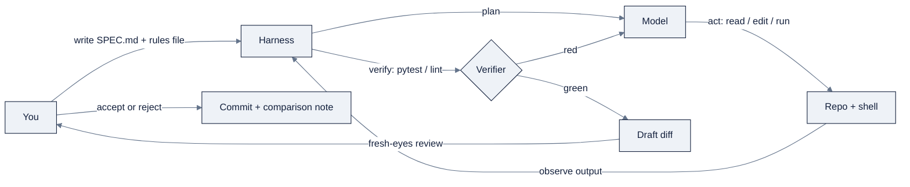

# Week 12, Coding-Agent Harnesses: Claude Code, Cursor, OpenCode, DSH

> Part of AI Engineering Lab · Week 12 of 24 · Section: Harnesses & Loops · Category: Harnesses
>
> 🎯 Use case: Build the ZoroLogistics ETA CLI entirely with a coding agent, from a written spec, in two harnesses, then compare them with numbers.

## The problem

An operations analyst at ZoroLogistics has a shipment id and one question: "When did this
actually arrive, and how late was it?" Today the answer means opening a notebook, importing
`zoro`, and touching the `data/shipments.csv` that Week 1's generator produced, fine for
you, useless for the analyst on the warehouse floor. The job this week is to turn that into a
one-command tool, `eta-cli S0000001`, that prints the row and exits `0`, or exits `2` with a
clear `stderr` message when the id is missing.

The twist: you will not write most of it yourself. You will write a **spec**, hand it to a
coding-agent harness, and steer the agent until its tests go green. Without this skill you
are the bottleneck, every function typed by hand while the agent sits idle. Done wrong, the
agent produces something *confident and unchecked*: it invents an ETA for a shipment that
does not exist, and it looks brilliant right up until someone routes a real truck on the
made-up number. The before/after is concrete: before, "shipment status" is a notebook you run
for a colleague; after, it is a tested CLI a stranger can clone and run, built, per your
spec, by a machine you directed.

## Objectives

- [ ] By Friday you can install and authenticate at least two harnesses (Claude Code + OpenCode or DSH) and confirm each with a version check from the shell.
- [ ] By Friday you can write a `SPEC.md` an agent can execute, user, constraints, one refused tradeoff, and a six-point test plan for the ETA CLI.
- [ ] By Friday you can drive an agent to build the CLI, run the tests, iterate until green, then repeat the same task in a second harness.
- [ ] By Friday you can ship a one-page harness comparison (plan, tokens, cost, quality) backed by the comparison worksheet in the notebook.

## Day-by-day plan

| Day | Study | Run | Ship (by end of day) | Time |
|---|---|---|---|---|
| **Mon** | Read the four skill guides; skim [`KB 09`](../../reference/knowledge-base/09-harnesses-tools.md) | Tool-check cell in the notebook | 2 harnesses installed + authenticated, version-checked | ~2 h |
| **Tue** | `SPEC.md` anatomy; the refused-tradeoff idea | Copy the template into `specs/eta-cli-SPEC.md`, fill every bracket | A complete, reviewed spec | ~1.5 h |
| **Wed** | Planning vs execution; verifiers | Drive harness A to build the CLI; run the 6-point test plan | CLI with tests green in harness A | ~2.5 h |
| **Thu** | Cost control; OpenRouter model routing | Re-run the *same* spec in harness B; fill the worksheet | A filled comparison worksheet (plan/tokens/cost/quality) | ~2.5 h |
| **Fri** | Harness comparison write-up | Re-run the final readiness cell | `eta-cli` + 1-page comparison committed | ~1.5 h |

## Concepts

Study this section before you open a terminal. It is the Week 12 heart: every manifest topic,
in the order you will meet it, with the numbers you need to make the comparison real.

### What a harness is

A model is not an agent. A model takes tokens in and returns tokens out. A **harness** is the
software between the model and your machine that turns tokens into *work*. It supplies four
things ([`KB 09 §1`](../../reference/knowledge-base/09-harnesses-tools.md)):

| Component | What it does | Why it matters this week |
|---|---|---|
| **The loop** | Plan → act → observe → verify → repeat until done | Without a loop the agent stops after one answer |
| **Tools** | Shell, file read/edit/write, search, MCP servers | Tools are how the model touches `eta-cli` and runs `pytest` |
| **Context management** | Decides what enters the window each turn, and when to compact | The difference between a focused build and a cost blowup |
| **Verifiers** | Tests, type checks, linters that say "still broken, try again" | The signal that closes the loop, see below |

Memorize the division of labor: **the model supplies reasoning; the harness supplies agency.**
That is why two harnesses pointed at the *same* model produce different results, they differ
on all four rows. The harness does not make the model smarter; it gives the model hands,
memory, and a feedback signal.

### Choosing a harness is a fit problem

"Which harness is best?" is the wrong question. The right one is "which surface matches how
my team already works?" The four you touch this week:

| Harness | Builder | Surface | Strengths | Cost model |
|---|---|---|---|---|
| **Claude Code** | Anthropic | Terminal CLI + headless `-p` | Polished daily driver; `CLAUDE.md`, subagents, hooks, MCP, permission sandbox | Pro/Max subscription or pay-per-token API |
| **OpenCode** | SST | TUI + desktop/web/IDE | Terminal-native, model- and provider-agnostic; `AGENTS.md` + `opencode.json` | Free (MIT); you pay your provider |
| **Cursor** | Anysphere | IDE (VS Code fork) | Tab + multi-file Agent; Rules; Cursor Router (Cost/Balance/Intelligence) | Free tier → Pro/Pro+/Ultra |
| **DSH** | DeepSeek | Web GUI + CLI + headless | Plugin-everything (Cordis); skills, goals, subagents, workflows; append-only trace | Free (MIT); you bring the model key |

The decision rule of thumb from [`KB 09 §3`](../../reference/knowledge-base/09-harnesses-tools.md):
terminal-native and scriptable → **Claude Code** or **OpenCode**; agent living beside code you
are editing → **Cursor**; a composable, inspectable open harness with a full trace → **DSH**.
All four cost the same thing in the end, your model provider, so the decision is about
workflow and control, not a price tag. Read the specifics in
[`reference/skills/claude-code.md`](../../reference/skills/claude-code.md), [`reference/skills/cursor.md`](../../reference/skills/cursor.md),
[`reference/skills/opencode.md`](../../reference/skills/opencode.md), and
[`reference/skills/deepseek-harness.md`](../../reference/skills/deepseek-harness.md) before installing.

### Rules files: the cheapest leverage you own

Every harness reads a **project memory file** at session start so it does not re-derive your
conventions. Claude Code reads `CLAUDE.md`; OpenCode reads `AGENTS.md`; Cursor reads
`.cursor/rules/*.mdc`. Same job, different filename. A good rules file **compounds**: the
agent stops guessing your build command, and every teammate's agent follows the same
conventions. Keep it a few dozen lines, written as commands, with four sections, *what this
repo is*, *commands*, *conventions*, and a *never-touch* list ([`KB 09 §4`](../../reference/knowledge-base/09-harnesses-tools.md)).

The **never-touch** list is the single highest-value line, because it is where you encode
blast radius *in advance*: `data/raw/` (edit the generator, not the output), `secrets/`,
`.env`, `*.key`. The rules file turns "please remember not to…" into something the harness
enforces every session.

### Managed context: what goes in, what stays out

The agent does not "know" your repo; it knows the slice you hand it. **Managed context** is
the discipline of deciding what enters the window and what stays out
([`KB 09 §3`](../../reference/knowledge-base/09-harnesses-tools.md)). Feed it the spec, the rules file,
and the few files that matter; keep the rest out.

| Goes in | Stays out |
|---|---|
| `SPEC.md`, the rules file, the specific source file being edited | The whole `data/` directory pasted into the prompt |
| The failing test output | Secrets and `.env` values |
| The relevant function + its call sites | Unrelated modules "for background" |

The rule that makes this concrete: **long context is not understanding, it is dilution**,
and it is also cost. Point at paths and let the agent open the rest itself rather than
pasting everything up front.

### Planning vs execution

Split every task into a *plan* (the spec: user, constraints, refused tradeoffs) and an
*execution* (the edits). Run the harness in a plan-only mode first, read the plan, then
authorize execution. Mixing the two is how an agent silently builds a different product than
you asked for.

| | Planning | Execution |
|---|---|---|
| **Question it answers** | What should exist, and what must not be traded away | How to make it exist |
| **Artifact** | `SPEC.md`, the definition of done | The diff + green tests |
| **You own** | The spec's every line | The review of every changed file |
| **Agent's job** | Propose the plan; you correct it | Edit, test, fix until the verifier passes |

The spec is not documentation for humans, it is **the definition of done the loop closes
against** ([`KB 01 §3`](../../reference/knowledge-base/01-ai-engineering-discipline.md)). That is the
bridge to Week 13.

### Subagents and parallelism

A **subagent** is a child the harness spawns to do a bounded piece of work in its own context,
then report a summary back. Two reasons it matters
([`KB 09 §5`](../../reference/knowledge-base/09-harnesses-tools.md)): **context isolation** (a specialist
reads a big file and returns only what matters, keeping your main context small) and
**parallelism** (independent tasks run concurrently). Claude Code defines them under
`.claude/agents/`; DSH exposes subagents, forks, and workflow-style fan-out. Use subagents for
*independent, clearly-scoped* work, not to hide complexity you have not understood yourself.

### OpenRouter and cost control

**OpenRouter** is a unified API that reaches hundreds of models with one key and one
OpenAI-compatible endpoint, adding automatic failover and model switching by slug
([`reference/skills/openrouter.md`](../../reference/skills/openrouter.md)). It is the routing layer *behind* a
harness, and it is how you make the cost comparison honest. The levers, in order of impact
([`KB 09 §6`](../../reference/knowledge-base/09-harnesses-tools.md)): **narrow the task**, **trim
context**, **pick the right model per task** (a small model for mechanical edits, a strong one
for hard reasoning), **use `:free`/local models for plumbing**, **cap the run**, and **cache**.

### Verifiers, SPEC.md, and blast radius

Three ideas close the loop this week and become Week 13's whole subject. A **verifier** is the
executable statement of "done", the test suite, type checker, or linter that tells the agent
"still broken, try again" ([`KB 01 §3`](../../reference/knowledge-base/01-ai-engineering-discipline.md)).
A **SPEC.md** names the user, the constraints, the one tradeoff you refuse, and the test plan
that proves the build. A **blast-radius rule** decides how much autonomy you grant *per
action*, not per session: reading a scratch file is nearly free to get wrong; writing
production data is not, the same agent deserves a different leash on the two.

These three, plus the loop itself, are exactly the three loops of
[`KB 01`](../../reference/knowledge-base/01-ai-engineering-discipline.md) and Zorost's artifact-gate
philosophy in [`07-zorost-skills-map-guide.md`](../../reference/knowledge-base/research/07-zorost-skills-map-guide.md):
Week 12 lives in **loop one (agentic coding)** and the start of **loop two (developer
feedback)**, you review the agent's diff with fresh eyes before you accept it.

The whole discipline is one steering loop:



### Worked example 1: a SPEC.md the agent can execute

This is the `SPEC.md` the notebook hands you (fill every bracket into
`specs/eta-cli-SPEC.md`). The load-bearing line is the **refused tradeoff**:

```markdown
# SPEC.md, ZoroLogistics ETA CLI
## User
A ZoroLogistics operations analyst who has a shipment id and wants, in one
terminal command, the planned vs. actual arrival and the delay.

## What it does
`eta-cli S0000001` prints: shipment_id, carrier_id, lane_id, commodity,
planned_arrival, actual_arrival, delay_hours, is_on_time.
Reads data/shipments.csv (generated Week 1, seed 42).

## Constraints
- Python 3.12, standard library + pandas only; no network, no API keys.
- Deterministic: same input → same output.
- `--json` emits the same fields as one JSON object.
- Unknown shipment id → exit code 2 + stderr message (never a fabricated row).

## Refused tradeoff
We refuse to trade correctness for a clean exit: the CLI must never invent an
ETA. Absent id or NaN arrival → exit non-zero and say so.

## Test plan (the verifier)
1. Known shipment → correct row, exit 0.  2. Unknown id → exit 2, no stdout row.
3. `--json` → valid JSON, exactly eight fields.  4. NaN arrival → non-zero exit.
5. Empty/missing CSV → non-zero exit.  6. `--help` → usage, exit 0.
```

Watch what the refused tradeoff does: it is the one place you tell the agent, *in advance*,
where it is not allowed to resolve ambiguity by guessing. A confident wrong ETA is worse than
an error, so the spec bans the "helpful" fabrication an eager agent will otherwise produce.

### Worked example 2: the cost comparison, in numbers

The harness is free; the model is not. Here is a realistic two-harness build of the same
`SPEC.md`, priced at illustrative OpenRouter rates (input/output, per 1M tokens):

| Harness | Tokens in | Tokens out | Rate (in/out) | Cost | Tests green first try? |
|---|---|---|---|---|---|
| **A: Claude Code (Sonnet)** | 52,000 | 11,000 | $3.00 / $15.00 | $0.156 + $0.165 = **$0.32** | Yes |
| **B: OpenCode (deepseek-chat)** | 61,000 | 16,000 | $0.27 / $1.10 | $0.016 + $0.018 = **$0.03** | No (2 cycles) |

The arithmetic for harness A: `(52,000 × 3.00 + 11,000 × 15.00) / 1,000,000 =
(156,000 + 165,000) / 1,000,000 = $0.321`. Harness B is roughly **ten times cheaper** but
burned more tokens and needed an extra fix cycle, the cheap model *wandered*. The Friday
comparison must report all three axes (plan, cost, quality) because a single axis names a
false winner. *Re-verify current per-token prices before quoting; they shift.*
([`reference/skills/openrouter.md`](../../reference/skills/openrouter.md))

### How it breaks

Every technique this week has a specific failure mode, and each one is a habit you are
building against:

- **No verifier** → the agent declares victory without running `pytest`; the ETA CLI "works"
  until a missing id crashes it in production.
- **Vague spec** → the agent silently resolves your ambiguity and builds a *different* tool;
  you find out at the demo.
- **Context overload** → you paste the whole repo "for background"; cost and latency spike,
  and the agent loses the thread it was supposed to follow.
- **No rules file** → the agent uses the wrong test command or edits `data/raw/` directly.
- **Comparison by vibe** → "Harness A felt nicer" with no tokens, dollars, or first-try
  green/red recorded; that is an opinion, not a comparison.
- **Over-autonomy** → you let it run against a production path instead of a branch, because
  you never wrote the never-touch list.
- **Trusting the plan without reading it** → you authorize execution of a plan that already
  contains the wrong assumption.

The common thread: **the harness is fast, but you own the commit.** Speed multiplies whatever
mistake you failed to catch upstream.

## Notebook walkthrough

`notebooks/01-harness-setup-and-comparison.ipynb` is the Monday to Thursday spine. It runs with
nothing but your Week-1 environment (`numpy`, `pandas`) and the local `zoro` package, no API
keys, no GPU.

- **§0: What this lab is for** sets the Mon→Fri map and explains the deliberate
  "unexciting" design: it checks tools, hands you a template, and records evidence.
- **§1: Tool check** has two cells. The `%%bash` cell prints a version line (or a graceful
  `not installed , see reference/skills/…`) for `claude`, `opencode`, `dsh`, and `ollama`. The Python
  cell uses `shutil.which` to compute `harness_readiness`, the count of the three *coding*
  harnesses on your PATH, printed as `0-3`.
- **§2: The SPEC.md template** is a markdown cell you copy verbatim into
  `specs/eta-cli-SPEC.md`. Modify nothing but the brackets.
- **§3: The comparison worksheet** is a `pandas.DataFrame` with one row per harness and
  columns `plan_quality_1to5`, `tokens_used`, `cost_usd`, `tests_green_first_try`,
  `diff_files_changed`, `code_quality_1to5`. Leave `None` until you run each build, then fill
  every cell, "it was fine" is not evidence.
- **§4: Cost-log helper** defines `log_cost(harness, task, tokens_in, tokens_out, cost_usd)`
  and prints the running totals so Friday can quote a per-build cost instead of a vibe.
- **§5: Final metric** recomputes `harness_readiness` in a standalone cell and **prints a
  single number** (e.g. `2`).

Which cells you edit versus just run matters: §1, §2, and §5 are read-only (run them); the
worksheet in §3 and the `log_cost(...)` calls in §4 are the *fill-in* cells you edit as you
complete each build. Do not leave the worksheet's numeric columns `None`, that is the whole
evidence base for the Friday write-up.

"Correct" output: the final cell prints a plain integer `0-3`, the worksheet has no `None`
left in the numeric columns, and you can point at the SPEC.md the number was produced from. A
readiness of `2` or more means you genuinely compared two harnesses; below that, install one
more per its `reference/skills/` guide and re-run.

## The use case (Friday)

**Deliverable:** (a) a working `eta-cli` built from `specs/eta-cli-SPEC.md` with all six
test-plan points green, and (b) a one-page harness comparison for your team.

**Zorost gate:** a stranger can clone your fork, run `eta-cli S0000001` and see the correct
row, and run `eta-cli S9999999` and get exit code `2` with a clear `stderr` message, *never*
a fabricated ETA, and you can show them **what the agent did**: the spec you wrote, the
refused tradeoff it respected, and a comparison table that names which harness produced the
better plan, at what token/dollar cost, and why. No spec, no refused tradeoff, no ship.

**Stretch variant:** add a `--by-carrier CARRIER_ID` filter that aggregates delay stats
(mean, p95) for one carrier, specified in the same `SPEC.md` style, built by the *losing*
harness from your comparison, then explain whether the underdog closed the gap when the task
got harder.

## Common pitfalls

| Pitfall | Fix |
|---|---|
| Agent "finishes" but tests were never run | Put the exact `pytest -q` command in the rules file; require green before accept |
| CLI fabricates an ETA for a missing id | The refused-tradeoff line + test-plan point 2 (exit `2`) |
| Build cost spikes mid-task | Narrow the task; point at specific files; `/compact`; smaller model for edits |
| Agent edits `data/raw/` or reads `.env` | Never-touch list in `CLAUDE.md`/`AGENTS.md`; a `PreToolUse` hook |
| Comparison is a paragraph of vibes | Fill every worksheet cell; quote tokens + dollars + first-try green/red |
| Plan looks right but is wrong | Read the plan before authorizing execution; correct it, then run |
| Two harnesses "behave the same" because both were vague | Reuse the *identical* `SPEC.md`; change only the harness |
| Version/usage drift between runs | Pin the model slug; record model + rates in the cost log |

## Glossary

- **Harness**: the software (loop, tools, context, verifiers) that turns a model into a working agent.
- **Rules file**: persistent project instructions (`CLAUDE.md`, `AGENTS.md`, `.cursor/rules`) read at session start.
- **Managed context**: the discipline of choosing what enters the model window and what stays out.
- **Verifier**: an executable check (test, lint, type check) that decides whether the work is done.
- **SPEC.md**: the written definition of done: user, constraints, refused tradeoff, test plan.
- **Refused tradeoff**: the one place you forbid the agent from resolving ambiguity by guessing.
- **Blast radius**: how much damage an action can do if it is wrong; the leash per action, not per session.
- **Subagent**: a child agent doing bounded work in its own context, returning a summary.
- **Headless mode**: running the agent without a REPL (`claude -p`), for CI and scripts.
- **OpenRouter**: a unified API/router over many models; one key, switch models by slug.
- **`:free` variant**: a rate-limited, zero-cost model tier for testing plumbing, not production.
- **Harness-readiness score**: the notebook's 0 to 3 count of installed coding harnesses.

## Self-check (quiz)

Take [`quiz.md`](quiz.md), 10 questions on concepts and notebook code, **8/10 to pass**.

## Exercises

Four graded exercises (easy / standard / stretch / portfolio) live in
[`exercises.md`](exercises.md): run the notebook to a score, fill the SPEC.md and drive one
harness, repeat in a second harness and compare, then commit the CLI + comparison. Hints are
in the same file.

## Sources

- Claude Code (Anthropic) docs: https://docs.claude.com/en/docs/claude-code/overview
- OpenCode (SST) docs: https://opencode.ai/docs/ · site: https://opencode.ai
- Cursor (Anysphere) docs: https://cursor.com/docs · pricing: https://cursor.com/help/account-and-billing/pricing.md
- DeepSeek Harness (DSH): https://deepseek.com/harness/en/ · GitHub: https://github.com/deepseek-ai/deepseek-harness
- OpenRouter docs: https://openrouter.ai/docs/quickstart.md · models: https://openrouter.ai/models
- Ollama (optional local backend): https://ollama.com
- Andrew Ng, *Three Key Loops for Building Great Software*: https://www.deeplearning.ai/the-batch/three-key-loops-for-building-great-software
- Andrew Ng, *The AI Engineering Skills Map*, The Batch issue 366: https://www.deeplearning.ai/the-batch/issue-366
- Fereydun Hashemi (Zorost), *The AI Engineering Skills Map, turned into a training plan*: https://zorost.com/ai-engineering-skills-map-training-guide
