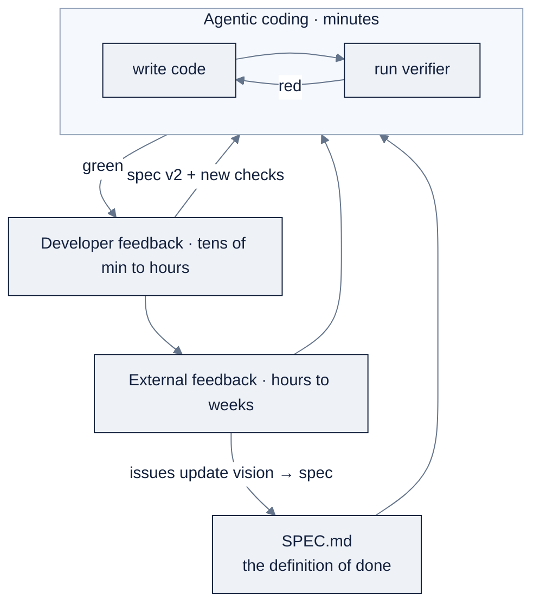

# Week 13: Agentic Coding LoopとSpec-Driven Development

> **日本語版** · [英語版](README.md) · [演習](exercises.ja.md) · [クイズ](quiz.ja.md)
> AI Engineering Labの一部 · Week 13 of 24 · Section: Harnesses & Loops · Category: Loops & Specs
> · Notebooks: [01-loop-log-and-eval-gates.ipynb](notebooks/01-loop-log-and-eval-gates.ipynb)

## 問題

ZoroLogisticsには、六つのbucket — tracking、damage、refund、documents、customs、billing — でsupport ticketが届きます。どれも、誰かがstatusを待っている本物のshipmentです。今日は人間がtriageしています。遅く、一貫性がありません。今週の仕事はSupport Bot MVPです。ticketを読み、そのcategoryを言い、canned replyを返すclassifier。それが実際に正しいかどうかを言うverifierとともに。

Week 12では *一つのharnessをsteerする* ことを学びました。今週は、*softwareを生み出すloop* を回し、そしてほとんどの人が飛ばす部分、それを測定します。verifierがなければ「完了」は感覚です。botはconfidentでplausibleで未検証のものを作り、checkは最も都合の悪い瞬間にあなたに降りかかります。三つのloopがなければ、botはreal userに出会わず、重要なdefectはproductionまで不可視のままです。before/after: beforeは、手書きの二つの例で「正しく見える」keyword classifier。afterは、二層のverifier（unit check + 60-ticket eval）、すべてのcycleとそのdefectを示すloop log、そしてreal feedbackが要求したために変わったspecです。

## 目標

- [ ] 金曜日までに、Support Bot MVPの `SPEC.md` を書ける。verifier（unit check + eval）を完了の定義として明記する。
- [ ] 金曜日までに、verifierがpassするまでagentic loop（build → test → fix）を回し、すべてのcycleをtimestamp、token、defect付きでlogできる。
- [ ] 金曜日までに、developer loop（fresh-eyes review）を回し、見つけたものからspecとverifierを更新できる。
- [ ] 金曜日までに、external loop（real user）を回し、feedbackをspec変更と新しいeval caseに変換し、printされたdefect metricで終えられる。

## 日ごとの計画

| Day | Study | Run | Ship（その日までに） | Time |
|---|---|---|---|---|
| **Mon** | [`KB 01`](../../reference/knowledge-base/01-ai-engineering-discipline.md) の三つのloopを再読する。[`KB 09`](../../reference/knowledge-base/09-harnesses-tools.md) のverifier pattern | Notebook §0、§2（classifier + eval set） | MVP `classify_ticket` + 60-ticket eval setをload | 約2時間 |
| **Tue** | verifierの層。`SPEC.md` のpattern | Notebook §2（unit check + mini eval） | greenな二層verifier + spec v1 | 約2時間 |
| **Wed** | agentic loop。headless mode | Notebook §3、§4（headless loop + loop log） | ≥2のagentic cycleを持つloop log | 約2.5時間 |
| **Thu** | developer loop。blast-radiusのtier | Notebook §5のreview prompt。missしたcheckを追加 | Spec v2 + 新しいverifier check | 約2時間 |
| **Fri** | external loop。loopの測定 | Notebook §6、§7（feedback form + defect metric） | Spec v3 + loop log + printされたpass rateをcommit | 約1.5時間 |

## 概念

Week 12は *道具* について。Week 13は *その道具が走るprocess* と、そのprocessを感覚ではなく測定する方法についてです。

### 異なる時計で回る三つのloop

Ngは0-to-1のbuildingを **異なる時計で回る三つのloop** として捉えます（[`KB 01`](../../reference/knowledge-base/01-ai-engineering-discipline.md)、[`07-zorost-skills-map-guide.md`](../../reference/knowledge-base/research/07-zorost-skills-map-guide.md)）。

| Loop | Cadence | 起きること | 何がそれを閉じるか | 今週のあなたのartifact |
|---|---|---|---|---|
| **Agentic coding** | 数分 | agentがcodeを書き、verifierを実行し、失敗を読み、直し、繰り返す | verifier | Support Bot MVP + greenなverifier |
| **Developer feedback** | 数十分〜数時間 | あなたがfreshな目でreviewする。userとcontextについては、agentより多くをあなたが知っている | あなたのjudgment。spec + checkへ変換される | Spec v2 + 新しいunit check |
| **External feedback** | 数時間〜数週間 | real userが使う。その行動がvision → spec → agentを更新する | 現実 | Feedback form + filed issue |

loopは **nest** します。developer feedbackはagentic loopを包み、external feedbackはその二つを包みます。このnestingこそがpointです。内側のloopはcodeを速く生み、外側のloopはspecに還元される *judgment* を生みます。

load-bearingな部品は **verifier** です。checkのないloopは、confidentで未検証の出力を生むだけです。Zorostのぶっきらぼうな版（[`07-zorost-skills-map-guide.md`](../../reference/knowledge-base/research/07-zorost-skills-map-guide.md)）: *agent loopは、自分が完了したかどうかを伝えるsignalと同じ分だけしか良くない。*

### Verifierには層がある

verifierとは「完了」の実行可能なstatementです。今週は二つの層を意図的に使います。違うものを捕まえるからです。

| Verifier | 何をcheckするか | 何を捕まえるか | いつ使うか |
|---|---|---|---|
| **Unit test** | 一つの既知のinput → 一つの既知の出力 | 特定のregression、すでに知っている境界 | specにある名前付きのすべての動作 |
| **Eval set** | 多くのseed付きexampleにわたるaccuracy | *分布*、忘れていたclass、静かなmiss | 統計的な「これくらいの頻度で正しいか」 |
| **Type check** | programがwell-typedか | 間違ったfield名、shapeの不一致 | Python/typed codebaseで、testの前に |
| **Linter** | style + 有りそうなbug | dead code、shadowing、foot-gun | すべてのcommitで。安くて速い |

あなたがbuildする二つ: **6つのunit check**（tracking、damage、refund、customs、unknown input、answer shape）と、`zoro.data.support_tickets(n=60, seed=123)` からの **60-ticket mini eval**（notebook cell §1、§2）です。unit checkは *安くてbinary* な層、evalは *統計的* な層です。botは手書きのunit checkをすべてpassしながら、testしようと思いつきもしなかったreal ticketの一classでfailしえます。まさにerror analysisの存在理由です（[`KB 07`](../../reference/knowledge-base/07-evals-error-analysis.md)）。

### SPEC.mdのpatternと更新

Spec-driven developmentとは、buildの *前に* specを書き、feedback *から* 更新することであって、一回限りのdocumentとして扱うことではありません。specはuser、constraints、交換を拒むもの、buildを証明するtest planを明記します（[`KB 01 §3`](../../reference/knowledge-base/01-ai-engineering-discipline.md)）。Week 13の追加: verifierは、完了の定義としてspecの *中に* あります。だから「shipping」は「打ち込んだ」ではなく「verifierがpassした」です。

developerやexternal reviewがgapを見つけたとき、fixは **まずspecに** 入り、それからcodeに入ります。この順序 — spec → code、決して逆ではない — こそがloopのdriftを防ぎます。これは [`07-zorost-skills-map-guide.md`](../../reference/knowledge-base/research/07-zorost-skills-map-guide.md) のartifact-gate disciplineでもあります。動くsystemを見せる人は誰にでもなれる。*最初に何を信じ、現実が何を修正し、どうやって知ったか* を見せられる人はほとんどいない。そのdiffこそがjudgmentのevidenceです。

### Harness primitives: hooks、skills、MCP、subagents

manifestは、今あなたに使う理由のある四つのharness primitiveを挙げています。同じquestion — 「loopをより安全に、より再利用可能に、あるいはより広くするには？」— への異なる答えです。

| Primitive | 何をするか | 使うとき |
|---|---|---|
| **Hooks** | tool callの前後にcommandを自動実行。危険なactionを *block* できる | policyを *覚えてもらう* のではなく *強制* したい（例: `data/raw/` への書き込みを拒否） |
| **Skills** | taskが一致したときにloadされるon-demandのinstruction pack | 再利用したい繰り返し可能な手順やrepo convention |
| **MCP** | 外部serverをtoolとしてattach（data source、APIs、あなた自身のserver） | agentがrepoの外に届く必要がある。Week 16のtopic |
| **Subagents** | 自分自身のcontextでboundedな仕事をし、並列にも走る子agent | 独立した、明確にscopeされた仕事。main contextを小さく保つ |

これらは組み合わさります。`PreToolUse` hookが危険なshell commandをblockし、skillがrepoのrelease checklistをencodeし、MCP serverがagentに `track_shipment` toolを与え、subagentが五つのfileをauditして一つのsummaryを報告します。それぞれが、あなた自身のcontextを広げずに、blast radiusを *狭める* かreachを *広げる* ものです（[`KB 09 §5`](../../reference/knowledge-base/09-harnesses-tools.md)、[`reference/skills/claude-code.md`](../../reference/skills/claude-code.md)、[`reference/skills/deepseek-harness.md`](../../reference/skills/deepseek-harness.md)）。

### Blast-radius rules

blast-radius ruleはautonomyを **session単位ではなくaction単位** で調整します（[`KB 01 §3`](../../reference/knowledge-base/01-ai-engineering-discipline.md)）。scratch fileのreadはほぼタダで間違えられますが、production dataへの書き込みや不可逆なcommandの実行は違います。同じagentでも、この二つには別のleashが要ります。

| Action | Blast radius | Autonomy | Guardrail |
|---|---|---|---|
| scratch fileを読む | ほぼゼロ | 完全に許す | 不要 |
| branch上でrepoを編集する | 回復可能（git） | 実行し、その後diffをreview | never-touch list |
| production dataに書き込む | real customerへの害 | 手動approval | hook + 明示的なconfirm |
| secretsをcontextに読み込む | leak。回復不能 | 決して | 「secretsは決して読まない」rule + hook |
| 不可逆なcommand（drop、force-push） | 回復不能 | approvalなしには決して | permission/deny-list |

今週のbotはread-onlyでofflineなのでblast radiusは小さいのですが、それでも *明記* します。そのhabitこそが、後で恐れずに多くのautonomyを与えられるようにするからです。

### Loopを測定する

時間、token、defect per cycleは、agentic codingの **unit economics** です（[`KB 01`](../../reference/knowledge-base/01-ai-engineering-discipline.md)）。loop logは「agentは役立った」を「三cycle、12k token、二つのdefectを捕獲、三つ目はあなたの落ち度」に変えます。notebookの `log_loop()` はcycleごとに一行（`loop`、`event`、`tokens_in`、`tokens_out`、`defect`、`notes`）をappendし、最終cellがそれを一つの数字、**verifier pass rate** に畳み込みます。

### 実例1: loop-logのcost計算

Support Botでの現実的な三loop runを、例示的なOpenRouter rate（$3.00/1M input、$15.00/1M output、*引用前に再確認を*）で価格付けしたものです。

| Loop | Cycle | Tokens in | Tokens out | surface化したdefect |
|---|---|---|---|---|
| agentic | `classify_ticket` の初期build | 4,200 | 1,100 | refund textがtrackingと誤判定 |
| agentic | keyword listをfix。verifierを再実行 | 3,100 | 900 | n/a |
| agentic | billing unit checkを追加（spec v2どおり） | 2,700 | 800 | n/a |
| developer | fresh-eyes review | 0 | 0 | unknown textへのcheckがない |
| external | user: 「一つのticketに二つのshipment id」 | 0 | 0 | 二id ticket → 誤reply |

agentic token = 10,000 in + 2,800 out。Cost =
`(10,000 × 3.00 + 2,800 × 15.00) / 1,000,000 = (30,000 + 42,000) / 1,000,000 = $0.072`。
二つのdefectは、直すのが安いloopの *内側* でsurface化しました。developerとexternalのloopはtokenゼロ（あなたが読み、友人に頼んだだけ）ですが、それぞれのfindingを新しいcheckに変える *spec変更* を生みました。これがeconomicsのすべてです。高いのはtokenではなく、inner loopから逃がしたdefectです。

### 実例2: feedbackが駆動するspec更新

external loopの前後で変わった `SPEC.md` の行です。

**Spec v1（Tue）**: `## What it does: classify a ticket into one of six categories and return a canned reply.`

**Spec v2（Thu）**: developer reviewの後、追加: `## Out of scope: unknown or ambiguous
tickets are NOT auto-answered; route to a human.`

**Spec v3（Fri）**: real userが *"where is S0000001 and S0000002, they're both late"* を貼った後、追加: `## New eval case: a ticket mentioning two shipment ids must route to human, not
answer the first id.`、さらに一致するeval row。

進む方向に注目してください: feedback → **specの行** → code → 新しいeval case。specはloopが収束するsource of truthであり、codeはその現在のimplementationにすぎません。

### うまくいかない理由

- **Verifierがない** → agentは一回のsmoke testの後で勝利を宣言する。classifierはdamageをrefundに黙って誤fileし、誰も見ないうちに金が動きます。
- **Verifier theatre** → 「functionがstringを返す」ことだけをassertするcheckは永遠にpassし、specが約束するものを何も測りません。
- **一層だけのverifier** → unit checkはすべてgreenだがevalが一度も走らない。ticketの一class全体（例えばcustoms）が間違っていて不可視です。
- **一回限りのdocumentとしてのspec** → codeは直すがspecは直さない。次のsessionでagentは古く間違った挙動をrebuildします。
- **Feedbackがtestにならない** → real userがbugを報告。うなずいて先へ進む。来週、静かにregressします。
- **Blast radiusの無視** → 「fileを読む」と「このshell commandを実行する」に、同じsession由来という理由で同じleashを与える。
- **測定されないloop** → 「役立った」とは言えても、何cycle、何token、何defectだったかは言えない。見えないprocessは上達できません。

## Notebook walkthrough

`notebooks/01-loop-log-and-eval-gates.ipynb` はWeek-1のenvironmentでend-to-endに動きます。API key不要、GPU不要。headless `claude -p` cellは、`claude` がなければgracefulにskipします。

- **§0: The three loops, in one page** はcadence tableを示し、verifierをload-bearingな部品として名指しします。
- **§1: The Support Bot MVP** は `CATEGORY_KEYWORDS`（六つのcategory）、`REPLIES`、`classify_ticket(text)`（最もscoreの高いkeyword match、なければ `'unknown'`）、`answer_ticket(text)`（`{category, shipment_id, reply}` を返す）を定義します。smoke testが一つのanswerをprintし、続いて `data.support_tickets(n=60, seed=123)` が、ground-truth category付きの60のseeded ticketからなるeval setをloadします。
- **§2: The verifier** は `UNIT_CHECKS`（tracking、damage、refund、customs、unknown、answer-shapeの6つの手書きassertion）をbuildし、10行の `run_checks` runnerで実行し、続いて60 ticketにわたるclassification accuracyを計算するmini evalをbuildします。最初のpassでは何も変更せず、printされた `unit checks: 6/6` と `mini eval: N/60` の行を読むだけです。
- **§3: The agentic loop（headless）** は、`claude` があれば `claude -p '…add a billing unit check…'` を実行し、なければmanual fallbackをprintする `%%bash` cellです。loop oneの、scriptedでCI-ableな形です。
- **§4: The loop log** は `log_loop()` を定義し、三つのexample rowをseedします。`cycles
  logged` と `defects surfaced` をprintします。seedを自分の実際のcycleに置き換えてください。
- **§5: Developer loop** は五つのreview promptを与えます（agentは何をassumeしたか？ 誰もtestしていないinputは？ blast radiusは？ 何をhumanにrouteすべきか？ verifierはspecが約束するものを測っているか？）。
- **§6: External feedback** は、fill-in form templateとtriage rule（file → spec-vs-eval → 失敗したinputをeval setに追加）です。
- **§7: Defect metric** は `unit checks`、`eval correct`、`defects caught`、そして **一つの数字**: `round(verifier_pass_rate, 3)`（ただし `verifier_pass_rate = (unit_passed + eval_correct) / (unit_total + eval_total)`）をprintします。

「正しい」出力: unit checkは `6 / 6` と読め、mini evalは `60 / 60` かそれに極めて近い値です（seeded ticketはgenerator自身の六つのtemplateを使い回すので、よく調整されたkeyword listなら `1.0` に近づくはずです。意味ありげに低い値は、error analysisで追うべきdefectです）。最終cellは `1.0` のような一つの数字をprintします。deliverableは *その数字と、それを生んだsample* であり、赤いcellのscreenshotではありません。

## Use case（Friday）

**Deliverable:** (a) greenなverifier（unit check + eval）を持つSupport Bot MVP、(b) 三つのloopすべてをcoverするloop log、(c) あなたが受けたfeedbackに駆動されたspec更新。

**Zorost gate:** 見知らぬ人がnotebookを開き、end-to-endに実行し、一つの数字 — verifier pass rate — と、それを生んだsampleを読み取れること。さらに **各loopが何を変えたか** を見せられること。developer loopがどのspec行を編集したか、external loopがどの失敗inputをeval setに追加したか、defect metricが前後でどう動いたかです。verifierなし、loop logなし、ならshipなし。

**Stretch variant:** §3のとおりnotebookに対して *本物の* headless agent loop（`claude -p` またはあなたのharnessの等価物）を回し、出力をcaptureし、実際のtokenとdefectをlogします。そして、実際の出力がseeded example rowとどう違ったかを一文で書きます。

## よくあるpitfall

| Pitfall | Fix |
|---|---|
| verifierが実際には一度も実行されない | 変更のたびに§2を再実行する。「動いた」ではなくprintされたpass rateを引用する |
| unit checkはgreenだがevalが未test | evalは *別の* 層です。両方を、毎回実行する |
| codeは直したがspecは直していない | Spec first: specの行を書き、次にcode、次にtest |
| 事後にfeedbackが無視される | triage rule: file → spec-vs-evalを決める → 失敗したinputをeval setに追加 |
| loop logが空のまま | seeded rowを置き換える。見えないloopはvibeです |
| すべてのactionに同じleash | blast-radius tableを使う。不可逆なcommandにhookを付ける |
| 一つのticketに二つのshipment idが未処理 | 「humanにrouteする」rule + 一致するeval row |
| defect metricの誤読 | `(unit_passed + eval_correct) / (unit_total + eval_total)` です。sample付きの *rate* です |

## Glossary

- **Agentic loop**: agentがverifier passまで書き、testし、直す、数分scaleのloop。
- **Developer loop**: specとcheckを更新するfresh-eyesな人間review（数十分〜数時間）。
- **External loop**: vision → spec → agentを更新するreal userのfeedback（数時間〜数週間）。
- **Verifier**: 完了の実行可能なstatement。test、eval、type check、linter、schema。
- **Eval set**: accuracyをbinaryではなくrateとして測るために使う、label付きexample set。
- **SPEC.md**: feedbackから更新され、loopが収束する、書かれた完了の定義。
- **Loop log**: cycleごとにloop、timestamp、token、defectを記録する一行。
- **Blast-radius rule**: 間違えたactionのdamageの大きさで、actionごとに調整するautonomy。
- **Hook**: policyを強制またはblockできる、自動化されたpre/post-tool command。
- **MCP**: 外部serverをagent toolとしてattachするprotocol。
- **Subagent**: main contextにsummaryを報告する、boundedな子agent。
- **Verifier pass rate**: `(unit checks passed + eval correct) / (unit checks + eval cases)`。notebookの最終数字。

## Self-check（quiz）

[`quiz.md`](quiz.md) を受けましょう。conceptとnotebook codeについての10問です。**8/10で合格** です。

## Exercises

四つのgraded exercise（easy / standard / stretch / portfolio）は [`exercises.md`](exercises.md) にあります。notebookを実行してpass rateを出す、billing check + edge-case eval rowを追加する、本物のheadless loopを回す、そしてMVP + loop log + spec diffをcommitする。hintは同じfileにあります。

## Sources

- Andrew Ng, *Three Key Loops for Building Great Software*: https://www.deeplearning.ai/the-batch/three-key-loops-for-building-great-software
- Andrew Ng, *The AI Engineering Skills Map*, The Batch issue 366: https://www.deeplearning.ai/the-batch/issue-366
- Fereydun Hashemi (Zorost), *The AI Engineering Skills Map, turned into a training plan*: https://zorost.com/ai-engineering-skills-map-training-guide
- Claude Code (Anthropic) docs: https://docs.claude.com/en/docs/claude-code/overview · hooks: https://docs.claude.com/en/docs/claude-code/hooks
- OpenCode (SST) docs: https://opencode.ai/docs/
- Cursor (Anysphere) docs: https://cursor.com/docs
- DeepSeek Harness (DSH): https://deepseek.com/harness/en/ · GitHub: https://github.com/deepseek-ai/deepseek-harness
- OpenRouter docs: https://openrouter.ai/docs/quickstart.md
