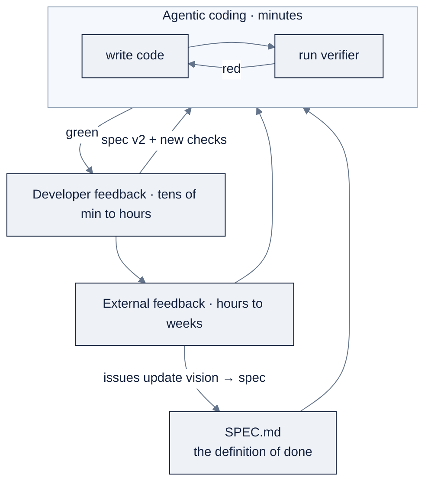

# Week 13: Agentic Coding Loops & Spec-Driven Development

> Part of AI Engineering Lab · Week 13 of 24 · Section: Harnesses & Loops · Category: Loops & Specs
>
> 🎯 Use case: Ship the ZoroLogistics Support Bot MVP through the full three-loop cycle, with a verifier closing every loop.

## The problem

ZoroLogistics receives support tickets in six buckets, tracking, damage, refund, documents,
customs, billing, and every one of them is a real shipment whose status someone is waiting
on. A human triages them today, slowly, and inconsistently. The job this week is a Support Bot
MVP: a classifier that reads a ticket, names its category, and returns a canned reply, with a
verifier that says whether it is actually right.

Week 12 taught you to *steer one harness*. This week you run the *loop that produces
software*, and, the part most people skip, you measure it. Without a verifier, "done" is a
feeling: the bot produces something confident, plausible, and unchecked, and the checking
lands on you at the least convenient moment. Without the three loops, the bot never meets a
real user, so the defects that matter stay invisible until production. The before/after:
before, a keyword classifier that "looks right" on two hand-written examples; after, a bot
with a two-layer verifier (unit checks + a 60-ticket eval), a loop log showing every cycle and
its defects, and a spec that changed because real feedback demanded it.

## Objectives

- [ ] By Friday you can write a `SPEC.md` for the Support Bot MVP that names the verifier (unit checks + eval) as its definition of done.
- [ ] By Friday you can run the agentic loop (build → test → fix) until the verifier passes, logging every cycle with timestamps, tokens, and defects.
- [ ] By Friday you can run the developer loop (fresh-eyes review) and update the spec and verifier from what you find.
- [ ] By Friday you can run the external loop (a real user) and convert feedback into spec changes and new eval cases, ending with a printed defect metric.

## Day-by-day plan

| Day | Study | Run | Ship (by end of day) | Time |
|---|---|---|---|---|
| **Mon** | Re-read [`KB 01`](../../reference/knowledge-base/01-ai-engineering-discipline.md) three loops; verifier patterns in [`KB 09`](../../reference/knowledge-base/09-harnesses-tools.md) | Notebook §0, §2 (classifier + eval set) | MVP `classify_ticket` + 60-ticket eval set loaded | ~2 h |
| **Tue** | Verifier layers; `SPEC.md` patterns | Notebook §2 (unit checks + mini eval) | A green two-layer verifier + spec v1 | ~2 h |
| **Wed** | Agentic loop; headless mode | Notebook §3, §4 (headless loop + loop log) | Loop log with ≥2 agentic cycles | ~2.5 h |
| **Thu** | Developer loop; blast-radius tiers | Notebook §5 review prompts; add missed checks | Spec v2 + new verifier checks | ~2 h |
| **Fri** | External loop; measuring the loop | Notebook §6, §7 (feedback form + defect metric) | Spec v3 + loop log + printed pass rate committed | ~1.5 h |

## Concepts

Week 12 was about the *instrument*; Week 13 is about the *process it runs in*, and how to
measure that process instead of just feeling it.

### The three loops, on different clocks

Ng frames 0-to-1 building as **three loops running on different clocks**
([`KB 01`](../../reference/knowledge-base/01-ai-engineering-discipline.md),
[`07-zorost-skills-map-guide.md`](../../reference/knowledge-base/research/07-zorost-skills-map-guide.md)):

| Loop | Cadence | What happens | What closes it | Your artifact this week |
|---|---|---|---|---|
| **Agentic coding** | minutes | Agent writes code, runs the verifier, reads the failure, fixes it, repeat | The verifier | Support Bot MVP + green verifier |
| **Developer feedback** | tens of min to hours | You review with fresh eyes; you know more than the agent about users and context | Your judgment, turned into spec + checks | Spec v2 + new unit checks |
| **External feedback** | hours to weeks | A real person uses it; what they do updates your vision → spec → agent | Reality | Feedback form + filed issues |

The loops **nest**: developer feedback wraps the agentic loop, and external feedback wraps
both. That nesting is the point, the inner loop produces code fast, the outer loops produce
*judgment* that feeds back into the spec:

The load-bearing piece is the **verifier**: a loop with no check just produces confident,
unchecked output. Zorost's blunt version
([`07-zorost-skills-map-guide.md`](../../reference/knowledge-base/research/07-zorost-skills-map-guide.md)):
*an agent loop is only as good as the signal that tells it whether it is done.*

### The verifier has layers

A verifier is any executable statement of "done". This week you use two layers deliberately,
because they catch different things:

| Verifier | What it checks | What it catches | When to use |
|---|---|---|---|
| **Unit test** | One known input → one known output | A specific regression, a boundary you already know | Every named behavior in the spec |
| **Eval set** | Accuracy over many seeded examples | The *distribution*, classes you forgot, silent misses | The statistical "is it right *this often*" |
| **Type check** | The program is well-typed | Wrong field names, mismatched shapes | Python/typed codebases, before tests |
| **Linter** | Style + likely bugs | Dead code, shadowing, foot-guns | Every commit, cheap and fast |

The two you build: **6 unit checks** (tracking, damage, refund, customs, unknown input, answer
shape) plus a **60-ticket mini eval** from `zoro.data.support_tickets(n=60, seed=123)`
(notebook cell §1, §2). The unit checks are the *cheap, binary* layer; the eval is the
*statistical* layer. A bot can pass every hand-written unit check and still fail a class of
real ticket you never thought to test, which is exactly what error analysis is for
([`KB 07`](../../reference/knowledge-base/07-evals-error-analysis.md)).

### SPEC.md patterns: and updates

Spec-driven development is writing the spec *before* the build and updating it *from
feedback*, not treating it as a one-time document. A spec names the user, the constraints,
what you refuse to trade away, and the test plan that proves the build
([`KB 01 §3`](../../reference/knowledge-base/01-ai-engineering-discipline.md)). The Week-13 addition: the
verifier is *inside* the spec as its definition of done, so "shipping" is not "I typed it" but
"the verifier passes."

When a developer or external review finds a gap, the fix goes into the **spec first**, then
into code. That ordering, spec → code, never the reverse, is what keeps the loops from
drifting. It is also the artifact-gate discipline from
[`07-zorost-skills-map-guide.md`](../../reference/knowledge-base/research/07-zorost-skills-map-guide.md):
anyone can show a system that works; very few can show *what they believed at the start, what
reality corrected, and how they knew*, that diff is the evidence of judgment.

### Harness primitives: hooks, skills, MCP, subagents

The manifest lists four harness primitives you now have a reason to reach for. They are
different answers to the same question, "how do I make the loop safer, more reusable, or
wider?"

| Primitive | What it does | Use it when |
|---|---|---|
| **Hooks** | Auto-run a command before/after a tool call; can *block* dangerous actions | You want policy *enforced*, not remembered (e.g. refuse `data/raw/` writes) |
| **Skills** | On-demand instruction packs, loaded when the task matches | A repeatable procedure or repo convention you want reused |
| **MCP** | Attach external servers as tools (data sources, APIs, your own server) | The agent needs to reach something outside the repo, Week 16's topic |
| **Subagents** | Child agents doing bounded work in their own context, possibly in parallel | Independent, clearly-scoped work; keep the main context small |

They compose: a `PreToolUse` hook blocks a dangerous shell command; a skill encodes your repo's
release checklist; an MCP server gives the agent a `track_shipment` tool; a subagent audits
five files and reports back one summary. Each one narrows the blast radius or widens the reach
*without* widening your own context
([`KB 09 §5`](../../reference/knowledge-base/09-harnesses-tools.md),
[`reference/skills/claude-code.md`](../../reference/skills/claude-code.md),
[`reference/skills/deepseek-harness.md`](../../reference/skills/deepseek-harness.md)).

### Blast-radius rules

A blast-radius rule calibrates autonomy **per action**, not per session
([`KB 01 §3`](../../reference/knowledge-base/01-ai-engineering-discipline.md)). Reading a scratch file is
nearly free to get wrong; writing production data or running an irreversible command is not.
The same agent deserves a different leash on the two:

| Action | Blast radius | Autonomy | Guardrail |
|---|---|---|---|
| Read a scratch file | ~nothing | Full | none needed |
| Edit the repo on a branch | recoverable (git) | Run, then review the diff | never-touch list |
| Write production data | real customer harm | Manual approval | hook + explicit confirm |
| Read secrets into context | leak, un-recoverable | Never | "never read secrets" rule + hook |
| Irreversible command (drop, force-push) | un-recoverable | Never without approval | permission/deny-list |

This week's bot is read-only and offline, so its blast radius is small, but you still *state*
it, because that habit is what lets you grant more autonomy later without fear.

### Measuring the loop

Time, tokens, and defects per cycle are the **unit economics** of agentic coding
([`KB 01`](../../reference/knowledge-base/01-ai-engineering-discipline.md)). A loop log turns "the agent
was helpful" into "three cycles, 12k tokens, two defects caught, and the third one was
yours." The notebook's `log_loop()` appends one row per cycle (`loop`, `event`, `tokens_in`,
`tokens_out`, `defect`, `notes`), and the final cell folds it into one number: the **verifier
pass rate**.

### Worked example 1: a loop-log cost calculation

Here is a realistic three-loop run on the Support Bot, priced at illustrative OpenRouter rates
($3.00/1M input, $15.00/1M output, *re-verify before quoting*):

| Loop | Cycle | Tokens in | Tokens out | Defect surfaced |
|---|---|---|---|---|
| agentic | initial build of `classify_ticket` | 4,200 | 1,100 | refund text mis-flagged as tracking |
| agentic | fix keyword list; re-run verifier | 3,100 | 900 | n/a |
| agentic | add billing unit check (per spec v2) | 2,700 | 800 | n/a |
| developer | fresh-eyes review | 0 | 0 | no check for unknown text |
| external | user: "two shipment ids in one ticket" | 0 | 0 | two-id ticket → wrong reply |

Agentic tokens = 10,000 in + 2,800 out. Cost =
`(10,000 × 3.00 + 2,800 × 15.00) / 1,000,000 = (30,000 + 42,000) / 1,000,000 = $0.072`.
Two defects surfaced *inside* the loop where they were cheap to fix; the developer and
external loops cost zero tokens (you read, you asked a friend) but produced the *spec change*
that turned each finding into a new check. That is the whole economics: the expensive part is
not the tokens, it is the defects you let escape the inner loop.

### Worked example 2: a spec update driven by feedback

Here is the `SPEC.md` line that changed, before and after the external loop:

**Spec v1 (Tue)**: `## What it does: classify a ticket into one of six categories and return a canned reply.`

**Spec v2 (Thu)**: adds, after developer review: `## Out of scope: unknown or ambiguous
tickets are NOT auto-answered; route to a human.`

**Spec v3 (Fri)**: adds, after a real user pasted *"where is S0000001 and S0000002, they're
both late"*: `## New eval case: a ticket mentioning two shipment ids must route to human, not
answer the first id.`, plus a matching eval row.

Notice the direction of travel: feedback → **spec line** → code → new eval case. The spec is
the source of truth the loops converge on; the code is just its current implementation.

### How it breaks

- **No verifier** → the agent declares victory after one smoke test; the classifier silently
  mis-files damage as refund, and money moves before anyone looks.
- **Verifier theatre** → a check that only asserts "the function returns a string" passes
  forever and measures nothing the spec promises.
- **Single-layer verifier** → unit checks all green but the eval never runs; a whole class of
  ticket (customs, say) is wrong and invisible.
- **Spec as one-time document** → you fix the code but not the spec; next session the agent
  rebuilds the old, wrong behavior.
- **Feedback never becomes a test** → a real user reports a bug; you nod and move on; it
  regresses silently next week.
- **Blast radius ignored** → you grant the same leash to "read a file" and "run this shell
  command" because both came from the same session.
- **Unmeasured loop** → you can say "it was helpful" but not how many cycles, tokens, or
  defects it took; you cannot get better at a process you cannot see.

## Notebook walkthrough

`notebooks/01-loop-log-and-eval-gates.ipynb` runs end-to-end on your Week-1 environment,
no API keys, no GPU. The headless `claude -p` cell skips gracefully if `claude` is missing.

- **§0: The three loops, in one page** states the cadence table and names the verifier as the
  load-bearing piece.
- **§1: The Support Bot MVP** defines `CATEGORY_KEYWORDS` (six categories), `REPLIES`,
  `classify_ticket(text)` (best-scoring keyword match, else `'unknown'`), and
  `answer_ticket(text)` (returns `{category, shipment_id, reply}`). A smoke test prints one
  answer; then `data.support_tickets(n=60, seed=123)` loads the eval set of 60 seeded tickets
  with ground-truth categories.
- **§2: The verifier** builds `UNIT_CHECKS` (6 hand-written assertions: tracking, damage,
  refund, customs, unknown, answer-shape) run by a 10-line `run_checks` runner, then a mini
  eval that computes classification accuracy over the 60 tickets. Modify nothing here on your
  first pass, just read the printed `unit checks: 6/6` and `mini eval: N/60` lines.
- **§3: The agentic loop (headless)** is a `%%bash` cell that runs
  `claude -p '…add a billing unit check…'` if `claude` exists, else prints the manual
  fallback. This is the scripted, CI-able form of loop one.
- **§4: The loop log** defines `log_loop()` and seeds three example rows; it prints `cycles
  logged` and `defects surfaced`. Replace the seeds with your real cycles.
- **§5: Developer loop** gives five review prompts (what did the agent assume? which input did
  nobody test? what's the blast radius? what must route to human? is the verifier measuring
  what the spec promises?).
- **§6: External feedback** is a fill-in form template plus a triage rule (file → spec-vs-eval
  → add the failing input to the eval set).
- **§7: Defect metric** prints `unit checks`, `eval correct`, `defects caught`, and **one
  number**: `round(verifier_pass_rate, 3)` where
  `verifier_pass_rate = (unit_passed + eval_correct) / (unit_total + eval_total)`.

"Correct" output: unit checks read `6 / 6`, the mini eval is at or very near `60 / 60` (the
seeded tickets reuse the generator's own six templates, so a well-tuned keyword list should
approach `1.0`; anything meaningfully lower is a defect to hunt with error analysis), and the
final cell prints a single number like `1.0`. The deliverable is *that number plus the sample
that produced it*, not a screenshot of a red cell.

## The use case (Friday)

**Deliverable:** (a) a Support Bot MVP with a green verifier (unit checks + eval), (b) a loop
log covering all three loops, and (c) spec updates driven by the feedback you received.

**Zorost gate:** a stranger can open the notebook, run it end-to-end, and read off one number
the verifier pass rate, plus the sample that produced it; and you can show them **what each
loop changed**: which spec line the developer loop edited, which failing input the external
loop added to the eval set, and how the defect metric moved before and after. No verifier, no
loop log, no ship.

**Stretch variant:** run a *real* headless agent loop (`claude -p` or your harness's
equivalent) against the notebook as shown in §3, capture the output, and log the actual tokens
and defects it produced, then write one sentence on how the real output differed from the
seeded example rows.

## Common pitfalls

| Pitfall | Fix |
|---|---|
| Verifier never actually runs | Re-run §2 after every change; quote the printed pass rate, not "it worked" |
| Unit checks green but eval untested | The eval is a *different* layer, run both, every time |
| Fixed the code but not the spec | Spec first: write the spec line, then the code, then the test |
| Feedback ignored after the fact | Triage rule: file → decide spec-vs-eval → add the failing input to the eval set |
| Loop log left empty | Replace the seeded rows; a loop you cannot see is a vibe |
| Same leash for every action | Use the blast-radius table; hook the irreversible commands |
| Two shipment ids in one ticket not handled | A "route to human" rule + a matching eval row |
| Defect metric misread | It is `(unit_passed + eval_correct) / (unit_total + eval_total)`, a *rate*, with the sample |

## Glossary

- **Agentic loop**: the minutes-scale loop where the agent writes, tests, and fixes until the verifier passes.
- **Developer loop**: the fresh-eyes human review that updates spec and checks (tens of minutes to hours).
- **External loop**: a real user's feedback that updates vision → spec → agent (hours to weeks).
- **Verifier**: the executable statement of done: tests, evals, type checks, linters, schemas.
- **Eval set**: a labeled set of examples used to measure accuracy as a rate, not a binary.
- **SPEC.md**: the written definition of done, updated from feedback, that the loops converge on.
- **Loop log**: one row per cycle recording loop, timestamps, tokens, and defects.
- **Blast-radius rule**: autonomy calibrated per action by how much damage a wrong action does.
- **Hook**: an automated pre/post-tool command that can enforce or block a policy.
- **MCP**: a protocol for attaching external servers as agent tools.
- **Subagent**: a bounded child agent that reports a summary back to the main context.
- **Verifier pass rate**: `(unit checks passed + eval correct) / (unit checks + eval cases)`, the notebook's final number.

## Self-check (quiz)

Take [`quiz.md`](quiz.md), 10 questions on concepts and notebook code, **8/10 to pass**.

## Exercises

Four graded exercises (easy / standard / stretch / portfolio) live in
[`exercises.md`](exercises.md): run the notebook to a pass rate, add a billing check + an
edge-case eval row, run a real headless loop, then commit the MVP + loop log + spec diff.
Hints are in the same file.

## Sources

- Andrew Ng, *Three Key Loops for Building Great Software*: https://www.deeplearning.ai/the-batch/three-key-loops-for-building-great-software
- Andrew Ng, *The AI Engineering Skills Map*, The Batch issue 366: https://www.deeplearning.ai/the-batch/issue-366
- Fereydun Hashemi (Zorost), *The AI Engineering Skills Map, turned into a training plan*: https://zorost.com/ai-engineering-skills-map-training-guide
- Claude Code (Anthropic) docs: https://docs.claude.com/en/docs/claude-code/overview · hooks: https://docs.claude.com/en/docs/claude-code/hooks
- OpenCode (SST) docs: https://opencode.ai/docs/
- Cursor (Anysphere) docs: https://cursor.com/docs
- DeepSeek Harness (DSH): https://deepseek.com/harness/en/ · GitHub: https://github.com/deepseek-ai/deepseek-harness
- OpenRouter docs: https://openrouter.ai/docs/quickstart.md
