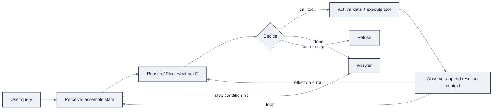

# Week 14: Agentの基礎 — Loop、Tools & Memory

> **日本語版** · [英語版](README.md) · [演習](exercises.ja.md) · [クイズ](quiz.ja.md)
> AI Engineering Labの一部 · Week 14 of 24 · Section: Agents · Category: Agent Core
> · Notebooks: [01-react-agent-from-scratch.ipynb](notebooks/01-react-agent-from-scratch.ipynb)

## 問題

ZoroLogisticsは日に何千ものfreight shipmentを出しており、customerのquestionはすべて、proseを着たdata questionです。「*S0000123はどこ？*」「*どれだけ遅れていて、refundはもらえる？*」「*lane L007の800 kilometerは何mile？*」。固定の手書きpipelineはこれに答えられません。questionが *どの* toolを必要とするかを決められないからです。shipment IDにはtracker、単位のquestionにはconverter、policyのquestionにはdocument store、そしてscope外の要求（「全recordを削除」）には何も要りません。実行時にqueryを正しいtoolにrouteできるのは、*それまでに観測したことに基づいて次のactionを選ぶ* 言語modelだけです。

その選択 — 次のstepを決めるmodelの出力 — こそ、**agent** の定義のすべてです。今週まで、programのすべてのmodel callは単一の答えを生成していました。これからは、modelが *actionのplan* を生成し、実際のtoolに対してそれを実行し、結果を読み戻し、答えられるようになるまで繰り返します。これを誤ると、failureは静かで高価です。決して止まらないloop、lookupせずにshipment statusをhallucinateするmodel、malformedな引数を黙って受け入れるtool、上限を誰も設けなかったために尽きるbudget。正しくやると、Week 24までのすべてのframeworkがその上にbuildされる、あのひとつのmental modelを自分のものにできます。beforeでは「agent」はslideの中の言葉でした。afterでは、約60行 で記憶からrebuildできます。それこそが、今週あえて **frameworkなし** でやらせることです。

## 目標

- [ ] 金曜日までに、**perceive → plan → act → observe** のloopをplain Pythonで手書きでき、次のstepを固定scheduleではなくmodelの *出力* が決める理由 — agentをpipelineから分ける唯一の性質 — を説明できる。
- [ ] 金曜日までに、toolを **JSON Schema** で宣言し、四つ（`track_shipment`、`convert_units`、`calculator`、`get_policy`）を配線して、modelが呼び出し、tool errorから自己修正できるようにできる。
- [ ] 金曜日までに、loopに **planning** と **reflection** のstepを追加し、完全なtrace（すべてのthought、action、observation）をJSONL fileに保存できる。debuggerは最終answerではなくtraceだからです。
- [ ] 金曜日までに、**guardrail** — max-step cap、token/cost budget、scope外要求のrefusal — を強制し、未見の10 scenarioにわたってagentをscoringできる。

## 日ごとの計画

| Day | Study | Run / build | Ship |
|---|---|---|---|
| **Mon** | [`reference/knowledge-base/10-agents-multiagent.md`](../../reference/knowledge-base/10-agents-multiagent.md) のloop、ReAct、tool-callingのsectionを読む（約1時間） | loopを紙にsketchする。何が入り、何が決め、何が戻るか | notesに書く「agent vs. workflow」の一段落定義 |
| **Tue** | tool calling + structured output。tool-schemaのsectionを読む（約1時間） | cell [2]〜[6] を実行: `zoro` をimport、四つのtoolを定義、registryをprint | それぞれ `"error"` key付きの `dict` を返す、四つの動くtool |
| **Wed** | planning、reflection、stopping condition（約45分） | cell [7]〜[12] を実行: `CostTracker`、二つのbrain、`react_loop` | 行ごとに読めるtraceを保存した、一回のdemo run |
| **Thu** | guardrail、permission、cost cap。failure分類（約45分） | cell [15]〜[18] を実行: reflection demo + 三つのguardrail assertion | greenな「ALL GUARDRAILS FIRED」printout |
| **Fri** | n/a | cell [19]〜[21] を実行: 10 scenarioをscoreする | 最終 `FINAL_SCORE` の数字 + 完全なJSONL trace log |
| **Sat** | n/a | [`quiz.md`](quiz.md) を受ける（8/10で合格） | scoreをtracker Notesに記録 |

## 概念

[`reference/knowledge-base/10-agents-multiagent.md`](../../reference/knowledge-base/10-agents-multiagent.md) を、今週とWeek 15〜16の概念的な背骨として読んでください。以下はその要約版、実際に打つことになる部分です。

### Agentをagentにするもの

**agent** とは、単一の答えを吐き出すためではなく、言語modelを使って *goalに向かってactionを選び、実行する* programです。仕組みは一つのloopです。現在のstate（user message、tool結果、history）を **perceive** する → 次に何をするかを **reason/plan** する → **act** する（toolを呼ぶ） → 結果を **observe** する → **stopping condition** が発火するまで繰り返し、それから最終answerを返します。Anthropicの *Building Effective Agents* は、重要な線引きをしています。model自身の出力が次のstepを決めるなら、それはagentです。stepがdeveloperによって事前に固定されているなら、それは *workflow* です。この区別をしっかり持ってください。「agentとは何か」論争のすべてが一文になったものであり、test、debug、budgetの仕方を変えるからです。

### ReAct: reasoning + acting

古典的なloopは **ReAct**、*reasoning + acting* で、Yao et al.（2022）によるものです。「考える」と「やる」を分離する代わりに、modelは自分の出力の中で **Thought → Action → Observation** を交互に織り交ぜます。このinterleaveは各turnを実際のtool結果に接地するので、hallucinationを測定可能に減らします。今呼んだばかりのtrackerが `{"status": "In Transit"}` を返したのに、modelはshipmentが「無事到着した」と主張することはできません。今週のnotebookでは、modelは毎turn一つのJSON object — `plan`、`action`、`reflect`、`answer`、`refuse` — をemitし、loopがそれぞれの種類を次のcontext messageに変えます。

### Toolsとstructured output

**Tool calling** は「Action」を実行に変えるruntimeです。toolを **name**、引数の **JSON Schema**、**description** で宣言します。modelはstructuredなcallをemitし、runtimeが検証、実行し、結果をfeed backします。いまのうちに内面化すべき、productionの二つのnuanceがあります。toolの *descriptionはprompt engineeringである*（modelはあなたが伝えたことしか知らない）こと、そして *validationは、modelがそこから自己修正できるerrorとともにfail fastすべきである* ことです。このnotebookのすべてのtoolは、raiseする代わりに失敗時に `{"error": "…"}` を返します。exceptionはloopを殺しますが、`"error"` keyはmodelにreflectionの材料を与えるからです。**Structured output** は、同じ考えの一段上です。modelをvalidでschema-conformantなJSONに制約し、その決定を人間が読み直すのではなく、codeにparseさせます。

| Tool | 何をするか | Schema引数 | registryにある理由 |
|---|---|---|---|
| `track_shipment` | IDでstatus、carrier、route、delay、on-time flagをlookup | `shipment_id: str` | 中核のdata-lookup。`zoro.data.shipments()` を読む |
| `convert_units` | kg↔lb、km↔mi、hours↔days | `value: number, from_unit, to_unit` | freight lane上の単位計算 |
| `calculator` | whitelistされた算術式を評価 | `expression: str` | freight-costの算術（`1.35 * 10 * 800`） |
| `get_policy` | IDでpolicy文書（POL-001…POL-004）を返す | `doc_id: str` | policy回答を実際のpolicy textに接地 |

### Planning、reflection、そしてstopping condition

**planning** とは、modelがactの前に短いtask listを最初に書くことです。安価で、複数stepの信頼性を改善します。このnotebookの `plan` kindは最小版です。toolを呼ぶ前に、意図するtoolを一言で述べる。それだけです。**reflection**（Reflexion、Shinn et al. 2023による）は、agentに *自己修正* をさせるupgradeです。失敗したstepの後、modelは何が悪かったかについての自然言語critiqueを書き、そのcritiqueをcontextに入れたままretryします。重みupdateなしの「verbal reinforcement learning」です。notebookは `1/0` のcalculator errorを強制し、brainがreflectしてから `2 + 2` でretryする様子を見せます。

**stopping condition** は、loopの最悪のfailure — 決して終わらないこと — に対する安全層です。modelの *意見*（「終わった？」）に依存するtermination ruleは、stopping conditionではありません。構造的にしてください。`finish` signal、**max-step cap**、**token/cost budget**、あるいはno-progress detectorです。

### Memory: scratchpad vs. long-term

今週のmemoryは **scratchpad**（in-context）です。現在のwindowの中のmessage listとtool結果。速く正確ですが、boundedで、sessionが終わると失われます。windowの *外* に永続化され、関連するときに *retrieve* されるlong-term memoryは、Week 15〜17（checkpoint、そしてOpenClawのfiles）まで登場しません。持ち歩くべきmental model: **memoryはpersistするもの。contextはloadするもの。**

### Guardrailとtrace

安全層: toolの **allowlist**、scope外要求のための **refusal path**、そして **cost cap**。`CostTracker` はtokenを `len(text) // 4` で見積もり、inputを$2.50/M、outputを$10/Mで価格付けし、$0.05のcapに対してcheckします。あくまで例示的な数字であり、本当のlessonはその *形*（meterしてからgateする）です。**trace** は、すべてのthought、action、observationをJSONL fileに書いたもので、これがdebuggerです。runのscoreが悪いときは、traceを読み、どのtool callか引数が悪かったかを見つけ、「model」ではなく *それ* を直します。

### うまくいかない理由

今週が防ぐfailure modeは、今週が引き起こしうるものでもあります。max-step capがなければ、reflectするagentは **loop non-converge** します。二つのfixが永遠に交互するか、果てしない「まだ考えています」。fail-fastなtool validationがなければ、modelは **invalid arguments** をemitし、自己修正のsignalなしに生の400を受け取ります。tool結果のgroundingがなければ、agentは **hallucinated success** を犯します。trackerが一度も確認していないshipmentを「配達済み」と報告するのです。cost capがなければ、遅いdependency一つが、spendを倍増させる **cascading retry** を引き起こします。これらはそれぞれ、[`reference/knowledge-base/10-agents-multiagent.md`](../../reference/knowledge-base/10-agents-multiagent.md) §10 のfailure分類における名前付きclassであり、今週のguardrailの一つ、あるいは `"error"`-key conventionが捕まえるために作られたものそのものです。今週のdisciplineは、すべてのfailureを *observable* にすることです。refusalが発火、step capが発火、cost capが発火し、traceがどれかを示します。

### 実例1: 一回のrunのtoken budget

demo run、`"Where is shipment S0000123 right now?"` を取り上げます。loopはsystem promptをbuildし（≈950 char → 4 char/tokenで約237 input token）、queryを加え（~38 char → 約10 token）、mock brainが `plan` を、次に `action` をemitし、`track_shipment` の結果は~200 char（約50 token）、最後の `answer` は~30 char（約8 token）です。合計 ≈ **305 token**、cost ≈ `305 / 1e6 × $10` ≈ **$0.0031**。$0.05のcapより十分に下です。今度は、capがなく、答える前に三回reflectするmodelで同じrunを想像してください。三回の余分なthought+observation往復が、runをcapの先へ、さらに重要なことに、historyがqueryを溺れさせるsignal-to-noiseの地点の先へ押しやります。capは$0.05の話ではありません。「この余分なstepは、消費したcontextの価値があったか？」というquestionを強制することです。

### 実例2: reflectionがcrashをrecoveryに変える

reflection demoを実行します。brainは `calculator("1/0")` を呼びます。`eval` がraiseし、toolは `{"error": "could not evaluate: division by zero"}` を返し、loopが `"error"` keyをfatalなexceptionではなくobservationとして扱うため、brainは `{"kind": "reflect", "reflection": "…division by zero… retry with a valid expression"}` をemitし、それから `calculator("2 + 2")` を呼び、`"2 + 2 = 4"` で終わります。四回のloop step、一回のrecovery、人間の介入ゼロ。これが、single-shot pipelineに対するreflectionの主張のすべてです。agentは *失敗を情報として使った* のです。

## Notebook walkthrough

`notebooks/01-react-agent-from-scratch.ipynb` は、「loopとは何か」からscore付きagentまでを21 cellで連れて行く、単一のnotebookです。cell [0]〜[1] は要件（`pip install
numpy pandas openai`、後者はoptional）とloopのnarrationをsetします。cell [2] と [4]〜[6] はdeterministicな世界をbuildします。`zoro.data` のlookup tableをseedし、四つのtoolと `TOOLS` registryを定義し、一つずつsmoke-testします。`track_shipment("DOES_NOT_EXIST")` の `"error"` 結果が、reflection demoのraw materialです。cell [8] は `CostTracker` をbuildします。cell [10]〜[12] は、交換可能な二つのbrain（実際のOpenAI/OpenRouter clientと、deterministicな `mock_brain` keyword classifier）と `react_loop` 自身をbuildし、毎turnをtemp directoryの `zorologistics_w14_traces.jsonl` に書き込みます。

修正対象のrunnable arc: cell [14] は一つのscenarioを実行しそのtraceをprintします。cell [16] は `1/0` を強制してreflectionをdemoします。cell [18] は三つのguardrailすべてが発火することをassertします（refusal、`max_steps`、`cost_cap`）。そして cell [19]〜[21] が **10 scenario** — 六つのtool利用case、二つのpolicy lookup、二つのrefusal — を定義し、scoreします。scenarioの *pass* は、正しいtoolが正しい引数で呼ばれ、errorが返らず、最終answerが生成されたとき（refusal caseでは、agentがrefuseしたとき）です。cell [21] が気にすべき数字をprintします: fractionとしての `FINAL_SCORE`（`1.0` は10/10を意味します）。mock brainではscoreはdeterministicで高くなります。mockが存在するのは、loop、tools、guardrails、scoring全体が **API keyなし、costなし** で動くようにするためです。実際のkey（`OPENAI_API_KEY` または `OPENROUTER_API_KEY`）に差し替えると、*同じ* loopが実際のmodelをdriveします。loopは中にどのbrainが座っているかを気にしない — というのがpointです。`react_loop` はすべてのscenarioをtemp directoryの `zorologistics_w14_traces.jsonl` にappendします。runごとに一つのJSON objectで、`run_id`、query、完全な `trace` list、`final` answer付き。だから一つのscenarioを取り出して、その決定を手でreplayできます。正しい出力は、mock brainでの `1.0`（10/10）の `FINAL_SCORE` です。mockはdeterministicなkeyword classifierなので、それより低い場合は、scenarioの `expect` blockかtoolのschemaがclassifierの産出と一致していないことであり、traceがまさにそれを示します。

## Friday: Use case

**Deliverable:** `notebooks/01-react-agent-from-scratch.ipynb` をend-to-endに実行し、以下を生成します。(a) すべてのscenario runのJSONL trace、(b) 三つのguardrail test結果、(c) 10 scenarioにわたる最終score。

**Acceptance gate（Zorost式）:** 見知らぬ人があなたのtrace fileを開き、行ごとに *agentが何をしたか* — どのtoolを、どの引数で呼び、toolが何を返し、loopがどこで止まったか — を読めること。さらに、各adversarial inputでどのguardrailが発火したか（refusal、step cap、cost cap）を正確に指し示せ、なぜ最終scoreがその値なのかを説明できること。traceなし、shipなし。

**Stretch variant:** 実際のmodel（OpenAIまたはOpenRouter）を配線し、10 scenarioを再実行して、実際のscoreをmockと比較します。traceを読んで、実際のmodelが違う振る舞いをするscenarioを *一つ* 見つけ（違うtool、違う引数format、あるいはmockがしなかったrefusal）、*なぜか* を説明するmarkdown cellを書きます。そのdiffこそ、「tool descriptionはprompt engineering」というあなたのmental modelがstress-testされる場所です。

## よくあるpitfall

| Pitfall | 見た目 | Fix |
|---|---|---|
| **Loopが決して終わらない** | agentが「考え続ける」、または二つのfixを永遠に交互する | 構造的なstop: `max_steps`、cost cap、`finish` signal。決してmodelの意見にしない |
| **Toolがerrorを返す代わりにraiseする** | 一つの悪い引数がrun全体をcrashさせる | toolは `{"error": "…"}` を返す。loopはそれをmodelがreflectできるobservationとして扱う |
| **曖昧なtool description** | queryに間違ったtoolを呼ぶ | 各 `description` をpromptらしく書く。何をするか、いつ使うか、引数formatを名指しする |
| **fail-fast validationがない** | 400 errorが、案内なしでmodelに届く | errorの中で悪いfieldと許容値を名指しする。modelが自己修正できるように |
| **tool結果がcontextを膨らませる** | historyが積み上がり、run終盤のanswerが劣化する | 大きな結果はwindowに戻す前にtrimまたは要約する |
| **「柔らかい」guardrail** | refusalがsuggestionなので、scope外要求が実行される | cell [18] のように、refusalをassertion付きのhard branchにする |
| **traceなしにanswerを信頼する** | scenarioがなぜfailしたか言えない | runごとにJSONL traceを保存する。modelやpromptに触れる前に読む |
| **mock brainをskipする** | runごとに課金されるのでiterateできない | deterministicなmockに対してloopを開発する。実際のkeyは最後に足す |

## Glossary

- **Agent**: 言語modelを使ってgoalに向かうactionを選び、実行するprogram。model自身の出力が次のstepを決める。
- **Workflow**: developerが固定したmodel stepの列（*agent* と対比）。
- **ReAct**: modelの出力の中でThought → Action → Observationを交互に織り交ぜる「reasoning + acting」pattern。
- **Tool calling**: modelのstructuredな「action」を、検証済み引数付きの実際の関数callに変えるruntime機構。
- **JSON Schema**: toolとその引数を名指しするdeclarativeな契約。modelは呼び方を決めるために読む。
- **Structured output**: modelを、proseではなくvalidでschema-conformantなdataに制約すること。
- **Planning**: modelに、actの前に短いtask listを述べさせること。
- **Reflection（Reflexion）**: 失敗の後にmodelが書き、それとともにretryする自然言語の自己critique。重みupdateなしで自己修正を可能にする。
- **Stopping condition**: loopを終わらせる構造的なrule（max step、cost cap、`finish` signal）。
- **Guardrail**: 安全control。tool allowlist、refusal path、cost/step budget、sandbox。
- **Scratchpad（短期memory）**: in-contextのmessage listとtool結果。windowでboundedされ、session終了で失われる。
- **Trace**: run内のすべてのthought、action、observationの構造化されたappend-only log。agentのdebugger。

## Self-check（quiz）

[`quiz.md`](quiz.md) を受けましょう。上のconcept *と* notebookのcell（loop、tool schema、guardrail、scoring）をcoverする10問です。**8/10で合格** です。

## Exercises

四つのgraded exerciseがあります。**Easy**（mock brainを実行してscoreを記録）、**Standard**（五つ目のtool `list_carriers` を追加）、**Stretch**（実際のmodelを配線してmockとdiffする）、**Portfolio**（program最初のinspectable agent artifactとして、agent + traceをcommit）。全文と **Hints** sectionは [`exercises.md`](exercises.md) を参照してください。

## Sources

- LangGraph documentation (conceptual target for Week 15): https://docs.langchain.com/oss/python/langgraph
- Anthropic, *Building Effective Agents*: https://www.anthropic.com/engineering/building-effective-agents
- Anthropic, *Common Workflow Patterns for AI Agents*: https://claude.com/blog/common-workflow-patterns-for-ai-agents-and-when-to-use-them
- Google Research, *ReAct: Synergizing Reasoning and Acting in Language Models*: https://research.google/blog/react-synergizing-reasoning-and-acting-in-language-models/
- Reflexion (Shinn et al., arXiv:2303.11366): https://arxiv.org/abs/2303.11366
- OpenAI, *Function calling guide*: https://platform.openai.com/docs/guides/function-calling
- OpenRouter API documentation: https://openrouter.ai/docs
- smolagents (minimal agents, "code as actions" contrast): https://github.com/huggingface/smolagents
- Pydantic AI (type-safe structured outputs): https://ai.pydantic.dev
- Zorost Intelligence, *Agent failure taxonomy*: https://zorost.com/agent-failure-taxonomy
- Zorost Intelligence: https://zorost.com
