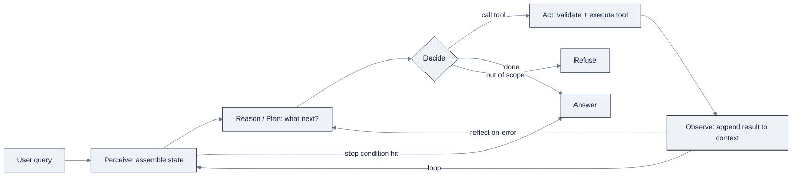

# Week 14, Agent Fundamentals: The Loop, Tools & Memory

> Part of AI Engineering Lab · Week 14 of 24 · Section: Agents · Category: Agent Core
> 🎯 Use case: Build a shipment-tracking agent from scratch, lookup, calculator, and policy tools, with no framework, so you own the loop.

## The problem

ZoroLogistics ships thousands of freight shipments a day, and every customer question is a
data question dressed in prose: *"Where is S0000123?"*, *"How late is it and do I get a
refund?"*, *"How many miles is 800 kilometers on lane L007?"*. A fixed, hand-written pipeline
cannot answer these because it cannot decide *which* of its tools a question needs, a
shipment ID needs the tracker, a unit question needs the converter, a policy question needs
the document store, and an out-of-scope ask ("delete all records") needs nothing at all. The
only thing that can route a query to the right tool at runtime is a language model that
*chooses its next action based on what it has observed so far*.

That choice, the model's output deciding the next step, is the entire definition of an
**agent**. Before this week, every model call in the program produced a single answer. Now
the model produces a *plan of action*, executes it against real tools, reads the results
back, and repeats until it can answer. Get this wrong and the failures are quiet and
expensive: a loop that never stops, a model that hallucinates a shipment status instead of
looking it up, a tool that silently accepts a malformed argument, or a budget that is
exhausted because nobody capped it. Get it right and you own the one mental model every
framework from here to Week 24 is built on. Before, "agent" was a word in a slide; after,
you can rebuild one from memory in ~60 lines, which is exactly what this week makes you do,
deliberately, with **no framework**.

## Objectives

- [ ] By Friday you can write the **perceive → plan → act → observe** loop by hand in plain Python and explain why the model's *output*, not a fixed schedule, decides the next step, the single property that separates an agent from a pipeline.
- [ ] By Friday you can declare tools with **JSON Schemas** and wire four of them (`track_shipment`, `convert_units`, `calculator`, `get_policy`) so a model can call them and self-correct from tool errors.
- [ ] By Friday you can add **planning** and a **reflection** step to the loop, and emit a full trace (every thought, action, and observation) saved to a JSONL file, because the trace, not the final answer, is the debugger.
- [ ] By Friday you can enforce **guardrails**, a max-step cap, a token/cost budget, and refusal of out-of-scope asks, and score your agent over 10 unseen scenarios.

## Day-by-day plan

| Day | Study | Run / build | Ship |
|---|---|---|---|
| **Mon** | Read the loop, ReAct, and tool-calling sections of [`reference/knowledge-base/10-agents-multiagent.md`](../../reference/knowledge-base/10-agents-multiagent.md) (≈1 hr) | Sketch the loop on paper: what goes in, what decides, what comes back | A one-paragraph definition of "agent vs. workflow" in your notes |
| **Tue** | Tool calling + structured outputs; read the tool-schema sections (≈1 hr) | Run notebook cells [2] to [6]: import `zoro`, define the four tools, print the registry | Four working tools, each returning a `dict` with an `"error"` key |
| **Wed** | Planning, reflection, stopping conditions (≈45 min) | Run cells [7] to [12]: the `CostTracker`, both brains, and the `react_loop` | One demo run with a saved trace you can read line by line |
| **Thu** | Guardrails, permissions, cost caps; the failure taxonomy (≈45 min) | Run cells [15] to [18]: reflection demo + the three guardrail assertions | A green "ALL GUARDRAILS FIRED" printout |
| **Fri** | n/a | Run cells [19] to [21]: score the 10 scenarios | The final `FINAL_SCORE` number + the full JSONL trace log |
| **Sat** | n/a | Take [`quiz.md`](quiz.md) (8/10 to pass) | Record the score in your tracker Notes |

## Concepts

Read [`reference/knowledge-base/10-agents-multiagent.md`](../../reference/knowledge-base/10-agents-multiagent.md)
as the conceptual backbone for this week and Weeks 15 to 16. What follows is the condensed,
hands-on version, the parts you will actually type.

### What makes it an agent

An **agent** is a program that uses a language model to *choose and execute actions toward a
goal* rather than to emit a single answer. The mechanics are one loop: **perceive** the
current state (user message, tool results, history) → **reason/plan** what to do next →
**act** (call a tool) → **observe** the result → repeat until a **stopping condition** fires,
then return a final answer. Anthropic's *Building Effective Agents* draws the line that
matters: if the model's own output decides the next step, it's an agent; if the steps are
fixed in advance by a developer, it's a *workflow*. Hold that distinction, it is the whole
"what is an agent" debate in one sentence, and it changes how you test, debug, and budget the
thing.

### ReAct: reasoning + acting

The classical loop is **ReAct**, *reasoning + acting*, from Yao et al. (2022). Instead of
separating "think" from "do," the model interleaves **Thought → Action → Observation** inside
its own output. Interleaving grounds each turn in real tool results, which measurably reduces
hallucination: the model cannot claim a shipment "arrived safely" if the tracker it just
called returned `{"status": "In Transit"}`. In this week's notebook the model emits a single
JSON object each turn, `plan`, `action`, `reflect`, `answer`, or `refuse`, and the loop
turns each kind into the next context message.

### Tools and structured outputs

**Tool calling** is the runtime that turns "Action" into execution. You declare a tool with a
**name**, a **JSON Schema** for its arguments, and a **description**; the model emits a
structured call; the runtime validates, executes, and feeds the result back. Two production
nuances to internalize now: a tool's *description is prompt engineering* (the model only
knows what you tell it), and *validation should fail fast with an error the model can
self-correct from*, every tool in this notebook returns `{"error": "…"}` on failure instead
of raising, because an exception would kill the loop while an `"error"` key gives the model
something to reflect on. **Structured outputs** are the same idea one layer up: constrain the
model to valid schema-conformant JSON so its decision can be parsed by code, not re-read by a
human.

| Tool | What it does | Schema argument | Why it's in the registry |
|---|---|---|---|
| `track_shipment` | Looks up status, carrier, route, delay, on-time flag by ID | `shipment_id: str` | The core data-lookup; reads `zoro.data.shipments()` |
| `convert_units` | kg↔lb, km↔mi, hours↔days | `value: number, from_unit, to_unit` | Unit math on freight lanes |
| `calculator` | Evaluates a whitelisted arithmetic expression | `expression: str` | Freight-cost arithmetic (`1.35 * 10 * 800`) |
| `get_policy` | Returns a policy document by ID (POL-001…POL-004) | `doc_id: str` | Grounds policy answers in real policy text |

### Planning, reflection, and stopping conditions

**Planning** means the model first writes a short task list before acting, cheap, and it
improves multi-step reliability. This notebook's `plan` kind is the minimal version: one
sentence stating the intended tool before calling it. **Reflection** (from Reflexion, Shinn
et al. 2023) is the upgrade that makes the agent *self-correct*: after a failed step, the
model writes a natural-language critique of what went wrong and retries with that critique in
context, "verbal reinforcement learning" with no weight updates. The notebook forces a
`1/0` calculator error and shows the brain reflect, then retry with `2 + 2`.

**Stopping conditions** are the safety layer against the loop's worst failure, never
ending. A termination rule that depends on the model's *opinion* ("am I done?") is not a
stopping condition; make it structural: a `finish` signal, a **max-step cap**, a
**token/cost budget**, or a no-progress detector.

### Memory: scratchpad vs. long-term

This week's memory is the **scratchpad** (in-context): the message list and tool results
inside the current window. It is fast and precise but bounded and lost when the session ends.
Long-term memory, facts persisted *outside* the window and *retrieved* when relevant, does
not arrive until Weeks 15 to 17 (checkpoints, then OpenClaw's files). The mental model to carry:
**memory is what you persist; context is what you load.**

### Guardrails and the trace

The safety layer: an **allowlist** of tools, a **refusal path** for out-of-scope asks, and a
**cost cap**. The `CostTracker` estimates tokens as `len(text) // 4` and prices input at
$2.50/M and output at $10/M against a $0.05 cap, deliberately illustrative numbers whose
*shape* (meter, then gate) is the real lesson. The **trace** is every thought, action, and
observation written to a JSONL file, and it is the debugger: when a run scores wrong, you
read the trace, find the exact tool call or argument that went wrong, and fix *that*, not
"the model."

### How it breaks

The failure modes this week prevents are also the ones it can cause. Without a max-step cap,
a reflecting agent **loop non-converges**, two fixes alternating forever, or an endless
"still thinking." Without fail-fast tool validation, the model emits **invalid arguments**
and gets a raw 400 back with no signal to self-correct from. Without grounding tool results,
the agent commits **hallucinated success**, reporting a shipment "delivered" that the
tracker never confirmed. And without a cost cap, one slow dependency triggers **cascading
retries** that multiply spend. Each of these is a named class in the failure taxonomy at
[`reference/knowledge-base/10-agents-multiagent.md`](../../reference/knowledge-base/10-agents-multiagent.md) §10
and each is exactly what one of this week's guardrails or the `"error"`-key convention is
built to catch. The week's discipline is to make every failure *observable*: refusal fires,
step cap fires, cost cap fires, and the trace shows which one.

### Worked example 1: the token budget on one run

Take the demo run, `"Where is shipment S0000123 right now?"`. The loop builds a system prompt
(≈950 chars → ~237 input tokens at 4 chars/token), adds the query (~38 chars → ~10 tokens),
the mock brain emits a `plan` then an `action`, the `track_shipment` result is ~200 chars
(~50 tokens), and the final `answer` is ~30 chars (~8 tokens). Total ≈ **305 tokens**, cost
≈ `305 / 1e6 × $10` ≈ **$0.0031**, comfortably under the $0.05 cap. Now imagine the same run
with no cap and a model that reflects three times before answering: three extra
thought+observation round trips push the run past the cap and, more importantly, past the
*signal-to-noise* point where history drowns the query. The cap is not about $0.05; it is
about forcing the question "was this extra step worth the context it consumed?"

### Worked example 2: reflection turns a crash into a recovery

Run the reflection demo: the brain calls `calculator("1/0")`. `eval` raises, the tool returns
`{"error": "could not evaluate: division by zero"}`, and, because the loop treats an
`"error"` key as an observation, not a fatal exception, the brain emits
`{"kind": "reflect", "reflection": "…division by zero… retry with a valid expression"}` and
then calls `calculator("2 + 2")`, ending with `"2 + 2 = 4"`. Four loop steps, one recovery,
zero human intervention. That is the entire argument for reflection over a single-shot
pipeline: the agent *used the failure as information*.

## Notebook walkthrough

`notebooks/01-react-agent-from-scratch.ipynb` is a single notebook that takes you from "what
is a loop" to a scored agent in 21 cells. Cell [0] to [1] set the requirements (`pip install
numpy pandas openai`, the latter optional) and the loop narration. Cells [2] and [4] to [6] build
the deterministic world: they seed `zoro.data` lookup tables and define the four tools plus
the `TOOLS` registry, then smoke-test each one, including `track_shipment("DOES_NOT_EXIST")`,
whose `"error"` result is the reflection demo's raw material. Cell [8] builds the
`CostTracker`; cells [10] to [12] build the two interchangeable brains (a real OpenAI/OpenRouter
client and a deterministic `mock_brain` keyword classifier) and the `react_loop` itself, which
writes every turn to `zorologistics_w14_traces.jsonl` in your temp directory.

The runnable arc to modify: cell [14] runs one scenario and prints its trace; cell [16]
demonstrates reflection by forcing `1/0`; cell [18] asserts all three guardrails fire
(refusal, `max_steps`, `cost_cap`); and cells [19] to [21] define the **10 scenarios**, six
tool-use cases, two policy lookups, two refusals, and score them. A scenario *passes* when
the right tool was called with the right arguments, no error was returned, and a final answer
was produced (or, for the refusal cases, the agent refused). Cell [21] prints the number to
care about: `FINAL_SCORE` as a fraction (e.g. `1.0` means 10/10). With the mock brain the
score is deterministic and high; the mock is there so the loop, tools, guardrails, and scoring
all run with **no API key and no cost**. Swap in a real key (`OPENAI_API_KEY` or
`OPENROUTER_API_KEY`) and the *same* loop drives a real model, the point is that the loop
does not care which brain sits inside it. `react_loop` appends every scenario to
`zorologistics_w14_traces.jsonl` in your temp directory, one JSON object per run with a
`run_id`, the query, the full `trace` list, and the `final` answer, so you can pull a single
scenario and replay its decisions by hand. Correct output is `FINAL_SCORE` of `1.0` (10/10)
under the mock brain: the mock is a deterministic keyword classifier, so any lower score means
a scenario's `expect` block or a tool's schema does not match what the classifier produces,
and the trace shows you exactly which.

## Friday: the use case

**Deliverable:** `notebooks/01-react-agent-from-scratch.ipynb` run end-to-end, producing
(a) a JSONL trace of every scenario run, (b) the three guardrail test results, and (c) a
final score over the 10 scenarios.

**Acceptance gate (Zorost-style):** a stranger can open your trace file and read, line by
line, *what the agent did*, which tool it called, with which arguments, what the tool
returned, and where the loop stopped, and you can point to exactly which guardrail fired on
each adversarial input (refusal, step cap, cost cap) and why the final score is what it is.
No trace, no ship.

**Stretch variant:** wire a real model (OpenAI or OpenRouter), re-run the 10 scenarios, and
compare the real score against the mock. Read the traces to find *one* scenario where the
real model behaves differently (a different tool, a different argument format, or a refusal
the mock didn't make) and write a markdown cell explaining *why*, that diff is where your
mental model of "tool description as prompt engineering" gets stress-tested.

## Common pitfalls

| Pitfall | What it looks like | The fix |
|---|---|---|
| **Loop never terminates** | The agent keeps "thinking" or alternates two fixes forever | A structural stop: `max_steps`, cost cap, or a `finish` signal, never the model's opinion |
| **Tool raises instead of returning an error** | One bad argument crashes the whole run | Tools return `{"error": "…"}`; the loop treats it as an observation the model can reflect on |
| **Vague tool descriptions** | The model calls the wrong tool for the query | Write each `description` like a prompt: name what it does, when to use it, and the argument format |
| **No fail-fast validation** | A 400 error reaches the model with no guidance | Name the bad field and its allowed values in the error, so the model can self-correct |
| **Tool results bloat context** | Late-run answers degrade as history piles up | Trim or summarize large results before they re-enter the window |
| **Guardrails that are "soft"** | Refusal is a suggestion, so out-of-scope asks get actioned | Make refusal a hard branch with an assertion, as cell [18] does |
| **Trusting the answer without the trace** | You can't say *why* a scenario failed | Save a JSONL trace per run; read it before touching the model or prompt |
| **Skipping the mock brain** | You can't iterate because you're paying per run | Develop the loop against the deterministic mock; add the real key last |

## Glossary

- **Agent**: a program that uses a language model to choose and execute actions toward a goal, where the model's own output decides the next step.
- **Workflow**: a fixed, developer-specified sequence of model steps (contrast with *agent*).
- **ReAct**: the "reasoning + acting" pattern that interleaves Thought → Action → Observation inside the model's output.
- **Tool calling**: the runtime mechanism that turns a model's structured "action" into a real function call with validated arguments.
- **JSON Schema**: the declarative contract that names a tool and its arguments; the model reads it to decide how to call.
- **Structured output**: constraining a model to emit valid, schema-conformant data instead of prose.
- **Planning**: having the model state a short task list before acting.
- **Reflection (Reflexion)**: a natural-language self-critique the model writes after a failure and retries with, enabling self-correction without weight updates.
- **Stopping condition**: a structural rule (max steps, cost cap, `finish` signal) that ends the loop.
- **Guardrail**: a safety control: tool allowlist, refusal path, cost/step budget, or sandbox.
- **Scratchpad (short-term memory)**: the in-context message list and tool results, bounded by the window and lost on session end.
- **Trace**: the structured, append-only log of every thought, action, and observation in a run; the agent's debugger.

## Self-check (quiz)

Take [`quiz.md`](quiz.md), 10 questions covering the concepts above *and* the notebook's
cells (the loop, the tool schemas, the guardrails, the scoring). Pass with **8/10**.

## Exercises

Four graded exercises, **Easy** (run the mock brain, record the score), **Standard** (add a
fifth tool, `list_carriers`), **Stretch** (wire a real model and diff it against the mock),
and **Portfolio** (commit the agent + traces as the program's first inspectable agent
artifact). See [`exercises.md`](exercises.md) for the full wording and the **Hints** section.

## Sources

- LangGraph documentation (conceptual target for Week 15): https://docs.langchain.com/oss/python/langgraph
- Anthropic, *Building Effective Agents*: https://www.anthropic.com/engineering/building-effective-agents
- Anthropic, *Common Workflow Patterns for AI Agents*: https://claude.com/blog/common-workflow-patterns-for-ai-agents-and-when-to-use-them
- Google Research, *ReAct: Synergizing Reasoning and Acting in Language Models*: https://research.google/blog/react-synergizing-reasoning-and-acting-in-language-models/
- Reflexion (Shinn et al., arXiv:2303.11366): https://arxiv.org/abs/2303.11366
- OpenAI, *Function calling guide*: https://platform.openai.com/docs/guides/function-calling
- OpenRouter API documentation: https://openrouter.ai/docs
- smolagents (minimal agents, "code as actions" contrast): https://github.com/huggingface/smolagents
- Pydantic AI (type-safe structured outputs): https://ai.pydantic.dev
- Zorost Intelligence, *Agent failure taxonomy*: https://zorost.com/agent-failure-taxonomy
- Zorost Intelligence: https://zorost.com
