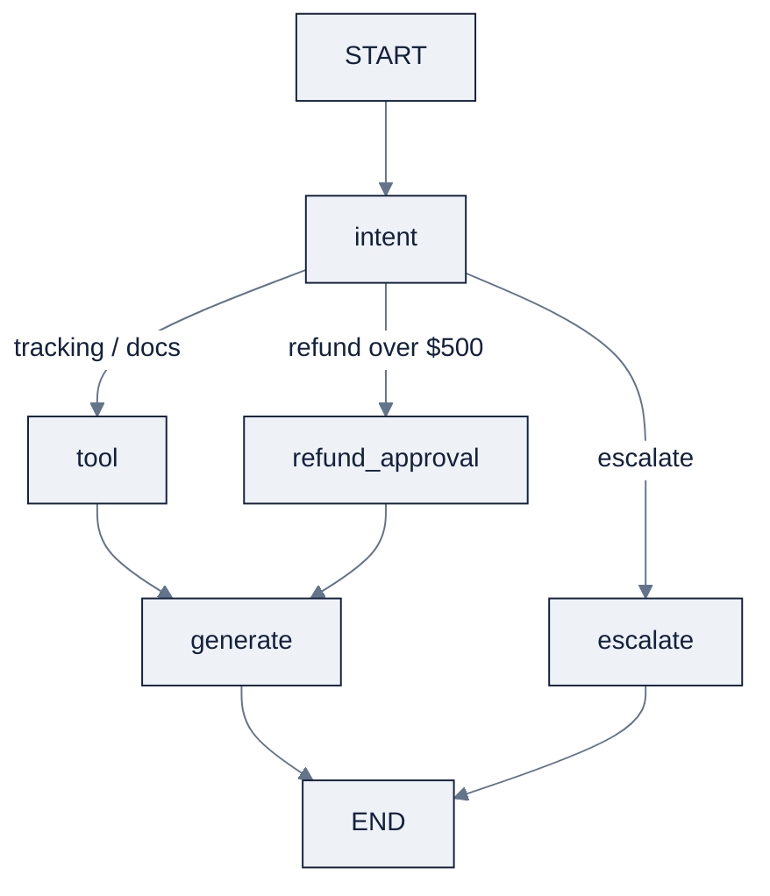

# Week 15: Agent Frameworks — LangGraphとState-Graph Model

> **日本語版** · [英語版](README.md) · [演習](exercises.ja.md) · [クイズ](quiz.ja.md)
> AI Engineering Labの一部 · Week 15 of 24 · Section: Agents · Category: Frameworks
> · Notebooks: [01-langgraph-support-agent.ipynb](notebooks/01-langgraph-support-agent.ipynb)

## 問題

Week 14の手書きloopは、stateを *暗黙に* 運んでいました。message listと、いくつかの変数と、どの行が何をしていたかというあなたの記憶の中に。demoにはそれで十分です。productionのsupport agentには、三つの固有の形で静かにfailします。第一に、**durability** がありません。agentがtracking queryを処理し、processがtool callの後、answerの前にcrashすると、run全体が失われ、restartは会話の最初からのやり直しを意味します。第二に、**audit可能なcontrol flow** がありません。routing logic（「refundはこちら、trackingはあちら」）はfunctionに埋もれた `if` 文として存在し、reviewerからは見えず、金が動く地点で *pause* することも不可能です。第三に、きれいな **resume** がありません。$900のrefundが人間のsign-offを要するとき、手書きloopには、そこで止まって人間にcontrolを渡し、まったく同じstateから続行するための組み込みの場所がありません。

frameworkは *machinery* です。boilerplate、学ぶべきAPI、運用すべきdependencyを追加します。だから、それが買ってくれるものが必要なときだけ採用します。LangGraphのstate-graph modelが買うのは、まさにその三つです。名前付きの **node** を通り **edge** に沿って流れる、**explicitでtypedなstate**。durabilityのための **checkpointing** と、human-in-the-loopのための **interrupt**。今週はWeek 14のsupport agentをLangGraphでre-implementし、どのreasoningの行がstate fieldになり、どれがedgeになったかを *見える化* します。そして、checkpoint/resumeと$500 refund-approval gateが、framework自身よりも短いcodeでは手書きできないものだからこそ、frameworkをkeepするのです。

## 目標

- [ ] 金曜日までに、agentを **state graph** としてmodel化できる。`TypedDict` のstate、stepとしてのnode、遷移としてのedge（conditional edgeを含む）。そして、explicitなstateが手書きのmessage listに勝つ理由を説明できる。
- [ ] 金曜日までに、`intent → tool → generate → escalate` のnodeと `refund_approval` gate、conditional routing、Mermaid/ASCII可視化を備えたLangGraph `StateGraph` をcompileできる。
- [ ] 金曜日までに、`MemorySaver` でrunを永続化し、run途中でcrashし、**checkpointからresume** できる。そして、checkpointが実際に何を保存するかを説明できる。
- [ ] 金曜日までに、`interrupt_before` による **human-in-the-loop** を追加して$500超のrefundがapprovalのためにpauseするようにし、end-to-end runにわたってnodeごとのlatencyとtokenを測定できる。

## 日ごとの計画

| Day | Study | Run / build | Ship |
|---|---|---|---|
| **Mon** | [`reference/knowledge-base/10-agents-multiagent.md`](../../reference/knowledge-base/10-agents-multiagent.md) §11 のstate-graphとframework選定のsectionを読む（約1時間） | Week 14のloopを読み直し、どの変数が *stateだったか* をlist化する | 「Week 14の変数 → Week 15のstate field」の対応list |
| **Tue** | LangGraphのnode/edge/conditional routing（約1時間） | cell [2]〜[6] を実行: `AgentState`、tools、`classify_intent`、`compute_refund`、五つのnode functionを定義 | `AgentState` TypedDict + 動く `classify_intent` |
| **Wed** | checkpoint、resume、time-travel（約45分） | cell [7]〜[10] を実行: graphをassemble、`MemorySaver` でcompile、一つのthreadで二つのticketを実行 | runをまたいで `history` が積もるgraph |
| **Thu** | human-in-the-loop interrupt（約45分） | cell [12] を実行: `S0000036` のrefundが `refund_approval` の前でpauseし、resumeする | 「PAUSED before refund_approval」printout + resumeされたanswer |
| **Fri** | n/a | cell [13]〜[15] を実行: 20-ticketのnodeごとのlatency/token table + routing accuracy | nodeごとのtableと `ROUTING_ACCURACY` の数字 |
| **Sat** | n/a | [`quiz.md`](quiz.md) を受ける（8/10で合格） | scoreをtracker Notesに記録 |

## 概念

今週は「loopを所有している」から「judgmentを持ってframeworkを選べる」へのbridgeです。framework比較の全文は [`reference/knowledge-base/10-agents-multiagent.md`](../../reference/knowledge-base/10-agents-multiagent.md) §11 を読んでください。以下は、実際に打つことになるstate-graph mental modelです。

### State-graph mental model

転換は、*stateの隠れた糸を引くloop* から **explicitなstate graph** への転換です。LangGraphでは、あなたのagentは `StateGraph` です。**node**（function、stepごとに一つ）を通り **edge**（遷移）に沿って流れる、単一の **state** object（`TypedDict`）。Week 14のloopがmessage listと少数の変数の中にstateを暗黙に運んでいたところで、graphはそのstateを *名前が付きtypedな契約* にします。そして、その命名こそが、frameworkの本当の力 — checkpointing、resume、interrupt — をunlockします。各nodeはpure-ishなfunction `(state) -> partial state` で、自分が変更したfieldだけを返し、frameworkが結果をshared stateにmerge backします。

今週のstate、`AgentState` は、Week 14のagentをexplicitにしたものです。

| Field | Type | 書き手 | 名前が付いている理由 |
|---|---|---|---|
| `ticket_text` | `str` | caller（初期state） | 生のcustomer message |
| `shipment_id` | `str` | `intent_node` | 抽出された `S\d{7}` id |
| `intent` | `str` | `intent_node` | `tracking` / `docs` / `refund` / `escalate` |
| `refund_amount` | `float` | `intent_node` | 計算されたrefund（valueの10%または50%） |
| `needs_approval` | `bool` | `intent_node` | `refund_amount > 500` のとき `True` |
| `tool_result` | `str` | `tool_node` | toolのanswerのJSON text |
| `final_answer` | `str` | `generate` / `escalate` / `refund_approval` | userが見るもの |
| `escalated` | `bool` | `escalate_node` | 人間が引き取る必要があったか |
| `history` | `list` | すべてのnode | checkpointerが永続化するaudit trail |

### Conditional edgeとrouter

**conditional edge** は、graphが分岐する方法です。router nodeが *key* を返し、graphがそのkeyを次のどのnodeにmapするかをlookupします。Week 14のroutingはloopの中の `if` でした。ここでは `route_after_intent(state)` が `"tool"`、`"refund_approval"`、`"escalate"` を返し、その対応を `add_conditional_edges` で宣言します。分岐はこれでdeclarativeになり可視化されます。diagramとしてprintでき、reviewerはrouting policyを、それを実装するcodeを読まずに読めます。

### Checkpoint、resume、time-travel

**checkpointing**（`MemorySaver`）は各nodeの後のstateを永続化するので、runは止まったちょうどその場所から *resume* できます。checkpointは、現在のstate全体（上の九つのfieldすべて）に加えて、thread idとgraph内の位置を保存します。どの過去stepでもrunを再構築できるだけの情報です。三つの帰結: (1) **durability**。tool nodeの後のcrashは何も失いません。resumeして続行します。(2) **会話memory**。*同じ* `thread_id` 上の二つのinvocationがstateを共有するので、`history` はcallをまたいで積もります（notebookはthread `t-1` で二つ目のticketを実行し、history lengthが伸びるのを見せます）。(3) **time-travel**。より早いcheckpointまでrewindして、別のinputでreplayできます。gimmickではなく、これはdebuggingです。`MemorySaver` はin-memoryです（labには十分）。productionは、PostgresやSQLiteなどのdurableなcheckpointerに差し替えます。

### Human-in-the-loop

**interrupt**（`interrupt_before`）は、名前付きnodeの *前で* graphをpauseし、controlをcallerにyieldします。callerはstateをinspectし、approveしてresumeするか、stateを編集してretryします。これが、Week 14の「不可逆性における人間checkpoint」をfirst-classにした機構です。refund flowでは、`interrupt_before=["refund_approval"]` は、$500超のrefundが扉の前で *止まる* ことを意味します。graphがinterruptをraiseし、callerが `needs_approval` を読み、`Command(resume={"approved": True})` だけがrunを継続させて、実際にrefundを発行させます。金が動く地点こそ、人間がsign-offする地点です。

### Streamingとmemory

このnotebookはtableをprintしますが、二つのideaはここで固定してください。**streaming** は、agentを生きていると感じさせるものです。LangGraphはstate updateをtokenごとにstreamできます。それは、state-graph modelがstateを隠れた変数ではなくfirst-class objectとしてexposeしているからこそ可能です。**sessionをまたぐmemory** は、checkpointing + thread idです。threadでkey付けされた同じstate objectこそが、history全体を再送せずに、一つのcustomer会話をrunをまたいで永続させるものです。

### Framework judgment

Anthropicのguidanceによる正直なtradeoffは、frameworkは *machinery* だということです。boilerplate、API surface、dependency。LangGraphを採用するのは、**durableでaudit可能、cyclicなcontrol flow** が要るとき — checkpoint、resume、streaming、flow途中の人間approval — です。一つのtoolを持つone-shot agentにはWeek 14のcodeで十分で、frameworkはoverheadになります。skillとは *judgment* のことです。だからfieldを知っておいてください。

| Framework | 最適な用途 | Checkpoint / HITL | MCP |
|---|---|---|---|
| **LangGraph** | durableでstateful、cyclicなcontrol flow。productionでの永続化 | first-class（checkpointer、interrupt） | Client |
| **OpenAI Agents SDK** | OpenAI model上のlightweightなagent。handoff、guardrail | Session + handoff。永続化は軽め | Client |
| **smolagents** | minimalでhackable。「code as actions」 | minimal（自前でroll） | Client |
| **Pydantic AI** | 型安全でvalidateされたstructured I/O | graphではなくcomposition | Client + server |
| **CrewAI** | role-basedな「crews」。高速なprototyping | process mode（sequential/hierarchical） | Yes |

### うまくいかない理由

state-graph modelはWeek 14のhidden-state failureを取り除き、独自のものを持ち込みます。nodeが、別のnodeがまだ必要とするfieldを上書きする *partial* stateを返すと、**silent state clobber** になります。graphは「動く」のに、answerは古い値の上にbuildされます。`interrupt_before` を忘れると、refundは人間なしで `refund_approval` をまっすぐ通過します。gateが防ぐために存在する、まさに不可逆actionのfailureです。checkpointerが `MemorySaver` なら、checkpoint *間* のprocess crashはその区間の仕事を失います。「durable」は、checkpoint頻度と同じ程度にしかdurableではありません。そして、非決定的なmodelでのreplay（同じinput、違うtemperature）は別の分岐を生みえます。**time-travel replayがdeterministicなのは、nodeがdeterministicなときだけ** です。それぞれは [`reference/knowledge-base/10-agents-multiagent.md`](../../reference/knowledge-base/10-agents-multiagent.md) §10 の名前付きfailure classであり、それぞれはassertionでtestできます。それこそが、notebookのguardrail printのためにあるものです。

### 実例1: $500 refund gate

notebookの `compute_refund(shipment_id)` は `POL-002` policyを実装します。**48時間** を超えて遅れたshipmentは申告valueの **10%** を、**7日** を超えて遅れた場合は **50%** をrefundします。shipment `S0000036` を取り上げます。>48hの遅れで申告valueが高いため、10% refundは **$500を超えます**。たとえばvalue ≈ $6,000 → refund ≈ **$600** → `needs_approval = True`。graphは `intent → refund_approval` にrouteしますが、`interrupt_before=["refund_approval"]` がsetされているため、`graph.invoke(...)` は *pause* し、callerはresumeの前に `pending state … needs_approval: True` を読みます。$12のrefund（$120のshipmentへの10% refund）なら、代わりに `intent → tool → generate` にrouteし、人間のgateは **ありません**。閾値こそが、安全設計のすべてです。

### 実例2: nodeごとのlatencyとtoken

`zoro.data.support_tickets()` からの20の実際のticketをnode functionに通し、nodeごとに集計します。得られるtableはagentのcost解剖です。どのnodeが時間とtokenを食うのか。

| Node | Calls | 役割 | そのcostが語ること |
|---|---|---|---|
| `intent` | 20 | classify + extract + refund計算 | 純粋なPython。tokenはほぼゼロ。最も安いnode |
| `tool` | ~18 | tracking/policy/refund lookup | *output* tokenを支配（JSON結果） |
| `generate` | ~18 | answerの合成 | *input* tokenを支配（prompt + tool結果） |
| `refund_approval` | refundのみ | 人間のgate | latencyは計算ではなく人間の時間 |
| `escalate` | 曖昧なticket | 引き継ぎ | まれであるべき。spikeはrouting不良の印 |

notebookは実際の数字（nodeごとの `avg_latency(ms)` と `total_tokens`）と、同じ20 ticketにわたる最終 `ROUTING_ACCURACY` — ground-truth queueへ正しくrouteされた割合 — をprintします。この二つの出力が合わさって、Week 15のevidenceです。時間と金が *どこへ* 行き、routerが *どれだけの頻度で* 正しいか。

## Notebook walkthrough

`notebooks/01-langgraph-support-agent.ipynb` は、Week 14のsupport agentを15 cellでgraphとしてrebuildします。cell [0]〜[2] は要件（`pip install langgraph openai`）とimport blockをsetします。import blockは、LangGraphがないときに同じnodeを同じ順で歩く **manual runner** にfallbackするので、nodeごとのtableとscoreは常にprintされます。cell [3]〜[4] は二つのtool（`track_shipment`、`get_policy`）、`compute_refund` policy function、`classify_intent`（実際のLLM callに差し替えるkeyword classifier）を定義します。cell [5]〜[6] は五つのnode functionと `NODE_STATS` recorderを定義します。cell [8] は `StateGraph` をassembleし、`MemorySaver(checkpointer=...)` と `interrupt_before=["refund_approval"]` でcompileし、手書きのMermaid diagramと `graph.get_graph().draw_mermaid()` の両方をprintします。

*修正すべき* 二つのcellは [10] と [12] です。cell [10] はthread `t-1` でtracking ticketを実行し、その後 *同じ* threadで二つ目のticketを実行し、checkpointされた `history` とその伸びていくlengthをprintします。それが、durableなstateとしての会話memoryです。cell [12] はrefund scenario（`S0000036`）を見つけ、`refund_amount > 500` を確認し、graphをinvokeして **refund_approvalの前でPAUSED** することを見せ、それから `Command(resume={"approved": True})` でresumeします。最後に cell [13]〜[15] が `NODE_STATS` をresetし、20 ticketをmanual runnerで実行し、nodeごとのlatency/token tableと `TOTAL latency` と `TOTAL tokens` をprintし、`classify_intent` とticketのground-truth categoryを比べて `ROUTING_ACCURACY` を計算します。「正しい」出力は、Mermaid graph、二つのrunをまたいで伸びるhistory、paused-then-resumedなrefund、筋の通った非負の数字を持つnodeごとのtable、そしてseed付きsampleで `1.0` に近い `ROUTING_ACCURACY` です。classifierはdeterministicで、toolsは純粋なfunctionなので、すべての数字はrunごとに再現可能です。唯一非決定的なcellは、`generate_node` の中のoptionalな実際のmodel `_llm` hookで、mock pathはそれをbypassします。`ROUTING_ACCURACY` が `1.0` を下回るなら、`CAT_TO_INTENT` を `classify_intent` のkeyword分岐と照らし合わせて再確認してください。routing errorが実際に棲んでいるのはgraphではなく、そのmappingです。

## Friday: Use case

**Deliverable:** `notebooks/01-langgraph-support-agent.ipynb` をend-to-endに実行し、以下を生成します。(a) ASCII/Mermaid graph diagram、(b) checkpoint + resumeのdemo、(c) pauseしてからresumeする$500超のrefund、(d) nodeごとのlatency/token tableとrouting-accuracyの数字。

**Acceptance gate（Zorost式）:** 見知らぬ人があなたのgraph diagramを読み、一つのticketをnodeをたどってtraceできること。flow途中でcrashしてcheckpointからresumeしたrun（新規startではなく）を *見せ* 、$500超のrefundがあなたがapproveするまでblockされたことを *見せ* 、checkpointが何を保存したか（state全体 + thread id + 位置）、そしてinterruptがどのnodeを守ったか（`refund_approval`）を説明できること。checkpointなし、shipなし。

**Stretch variant:** approval閾値を自分の値（例: $200）に下げ、escalate pathでJSONL recordをappendする `log_escalation` nodeを追加し、graphを再可視化し、20-ticket tableを再実行します。そのうえで、本物のcrashにします。API keyで実行し、`tool_node` の途中でraiseし、checkpointからresumeし、resumeされた最終answerがclean runと一致することを確認します。resumeしたcheckpoint idを記録してください。

## よくあるpitfall

| Pitfall | 見た目 | Fix |
|---|---|---|
| **State clobber** | nodeが、別のnodeがまだ必要とするfieldを上書きする | 変更したfieldだけを返す。`history` はappend-onlyに保つ |
| **`interrupt_before` を忘れる** | refundが、人間なしでapprovalを通過する | `interrupt_before=["refund_approval"]` をsetし、runがpauseすることをassertする |
| **in-memory checkpointはdurableでない** | checkpoint間のcrashでも仕事を失う | `MemorySaver` はlab用と理解する。productionではDB checkpointerを使う |
| **非決的なreplay** | 同じinputでtime-travelが別の分岐を生む | temperatureを `0.0` にpinし、nodeをpureに保ってreplayをdeterministicにする |
| **router keyがmappingにない** | 返されたkeyが未対応で、conditional edgeがerrorになる | `route_after_intent` は `add_conditional_edges` のmapに存在するkeyだけを返す |
| **最終answerだけを測る** | どのnodeが遅い/間違っているか言えない | nodeごとのlatency/tokenを記録し（`NODE_STATS`）、tableを読む |
| **one-shot taskにframework** | 単一tool呼び出しにLangGraph boilerplate | Week 14のplain loopを使う。checkpoint/HITLが必要なときだけframeworkを採用 |

## Glossary

- **State graph**: typedなstate objectが、名前付きのnodeをedgeに沿って流れるagentのmodel。
- **Node**: 一つのstepを表すfunction `(state) -> partial state`（classify、tool、generate…）。
- **Edge**: node間の遷移。**conditional edge** は、routerが返したkeyから次のnodeを選ぶ。
- **State（TypedDict）**: すべてのnodeが共有する、名前付きでtypedな契約。checkpointされるもの。
- **Checkpoint**: state + thread id + 位置の永続化snapshot。resumeとtime-travelを可能にする。
- **`MemorySaver`**: LangGraphのin-memory checkpointer（productionではDB checkpointerに差し替え）。
- **Thread id**: invocation群を一つのdurableな会話/memoryにgroupingするkey。
- **Human-in-the-loop（HITL）**: 不可逆stepが人間approvalのためにpauseする設計。
- **`interrupt_before`**: 名前付きnodeの前でgraphをpauseするcompile option。
- **`Command(resume=…)`**: callerがpauseしたrunをresumeする方法（新しいdata付きも可）。
- **Streaming**: graphの実行に合わせて、state/token updateを逐次emitすること。
- **Routing accuracy**: routerが正しいqueueへ送ったticketの割合。

## Self-check（quiz）

[`quiz.md`](quiz.md) を受けましょう。state-graph model、checkpoint、refund gate、notebookのnodeごとのtableをcoverする10問です。**8/10で合格** です。

## Exercises

四つのgraded exerciseがあります。**Easy**（mock brainで実行し、nodeごとのtable + diagramを記録）、**Standard**（$500閾値を変更して `log_escalation` nodeを追加）、**Stretch**（実際のcheckpointからcrashしてresume）、**Portfolio**（graph + 可視化 + approval traceをcommit）。全文と **Hints** は [`exercises.md`](exercises.md) を参照してください。

## Sources

- LangGraph overview & concepts: https://docs.langchain.com/oss/python/langgraph
- LangGraph checkpointers / persistence: https://docs.langchain.com/oss/python/langgraph/checkpointers
- LangGraph human-in-the-loop / interrupts: https://docs.langchain.com/oss/python/langgraph/human-in-the-loop
- LangGraph `StateGraph` API reference: https://reference.langchain.com/python/langgraph/
- Anthropic, *Building Effective Agents*: https://www.anthropic.com/engineering/building-effective-agents
- Anthropic, *Effective Harnesses for Long-Running Agents*: https://www.anthropic.com/engineering/effective-harnesses-for-long-running-agents
- OpenAI Agents SDK (handoffs/tracing contrast): https://github.com/openai/openai-agents-python
- smolagents (minimal-agent contrast): https://github.com/huggingface/smolagents
- Zorost Intelligence: https://zorost.com
