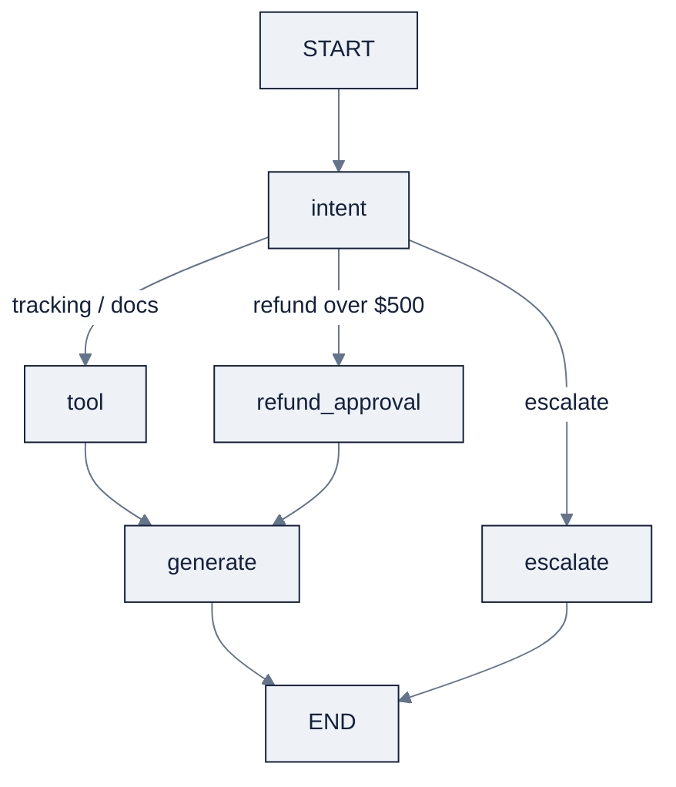

# Week 15, Agent Frameworks: LangGraph & the State-Graph Model

> Part of AI Engineering Lab · Week 15 of 24 · Section: Agents · Category: Frameworks
> 🎯 Use case: Re-implement the support agent in LangGraph with checkpoints and a human approval step for refunds over $500.

## The problem

Week 14's hand-rolled loop carried its state *implicitly*, in the message list, a handful of
variables, and your memory of which line did what. For a demo that works. For a production
support agent it quietly fails in three specific ways. First, there is no **durability**: the
agent processes a tracking query, the process crashes after the tool call but before the
answer, and the entire run is lost, restart means starting the conversation over. Second,
there is no **auditable control flow**: the routing logic ("refund goes here, tracking goes
there") lives as `if` statements buried in a function, invisible to a reviewer and impossible
to *pause* at the point where money moves. Third, there is no clean **resume**: if a refund
of $900 needs a human sign-off, a hand-rolled loop has no built-in place to stop, hand control
to a human, and continue from the exact same state.

A framework is *machinery*, it adds boilerplate, an API to learn, and a dependency to
operate, so you adopt it only when you need what it buys. LangGraph's state-graph model buys
exactly those three things: an **explicit, typed state** that flows through named **nodes**
along **edges**, with **checkpointing** for durability and **interrupts** for
human-in-the-loop. This week you re-implement the Week 14 support agent in LangGraph so you
can *see* which lines of reasoning became state fields and which became edges, and you keep
the framework only because checkpoint/resume and the $500 refund-approval gate are things you
could not hand-roll in less code than the framework itself.

## Objectives

- [ ] By Friday you can model an agent as a **state graph**, a `TypedDict` of state, nodes as steps, and edges (including conditional edges) as transitions, and explain why explicit state beats a hand-rolled message list.
- [ ] By Friday you can compile a LangGraph `StateGraph` with `intent → tool → generate → escalate` nodes plus a `refund_approval` gate, conditional routing, and a Mermaid/ASCII visualization.
- [ ] By Friday you can persist runs with `MemorySaver`, crash mid-run, and **resume from a checkpoint**, and explain what a checkpoint actually stores.
- [ ] By Friday you can add **human-in-the-loop** with `interrupt_before` so refunds over $500 pause for approval, then measure per-node latency and tokens across an end-to-end run.

## Day-by-day plan

| Day | Study | Run / build | Ship |
|---|---|---|---|
| **Mon** | Read the state-graph and framework-selection sections of [`reference/knowledge-base/10-agents-multiagent.md`](../../reference/knowledge-base/10-agents-multiagent.md) §11 (≈1 hr) | Re-read your Week 14 loop and list which variables *were* the state | A list mapping "Week 14 variable → Week 15 state field" |
| **Tue** | LangGraph nodes/edges/conditional routing (≈1 hr) | Run notebook cells [2] to [6]: define `AgentState`, tools, `classify_intent`, `compute_refund`, and the five node functions | The `AgentState` TypedDict + working `classify_intent` |
| **Wed** | Checkpointing, resume, time-travel (≈45 min) | Run cells [7] to [10]: assemble the graph, compile with `MemorySaver`, run two tickets on one thread | A graph whose `history` accumulates across runs |
| **Thu** | Human-in-the-loop interrupts (≈45 min) | Run cell [12]: the `S0000036` refund pauses before `refund_approval`, then resumes | A "PAUSED before refund_approval" printout + the resumed answer |
| **Fri** | n/a | Run cells [13] to [15]: 20-ticket per-node latency/token table + routing accuracy | The per-node table and the `ROUTING_ACCURACY` number |
| **Sat** | n/a | Take [`quiz.md`](quiz.md) (8/10 to pass) | Record the score in your tracker Notes |

## Concepts

This week is the bridge from "I own the loop" to "I can choose a framework with judgment."
Read [`reference/knowledge-base/10-agents-multiagent.md`](../../reference/knowledge-base/10-agents-multiagent.md)
§11 for the full framework comparison; what follows is the state-graph mental model you will
actually type.

### The state-graph mental model

The shift is from *a loop with a hidden thread of state* to **an explicit state graph**. In
LangGraph your agent is a `StateGraph`: a single **state** object (a `TypedDict`) that flows
through **nodes** (functions, one per step) along **edges** (transitions). Where Week 14's
loop carried state implicitly in the message list and a few variables, the graph makes that
state a *named, typed contract*, and that naming is what unlocks the framework's real
powers: checkpointing, resume, and interrupts. Each node is a pure-ish function
`(state) -> partial state` that returns only the fields it changed; the framework merges the
result back into the shared state.

This week's state, `AgentState`, is the Week 14 agent made explicit:

| Field | Type | Who writes it | Why it's named |
|---|---|---|---|
| `ticket_text` | `str` | caller (initial state) | The raw customer message |
| `shipment_id` | `str` | `intent_node` | The extracted `S\d{7}` id |
| `intent` | `str` | `intent_node` | `tracking` / `docs` / `refund` / `escalate` |
| `refund_amount` | `float` | `intent_node` | The computed refund (10% or 50% of value) |
| `needs_approval` | `bool` | `intent_node` | `True` when `refund_amount > 500` |
| `tool_result` | `str` | `tool_node` | JSON text of the tool's answer |
| `final_answer` | `str` | `generate` / `escalate` / `refund_approval` | What the user sees |
| `escalated` | `bool` | `escalate_node` | Did a human need to take over |
| `history` | `list` | every node | The audit trail, persisted by the checkpointer |

### Conditional edges and the router

**Conditional edges** are how the graph branches: the router node returns a *key*, and the
graph looks up which next node that key maps to. Week 14's routing was an `if` inside the
loop; here it is `route_after_intent(state)` returning `"tool"`, `"refund_approval"`, or
`"escalate"`, with the mapping declared in `add_conditional_edges`. The branch is now
declarative and visible, you can print it as a diagram, and a reviewer can read the routing
policy without reading the code that implements it.

### Checkpoints, resume, and time-travel

**Checkpointing** (`MemorySaver`) persists the state after every node, so a run can be
*resumed* from exactly where it stopped. A checkpoint stores the full current state (all nine
fields above) plus the thread id and the position in the graph, enough to reconstruct the run
at any prior step. Three consequences: (1) **durability**, a crash after the tool node loses
nothing; resume and continue. (2) **conversation memory**, two invocations on the *same*
`thread_id` share state, so `history` accumulates across calls (the notebook runs a second
ticket on thread `t-1` and shows the history length grow). (3) **time-travel**, you can
rewind to an earlier checkpoint and replay with different inputs, which is debugging, not a
gimmick. `MemorySaver` is in-memory (fine for the lab); production swaps in a durable
checkpointer like Postgres or SQLite.

### Human-in-the-loop

**Interrupts** (`interrupt_before`) pause the graph *before* a named node and yield control to
a caller, who inspects state and either approves and resumes or edits state and retries. This
is the mechanism for Week 14's "human checkpoint on irreversibility" made first-class. In the
refund flow, `interrupt_before=["refund_approval"]` means a refund over $500 *stops* at the
door: the graph raises an interrupt, the caller reads `needs_approval`, and only a
`Command(resume={"approved": True})` lets the run continue to actually issue the refund. The
point where money moves is exactly where the human signs off.

### Streaming and memory

Two ideas to fix in place even though this notebook prints tables instead. **Streaming** is
what makes an agent feel alive, LangGraph can stream state updates token by token, and it is
only possible because the state-graph model exposes state as a first-class object rather than
a hidden variable. **Memory across sessions** is checkpointing plus a thread id: the same
state object, keyed by thread, is what lets one customer conversation persist across runs
without re-sending the whole history.

### Framework judgment

The honest tradeoff, per Anthropic's guidance, is that a framework is *machinery*: boilerplate,
an API surface, a dependency. You adopt LangGraph **when you need durable, auditable, cyclic
control flow**, checkpoints, resume, streaming, human approval mid-flow. For a one-shot agent
with one tool, Week 14's code is fine and the framework would be overhead. The skill is the
*judgment*, so know the field:

| Framework | Best fit | Checkpoint / HITL | MCP |
|---|---|---|---|
| **LangGraph** | Durable, stateful, cyclic control flow; production persistence | First-class (checkpointers, interrupts) | Client |
| **OpenAI Agents SDK** | Lightweight agents on OpenAI models; handoffs, guardrails | Sessions + handoffs, lighter persistence | Client |
| **smolagents** | Minimal, hackable; "code as actions" | Minimal (roll your own) | Client |
| **Pydantic AI** | Type-safe, validated structured I/O | Composition, not a graph | Client + server |
| **CrewAI** | Role-based "crews"; fast prototyping | Process modes (sequential/hierarchical) | Yes |

### How it breaks

The state-graph model removes Week 14's hidden-state failures and introduces its own. If a
node returns a *partial* state that overwrites a field another node still needs, you get a
**silent state clobber**: the graph "runs" but the answer is built on a stale value. If you
forget `interrupt_before`, the refund flows straight through `refund_approval` with no human
the exact irreversible-action failure the gate exists to prevent. If the checkpointer is
`MemorySaver`, a process crash *between* checkpoints still loses that slice of work, so
"durable" is only as good as the checkpoint cadence. And replay with a non-deterministic model
(the same input, a different temperature) can produce different branches, **time-travel
replay is only deterministic if the nodes are**. Each is a named failure class in
[`reference/knowledge-base/10-agents-multiagent.md`](../../reference/knowledge-base/10-agents-multiagent.md) §10,
and each is testable with an assertion, which is exactly what the notebook's guardrail prints
are for.

### Worked example 1: the $500 refund gate

The notebook's `compute_refund(shipment_id)` implements the `POL-002` policy: a shipment more
than **48 hours** late refunds **10%** of declared value; more than **7 days** late refunds
**50%**. Take shipment `S0000036`: it is >48h late with a high declared value, so a 10% refund
lands **over $500**, say value ≈ $6,000 → refund ≈ **$600** → `needs_approval = True`. The
graph routes `intent → refund_approval`, but because `interrupt_before=["refund_approval"]` is
set, `graph.invoke(...)` *pauses* and the caller reads `pending state … needs_approval: True`
before resuming. A refund of $12 (a 10% refund on a $120 shipment) would instead route
`intent → tool → generate` with **no** human gate, the threshold is the entire safety design.

### Worked example 2: per-node latency and tokens

Run 20 real tickets from `zoro.data.support_tickets()` through the node functions and aggregate
per node. The table you get is the agent's cost anatomy, which node eats the time and tokens:

| Node | Calls | Role | What its cost tells you |
|---|---|---|---|
| `intent` | 20 | classify + extract + compute refund | Pure Python; near-zero tokens, the cheapest node |
| `tool` | ~18 | tracking/policy/refund lookup | Dominates *output* tokens (JSON results) |
| `generate` | ~18 | synthesize the answer | Dominates *input* tokens (prompt + tool result) |
| `refund_approval` | only refunds | human gate | Latency is human time, not compute |
| `escalate` | ambiguous tickets | hand-off | Should be rare; a spike means bad routing |

The notebook prints the actual numbers (`avg_latency(ms)` and `total_tokens` per node) and a
final `ROUTING_ACCURACY` over the same 20 tickets, the fraction correctly routed to their
ground-truth queue. Those two outputs together are the Week 15 evidence: *where* the time and
money go, and *how often* the router gets it right.

## Notebook walkthrough

`notebooks/01-langgraph-support-agent.ipynb` rebuilds the Week 14 support agent as a graph in
15 cells. Cells [0] to [2] set requirements (`pip install langgraph openai`) and the import
block, which falls back to a **manual runner** that walks the same nodes in the same order if
LangGraph is absent, so the per-node table and score always print. Cells [3] to [4] define the
two tools (`track_shipment`, `get_policy`), the `compute_refund` policy function, and
`classify_intent` (a keyword classifier you swap for a real LLM call). Cells [5] to [6] define
the five node functions and the `NODE_STATS` recorder; cell [8] assembles the `StateGraph`,
compiles it with `MemorySaver(checkpointer=...)` and `interrupt_before=["refund_approval"]`,
and prints both a hand-written Mermaid diagram and `graph.get_graph().draw_mermaid()`.

The two cells to *modify* are [10] and [12]. Cell [10] runs a tracking ticket on thread `t-1`
and then a second ticket on the *same* thread, printing the checkpointed `history` and its
growing length, that is conversation memory as durable state. Cell [12] finds the refund
scenario (`S0000036`), confirms `refund_amount > 500`, invokes the graph, and shows it
**PAUSED before refund_approval**, then resumes with `Command(resume={"approved": True})`.
Finally cells [13] to [15] reset `NODE_STATS`, run 20 tickets through the manual runner, print the
per-node latency/token table plus `TOTAL latency` and `TOTAL tokens`, and compute
`ROUTING_ACCURACY` by comparing `classify_intent` against the ticket's ground-truth category.
"Correct" output is: the Mermaid graph, a history that grows across two runs, a paused-then-
resumed refund, a per-node table with sensible non-negative numbers, and a `ROUTING_ACCURACY`
near `1.0` on the seeded sample. Because the classifier is deterministic and the tools are
pure functions, every number is reproducible run to run; the only non-deterministic cell is
the optional real-model `_llm` hook inside `generate_node`, which the mock path bypasses. If
`ROUTING_ACCURACY` comes out below `1.0`, re-check `CAT_TO_INTENT` against `classify_intent`'s
keyword branches, that mapping, not the graph, is where routing errors actually live.

## Friday: the use case

**Deliverable:** `notebooks/01-langgraph-support-agent.ipynb` run end-to-end, producing
(a) an ASCII/Mermaid graph diagram, (b) a checkpoint + resume demonstration, (c) a refund over
$500 that pauses for approval and then resumes, and (d) a per-node latency/token table plus the
routing-accuracy number.

**Acceptance gate (Zorost-style):** a stranger can read your graph diagram and trace one ticket
through the nodes; you can *show* a run that crashed mid-flow and resumed from a checkpoint
(not a fresh start), and *show* the refund over $500 blocked until you approved it, then
explain what the checkpoint stored (the full state + thread id + position) and which node the
interrupt guarded (`refund_approval`). No checkpoint, no ship.

**Stretch variant:** lower the approval threshold to your own value (e.g. $200), add a
`log_escalation` node that appends a JSONL record on the escalate path, re-visualize the graph,
and re-run the 20-ticket table. Then make it a *real* crash: run with an API key, raise inside
`tool_node` mid-run, resume from the checkpoint, and confirm the resumed final answer matches a
clean run, recording the checkpoint id you resumed from.

## Common pitfalls

| Pitfall | What it looks like | The fix |
|---|---|---|
| **State clobber** | A node overwrites a field another node still needs | Return only the fields you changed; keep `history` append-only |
| **Forgetting `interrupt_before`** | The refund sails through approval with no human | Set `interrupt_before=["refund_approval"]` and assert the run pauses |
| **In-memory checkpoint = not durable** | A crash between checkpoints still loses work | Understand `MemorySaver` is for the lab; use a DB checkpointer in production |
| **Non-deterministic replay** | Time-travel produces a different branch on the same input | Pin temperature to `0.0` and keep nodes pure so replay is deterministic |
| **Router key not in the mapping** | Conditional edge errors because the returned key is unmapped | Make `route_after_intent` return only keys present in the `add_conditional_edges` map |
| **Measuring only the final answer** | You can't tell which node is slow or wrong | Record per-node latency/tokens (`NODE_STATS`) and read the table |
| **Framework for a one-shot task** | LangGraph boilerplate for a single tool call | Use Week 14's plain loop; adopt the framework only for checkpoint/HITL needs |

## Glossary

- **State graph**: an agent modeled as a typed state object flowing through named nodes along edges.
- **Node**: a function `(state) -> partial state` representing one step (classify, tool, generate…).
- **Edge**: a transition between nodes; a **conditional edge** chooses the next node from a router's returned key.
- **State (TypedDict)**: the named, typed contract shared by every node; the thing that gets checkpointed.
- **Checkpoint**: a persisted snapshot of state + thread id + position, enabling resume and time-travel.
- **`MemorySaver`**: LangGraph's in-memory checkpointer (swap for a DB checkpointer in production).
- **Thread id**: the key that groups invocations into one durable conversation/memory.
- **Human-in-the-loop (HITL)**: a design where an irreversible step pauses for human approval.
- **`interrupt_before`**: a compile option that pauses the graph before a named node.
- **`Command(resume=…)`**: how the caller resumes a paused run (optionally with new data).
- **Streaming**: emitting state/token updates incrementally as the graph runs.
- **Routing accuracy**: the fraction of tickets the router sent to the correct queue.

## Self-check (quiz)

Take [`quiz.md`](quiz.md), 10 questions covering the state-graph model, checkpoints, the
refund gate, and the notebook's per-node table. Pass with **8/10**.

## Exercises

Four graded exercises, **Easy** (run the mock brain, record the per-node table + diagram),
**Standard** (change the $500 threshold and add a `log_escalation` node), **Stretch** (crash
and resume from a real checkpoint), and **Portfolio** (commit the graph + visualization +
approval trace). See [`exercises.md`](exercises.md) for full wording and **Hints**.

## Sources

- LangGraph overview & concepts: https://docs.langchain.com/oss/python/langgraph
- LangGraph checkpointers / persistence: https://docs.langchain.com/oss/python/langgraph/checkpointers
- LangGraph human-in-the-loop / interrupts: https://docs.langchain.com/oss/python/langgraph/human-in-the-loop
- LangGraph `StateGraph` API reference: https://reference.langchain.com/python/langgraph/
- Anthropic, *Building Effective Agents*: https://www.anthropic.com/engineering/building-effective-agents
- Anthropic, *Effective Harnesses for Long-Running Agents*: https://www.anthropic.com/engineering/effective-harnesses-for-long-running-agents
- OpenAI Agents SDK (handoffs/tracing contrast): https://github.com/openai/openai-agents-python
- smolagents (minimal-agent contrast): https://github.com/huggingface/smolagents
- Zorost Intelligence: https://zorost.com
