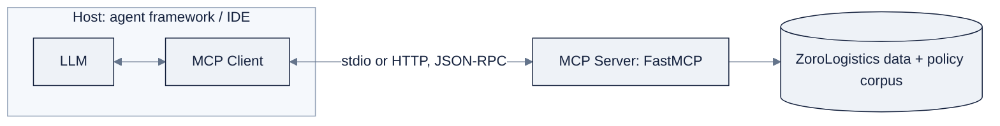

# Week 16: Multi-Agent SystemとMCP

> **日本語版** · [英語版](README.md) · [演習](exercises.ja.md) · [クイズ](quiz.ja.md)
> AI Engineering Labの一部 · Week 16 of 24 · Section: Agents · Category: Multi-Agent & Protocols
> · Notebooks: [01-mcp-server-lab.ipynb](notebooks/01-mcp-server-lab.ipynb) · [02-multiagent-triage-team.ipynb](notebooks/02-multiagent-triage-team.ipynb)

## 問題

ZoroLogistics supportは一つのjobではありません。同じshirtを着た四つのjobです。tracking questionにはshipments datasetが要り、それ以外は要りません。refund questionにはorder valueとclaims policyが、documents questionにはpolicy corpusが、そして曖昧な、あるいはabusiveなticketには人間が要ります。*すべての* toolと *すべての* contextを持つ一つのagentは、四つすべてに答えられます。そして、それこそが問題です。その単一のcontext windowは、すべてのtool descriptionとすべてのpolicy文を運びます。だからpromptは膨れ、token costは高く、一つの毒された、あるいはtopic外の会話がagent *全体* をコースから逸らせてしまいます。その一方で、すべてのtoolは一回限りのintegrationです。`track_shipment` はsupport agentに手で配線され、来月にはbilling agentが同じtoolを、別のframeworkで、ゼロからまた配線することになります。

二つの測定されたupgradeがこれをfixします。そして今週のdisciplineは、それぞれが *自分のcostに見合うこと* を証明しなければならない、ということです。**MCP**（Model Context Protocol）はtool layerを標準化します。一つのserverが `track_shipment`、`list_carriers`、`get_policy` をexposeし、*任意の* MCP clientがそれらを消費する。integrationを一度書けば、どこでも再利用できます。**Multi-agent orchestration** は仕事を分割します。supervisorが各ticketを、必要なtoolとcontextだけを持つspecialistにrouteするのです。しかし分割は無償ではありません。coordination overhead、latency、token、そして新しいfailure modeであるbad handoffを追加します。だからdeliverableはteamではありません。同じ10 ticketをteamとWeek 15 single agentの両方に通し、architectureを、box三つのdiagramではなく数字で正当化する **A/B report** です。数字がteamを正当化しないなら、single agentをshipするのがseniorの動きです。そして、それを声に出して言うことこそが、すべてのpointです。

## 目標

- [ ] 金曜日までに、`mcp` Python SDK（`FastMCP`）で `track_shipment`、`list_carriers`、`get_policy` をexposeする **MCP server** をbuildしてtestし、in-notebook MCP clientを接続してそれらを呼び出せる。
- [ ] 金曜日までに、MCPの **host / client / server** の役割と、tools/resources/promptsのprimitiveを説明でき、toolのJSON Schemaをmodelとserverの間の契約として読める。
- [ ] 金曜日までに、LangGraphで **supervisor + 三人のspecialist** からなるteamをorchestrateし、`zoro.data.support_tickets()` からの10の実際のticketをrouteできる。
- [ ] 金曜日までに、team vs. Week 15 single agentの **A/B比較** を実行できる。accuracy、latency、token、cost。そして数字から、一段落のarchitecture正当化を書ける。

## 日ごとの計画

| Day | Study | Run / build | Ship |
|---|---|---|---|
| **Mon** | [`reference/knowledge-base/10-agents-multiagent.md`](../../reference/knowledge-base/10-agents-multiagent.md) §6、§8 のmulti-agent doctrineとorchestration-pattern表、そして [`reference/knowledge-base/11-mcp-ecosystem.md`](../../reference/knowledge-base/11-mcp-ecosystem.md) のすべてを読む（約1.5時間） | Week 15 single agentを読み直し、「team」は何を変えるかをlist化する | 「teamはいつ見合うか」についての一段落note |
| **Tue** | MCP architecture + JSON-RPC transport（約1時間） | notebook 01 cell [2]〜[8] を実行: toolsを定義、`FastMCP` server fileを書く、in-notebook clientを接続 | clientがprotocol越しに3つのtoolを呼ぶserver |
| **Wed** | supervisor / manager-worker pattern（約45分） | notebook 02 cell [2]〜[8] を実行: supervisor + 三つのspecialist node、team graphをassemble | 10 ticketをrouteするtriage graph |
| **Thu** | A/B測定（約45分） | notebook 02 cell [9]〜[12] を実行: single-agent baseline + 10-ticket A/B | A/B table（accuracy / latency / tokens / cost） |
| **Fri** | n/a | cell [13]〜[14] を実行: 数字から正当化を書く | `TEAM_ACCURACY`、`SINGLE_ACCURACY`、`ACCURACY_DELTA` + 書かれた正当化 |
| **Sat** | n/a | [`quiz.md`](quiz.md) を受ける（8/10で合格） | scoreをtracker Notesに記録 |

## 概念

二つのhalfがあり、それぞれがWeek 15からの測定された一歩上です。完全な扱いは [`reference/knowledge-base/10-agents-multiagent.md`](../../reference/knowledge-base/10-agents-multiagent.md) と [`reference/knowledge-base/11-mcp-ecosystem.md`](../../reference/knowledge-base/11-mcp-ecosystem.md) を読んでください。

### MCP: N個のintegrationの代わりに一つのprotocol

**MCP** は「AI integrationのUSB-C」です。toolごとのbespoke integrationの代わりに、任意のMCP clientが任意のMCP serverの能力を使えるようにするclient-server protocolです。三つの役割: **host** はLLMを動かし、connectionを開始します（Claude Desktop、IDE、agent framework）。**client** はhostの中に住み、serverごとに一つのconnectionを持ちます。**server** は能力をexposeし、通常は外部systemごとに一つです。serverがexposeできる三つのprimitive:

| Primitive | 何であるか | ZoroLogisticsでの例 |
|---|---|---|
| **Tools** | modelがinvokeするfunction（modelが呼び、serverが実行する） | `track_shipment(shipment_id)` |
| **Resources** | modelが読むcontext/data（file、record、row） | policy文書、lane table |
| **Prompts** | modelが使える、再利用可能なprompt template | 「このtracking eventを要約して」 |

messageは、**stdio**（local subprocess。notebookが使うもの）または **Streamable HTTP**（remote/hosted）上の **JSON-RPC 2.0** です。鍵となるartifactは **tool schema**、toolとその引数を名指しするJSON Schemaです。modelが呼び出しを決めるときに読む、まさに契約だからです。これは今週を、Week 14の「toolのdescriptionはprompt engineeringである」という考えへまっすぐつなぎ、それをprotocolとして標準化します。

### Multi-agent: 最初のlessonはrestraint

**multi-agent** は、taskを複数のagentにまたがって分割します。それぞれが自分のinstructions、tools、そして（多くの場合）自分のcontext windowを持ちます。benefitは本物ですが *条件付き* です。**context isolation**（各agentは必要なものだけを見る）、**role specialization**（jobごとに異なるpromptとtool）、**並列性**、そして **failure isolation**。costは: coordination overhead、latency、token、そして **bad handoff**。Anthropicのguidanceはぶっきらぼうです。よくpromptされた一つのagentと良いtoolから始め、複数の *agent* の前に *workflow* を追加し、測定されたbenefitがcostを上回るときにだけ分割しなさい。あなたがbuildするarchitecture、**supervisor + specialist**（manager-worker pattern）は、最初に学ぶ価値のあるconservativeなdefaultです。supervisorが一度classifyしてrouteし、各specialistが自分のtoolで一つのjobをし、supervisorが（`synthesize` node経由で）answerを組み立てます。

| Pattern | 仕組み | 最適なとき | 注意点 |
|---|---|---|---|
| **Supervisor / manager-worker** | 一つのorchestratorがdecompose、delegate、synthesisする | 一つのgoalの下の多様なsubtask。中央control | managerがbottleneckになる。contextが膨らむ |
| **Sequential pipeline** | 固定された下流順序（extract → validate → publish） | 安定した既知の順序 | それは *multi-agent system* ではなく *workflow* です |
| **Handoffs** | 会話の途中で、agentからagentへcontrolが渡る | 専門性が変わっていく一つのthread | handoffをまたいで共有contextを保つこと |
| **Debate / peer-review** | 複数のagentが解き/critiqueし、それから調整する | costに見合う難しいreasoning | 数倍のcostとlatency |
| **Swarm** | 同質な多数のagent、創発的なcoordination | research/demoの領域 | productionでは制御が難しい |

すべてのpatternの下には、一つのarchitectural forkがあります。**shared memory**（すべてのagentがread/writeするblackboard store。柔軟だがstalenessを引き継ぐ）vs. **message passing**（明示的なagent間call、またはA2A。typedでaudit可能だが結合はよりきつい）。production systemは通常、hybridです。controlにはmessage passing、durableなstateにはshared store。

### MCP vs. A2A

MCPは *capability* layerで、一つのagentをtoolとdataにつなぎます。**agent-to-agent protocolではありません**。それは **A2A**（GoogleのAgent2Agent）の役割で、あるagentが別のagentに仕事をどうdiscoveryし、記述し、delegateするかを、**Agent Card** と長時間実行の **task** を通じて標準化します。二つは補完的です。agentがlocalで使うtoolにはMCP、network越しに別のagentへ仕事を渡すときにはA2Aです。

| | MCP | A2A |
|---|---|---|
| 目的 | 一つのagentにtool/dataへのaccessを与える | agent同士がsystemをまたいで会話する |
| 層 | Capability（「このAPIにagentをつなぐ」） | Interop（「third-party agentにdelegateする」） |
| 典型的なtransport | stdio / HTTP | 公開されたAgent Card付きのnetwork service |

### 測定のdiscipline

今週のdeliverableは、opinionではなく **A/B report** です。同じ10 ticketをteam（`team_run`）とWeek 15 single agent（`single_run`）に通し、**accuracy、latency、token、cost** を並べて比較します。予想され、かつ正しいfindingは、多くの場合こうです。single agentがlatencyとcostで勝ち、teamがaccuracyで勝つのは狭いsliceだけ。あなたのjobは、*どのsliceかを言い*、*数字から正当化する* ことです。tableで擁護できないmulti-agent systemはdemoです。できるものはengineering decisionです。

### うまくいかない理由

MCPはmodelに *行動する* 能力を渡すので、各serverは **privilege boundary** です。failure modeは、Week 14のguardrailをprotocol層で書き直したものです。**gateなしでexposeされたwrite tool**（HITLなしの `request_refund`）は、不可逆actionのfailureです。このlabのread toolは安全で、write toolはWeek 15のinterruptでgateできるようになるまで、意図的にlabから外されています。**schema drift** — serverのtoolが変わったのに、clientのcache済みschemaが古い — は、Week 14と同じ「invalid arguments」classを、protocol境界を越えて生みます。**malicious、または信頼できないserver** は、modelをsteerする細工されたcontentを返しえます（prompt injection）。だから出所が重要です。multi-agent側の新しいfailureは **bad handoff** です。supervisorがticketを誤routeする、あるいはspecialistが、synthesizerが上書きしてしまったstate fieldを受け取る。そして *測定自身* も壊れえます。二つのarmが違うticketを実行したA/B、あるいは「cost」がsupervisorのhandoff tokenを無視したA/Bは、teamを甘く見せる比較です。それぞれは [`reference/knowledge-base/10-agents-multiagent.md`](../../reference/knowledge-base/10-agents-multiagent.md) §10 の名前付きclassにmapされ、fixは同じreflexです。observableにして、それからgateする。

### 実例1: MCP round trip

in-notebook clientはserverをstdio subprocessとして起動し（`StdioServerParameters(command=sys.executable, args=[server_file])`）、`initialize()` を呼び、それから `list_tools()` が三つのschemaを返し、`call_tool("track_shipment",
{"shipment_id": "S0000123"})` がtracking recordを *protocol越しに* 返します。notebookは `ROUND_TRIP_TOOLS = 3` をprintします。clientがerrorなしに呼んだtoolの数です。`track_shipment` のschemaは、契約の縮図です: `{"type": "object", "properties":
{"shipment_id": {"type": "string"}}, "required": ["shipment_id"]}`。modelが `{"shipment_id": 123}`（stringではなくint）をemitしたら、serverはそれを拒否し、modelは自己修正します。Week 14と同じfail-fast validationが、今度はprotocolのschemaによって強制されます。

### 実例2: A/B cost-quality table

10のseeded ticketを両方のarmに通します。`team_run` はsupervisor → specialist → synthesizeと歩き、handoff + synthesis overheadとして固定の `+200` tokenを課します。`single_run` は、handoffなしのclassify → tool → answerを実行します。代表的な（そして *正しい*）結果:

| Metric | Team | Single | Delta |
|---|---|---|---|
| Routing accuracy | 0.9 | 0.9 | 0.0 |
| Avg latency（ms） | higher | lower | teamのほうが遅い |
| Total tokens | higher（handoff + synthesis） | lower | team +N token |
| Total cost（$） | higher | lower | team +$ |

この10 ticketでは、intentの分類は容易で、toolは安く、isolated contextや並列仕事を必要とするものは何もありません。だからteamは、accuracy gainなしにhandoffへより多くのtokenを使い、notebookの正当化はまさにそれを言います: *the team is NOT justified for this slice*（このsliceではteamは正当化されない）。それがseniorのfindingであり、acceptance gateが報いるものです。teamがcostに見合うのは、specialistが別々のcontext windowを、specialistごとのtoolを、あるいは一つのpromptには収まらないticketへの並列実行を必要とするときだけです。

## Notebook walkthrough

二つのnotebookで、`zoro` data以外に共有するstateはありません。

`notebooks/01-mcp-server-lab.ipynb`（API key不要）は、11 cellでserver側をbuildします。cell [2]〜[4] はlookup tableをseedし、三つのplain functionを定義し、`FastMCP` がtype hintから導出するものと同じ内容の手書き `MANUAL_SCHEMAS` を書きます。cell [6] は、self-containedな `server.py` をtemp dirに書き、stdio subprocessとして実行します。**MCP Inspector**（`npx @modelcontextprotocol/inspector python <server_file>`）が使うのとまったく同じpatternで、agentに配線する前にserverを対話的にdebugするのがこれです。cell [8]〜[10] はin-notebook clientを接続し、三つのtoolすべてをprotocol越しに呼び、`list_tools()` が返す実際のschema JSONをprintします（SDKがない場合はmanual schemaにfallback）。cell [11] が最後の数字をprintします: `ROUND_TRIP_TOOLS`。

`notebooks/02-multiagent-triage-team.ipynb` は、14 cellでteamをbuildします。cell [2]〜[6] は、ground-truthのmapping（`CAT_TO_ROUTE`）、specialistごとのtool、`supervisor_classify`、そして六つのnode function（`supervisor`、`tracking`、`refunds`、`docs`、`synthesize`、`escalate`）を定義します。cell [8] は、`supervisor` から四つのrouteへのconditional edge付きで `StateGraph` をassembleし、LangGraphがあってもなくても動くmanual walkerである `team_run` を定義します。cell [10] は、handoffなしに *すべての* toolを運ぶ、Week-15 baselineの `single_run` を定義します。cell [12]〜[14] は同じ10 ticketを両方のarmに通し、A/B tableをprintし、それから `TEAM_ACCURACY`、`SINGLE_ACCURACY`、`ACCURACY_DELTA` を計算し、自動生成された正当化をprintします。「正しい」出力: teamのMermaid graph、ticketごとのroute table、A/B summary、そして *結論* が *数字* と一致する正当化paragraph — seeded sampleでは「the team is NOT justified for this slice」です。二つのnotebookが共有するのは `zoro` importだけで、どちらを先に実行しても構いません。MCP labにkeyは不要で、triage labのclassifierもkeyなしで動きます（実際のmodel hookは、swap-in用のcommentです）。記録すべき三つの数字は、`ROUND_TRIP_TOOLS`（notebook 01から）、そして `TEAM_ACCURACY` / `SINGLE_ACCURACY` と `ACCURACY_DELTA`（notebook 02から）で、最後のものは、正当化のすべてを一つの符号付き数字にまとめたものです。

## Friday: Use case

**Deliverable:** 二つのnotebookをend-to-endに実行し、以下を提出します。(a) tool schemaを見せる、動くMCP server + client round-trip、(b) triage teamのsingle agentに対するA/B report（accuracy、latency、token、cost）と書かれたarchitecture正当化。

**Acceptance gate（Zorost式）:** 見知らぬ人があなたのMCP clientを実行して、`track_shipment` がprotocol越しに呼ばれるのを見られ、A/B tableと、そのtable *から* あなたが書いた正当化を読めること。この10 ticketでteamがsingle agentに勝つ（あるいは正直に負ける）理由を、cellごとに擁護できること。A/B tableなし、shipなし。

**Stretch variant:** 四つ目のspecialist（`billing`）を、独自のrouting rule付きで追加し、同じ10 ticketでA/Bを再実行し、新しい数字で正当化を書き直します。四つ目のspecialistがaccuracy deltaを *変えた* 場合は、routing tableから *なぜか* を説明します。specialistがcoordination costに見合っているのか、diagramにboxを一つ追加しているだけなのかが、そこで分かります。

## よくあるpitfall

| Pitfall | 見た目 | Fix |
|---|---|---|
| **要らない問題にteam** | single agentと同じaccuracyで、tokenはより多い | single agentをshipする。正当化でそう言う |
| **Bad handoff** | supervisorが誤routeする、またはsynthesizerが必要とするfieldが上書きされた | routingをdeterministic + test済みにする。stateはappend-onlyに保つ |
| **write toolがungate** | approvalなしで `request_refund` が実行される | write toolは、Week 15のinterruptがgateできるようになるまで外に出さない。readはallowlist |
| **Schema drift** | clientのcache済みschema ≠ serverの現在のtool | server変更後に `list_tools()` を再実行する。schemaを契約として扱う |
| **信頼できないserver** | 細工されたtool出力がmodelをsteerする（prompt injection） | 信頼するserverだけを接続する。versionをpinする。exposeするtoolをreviewする |
| **不公平なA/B** | 違うticket、あるいはhandoff tokenを無視したcost | 両armに同じ10 ticket。supervisor + synthesisのtokenを数える |
| **schema description内のsecret** | API keyがmodelのcontextにleakする | credentialはserver側でenv varから注入する。tool出力には決して入れない |
| **Inspectorをskip** | serverとagentを同時にdebugする | まずMCP Inspectorですべてのtoolをtestし、serverを切り分ける |

## Glossary

- **MCP（Model Context Protocol）**: appがmodelにtool、resource、promptへのaccessを与える方法を標準化する、openなclient-server protocol。
- **Host**: LLMを動かし、MCP connectionを開始するapplication。
- **Client**: serverごとに一つのconnectionを持つ、hostの中のcomponent。
- **Server**: protocol越しに能力をexposeするprocess。通常は外部systemごとに一つ。
- **Tool schema**: toolとその引数を名指しするJSON Schema。modelが読む契約。
- **`FastMCP`**: MCP serverをbuildするための、high-levelなPython SDK decorator API。
- **Supervisor / manager-worker**: 一つのagentがdecompose、delegate、synthesisするorchestration pattern。
- **Context isolation**: 各agentが必要なtool/contextだけを見て、windowを小さく保つこと。
- **Bad handoff**: agent間のroutingまたはstate移転の失敗。
- **A2A（Agent2Agent）**: MCPと補完的な、agent間delegationのためのGoogleのprotocol。
- **A/B report**: architectureの選択を正当化する、side-by-sideの比較（accuracy、latency、token、cost）。
- **MCP Inspector**: 配線する前にserverのtoolをlistして呼ぶための、対話的なtool。

## Self-check（quiz）

[`quiz.md`](quiz.md) を受けましょう。MCPの役割/transport、orchestration pattern、A/B notebookの数字をcoverする10問です。**8/10で合格** です。

## Exercises

四つのgraded exerciseがあります。**Easy**（MCP labを実行し、`track_shipment` のschemaを記録）、**Standard**（四つ目のMCP tool `get_bol` を追加）、**Stretch**（四つ目のspecialistを追加してA/Bを再実行）、**Portfolio**（server、team、A/B reportをcommit）。全文と **Hints** は [`exercises.md`](exercises.md) を参照してください。

## Sources

- MCP specification, Architecture: https://modelcontextprotocol.io/specification/2025-03-26/architecture
- MCP Python SDK (FastMCP): https://github.com/modelcontextprotocol/python-sdk
- MCP Inspector: https://github.com/modelcontextprotocol/inspector
- LangGraph documentation: https://docs.langchain.com/oss/python/langgraph
- Anthropic, *Building Multi-Agent Systems (when and how)*: https://claude.com/blog/building-multi-agent-systems-when-and-how-to-use-them
- Anthropic, *Common Workflow Patterns for AI Agents*: https://claude.com/blog/common-workflow-patterns-for-ai-agents-and-when-to-use-them
- Google, *Announcing the Agent2Agent Protocol (A2A)*: https://developers.googleblog.com/en/a2a-a-new-era-of-agent-interoperability/
- awesome-mcp-servers (server ecosystem): https://github.com/punkpeye/awesome-mcp-servers
- Nous Research Hermes Agent (A2A reference): https://github.com/NousResearch/hermes-agent
- Zorost Intelligence: https://zorost.com
