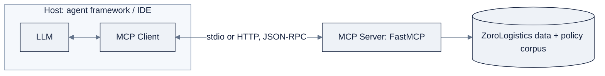

# Week 16: Multi-Agent Systems & MCP

> Part of AI Engineering Lab · Week 16 of 24 · Section: Agents · Category: Multi-Agent & Protocols
> 🎯 Use case: A support triage team, a supervisor + three specialists (tracking, refunds, docs), over MCP-exposed ZoroLogistics tools, A/B tested against the Week 15 single agent.

## The problem

ZoroLogistics support is not one job; it is four jobs wearing the same shirt. A tracking
question needs the shipments dataset and nothing else; a refund question needs order value and
the claims policy; a documents question needs the policy corpus; and an ambiguous or abusive
ticket needs a human. One agent with *all* tools and *all* context can answer all four, and
that is exactly the problem. Its single context window carries every tool description and every
policy passage, so its prompt is bloated, its token cost is high, and one poisoned or off-topic
conversation can steer the *whole* agent off course. Meanwhile, every tool is a one-off
integration: `track_shipment` is wired into the support agent by hand, and next month the
billing agent needs the same tool wired again, from scratch, in a different framework.

Two measured upgrades fix this, and the week's discipline is that each must *earn its cost*.
**MCP** (Model Context Protocol) standardizes the tool layer so one server exposes
`track_shipment`, `list_carriers`, and `get_policy` and *any* MCP client consumes them, write
the integration once, reuse it everywhere. **Multi-agent orchestration** splits the work so a
supervisor routes each ticket to a specialist that carries only the tools and context it needs.
But splitting is *not* free: it adds coordination overhead, latency, tokens, and a new failure
mode, the bad handoff. So the deliverable is not a team; it is an **A/B report** that runs the
same 10 tickets through the team and through the Week 15 single agent, and justifies the
architecture from numbers, not from a diagram with three boxes. If the numbers don't justify
the team, shipping the single agent is the senior move, and saying so out loud is the whole
point.

## Objectives

- [ ] By Friday you can build and test an **MCP server** with the `mcp` Python SDK (`FastMCP`) exposing `track_shipment`, `list_carriers`, and `get_policy`, and connect an in-notebook MCP client to call them.
- [ ] By Friday you can explain the MCP **host / client / server** roles and the tools/resources/prompts primitives, and read a tool's JSON Schema as the contract between model and server.
- [ ] By Friday you can orchestrate a **supervisor + three specialists** team in LangGraph and route 10 real tickets from `zoro.data.support_tickets()`.
- [ ] By Friday you can run an **A/B comparison** of the team vs. the Week 15 single agent, accuracy, latency, tokens, and cost, and write a one-paragraph architecture justification from the numbers.

## Day-by-day plan

| Day | Study | Run / build | Ship |
|---|---|---|---|
| **Mon** | Read the multi-agent doctrine and orchestration-pattern tables in [`reference/knowledge-base/10-agents-multiagent.md`](../../reference/knowledge-base/10-agents-multiagent.md) §6, §8, plus all of [`reference/knowledge-base/11-mcp-ecosystem.md`](../../reference/knowledge-base/11-mcp-ecosystem.md) (≈1.5 hr) | Re-read your Week 15 single agent and list what a "team" would change | A one-paragraph "when is a team worth it" note |
| **Tue** | MCP architecture + JSON-RPC transport (≈1 hr) | Run notebook 01 cells [2] to [8]: define tools, write the `FastMCP` server file, connect the in-notebook client | A server whose 3 tools the client calls through the protocol |
| **Wed** | Supervisor / manager-worker pattern (≈45 min) | Run notebook 02 cells [2] to [8]: the supervisor + three specialist nodes, assemble the team graph | A triage graph that routes 10 tickets |
| **Thu** | A/B measurement (≈45 min) | Run notebook 02 cells [9] to [12]: the single-agent baseline + the 10-ticket A/B | The A/B table (accuracy / latency / tokens / cost) |
| **Fri** | n/a | Run cells [13] to [14]: write the justification from the numbers | `TEAM_ACCURACY`, `SINGLE_ACCURACY`, `ACCURACY_DELTA`, + the written justification |
| **Sat** | n/a | Take [`quiz.md`](quiz.md) (8/10 to pass) | Record the score in your tracker Notes |

## Concepts

Two halves, each a measured step up from Week 15. Read
[`reference/knowledge-base/10-agents-multiagent.md`](../../reference/knowledge-base/10-agents-multiagent.md) and
[`reference/knowledge-base/11-mcp-ecosystem.md`](../../reference/knowledge-base/11-mcp-ecosystem.md) for the full
treatment.

### MCP: one protocol instead of N integrations

**MCP** is the "USB-C for AI integrations": a client-server protocol so any MCP client can use
any MCP server's capabilities, instead of a bespoke integration per tool. Three roles: a
**host** runs the LLM and initiates connections (Claude Desktop, an IDE, an agent framework); a
**client** lives inside the host and holds one connection per server; a **server** exposes
capabilities, usually one per external system. Three primitives a server can expose:

| Primitive | What it is | ZoroLogistics example |
|---|---|---|
| **Tools** | Model-invoked functions (the model calls, the server executes) | `track_shipment(shipment_id)` |
| **Resources** | Context/data the model reads (files, records, rows) | A policy document, a lane table |
| **Prompts** | Reusable prompt templates the model can use | "Summarize this tracking event" |

Messages are **JSON-RPC 2.0** over **stdio** (local subprocess, what the notebook uses) or
**Streamable HTTP** (remote/hosted). The key artifact is the **tool schema**, the JSON Schema
that names a tool and its arguments, because it is the exact contract the model reads when
deciding to call. That connects this week straight back to Week 14's "a tool's description is
prompt engineering," now standardized as a protocol.

### Multi-agent: the first lesson is restraint

**Multi-agent** splits a task across more than one agent, each with its own instructions, tools,
and (often) its own context window. The benefits are real but *conditional*: **context
isolation** (each agent sees only what it needs), **role specialization** (different prompts and
tools per job), **parallelism**, and **failure isolation**. The costs: coordination overhead,
latency, tokens, and **bad handoffs**. Anthropic's guidance is blunt: start with one
well-prompted agent plus good tools, add *workflows* before multiple *agents*, and split only
when a measured benefit outweighs the cost. The architecture you build, **supervisor +
specialists** (a manager-worker pattern), is the conservative default worth learning first: a
supervisor classifies once and routes, each specialist does one job with its own tools, and the
supervisor (via a `synthesize` node) assembles the answer.

| Pattern | How it works | Best when | Watch out for |
|---|---|---|---|
| **Supervisor / manager-worker** | One orchestrator decomposes, delegates, synthesizes | Varied subtasks under one goal; central control | Manager is a bottleneck; its context balloons |
| **Sequential pipeline** | Fixed downstream order (extract → validate → publish) | Stable, known order | It's a *workflow*, not a multi-agent system |
| **Handoffs** | Control passes agent-to-agent mid-conversation | One thread with changing expertise | Preserve shared context across the handoff |
| **Debate / peer-review** | Several agents solve/critique, then reconcile | Hard reasoning worth the cost | Several × cost and latency |
| **Swarm** | Many homogeneous agents, emergent coordination | Research/demo territory | Hard to control in production |

Underneath all patterns sits one architectural fork: **shared memory** (a blackboard store all
agents read/write, flexible but you inherit staleness) vs. **message passing** (explicit
agent-to-agent calls or A2A, typed and auditable but tighter coupling). Production systems are
usually a hybrid: message passing for control, a shared store for durable state.

### MCP vs. A2A

MCP is a *capability* layer, it connects one agent to tools and data. It is **not** an
agent-to-agent protocol; that is **A2A** (Agent2Agent, from Google), which standardizes how one
agent discovers, describes, and delegates work to another via an **Agent Card** and long-running
**tasks**. They are complementary: MCP for the tools an agent uses locally, A2A when it hands
work to another agent over a network.

| | MCP | A2A |
|---|---|---|
| Purpose | Give a single agent access to tools/data | Let agents talk to agents across systems |
| Layer | Capability ("connect my agent to this API") | Interop ("delegate to a third-party agent") |
| Typical transport | stdio / HTTP | Network service with a published Agent Card |

### The measurement discipline

The week's deliverable is an **A/B report**, not an opinion. You run the same 10 tickets
through the team (`team_run`) and through the Week 15 single agent (`single_run`), and compare
**accuracy, latency, tokens, and cost** side by side. The expected, and correct, finding is
usually that the single agent wins on latency and cost while the team wins on accuracy only for
a narrow slice; your job is to *say which slice* and *justify from the numbers*. A multi-agent
system you cannot defend with a table is a demo; one you can is an engineering decision.

### How it breaks

MCP hands a model the ability to *act*, so each server is a **privilege boundary**, the failure
modes are the Week 14 guardrails re-expressed at the protocol layer. A **write tool exposed
ungated** (a `request_refund` with no HITL) is the irreversible-action failure; the read tools
here are safe, and the write tool is deliberately absent from the lab until Week 15's interrupt
can gate it. **Schema drift**, the server's tool changes but the client's cached schema is
stale, produces the same "invalid arguments" class as Week 14, now across a protocol boundary.
A **malicious or untrusted server** can return crafted content that steers the model (prompt
injection), so provenance matters. On the multi-agent side, the new failure is the **bad
handoff**: the supervisor misroutes a ticket, or a specialist receives a state field the
synthesizer overwrote. And the *measurement* itself can break: an A/B where the two arms ran
different tickets, or where "cost" ignored the supervisor's handoff tokens, is a comparison that
flatters the team. Each maps to a named class in
[`reference/knowledge-base/10-agents-multiagent.md`](../../reference/knowledge-base/10-agents-multiagent.md) §10,
and the fix is the same reflex: make it observable, then gate it.

### Worked example 1: the MCP round trip

The in-notebook client launches the server as a stdio subprocess
(`StdioServerParameters(command=sys.executable, args=[server_file])`), calls `initialize()`,
then `list_tools()` returns the three schemas and `call_tool("track_shipment",
{"shipment_id": "S0000123"})` returns the tracking record *through the protocol*. The notebook
prints `ROUND_TRIP_TOOLS = 3`, the number of tools the client called without error. The schema
for `track_shipment` is the contract in miniature: `{"type": "object", "properties":
{"shipment_id": {"type": "string"}}, "required": ["shipment_id"]}`. If the model emits
`{"shipment_id": 123}` (an int, not a string), the server rejects it and the model self-corrects
the same fail-fast validation as Week 14, now enforced by the protocol's schema.

### Worked example 2: the A/B cost-quality table

Run the 10 seeded tickets through both arms. `team_run` walks supervisor → specialist →
synthesize, charging a fixed `+200` tokens for the handoff + synthesis overhead; `single_run`
does classify → tool → answer with no handoff. A representative (and *correct*) outcome:

| Metric | Team | Single | Delta |
|---|---|---|---|
| Routing accuracy | 0.9 | 0.9 | 0.0 |
| Avg latency (ms) | higher | lower | team slower |
| Total tokens | higher (handoffs + synthesis) | lower | team +N tokens |
| Total cost ($) | higher | lower | team +$ |

On these 10 tickets the intents are easy to classify, the tools are cheap, and nothing needs
isolated context or parallel work, so the team spends more tokens on handoffs with **no
accuracy gain**, and the notebook's justification says exactly that: *the team is NOT justified
for this slice*. That is the senior finding, and it is the one the acceptance gate rewards. The
team earns its cost only when specialists need separate context windows, per-specialist tools,
or parallel execution on tickets one prompt cannot hold.

## Notebook walkthrough

Two notebooks, no shared state between them except the `zoro` data.

`notebooks/01-mcp-server-lab.ipynb` (no API key) builds the server side in 11 cells. Cells
[2] to [4] seed the lookup tables, define the three plain functions, and hand-write
`MANUAL_SCHEMAS` that mirror what `FastMCP` will derive from type hints. Cell [6] writes a
self-contained `server.py` to a temp dir and runs it as a stdio subprocess, the exact pattern
the **MCP Inspector** uses (`npx @modelcontextprotocol/inspector python <server_file>`), which
is how you debug the server interactively before wiring it into an agent. Cells [8] to [10] connect
the in-notebook client, call all three tools through the protocol, and print the real schema
JSON returned by `list_tools()` (falling back to the manual schemas if the SDK is absent). Cell
[11] prints the final number: `ROUND_TRIP_TOOLS`.

`notebooks/02-multiagent-triage-team.ipynb` builds the team in 14 cells. Cells [2] to [6] define the
ground-truth mapping (`CAT_TO_ROUTE`), the per-specialist tools, the `supervisor_classify`, and
the six node functions (`supervisor`, `tracking`, `refunds`, `docs`, `synthesize`, `escalate`).
Cell [8] assembles the `StateGraph` with a conditional edge from `supervisor` to the four
routes, and defines `team_run`, a manual walker that works with or without LangGraph. Cell [10]
defines `single_run`, the Week-15 baseline that carries *all* tools with no handoff. Cells
[12] to [14] run the same 10 tickets through both arms, print the A/B table, then compute
`TEAM_ACCURACY`, `SINGLE_ACCURACY`, and `ACCURACY_DELTA` and print the auto-written
justification. "Correct" output: the Mermaid graph of the team, a per-ticket route table, the
A/B summary, and a justification paragraph whose *conclusion* matches its *numbers*, in the
seeded sample, "the team is NOT justified for this slice." The two notebooks share only the
`zoro` import, run either first. The MCP lab needs no key; the triage lab's classifier runs
with no key too (the real-model hook is a swap-in comment). The three numbers to record are
`ROUND_TRIP_TOOLS` (from notebook 01), then `TEAM_ACCURACY` / `SINGLE_ACCURACY` and
`ACCURACY_DELTA` (from notebook 02), the last of which is the whole justification in one
signed number.

## Friday: the use case

**Deliverable:** both notebooks run end-to-end, (a) a working MCP server + client round-trip
with the tool schema shown, and (b) the triage team's A/B report (accuracy, latency, tokens,
cost) against the single agent, plus a written architecture justification.

**Acceptance gate (Zorost-style):** a stranger can run your MCP client and watch it call
`track_shipment` through the protocol, and can read your A/B table and the justification you
wrote *from* that table, you can defend, cell by cell, why the team beats the single agent (or
honestly does not) on these 10 tickets. No A/B table, no ship.

**Stretch variant:** add a fourth specialist (`billing`) with its own routing rule, re-run the
A/B on the same 10 tickets, and rewrite the justification with the new numbers. If the fourth
specialist *changes* the accuracy delta, explain *why* from the routing table, that is where
you learn whether the specialist is earning its coordination cost or just adding a box to the
diagram.

## Common pitfalls

| Pitfall | What it looks like | The fix |
|---|---|---|
| **Team on a problem that doesn't need one** | Same accuracy as the single agent, more tokens | Ship the single agent; say so in the justification |
| **Bad handoff** | The supervisor misroutes, or a field the synthesizer needs was overwritten | Make routing deterministic + tested; keep state append-only |
| **Write tool ungated** | A `request_refund` runs with no approval | Leave write tools out until Week 15's interrupt gates them; allowlist reads |
| **Schema drift** | Client's cached schema ≠ server's current tool | Re-run `list_tools()` after any server change; treat the schema as the contract |
| **Untrusted server** | Crafted tool output steers the model (prompt injection) | Only connect servers you trust; pin versions; review exposed tools |
| **Unfair A/B** | Different tickets, or cost that ignores handoff tokens | Same 10 tickets for both arms; count supervisor + synthesis tokens |
| **Secrets in schema descriptions** | API keys leak into the model's context | Inject credentials server-side from env vars, never in tool output |
| **Inspector skipped** | You debug the server *and* the agent at once | Test every tool in the MCP Inspector first, so the server is ruled out |

## Glossary

- **MCP (Model Context Protocol)**: an open client-server protocol standardizing how apps give models access to tools, resources, and prompts.
- **Host**: the application that runs the LLM and initiates MCP connections.
- **Client**: the in-host component that holds one connection per server.
- **Server**: the process exposing capabilities over the protocol, usually one per external system.
- **Tool schema**: the JSON Schema naming a tool and its arguments; the contract the model reads.
- **`FastMCP`**: the high-level Python SDK decorator API for building MCP servers.
- **Supervisor / manager-worker**: an orchestration pattern where one agent decomposes, delegates, and synthesizes.
- **Context isolation**: each agent seeing only the tools/context it needs, keeping windows small.
- **Bad handoff**: a failed routing or state transfer between agents.
- **A2A (Agent2Agent)**: Google's protocol for agent-to-agent delegation, complementary to MCP.
- **A/B report**: a side-by-side comparison (accuracy, latency, tokens, cost) that justifies an architecture choice.
- **MCP Inspector**: the interactive tool for listing and calling a server's tools before wiring it in.

## Self-check (quiz)

Take [`quiz.md`](quiz.md), 10 questions covering MCP roles/transport, the orchestration
patterns, and the A/B notebook's numbers. Pass with **8/10**.

## Exercises

Four graded exercises, **Easy** (run the MCP lab, record the `track_shipment` schema),
**Standard** (add a fourth MCP tool, `get_bol`), **Stretch** (add a fourth specialist and
re-run the A/B), and **Portfolio** (commit the server, team, and A/B report). See
[`exercises.md`](exercises.md) for full wording and **Hints**.

## Sources

- MCP specification, Architecture: https://modelcontextprotocol.io/specification/2025-03-26/architecture
- MCP Python SDK (FastMCP): https://github.com/modelcontextprotocol/python-sdk
- MCP Inspector: https://github.com/modelcontextprotocol/inspector
- LangGraph documentation: https://docs.langchain.com/oss/python/langgraph
- Anthropic, *Building Multi-Agent Systems (when and how)*: https://claude.com/blog/building-multi-agent-systems-when-and-how-to-use-them
- Anthropic, *Common Workflow Patterns for AI Agents*: https://claude.com/blog/common-workflow-patterns-for-ai-agents-and-when-to-use-them
- Google, *Announcing the Agent2Agent Protocol (A2A)*: https://developers.googleblog.com/en/a2a-a-new-era-of-agent-interoperability/
- awesome-mcp-servers (server ecosystem): https://github.com/punkpeye/awesome-mcp-servers
- Nous Research Hermes Agent (A2A reference): https://github.com/NousResearch/hermes-agent
- Zorost Intelligence: https://zorost.com
