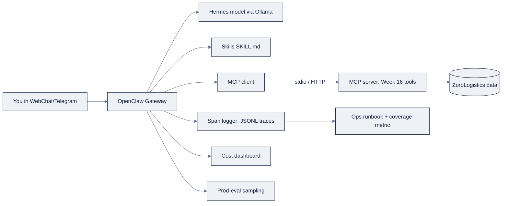

# Week 17: OpenClaw、HermesとAgent Operations

> **日本語版** · [英語版](README.md) · [演習](exercises.ja.md) · [クイズ](quiz.ja.md)
> AI Engineering Labの一部 · Week 17 of 24 · Section: Agents · Category: Personal Agents & Ops
> 🎯 **Use case:** あなたのMCP serverに接続し、Hermes-class modelで駆動する個人用ZoroLab assistant（OpenClaw）をdeployし、その上にtracing、evals、costを載せる。
> · Notebook: [01-agent-ops-observability.ipynb](notebooks/01-agent-ops-observability.ipynb)

## 問題

あなたはもうagentをbuildできるようになりましたが、まだ*運用*はしていません。これまでのagentはすべて、notebookの中で、cellの長さだけ、on demandで動いていました。本物のassistantは三つの点で異なります。第一に**always-on**です。あなたがすでに使っているmessaging channelの中に住んでいるため、質問はどんな時間にでも届き、あなたが再invokeしなくても答え続けなければなりません。第二に**personal**です。*あなたの*device上で動く*あなたの*assistantであり、「役に立つ」と「危険」の境界、すなわちどのcommandを実行してよいか、どのfileに触れてよいか、何を記憶するかは、*あなた自身*がconfigureして責任を負うものです。第三に、**defaultでは観測されていません**。notebookは答えをprintしますが、always-on assistantの答えは誰も読まないchat logの中へ消えていき、tokenのspendは静かに積み上がり、codeを変えなくても品質は劣化します。そして三週間後に、model providerが下層の何かをupdateしたせいでshipment statusをずっとhallucinateしていた、と気づくのです。

今週はこのgapを三つの手で埋めます。第一に、**OpenClaw**が本物のassistant runtimeを与えてくれます。messaging channelを所有するlocal Gateway、skills system、memory model、tiered化されたpermission modeであり、これをWeek 16のMCP serverに接続して、ZoroLogisticsのtoolを実際に呼べるようにします。第二に、Ollama経由で**Hermes-classのopen model**に差し替え、Hermes *model family*とHermes *Agent framework*を区別できるようになります。第三に、always-on agentがなければshipできない**operations layer**を追加します。tracing、cost dashboard、production-eval sampling、ops runbook、そして実際にtrafficのどれだけを見ているかを数字で示す**coverage metric**です。Deliverableはまた別のdemoではなく、自分が責任を負うagentを運用するためのstanding disciplineです。

## 目標

- [ ] 金曜日までに、**OpenClaw**をlocalにinstall・configureし、channel（WebChat）を接続し、そのGateway、skills、memory、permission-modeのmodelを説明できる。
- [ ] 金曜日までに、**二つのOpenClaw skill**（YAML frontmatter付きの`SKILL.md` file）を書き、Week 16のMCP serverを接続して、assistantがZoroLogisticsのtoolを呼べるようにできる。
- [ ] 金曜日までに、Ollama経由で**Hermes-class model**に差し替え、Hermes *model family*（Nous Research、open-weight、function-calling-tuned）と*Hermes Agent framework*を区別できる。
- [ ] 金曜日までに、**production layer**を追加できる。JSONLのspan/trace logger、syntheticなusage logからのcost dashboard、production-eval samplingのdemo、そしてops runbookとcoverage metricの発行。

## 日ごとの計画

| Day | Study | Run / build | Ship |
|---|---|---|---|
| **Mon** | [`reference/agents/openclaw.md`](../../reference/agents/openclaw.md)と[`reference/agents/hermes.md`](../../reference/agents/hermes.md)を読む。context loopについては[`reference/knowledge-base/10-agents-multiagent.md`](../../reference/knowledge-base/10-agents-multiagent.md) §5も（約1.5時間） | 「Hermes = 二つのもの」というdisambiguationを自分の言葉で書く | 一行のdisambiguationとpermission-modeのtier list |
| **Tue** | OpenClawのarchitecture、channels、memory（約1時間） | OpenClawをinstall、onboard、WebChatを接続、`openclaw gateway status` | WebChatで答える、動いているassistant |
| **Wed** | SkillsとMCP登録（約45分） | 二つの`SKILL.md` fileを書く。Week 16のMCP serverを登録。toolが見えることを確認 | loadされた二つのskillと、見えるMCP tools |
| **Thu** | Hermes modelsとOllama（約45分） | `ollama pull hermes4`。OpenClawを`baseUrl: http://localhost:11434`に向ける（`/v1`なし） | local modelから答えるassistant |
| **Fri** | n/a | observability notebookをend-to-endで実行。runbookを書く | cost dashboard、sampling結果、runbook、そして`COVERAGE`の数字 |
| **Sat** | n/a | [`quiz.md`](quiz.md)を受ける（8/10で合格） | scoreをtrackerのNotesに記録する |

## 概念

これは「自分のものにして、生き延びさせる」週です。hands-on guideとしては[`reference/agents/openclaw.md`](../../reference/agents/openclaw.md)と[`reference/agents/hermes.md`](../../reference/agents/hermes.md)を読んでください。以下は概念的な背骨です。

### OpenClaw: 個人assistant runtime

**OpenClaw**はopen-sourceの*個人用*AI assistantです。*あなたの*device上で動き、あなたがすでに使っているchannel（WhatsApp、Telegram、Discord、Slack、Signal、iMessage、WebChat）であなたと出会います。中心は**Gateway**です。すべてのmessaging surfaceを所有するlocal daemonで、`127.0.0.1:18789`上にtypedなWebSocket APIを公開します（live docsで確認してください）。四つのconceptがこの週を支えます。

- **Skills**: YAML frontmatter付きのMarkdown `SKILL.md` file。toolを*いつ・どのように*使うかをagentに教えるもので、定義された優先順位でlayeredなsource（workspace → project → personal → managed → bundled）からloadされます。
- **Memory**: plainなMarkdown file群（stableなpreferenceには`USER.md`、durableなfactには`MEMORY.md`、毎日のnoteには`memory/YYYY-MM-DD.md`）。統治するruleはこれです。**modelが覚えているのはdiskに保存されたものだけ。hidden stateは存在しない。**
- **The context loop**: runのためにmodelに送られるすべて（system prompt、history、tool calls/results）。windowがいっぱいになると自動的に**compact**され、古いturnは要約されつつ、最近のturnとtool-call/resultのpairはそのまま保たれます。これはWeek 14の「context engineering」というideaが、動くsystemになったものです。
- **Permission modes**: 最も制限的から最も許容的までのtier:

| Mode | 挙動 |
|---|---|
| `deny` | すべてのhost commandをblock |
| `allowlist` | 明示的にlistされたcommandだけが実行される |
| `ask` | allowlist + 未listのものには人間にpromptする |
| `auto` | allowlist + auto-reviewerがmissを判断（人間にfallback） |
| `full` | promptなし、trusted hostのみ |

このtieringは、Week 14の**least privilege + 不可逆操作でのhuman checkpoint**の具体的なreference implementationです。押さえるべきnamingの事実: OpenClawは以前は*Clawdbot*、その次は*Moltbot*という名前でした。独立したopen-source projectであり、LLM APIsの*consumer*であって、**Anthropicのproductではありません**。

### Hermes: 一つの名前、二つのartifact

「Hermes」はoverloadされた名前で、このdisambiguationが今週のtrap questionです。どちらも**Nous Research**によるものです。

| | Hermes model family | Hermes Agent framework |
|---|---|---|
| それが何か | function/tool callingに強く向いた、open-weightでinstruction-tunedなLLMs | 自己改善するagent *runtime/application* |
| 世代 | Hermes 2（Llama 3/Mistral/Mixtral）、Hermes 3（Llama 3.1）、Hermes 4（Qwen3、14B/70B、Apache-2.0） | 単一のopen-source project（`NousResearch/hermes-agent`、MIT） |
| 実行方法 | Ollama/vLLM/HF経由のlocal、またはhosted endpoint | subagents、learning loop、A2A supportを持つgateway process |
| 関係 | frameworkの中に入れる*脳* | modelを動かす*framework* |

one-linerで言えば、**Hermes modelは脳であり、Hermes Agentはmodelを動かしてlearning loop、gateway、subagentsを与えるframeworkです。** 両者は独立しており、Hermes modelはLangGraph、OpenClaw、その他どんなframeworkの中にも入れられます。今週はHermes modelを*OpenClawの中の*脳として使い、**Ollama**がserveします（gotchaに注意: OpenClawはOllamaのnativeな`/api/chat`と通信します。OpenAI互換の`/v1` endpointでは*なく*、そちらはtool callingを壊します）。Hermes modelは信頼できるstructured tool call向けにtuneされており、agent loopがまさに必要とする性質です。ただしfrontier modelではありません。long-horizon reasoningとself-correctionは弱いと想定してください。それをまさに測るのが、swap-and-compare exerciseです。

### Agent operations: tracing、cost、evals

後半は、demoを運用し守れるものへ変えるlayer、すなわちWeek 11のevals disciplineを*agent*に適用したものです。

- **Tracing**: structuredな**span**（各一 step: model call、tool call）をinputs、outputs、latency、tokens付きで記録し、runごとの**trace**へlinkするもの。悪い答えは*process*であり、どのstepが失敗したかを見つける場所がtraceです。
- **Cost dashboards**: model/dayごとのusageとspend。always-on assistantは*cost*であり、meterしていないものはoptimizeできないからです。
- **Production-eval sampling**: cadenceを決めてlive trafficのsampleをthresholdに対して採点するもの。systemはcodeを変えなくてもdriftするからです。

この三つの習慣は、[`reference/knowledge-base/07-evals-error-analysis.md`](../../reference/knowledge-base/07-evals-error-analysis.md)にあるWeek 11のdiscipline、trace、threshold、drift monitoringを、単一のmodel outputではなく*process*へ移植したものです。agentは答えではなくstepで失敗します。だからtraceこそがevalであり、coverage metricはそのevalの正直なscopeです。

Deliverableはこれらを一つにまとめます。**ops runbook**（threshold、watchすべきdashboard、what-to-do-when）と、実際にinstrumentされているagent operationの割合である**coverage metric**です。runbookはdocumentationではありません。agentを運用するstanding disciplineであり、coverageの数字は「実際にどれだけ見えているか」への正直な答えです。

### 週の先へ: schedule、delegation、security perimeter

assistantが動き始めると、三つのoperationalな話題が自然に広がります。金曜日のdeliverableの後に学んでください。（Sourcesにあるfree video masterclassが、real installation上でこれらをend-to-endでカバーしています。以下はZorostのsynthesisです。）

**Scheduled automation（agentのためのcron）。** always-on assistantは、scheduleで実行できるようになったとき*proactive*になります。朝のbriefing、inboxのtriage sweep、週次report digestなどです。engineering ruleは`agent-ops-handoff`と同じものです。off-peakの分を選ぶ（`:00`や`:30`は絶対に避ける。何千ものjobがtop of the hourに殺到します）、timezoneは常に明示的に名前を付ける（UTCのserverとDCの人間は、DSTで年に二回食い違います）、missしたrunのcatch-up policyを書き留める、skipはするがstampedeはしない、です。すべてのscheduled jobは、interactiveなrunと同じ四つのalertを持ちます。failure、cost-cap trip、refusal、そして*silence*です。reportしないjobは成功ではなくfailure modeです。

**Delegationとsubagents。** OpenClaw-classのassistantもHermes Agent frameworkも、**subagent**をspawnできます。一つの狭いjob（これを調査、あれをreview）を与えられたisolatedなhelper contextで、main conversationのcontext windowをcleanに保つためのものです。これはWeek 16のmulti-agentのideaをpersonal scaleにしたものであり、doctrineは変わらず引き継がれます。delegationは*measured trade*であって、defaultではありません。subtaskのcontextがmain loopを汚す場合（長いweb research session）や、別のmodelが必要な場合（summarizationには安いlocal model、最後のcallにはfrontier model）にdelegateします。runtimeが簡単だからという理由でdelegateしないでください。すべてのhopはlatency、token、そしてcontextが失われるboundaryというcostを払います。

**個人agentのsecurity perimeter。** 個人assistantはprivilegedなprocessです。あなたのAPI keyを持ち、あなたのmessageを読み、host commandを実行します。perimeterには四つの壁があり、いずれも別々にすでに出会っています。**permission modes**（上のblast-radiusのtier list。real workに使うmachineでは`ask`/`auto`に留める）、**secrets hygiene**（credentialはenv varかsecret storeへ。`SKILL.md`や`MEMORY.md`には決して書かない。それらのfileはmodelに送られます）、**channel pairing**（明示的にpairされapproveされていないmessaging channelはopen doorです。pairingはapproveし、毎月auditします）、そして**skill provenance**（`SKILL.md`はproxy経由で実行されるinstruction textです。読んだことのあるskillだけを、信頼するsourceからinstallし、reload前にupdateをdiffします）。masterclassのsecurity moduleは、まねする価値のある習慣をもう一つ加えています。assistant自身のlogとmemory fileをsensitive artifactとして扱うこと。それらにはassistantがこれまで見たすべてが含まれています。

### うまくいかない理由

always-onな個人assistantは、notebookでは決して起きない形で失敗します。**Permission modeが緩すぎる**（real workに使うmachineでの`full`）はblast-radiusの失敗です。agentがtaskのallowlistの外のresourceに触れます。**Context starvation**、すなわち会話の途中でcompactionが*たった一つの*重要なfactを追い出すことは、Week 14のcontext-engineeringの失敗が、自動化され不可視になったものです。**Ollamaの`/v1` endpointでtool callingが壊れる**のが、最も多い初回実行時の失敗です。modelは有効なcallを出すのをやめ、assistantは静かに劣化します。**「何も覚えていない」**は、factが`MEMORY.md`に一度も書かれていないか、compactionで消えたことを意味します。memoryはpersistしたものだけです。そして**instrumentされていないcall path**は、tracerが決して見なかった場所で失敗が起きることを意味します。coverage metricは0.85と読めますが、失われた15%こそ、まさにbugが隠れている場所です。それぞれが[`reference/knowledge-base/10-agents-multiagent.md`](../../reference/knowledge-base/10-agents-multiagent.md) §10の名前付きclassに対応し、[`reference/agents/openclaw.md`](../../reference/agents/openclaw.md) §9.1に具体的なfixがあります。

### 実例1: cost dashboard

observability notebookは、三つのmodel（`gpt-4o-mini` 50%、`gpt-4o` 30%、`hermes-4-14b` 20%）にわたる**200 call**のseed付きlogを生成し、例示用のpriceでspendを集計します。`gpt-4o-mini`は1Mあたり$0.15/$0.60、`gpt-4o`は$2.50/$10、そしてlocalのHermes modelはtokenあたり**$0.00**です（代わりにhardwareとlatencyで支払います）。dashboardはmodelごとの`calls`、`tokens`、`cost`、`avg_latency`をprintし、続いてtotalとASCIIのcost-share barを表示します。tableが教えるlesson: `gpt-4o`はcallの少数しか占めないのに、通常**最大のcost share**を占めます。これこそ、runbookの「cost spike → 最も高価なmodelのcall countを確認する」というplayで使うinsightです。

### 実例2: coverageとproduction sampling

二つの数字が週を締めくくります。**production-eval sampling**のcellは、30個のsampled traceをpass threshold **0.85**に対して採点し、**95% confidence interval**（`p ± 1.96·√(p(1−p)/n)`）付きのpass rateをreportしてから、SHIP/HOLD decisionをprintします。**coverage**のcellは100個のoperationを実行します。85%は`@logger.trace("agent_step")`wrapper経由、15%はそれをbypassする`untraced_step`経由で、`COVERAGE = 0.85`をprintします。そしてrunbookはtargetを宣言します。*agent callの100%をinstrumentしたcoverage*。traceしていない0.15のtrafficこそ、silent regressionが隠れる0.15だからです。どちらの数字も意図的に小さくdeterministicにしてあるので、手で再計算してmachineryを信頼できます。

## Notebook walkthrough

`notebooks/01-agent-ops-observability.ipynb`は、seed付きsynthetic dataに対してops layerをbuildする、key不要の単一notebookで、14 cellからなります。Cell [0]〜[2]はrequirements（`pip install numpy pandas`）とimportsを設定します。Cell [3]〜[5]は**`SpanLogger`**をbuildします。`trace_id`/`span_id`のlinkingを持つJSONL span loggerと`@logger.trace("…")`decoratorで、二つのfake agent step（`retrieve`、`generate`）をwrapして三回のcallを実行し、最初の二つのspan recordをprintして`latency_ms`と`tokens`のfieldを見られるようにします。Cell [6]〜[9]は200-callのusage log（`gen_usage`）を生成し、**cost dashboard**（model別table + ASCII bar）をrenderします。Cell [10]〜[11]は、confidence intervalとSHIP/HOLD decision付きの**production-eval sampling**を実行します。Cell [12]〜[13]は、測定された数字から**ops runbook**のmarkdownを生成し（threshold、dashboard、what-to-do-when）、temp fileに書き出します。Cell [14]は、100個のoperation（85%がtraced）を実行して**coverage metric**を計算し、`COVERAGE`をprintします。

変更するcell: [9]（`PRICES`や`gen_usage`のmodel mixを変えてcost shareが動くのを見る）、[11]（`THRESHOLD`を変えてSHIPがHOLDにflipするのを見る）、そして[14]（`0.85`のsampling確率を変えてcoverageが動くのを見る）。「正しい」出力は、logger内の6つのspan record、total付きのmodel別cost table、pass-rate + CI + decision行、previewされたrunbook、そして0と1の間の最終`COVERAGE`（seed付きrunでは≈0.85）です。すべてのgeneratorがseed付き（`gen_usage(seed=123)`、`sample_eval(seed=7)`、coverage cellの`default_rng(7)`）なので、dashboardのtotal、pass rate、`COVERAGE`の値はすべてreproduce可能です。一つを手で再計算してmachineryを信頼してください。`SpanLogger`は`zoro_w17_spans.jsonl`へ、runbookは`zoro_w17_runbook.md`へ書き出します。どちらもtemp directoryの中です。JSONLを開いて、各spanが`trace_id`、`span_id`、`name`、`latency_ms`、`tokens`を持つことを確認してください。`COVERAGE`が`0.85`をprintしたなら、それはseed付きのsampling確率であってbugではありません。loop内の`0.85`を変えてmetricが動くのを見てください。

## Use case（Friday）

**Deliverable:** 二つのcustom skillとWeek 16のMCP serverを組み込んだ、動くOpenClaw assistant（WebChat）。加えて、`notebooks/01-agent-ops-observability.ipynb`を最後まで実行して得られるcost dashboard、sampling結果、ops runbook、coverage metric。

**Zorost gate:** 見知らぬ人がassistantにmessageを送ると、あなたのskillの一つがtriggerされ、→MCP経由でZoroLogisticsのtoolを呼び、→その全体がtraceに現れること。そしてあなたはrunbookとcoverage metricを開いて、*どの割合のtrafficがinstrumentされているか、cost-per-dayはいくらか、alert thresholdは何か*を数字で言えること。runbookがなければ、shipはありません。

**Stretch variant:** Ollama経由でHermes-class modelに差し替えます（`ollama pull hermes4`、そしてOpenClawを**`/v1`なし**の`baseUrl: http://localhost:11434`に向ける）。前のmodelで使った同じ三つのpromptを実行します。Hermesがどのpromptをうまく扱い、どれをしくじったか、そしてtool useにfunction-calling tuningがなぜ重要かを書き留めてください。deliverableはmodelではなく、この比較です。

## よくあるpitfall

| Pitfall | 見た目 | Fix |
|---|---|---|
| **`/v1`でtool callingが壊れる** | assistantが有効なtool callを出さなくなる | Ollamaのnative `/api/chat`を使う。`/v1`なしの`baseUrl` |
| **Permission modeが緩すぎる** | real-work machineで`full` | `ask`/`auto`に留める。`full`は使い捨てhost専用 |
| **「何も覚えていない」** | factがturnをまたいで消える | `MEMORY.md`に書く。compactionが追い出していないか確認 |
| **skillが発動しない** | agentが`SKILL.md`を無視する | frontmatterの`description`を具体的にする。tool descriptionと同じで、これがtrigger |
| **Context starvation** | 会話の途中で品質が崩壊する | `/usage tokens`を見る。手動でcompactするか、古いcontextをtrim |
| **Silent channel** | DMへのmessageが無視される | pairingをapproveする（`openclaw pairing approve <channel> <code>`） |
| **Coverageが1.0未満** | tracerが見ない場所で失敗が起きる | すべてのcall pathをtracer経由にする。metricを追う |
| **skills/memoryにsecrets** | API keyがmodelに送られるfileに入る | credentialはenv varかsecret storeへ。`SKILL.md`/`MEMORY.md`には決して |

## Glossary

- **OpenClaw**: あなたのdevice上で動き、messaging channelであなたと出会う、open-sourceの個人AI assistant。
- **Gateway**: messaging surfaceとWebSocket APIを所有するOpenClawのlocal daemon。
- **Skill**: toolをいつ・どのように使うかをagentに教える`SKILL.md` file（YAML frontmatter + Markdown）。
- **Compaction**: windowがいっぱいのとき、最近のturnとtool-call pairを保ちつつ古いturnを要約すること。
- **Permission mode**: host commandの実行を制御するtier（`deny` → `allowlist` → `ask` → `auto` → `full`）。
- **Hermes (model)**: Nous Researchのopen-weightでfunction-calling-tunedなmodel family（Hermes 4 = Qwen3、Apache-2.0）。
- **Hermes Agent**: Nous Researchの自己改善するagent *framework*（modelとは別物）。
- **Ollama**: GGUF quantum化をnative chat APIでserveするlocal model runner。
- **Span**: inputs、outputs、latency、tokensを持つ、instrumentされた一 step（model call、tool call）。
- **Trace**: 一つのend-to-end runに対するspanの列。
- **Coverage metric**: 実際にinstrumentされているagent operationの割合。
- **Ops runbook**: agent運用のためのthreshold、dashboard、incident手順を記したstanding document。

## Self-check（quiz）

[`quiz.md`](quiz.md)を受けてください。OpenClawのmodel、Hermesのdisambiguation、observability notebookの数字を問う10問です。**8/10**で合格です。

## Exercises

四つのgraded exerciseがあります。**Easy**（observability notebookを実行しcoverageを記録）、**Standard**（二つの`SKILL.md` skillを書き、loadされることを確認）、**Stretch**（Ollama経由でHermes modelに差し替え、tool-calling品質を比較）、そして**Portfolio**（skills + runbook + coverageをcommit）です。全文と**Hints**は[`exercises.md`](exercises.md)にあります。

## Sources

- OpenClaw repository: https://github.com/openclaw/openclaw
- OpenClaw documentation: https://docs.openclaw.ai （architecture: /concepts/architecture · skills: /tools/skills · memory: /concepts/memory · permission modes: /tools/permission-modes · Ollama: /providers/ollama）
- Nous Research: https://nousresearch.com
- NousResearch/Hermes-4-14B model card: https://huggingface.co/NousResearch/Hermes-4-14B
- NousResearch/hermes-agent framework: https://github.com/NousResearch/hermes-agent
- Ollama: https://ollama.com
- MCP specification: https://modelcontextprotocol.io
- Langfuse (tracing reference): https://langfuse.com
- LangSmith (tracing reference): https://smith.langchain.com

**Further study（個人agent operationsに関するfree video course）:**

- Hermes Agent Masterclass（10 module: installation、VPS deployment、memory/plugins、skills、providers/models、tools/MCP、cron automation、subagents、profiles、security）: https://hermesatlas.com/masterclass/
- Hermes Agent Full Course: Build & Sell（3時間のbuild-and-operate walkthrough）: https://www.youtube.com/watch?v=8yE6G1Lup1s
- The Complete Guide to the Hermes Agent Desktop App: https://www.youtube.com/watch?v=3ObcurqJJA0

- Zorost Intelligence: https://zorost.com
