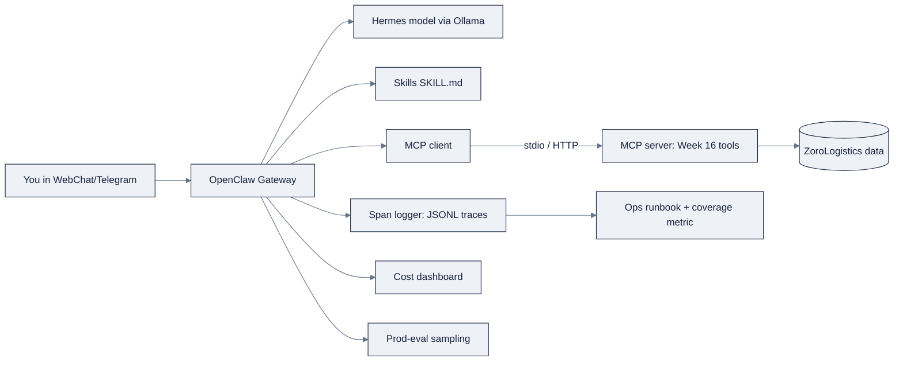

# Week 17: OpenClaw, Hermes & Agent Operations

> Part of AI Engineering Lab · Week 17 of 24 · Section: Agents · Category: Personal Agents & Ops
> 🎯 Use case: Deploy a personal ZoroLab assistant (OpenClaw) wired to your MCP server, driven by a Hermes-class model, with tracing, evals, and cost on top.

## The problem

You now build agents, but you do not yet *run* one. Every agent so far ran inside a notebook,
on demand, for the length of a cell. A real assistant is different in three ways. It is
**always-on**: it lives in the messaging channels you already use, so a question can arrive at
any hour, and it must keep answering without you re-invoking it. It is **personal**: it is *your*
assistant on *your* devices, which means the boundary between "helpful" and "dangerous", what
commands it may run, what files it may touch, what it remembers, is something *you* configure
and are responsible for. And it is **unobserved by default**: a notebook prints its answer; an
always-on assistant's answers drift away into a chat log that nobody reads, its token spend
accrues silently, and its quality degrades without a code change, until you notice three weeks
later that it has been hallucinating shipment statuses because a model provider updated
something underneath you.

This week closes that gap in three moves. First, **OpenClaw** gives you a real assistant
runtime, a local Gateway that owns messaging channels, a skills system, a memory model, and a
tiered permission mode, and you wire it to the Week 16 MCP server so it can actually call
ZoroLogistics tools. Second, you swap in a **Hermes-class open model** via Ollama and learn to
disambiguate the Hermes *model family* from the Hermes *Agent framework*. Third, you add the
**operations layer** the always-on agent cannot ship without: tracing, a cost dashboard,
production-eval sampling, an ops runbook, and a **coverage metric** that says, with a number,
how much of your traffic you actually see. The deliverable is not another demo, it is a
standing discipline for running an agent you are accountable for.

## Objectives

- [ ] By Friday you can install and configure **OpenClaw** locally, connect a channel (WebChat), and explain its Gateway, skills, memory, and permission-mode model.
- [ ] By Friday you can write **two OpenClaw skills** (`SKILL.md` files with YAML frontmatter) and wire the Week 16 MCP server so the assistant can call ZoroLogistics tools.
- [ ] By Friday you can swap in a **Hermes-class model** via Ollama and disambiguate the Hermes *model family* (Nous Research, open-weight, function-calling-tuned) from the *Hermes Agent framework*.
- [ ] By Friday you can add the **production layer**, a JSONL span/trace logger, a cost dashboard from a synthetic usage log, a production-eval sampling demo, and emit an ops runbook plus a coverage metric.

## Day-by-day plan

| Day | Study | Run / build | Ship |
|---|---|---|---|
| **Mon** | Read [`reference/agents/openclaw.md`](../../reference/agents/openclaw.md) and [`reference/agents/hermes.md`](../../reference/agents/hermes.md), with [`reference/knowledge-base/10-agents-multiagent.md`](../../reference/knowledge-base/10-agents-multiagent.md) §5 for the context loop (≈1.5 hr) | Write the "Hermes = two things" disambiguation in your own words | A one-line disambiguation + a permission-mode tier list |
| **Tue** | OpenClaw architecture, channels, memory (≈1 hr) | Install OpenClaw, onboard, connect WebChat, `openclaw gateway status` | A working assistant answering in WebChat |
| **Wed** | Skills + MCP registration (≈45 min) | Write two `SKILL.md` files; register the Week 16 MCP server; verify tools are visible | Two loaded skills + visible MCP tools |
| **Thu** | Hermes models + Ollama (≈45 min) | `ollama pull hermes4`; point OpenClaw at `baseUrl: http://localhost:11434` (no `/v1`) | The assistant answering from a local model |
| **Fri** | n/a | Run the observability notebook end-to-end; write the runbook | A cost dashboard, a sampling result, a runbook, and the `COVERAGE` number |
| **Sat** | n/a | Take [`quiz.md`](quiz.md) (8/10 to pass) | Record the score in your tracker Notes |

## Concepts

This is the "make it mine and make it survive" week. Read
[`reference/agents/openclaw.md`](../../reference/agents/openclaw.md) and [`reference/agents/hermes.md`](../../reference/agents/hermes.md)
for the hands-on guides; what follows is the conceptual spine.

### OpenClaw: a personal assistant runtime

**OpenClaw** is an open-source *personal* AI assistant, it runs on *your* devices and meets
you in the channels you already use (WhatsApp, Telegram, Discord, Slack, Signal, iMessage,
WebChat). Its center is the **Gateway**, a local daemon that owns all messaging surfaces and
exposes a typed WebSocket API on `127.0.0.1:18789` (verify against live docs). Four concepts
carry the week:

- **Skills**: Markdown `SKILL.md` files with YAML frontmatter that teach the agent *how and
  when* to use tools, loaded from layered sources (workspace → project → personal → managed →
  bundled) with defined precedence.
- **Memory**: plain Markdown files (`USER.md` for stable preferences, `MEMORY.md` for durable
  facts, `memory/YYYY-MM-DD.md` for daily notes). The governing rule: **the model only
  remembers what gets saved to disk; there is no hidden state.**
- **The context loop**: everything sent to the model for a run (system prompt, history, tool
  calls/results), **compacted** automatically when the window fills: older turns are summarized
  while recent turns and tool-call/result pairs stay intact. This is the Week-14 "context
  engineering" idea as a running system.
- **Permission modes**: a tier from least to most permissive:

| Mode | Behavior |
|---|---|
| `deny` | Block all host commands |
| `allowlist` | Only explicitly listed commands run |
| `ask` | Allowlist + prompt a human on anything not listed |
| `auto` | Allowlist + an auto-reviewer decides misses (falls back to human) |
| `full` | No prompts, trusted host only |

That tiering is the concrete reference implementation of Week 14's **least privilege + human
checkpoint on irreversibility**. The naming fact to get right: OpenClaw was previously
*Clawdbot*, then *Moltbot*; it is an independent open-source project and a *consumer* of LLM
APIs, **not** an Anthropic product.

### Hermes: one name, two artifacts

"Hermes" is overloaded, and the disambiguation is the week's trap question. Both things come
from **Nous Research**:

| | Hermes, the model family | Hermes Agent, the framework |
|---|---|---|
| What it is | Open-weight, instruction-tuned LLMs strongly oriented to function/tool calling | A self-improving agent *runtime/application* |
| Generations | Hermes 2 (Llama 3/Mistral/Mixtral), Hermes 3 (Llama 3.1), Hermes 4 (Qwen3, 14B/70B, Apache-2.0) | One open-source project (`NousResearch/hermes-agent`, MIT) |
| Runs how | Local via Ollama/vLLM/HF, or a hosted endpoint | A gateway process with subagents, a learning loop, and A2A support |
| Relationship | The *brain* you put inside a framework | The *framework* that runs a model |

The one-liner: **Hermes the model is the brain; Hermes Agent is the framework that runs a model
and gives it a learning loop, a gateway, and subagents.** They are independent, you can put a
Hermes model inside LangGraph, OpenClaw, or any other framework. This week you use a Hermes
model as the brain *inside OpenClaw*, served by **Ollama** (note the gotcha: OpenClaw talks to
Ollama's native `/api/chat`, *not* the `/v1` OpenAI-compatible endpoint, which breaks tool
calling). Hermes models are tuned for reliable structured tool calls, the exact requirement an
agent loop has, but they are not frontier models: expect weaker long-horizon reasoning and
self-correction, which is precisely what the swap-and-compare exercise measures.

### Agent operations: tracing, cost, and evals

The second half is the layer that turns a demo into something you can run and defend, Week
11's evals discipline applied to *agents*:

- **Tracing**: structured **spans** (one step each: a model call, a tool call) with inputs,
  outputs, latency, and tokens, linked into **traces** per run. A bad answer is a *process*, and
  the trace is where you find which step failed.
- **Cost dashboards**: usage and spend per model/day, because an always-on assistant is a
  *cost* and you cannot optimize what you do not meter.
- **Production-eval sampling**: grade a sample of live traffic against a threshold on a
  cadence, because systems drift without a code change.

These three habits are Week 11's discipline from
[`reference/knowledge-base/07-evals-error-analysis.md`](../../reference/knowledge-base/07-evals-error-analysis.md)
traces, thresholds, and drift monitoring, transplanted onto a *process* rather than a single
model output. An agent fails in a step, not in an answer, so the trace is the eval, and the
coverage metric is the eval's honest scope.

The deliverable ties them together: an **ops runbook** (thresholds, dashboards to watch, and
what-to-do-when) plus a **coverage metric**, the fraction of agent operations actually
instrumented. A runbook is not documentation; it is the standing discipline of running an
agent, and the coverage number is the honest answer to "how much do we actually see?"

### Beyond the week: schedules, delegation, and the security perimeter

Three operational topics extend naturally once your assistant is running, study them after the
Friday deliverable. (The free video masterclasses in Sources cover them end-to-end on real
installations; what follows is the Zorost synthesis.)

**Scheduled automation (cron for agents).** An always-on assistant becomes *proactive* when it
can run on a schedule: morning briefings, inbox triage sweeps, weekly report digests. The
engineering rules are the same ones from `agent-ops-handoff`: pick off-peak minutes (never
`:00` or `:30`, thousands of jobs pile onto the top of the hour), always name the timezone
explicitly (a server in UTC and a human in DC disagree twice a year at DST), and write down the
catch-up policy for missed runs, skip, don't stampede. Every scheduled job gets the same four
alerts as an interactive run: failure, cost-cap trip, refusal, and *silence*, a job that
didn't report is a failure mode, not a success.

**Delegation and subagents.** Both OpenClaw-class assistants and the Hermes Agent framework can
spawn **subagents**, isolated helper contexts given one narrow job (research this, review
that) so the main conversation's context window stays clean. This is the Week-16 multi-agent
idea at personal scale, and the doctrine carries over unchanged: delegation is a *measured
trade*, not a default. Delegate when the subtask's context would pollute the main loop (a long
web research session) or needs a different model (a cheap local model for summarization, the
frontier model for the final call). Do not delegate just because the runtime makes it easy,
every hop costs latency, tokens, and a boundary where context gets lost.

**The security perimeter of a personal agent.** A personal assistant is a privileged process:
it holds your API keys, reads your messages, and executes host commands. The perimeter has four
walls, all of which you have already met separately: **permission modes** (the blast-radius
tier list above, stay at `ask`/`auto` on a machine you use for real work), **secrets
hygiene** (credentials in env vars or a secret store, never in `SKILL.md` or `MEMORY.md`,
those files are sent to the model), **channel pairing** (a messaging channel that isn't
explicitly paired and approved is an open door, approve pairings, audit them monthly), and
**skill provenance** (a `SKILL.md` is executable-by-proxy instruction text; install skills you
have read, from sources you trust, and diff updates before reloading). The masterclass's
security module adds one more habit worth copying: treat the assistant's own logs and memory
files as sensitive artifacts, they contain everything it has ever seen.

### How it breaks

An always-on personal assistant fails in ways a notebook never does. **Permission mode too
permissive** (`full` on a machine you use for real work) is the blast-radius failure: the agent
touches resources outside its task's allowlist. **Context starvation**, compaction evicting
the *one* important fact mid-conversation, is the Week-14 context-engineering failure, now
automatic and invisible. **Tool calling breaking on Ollama's `/v1` endpoint** is the single
most common first-run failure: the model stops emitting valid calls and the assistant quietly
degrades. **"It doesn't remember anything"** means a fact was never written to `MEMORY.md` or
was compacted away, memory is only what you persist. And **uninstrumented call paths** mean a
failure happens where your tracer never looked, so your coverage metric reads 0.85 and the
missing 15% is exactly where the bug is hiding. Each maps to a named class in
[`reference/knowledge-base/10-agents-multiagent.md`](../../reference/knowledge-base/10-agents-multiagent.md) §10,
and each has a concrete fix in [`reference/agents/openclaw.md`](../../reference/agents/openclaw.md) §9.1.

### Worked example 1: the cost dashboard

The observability notebook generates a seeded log of **200 calls** across three models
(`gpt-4o-mini` 50%, `gpt-4o` 30%, `hermes-4-14b` 20%) and aggregates spend with illustrative
prices, `gpt-4o-mini` at $0.15/$0.60 per 1M, `gpt-4o` at $2.50/$10, and the local Hermes
model at **$0.00** per token (you pay in hardware and latency instead). The dashboard prints
per-model `calls`, `tokens`, `cost`, and `avg_latency`, then a total and an ASCII cost-share
bar. The lesson the table teaches: `gpt-4o` contributes a minority of calls but usually the
**largest cost share**: which is exactly the insight you use in the runbook's "cost spike →
check the most expensive model's call count" play.

### Worked example 2: coverage and production sampling

Two numbers close the week. The **production-eval sampling** cell grades 30 sampled traces
against a pass threshold of **0.85** and reports a pass rate with a **95% confidence interval**
(`p ± 1.96·√(p(1−p)/n)`), then prints a SHIP/HOLD decision. The **coverage** cell runs 100
operations, 85% of them through the `@logger.trace("agent_step")` wrapper and 15% through an
`untraced_step` that bypasses it, and prints `COVERAGE = 0.85`. The runbook then states the
target: *coverage 100% of agent calls instrumented*, because the 0.15 of traffic you do not
trace is the 0.15 where a silent regression will hide. Both numbers are deliberately small and
deterministic so you can recompute them by hand and trust the machinery.

## Notebook walkthrough

`notebooks/01-agent-ops-observability.ipynb` is a single, no-key notebook in 14 cells that
builds the ops layer against seeded synthetic data. Cells [0] to [2] set requirements
(`pip install numpy pandas`) and imports. Cells [3] to [5] build the **`SpanLogger`**: a JSONL
span logger with `trace_id`/`span_id` linking and a `@logger.trace("…")` decorator, then wrap
two fake agent steps (`retrieve`, `generate`) and run three calls, printing the first two span
records so you can see the `latency_ms` and `tokens` fields. Cells [6] to [9] generate the 200-call
usage log (`gen_usage`) and render the **cost dashboard** (per-model table + ASCII bar). Cells
[10] to [11] run the **production-eval sampling** with the confidence interval and SHIP/HOLD
decision. Cells [12] to [13] generate the **ops runbook** markdown from the measured numbers
(thresholds, dashboards, what-to-do-when) and write it to a temp file. Cell [14] computes the
**coverage metric** by running 100 operations, 85% traced, and prints `COVERAGE`.

The cells to modify: [9] (change `PRICES` or `gen_usage`'s model mix and watch the cost share
move), [11] (change `THRESHOLD` and watch SHIP flip to HOLD), and [14] (change the `0.85`
sampling probability to see coverage move). "Correct" output: 6 span records in the logger, a
per-model cost table with a total, a pass-rate + CI + decision line, a previewed runbook, and a
final `COVERAGE` between 0 and 1 (≈0.85 in the seeded run). Because every generator is seeded
(`gen_usage(seed=123)`, `sample_eval(seed=7)`, and `default_rng(7)` in the coverage cell), the
dashboard totals, the pass rate, and the `COVERAGE` value are all reproducible, recompute one
by hand to trust the machinery. The `SpanLogger` writes to `zoro_w17_spans.jsonl` and the
runbook to `zoro_w17_runbook.md`, both in your temp directory; open the JSONL to confirm each
span carries `trace_id`, `span_id`, `name`, `latency_ms`, and `tokens`. If `COVERAGE` prints
`0.85`, that is the seeded sampling probability, not a bug, change the `0.85` in the loop to
watch the metric move.

## Friday: the use case

**Deliverable:** a working OpenClaw assistant (WebChat) with two custom skills and the Week 16
MCP server wired in, plus `notebooks/01-agent-ops-observability.ipynb` run to completion,
yielding a cost dashboard, a sampling result, an ops runbook, and a coverage metric.

**Acceptance gate (Zorost-style):** a stranger can send the assistant a message that triggers
one of your skills → which calls a ZoroLogistics tool through MCP → and the whole thing shows up
in a trace; and you can open the runbook and the coverage metric and say, with numbers, *what
fraction of traffic is instrumented, what the cost-per-day is, and what the alert thresholds
are*. No runbook, no ship.

**Stretch variant:** swap a Hermes-class model in via Ollama (`ollama pull hermes4`, then point
OpenClaw at `baseUrl: http://localhost:11434` with **no `/v1`**) and run the same three prompts
you used with the previous model. Write down which prompts Hermes handled better, which it
fumbled, and why function-calling tuning matters for tool use, the comparison is the deliverable,
not the model.

## Common pitfalls

| Pitfall | What it looks like | The fix |
|---|---|---|
| **Tool calling breaks on `/v1`** | The assistant stops emitting valid tool calls | Use Ollama's native `/api/chat`; `baseUrl` without `/v1` |
| **Permission mode too permissive** | `full` on a real-work machine | Stay at `ask`/`auto`; reserve `full` for a disposable host |
| **"It doesn't remember anything"** | A fact vanishes across turns | Write it to `MEMORY.md`; check compaction isn't evicting it |
| **A skill never fires** | The agent ignores your `SKILL.md` | Make the `description` frontmatter specific, it is the trigger, like a tool description |
| **Context starvation** | Quality collapses mid-conversation | Watch `/usage tokens`; compact manually or trim stale context |
| **Silent channel** | DM messages go unanswered | Approve the pairing (`openclaw pairing approve <channel> <code>`) |
| **Coverage below 1.0** | Failures happen where the tracer never looked | Route every call path through the tracer; track the metric |
| **Secrets in skills/memory** | API keys land in files sent to the model | Store credentials in env vars or a secret store, never in `SKILL.md`/`MEMORY.md` |

## Glossary

- **OpenClaw**: an open-source personal AI assistant running on your devices, meeting you in messaging channels.
- **Gateway**: OpenClaw's local daemon owning messaging surfaces and a WebSocket API.
- **Skill**: a `SKILL.md` file (YAML frontmatter + Markdown) teaching the agent how and when to use tools.
- **Compaction**: summarizing older turns while keeping recent ones and tool-call pairs when the window fills.
- **Permission mode**: the tier (`deny` → `allowlist` → `ask` → `auto` → `full`) controlling host-command execution.
- **Hermes (model)**: Nous Research's open-weight, function-calling-tuned model family (Hermes 4 = Qwen3, Apache-2.0).
- **Hermes Agent**: Nous Research's self-improving agent *framework* (distinct from the models).
- **Ollama**: the local model runner serving GGUF quantizations with a native chat API.
- **Span**: one instrumented step (model call, tool call) with inputs, outputs, latency, and tokens.
- **Trace**: the sequence of spans for one end-to-end run.
- **Coverage metric**: the fraction of agent operations that are actually instrumented.
- **Ops runbook**: the standing document of thresholds, dashboards, and incident steps for running the agent.

## Self-check (quiz)

Take [`quiz.md`](quiz.md), 10 questions covering OpenClaw's model, the Hermes disambiguation,
and the observability notebook's numbers. Pass with **8/10**.

## Exercises

Four graded exercises, **Easy** (run the observability notebook, record coverage), **Standard**
(write two `SKILL.md` skills and confirm they load), **Stretch** (swap a Hermes model via
Ollama and compare tool-calling quality), and **Portfolio** (commit skills + runbook + coverage).
See [`exercises.md`](exercises.md) for full wording and **Hints**.

## Sources

- OpenClaw repository: https://github.com/openclaw/openclaw
- OpenClaw documentation: https://docs.openclaw.ai (architecture: /concepts/architecture · skills: /tools/skills · memory: /concepts/memory · permission modes: /tools/permission-modes · Ollama: /providers/ollama)
- Nous Research: https://nousresearch.com
- NousResearch/Hermes-4-14B model card: https://huggingface.co/NousResearch/Hermes-4-14B
- NousResearch/hermes-agent framework: https://github.com/NousResearch/hermes-agent
- Ollama: https://ollama.com
- MCP specification: https://modelcontextprotocol.io
- Langfuse (tracing reference): https://langfuse.com
- LangSmith (tracing reference): https://smith.langchain.com

**Further study (free video courses on personal-agent operations):**

- Hermes Agent Masterclass (10 modules: installation, VPS deployment, memory/plugins,
  skills, providers/models, tools/MCP, cron automation, subagents, profiles, security),
  https://hermesatlas.com/masterclass/
- Hermes Agent Full Course: Build & Sell (3-hour build-and-operate walkthrough),
  https://www.youtube.com/watch?v=8yE6G1Lup1s
- The Complete Guide to the Hermes Agent Desktop App,
  https://www.youtube.com/watch?v=3ObcurqJJA0

- Zorost Intelligence: https://zorost.com
