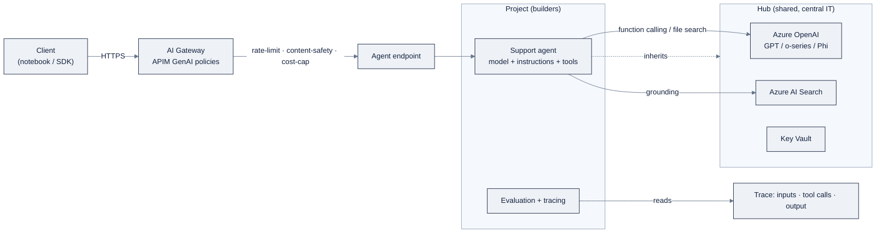

# Week 18: Azure AI Foundry

> **日本語版** · [英語版](README.md) · [演習](exercises.ja.md) · [クイズ](quiz.ja.md)
> AI Engineering Labの一部 · Week 18 of 24 · Section: Cloud AI Platforms · Category: Microsoft
> 🎯 **Use case:** ZoroLogistics support agentをAzure AI Foundryにdeployし、online evaluationとAI Gateway governanceを付ける。
> · Notebooks: [01-foundry-serverless-endpoints.ipynb](notebooks/01-foundry-serverless-endpoints.ipynb) · [02-foundry-agent-evaluation.ipynb](notebooks/02-foundry-agent-evaluation.ipynb)

## 問題

あなたはWeek 14〜17で、同じZoroLogistics support agentを三通りの方法でbuildしてきました。手作りのReAct loop、LangGraphのgraph、MCP上のmulti-agent triage teamです。shipmentを追跡し、shipping-policyの質問に答え、$500を超えるrefundを人間にrouteします。そのcodeのどれも、*どこで*動くかを気にしません。しかし実際のdeploymentは気にします。「どこで動くか」は一束の質問の略語だからです。誰が呼べるか、どれだけ速いか、いくらかかるか、そして何か間違ったことを言ったときに誰が見ているか。

今週、その「どこ」は**Azure AI Foundry**です。そして質問は見た目より鋭いです。**同じsupport agent、三つのcloud、governanceとspeedとcostのどれで勝つか？** Foundryでの答えはgovernanceに大きく傾きます。単一のcallを書く前に*hub*と*project*を作ります。platformは、central ITが共有resourceを所有し、builderはprojectの中で作業するというmodelを強制します。この儀式は一日目にはfrictionであり、五日目にはまさに本題です。Foundryは、暴走するagentがあなたのsubscriptionを使い切る*前に*、endpointをrate-limitし、content-filterし、cost-capできるgatewayを与えてくれます。

これがなければ、失敗は退屈で高くつきます。rate limitのないdeploy済みagentはsupport ticketのburstに叩かれ、evaluationのないdeploy済みagentは*なぜ*失敗したかのtraceを持ちません。追いかけるbefore/afterは具体的です。beforeでは、agentは一度にひとつの質問に答えるplayground demoです。afterでは、最悪の失敗が*fixされた*ことを示すeval traceと、今週のコストの数字を持つ、gateway-governedなendpointです。これは、Week 20で完成させる三cloud matrixのMicrosoft列です。

## 目標

- [ ] 金曜日までに、AI Foundryのhubとprojectを作成し、serverless model endpointをdeployし、OpenAI SDKと`azure-ai-projects`の両方でPythonから呼べる。
- [ ] 金曜日までに、ZoroLogistics support agent（model + instructions + tools）をFoundryで定義し、endpointとして公開できる。
- [ ] 金曜日までに、evaluation batchを実行し、traceを読み、最悪の失敗をfixし、fixを証明するbefore/after scoreを示せる。
- [ ] 金曜日までに、AI Gatewayのgovernance control（rate limit、content safety、cost cap）を言語化し、今週のrunに対するcost estimateを公開できる。

## 日ごとの計画

| Day | Study | Run / build | Ship | Time |
|---|---|---|---|---|
| Mon | Hub vs project。serverless vs PTU | hub + projectを作成（portalまたは`az` CLI） | projectのconnection stringを記録 | 2〜3時間 |
| Tue | Model catalog。`model=`のdeployment-name gotcha | serverless modelをdeploy。OpenAI SDKと`azure-ai-inference`から呼ぶ | 動くendpoint call | 2〜3時間 |
| Wed | Microsoft Agent Framework（model + instructions + tools） | support agentを定義。`track_shipment`を接続。playgroundでtest | agent定義 | 2〜3時間 |
| Thu | Evaluationとtracing | eval batchを実行。traceを読む。最悪の失敗をfix | before/after eval score | 2〜3時間 |
| Fri | AI Gateway（APIM GenAI policy） | endpointをgatewayの後ろに置く。rate-limit + content-safety + cost cap | cost estimateとgateway config | 3〜4時間 |
| Sat | 復習 | [quiz](quiz.md)を受ける（8/10） | quiz scoreをNotesに記録 | 1時間 |

## 概念

まず、[`reference/knowledge-base/12-cloud-platforms.md`](../../reference/knowledge-base/12-cloud-platforms.md) の共有mental modelと、[`reference/platforms/ai-foundry/README.md`](../../reference/platforms/ai-foundry/README.md) のhands-on runbookを読んでください。Foundryはgenerative AIに対するMicrosoftのcontrol planeです。Azure OpenAI、Azure AI Search、Azure AI Content Safety、Azure Machine Learningを、一つのportalと一つのSDK familyの後ろに接着します。今週全体を整理する単一のideaは、**hub-and-project hierarchy**です。

**hub**は共有されるenterprise resource、すなわちAzure OpenAI instance、AI Search index、storage account、key vault、network boundaryを所有します。**project**は、teamが実際にbuildするworkspaceです。deployment、fine-tuning job、flow、evaluation run、trace、agent定義があります。Governance、identity、securityはhubで一度configureされ、その下のすべてのprojectに継承されます。Central IT（platform帽子をかぶったあなた）はconnectivity、model、keyを管理し、builder（developer帽子をかぶったあなた）はinfrastructureを再配管せずに、projectの中の自由を得ます。GoogleのAI Studioにはほぼこの儀式がなく、AWSのIAM modelはよりflatなので、hub/projectはWeek 20のmatrixに持ち込むべき特徴的なものです。

| | Hub | Project |
|---|---|---|
| 所有するもの | Azure OpenAI、AI Search、storage、key vault、VNet | deployment、flow、eval、trace、agent |
| 誰がconfigureするか | central ITが一度 | builderがteamごとに |
| 例え | 建物のutilityと配線 | あるteamが借りる階 |
| 継承 | n/a | hubが所有するすべて |

### Model catalog、serverless endpoint、Azure OpenAIとの関係

**model catalog**は二種類のmodelを保持します。第一に**Azure OpenAI model**、GPT family（GPT-4.1、GPT-4o）、o-series reasoning model（o1/o3/o4-mini）、さらにDALL·E、Whisper、Microsoft自身の**Phi-4**で、Azure OpenAI resourceにdeployされます。第二に、**open/third-party model**（Llama、Mistral、Cohere、DeepSeek）で、**serverless API endpoint**としてdeployされます。Microsoftの "Models-as-a-Service" であり、*名前*をdeployしてHTTPS URLを呼び、computeは所有せずtokenごとに支払います。新参者がつまずく区別: **Azure OpenAIは特定のresourceであり、Foundryはその周りのplatformです。** OpenAI modelに関しては、両者は二つのlens越しに見た同じものです。

deploymentの選択は、単一の答えではなくcost dialです。

| Deployment | 課金 | 所有者 | 使うとき |
|---|---|---|---|
| Serverless endpoint (MaaS) | tokenごと | Microsoft | Catalog/open model。本演習 |
| Provisioned throughput (PTU) | 予約capacity。使っても使わなくても課金 | Microsoft | 大規模での保証throughput。**本演習ではskip** |
| Managed compute | compute-hour + tokenごと | あなた | custom/fine-tuned model |

「使っても使わなくても課金」を身体でわからせる**実例**: 保証された100K tokens/minuteを予約するPTU unitは、1 tokenを送っても99,999を送っても同じcostです。support agentが9-to-5のburstを受けて夜はidleするなら、PTUではidle時間にも支払います。serverlessのpay-per-tokenは、安定した予測可能なvolumeが出るまでの正直なdefaultであり、ZoroLogisticsがlab週に持つものではありません。

### Agent、evaluation、tracing、そしてAI Gateway

Foundry上のagentは、単に**model + instructions + tools + 任意のgrounding**であり、Week 14〜16でbuildしたのと同じ形です。**Microsoft Agent Framework**（その下にAzure AI Agent Service）がruntimeです。portalで、`azure-ai-projects`で、またはAgent Framework SDKsで定義し、Week 16のMCP serverをtoolsとしてattachできます。wireするtools: function calling（`track_shipment`、`check_refund_policy`）、Week 7のpolicy corpusに対するfile search、そして任意でcode interpreterです。

**Evaluationとtracing**は、Week 11が教えたとおりのloopを閉じます。built-in evaluator（groundedness、relevance、coherence、fluency）またはLLM-as-judgeをWeek 11のgolden setに対して実行し、次に**end-to-end trace**（inputs、tool calls、中間step、output）を読んで、最悪の失敗を見つけます。disciplineは不変です。*screenshotではなくscoreをshipする*。そして最悪の失敗をbefore/after付きの数字でfixします。

**AI Gateway**はFoundryのgovernance layerで、endpointの前に置かれるGenAI policy付きの**Azure API Management（APIM）**として実装されます。token-rate limit、token-usage quotaとcost cap、semantic caching、content-safety filter、load balancing、model routingを提供します。最も重要なcontrolの実例、burstをcapするgateway policyです。

```yaml
# Sketch of an APIM GenAI policy for the support-agent endpoint
policies:
  - tokenRateLimit:
      tokensPerMinute: 100_000
      requestsPerMinute: 60
      key: subscription-id      # per-consumer, not global
  - tokenQuota:
      tokensPerMonth: 5_000_000  # cost cap: a runaway agent can't blow the budget
  - contentSafety:
      promptShield: enabled       # jailbreak detection on input
      groundedness: enabled       # output stays grounded in the corpus
```

これがなければ、support-agent endpointはmeterされないliabilityです。あれば、governedです。それが今週が存在して教えるenterpriseの現実です。全体をend-to-endで描くと次のとおりです。



gatewayがchoke pointです。すべてのrequestがここを通るので、rate limit、content safety、cost capは、agentがtokenを使う*前に*強制されます。

### Cost modelとcost-per-document計算

Foundryのserverless/standard tierはtokenごとに課金し、inputとoutputは別々に価格付けされます（outputのほうが高いのが普通）。fine-tuningはtrainingとper-hour hostingを追加します。notebookはplaceholder priceを使うので、liveのAzure OpenAI pricing pageで再確認が必須です。**実例**、Week 6のbill-of-lading抽出の一文書について。promptとBoL textで約600文字 ≈ 150 input token。返されるJSONは約480文字 ≈ 120 output tokenです。$0.15 per 1M input、$0.60 per 1M outputとすると:

- Input: 150 × $0.15 / 1,000,000 = $0.0000225
- Output: 120 × $0.60 / 1,000,000 = $0.0000720
- **合計 ≈ $0.0000945 per document**: 一セントの十分の一以下。

これを20文書のgolden setにscaleすると ≈ $0.0019、production volumeの年1,000,000文書では、model callだけで ≈ **$94.50**。要点は正確な数字ではなく、costはWeek 20 matrixへの*測られた* inputであり、推測ではないということです。

### うまくいかない理由

Foundryの失敗modeは、その大半がgovernance型です。**`model=` gotcha:** Azureでは、`model=`は生のmodel IDではなくあなたの*deployment name*です。間違った文字列を貼ると、code bugに見える404が出ます。**計画なしのPTU:** capacityを予約すると使う使わないにかかわらず課金されます。本演習はserverlessに限定します。**gatewayのないagent:** rate limitとcost capは、最初の暴走burstの*前*ではなく*後*に届きます。**traceを読まないeval:** fixのないtraceはbug reportです。before/after scoreが変わらなければloopは壊れています。**managed identityではなくkey:** keyはleakします。productionのguidanceは`DefaultAzureCredential`経由のEntra IDです。最後に、**alertのないbudget:** Azure free accountはAI inferenceを無料にしません。最初のdeployの前にbudget + alertを設定し、週末の前にendpointを削除してください。

## Notebook walkthrough

二つのnotebookがあり、どちらもAzure credentialがない場合は**dry-run mode**で安全に実行できます。すべてのcloud callはwrapされており、環境変数がなければcrashせずsetup手順をprintします。

**[`notebooks/01-foundry-serverless-endpoints.ipynb`](notebooks/01-foundry-serverless-endpoints.ipynb)**
はrepo rootをbootstrapし、次に`data.bol_samples(n=8, seed=5)`で八つのsynthetic bill of ladingをloadし、`EXTRACT_PROMPT`（Week 6の抽出prompt）を定義します。auth cellは`AZURE_AI_PROJECT_CONNECTION_STRING`、`AZURE_OPENAI_ENDPOINT`、`AZURE_OPENAI_API_KEY`を読み、なければdry-runに切り替わります。二つのcall pathが続きます。`call_openai_sdk`（`AzureOpenAI`経由、`api_version="2024-10-21"`）と`call_ai_projects`（`AIProjectClient.from_connection_string` + `DefaultAzureCredential`経由、その後`client.inference.get_chat_completions`）。抽出loopは`bols[:4]`に対して回り、JSONをparseし、`field_matches`で採点します。これは`quantity`/`gross_weight_kg`をintegerとして、`declared_value_usd`を0.01以内のfloatとして、それ以外を十個のground-truth fieldに対してcase-insensitiveに比較します。最後のcellは`OVERALL_FIELD_ACCURACY`（十fieldの平均）と、$0.15/M input、$0.60/M outputのplaceholder priceからの`TOTAL_ESTIMATED_COST_USD`をprintします。正しい出力は、accuracyが`[0, 1]`の数字、costが一セント未満のdollar値です。

**[`notebooks/02-foundry-agent-evaluation.ipynb`](notebooks/02-foundry-agent-evaluation.ipynb)**
は5,000件のshipmentと四つのpolicy docをloadし、`track_shipment` toolを定義し、`AGENT_INSTRUCTIONS`（「tracking numberを決して捏造しない。$500を超えるrefundは人間の承認にrouteする」）でagentを作成します。golden set（`Q1`〜`Q4`）は期待されるsubstringに対して採点されます。dry-run retrieverの`KEYWORD_DOCS`は意図的に`customs` → `POL-004`の対応を省くので、Q4が失敗します。それがplanted bugです。trace cellは、どの質問か、agentが何と言ったか、passしたかをprintします。fix cellは`customs`と`storage`の対応を追加して再実行し、`AFTER_SCORE`と改善行（`BEFORE_SCORE → AFTER_SCORE`）をprintします。最終の`EVAL_SCORE`は`after_score`で、dry-runでの正しい出力は`0.750 → 1.000`です。

## Use case（Friday）

**Deliverable:** Foundry上のsupport agent。(a) Pythonから呼べるserverless endpoint、(b) 少なくとも一つのtoolを持つagent定義、(c) 最悪の失敗がfixされたことを示すevaluation batch + trace、(d) cost estimateと、configureしたAI Gateway control（rate limit、content safety、cost cap）。

**Zorost gate:** 見知らぬ人があなたのFoundry deployment guideを読んで、notebookからendpoint call、agent定義、eval scoreを再現できること。同じgolden set、同じseed。そしてあなたは、*traceが何を明らかにしたか*、つまり最悪の失敗、fix、before/afterの数字を見せられること。traceのないagentはdemoであり、fixのないtraceはbug reportです。

**Stretch:** Week 16のMCP serverを、FoundryのMCP support経由でagentのtool layerとして差し込み、evalを再実行して、triage teamのscoreがgatewayの後ろでも保持されることを示します。速く進む人は、二つ目のmodel（Phi-4 vs GPT deployment）も変換し、そのper-field accuracyとcostを二行比較に追加できます。

## よくあるpitfall

| Pitfall | 症状 | Fix |
|---|---|---|
| `model=`がdeployment name | 404 / model-not-found | 生のmodel IDではなくdeployment nameを使う |
| labでのPTU | idleの間もbillが増え続ける | serverless pay-per-tokenのみ |
| live endpointにgatewayなし | meterされないburst、safety filterなし | まずAPIM + GenAI policyを前に置く |
| traceを読まないeval | scoreは変わるが診断がない | traceを読む。*最悪の*失敗をfixする |
| repoにcommitされたkey | leakしたcredential | `DefaultAzureCredential` + managed identity |
| budget + alertなし | surpriseなinvoice | 最初のdeployの前にbudget + alert |
| dry-runを成功と誤認 | credentialなしでaccuracy `0.000` | 「⚠️ credentials not found」bannerを読む |
| endpointを出しっぱなし | 週末のspend | 週末の前にendpointとtest hubを削除/停止 |

## Glossary

- **Hub**: Azure OpenAI、Search、storage、key、networkを所有する共有enterprise container。
- **Project**: hub内のteam workspaceで、deployment、flow、eval、trace、agentを保持する。
- **Serverless endpoint (MaaS)**: catalog modelのpay-per-token、Microsoft管理のdeployment。
- **Provisioned throughput (PTU)**: 予約された保証capacity。使っても使わなくても課金。
- **Microsoft Agent Framework**: Foundryのagent runtime。model + instructions + tools + grounding。
- **AI Gateway**: endpointの前に置かれるGenAI policy付きAPIM（rate limit、quota、cache、safety）。
- **Azure AI Content Safety**: model I/Oに対するprompt shield、jailbreakとgroundedness検出。
- **Tracing**: 一つのrunのinputs、tool calls、step、outputのend-to-end記録。
- **Evaluation**: golden setに対するrunのbuilt-inまたはLLM-as-judge採点。
- **`azure-ai-projects`**: agent、eval、tracingのためのFoundry-native SDK（`AIProjectClient`）。
- **Entra ID**: Microsoftのidentity layer。`DefaultAzureCredential`はkeyなしでcodeを認証する。
- **Golden set**: agentを採点するために再利用するWeek 11のquestion/ground-truth pair。

## Self-check（quiz）

[`quiz.md`](quiz.md)を受けてください。これらのconceptとnotebook codeに紐づく10問です。合格ラインは**8/10**。scoreをNotesに記録してください。

## Exercises

四つのgraded exercise（easy / standard / stretch / portfolio）が[`exercises.md`](exercises.md)にあります。printされたcostの記録から、二model比較、agentのAI Gateway背後への配置、三cloud matrixのMicrosoft列まで。hintは同じfileにあります。

## Sources

- Azure AI Foundry architecture: https://learn.microsoft.com/en-us/azure/ai-foundry/concepts/architecture
- Azure OpenAI Service models: https://learn.microsoft.com/en-us/azure/ai-services/openai/concepts/models
- Microsoft Agent Framework overview: https://learn.microsoft.com/en-us/agent-framework/overview/
- Azure AI Projects client library: https://learn.microsoft.com/en-us/javascript/api/overview/azure/ai-projects-readme
- Connect agents to MCP server endpoints: https://learn.microsoft.com/en-us/azure/foundry/agents/how-to/tools/model-context-protocol
- Deploy models as serverless APIs: https://learn.microsoft.com/en-us/azure/ai-studio/how-to/deploy-models-serverless
- Azure AI Foundry deployment options: https://learn.microsoft.com/en-us/azure/ai-foundry/concepts/deployments-overview
- Azure API Management GenAI gateway policies: https://github.com/microsoft/azure-skills/blob/main/.github/plugins/azure-skills/skills/azure-aigateway/SKILL.md
- Azure OpenAI chat completion (OpenAI SDK): https://learn.microsoft.com/en-us/azure/ai-foundry/openai/how-to/chatgpt
