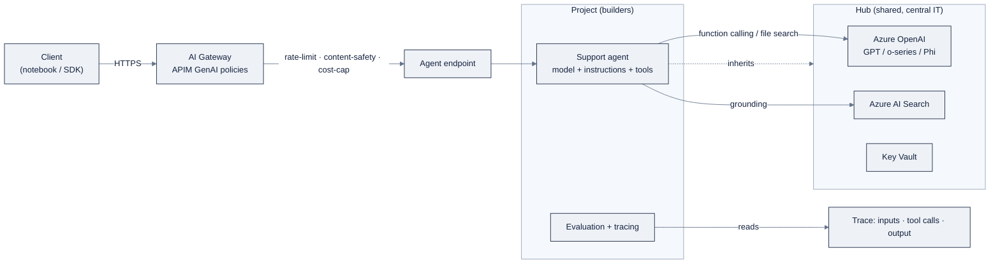

# Week 18: Azure AI Foundry

> Part of AI Engineering Lab · Week 18 of 24 · Section: Cloud AI Platforms · Category: Microsoft
> 🎯 Use case: Deploy the ZoroLogistics support agent to Azure AI Foundry with online evaluation and AI Gateway governance.

## The problem

You have spent Weeks 14 to 17 building the same ZoroLogistics support agent three different
ways, a hand-rolled ReAct loop, a LangGraph graph, a multi-agent triage team over MCP. It
tracks shipments, answers shipping-policy questions, and routes refunds over $500 to a human.
None of that code cares *where* it runs. But a real deployment does, because "where it runs"
is shorthand for a bundle of questions: who can call it, how fast, at what cost, and who is
watching when it says something wrong.

This week that "where" is **Azure AI Foundry**, and the question is sharper than it looks:
**the same support agent, three clouds, which one wins on governance vs speed vs cost?**
On Foundry the answer leans hard toward governance. Before you write a single call you
create a *hub* and a *project*; the platform forces a model of central IT owning shared
resources while builders work inside projects. That ceremony is friction on day one and the
whole point by day five: Foundry gives you a gateway that can rate-limit, content-filter,
and cost-cap an endpoint *before* a runaway agent spends your subscription.

Without it, the failure is boring and expensive: a deployed agent with no rate limit gets
hammered by a burst of support tickets, and a deployed agent with no evaluation has no
trace of *why* it failed. The before/after you are chasing is concrete, before, the agent
is a playground demo that answers one question at a time; after, it is a gateway-governed
endpoint with an eval trace showing the worst failure *fixed*, and a number for what the
week cost. This is the Microsoft column of the three-cloud matrix you finish in Week 20.

## Objectives

- [ ] By Friday you can create an AI Foundry hub and project, deploy a serverless model endpoint, and call it from Python with both the OpenAI SDK and `azure-ai-projects`.
- [ ] By Friday you can define the ZoroLogistics support agent (model + instructions + tools) in Foundry and expose it as an endpoint.
- [ ] By Friday you can run an evaluation batch, read the trace, fix the worst failure, and show a before/after score to prove the fix.
- [ ] By Friday you can name the AI Gateway governance controls (rate limit, content safety, cost cap) and publish a cost estimate for the week's runs.

## Day-by-day plan

| Day | Study | Run / build | Ship | Time |
|---|---|---|---|---|
| Mon | Hubs vs projects; serverless vs PTU | Create hub + project (portal or `az` CLI) | Project connection string captured | 2 to 3 h |
| Tue | Model catalog; the `model=` deployment-name gotcha | Deploy a serverless model; call it from the OpenAI SDK and `azure-ai-inference` | Working endpoint call | 2 to 3 h |
| Wed | Microsoft Agent Framework (model + instructions + tools) | Define the support agent; wire `track_shipment`; test in the playground | Agent definition | 2 to 3 h |
| Thu | Evaluation + tracing | Run an eval batch; read the trace; fix the worst failure | Before/after eval score | 2 to 3 h |
| Fri | AI Gateway (APIM GenAI policies) | Put the endpoint behind the gateway; rate-limit + content-safety + cost cap | Cost estimate + gateway config | 3 to 4 h |
| Sat | Review | Take the [quiz](quiz.md) (8/10) | Quiz score in Notes | 1 h |

## Concepts

Start with the shared mental model in
[`reference/knowledge-base/12-cloud-platforms.md`](../../reference/knowledge-base/12-cloud-platforms.md) and the
hands-on runbook in [`reference/platforms/ai-foundry/README.md`](../../reference/platforms/ai-foundry/README.md).
Foundry is Microsoft's control plane for generative AI: it glues Azure OpenAI, Azure AI
Search, Azure AI Content Safety, and Azure Machine Learning behind one portal and one SDK
family. The single idea that organizes the whole week is the **hub-and-project hierarchy**.

A **hub** owns the shared enterprise resources, the Azure OpenAI instances, AI Search
indexes, storage accounts, key vaults, and the network boundary. A **project** is the
workspace where a team actually builds: deployments, fine-tuning jobs, flows, evaluation
runs, traces, and agent definitions. Governance, identity, and security are configured once
at the hub and inherited by every project under it. Central IT (you, wearing the platform
hat) controls connectivity, models, and keys; builders (you, wearing the developer hat) get
freedom inside a project without re-plumbing infrastructure. Google's AI Studio has almost
no such ceremony, and AWS's IAM model is flatter, so hub/project is the distinctive thing to
carry into your Week 20 matrix.

| | Hub | Project |
|---|---|---|
| Owns | Azure OpenAI, AI Search, storage, key vaults, VNet | Deployments, flows, evals, traces, agents |
| Configured | Once, by central IT | Per team, by builders |
| Analogy | The building's utilities and wiring | One team's rented floor |
| Inherits | n/a | Everything the hub owns |

### Model catalog, serverless endpoints, and the Azure OpenAI relationship

The **model catalog** holds two classes of models. First, **Azure OpenAI models**, the
GPT family (GPT-4.1, GPT-4o), the o-series reasoning models (o1/o3/o4-mini), plus DALL·E,
Whisper, and Microsoft's own **Phi-4**, deployed into an Azure OpenAI resource. Second,
**open/third-party models** (Llama, Mistral, Cohere, DeepSeek) deployed as **serverless API
endpoints**, Microsoft's "Models-as-a-Service": you deploy a *name* and call an HTTPS URL,
owning no compute and paying per token. The distinction that trips newcomers: **Azure OpenAI
is a specific resource; Foundry is the platform around it.** For OpenAI models they are the
same thing seen through two lenses.

The deployment choice is a cost dial, not a single answer:

| Deployment | Billing | Owned by | Use it when |
|---|---|---|---|
| Serverless endpoint (MaaS) | Per token | Microsoft | Catalog/open models; the labs |
| Provisioned throughput (PTU) | Reserved capacity, billed regardless | Microsoft | Guaranteed throughput at scale, **skip for the labs** |
| Managed compute | Per compute-hour + tokens | You | Custom/fine-tuned models |

One **worked example** to make "billed regardless" visceral: a PTU unit that reserves, say,
a guaranteed 100K tokens/minute costs the same whether you send 1 token or 99,999. If your
support agent sees a 9-to-5 burst then idles overnight, PTU means you pay for the idle hours
too. Serverless pay-per-token is the honest default until you have steady, predictable
volume, which ZoroLogistics does not during a lab week.

### Agents, evaluation, tracing, and the AI Gateway

On Foundry an agent is just **model + instructions + tools + optional grounding**, the same
shape you built in Weeks 14 to 16. The **Microsoft Agent Framework** (with the Azure AI Agent
Service underneath) is the runtime; you define it in the portal, with `azure-ai-projects`,
or with the Agent Framework SDKs, and can attach the Week 16 MCP server as tools. Tools you
wire: function calling (`track_shipment`, `check_refund_policy`), file search over the Week 7
policy corpus, and optionally code interpreter.

**Evaluation and tracing** close the loop the way Week 11 taught: run built-in evaluators
(groundedness, relevance, coherence, fluency) or LLM-as-judge over the Week 11 golden set,
then read the **end-to-end trace**, inputs, tool calls, intermediate steps, output, to find
the worst failure. The discipline is unchanged: *ship a score, not a screenshot*, and fix the
worst failure with a before/after number.

The **AI Gateway** is Foundry's governance layer, implemented as **Azure API Management
(APIM)** with GenAI policies sitting in front of your endpoints. It gives token-rate limits,
token-usage quotas and cost caps, semantic caching, content-safety filtering, load balancing,
and model routing. A worked example of the control that matters most, a gateway policy that
caps a burst:

```yaml
# Sketch of an APIM GenAI policy for the support-agent endpoint
policies:
  - tokenRateLimit:
      tokensPerMinute: 100_000
      requestsPerMinute: 60
      key: subscription-id      # per-consumer, not global
  - tokenQuota:
      tokensPerMonth: 5_000_000  # cost cap: a runaway agent can't blow the budget
  - contentSafety:
      promptShield: enabled       # jailbreak detection on input
      groundedness: enabled       # output stays grounded in the corpus
```

Without this, a support-agent endpoint is an unmetered liability; with it, it is governed.
That is the enterprise reality this week exists to teach. The whole thing, drawn end to end:



The gateway is the choke point: every request crosses it, so rate limits, content safety, and
cost caps are enforced *before* the agent spends a token.

### Cost model and a cost-per-document calculation

Foundry's serverless/standard tier bills per token, input and output priced separately
(output usually pricier); fine-tuning adds training plus per-hour hosting. The notebook uses
placeholder prices you must re-verify against the live Azure OpenAI pricing page. **Worked
example**, the Week 6 bill-of-lading extraction, one document: the prompt plus BoL text is
about 600 characters ≈ 150 input tokens; the returned JSON is about 480 characters ≈ 120
output tokens. At $0.15 per 1M input and $0.60 per 1M output:

- Input: 150 × $0.15 / 1,000,000 = $0.0000225
- Output: 120 × $0.60 / 1,000,000 = $0.0000720
- **Total ≈ $0.0000945 per document**: under a tenth of a cent.

Scale that to the 20-document golden set ≈ $0.0019, and to a production volume of 1,000,000
documents/year ≈ **$94.50** for the model call alone. The point is not the exact number; it
is that cost is a *measured* input to the Week 20 matrix, not a guess.

### How it breaks

Foundry's failure modes are mostly governance-shaped. **The `model=` gotcha:** in Azure,
`model=` is your *deployment name*, not the raw model ID, paste the wrong string and you get
a 404 that looks like a code bug. **PTU without a plan:** reserve capacity and it bills
whether you use it or not; the labs must stay serverless. **A deployed agent with no
gateway:** rate-limit and cost-cap arrive *after* the first runaway burst, not before. **An
eval with no trace read:** a trace without a fix is a bug report; the loop is broken unless
the before/after score changes. **Keys instead of managed identity:** keys leak; production
guidance is Entra ID via `DefaultAzureCredential`. Finally, **a budget with no alert:** the
Azure free account does not make AI inference free, set a budget + alert before the first
deploy, and delete endpoints before the weekend.

## Notebook walkthrough

Two notebooks, both safe to run in **dry-run mode** when Azure credentials are absent, every
cloud call is wrapped so missing environment variables print setup instructions instead of
crashing.

**[`notebooks/01-foundry-serverless-endpoints.ipynb`](notebooks/01-foundry-serverless-endpoints.ipynb)**
bootstraps the repo root, then loads eight synthetic bills of lading with
`data.bol_samples(n=8, seed=5)` and defines `EXTRACT_PROMPT` (the Week 6 extraction prompt).
The auth cell reads `AZURE_AI_PROJECT_CONNECTION_STRING`, `AZURE_OPENAI_ENDPOINT`, and
`AZURE_OPENAI_API_KEY` and flips into dry-run without them. Two call paths follow:
`call_openai_sdk` (via `AzureOpenAI`, `api_version="2024-10-21"`) and `call_ai_projects` (via
`AIProjectClient.from_connection_string` + `DefaultAzureCredential`, then
`client.inference.get_chat_completions`). The extraction loop runs over `bols[:4]`, parses
JSON, and scores with `field_matches`, which compares `quantity`/`gross_weight_kg` as
integers, `declared_value_usd` as a float within 0.01, and everything else case-insensitively
against the ten ground-truth fields. The final cells print `OVERALL_FIELD_ACCURACY` (the mean
over the ten fields) and `TOTAL_ESTIMATED_COST_USD` from placeholder prices of
$0.15/M input and $0.60/M output. Correct output is a number in `[0, 1]` for accuracy and a
sub-cent dollar figure for cost.

**[`notebooks/02-foundry-agent-evaluation.ipynb`](notebooks/02-foundry-agent-evaluation.ipynb)**
loads 5,000 shipments and the four policy docs, defines the `track_shipment` tool, and
creates the agent with `AGENT_INSTRUCTIONS` ("never invent a tracking number; route refunds
over $500 to human approval"). The golden set (`Q1` to `Q4`) is scored against expected
substrings; the dry-run retriever `KEYWORD_DOCS` deliberately omits the `customs` → `POL-004`
mapping so Q4 fails, that is the planted bug. The trace cell prints which question, what the
agent said, and whether it passed. The fix cell adds `customs` and `storage` mappings and
re-runs, printing `AFTER_SCORE` and the improvement line (`BEFORE_SCORE → AFTER_SCORE`). The
final `EVAL_SCORE` is `after_score`; correct output in dry-run is `0.750 → 1.000`.

## The use case (Friday)

**Deliverable:** the support agent on Foundry with (a) a serverless endpoint callable from
Python, (b) an agent definition with at least one tool, (c) an evaluation batch + trace
showing the worst failure fixed, and (d) a cost estimate plus the AI Gateway controls you
configured (rate limit, content safety, cost cap).

**Zorost gate:** a stranger can read your Foundry deployment guide and reproduce the endpoint
call, the agent definition, and the eval score from the notebooks, same golden set, same
seed, and you can show them *what the trace revealed*: the worst failure, the fix, and the
before/after number. An agent without a trace is a demo; a trace without a fix is a bug report.

**Stretch:** swap in the Week 16 MCP server as the agent's tool layer via Foundry's MCP
support, then re-run the eval and show the triage team's score is preserved behind the
gateway. Fast learners can also convert a second model (Phi-4 vs a GPT deployment) and add
its per-field accuracy and cost to the two-row comparison.

## Common pitfalls

| Pitfall | Symptom | Fix |
|---|---|---|
| `model=` is the deployment name | 404 / model-not-found | Use the deployment name, not the raw model ID |
| PTU for the labs | Bill keeps climbing while idle | Serverless pay-per-token only |
| No gateway on a live endpoint | Unmetered burst, no safety filter | Put APIM + GenAI policies in front first |
| Eval without reading the trace | Score changes, no diagnosis | Read the trace; fix the *worst* failure |
| Keys committed to the repo | Leaked credential | `DefaultAzureCredential` + managed identity |
| No budget + alert | Surprise invoice | Budget + alert before the first deploy |
| Dry-run mistaken for success | `0.000` accuracy with no creds | Read the "⚠️ credentials not found" banner |
| Endpoints left running | Weekend spend | Delete/stop endpoints and the test hub |

## Glossary

- **Hub**: the shared enterprise container owning Azure OpenAI, Search, storage, keys, and networking.
- **Project**: a team workspace inside a hub holding deployments, flows, evals, traces, and agents.
- **Serverless endpoint (MaaS)**: a pay-per-token, Microsoft-managed deployment of a catalog model.
- **Provisioned throughput (PTU)**: reserved, guaranteed capacity that bills whether used or not.
- **Microsoft Agent Framework**: Foundry's agent runtime: model + instructions + tools + grounding.
- **AI Gateway**: APIM with GenAI policies (rate limits, quotas, caching, safety) in front of endpoints.
- **Azure AI Content Safety**: prompt shields, jailbreak and groundedness detection on model I/O.
- **Tracing**: the end-to-end record of inputs, tool calls, steps, and output for a run.
- **Evaluation**: built-in or LLM-as-judge scoring of a run against a golden set.
- **`azure-ai-projects`**: the Foundry-native SDK (`AIProjectClient`) for agents, evals, and tracing.
- **Entra ID**: Microsoft's identity layer; `DefaultAzureCredential` authenticates code without keys.
- **Golden set**: the Week 11 question/ground-truth pairs reused to score the agent.

## Self-check (quiz)

Take [`quiz.md`](quiz.md), 10 questions tied to these concepts and the notebook code. The
passing bar is **8/10**; record the score in your Notes.

## Exercises

Four graded exercises (easy / standard / stretch / portfolio) in
[`exercises.md`](exercises.md), from recording the printed cost, to a two-model accuracy
comparison, to putting the agent behind the AI Gateway, to the Microsoft column of the
three-cloud matrix. Hints are in the same file.

## Sources

- Azure AI Foundry architecture: https://learn.microsoft.com/en-us/azure/ai-foundry/concepts/architecture
- Azure OpenAI Service models: https://learn.microsoft.com/en-us/azure/ai-services/openai/concepts/models
- Microsoft Agent Framework overview: https://learn.microsoft.com/en-us/agent-framework/overview/
- Azure AI Projects client library: https://learn.microsoft.com/en-us/javascript/api/overview/azure/ai-projects-readme
- Connect agents to MCP server endpoints: https://learn.microsoft.com/en-us/azure/foundry/agents/how-to/tools/model-context-protocol
- Deploy models as serverless APIs: https://learn.microsoft.com/en-us/azure/ai-studio/how-to/deploy-models-serverless
- Azure AI Foundry deployment options: https://learn.microsoft.com/en-us/azure/ai-foundry/concepts/deployments-overview
- Azure API Management GenAI gateway policies: https://github.com/microsoft/azure-skills/blob/main/.github/plugins/azure-skills/skills/azure-aigateway/SKILL.md
- Azure OpenAI chat completion (OpenAI SDK): https://learn.microsoft.com/en-us/azure/ai-foundry/openai/how-to/chatgpt
