# Week 19: Google Vertex AIとGemini

> **日本語版** · [英語版](README.md) · [演習](exercises.ja.md) · [クイズ](quiz.ja.md)
> AI Engineering Labの一部 · Week 19 of 24 · Section: Cloud AI Platforms · Category: Google
> 🎯 **Use case:** multimodalなbill-of-lading pipeline。Gemini OCR → structured JSON → BigQuery。さらにsupport agentをADKでrebuild。
> · Notebooks: [01-gemini-multimodal-ocr.ipynb](notebooks/01-gemini-multimodal-ocr.ipynb) · [02-vertex-agent-and-eval.ipynb](notebooks/02-vertex-agent-and-eval.ipynb)

## 問題

先週、support agentはMicrosoftのgovernance機構の後ろで生きることを学びました。今週、同じagentをGoogleに移し、問題が反転します。Googleは**同じGemini modelへの二つの扉**を与えてくれます。keyをbrowserに入れるだけで済むfree sandbox（AI Studio）と、governedなenterprise platform（Vertex AI）です。片方はinstant gratification、もう片方はproductionです。ほとんどの人が犯す失敗は、この二つを交換可能として扱うことです。そしてその失敗のコストは現実です。**free tierは、defaultであなたのdataをGoogle製品の改善に使う可能性がある**からです。

しかしGoogleはZoroLogisticsに、本当に別の仕事も渡してくれます。freightは紙の上で動きます。bill of lading、customs declaration、commercial invoiceです。それらの文書を読むことがbottleneckであり、Geminiのnativeな**multimodal**入力（一回のcallでimageとschema、返ってくるのはstructured JSON）は、「BoLをscanして打ち込む」をcomputer-vision projectから単一のAPI callに変えます。これがdocument作業における、他の二つのcloudに対するGoogleの正直なedgeであり、Week 19のuse caseが別のchat agentではなくOCRである理由です。

つまり今週には二つのthreadがあります。第一にpipelineを証明します。synthetic bill of ladingをrenderし、Gemini visionで十fieldを抽出し、ground truthに対する**per-field accuracy**と**cost per document**を測ります。第二に、support agentを**ADK**でcode-firstにrebuildし、golden setで評価して、Foundry版と比較します。その比較がdeliverableの半分だからです。今週の前は「Gemini OCR」はTwitterで見たdemoです。後は、per-documentの価格とfree tier vs Vertexについての一行verdictを持つ、測られたpipelineです。per-fieldの数字のないpipelineは、JSON blobのscreenshotにすぎません。

## 目標

- [ ] 金曜日までに、統一された`google-genai` SDKで、Google AI Studio（API key）とVertex AI（project + ADC）の両方からGeminiを呼べる。
- [ ] 金曜日までに、multimodal BoL pipelineをbuildできる。syntheticなBoL imageをlocalでrenderし、Gemini visionでfieldをstructured JSONに抽出し、ground truthに対するper-field accuracyを測る。
- [ ] 金曜日までに、support agentをADKでcode-firstにrebuildし、golden-set evaluationを実行できる。
- [ ] 金曜日までに、cost per documentを推定し、機密dataにfree AI Studio tierを使えない理由を説明できる。

## 日ごとの計画

| Day | Study | Run / build | Ship | Time |
|---|---|---|---|---|
| Mon | AI Studio vs Vertex。free-tierのdata rule | API keyを取得。quotaを確認。`gcloud auth application-default login` | 動くGemini call | 2〜3時間 |
| Tue | Gemini multimodalとstructured output | BoL PNGsをrender。JSONに抽出。per-field accuracyを測定 | accuracy table | 2〜3時間 |
| Wed | ADK（code-first）vs Agent Builder vs Agent Engine | support agentをADKでrebuild。Foundry版と比較 | ADK agent | 2〜3時間 |
| Thu | Vertex evaluation。BigQuery ML | golden-set evalを実行。結果をBigQueryにlog | eval score + table | 2〜3時間 |
| Fri | Pricing tierとquota | end-to-end pipeline（images → clean table）。cost per documentを公開 | cost-per-documentの数字 | 3〜4時間 |
| Sat | 復習 | [quiz](quiz.md)を受ける（8/10） | quiz scoreをNotesに記録 | 1時間 |

## 概念

[`reference/knowledge-base/12-cloud-platforms.md`](../../reference/knowledge-base/12-cloud-platforms.md) の共有mental modelと、[`reference/platforms/google-vertex/README.md`](../../reference/platforms/google-vertex/README.md) のrunbookを読んでください。Googleはgenerative-AI surfaceを**同じGemini modelへの二つのentry point**に分けており、その分割が今週の最初のlessonです。

**Google AI Studio**（`aistudio.google.com`）は実験sandboxです。Google accountとAPI keyがあれば、infrastructureゼロで数分で動くGemini callが手に入ります。**Vertex AI**（Google Cloud Console）はenterprise platformで、同じmodelにcloud-project billing、IAM、VPC Service Controls、quota、MLOpsが付きます。移行pathは意図的です。AI Studioで始め、後で*同じcode*を別credential（`vertexai=True` + project/location）でVertexに向けます。早期に内部化して決して破らない一つのrule: **AI Studioのfree tierは、defaultであなたのdataをGoogle製品の改善に使う可能性があるため、機密dataには使えません。** ZoroLogisticsのdataはsyntheticなので安全ですが、分離する習慣こそが本当のdeliverableです。

| | Google AI Studio | Vertex AI |
|---|---|---|
| URL | `aistudio.google.com` | Google Cloud Console |
| 認証 | API key（Google account） | GCP project + IAM / ADC |
| 課金 | free tier + 有料Gemini API | cloud project billing |
| Governance | ほぼなし（dataがdefaultでGoogleをtrainする可能性） | IAM、VPC-SC、CMEK、quota、audit |
| 向いている場面 | prototyping、学習 | production化 |

### multimodal入力としてのGeminiのnativity

二番目のconceptは、use caseがOCRである理由です。Geminiは一回のcallでimageとtextを受け取り、**response schemaに沿ったstructured JSON**を返せます。これが「scanされたbill of ladingを読む」を、typedな出力を持つ単一のAPI callに畳み込みます。modelの梯子は単一の選択ではなくcost/quality dialです。

| Model rung | 役割 | Trade-off |
|---|---|---|
| `gemini-2.5-flash-lite` | 最安。大volume・単純な抽出 | 最低cost、最低reasoning |
| `gemini-2.5-flash` | workhorse。本演習のdefault | 最良のcost/latency balance |
| `gemini-2.5-pro` | frontier reasoning。難しいlayout | 最高cost、最高品質 |
| "Thinking" variant | 予算付きのinternal reasoning | token増、より深いreasoning |

Week 8の選択習慣がそのまま使えます。accuracy barをクリアする最も安いmodelを選び、数字で証明する。**Model Garden**はGeminiの周りのVertexのcatalog層で、Geminiが適切なtoolでないときにImagen（image）、Veo（video）、Chirp（speech）、open model（Llama、Mistral、Gemma）をsurfaceします。

### 三層のagent stack

Googleはagentをbuildする方法を、low-codeからcode-firstまで三つ与えてくれます。

| 層 | Style | 使うとき |
|---|---|---|
| **Agent Builder** | no-code/low-code、grounded RAG | 高速prototype、非engineer |
| **Agent Engine** | agentをendpointとしてhostするmanaged runtime | production deployment |
| **ADK** | code-first、open-source framework | engineering control。本演習のdefault |

**ADK**（Agent Development Kit）はcode-firstのopen-source frameworkです。`Agent(model,
name, instruction, tools)` と`FunctionTool`でwrapしたfunction、LangGraph流のorchestration、multi-agent supportを持ちます。Week 14〜16のsupport agentをADKでrebuildし、**Agent Engine**にdeployして、Week 18のFoundry版と比較します。ADKとAgent EngineはどちらもMCPをsupportするので、Week 16のserverはそのまま移植できます。

### BigQuery ML: warehouseから出ないAI

Google特有の動きが**BigQuery ML**です。MLを*warehouseの中でSQLで*実行します。生成やembeddingのためにGeminiへのremote callも含みます。ZoroLogisticsでは、OCR出力をBigQueryにloadし、SQLから出ずに`ML.GENERATE_TEXT`で行をclassifyできることを意味します。stretch exerciseの実例、抽出された各shipmentのfreight-terms riskをclassifyします。

```sql
SELECT
  ml_generate_text_result['candidates'][0]['content']['parts'][0]['text'] AS risk_label
FROM ML.GENERATE_TEXT(
  MODEL `zorost.gemini_model`,
  (SELECT CONCAT('Classify the freight risk of this shipment: ', commodity, ' from ',
                 port_of_loading, ' to ', port_of_discharge) AS prompt
   FROM `zorost.bol_extractions`)
);
```

data/analytics teamがGCPに傾く理由がこれです。pipelineはwarehouseから出ません。end-to-endのWeek 19 pipelineをflowとして描くと次のとおりです。

```mermaid
%%{init:{"theme":"base","fontFamily":"Helvetica Neue,Helvetica,Arial,sans-serif","flowchart":{"curve":"basis","padding":14,"nodeSpacing":45,"rankSpacing":55},"themeVariables":{"fontSize":"15px","background":"#FFFFFF","primaryColor":"#EEF2F7","primaryTextColor":"#14213D","primaryBorderColor":"#14213D","secondaryColor":"#FFF1E3","secondaryTextColor":"#14213D","tertiaryColor":"#E7F4F1","tertiaryTextColor":"#14213D","lineColor":"#64748B","textColor":"#14213D","edgeLabelBackground":"#FFFFFF","clusterBkg":"#F5F8FC","clusterBorder":"#94A3B8","nodeBorder":"#14213D","mainBkg":"#EEF2F7","titleColor":"#14213D"}}}%%
flowchart LR
    B["Synthetic BoL text<br/>zoro.data.bol_samples()"] --> R["render_bol_png<br/>Pillow"]
    R --> IMG["BoL PNG image"]
    IMG --> G["Gemini vision<br/>gemini-2.5-flash"]
    G -->|"response_mime_type: json"| J["Structured JSON<br/>10 fields"]
    J --> V["field_matches<br/>vs ground truth"]
    V --> A["Per-field accuracy"]
    J --> BQ["BigQuery"]
    BQ --> ML["ML.GENERATE_TEXT<br/>classification"]
    A --> C["Cost per document"]
```



左半分がOCR pipeline、右半分が任意のin-warehouse stepです。両方が測られた数字、per-field accuracyとcost per documentを生み、Week 20 matrixに着地します。

### cost per documentとfree-tierの境界

Vertexと有料Gemini APIはtokenごと、imageごとに課金します。AI Studioのfree tierはdollar budgetではなく、日次の*request* quotaです（歴史的にはmodelとtierにより数十〜約1,000 requests/day）。**実例**、`gemini-2.5-flash`でのBoL文書一枚。image一枚と約150 input token、約120 output token。placeholder priceをimage $0.000315、input $0.30 per 1M、output $2.50 per 1Mとすると:

- Image: $0.000315
- Input: 150 × $0.30 / 1,000,000 = $0.000045
- Output: 120 × $2.50 / 1,000,000 = $0.00030
- **合計 ≈ $0.00066 per document。**

だからfree tierはlab scaleではfreeに感じます。しかし*binding*な制約はrequest quotaであり、*本当の*costはdollarではなくgovernanceです。productionの一日がGeminiに送る同じ100文書は、invoiceがほぼゼロでも、free tierではdata ruleに違反します。`429` error（code bugではなくquota問題）に注意し、batchの*前に*quotaを確認し、Vertex runの前にbilling budgetを設定してください。

### うまくいかない理由

Gemini pipelineは予測可能な形で壊れます。**AI Studioに機密dataを送る:** free tierはdefaultでそれをtrainに使う可能性があり、分離する習慣が脚注ではなくdeliverableです。**batch途中の`429`:** それはquota天井で、consoleでregionごと/modelごとに引き上げるものであり、codeで直すものではありません。**Region不一致:** Geminiの可用性はregionごとです。404sするmodelは大抵そのregionで無効化されています（`us-central1`が安全なdefault）。**Auth混乱:** 同じ`google-genai` clientは`vertexai=True` flagで挙動が変わります。`ADC` errorは、`gcloud auth application-default login`なしでVertex modeにいることを意味します。**modelからのparseできないJSON:** Geminiはmarkdown fenceや末尾のcommaを返すことがあります。fenceをstripし、採点の前にvalidateしてください。notebookがやる通りに。最後に、**per-field accuracyではなく「動いた」を測ること:** 正しそうに見えるJSON blobでもconsigneeが間違っていることがあり、per-fieldの数字だけが正直なmetricです。

## Notebook walkthrough

二つのnotebookがあります。local部分（image render、accuracy、cost、dry-runのagent loop）はkeyなしで動き、Gemini/Vertexのcallだけがcredentialを必要とします。

**[`notebooks/01-gemini-multimodal-ocr.ipynb`](notebooks/01-gemini-multimodal-ocr.ipynb)**
はrepoをbootstrapし、次に`render_bol_png`が各synthetic BoLのtextをPillowで白いPNGに描きます（`DejaVuSansMono.ttf`を試し、default fontにfallback）。`bol_images/` directoryへの書き出しで、Geminiはpromptのtextを読むのではなく*vision*をexerciseします。六つのsampleが`data.bol_samples(n=6, seed=5)`でloadされます。`EXTRACT_PROMPT_OCR`はちょうど十個のJSON keyを要求し、`gemini_extract`は`genai.Client(api_key=...)`を`config={"response_mime_type": "application/json"}`とimageを`inline_data`として呼びます。loopは`img_paths[:4]`に対して回り、markdown fenceをstripし、`field_matches`（Week 18と同じ十field、型awareな比較器）で採点します。最後のcellは`OVERALL_FIELD_ACCURACY`と、placeholder price（$0.000315/image、$0.30/M in、$2.50/M out）からの`COST_PER_DOCUMENT_USD`をprintします。正しい出力: accuracyは`[0, 1]`、costは一セント未満の値です。

**[`notebooks/02-vertex-agent-and-eval.ipynb`](notebooks/02-vertex-agent-and-eval.ipynb)**
は5,000件のshipmentと四つのpolicy docをloadし、`track_shipment`と`check_refund_policy`（$500超のrefund → "Requires human approval"）を定義し、ADK `Agent(model="gemini-2.5-flash", ...)`の中で`FunctionTool`としてwrapします。`vertex_client()` helperがenterprise pathを示します: `genai.Client(vertexai=True, project=..., location="us-central1")`。golden set（`Q1`〜`Q4`）はlocal loop（本当にtoolを使います。tracking質問は`track_shipment`を呼ぶ）で採点され、`EVAL_SCORE`をprintします。任意のBigQuery cellは、`GOOGLE_CLOUD_PROJECT`と`BIGQUERY_EVAL_TABLE`が設定されていれば`bigquery.Client().load_table_from_dataframe`でeval行をlogし、最後のcellが`EVAL_SCORE`を再printします。dry-runでのscoreは`1.000`（golden question四つすべてがpass）で、Foundryとの比較noteがWeek 20 matrixへの架け橋です。

## Use case（Friday）

**Deliverable:** end-to-endのmultimodal pipeline。BoL image → Gemini structured JSON →（任意で）BigQuery。(a) Week 6のgolden setに対するper-field accuracy、(b) cost per document、(c) ADKでrebuildしgolden setで評価したsupport agent。

**Zorost gate:** 見知らぬ人があなたのnotebookを再実行し（同じseed、同じrender済みimage）、per-field accuracyとcost-per-documentの数字を再現できること。そしてあなたは、*Geminiが何を間違えたか*、つまり抽出に失敗した具体的なfieldと文書を見せられ、free tierとVertexのどちらがこの仕事に合うかについて一行のverdictを出せること。

**Stretch:** 抽出したJSONをBigQueryにloadし、行に対して`ML.GENERATE_TEXT`によるclassifyを一回実行します（例: freight-terms整合性やcommodity-risk label）。schemaと一つのqueryをdocument化すること。速く進む人は、二つ目のmodel rung（`flash-lite` vs `flash`）で抽出を再実行し、accuracy-vs-costの二行tableを追加できます。

## よくあるpitfall

| Pitfall | 症状 | Fix |
|---|---|---|
| AI Studioに機密dataを流す | dataがdefaultでGoogleをtrainする可能性 | synthetic dataでprototype。最終pipelineはVertexで |
| batch途中の`429` | quotaであってcode bugではない | batchの前にregionごとのquotaを確認・引き上げ |
| Region不一致 | modelが404sする | modelが`us-central1`（またはあなたのregion）で有効か確認 |
| `vertexai=True`のauth混乱 | `ADC` error | 先に`gcloud auth application-default login` |
| parseできないJSON | `json.loads`がfence/commaでthrow | fenceをstrip。採点前にvalidate |
| 「動いた」を採点する | per-fieldのsignalがない | ground truthに対してper-field accuracyを測る |
| free-tier quota枯渇 | batchが途中で死ぬ | cost/quota確認まではcloud runを4 imageに留める |
| billing budgetなし | surpriseなVertex invoice | どんなVertex batchの前にでもbudget + alertを設定 |

## Glossary

- **Google AI Studio**: freeでkey baseのGemini sandbox（`aistudio.google.com`）。
- **Vertex AI**: 同じGemini modelに対するGoogleのgovernedなenterprise platform。
- **ADC (application default credentials)**: Vertex codeのためのlocal credential chain（`gcloud auth application-default login`）。
- **`google-genai`**: AI Studio（`api_key`）またはVertex（`vertexai=True`）に向く統一SDK。
- **Multimodal**: 一回のcallでimage + textを受け取ること。document OCRにおけるGeminiのedge。
- **Response schema**: typed schemaに制約されたstructured JSON出力を要求すること。
- **Model Garden**: 第一party、open、partner modelのVertex catalog。
- **ADK (Agent Development Kit)**: Googleのcode-firstでopen-sourceなagent framework。
- **Agent Engine**: ADK/Agent Builder agentをendpointとしてhostするmanaged runtime。
- **BigQuery ML**: BigQueryの中でSQLでML（Geminiへの`ML.GENERATE_TEXT`を含む）を実行すること。
- **Golden set**: agentを採点するために再利用するWeek 11のquestion/ground-truth pair。
- **Per-field accuracy**: 十個のBoL fieldのうち正しく抽出された割合。fieldごとに測る。

## Self-check（quiz）

[`quiz.md`](quiz.md)を受けてください。これらのconceptとnotebook codeに紐づく10問です。合格ラインは**8/10**。scoreをNotesに記録してください。

## Exercises

四つのgraded exercise（easy / standard / stretch / portfolio）が[`exercises.md`](exercises.md)にあります。per-field accuracyとcostの記録から、二model rung比較、BigQueryの`ML.GENERATE_TEXT` query、三cloud matrixのGoogle列まで。hintは同じfileにあります。

## Sources

- Migrate from Google AI Studio to Vertex AI: https://docs.cloud.google.com/vertex-ai/generative-ai/docs/migrate/migrate-google-ai
- Model Garden supported models: https://docs.cloud.google.com/vertex-ai/generative-ai/docs/model-garden/available-models
- Tune Gemini models with supervised fine-tuning: https://docs.cloud.google.com/vertex-ai/generative-ai/docs/models/gemini-use-supervised-tuning
- Migrate to the Google GenAI SDK: https://ai.google.dev/gemini-api/docs/migrate
- Vertex AI Agent Builder (product page): https://cloud.google.com/products/agent-builder
- Gemini 2.5 model family expansion (Google blog): https://blog.google/products-and-platforms/products/gemini/gemini-2-5-model-family-expands/
- Gemini API free tier / quotas: https://discuss.ai.google.dev/t/gemini-api-free-tier-daily-quota-25-rpd-blocking-paid-usage-tier-1-1000-rpd/79899
- BigQuery ML remote models for Gemini: https://cloud.google.com/bigquery/docs/generate-text-tutorial
