# Week 19: Google Vertex AI & Gemini

> Part of AI Engineering Lab · Week 19 of 24 · Section: Cloud AI Platforms · Category: Google
> 🎯 Use case: A multimodal bill-of-lading pipeline, Gemini OCR → structured JSON → BigQuery, plus the support agent rebuilt with ADK.

## The problem

Last week the support agent learned to live behind Microsoft's governance machinery. This
week the same agent moves to Google, and the problem inverts. Google gives you **two doors
to the same Gemini models**: a free, key-in-your-browser sandbox (AI Studio) and a governed
enterprise platform (Vertex AI). One is instant gratification; the other is production. The
mistake most people make is treating them as interchangeable, and the cost of that mistake
is real, because **the free tier may use your data to improve Google's products by default**.

But Google also hands ZoroLogistics a genuinely different job. Freight runs on paper: bills
of lading, customs declarations, commercial invoices. Reading those documents is the
bottleneck, and Gemini's native **multimodal** input, an image and a schema in one call,
structured JSON back, turns "scan and key in the BoL" from a computer-vision project into a
single API call. That is Google's honest edge over the other two clouds for document work,
and it is why Week 19's use case is OCR, not another chat agent.

So the week has two threads. First, prove the pipeline: render synthetic bills of lading,
extract ten fields with Gemini vision, and measure **per-field accuracy** and **cost per
document** against ground truth. Second, rebuild the support agent code-first with **ADK**
and evaluate it on the golden set, then compare that to the Foundry version, because that
comparison is half the deliverable. Before the week, "Gemini OCR" is a demo you saw on
Twitter; after, it is a measured pipeline with a per-document price and a one-line verdict on
free tier vs Vertex. A pipeline without a per-field number is just a screenshot of a JSON
blob.

## Objectives

- [ ] By Friday you can call Gemini from both Google AI Studio (API key) and Vertex AI (project + ADC) with the unified `google-genai` SDK.
- [ ] By Friday you can build a multimodal BoL pipeline: render synthetic BoL images locally, extract fields to structured JSON with Gemini vision, and measure per-field accuracy against ground truth.
- [ ] By Friday you can rebuild the support agent code-first with ADK and run a golden-set evaluation.
- [ ] By Friday you can estimate cost per document and explain why the free AI Studio tier is off-limits for sensitive data.

## Day-by-day plan

| Day | Study | Run / build | Ship | Time |
|---|---|---|---|---|
| Mon | AI Studio vs Vertex; the free-tier data rule | Get an API key; check quotas; `gcloud auth application-default login` | Working Gemini call | 2 to 3 h |
| Tue | Gemini multimodal + structured output | Render BoL PNGs; extract to JSON; measure per-field accuracy | Accuracy table | 2 to 3 h |
| Wed | ADK (code-first) vs Agent Builder vs Agent Engine | Rebuild the support agent with ADK; compare to the Foundry version | ADK agent | 2 to 3 h |
| Thu | Vertex evaluation; BigQuery ML | Run a golden-set eval; log results to BigQuery | Eval score + table | 2 to 3 h |
| Fri | Pricing tiers & quotas | End-to-end pipeline (images → clean table); publish cost per document | Cost-per-document number | 3 to 4 h |
| Sat | Review | Take the [quiz](quiz.md) (8/10) | Quiz score in Notes | 1 h |

## Concepts

Read the shared mental model in
[`reference/knowledge-base/12-cloud-platforms.md`](../../reference/knowledge-base/12-cloud-platforms.md) and the
runbook in [`reference/platforms/google-vertex/README.md`](../../reference/platforms/google-vertex/README.md).
Google splits its generative-AI surface into **two entry points over the same Gemini models**,
and that split is the week's first lesson.

**Google AI Studio** (`aistudio.google.com`) is the experiment sandbox: a Google account and
an API key get a working Gemini call in minutes with zero infrastructure. **Vertex AI**
(Google Cloud Console) is the enterprise platform, the same models, but with cloud-project
billing, IAM, VPC Service Controls, quotas, and MLOps. The migration path is deliberate: you
start in AI Studio and later point the *same code* at Vertex with different credentials
(`vertexai=True` + project/location). The one rule to internalize early and never break:
**AI Studio's free tier may use your data to improve Google's products by default, so it is
not for sensitive data.** ZoroLogistics data is synthetic, so it is safe, but the
segregation habit is the real deliverable.

| | Google AI Studio | Vertex AI |
|---|---|---|
| URL | `aistudio.google.com` | Google Cloud Console |
| Auth | API key (Google account) | GCP project + IAM / ADC |
| Billing | Free tier + paid Gemini API | Cloud project billing |
| Governance | ~none (data may train Google by default) | IAM, VPC-SC, CMEK, quotas, audit |
| Best for | Prototyping, learning | Productionizing |

### Gemini's nativity for multimodal input

The second concept is why the use case is OCR. Gemini accepts an image and text in one call
and can return **structured JSON against a response schema**, which collapses "read a
scanned bill of lading" into a single API call with a typed output. The model ladder is a
cost/quality dial, not a single choice:

| Model rung | Role | Trade-off |
|---|---|---|
| `gemini-2.5-flash-lite` | Cheapest; high-volume/simple extraction | Lowest cost, lowest reasoning |
| `gemini-2.5-flash` | Workhorse; the lab default | Best cost/latency balance |
| `gemini-2.5-pro` | Frontier reasoning; hard layouts | Highest cost, best quality |
| "Thinking" variants | Internal reasoning with a budget | More tokens, deeper reasoning |

The selection habit from Week 8 transfers directly: pick the cheapest model that clears your
accuracy bar, and prove it with a number. **Model Garden** is Vertex's catalog layer around
Gemini, it surfaces Imagen (images), Veo (video), Chirp (speech), and open models (Llama,
Mistral, Gemma) when Gemini isn't the right tool.

### The agent stack in three layers

Google gives you three ways to build the agent, from low-code to code-first:

| Layer | Style | When |
|---|---|---|
| **Agent Builder** | No-code/low-code, grounded RAG | Fast prototypes, non-engineers |
| **Agent Engine** | Managed runtime hosting agents as endpoints | Production deployment |
| **ADK** | Code-first, open-source framework | Engineering control; the lab default |

**ADK** (Agent Development Kit) is the code-first, open-source framework, `Agent(model,
name, instruction, tools)` with `FunctionTool`-wrapped functions, LangGraph-style
orchestration, and multi-agent support. You rebuild the Week 14 to 16 support agent with ADK,
deploy it to **Agent Engine**, and compare against the Week 18 Foundry version. ADK and
Agent Engine both support MCP, so the Week 16 server ports across.

### BigQuery ML: AI without leaving the warehouse

The distinctive Google move is **BigQuery ML**, run ML *inside the warehouse with SQL*,
including remote calls to Gemini for generation and embedding. For ZoroLogistics this means:
load the OCR output into BigQuery, then classify rows with `ML.GENERATE_TEXT` without leaving
SQL. A worked example for the stretch exercise, classifying each extracted shipment's
freight-terms risk:

```sql
SELECT
  ml_generate_text_result['candidates'][0]['content']['parts'][0]['text'] AS risk_label
FROM ML.GENERATE_TEXT(
  MODEL `zorost.gemini_model`,
  (SELECT CONCAT('Classify the freight risk of this shipment: ', commodity, ' from ',
                 port_of_loading, ' to ', port_of_discharge) AS prompt
   FROM `zorost.bol_extractions`)
);
```

This is why data/analytics teams often lean GCP: the pipeline never leaves the warehouse.
The end-to-end Week 19 pipeline, drawn as a flow:

```mermaid
%%{init:{"theme":"base","fontFamily":"Helvetica Neue,Helvetica,Arial,sans-serif","flowchart":{"curve":"basis","padding":14,"nodeSpacing":45,"rankSpacing":55},"themeVariables":{"fontSize":"15px","background":"#FFFFFF","primaryColor":"#EEF2F7","primaryTextColor":"#14213D","primaryBorderColor":"#14213D","secondaryColor":"#FFF1E3","secondaryTextColor":"#14213D","tertiaryColor":"#E7F4F1","tertiaryTextColor":"#14213D","lineColor":"#64748B","textColor":"#14213D","edgeLabelBackground":"#FFFFFF","clusterBkg":"#F5F8FC","clusterBorder":"#94A3B8","nodeBorder":"#14213D","mainBkg":"#EEF2F7","titleColor":"#14213D"}}}%%
flowchart LR
    B["Synthetic BoL text<br/>zoro.data.bol_samples()"] --> R["render_bol_png<br/>Pillow"]
    R --> IMG["BoL PNG image"]
    IMG --> G["Gemini vision<br/>gemini-2.5-flash"]
    G -->|"response_mime_type: json"| J["Structured JSON<br/>10 fields"]
    J --> V["field_matches<br/>vs ground truth"]
    V --> A["Per-field accuracy"]
    J --> BQ["BigQuery"]
    BQ --> ML["ML.GENERATE_TEXT<br/>classification"]
    A --> C["Cost per document"]
```



The left half is the OCR pipeline; the right half is the optional in-warehouse step. Both feed
a measured number, per-field accuracy and cost per document, that lands in the Week 20
matrix.

### Cost per document, and the free-tier boundary

Vertex and the paid Gemini API bill per token and per image; AI Studio's free tier is a
daily *request* quota (historically tens to ~1,000 requests/day depending on model and tier),
not a dollar budget. **Worked example**, one BoL document on `gemini-2.5-flash`: one image
plus ~150 input tokens and ~120 output tokens. With placeholder prices of $0.000315/image,
$0.30 per 1M input, and $2.50 per 1M output:

- Image: $0.000315
- Input: 150 × $0.30 / 1,000,000 = $0.000045
- Output: 120 × $2.50 / 1,000,000 = $0.00030
- **Total ≈ $0.00066 per document.**

That is why the free tier feels free at lab scale, but the *binding* constraint is the
request quota, and the *real* cost is governance, not dollars: the same 100 documents a
production day sends to Gemini would violate the data rule on the free tier even though the
invoice is near zero. Watch for `429` errors (a quota problem, not a code bug), check quotas
*before* the batch, and set a billing budget before any Vertex run.

### How it breaks

Gemini pipelines break in predictable ways. **Sending sensitive data through AI Studio:**
the free tier may train on it by default, the segregation habit is the deliverable, not a
footnote. **Hitting `429`s mid-batch:** that is a quota ceiling, raised per-region/per-model
in the console, not something you fix in code. **Region mismatch:** Gemini availability is
per-region; a model that 404s is usually disabled in that region (`us-central1` is the safe
default). **Auth confusion:** the same `google-genai` client changes behavior on the
`vertexai=True` flag, an `ADC` error means you are in Vertex mode without
`gcloud auth application-default login`. **Unparsed JSON from the model:** Gemini returns
markdown fences or a trailing comma; strip fences and validate before scoring, exactly as the
notebook does. Finally, **measuring "it worked" instead of per-field accuracy:** a correct
looking JSON blob can still have the wrong consignee, the per-field number is the only
honest metric.

## Notebook walkthrough

Two notebooks; the local parts (image rendering, accuracy, cost, the dry-run agent loop) run
without any key, and only the Gemini/Vertex call needs credentials.

**[`notebooks/01-gemini-multimodal-ocr.ipynb`](notebooks/01-gemini-multimodal-ocr.ipynb)**
bootstraps the repo, then `render_bol_png` draws each synthetic BoL's text onto a white PNG
with Pillow (trying `DejaVuSansMono.ttf`, falling back to a default font) into a `bol_images/`
directory, this makes Gemini exercise *vision*, not read text from the prompt. Six samples
load via `data.bol_samples(n=6, seed=5)`. `EXTRACT_PROMPT_OCR` asks for exactly the ten JSON
keys, and `gemini_extract` calls `genai.Client(api_key=...)` with
`config={"response_mime_type": "application/json"}` and the image as `inline_data`. The loop
runs over `img_paths[:4]`, strips markdown fences, and scores with `field_matches` (the same
ten-field, type-aware comparator as Week 18). The final cells print `OVERALL_FIELD_ACCURACY`
and `COST_PER_DOCUMENT_USD` from placeholder prices ($0.000315/image, $0.30/M in, $2.50/M
out). Correct output: accuracy in `[0, 1]`, cost a sub-cent figure.

**[`notebooks/02-vertex-agent-and-eval.ipynb`](notebooks/02-vertex-agent-and-eval.ipynb)**
loads 5,000 shipments and the four policy docs, defines `track_shipment` and
`check_refund_policy` (refunds over $500 → "Requires human approval"), and wraps them as
`FunctionTool`s in an ADK `Agent(model="gemini-2.5-flash", ...)`. The `vertex_client()` helper
shows the enterprise path: `genai.Client(vertexai=True, project=..., location="us-central1")`.
The golden set (`Q1` to `Q4`) is scored by the local loop (which does real tool use: a tracking
question calls `track_shipment`), printing `EVAL_SCORE`. The optional BigQuery cell logs the
eval rows via `bigquery.Client().load_table_from_dataframe` when `GOOGLE_CLOUD_PROJECT` and
`BIGQUERY_EVAL_TABLE` are set, and the final cell re-prints `EVAL_SCORE`. In dry-run the score
is `1.000` (all four golden questions pass); the compare-with-Foundry note is the bridge to
the Week 20 matrix.

## The use case (Friday)

**Deliverable:** the end-to-end multimodal pipeline, BoL images → Gemini structured JSON →
(optionally) BigQuery, with (a) per-field accuracy vs your Week 6 golden set, (b) a cost per
document, and (c) the support agent rebuilt with ADK and evaluated on the golden set.

**Zorost gate:** a stranger can re-run your notebook (same seed, same rendered images) and
reproduce your per-field accuracy and cost-per-document numbers, and you can show them *what
Gemini got wrong*, the specific fields and documents that failed extraction, plus a
one-line verdict on whether the free tier or Vertex is right for the job.

**Stretch:** load the extracted JSON into BigQuery and run one `ML.GENERATE_TEXT`
classification over the rows (e.g. a freight-terms consistency or commodity-risk label),
documenting the schema and one query. Fast learners can also re-run extraction on a second
model rung (`flash-lite` vs `flash`) and add a two-row accuracy-vs-cost table.

## Common pitfalls

| Pitfall | Symptom | Fix |
|---|---|---|
| Sensitive data through AI Studio | Data may train Google by default | Prototype on synthetic data; final pipeline on Vertex |
| `429` mid-batch | Quota, not a code bug | Check/raise per-region quotas before the batch |
| Region mismatch | Model 404s | Confirm the model is enabled in `us-central1` (or your region) |
| `vertexai=True` auth confusion | `ADC` errors | `gcloud auth application-default login` first |
| Unparsed JSON | `json.loads` throws on fences/commas | Strip fences; validate before scoring |
| Scoring "it worked" | No per-field signal | Measure per-field accuracy against ground truth |
| Free-tier quota exhaustion | Batch dies halfway | Keep the cloud run to 4 images until cost/quota confirmed |
| No billing budget | Surprise Vertex invoice | Set a budget + alert before any Vertex batch |

## Glossary

- **Google AI Studio**: the free, key-based Gemini sandbox (`aistudio.google.com`).
- **Vertex AI**: Google's governed enterprise platform for the same Gemini models.
- **ADC (application default credentials)**: the local credential chain (`gcloud auth application-default login`) for Vertex code.
- **`google-genai`**: the unified SDK that targets AI Studio (`api_key`) or Vertex (`vertexai=True`).
- **Multimodal**: accepting image + text in one call; Gemini's edge for document OCR.
- **Response schema**: requesting structured JSON output constrained to a typed schema.
- **Model Garden**: Vertex's catalog of first-party, open, and partner models.
- **ADK (Agent Development Kit)**: Google's code-first, open-source agent framework.
- **Agent Engine**: the managed runtime that hosts ADK/Agent Builder agents as endpoints.
- **BigQuery ML**: running ML (including `ML.GENERATE_TEXT` to Gemini) inside BigQuery with SQL.
- **Golden set**: the Week 11 question/ground-truth pairs reused to score the agent.
- **Per-field accuracy**: the fraction of the ten BoL fields extracted correctly, measured field-by-field.

## Self-check (quiz)

Take [`quiz.md`](quiz.md), 10 questions tied to these concepts and the notebook code. The
passing bar is **8/10**; record the score in your Notes.

## Exercises

Four graded exercises (easy / standard / stretch / portfolio) in
[`exercises.md`](exercises.md), from recording per-field accuracy and cost, to a two-model
rung comparison, to a BigQuery `ML.GENERATE_TEXT` query, to the Google column of the
three-cloud matrix. Hints are in the same file.

## Sources

- Migrate from Google AI Studio to Vertex AI: https://docs.cloud.google.com/vertex-ai/generative-ai/docs/migrate/migrate-google-ai
- Model Garden supported models: https://docs.cloud.google.com/vertex-ai/generative-ai/docs/model-garden/available-models
- Tune Gemini models with supervised fine-tuning: https://docs.cloud.google.com/vertex-ai/generative-ai/docs/models/gemini-use-supervised-tuning
- Migrate to the Google GenAI SDK: https://ai.google.dev/gemini-api/docs/migrate
- Vertex AI Agent Builder (product page): https://cloud.google.com/products/agent-builder
- Gemini 2.5 model family expansion (Google blog): https://blog.google/products-and-platforms/products/gemini/gemini-2-5-model-family-expands/
- Gemini API free tier / quotas: https://discuss.ai.google.dev/t/gemini-api-free-tier-daily-quota-25-rpd-blocking-paid-usage-tier-1-1000-rpd/79899
- BigQuery ML remote models for Gemini: https://cloud.google.com/bigquery/docs/generate-text-tutorial
