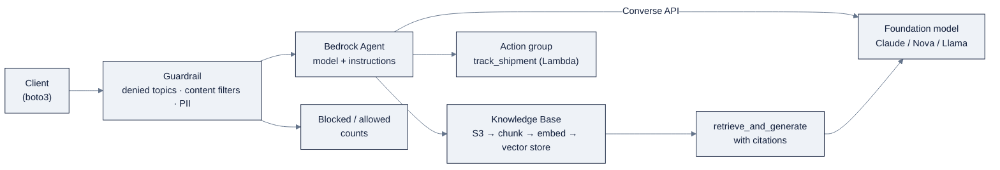

# Week 20: AWS BedrockとSageMaker AI

> **日本語版** · [英語版](README.md) · [演習](exercises.ja.md) · [クイズ](quiz.ja.md)
> AI Engineering Labの一部 · Week 20 of 24 · Section: Cloud AI Platforms · Category: AWS
> 🎯 **Use case:** Guardrails付きのBedrock RAG support agent。さらにGreat Platform Comparison matrix。
> · Notebooks: [01-bedrock-converse-and-knowledge-bases.ipynb](notebooks/01-bedrock-converse-and-knowledge-bases.ipynb) · [02-bedrock-agents-and-guardrails.ipynb](notebooks/02-bedrock-agents-and-guardrails.ipynb)

## 問題

三週間、三つのcloud、一つのagent。Foundryではgovernanceが*gateway*であることを学び、Vertexではfree tierが*liability*でありmultimodalが*superpower*であることを学びました。いまagentがAWSに着地し、質問は「ここでXをどうやるか」から、clientやemployerが実際に尋ねる質問へ変わります。**どのcloudにstandardizeすべきか？** AWSの「agentに間違ったことを言わせない方法」への答えは、また別の形です。gatewayもfree sandboxもなく、あるのは**いたるところのIAM**と、すべてのcallにbolt-onされた**Guardrails**という名前のsafety filterだけです。

AWSはまた、他の二つのcloudがぼかしていた区別を口にさせるものです。**Bedrockはmodelを消費するため、SageMakerはmodelを所有するためです。** Bedrockは、Claude、Nova、Llama、Mistralにわたる一つのprovider-neutralな**Converse API**を与え、その上にmanaged RAG（Knowledge Bases）、agent、guardrailが載ります。SageMakerは、fine-tuningが測定可能なgapを残したときにだけ手を伸ばす、build/train/deploy-your-ownの層です。自分がどの層の上に立っているかを言えることが、今週最初のskillです。AWSのGenAI混乱の大半は、一つに見せかけられた重なる二つのproductなのです。

今週のdeliverableは**Great Platform Comparison matrix**です。Foundry vs Vertex vs Bedrock、行はmodel access、unified API、agent、RAG、eval、fine-tuning、serving、governance、pricing。すべてのcellを、Week 18〜20で測った数字で裏付けます。per-cell evidenceのない比較はblog postであり、あればprocurement decisionです。最後に、どのcloudを、どんなworkloadでstandardizeするかを、costを明示的なinputとして一段落で宣言して締めくくります。

## 目標

- [ ] 金曜日までに、boto3のConverse APIでBedrock modelを呼び、Week 6のprompt suiteを少なくとも二つのmodelにわたって実行できる。
- [ ] 金曜日までに、shipping-policy docに対するRAG用のBedrock Knowledge Baseをbuildし、citation付きのrecall/groundednessを測れる。
- [ ] 金曜日までに、Bedrock AgentとGuardrailを作成し、blockされたpromptをtestし、blocked/allowed countをreportできる。
- [ ] 金曜日までに、三cloud比較matrix（Foundry vs Vertex vs Bedrock）を、Week 18〜20で測った数字とcostで裏付けて公開できる。

## 日ごとの計画

| Day | Study | Run / build | Ship | Time |
|---|---|---|---|---|
| Mon | Bedrock vs SageMaker。IAM least privilege | AWS accountとleast-privilege roleをsetup。Bedrock modelを有効化 | IAM policy + Model access | 2〜3時間 |
| Tue | Converse API。日付付きmodel IDs | Week 6のprompt suiteを2 modelで実行。それぞれ価格付け | modelごとのaccuracy/cost | 2〜3時間 |
| Wed | Knowledge Bases（managed RAG） | policy corpusでKBをbuild。citation付きでquery | recall/groundedness | 2〜3時間 |
| Thu | Agents + Guardrails | agent + guardrailを作成。blockされたpromptをtest | blocked/allowed count | 2〜3時間 |
| Fri | matrix | cost付きの三cloud比較matrixを公開 | matrix + recommendation | 3〜4時間 |
| Sat | 復習 | [quiz](quiz.md)を受ける（8/10） | quiz scoreをNotesに記録 | 1時間 |

## 概念

[`reference/knowledge-base/12-cloud-platforms.md`](../../reference/knowledge-base/12-cloud-platforms.md) の共有mental modelと、[`reference/platforms/aws-bedrock/README.md`](../../reference/platforms/aws-bedrock/README.md) のrunbookを読んでください。AWSのgenerative-AI storyは**相補的な二つの層**であり、どちらの上に立っているかを言うことが今週最初のskillです。

| | Amazon Bedrock | SageMaker AI |
|---|---|---|
| 役割 | foundation modelの消費 + managed GenAI機能 | 自分のmodelのbuild、fine-tune、serve |
| 例え | modelをAPIとしてcallする | modelとtrainingを所有する |
| RAG/agent/guardrail | built-in | JumpStart + endpoint経由 |
| 手を伸ばすとき | 常にまず | fine-tuningがgapを残したときだけ |

**Converse API**は、三cloudの中でも教育的に最も優れています。一つのprovider-neutralなmessage/tool-calling formatなので、`modelId`をswapして他は何も変えません。だからWeek 20は*同じ*Week 6のprompt suiteを複数modelで実行し、それぞれ価格付けします。model選択がvibeではなく、測られたloopになるのです。

### model catalogと日付付きIDs

Bedrockのcatalogは、first-partyとthird-partyのmodelを、すべて同じConverse surfaceの後ろに置きます。

| Family | Vendor | 役割 |
|---|---|---|
| **Nova** (Pro/Lite/Micro) | Amazon | 最安、深いAWS統合。大volume textのdefault |
| **Claude** (3.7 Sonnet / 4) | Anthropic | frontier reasoning/coding。多くのagentのanchor |
| **Llama** (3.x/4) | Meta | open-weight、portable、self-host path |
| **Mistral** | Mistral | open-weight、efficient |
| **Titan** | Amazon | 古いfirst-party。embeddingは今もRAGのdefault |

早期に内部化する二つのgotcha。Bedrockのmodel IDsは頻繁に置き換えられる**日付付きsuffix**（例: `anthropic.claude-3-5-sonnet-20241022-v2:0`）を持ち、それを暗記せず、consoleから現在のIDをcopyします。またmodelは**defaultでは有効化されていません**。`AccessDeniedException`は、codeが間違っているのではなく、Model accessを忘れたことを意味することが多いのです。

### Knowledge Basesによるmanaged RAG

**Bedrock Knowledge Bases**はfully managedなRAGです。S3を指定すると、chunkingし、embed（TitanまたはCohere）し、vectorを保存し（OpenSearch Serverless、Aurora、Pinecone等）、citation付きの`retrieve` / `retrieve_and_generate`を公開します。これはWeek 7と同じ仕事、shipping-policy corpusにanswerをgroundすること、をplatformが行うものです。測る二つのmetricは**recall**（retrievalは正しいdocumentをsurfaceしたか？）と**groundedness**（answerにground-truthのfactが含まれているか、つまりhallucinationではなく実在のcitationから来ているか？）です。

### Agent、Guardrail、Prompt管理、AgentCore

**Bedrock Agents** = model + instructions + knowledge base + action group（Lambda tool）で、multi-agent collaboration付きです。Week 20のsupport agentは、`track_shipment`をaction groupとして、grounding用にpolicy KBをwireします。**Guardrails**は、model I/Oに適用される設定可能なsafety filterです。

| Guardrail filter | 何をするか |
|---|---|
| Denied topics | 定義した話題外の主題（例: 競合のpricing）をblock |
| Content filters | hate/sexual/violenceのseverity threshold |
| PII redaction | 名前、住所、tracking識別子をmask |
| Custom word filters | 特定の語をblockまたはflag |

**Prompt management**は、promptをfirst-classでARNから呼び出せるresourceとしてversion管理します。Week 6のprompt-versioning習慣へのplatform-nativeな答えです。**AgentCore**は、code-first agent（LangGraph、Strands）のための、AWSのより新しいmanaged *runtime*で、memory、session、tool gatewayを持ちます。「自分のagent frameworkをproductionで走らせてくれ」ですが、今週の正しい入り口はBedrock Agentsです。その周りには**Amazon Q**（*買う*assistant: codeにはQ Developer、職場にはQ Business）と**PartyRock**（freeのno-code playground。boto3を書く前の、最も摩擦の少ない「Bedrockの味見」）があります。Week 20のsupport agentをend-to-endで描くと次のとおりです。



Guardrailsは*edge*にいます。すべてのrequestが、agentやmodelがtokenを使う前にここを通ります。だからblocked/allowed countがWeek 20のsafety metricなのです。

### IAM least privilegeとpolicy sketchの実例

AWSには**model向けのAPI keyがありません**。すべてがIAMで、それ自体がlessonです。codeにkeyを置かない、明示的なallow-list、credentialには`aws configure`（または`aws sso login`）。実例、演習が実際に必要とするものにscopeしたleast-privilege policyです。

```json
{
  "Version": "2012-10-17",
  "Statement": [
    {
      "Effect": "Allow",
      "Action": [
        "bedrock:ListFoundationModels",
        "bedrock:Converse",
        "bedrock:InvokeModel",
        "bedrock:Retrieve",
        "bedrock:RetrieveAndGenerate",
        "bedrock:CreateGuardrail",
        "bedrock:ApplyGuardrail",
        "bedrock:DeleteGuardrail"
      ],
      "Resource": "*"
    }
  ]
}
```

productionでは`Resource`を特定のmodel ARNsとregionにscopeします。演習では、正確なARNsよりも習慣（明示的なallow-list、least privilege、admin actionへの`*`なし）のほうが重要です。

### Pricing: on-demand vs provisioned vs cross-region

Bedrockはdefaultでserverlessです。**On-demand**はtoken（input/output）ごと、またはimageごとに課金します。Novaが典型的に最安で、Claudeのfrontier modelが最も高価です。**Provisioned Throughput**は、commitment割引で「model unit」を時間あたり予約します。使っても使わなくても課金され、Azure PTUのAWS版です。**Cross-region inference**は、事前定義されたregion setにわたって同じtoken rateでroutingし、throughputと耐障害性を高めます。commitment trapの実例: on-demandのClaudeが1M input tokenあたり~$3で、月に~1M tokenしか流さないなら、~$40/hourで時間あたりの下限を予約するprovisioned model unitは~10,000倍の買いすぎです。provisioned throughputが見合うのは、安定した、高い、予測可能なvolumeだけであり、lab週のZoroLogisticsにはそれがありません。

### うまくいかない理由

Bedrockの失敗は、あなたのcodeに見えて、大抵は違います。**`AccessDeniedException`:** modelがModel accessで有効になっていないか、IAM policyにactionがないかのどちらかです。codeに触る前に両方を確認します。**`ThrottlingException`:** on-demandのrate limitを超えました。retry/backoffを追加するか、cross-region inferenceを使います。**`modelId`での`ValidationException`:** 日付付きIDがstaleです。consoleから現在のものをcopyします。**演習でのProvisioned Throughput:** idleの間もmeterされ、週末のbillになります。**invocation logなし:** S3/CloudWatchへのlogがないとspendをauditできません。**放置されたagent/endpoint:** idleの間もmeterされます。必ずcleanup cellを実行します。そしてmatrix自身の失敗mode: **測られた数字のない比較cell**。per-cell evidenceのないmatrixはdecisionではなくblog postです。

## Notebook walkthrough

二つのnotebookがあり、どちらもAWS（`boto3.client("bedrock").list_foundation_models()`）をprobeし、credentialやmodel accessがなければdeterministicなdry-runにfallbackします。

**[`notebooks/01-bedrock-converse-and-knowledge-bases.ipynb`](notebooks/01-bedrock-converse-and-knowledge-bases.ipynb)**
は`REGION`を設定してAWSをprobeし、次に`MODELS`（defaultは`amazon.nova-lite-v1:0`と`anthropic.claude-3-5-sonnet-20241022-v2:0`）と、`resp["output"]["message"]["content"][0]["text"]`を読む`converse()` helperを定義します。BoL sample四つをloadし、Week 6の`EXTRACT_PROMPT`と十fieldの`field_matches`比較器を再利用して`accuracy_for(model_id, docs)`を計算し、modelごとのaccuracy tableを作ります。次に`kb_retrieve_and_generate`（`bedrock-agent-runtime`経由）と`data.policy_docs()`上の`local_retrieve` fallbackを定義し、四つのRAG質問（`R1`、`R4`）をcitationとgroundednessで採点し、最後に`RECALL`と`GROUNDEDNESS`の数字をprintします。dry-runでの正しい出力は`RECALL:
1.000 GROUNDEDNESS: 1.000`（local retrieverは四つのkeywordすべてを対応づける）で、これが、本物のKBが同じ質問setで満たすか超えるべき*target*です。

**[`notebooks/02-bedrock-agents-and-guardrails.ipynb`](notebooks/02-bedrock-agents-and-guardrails.ipynb)**
は、`topicPolicyConfig`（"OffTopic"をdeny）、`contentPolicyConfig`（HIGH強度のINSULTS/HATE/VIOLENCE）、`wordPolicyConfig`（custom word `competitorpricing` + 管理されたPROFANITY list）付きの`bedrock.create_guardrail`でguardrailを作成します。次に、`apply_guardrail`を通してblockされるprompt（insult、off-topic）と許可されるprompt（tracking、refund）をtestし、insult語とfreight keywordを欠くものすべてをblockする`local_guardrail` fallbackを用意します。agent cellは、`BEDROCK_AGENT_ROLE_ARN`が設定されていれば`bedrock-agent.create_agent`を呼びます。cleanup cellはagentとguardrailの両方を削除します。最後のcellは、dry-runで`BLOCKED: 3 ALLOWED: 2`（三つblock、二つ許可）をprintし、これがlive guardrailに対して再現すべき数字です。

## Use case（Friday）

**Deliverable:** **Great Platform Comparison matrix**。Foundry vs Vertex vs Bedrock、行はmodel access、unified API、agent、RAG、eval、fine-tuning、serving、governance、pricing。各cellをWeek 18〜20で測った数字で裏付ける（加えて、Guardrails付きのWeek 20 Bedrock RAG agentと、そのblocked/allowed count）。

**Zorost gate:** 見知らぬ人がmatrixと三つのdeployment guideを読み、すべての「ここでXをどうやるか」の主張を、printされた数字のあるrunnable notebookまでtraceできること。同じgolden set、同じseed、同じmetric。そして、*どのcloudにstandardizeするか*、どんなworkloadで、costを明示的なinputとして、一段落で述べられること。

**Stretch:** Guardrailを（agentだけでなく）Knowledge Baseのresponse pathに適用し、off-topic query setに対してblocked/allowed countがどう動くかを示します。または、prompt-suite tableに三つ目のBedrock modelを加え、他の二つとのdeltaを述べます。速く進む人は、`track_shipment` Lambda action groupをBedrock Agentにwireし、end-to-endのtracking queryを一回実行することもできます。

## よくあるpitfall

| Pitfall | 症状 | Fix |
|---|---|---|
| modelが有効化されていない | `AccessDeniedException` | Bedrock → Model accessで有効化する |
| staleな日付付きmodel ID | `ValidationException` | consoleから現在のIDをcopyする |
| 演習でのProvisioned Throughput | idleの間もmetering | on-demandのみ。lab週にPTUは絶対使わない |
| on-demand rate limit超過 | `ThrottlingException` | retry/backoffまたはcross-region inference |
| invocation logなし | spendをauditできない | S3/CloudWatchへのmodel invocation logを有効化 |
| resourceを出しっぱなし | 週末のbill | cleanup cellを実行する（agent + guardrail） |
| AWS Budgets alertなし | surpriseなinvoice | どんなrunの前にでも$5のalertを設定 |
| 数字のないmatrix cell | evidenceでなくanecdote | すべてのcellをprintされたmetricまでtraceする |

## Glossary

- **Amazon Bedrock**: managed foundation-model層。modelをAPIとしてcallする。
- **SageMaker AI**: 自分のmodelをbuild/train/deployする層（JumpStart、HyperPod、customization）。
- **Converse API**: provider-neutralなmessage/tool-calling surface。`modelId`をswap、他はそのまま。
- **Knowledge Base**: managed RAG。S3 → chunk → embed → vector store → `retrieve_and_generate`。
- **Guardrail**: model I/Oへの設定可能なsafety filter（denied topic、content filter、PII redaction）。
- **Bedrock Agent**: model + instructions + knowledge base + action group（Lambda tool）。
- **AgentCore**: memoryとsessionを持つ、code-first agent（LangGraph/Strands）向けmanaged runtime。
- **Recall**: retrievalが正しいsource documentをsurfaceした質問の割合。
- **Groundedness**: ground-truthのfactを含むanswerの割合（citation付きで、hallucinationでない）。
- **On-demand vs Provisioned Throughput**: tokenごと vs 予約したmodel-unit/時間の課金。
- **IAM least privilege**: `bedrock:*` actionの明示的なallow-list。codeにkeyを置かない。
- **三cloud matrix**: Week 20のcapstone。Foundry vs Vertex vs Bedrock、すべてのcellを測定。

## Self-check（quiz）

[`quiz.md`](quiz.md)を受けてください。これらのconceptとnotebook codeに紐づく10問です。合格ラインは**8/10**。scoreをNotesに記録してください。

## Exercises

四つのgraded exercise（easy / standard / stretch / portfolio）が[`exercises.md`](exercises.md)にあります。recall/groundednessの記録から、三つ目のmodel比較、KB pathへのguardrail適用、三cloud matrix自体の公開まで。hintは同じfileにあります。

## Sources

- Amazon Bedrock Converse API supported models: https://docs.aws.amazon.com/bedrock/latest/userguide/conversation-inference-supported-models-features.html
- Amazon Bedrock overview: https://docs.aws.amazon.com/bedrock/latest/userguide/what-is-bedrock.html
- Amazon Bedrock model availability & compatibility: https://docs.aws.amazon.com/bedrock/latest/userguide/models.html
- Bedrock cross-region inference / inference profiles: https://docs.aws.amazon.com/bedrock/latest/userguide/inference-profiles-support.html
- Bedrock capacity & cost optimization (on-demand vs PTU): https://docs.aws.amazon.com/bedrock/latest/userguide/capacity-limits-cost-optimization.html
- Bedrock Runtime code examples (boto3): https://docs.aws.amazon.com/code-library/latest/ug/python_3_bedrock-runtime_code_examples.html
- SageMaker AI (deploy from JumpStart / HyperPod): https://docs.aws.amazon.com/sagemaker/latest/dg/sagemaker-hyperpod-model-deployment-deploy.html
- Amazon Bedrock AgentCore: https://www.aboutamazon.com/news/aws/aws-amazon-bedrock-agent-core-ai-agents
