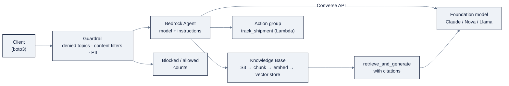

# Week 20: AWS Bedrock & SageMaker AI

> Part of AI Engineering Lab · Week 20 of 24 · Section: Cloud AI Platforms · Category: AWS
> 🎯 Use case: A Bedrock RAG support agent with Guardrails, plus the Great Platform Comparison matrix.

## The problem

Three weeks, three clouds, one agent. On Foundry you learned that governance is a *gateway*;
on Vertex you learned that a free tier is a *liability* and multimodal is a *superpower*. Now
the agent lands on AWS, and the question changes from "how do I do X here" to the question a
client or employer actually asks: **which cloud should we standardize on?** AWS's answer to
"how do I keep the agent from saying the wrong thing" is different again, there is no
gateway, no free sandbox, just **IAM everywhere** and a safety filter called **Guardrails**
bolted onto every call.

AWS also forces you to name a distinction the other two clouds blurred: **Bedrock is for
consuming models; SageMaker is for owning them.** Bedrock gives you one provider-neutral
**Converse API** across Claude, Nova, Llama, and Mistral, with managed RAG (Knowledge Bases),
agents, and guardrails layered on. SageMaker is the build/train/deploy-your-own layer you
reach for only when fine-tuning leaves a measured gap. Knowing which layer you are standing
on is the week's first skill, most AWS GenAI confusion is two overlapping products described
as if they were one.

The deliverable this week is the **Great Platform Comparison matrix**: Foundry vs Vertex vs
Bedrock, with rows for model access, unified API, agents, RAG, evals, fine-tuning, serving,
governance, and pricing, every cell backed by a number you measured across Weeks 18 to 20. A
comparison without per-cell evidence is a blog post; with it, it's a procurement decision.
You close by naming, in one paragraph, which cloud you would standardize on and for what
workload, with cost as an explicit input.

## Objectives

- [ ] By Friday you can call Bedrock models with the boto3 Converse API and run the Week 6 prompt suite across at least two models.
- [ ] By Friday you can build a Bedrock Knowledge Base for RAG on shipping-policy docs and measure recall/groundedness with citations.
- [ ] By Friday you can create a Bedrock Agent and a Guardrail, test blocked prompts, and report blocked/allowed counts.
- [ ] By Friday you can publish the three-cloud comparison matrix (Foundry vs Vertex vs Bedrock) with cost, grounded in the numbers you measured across Weeks 18 to 20.

## Day-by-day plan

| Day | Study | Run / build | Ship | Time |
|---|---|---|---|---|
| Mon | Bedrock vs SageMaker; IAM least privilege | Set up the AWS account + least-privilege role; enable Bedrock models | IAM policy + Model access | 2 to 3 h |
| Tue | Converse API; dated model IDs | Run the Week 6 prompt suite across 2 models; price each | Accuracy/cost per model | 2 to 3 h |
| Wed | Knowledge Bases (managed RAG) | Build a KB on the policy corpus; query with citations | Recall/groundedness | 2 to 3 h |
| Thu | Agents + Guardrails | Create an agent + guardrail; test blocked prompts | Blocked/allowed counts | 2 to 3 h |
| Fri | The matrix | Publish the three-cloud comparison matrix with cost | Matrix + recommendation | 3 to 4 h |
| Sat | Review | Take the [quiz](quiz.md) (8/10) | Quiz score in Notes | 1 h |

## Concepts

Read the shared mental model in
[`reference/knowledge-base/12-cloud-platforms.md`](../../reference/knowledge-base/12-cloud-platforms.md) and the
runbook in [`reference/platforms/aws-bedrock/README.md`](../../reference/platforms/aws-bedrock/README.md). AWS's
generative-AI story is **two complementary layers**, and naming which one you stand on is the
week's first skill:

| | Amazon Bedrock | SageMaker AI |
|---|---|---|
| Job | Consume foundation models + managed GenAI features | Build, fine-tune, and serve your own models |
| Analogy | Call models as an API | Own the model and the training |
| RAG/agents/guardrails | Built in | Via JumpStart + endpoints |
| Reach for it | Always first | Only when fine-tuning leaves a gap |

The **Converse API** is the pedagogical star of the three clouds: one provider-neutral
message/tool-calling format, so you swap the `modelId` and nothing else. That is why Week 20
runs the *same* Week 6 prompt suite across models and prices each, model selection becomes a
measured loop, not a vibe.

### The model catalog and dated IDs

Bedrock's catalog spans first-party and third-party models, all behind the same Converse
surface:

| Family | Vendor | Role |
|---|---|---|
| **Nova** (Pro/Lite/Micro) | Amazon | Cheapest, deep AWS integration; default for high-volume text |
| **Claude** (3.7 Sonnet / 4) | Anthropic | Frontier reasoning/coding; anchor of many agents |
| **Llama** (3.x/4) | Meta | Open-weight, portable, self-host path |
| **Mistral** | Mistral | Open-weight, efficient |
| **Titan** | Amazon | Older first-party; embeddings still the RAG default |

Two gotchas to internalize early. Bedrock model IDs carry **dated suffixes** (e.g.
`anthropic.claude-3-5-sonnet-20241022-v2:0`) that get superseded often, copy the current ID
from the console, never memorize it. And models are **not enabled by default**: an
`AccessDeniedException` usually means you forgot Model access, not that your code is wrong.

### Managed RAG via Knowledge Bases

**Bedrock Knowledge Bases** is fully managed RAG: point it at S3, and it chunks, embeds (Titan
or Cohere), stores vectors (OpenSearch Serverless, Aurora, Pinecone, etc.), and exposes
`retrieve` / `retrieve_and_generate` with citations. This is the same Week 7 job, grounding
answers in the shipping-policy corpus, done by the platform. The two metrics you measure are
**recall** (did retrieval surface the right document?) and **groundedness** (does the answer
contain the ground-truth fact, i.e. come from a real citation rather than a hallucination?).

### Agents, Guardrails, Prompt management, and AgentCore

**Bedrock Agents** = model + instructions + knowledge base + action groups (Lambda tools), with
multi-agent collaboration. The Week 20 support agent wires `track_shipment` as an action group
and the policy KB for grounding. **Guardrails** are configurable safety filters applied to
model I/O:

| Guardrail filter | What it does |
|---|---|
| Denied topics | Block defined off-topic subjects (e.g. competitor pricing) |
| Content filters | Severity thresholds for hate/sexual/violence |
| PII redaction | Mask names, addresses, tracking identifiers |
| Custom word filters | Block or flag specific terms |

**Prompt management** versions your prompts as first-class, ARN-invokable resources, the
platform-native answer to the Week 6 prompt-versioning habit. **AgentCore** is AWS's newer
managed *runtime* for code-first agents (LangGraph, Strands), with memory, sessions, and a
tool gateway, "run my own agent framework in production," worth knowing about but Bedrock
Agents is the right entry point for this week. Around both sit **Amazon Q** (assistants you
*buy*: Q Developer for code, Q Business for the workplace) and **PartyRock** (a free no-code
playground, the best zero-friction "taste of Bedrock" before writing any boto3). The Week 20
support agent, drawn end to end:



Guardrails sit at the *edge*, every request crosses them before the agent or the model
spends a token, which is why the blocked/allowed counts are the Week 20 safety metric.

### IAM least privilege, and a worked policy sketch

AWS has **no API keys for models**, everything is IAM, and that is itself the lesson: no keys
in code, an explicit allow-list, `aws configure` (or `aws sso login`) for credentials. A
worked example, a least-privilege policy scoped to what the labs actually need:

```json
{
  "Version": "2012-10-17",
  "Statement": [
    {
      "Effect": "Allow",
      "Action": [
        "bedrock:ListFoundationModels",
        "bedrock:Converse",
        "bedrock:InvokeModel",
        "bedrock:Retrieve",
        "bedrock:RetrieveAndGenerate",
        "bedrock:CreateGuardrail",
        "bedrock:ApplyGuardrail",
        "bedrock:DeleteGuardrail"
      ],
      "Resource": "*"
    }
  ]
}
```

In production you would scope `Resource` to specific model ARNs and regions; for the labs the
habits (explicit allow-list, least privilege, no `*` on admin actions) matter more than exact
ARNs.

### Pricing: on-demand vs provisioned vs cross-region

Bedrock is serverless by default. **On-demand** bills per token (input/output) or per image;
Nova is typically cheapest, Claude frontier models most expensive. **Provisioned Throughput**
reserves "model units" per hour at a commitment discount, it bills whether you use it or
not, the AWS twin of Azure PTU. **Cross-region inference** routes across a pre-defined region
set at the same token rates for higher throughput and resilience. A worked example of the
commitment trap: if on-demand Claude costs ~$3 per 1M input tokens and you only push ~1M
tokens/month, a provisioned model unit that reserves an hourly floor for ~$40/hour is a
~10,000× over-buy, provisioned throughput pays off only at steady, high, predictable volume,
which ZoroLogistics does not have during a lab week.

### How it breaks

Bedrock breaks in ways that look like your code but usually aren't. **`AccessDeniedException`:**
either the model isn't enabled in Model access or the IAM policy lacks the action, check both
before touching code. **`ThrottlingException`:** you exceeded the on-demand rate limit; add
retry/backoff or use cross-region inference. **`ValidationException` on `modelId`:** the dated
ID is stale, copy the current one from the console. **Provisioned Throughput for the labs:**
it meters while idle, a weekend bill. **No invocation logging:** without logging to
S3/CloudWatch you cannot audit spend. **Agents/endpoints left running:** they meter while
idle, always run the cleanup cells. And the matrix's own failure mode: **a comparison cell
with no measured number**, a matrix without per-cell evidence is a blog post, not a decision.

## Notebook walkthrough

Two notebooks; both probe AWS (`boto3.client("bedrock").list_foundation_models()`) and fall
back to a deterministic dry-run when credentials or model access are absent.

**[`notebooks/01-bedrock-converse-and-knowledge-bases.ipynb`](notebooks/01-bedrock-converse-and-knowledge-bases.ipynb)**
sets `REGION`, probes AWS, then defines `MODELS` (defaulting to `amazon.nova-lite-v1:0` and
`anthropic.claude-3-5-sonnet-20241022-v2:0`) and a `converse()` helper that reads
`resp["output"]["message"]["content"][0]["text"]`. It loads four BoL samples and reuses the
Week 6 `EXTRACT_PROMPT` and the ten-field `field_matches` comparator to compute
`accuracy_for(model_id, docs)`, producing a per-model accuracy table. Then it defines
`kb_retrieve_and_generate` (via `bedrock-agent-runtime`) and a `local_retrieve` fallback over
`data.policy_docs()`, scores four RAG questions (`R1`, `R4`) for citation and groundedness, and
prints the final numbers `RECALL` and `GROUNDEDNESS`. Correct dry-run output is `RECALL:
1.000 GROUNDEDNESS: 1.000` (the local retriever maps all four keywords), which is the *target*
a real KB must meet or beat it on the same question set.

**[`notebooks/02-bedrock-agents-and-guardrails.ipynb`](notebooks/02-bedrock-agents-and-guardrails.ipynb)**
creates a guardrail via `bedrock.create_guardrail` with a `topicPolicyConfig` (denying
"OffTopic"), a `contentPolicyConfig` (INSULTS/HATE/VIOLENCE at HIGH strength), and a
`wordPolicyConfig` (custom word `competitorpricing` + managed PROFANITY list). It then tests
blocked prompts (insults, off-topic) and allowed prompts (tracking, refund) through
`apply_guardrail`, with a `local_guardrail` fallback that blocks insult words and anything
lacking a freight keyword. The agent cell calls `bedrock-agent.create_agent` when
`BEDROCK_AGENT_ROLE_ARN` is set; the cleanup cells delete both the agent and the guardrail.
The final cell prints `BLOCKED: 3 ALLOWED: 2` in dry-run (three blocked, two allowed), which
is the number you must reproduce against the live guardrail.

## The use case (Friday)

**Deliverable:** the **Great Platform Comparison matrix**, Foundry vs Vertex vs Bedrock,
with rows for model access, unified API, agents, RAG, evals, fine-tuning, serving, governance,
and pricing, each cell backed by a number you measured across Weeks 18 to 20 (plus your Week 20
Bedrock RAG agent with Guardrails and its blocked/allowed counts).

**Zorost gate:** a stranger can read the matrix and your three deployment guides, and trace
every "how do I do X here" claim to a runnable notebook with a printed number, same golden
set, same seed, same metrics. You can state, in one paragraph, *which cloud you would
standardize on* and for what workload, with cost as an explicit input.

**Stretch:** apply the Guardrail to the Knowledge Base response path (not just the agent) and
show the blocked/allowed counts move for an off-topic query set; or add a third Bedrock model
to the prompt-suite table and state the delta against the other two. Fast learners can also
wire a `track_shipment` Lambda action group into the Bedrock Agent and run one end-to-end
tracking query.

## Common pitfalls

| Pitfall | Symptom | Fix |
|---|---|---|
| Model not enabled | `AccessDeniedException` | Enable it under Bedrock → Model access |
| Stale dated model ID | `ValidationException` | Copy the current ID from the console |
| Provisioned Throughput for the labs | Metering while idle | On-demand only; never PTU for a lab week |
| Over the on-demand rate limit | `ThrottlingException` | Retry/backoff or cross-region inference |
| No invocation logging | Cannot audit spend | Enable model invocation logging to S3/CloudWatch |
| Resources left running | Weekend bill | Run the cleanup cells (agent + guardrail) |
| No AWS Budgets alert | Surprise invoice | Set a $5 alert before any run |
| Matrix cell with no number | Anecdote, not evidence | Every cell traces to a printed metric |

## Glossary

- **Amazon Bedrock**: the managed foundation-model layer; call models as an API.
- **SageMaker AI**: the build/train/deploy-your-own-model layer (JumpStart, HyperPod, customization).
- **Converse API**: the provider-neutral message/tool-calling surface; swap `modelId`, nothing else.
- **Knowledge Base**: managed RAG: S3 → chunk → embed → vector store → `retrieve_and_generate`.
- **Guardrail**: configurable safety filter (denied topics, content filters, PII redaction) on model I/O.
- **Bedrock Agent**: model + instructions + knowledge base + action groups (Lambda tools).
- **AgentCore**: the managed runtime for code-first agents (LangGraph/Strands) with memory and sessions.
- **Recall**: the fraction of questions where retrieval surfaced the correct source document.
- **Groundedness**: the fraction of answers containing the ground-truth fact (cited, not hallucinated).
- **On-demand vs Provisioned Throughput**: per-token vs reserved model-units-per-hour billing.
- **IAM least privilege**: an explicit allow-list of `bedrock:*` actions, no keys in code.
- **Three-cloud matrix**: the Week 20 capstone: Foundry vs Vertex vs Bedrock, every cell measured.

## Self-check (quiz)

Take [`quiz.md`](quiz.md), 10 questions tied to these concepts and the notebook code. The
passing bar is **8/10**; record the score in your Notes.

## Exercises

Four graded exercises (easy / standard / stretch / portfolio) in
[`exercises.md`](exercises.md), from recording recall/groundedness, to a third-model
comparison, to guardrailing the KB path, to publishing the three-cloud matrix itself. Hints
are in the same file.

## Sources

- Amazon Bedrock Converse API supported models: https://docs.aws.amazon.com/bedrock/latest/userguide/conversation-inference-supported-models-features.html
- Amazon Bedrock overview: https://docs.aws.amazon.com/bedrock/latest/userguide/what-is-bedrock.html
- Amazon Bedrock model availability & compatibility: https://docs.aws.amazon.com/bedrock/latest/userguide/models.html
- Bedrock cross-region inference / inference profiles: https://docs.aws.amazon.com/bedrock/latest/userguide/inference-profiles-support.html
- Bedrock capacity & cost optimization (on-demand vs PTU): https://docs.aws.amazon.com/bedrock/latest/userguide/capacity-limits-cost-optimization.html
- Bedrock Runtime code examples (boto3): https://docs.aws.amazon.com/code-library/latest/ug/python_3_bedrock-runtime_code_examples.html
- SageMaker AI (deploy from JumpStart / HyperPod): https://docs.aws.amazon.com/sagemaker/latest/dg/sagemaker-hyperpod-model-deployment-deploy.html
- Amazon Bedrock AgentCore: https://www.aboutamazon.com/news/aws/aws-amazon-bedrock-agent-core-ai-agents
