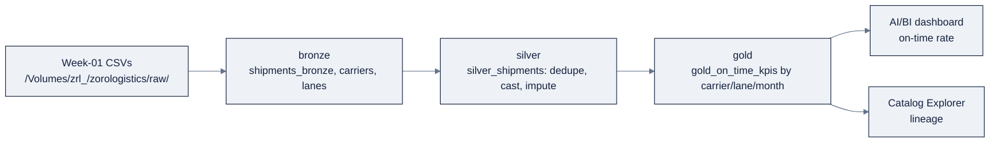

# Week 21: Databricks Day Zero: Unity Catalogとlakehouse

> **日本語版** · [英語版](README.md) · [演習](exercises.ja.md) · [クイズ](quiz.ja.md)
> AI Engineering Labの一部 · Week 21 of 24 · Section: Databricks Zero to Hero · Category: Platform & Data
> · Notebooks: [01-unity-catalog-and-delta-lab.ipynb](notebooks/01-unity-catalog-and-delta-lab.ipynb) · [02-medallion-sql.ipynb](notebooks/02-medallion-sql.ipynb)
> 🎯 **Use case:** ZoroLogisticsのlakehouseを立ち上げ、bronze → silver → goldをすべてSQLで構築する。

## 問題

ZoroLogisticsは20のlane、20のcarrierでfreightを運んでおり、毎晩 `shipments.csv`、`carriers.csv`、`lanes.csv` というCSVsのfolderが、data engineerがそのうち目を通すどこかに届きます。今日、問題はまさにその「そのうち」です。fileがすべてcatalogの外にあるため、どのtableが*本物の* on-time rateなのか、誰が顧客のvalueを読むことを許されているのか、先週木曜日の「fix」がdashboardがすでに役員に見せた数字を静かに変えてしまったのか、誰も言えません。

governed lakehouseがなければ、三つの失敗が確定します。**第一に、lineageがないこと:** on-time KPIが間違って見えるとき、その数字からbronze fileと、それを生成したtransformまで遡るpathがありません。**第二に、trustがないこと:** raw CSVはauditなしに上書きも再exportも手編集もできるので、「on-time rate」を引用する二人のanalystが食い違い、どちらも自分が正しいと証明できません。**第三に、safetyがないこと:** cleaningが誰かの頭の中にしかなく、bronze→silverの境界を*強制*するものがないため、`NaN` weightも、duplicateの `shipment_id` も、malformedなtimestampも、そのままdashboardに届きます。

今週はこれを **Unity Catalog lakehouse** で置き換えます。すべてのCSVが三段階のaddressを持つgovernedでversionedな **Delta table** になり、cleaningがdeclarativeな **SQLのmedallion pipeline** になり、全体がtime-travel可能、lineage追跡、grant制御されます。before/afterは具体的です。beforeでは「悪いupdateを直す」はscriptを再実行して祈ることでした。afterでは `RESTORE TABLE … TO VERSION AS OF 12` の一発です。これが、fileの束と、見知らぬ人がinspectして再実行できるplatformの違いです。

## 目標

- [ ] 金曜日までに、Unity Catalogにgoverned lakehouseを立ち上げられる。catalog（`zrl_`）、schema（`zorologistics`）、volumeを、idempotentな `CREATE … IF NOT EXISTS` で作る。
- [ ] 金曜日までに、week-01のCSVsをvolumeからDelta tableにloadし、time travel（`DESCRIBE HISTORY`、`SELECT … VERSION AS OF`、`@v1`）、`VACUUM`、`OPTIMIZE ZORDER`、liquid clustering（`CLUSTER BY`）を試せる。
- [ ] 金曜日までに、medallion architectureをpure SQLで構築できる。bronze（source fidelity）→ silver（dedupe、cast、impute）→ gold（carrier/lane/month別の `gold_on_time_kpis`）。各cleaning decisionを擁護できる。
- [ ] 金曜日までに、goldの上にdashboard-readyなAI/BI queryを書き、それをbronzeまで遡ってつなぐ自動lineageを読める。

## 日ごとの計画

| Day | Study | Run | Ship | Time |
|---|---|---|---|---|
| **Mon** | Account、workspaceの構造、control planeとcompute plane、personas（[`00-day-zero-setup.md`](../../reference/platforms/databricks/00-day-zero-setup.md)） | free trialのworkspaceを作る。sidebarを見て回る。CLIをinstallしてauthする | `current_user()` をprintする最初のnotebook `%sql` cell | 約2時間 |
| **Tue** | Unity Catalogのobject model、managedとexternal、privilege model（[`01-unity-catalog.md`](../../reference/platforms/databricks/01-unity-catalog.md)） | `01-unity-catalog-and-delta-lab.ipynb` cell 1〜4: `zrl_`/`zorologistics`/volumeを作り、CSVsをuploadし、`shipments_bronze` をloadする | 読める `SHOW GRANTS` 付きのgoverned catalog/schema/volume | 約2.5時間 |
| **Wed** | Delta Lake: ACID、time travel、VACUUM/OPTIMIZE、liquid clustering（[`03-delta-lake.md`](../../reference/platforms/databricks/03-delta-lake.md)） | Notebook 1 cell 5〜11: `DESCRIBE HISTORY`、`VERSION AS OF`、`VACUUM DRY RUN`、`OPTIMIZE ZORDER`、`CLUSTER BY` | 二つのversionとclustering変更を持つtime-travel demo table | 約2.5時間 |
| **Thu** | Medallion architecture + DBSQL（[`03-delta-lake.md`](../../reference/platforms/databricks/03-delta-lake.md) §9、[`04-dbsql.md`](../../reference/platforms/databricks/04-dbsql.md)） | `02-medallion-sql.ipynb`: bronze → silver（dedupe/cast/impute）→ gold | quality checkがpassする `silver_shipments` + `gold_on_time_kpis` | 約3時間 |
| **Fri** | Use caseの日 | gold queryをAI/BI dashboardとしてpublishする。Catalog Explorerでlineageを読む | Week 21 gate（下記）+ lineage graphのscreenshot | 約2時間 |

## 概念（まず読むのはMon/Tue）

今週のfact baseは [`reference/knowledge-base/research/06-databricks-deep-dive.md`](../../reference/knowledge-base/research/06-databricks-deep-dive.md)（§0、§4）と [`reference/knowledge-base/13-databricks-overview.md`](../../reference/knowledge-base/13-databricks-overview.md) です。deep-diveは [`00-day-zero-setup.md`](../../reference/platforms/databricks/00-day-zero-setup.md)、[`01-unity-catalog.md`](../../reference/platforms/databricks/01-unity-catalog.md)、[`02-compute.md`](../../reference/platforms/databricks/02-compute.md)、[`03-delta-lake.md`](../../reference/platforms/databricks/03-delta-lake.md)、[`04-dbsql.md`](../../reference/platforms/databricks/04-dbsql.md) です。このREADMEが地図であり、それらのfileが地形です。

### platformは二つのplaneでできている

Databricksが行うことはすべて、**control plane**（Databricks管理: UI、identity、job scheduling、notebook metadata）と **compute plane**（SparkとSQLが実際に動く場所）に分かれます。すべての「どのcompute」decisionを左右する違いはこれです。**classic computeは*あなたの* cloud accountで動き**（あなたのVPC、あなたのsecurity rule）、**serverless computeは同じregionのDatabricks管理planeで動きます**。lakehouseを買ってdataに向けるのではなく、Databricksを自分のcloudの*中で*動かし、object storageの上にgoverned lakehouseを重ねるのです。

### Unity Catalogはfolderではなくgovernance

Unity Catalog（UC）は **dataとAI** の統一的なgovernance layerであり、table、view、volume、function、*そして* ML modelをgovernする一つのmetastoreです。すべてのobjectは **三段階のaddress** `catalog.schema.object` に存在し、objectはtable、view、**volume**（非table形式のfile。`/Volumes/<catalog>/<schema>/<volume>/…` としてaddressされる）、function、modelのいずれかになります。legacyのDBFS-root patternはdeprecatedです。volume pathを学びましょう。

tableには三種類あり、正しいものを選ぶことはgovernanceのdecisionです:

| | Managed | External | Foreign |
|---|---|---|---|
| Data lifecycle | UCが管理 | あなたが管理 | 外部systemが管理 |
| Storage | UC所有 | あなたが `LOCATION` を指定 | 外部system |
| `DROP TABLE` でdataは削除される？ | **Yes** | されない（metadataのみ） | されない |
| Best for | Production（default） | 既存storage / 他のreader | Federation、migration |

Databricksがsystem of recordであるものはすべてdefaultで **managed** にする。他のtoolが読むstorageを指すには **external** を、copyせずにdataを*in place*でqueryするには **foreign**（Lakehouse Federation）を使う。

### privilege modelはadditive-only

UCのgrantは **additive only、`DENY` は存在しません**。privilegeは階層を **下に継承** します。principalには **traversal**（`USE CATALOG`、`USE SCHEMA`）*と* **action**（`SELECT`、`MODIFY`、`READ VOLUME`、`CREATE TABLE`、`EXECUTE`）が必要です。個人ではなく **group** にgrantし、すべてのobjectに **一つのgroup owner** を付けます。`MANAGE` はgrant管理を委譲します（控えめに使う）。`BROWSE` はmetadataのみです。

**実例: ZoroLogisticsの三つのrole。** group `zrl_data_engineers`、`zrl_analysts`、`zrl_ml_engineers` が存在するとします（account console/SCIMで作成）。まずtraversal、それから各roleが必要とする最も狭いactionです:

```sql
-- Traversal: everyone must reach the catalog.
GRANT USE CATALOG ON CATALOG zrl_ TO `zrl_data_engineers`;
GRANT USE CATALOG ON CATALOG zrl_ TO `zrl_analysts`;
GRANT USE CATALOG ON CATALOG zrl_ TO `zrl_ml_engineers`;

-- Data engineers: read+write bronze/silver, write gold.
GRANT USE SCHEMA, CREATE TABLE, CREATE VOLUME ON SCHEMA zrl_.bronze TO `zrl_data_engineers`;
GRANT USE SCHEMA, CREATE TABLE ON SCHEMA zrl_.silver TO `zrl_data_engineers`;
GRANT USE SCHEMA, CREATE TABLE ON SCHEMA zrl_.gold   TO `zrl_data_engineers`;

-- Analysts: read-only on silver & gold.
GRANT USE SCHEMA, SELECT ON SCHEMA zrl_.silver TO `zrl_analysts`;
GRANT USE SCHEMA, SELECT ON SCHEMA zrl_.gold   TO `zrl_analysts`;

-- Volume access for the files before they are tables.
GRANT READ VOLUME, WRITE VOLUME ON VOLUME zrl_.bronze.landing TO `zrl_data_engineers`;
```

`SHOW GRANTS ON TABLE zrl_.gold.on_time_kpis;` で検証します。least privilegeとは、grantは後からいつでも追加できるが、広げすぎたgrantを"un-DENY"することは決してできない、ということです。（完全なmodelとOpenSharing/Delta Sharingの例: [`01-unity-catalog.md`](../../reference/platforms/databricks/01-unity-catalog.md)。）

### Delta Lakeがもたらすtime travel

Deltaは **defaultのstorage layer** であり、明示しない限りすべてのtableがDeltaです。Parquetを **transaction log**（`_delta_log/`）で拡張したもので、これが **ACID transaction**（各statementがatomic。optimistic concurrency control）、**schema enforcement/evolution**、そして **time travel** をもたらします。すべてのwriteは新しいversionをappendし、`DESCRIBE HISTORY` がそれを列挙し、`SELECT … VERSION AS OF n`、`SELECT … TIMESTAMP AS OF '…'`、`@v1` が過去のstateを読み、`RESTORE TABLE` がrollbackします。

**実例: 悪いupdateのaudit。** 失敗した `UPDATE` がweightをゼロにしたので、現在のversionは間違っているがversion 12は正しかった、とします:

```sql
-- 1. Which version was last good?
SELECT version, timestamp, operation
FROM (DESCRIBE HISTORY zrl_.silver.shipments) ORDER BY version DESC;

-- 2. Roll the table back to version 12.
RESTORE TABLE zrl_.silver.shipments TO VERSION AS OF 12;

-- 3. Confirm the fix.
SELECT shipment_id, weight_kg FROM zrl_.silver.shipments WHERE weight_kg > 0;
```

notebookでは同じ考えを隔離されたdemo tableで目に見えるようにします。version 1は1,000行、version 2は2,000行を持ち、`SELECT count(*) FROM time_travel_demo VERSION AS OF 1` は1,000を返し、現在のtableは2,000を返します。これを区切るretentionの規則: logは `logRetentionDuration`（default **30日**）の間historyを保持し、data fileは `deletedFileRetentionDuration`（default **7日**）の間保持します。

**`VACUUM` は7日より古いdata fileを削除します**（まず `DRY RUN` でpreviewする。これはper-writeの習慣ではなく *scheduled maintenance* のjobです）。VACUUMの後、その窓を超えたtime travelは不可能になります。costとrecoveryのdecisionです。**`OPTIMIZE`** は小さいfileをcompact化し、**`ZORDER BY (carrier_id)`** はrowを同じ場所に置くのでfilter queryがdataをskipできます。Z-orderもHive partitioningも、今では **liquid clustering**（`CLUSTER BY (carrier_id, lane_id)`）に取って代わられました。これは*rewriteなしで*keyを変更でき、`CLUSTER BY AUTO`（DBR 15.4 LTS+でGA）ならDatabricksに適応を任せられます。詳細は [`03-delta-lake.md`](../../reference/platforms/databricks/03-delta-lake.md)。

### medallionはdata-qualityのcontract

medallion architectureはnamingの流行ではなく、**progressive trust model** です:

| Layer | Purpose | Rules | ZoroLogisticsのtable |
|---|---|---|---|
| **Bronze (raw)** | unvalidatedでsource-fidelityなdataを取り込む | Append-only、cleaningなし、`STRING`/`VARIANT` で保存 | `shipments_bronze`、`carriers`、`lanes` |
| **Silver (validated)** | clean、dedupe、cast、impute、join | Schemaを強制。`shipment_id` でdedupe。key columnにnullなし | `silver_shipments`、`lanes_clean` |
| **Gold (enriched)** | business shapeにaggregateする | business rule + KPI column | `gold_on_time_kpis` |



**実例: silver cleanをSQLで。** Week-2のgeneratorはduplicate（0.2%）と `NaN` weight（0.3%）を仕込み、これはCSV→Deltaの後に `NULL` になります。silver queryはdedupeし、castし、imputeし、labelを再生成します:

```sql
CREATE OR REPLACE TABLE silver_shipments AS
WITH dedup AS (
  SELECT *, ROW_NUMBER() OVER (PARTITION BY shipment_id ORDER BY planned_departure) AS rn
  FROM shipments_bronze
)
SELECT shipment_id, carrier_id, lane_id, commodity,
  COALESCE(CAST(weight_kg AS DOUBLE), 850.0) AS weight_kg,      -- impute with mean
  COALESCE(CAST(value_usd  AS DOUBLE), 0.0)  AS value_usd,
  to_timestamp(planned_departure, 'yyyy-MM-dd HH:mm:ss[.SSSSSS]') AS planned_departure,
  to_timestamp(actual_arrival,    'yyyy-MM-dd HH:mm:ss[.SSSSSS]') AS actual_arrival,
  COALESCE(CAST(delay_hours AS DOUBLE), 0.0) AS delay_hours,
  CASE WHEN CAST(delay_hours AS DOUBLE) <= 2.0 THEN true ELSE false END AS is_on_time,
  status, weather_severity
FROM dedup WHERE rn = 1
```

要点はこれです。悪いrowはbronze→silverの境界で捕まえられ、**dashboardには決して届きません**。pandas（Week 2）で学んだ三層のdisciplineが、ここではdeclarativeでgoverned、time-travel可能なSQLになります。

### DBSQLは同じtableを読む

Databricks SQLはlakehouseの上のwarehouseです。Sparkが書いた `gold_on_time_kpis` tableは、SQL analystがqueryするのと同じtableなので、BIとMLが一つのcopyを共有します。そのsurfaceは **SQL editor**、保存された **query**（"Run as owner/viewer" credential mode付き）、**query history**、**alert**、**AI/BI dashboard**（旧Lakeview。legacyの"DBSQL dashboards"はarchive済み、"Clone to AI/BI dashboard"で移行）です。詳細は [`04-dbsql.md`](../../reference/platforms/databricks/04-dbsql.md)。

### うまくいかない理由

- **VACUUMが早すぎる = data消失。** defaultの7日retentionでVACUUMしてから10日前の変更をauditする必要に気づくと、それらのdata fileはもうありません。失敗は静かで、tableは無事でも *history* は無事ではありません。Fix: まず `VACUUM … DRY RUN` を実行する。retentionは正当なrollback窓の最長値以上に保つ。complianceが長いraw historyを必要とするならbronzeは決してvacuumしない。
- **間違った値のimputeがgoldを汚す。** `COALESCE(weight_kg, 0)` はすべてのweight平均を引き下げ、nullがないので「valid」に見えます。mean（`850.0`）は擁護できますが、ゼロはできません。silverのquality check（`null_weights =
  0`）はnullを検出するもので、*間違った*値は検出しません。人間のdecisionはまだあなたのものです。
- **「動かすために」`MANAGE` をgrantする。** UCはadditive-onlyなので、広すぎたgrantは、積極的に `REVOKE` しなければならない永続的なleak surfaceです。最初からleast privilegeであることが唯一の安い方向です。
- **間違ったkeyでのdedupe。** `ROW_NUMBER() OVER (PARTITION BY carrier_id …)` は別々のshipmentをつぶしてしまいます。自然key（`shipment_id`）でdedupeする。それ以外のpartitionはすべて間違いです。

## Notebook walkthrough

**`01-unity-catalog-and-delta-lab.ipynb`**: 「day zeroからgoverned tableまで」のlabです。Cell 1は `spark.version`、`current_user()`、default catalog/schemaをprintし、dataに触れる前に *誰が* *どこに* いるかを正確に把握させます。Cells 2〜4はnamespaceをidempotentに作ります。`catalog = "zrl_"`（末尾のunderscoreに注意）、schema `zorologistics`、volume `raw` と `checkpoints`、そして `dbutils.fs.ls` でvolumeを確認し、uploadした三つのCSVsがあることを確かめます。Cell 5は最初の `%sql` loadです: `CREATE OR REPLACE TABLE shipments_bronze AS SELECT * FROM read_files(…
format => 'csv', header => true, inferSchema => true)`。cells 6〜7は `count(*)` と `LIMIT 5` のpeekでsanity checkします。Cell 8は `carriers`/`lanes` をPySparkの `spark.read` 経由でloadします。Cells 9〜12はtime-travel demoです: `DESCRIBE HISTORY`、続いて1,000行の `time_travel_demo` table、もう1,000行の `INSERT`、そして `VERSION AS OF 1` が1,000を返しcurrentが2,000を返すことを証明する `UNION ALL` です。Cells 13〜16は `VACUUM … DRY RUN`、`OPTIMIZE … ZORDER BY (carrier_id)`、`ALTER TABLE … CLUSTER BY (carrier_id, lane_id)`、そしてclustering columnを確認する `DESCRIBE DETAIL` を実行します。**最後のcellは二つの数字をprintします**: `bronze rows` と `time-travel versions`。正しい出力: あなたのCSVに一致するbronze row count（full generatorなら100,000、あるいは `zoro/data.py` が出力したもの）と、`time-travel versions` = 2（demo tableのCREATE + INSERT）。

**`02-medallion-sql.ipynb`**: pure SQLのmedallionです。Cells 1〜2は `USE CATALOG zrl_; USE SCHEMA zorologistics;` でcatalog/schemaを設定し、三つの `read_files` statementで `shipments_bronze`、`carriers`、`lanes` をrebuildします。Cell 4は上のsilver query、cell 5は **quality gate** で、`rows`、`null_weights`（0でなければならない）、`distinct_shipments`（duplicateが一つも残っていない証拠に `rows` と等しくなければならない）をprintします。Cell 6は `lanes_clean.distance_km` を `900.0` でimputeします。Cell 8はsilverをclean済みdimensionにjoinし、carrier×lane×monthのgrainでon-time rate、平均delay、value/weight合計をaggregateした `gold_on_time_kpis` をbuildします。cell 9は `on_time_rate ASC` でworst laneを並べます。Cell 11は **dashboard-ready query** です: `avg(on_time_rate) OVER (ORDER BY month ROWS BETWEEN 2 PRECEDING AND CURRENT ROW)` による3ヶ月rolling窓付きの月別on-time rate。**最後のcellは** `overall on-time rate` と `gold rows` をprintします。「正しい」とは、high-0.8sのrate（generatorのcarrierは0.60〜0.99のreliability）と、dataのdistinctなcarrier×lane×month組合せ数に等しいgold row countです。

## Use case（Friday）

**Deliverable:** `shipments_bronze`、`silver_shipments`、`gold_on_time_kpis` を持つgovernedな `zrl_.zorologistics` lakehouseに加え、月別on-time rateを示すrunnableなAI/BI dashboard query。

**Zorost gate:** 見知らぬ人があなたのcatalogを開き、bronze → silver → goldのlineageを読み、あなたのsilver/gold SQLをend-to-endで再実行し、数字を確認できること。全体のon-time rate、各層のrow count、time travelが動くことを証明する `DESCRIBE HISTORY` 出力を見せられ、各cleaning decision（なぜ `shipment_id` でdedupeするのか、なぜ `weight_kg`/`distance_km` を、どんな値でimputeするのか）を一文ずつ擁護できること。

**Stretch variant:** `ROW_NUMBER() OVER (PARTITION BY month ORDER BY on_time_rate)` を使って **月別on-time rate worst 5 lane** をrankする二つ目のgold artifactを追加し、どのlane/carrierの組合せを最初に直すべきか、なぜかを一文で述べる。

## よくあるpitfall

| Pitfall | なぜ起きるか | Fix |
|---|---|---|
| CSV→Delta後 `NaN` が `NULL` になる | pandasの `NaN` は空文字列としてserializeされ、`read_files` は `NULL` を推論する | `COALESCE(CAST(col AS DOUBLE), <mean>)`。理由なく `0` にはしない |
| 間違ったcolumnでのdedupe | 自然keyでないkeyでpartitionしている | `ROW_NUMBER() OVER (PARTITION BY shipment_id …)` と `WHERE rn = 1` |
| Timestamp castが失敗する | 秒未満の値にはfraction省略可のformatが必要 | `to_timestamp(col, 'yyyy-MM-dd HH:mm:ss[.SSSSSS]')` |
| `VACUUM` 後に「historyはどこへ？」 | retention窓がrollback要件より短い | まず `DRY RUN`。最長rollback窓以上を保持する |
| 広すぎるgrant | 「動かすために `MANAGE` をgrant」 | traversal + 最小のaction。group owner。`SHOW GRANTS` で検証 |
| `USE CATALOG`/`USE SCHEMA` 忘れ | traversal privilegeはaction privilegeと別 | 両方grantする。checklistは「Aliceは*到達*でき、*実行*できるか？」 |
| 古いtutorialのDBFS path | DBFS-root/mount patternはdeprecated | `/Volumes/<catalog>/<schema>/<volume>/…` を使う |
| keyを打ち直す予定のtableのhard-partition | Z-order/Hive partitioningはlayoutを固定する | 新しいtableにはliquid clustering（`CLUSTER BY` / `CLUSTER BY AUTO`） |

## Glossary

- **Metastore**: account levelのmetadata registry。region内で多くのworkspaceにattachできる。
- **Catalog / Schema**: `catalog.schema.object` namespaceの上位二層。schemaはdatabase。
- **Volume**: `/Volumes/<catalog>/<schema>/<volume>/…` でaddressされる、governedな非table fileのcontainer。
- **Managed table**: `DROP TABLE` でdataが削除される、UC所有のDelta table。
- **External table**: あなたが指定したstorageを指すtable。`DROP` はmetadataのみ削除する。
- **Traversal privilege**: `USE CATALOG` / `USE SCHEMA`: containerに*到達*する権利。
- **Transaction log**: DeltaにACID、time travel、versioningを与える `_delta_log/` のentry。
- **Time travel**: `VERSION AS OF` / `TIMESTAMP AS OF` / `@v1` / `RESTORE TABLE` で過去のtable stateを読むこと。
- **VACUUM**: retention窓（default 7日）より古いdata fileの恒久削除。
- **Liquid clustering**: rewriteなしでkeyを変更できる `CLUSTER BY` による自動整理。partitioning + Z-orderの後継。
- **Medallion**: bronze → silver → goldという漸進的data-quality pattern。
- **AI/BI dashboard**: 現行のdashboard product（旧Lakeview）。legacy DBSQL dashboardsはarchive済み。

## Self-check（quiz）

[`quiz.md`](quiz.md) を受けてください。10問、**8/10で合格**。Multiple choiceとshort answerが混ざっており、上のConcepts sectionとnotebook cellに紐付いています。

## Exercises

四つのgraded exercise（easy / standard / stretch / portfolio）がhint付きで [`exercises.md`](exercises.md) にあります。portfolio itemはgold queryをAI/BI dashboardとしてpublishし、lineage graphをcaptureすることで、**ZoroLogistics lakehouse** milestoneを進めます。

## Sources

- Unity Catalog: https://docs.databricks.com/data-governance/unity-catalog/
- Access control (privileges): https://docs.databricks.com/data-governance/unity-catalog/access-control
- Database objects: https://docs.databricks.com/database-objects/
- Volumes: https://docs.databricks.com/volumes/
- Delta time travel & history: https://docs.databricks.com/tables/history
- VACUUM: https://docs.databricks.com/tables/operations/vacuum
- OPTIMIZE: https://docs.databricks.com/tables/operations/optimize
- Liquid clustering: https://docs.databricks.com/tables/clustering
- Medallion architecture: https://docs.databricks.com/lakehouse/medallion
- Databricks SQL: https://docs.databricks.com/sql/
- AI/BI dashboards: https://docs.databricks.com/dashboards/
- Compute / serverless: https://docs.databricks.com/compute/serverless/
