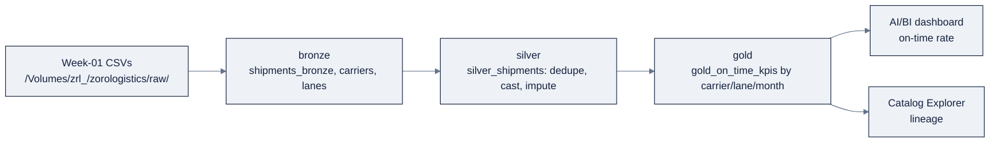

# Week 21, Databricks Day Zero: Unity Catalog & the Lakehouse

> Part of AI Engineering Lab · Week 21 of 24 · Section: Databricks Zero to Hero · Category: Platform & Data
> 🎯 Use case: Stand up the ZoroLogistics lakehouse, bronze → silver → gold entirely in SQL.

## The problem

ZoroLogistics ships freight across 20 lanes with 20 carriers, and every night a
folder of CSVs, `shipments.csv`, `carriers.csv`, `lanes.csv`, lands somewhere a
data engineer eventually looks at. Today that "eventually" is the problem. The
files live outside any catalog, so nobody can say which table is the *real*
on-time rate, who is allowed to read a customer's value, or whether last
Thursday's "fix" silently changed a number a dashboard already showed an
executive.

Without a governed lakehouse three failures are guaranteed. **First, no lineage:**
when the on-time KPI looks wrong, there is no path from the number back to the
bronze file and the transform that produced it. **Second, no trust:** a raw CSV
can be overwritten, re-exported, or hand-edited with no audit, so two analysts
quoting "the on-time rate" disagree and neither can prove they are right.
**Third, no safety:** cleaning lives in someone's head, a `NaN` weight, a
duplicate `shipment_id`, a malformed timestamp, and any of them reaches a
dashboard because nothing *enforces* the bronze→silver boundary.

This week you replace that with a **Unity Catalog lakehouse**: every CSV becomes a
governed, versioned **Delta table** at a three-level address, cleaning becomes a
declarative **medallion pipeline in SQL**, and the whole thing is time-travelable,
lineage-tracked, and grant-controlled. The before/after is concrete, before, "fix
the bad update" meant re-running a script and hoping; after, it is one
`RESTORE TABLE … TO VERSION AS OF 12`. That is the difference between a folder of
files and a platform a stranger can inspect and re-run.

## Objectives

- [ ] By Friday you can stand up a governed lakehouse in Unity Catalog: a catalog (`zrl_`), a schema (`zorologistics`), and volumes, using idempotent `CREATE … IF NOT EXISTS`.
- [ ] By Friday you can load the week-01 CSVs from a volume into Delta tables and demonstrate time travel (`DESCRIBE HISTORY`, `SELECT … VERSION AS OF`, `@v1`), `VACUUM`, `OPTIMIZE ZORDER`, and liquid clustering (`CLUSTER BY`).
- [ ] By Friday you can build the medallion architecture in pure SQL, bronze (source fidelity) → silver (dedupe, cast, impute) → gold (`gold_on_time_kpis` by carrier/lane/month), and defend each cleaning decision.
- [ ] By Friday you can write a dashboard-ready AI/BI query over gold and read the automatic lineage that connects it back to bronze.

## Day-by-day plan

| Day | Study | Run | Ship | Time |
|---|---|---|---|---|
| **Mon** | Account, workspace anatomy, control vs. compute plane, personas ([`00-day-zero-setup.md`](../../reference/platforms/databricks/00-day-zero-setup.md)) | Create the free-trial workspace; tour the sidebar; install + auth the CLI | A first notebook `%sql` cell that prints `current_user()` | ~2 h |
| **Tue** | Unity Catalog object model, managed vs. external, the privilege model ([`01-unity-catalog.md`](../../reference/platforms/databricks/01-unity-catalog.md)) | `01-unity-catalog-and-delta-lab.ipynb` cells 1 to 4: create `zrl_`/`zorologistics`/volumes, upload CSVs, load `shipments_bronze` | A governed catalog/schema/volume with a `SHOW GRANTS` you can read | ~2.5 h |
| **Wed** | Delta Lake: ACID, time travel, VACUUM/OPTIMIZE, liquid clustering ([`03-delta-lake.md`](../../reference/platforms/databricks/03-delta-lake.md)) | Notebook 1 cells 5 to 11: `DESCRIBE HISTORY`, `VERSION AS OF`, `VACUUM DRY RUN`, `OPTIMIZE ZORDER`, `CLUSTER BY` | A time-travel demo table with two versions and a clustering change | ~2.5 h |
| **Thu** | Medallion architecture + DBSQL ([`03-delta-lake.md`](../../reference/platforms/databricks/03-delta-lake.md) §9, [`04-dbsql.md`](../../reference/platforms/databricks/04-dbsql.md)) | `02-medallion-sql.ipynb`: bronze → silver (dedupe/cast/impute) → gold | `silver_shipments` + `gold_on_time_kpis` with quality checks passing | ~3 h |
| **Fri** | Use case day | Publish the gold query as an AI/BI dashboard; read lineage in Catalog Explorer | The Week 21 gate (below) + a screenshot of the lineage graph | ~2 h |

## Concepts (study first: Mon/Tue)

Your fact base this week is [`reference/knowledge-base/research/06-databricks-deep-dive.md`](../../reference/knowledge-base/research/06-databricks-deep-dive.md) (§0, §4) and [`reference/knowledge-base/13-databricks-overview.md`](../../reference/knowledge-base/13-databricks-overview.md); the deep-dives are [`00-day-zero-setup.md`](../../reference/platforms/databricks/00-day-zero-setup.md), [`01-unity-catalog.md`](../../reference/platforms/databricks/01-unity-catalog.md), [`02-compute.md`](../../reference/platforms/databricks/02-compute.md), [`03-delta-lake.md`](../../reference/platforms/databricks/03-delta-lake.md), and [`04-dbsql.md`](../../reference/platforms/databricks/04-dbsql.md). This README is the map; those files are the terrain.

### The platform is two planes

Everything Databricks does splits into a **control plane** (Databricks-managed: the
UI, identity, job scheduling, notebook metadata) and a **compute plane** (where
Spark and SQL actually run). The distinction that drives every "which compute"
decision: **classic compute runs in *your* cloud account** (your VPC, your
security rules), while **serverless compute runs in a Databricks-managed plane** in
the same region. You do not buy a lakehouse and point it at your data, you run
Databricks *inside* your cloud and it layers a governed lakehouse on your object
storage.

### Unity Catalog is governance, not folders

Unity Catalog (UC) is the unified governance layer for **data and AI**, one
metastore that governs tables, views, volumes, functions, *and* ML models. Every
object lives at a **three-level address** `catalog.schema.object`, and the object
can be a table, a view, a **volume** (non-tabular files, addressed as
`/Volumes/<catalog>/<schema>/<volume>/…`), a function, or a model. The legacy
DBFS-root pattern is deprecated, learn the volume path.

Tables come in three flavors, and picking the right one is a governance decision:

| | Managed | External | Foreign |
|---|---|---|---|
| Data lifecycle | UC manages | You manage | External system manages |
| Storage | UC-owned | You specify `LOCATION` | External system |
| `DROP TABLE` deletes data? | **Yes** | No (metadata only) | No |
| Best for | Production (default) | Existing storage / other readers | Federation, migration |

Default to **managed** for anything Databricks is the system of record for; use
**external** to point at storage other tools read; use **foreign** (Lakehouse
Federation) to query data *in place* without copying it.

### The privilege model is additive-only

UC grants are **additive only: there is no `DENY`**, and privileges **inherit
down** the hierarchy. A principal needs **traversal** (`USE CATALOG`, `USE SCHEMA`)
*and* an **action** (`SELECT`, `MODIFY`, `READ VOLUME`, `CREATE TABLE`, `EXECUTE`).
Grant to **groups**, not individuals, and give every object **one group owner**.
`MANAGE` delegates grant-admin (use sparingly); `BROWSE` is metadata-only.

**Worked example: the three ZoroLogistics roles.** Suppose groups
`zrl_data_engineers`, `zrl_analysts`, and `zrl_ml_engineers` exist (created in the
account console/SCIM). Traversal first, then the narrowest action each role needs:

```sql
-- Traversal: everyone must reach the catalog.
GRANT USE CATALOG ON CATALOG zrl_ TO `zrl_data_engineers`;
GRANT USE CATALOG ON CATALOG zrl_ TO `zrl_analysts`;
GRANT USE CATALOG ON CATALOG zrl_ TO `zrl_ml_engineers`;

-- Data engineers: read+write bronze/silver, write gold.
GRANT USE SCHEMA, CREATE TABLE, CREATE VOLUME ON SCHEMA zrl_.bronze TO `zrl_data_engineers`;
GRANT USE SCHEMA, CREATE TABLE ON SCHEMA zrl_.silver TO `zrl_data_engineers`;
GRANT USE SCHEMA, CREATE TABLE ON SCHEMA zrl_.gold   TO `zrl_data_engineers`;

-- Analysts: read-only on silver & gold.
GRANT USE SCHEMA, SELECT ON SCHEMA zrl_.silver TO `zrl_analysts`;
GRANT USE SCHEMA, SELECT ON SCHEMA zrl_.gold   TO `zrl_analysts`;

-- Volume access for the files before they are tables.
GRANT READ VOLUME, WRITE VOLUME ON VOLUME zrl_.bronze.landing TO `zrl_data_engineers`;
```

Verify with `SHOW GRANTS ON TABLE zrl_.gold.on_time_kpis;`, least privilege means
you can always add a grant later, but you can never "un-DENY" a grant you made too
broad. (Full model and an OpenSharing/Delta Sharing example: [`01-unity-catalog.md`](../../reference/platforms/databricks/01-unity-catalog.md).)

### Delta Lake gives you time travel

Delta is the **default storage layer**, every table is Delta unless you say
otherwise. It extends Parquet with a **transaction log** (`_delta_log/`), which is
what buys you **ACID transactions** (each statement atomic; optimistic concurrency
control), **schema enforcement/evolution**, and **time travel**. Every write
appends a new version; `DESCRIBE HISTORY` lists them; `SELECT … VERSION AS OF n`,
`SELECT … TIMESTAMP AS OF '…'`, and `@v1` read prior states; `RESTORE TABLE` rolls
back.

**Worked example: audit a bad update.** A botched `UPDATE` zeroed out weights, so
the current version is wrong but version 12 was good:

```sql
-- 1. Which version was last good?
SELECT version, timestamp, operation
FROM (DESCRIBE HISTORY zrl_.silver.shipments) ORDER BY version DESC;

-- 2. Roll the table back to version 12.
RESTORE TABLE zrl_.silver.shipments TO VERSION AS OF 12;

-- 3. Confirm the fix.
SELECT shipment_id, weight_kg FROM zrl_.silver.shipments WHERE weight_kg > 0;
```

In the notebook you make the same idea visible on an isolated demo table: version 1
holds 1,000 rows, version 2 holds 2,000, and
`SELECT count(*) FROM time_travel_demo VERSION AS OF 1` returns 1,000 while the
current table returns 2,000. The retention rules that bound this: the log keeps
history for `logRetentionDuration` (default **30 days**) and data files for
`deletedFileRetentionDuration` (default **7 days**).

**`VACUUM` deletes data files older than 7 days** (run `DRY RUN` first to preview;
it is a *scheduled maintenance* job, not a per-write habit). After VACUUM, time
travel past the window is impossible, a cost-vs-recovery decision.
**`OPTIMIZE`** compacts small files; **`ZORDER BY (carrier_id)`** colocates rows so
filter queries skip data. Both Z-order and Hive partitioning are now **superseded
by liquid clustering** (`CLUSTER BY (carrier_id, lane_id)`), which you can change
keys on *without a rewrite*, or let Databricks adapt with `CLUSTER BY AUTO` (GA on
DBR 15.4 LTS+). Full mechanics in [`03-delta-lake.md`](../../reference/platforms/databricks/03-delta-lake.md).

### The medallion is a data-quality contract

The medallion architecture is a **progressive trust model**, not a naming fad:

| Layer | Purpose | Rules | ZoroLogistics tables |
|---|---|---|---|
| **Bronze (raw)** | Ingest unvalidated, source-fidelity data | Append-only, no cleaning, store as `STRING`/`VARIANT` | `shipments_bronze`, `carriers`, `lanes` |
| **Silver (validated)** | Clean, dedupe, cast, impute, join | Schema enforced; dedupe on `shipment_id`; no nulls in key cols | `silver_shipments`, `lanes_clean` |
| **Gold (enriched)** | Aggregate into business shapes | Business rules + KPI columns | `gold_on_time_kpis` |



**Worked example: the silver clean, in SQL.** The Week-2 generator plants
duplicates (0.2%) and `NaN` weights (0.3%) that become `NULL` after CSV→Delta. The
silver query dedupes, casts, imputes, and re-derives the label:

```sql
CREATE OR REPLACE TABLE silver_shipments AS
WITH dedup AS (
  SELECT *, ROW_NUMBER() OVER (PARTITION BY shipment_id ORDER BY planned_departure) AS rn
  FROM shipments_bronze
)
SELECT shipment_id, carrier_id, lane_id, commodity,
  COALESCE(CAST(weight_kg AS DOUBLE), 850.0) AS weight_kg,      -- impute with mean
  COALESCE(CAST(value_usd  AS DOUBLE), 0.0)  AS value_usd,
  to_timestamp(planned_departure, 'yyyy-MM-dd HH:mm:ss[.SSSSSS]') AS planned_departure,
  to_timestamp(actual_arrival,    'yyyy-MM-dd HH:mm:ss[.SSSSSS]') AS actual_arrival,
  COALESCE(CAST(delay_hours AS DOUBLE), 0.0) AS delay_hours,
  CASE WHEN CAST(delay_hours AS DOUBLE) <= 2.0 THEN true ELSE false END AS is_on_time,
  status, weather_severity
FROM dedup WHERE rn = 1
```

The whole point: a bad row is caught at the bronze→silver boundary and **never
reaches a dashboard**. The three-layer discipline you learned in pandas (Week 2)
becomes declarative, governed, time-travelable SQL here.

### DBSQL reads the same tables

Databricks SQL is a warehouse *on the lakehouse*, the `gold_on_time_kpis` table
Spark wrote is the same table a SQL analyst queries, so BI and ML share one copy.
Its surfaces are the **SQL editor**, saved **queries** (with "Run as owner/viewer"
credential modes), **query history**, **alerts**, and **AI/BI dashboards** (formerly
Lakeview; the legacy "DBSQL dashboards" are archived, migrate via "Clone to AI/BI
dashboard"). Details in [`04-dbsql.md`](../../reference/platforms/databricks/04-dbsql.md).

### How it breaks

- **VACUUM too early = data loss.** If you VACUUM with the default 7-day retention
  and then discover you need to audit a change from 10 days ago, those data files
  are gone. The failure is silent, the table is fine, the *history* is not. Fix:
  `VACUUM … DRY RUN` first, keep retention ≥ your longest legitimate rollback
  window, and never vacuum bronze if compliance needs long raw history.
- **Imputing the wrong value poisons gold.** `COALESCE(weight_kg, 0)` would drag
  every weight average down and look "valid" because there are no nulls. The mean
  (`850.0`) is defensible; zero is not. The silver quality check (`null_weights =
  0`) catches nulls, not *wrong* values, the human decision is still yours.
- **Granting `MANAGE` "to make it work."** Because UC is additive-only, an
  over-broad grant is a permanent leak surface you must actively `REVOKE`. Least
  privilege from the start is the only cheap direction.
- **Dedupe on the wrong key.** `ROW_NUMBER() OVER (PARTITION BY carrier_id …)`
  would collapse distinct shipments. Dedupe on the natural key (`shipment_id`);
  every other partition is wrong.

## Notebook walkthrough

**`01-unity-catalog-and-delta-lab.ipynb`**: the "day zero to governed table" lab.
Cell 1 prints `spark.version`, `current_user()`, and the default catalog/schema, so
you know exactly *who* and *where* before touching data. Cells 2 to 4 create the
namespace idempotently, `catalog = "zrl_"` (note the trailing underscore),
schema `zorologistics`, volumes `raw` and `checkpoints`, then `dbutils.fs.ls` the
volume to confirm the three uploaded CSVs are present. Cell 5 is the first `%sql`
load: `CREATE OR REPLACE TABLE shipments_bronze AS SELECT * FROM read_files(…
format => 'csv', header => true, inferSchema => true)`, and cells 6 to 7 sanity-check
it with a `count(*)` and a `LIMIT 5` peek. Cell 8 loads `carriers`/`lanes` with the
PySpark `spark.read` path. Cells 9 to 12 are the time-travel demo: `DESCRIBE HISTORY`,
then a `time_travel_demo` table at 1,000 rows, an `INSERT` of another 1,000, and
the `UNION ALL` that proves `VERSION AS OF 1` returns 1,000 while current returns
2,000. Cells 13 to 16 run `VACUUM … DRY RUN`, `OPTIMIZE … ZORDER BY (carrier_id)`,
`ALTER TABLE … CLUSTER BY (carrier_id, lane_id)`, and `DESCRIBE DETAIL` to confirm
the clustering columns. The **final cell prints two numbers**: `bronze rows` and
`time-travel versions`. Correct output: a bronze row count matching your CSV
(100,000 from the full generator, or whatever `zoro/data.py` produced) and
`time-travel versions` = 2 (the demo table's CREATE + INSERT).

**`02-medallion-sql.ipynb`**: the medallion in pure SQL. Cells 1 to 2 set the
catalog/schema with `USE CATALOG zrl_; USE SCHEMA zorologistics;` then rebuild
`shipments_bronze`, `carriers`, `lanes` with three `read_files` statements. Cell 4
is the silver query above; cell 5 is the **quality gate**, it prints `rows`,
`null_weights` (must be 0), and `distinct_shipments` (must equal `rows`, proving no
duplicates survive). Cell 6 imputes `lanes_clean.distance_km` with `900.0`. Cell 8
builds `gold_on_time_kpis` joining silver to the cleaned dimensions and aggregating
on-time rate, average delay, and value/weight totals at the
carrier×lane×month grain; cell 9 orders the worst lanes by `on_time_rate ASC`.
Cell 11 is the **dashboard-ready query**: monthly on-time rate with a
3-month rolling window via
`avg(on_time_rate) OVER (ORDER BY month ROWS BETWEEN 2 PRECEDING AND CURRENT ROW)`.
The **final cell prints** `overall on-time rate` and `gold rows`. "Correct" means a
rate in the high-0.8s (the generator's carriers run 0.60 to 0.99 reliability) and a
gold row count equal to the distinct carrier×lane×month combinations in your data.

## The use case (Friday)

**Deliverable:** a governed `zrl_.zorologistics` lakehouse with `shipments_bronze`,
`silver_shipments`, and `gold_on_time_kpis`, plus a runnable AI/BI dashboard query
showing on-time rate by month.

**Zorost gate:** a stranger can open your catalog, read the lineage from bronze →
silver → gold, re-run your silver/gold SQL end-to-end, and confirm the numbers. You
can show the overall on-time rate, the row count at each layer, and a
`DESCRIBE HISTORY` output proving time travel works, and you can defend one
sentence for each cleaning decision (why dedupe on `shipment_id`, why impute
`weight_kg`/`distance_km`, and with what value).

**Stretch variant:** add a second gold artifact that ranks the **top 5 worst lanes
by on-time rate per month** using
`ROW_NUMBER() OVER (PARTITION BY month ORDER BY on_time_rate)`, and state which
lane/carrier you would fix first and why.

## Common pitfalls

| Pitfall | Why it happens | Fix |
|---|---|---|
| `NaN` becomes `NULL` after CSV→Delta | Pandas `NaN` serializes as empty string; `read_files` infers `NULL` | `COALESCE(CAST(col AS DOUBLE), <mean>)`, never `0` without reason |
| Dedupe on the wrong column | Partitioning by a non-natural key | `ROW_NUMBER() OVER (PARTITION BY shipment_id …)` and `WHERE rn = 1` |
| Timestamp cast fails | Sub-second values need an optional-fraction format | `to_timestamp(col, 'yyyy-MM-dd HH:mm:ss[.SSSSSS]')` |
| `VACUUM` then "where did history go?" | Retention window is shorter than your rollback need | `DRY RUN` first; retain ≥ longest rollback window |
| Over-broad grants | "Grant `MANAGE` to make it work" | Traversal + narrowest action; group owners; `SHOW GRANTS` to verify |
| Forgetting `USE CATALOG`/`USE SCHEMA` | Traversal privileges are separate from action privileges | Grant both; the mental checklist is "can Alice *reach* and *do*?" |
| DBFS paths from old tutorials | The DBFS-root/mount pattern is deprecated | Use `/Volumes/<catalog>/<schema>/<volume>/…` |
| Hard-partitioning a table you'll re-key | Z-order/Hive partitioning locks the layout | Liquid clustering (`CLUSTER BY` / `CLUSTER BY AUTO`) on new tables |

## Glossary

- **Metastore**: the account-level metadata registry; one can attach to many workspaces in a region.
- **Catalog / Schema**: the top two levels of the `catalog.schema.object` namespace; the schema is a database.
- **Volume**: a governed, non-tabular file container addressed by `/Volumes/<catalog>/<schema>/<volume>/…`.
- **Managed table**: a UC-owned Delta table whose data `DROP TABLE` deletes.
- **External table**: a table pointing at storage you specify; `DROP` removes metadata only.
- **Traversal privilege**: `USE CATALOG` / `USE SCHEMA`: the right to *reach* a container.
- **Transaction log**: the `_delta_log/` entries that give Delta ACID, time travel, and versioning.
- **Time travel**: reading a prior table state via `VERSION AS OF` / `TIMESTAMP AS OF` / `@v1` / `RESTORE TABLE`.
- **VACUUM**: permanent removal of data files older than the retention window (default 7 days).
- **Liquid clustering**: `CLUSTER BY` auto-organization you can re-key without a rewrite; supersedes partitioning + Z-order.
- **Medallion**: the bronze → silver → gold progressive data-quality pattern.
- **AI/BI dashboard**: the current dashboard product (formerly Lakeview); legacy DBSQL dashboards are archived.

## Self-check (quiz)

Take [`quiz.md`](quiz.md), 10 questions, **8/10 to pass**. It mixes multiple-choice
and short-answer, tied to the Concepts sections and the notebook cells above.

## Exercises

Four graded exercises (easy / standard / stretch / portfolio) are in
[`exercises.md`](exercises.md) with hints, the portfolio item advances the
**ZoroLogistics lakehouse** milestone by publishing the gold query as an AI/BI
dashboard and capturing the lineage graph.

## Sources

- Unity Catalog: https://docs.databricks.com/data-governance/unity-catalog/
- Access control (privileges): https://docs.databricks.com/data-governance/unity-catalog/access-control
- Database objects: https://docs.databricks.com/database-objects/
- Volumes: https://docs.databricks.com/volumes/
- Delta time travel & history: https://docs.databricks.com/tables/history
- VACUUM: https://docs.databricks.com/tables/operations/vacuum
- OPTIMIZE: https://docs.databricks.com/tables/operations/optimize
- Liquid clustering: https://docs.databricks.com/tables/clustering
- Medallion architecture: https://docs.databricks.com/lakehouse/medallion
- Databricks SQL: https://docs.databricks.com/sql/
- AI/BI dashboards: https://docs.databricks.com/dashboards/
- Compute / serverless: https://docs.databricks.com/compute/serverless/
