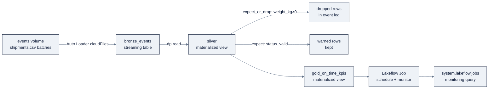

# Week 22: Databricks Data Engineering: PySpark、StreamingとLakeflow

> **日本語版** · [英語版](README.md) · [演習](exercises.ja.md) · [クイズ](quiz.ja.md)
> AI Engineering Labの一部 · Week 22 of 24 · Section: Databricks Zero to Hero · Category: Pipelines
> · Notebooks: [01-pyspark-data-engineering.ipynb](notebooks/01-pyspark-data-engineering.ipynb) · [02-streaming-and-dlt-pipeline.ipynb](notebooks/02-streaming-and-dlt-pipeline.ipynb)
> 🎯 **Use case:** streaming pipeline。liveなshipment event → validated silver → on-time KPI。

## 問題

Week 21はZoroLogisticsに *governed* なlakehouseを与えましたが、medallionはCSVsのfolderに対して手で実行したSQLで構築されました。それは、truckが初めて出発し、そのshipment eventが、誰かがqueryの再実行を思い出したときではなく *今日* on-time KPIを更新すべきになった瞬間までしか通用しません。freightはstreaming businessです。shipmentは絶え間ない小川のようにbookされ、pick upされ、weatherで遅れ、配達されます。ops teamはeventが届いたらすぐon-time rateが動くことを望んでいます。

二つの失敗modeが今週の内容を強制します。**第一に、scaleとlaziness。** 100,000行のfull CSVはtoyです。本物のfeedは数百万行で、日々増えます。driver上のpandas（大きなmachineでも）は死にます。PySparkのdistributed DataFrame APIが必要で、*いつ* 実際に計算されるかを理解しないと、うっかりの `count()` callでclusterを燃やします。**第二に、静かな悪data。** 現在、負の `weight_kg` や予期しない `status` は、*gate* するものがないためそのままsilverに流れ込みます。Week 2はvalidateすることを教えました。今週はpipeline自身が悪いrowをshipすることを拒否します。人間が気づくことを願う代わりに、**drop** または **fail** するexpectationです。

before/afterはこうです。beforeでは、悪いeventがgoldを更新し、errorは一週間後にanalystに見つかります。afterでは、同じeventがpipelineのevent logに数えられ（`weight_positive`: 3行dropped）、silverには決して届きません。これが、dataをtransformするscriptと、構成の時点で正しい **declarative pipeline** の違いです。

## 目標

- [ ] 金曜日までに、ZoroLogisticsのCSVsをPySpark DataFramesでtransformできる。read、join、aggregation、window function。そして *同じ* logicをSQLで表現し、数字が一致することを確認できる。
- [ ] 金曜日までに、partition済みDelta outputを書き、lazinessのrule（transformationはplanをbuildし、write/actionがそれを実行する）を説明できる。
- [ ] 金曜日までに、**Lakeflow Pipelines**（旧Delta Live Tables）のpipelineをPythonでdeclareできる。Auto Loaderでvolume上の `streaming_table` bronze、expectation付きの `materialized_view` silver、gold aggregate。
- [ ] 金曜日までに、data-quality **expectations**（warn / drop / fail）をattachし、pipeline UIで結果のquality metricを読める。そしてpipelineを **Lakeflow Job** としてscheduleできる。

## 日ごとの計画

| Day | Study | Run | Ship | Time |
|---|---|---|---|---|
| **Mon** | PySpark DataFrameのmental model、laziness、schema、partitioning（[`05-pyspark.md`](../../reference/platforms/databricks/05-pyspark.md)） | `01-pyspark-data-engineering.ipynb`: read → transform → join → aggregate → window | 数字がSQL版と一致するDataFrame KPI table | 約2.5時間 |
| **Tue** | Structured Streaming: Auto Loader、watermark、checkpoint、exactly-once（[`06-pipelines-jobs.md`](../../reference/platforms/databricks/06-pipelines-jobs.md) Part A） | `02-streaming-and-dlt-pipeline.ipynb`: `@dp.table` bronze + `@dp.materialized_view` silver | streaming tableと二つのexpectationを持つpipeline | 約3時間 |
| **Wed** | Expectationsの深掘り（warn/drop/fail）+ AUTO CDC（[`06-pipelines-jobs.md`](../../reference/platforms/databricks/06-pipelines-jobs.md) §A4〜A5） | bad-weight CSVを `events/` にdropしてからpipelineを再実行し、event logを読む | gateが悪いrowを除去したことを証明するbefore/after row count | 約2.5時間 |
| **Thu** | Lakeflow Jobs: task DAG、Run-if、trigger、parameter（[`06-pipelines-jobs.md`](../../reference/platforms/databricks/06-pipelines-jobs.md) Part B） | pipelineをscheduled Jobでwrapする。runとlineageを確認する | 監視query付きのscheduled job | 約2.5時間 |
| **Fri** | Use caseの日 | 監視queryをpublishする。DAGをscreenshotする | Week 22 gate（下記） | 約2時間 |

## 概念（まず読むのはMon/Tue）

Fact base: [`reference/knowledge-base/research/06-databricks-deep-dive.md`](../../reference/knowledge-base/research/06-databricks-deep-dive.md)（§5）。Deep-dive: [`05-pyspark.md`](../../reference/platforms/databricks/05-pyspark.md) と [`06-pipelines-jobs.md`](../../reference/platforms/databricks/06-pipelines-jobs.md)。

### PySpark: lazinessがすべて

最も重要なideaは一つ: **DataFrameはworkのlazyな記述である。** `select`、`filter`、`join`、`groupBy`、`withColumn` は **transformation** で、logical planをbuildするだけで何も実行しません。`count`、`show`、`collect`、`saveAsTable` は **action** で、実行をtriggerします。cellが「一瞬で終わる」のは速さではなくlazinessで、workは結果を要求したときに起こります。productionでは **writeだけが唯一のactionになるのが普通** です。余計なaction（logging用の迷子の `count()`）はoptimizerを中断し、planを再実行させるからです。

Databricksはその上に二つのacceleratorを重ねるので、よく形作られたDataFrame codeは往々にしてtuning不要です。**automatic disk cache**（local NVMe上のDatabricks管理のParquet cache）と **Photon**（vector化されたC++ engine。SQL warehouseとserverlessでdefault）。PhotonはSQL/DataFrame/ETLとstateless streamingを加速しますが、UDFs、RDD code、stateful streamingは **対象外** なので、Python UDFsよりbuilt-in functionを優先してください。performance decision table:

| Concern | Lever | Rule of thumb |
|---|---|---|
| Shuffle後のpartition数 | `spark.sql.shuffle.partitions` | executor core合計の1〜2倍（default 200は小さいclusterには多すぎる） |
| 再分布 | `repartition(n)` vs `coalesce(n)` | `repartition` はfull shuffle。`coalesce` はshuffleなしで縮める（skewあり得る） |
| 小さい側とのjoin | `F.broadcast(small_df)` | shuffleを回避。AQEは小さい側を自動broadcastする |
| 中間結果の再読み込み | `cache()` / `persist()` | 手動。済んだら `unpersist()`。*disk cache* は別で自動 |
| 独自のrow logic | built-in → pandas UDF → Python UDF | Photon対象 → batch → row単位（遅い） |

**実例: KPI aggregation、PySpark vs SQL。** transformとjoinの後、on-time KPIはboolean→0/1 cast付きのgroup-byです:

```python
kpis = (enriched
  .withColumn("month", F.date_format("actual_arrival", "yyyy-MM"))
  .groupBy("carrier_id", "carrier_name", "lane_id", "origin", "destination", "month")
  .agg(
      F.count("*").alias("shipment_count"),
      F.round(F.avg(F.when(F.col("is_on_time"), 1.0).otherwise(0.0)), 4).alias("on_time_rate"),
      F.round(F.avg("delay_hours"), 2).alias("avg_delay_hours"),
  ))
```

次に同じDataFrameをtemp viewとしてregisterし、同一のaggregationをSpark SQLで書きます。notebookの **cross-check cell** は両方のpathから `on_time_rate` を平均し、`match: abs(py_avg - sql_avg) < 1e-6` をprintします。そこで `True` が出れば、二つのexpressionが同じlogicである証拠です。間違った `CASE` や抜けた `round()` を捕まえる習慣です。続く **window function**（`Window.partitionBy("month").orderBy(…`）はrowをつぶさずに各月*の中で* carrierをrankします。「今月誰が勝っているか」です。

### Structured Streaming: batch API、exactly-once

batchからstreamへの架け橋は、**同じDataFrame APIがexactly-once保証付きのmicro-batch loopを駆動する** ことです。重要な部品は三つです:

- **Auto Loader**（`spark.readStream.format("cloudFiles")`）はvolume/object storageから新しいfileをincrementalに取り込みます。exactly-once semantics（checkpoint内のRocksDB progress store）とschema inference/evolution付き。file数千件なら `COPY INTO`、数百万件や進化するschemaならAuto Loaderを使います。
- **Watermark**（`withWatermark("ts", "10 minutes")`）はstateに上限を付け、遅いdataがmemoryを膨らませる代わりにdropされます。stream-stream outer joinには必須です。
- **Checkpoint** はoffset、commit、stateを保存してexactly-once resumeを可能にします。**各queryにはそれぞれ独自のcheckpoint locationが必要です**（UC volume path）。

Output modeは **Append**（default）、**Complete**、**Update** ですが、Delta sinkはAppend/Completeに対応し、Updateは **非対応** です。`availableNow`（旧 `Trigger.Once`）はbatch形のworkのためのone-shot incremental triggerです。

### Lakeflow Pipelines: orchestrateせずdeclareする

Lakeflow Pipelines（旧 **Delta Live Tables**）はdeclarative layerです。datasetを *declare* すると、pipelineがDAG、順序、retry、並列性を解決します。現在のPython APIは `from pyspark import pipelines as dp` です（古い資料にはlegacyの `import dlt` が登場します）。datasetは三種類です:

| Type | Semantics | Use when |
|---|---|---|
| **Streaming table** | 各recordを一度だけ処理。incremental。append-only source | Streaming ingestion |
| **Materialized view** | *現在の* stateを反映するよう再計算される（"always correct"） | Aggregation/join。dimensionの遅い変更 |
| **View** | on-demandで評価され、persistされない | 中間check |

微妙なrule: **streaming tableはdimensionの遅い変更で再計算されず、materialized viewはされます。** append-onlyのevent logはstreaming table、修正されたcarrier dimensionを反映しなければならないgold KPIはmaterialized viewです。pipelineのtableはすべてDelta tableです（ACID + time travel）。dataset functionは **DataFrameをreturnしなければならず**、action（`collect`、`count`、`toPandas`、`save`）を **呼んではいけません**。上流のtableは `dp.read()` / `dp.read_stream()` で読みます。

**Expectations** はdata qualityを願望からgateに変えます:

| Action | Python | SQL | Behavior |
|---|---|---|---|
| **Warn** | `@dp.expect` | `CONSTRAINT c EXPECT (cond)` | rowを保持し、metricを記録 |
| **Drop** | `@dp.expect_or_drop` | `… ON VIOLATION DROP ROW` | 悪いrowを除去し、続行 |
| **Fail** | `@dp.expect_or_fail` | `… ON VIOLATION FAIL UPDATE` | updateを中断（悪いdataをblock） |

**実例: silver gate。** pipelineのsilver viewは一つのfunctionに二つのdecoratorを重ねます:

```python
@dp.materialized_view
@dp.expect_or_drop("weight_positive", "weight_kg > 0")
@dp.expect("status_valid", "status IN ('Delivered', 'In Transit', 'Booked')")
def silver():
    return (dp.read("bronze_events")
            .dropDuplicates(["shipment_id"])
            .withColumn("weight_kg", F.col("weight_kg").cast("double"))
            .withColumn("delay_hours", F.col("delay_hours").cast("double"))
            .withColumn("is_on_time", F.col("delay_hours") <= 2.0))
```

`weight_kg <= 0` のrowは **dropped** され（許容noise）、未知の `status` は **warned** されて保持されます（updateを壊さずに見える）。SQLでの等価表現は `CREATE OR REFRESH STREAMING TABLE … CONSTRAINT weight_positive EXPECT
(weight_kg > 0) ON VIOLATION DROP ROW` です。event logはupdateごとに、各expectationが何rowをkeep/drop/failしたかを示します。data-qualityのobservabilityがタダで手に入ります。CDC sourceは **`AUTO CDC`**（旧 `APPLY CHANGES`）でSCD Type 1（latestのみ）またはType 2（`__START_AT`/`__END_AT`付きのversioned history）をbuildします。



### Lakeflow JobsとLakeflow Connect

**Lakeflow Jobs**（旧Workflows）はtaskを **DAG** としてorchestrateします: notebook、Python script/wheel、SQL、dbt、**Pipeline**、JAR、Run Job、**If/else**、**For each**。taskは `depends_on` でつながり、**Run if** でgateされます: `ALL_SUCCESS`（default）、`AT_LEAST_ONE_SUCCESS`、`NONE_FAILED`、`ALL_DONE`、`AT_LEAST_ONE_FAILED`、`ALL_FAILED`。parameterは `{{job.parameters.run_date}}` として流れ、notebookでは `dbutils.widgets` で読みます。Trigger: **Scheduled**（cron）、**Periodic**、**File arrival**、**Table update**、**Continuous**。Jobは **job cluster**（all-purposeよりDBU単価が安い）、既存cluster、または **serverless**（cluster configを省略）で動きます。耐障害性: taskごとのretry、**repair**（失敗したtaskだけ再実行）、taskごとのtimeout。

**Lakeflow Connect**（旧Databricks Ingest）はSaaS、database、file、streamからのmanaged ingestionです。rule of thumbとして、Connectはgoverned Delta tableにdataを **copy** し、**Lakehouse Federationはcopyせずin placeでquery** します。freight会社なら、eventがmessage busに届くときKafka connectorが自然な選択で、ここで使うのはfile baseの代替であるAuto Loaderです。

### うまくいかない理由

- **本物のinvariantへの `FAIL UPDATE` はpipelineを止める。** それが狙いです（悪いdataが黙って通ってはならない）。しかしinvariantが間違っていると、例えばdata-qualityの *repair* が正当に小さな負をemitする場面で `delay_hours >= 0` だと、noiseのために一晩分のupdateをblockします。`fail` は決して通してはならないinvariantに使い、許容noiseには `drop` を使う。
- **二つのqueryで一つのcheckpoint locationを再利用。** checkpointはexactly-once stateを保持します。一つのpathを共有する二つのqueryは互いのresumeを壊します。各queryに独自のUC volume pathを与える。
- **dataset function内のaction。** `@dp.table` 内の迷子の `count()` や `toPandas()` はeager実行を強制し、declarativeなplanを壊します。fixは機械的です: DataFrameをreturnして、それ以上触らない。
- **stateful joinでのwatermark忘れ。** watermarkのないstateful aggregationは *すべての* 遅いkeyをmemoryに永遠に保持し、ゆっくりとしたOOMになります。watermarkが保持するstateに上限を付けます。
- **速さに見せかけたlaziness。** 「一瞬で終わった」cellは何もしていません。最後のwriteがないなら、おそらく一度もactionをtriggerしていないのがbugです。

## Notebook walkthrough

**`01-pyspark-data-engineering.ipynb`**: 同じcleaning/KPI logicを二回。Cell 1は `F` と `Window` をimportし、volumeから三つのCSVsを読み、row countとschemaをprintします。Cell 3はtransform blockです: 三つのtimestamp columnに `to_timestamp(…,
'yyyy-MM-dd HH:mm:ss[.SSSSSS]')`、numeric columnに `cast("double")`、`is_on_time = delay_hours <= 2.0`、派生の `transit_hours`、続いて `dropDuplicates(["shipment_id"])` と `fillna({"weight_kg": 850.0})`。Cell 5はcarrierとlaneのdimensionをjoinします（`carrier_id`/`lane_id` でleft join）。Cell 7は `kpis` aggregation（上の実例）をbuildし、cell 9は `rank_in_month` windowを追加して各月top-2のcarrierを示します。Cell 11は `month` でpartitionされた `gold_on_time_kpis_spark` を書き出します。これがすべてをmaterializeする **action** です。Cells 13〜15は `enriched` をtemp viewにregisterし、同一の `%sql` aggregationを実行し、**cross-check**: `match: True/False` をprintします。**最後のcellは** `final on-time rate` と `enriched rows` をprintします。正しい出力: `match: True`（二つのpathが1e-6まで一致）、high-0.8sのon-time rate、dedupe後のshipment数に等しい `enriched rows`。

**`02-streaming-and-dlt-pipeline.ipynb`**: declarative pipeline。Cell 1は `from pyspark import pipelines as dp` をimportします。Cell 3は `@dp.table` の **`bronze_events`** です: `events/` volume folderに対する `spark.readStream.format("cloudFiles")`。`cloudFiles.schemaLocation` がschema inferenceを固定します。Cell 5は **`silver`**、二つのexpectation decoratorを重ねた `@dp.materialized_view` です。Cell 7は **`gold_on_time_kpis`**、silverをcarrier/lane/monthでaggregateする `@dp.materialized_view` です。Cell 9は `@dp.temporary_view` です（persistされない）。Cell 11は **SQL比較** です: `CREATE OR REFRESH STREAMING TABLE bronze_events_sql AS SELECT *
FROM STREAM read_files(…)` と `MATERIALIZED VIEW silver_sql CONSTRAINT
weight_positive EXPECT (weight_kg > 0) ON VIOLATION DROP ROW`。実行するには、**Jobs & Pipelines → Pipelines** でpipelineを作り、notebookを指定し、target schemaを設定し、bad-weight CSVを `events/` にdropしてgateが発火するのを見ます。**最後のcellは** `silver rows` をprintします（初回実行前は0、その後dedupe済みcount）。「正しい」状態は **event log** で見えます: `weight_positive` がdropped-row countを報告し、`silver` のrow countはbronzeの数以下（≤）です。

## Use case（Friday）

**Deliverable:** bronzeがAuto Loaderでevents volumeを読み、silverが `weight_kg` と `status` にexpectationを強制し、goldがon-time KPIsを出すLakeflow Pipelines pipeline（Python）。加えて、その結果に対する監視queryをLakeflow Jobとしてscheduleしたもの。

**Zorost gate:** 見知らぬ人がUI（Jobs & Pipelines → Pipeline）でpipelineを設定し、あなたのnotebookとtarget schemaを指して実行し、expectationが発火した（keep / drop / failしたrow数）event logを読めること。DAG、最終gold row count、quality gateが実際に悪いrowを除去したことを証明するbefore/after row countを見せられること。

**Stretch variant:** 三つ目のexpectation `@dp.expect_or_fail("non_negative_delay",
"delay_hours >= 0")` を追加し、違反するrowでpipelineを再実行し、updateに何が起きるか（failする）を `@dp.expect_or_drop` と対比してmarkdown cell一文で記述する。

## よくあるpitfall

| Pitfall | なぜ起きるか | Fix |
|---|---|---|
| 「cellは一瞬で終わったのに何も変わらない」 | transformationはlazy | write/countを明示的なactionにする |
| 大きなDataFrameでの `collect()`/`toPandas()` | すべてdriverに引き込む | 小さくfilterした結果だけに使う |
| `@dp.table` function内のaction | eager実行を強制し、planを壊す | DataFrameをreturnする。中で `count`/`save` は絶対しない |
| 一つのcheckpoint pathの共有 | checkpointはqueryごとのexactly-once stateを保持 | queryごとに一つのUC volume path |
| noisyなinvariantへの `fail` | 許容noiseのためにupdate全体をblockする | noiseには `drop`。`fail` はinvariantだけに |
| watermarkなしのstream | stateful opがすべての遅いkeyを保持する | `withWatermark` がstateに上限を付ける |
| all-purpose clusterでのscheduled work | 自動workに対話rateを払っている | job clusterかserverless |
| row logicへのPython UDF | row単位でPhotonが効かない | built-in → pandas UDF → Python UDF |

## Glossary

- **Lazy evaluation**: transformationはplanをbuildし、actionだけがそれを実行する。
- **Action**: 実行をtriggerする操作（`count`、`show`、`collect`、`saveAsTable`）。
- **Photon**: Databricksのvector化C++ engine。SQL/DataFrame/stateless streamingを加速し、UDFs/RDDsは対象外。
- **Auto Loader**: 新しいfileをexactly-once semanticsでincrementalに取り込む `cloudFiles` source。
- **Watermark**: 遅い/stateful streaming dataを安全にdropできるようにする時間上限。
- **Checkpoint**: exactly-once resumeを可能にするqueryごとのstate（offset、commit）。
- **Streaming table**: 各recordを一度だけ処理するpipeline dataset（append-only）。
- **Materialized view**: 現在のstateを反映するよう再計算されるpipeline dataset。
- **Expectation**: warn/drop/fail action付きのboolean data-quality制約。
- **`AUTO CDC`**: SCD Type 1/2 tableをbuildするpipeline句（旧 `APPLY CHANGES`）。
- **Lakeflow Job**: `depends_on` + Run-if gateとschedulingを持つtaskのDAG。
- **Lakeflow Connect**: 外部dataをDeltaにcopyするmanaged ingestion（Federationのquery-in-placeと対照的）。

## Self-check（quiz）

[`quiz.md`](quiz.md) を受けてください。10問、**8/10で合格**。Concepts sectionとnotebook cellに紐付いたmultiple choiceとshort answerの混成です。

## Exercises

四つのgraded exerciseがhint付きで [`exercises.md`](exercises.md) にあります。portfolio itemはpipelineをscheduled Lakeflow Jobでwrapして、**ZoroLogistics streaming pipeline** milestoneを進めます。

## Sources

- PySpark on Databricks: https://docs.databricks.com/pyspark/
- Spark DataFrames: https://docs.databricks.com/getting-started/dataframes/
- Lakeflow Pipelines (DLT): https://docs.databricks.com/ldp/
- Pipeline concepts: https://docs.databricks.com/ldp/concepts
- Expectations (data quality): https://docs.databricks.com/ldp/expectations
- Python reference: https://docs.databricks.com/ldp/developer/python-ref
- Structured Streaming: https://docs.databricks.com/structured-streaming/concepts
- Watermarks: https://docs.databricks.com/structured-streaming/watermarks
- Auto Loader: https://docs.databricks.com/ingestion/cloud-object-storage/auto-loader/
- Lakeflow Jobs: https://docs.databricks.com/jobs/
