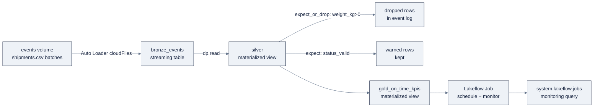

# Week 22, Databricks Data Engineering: PySpark, Streaming & Lakeflow

> Part of AI Engineering Lab · Week 22 of 24 · Section: Databricks Zero to Hero · Category: Pipelines
> 🎯 Use case: A streaming pipeline, live shipment events → validated silver → on-time KPIs.

## The problem

Week 21 gave ZoroLogistics a *governed* lakehouse, but the medallion was built with
hand-run SQL against a folder of CSVs. That works until the first time a truck
departs and its shipment event should update the on-time KPI *today*, not when
someone remembers to re-run a query. Freight is a streaming business: shipments are
booked, picked up, delayed by weather, and delivered in a continuous trickle, and
the ops team wants the on-time rate to move as events land.

Two failure modes force this week. **First, scale and laziness:** the full 100,000-row
CSV is a toy; the real feed is millions of rows and grows daily. Pandas-on-the-driver
(even on a big machine) dies; you need PySpark's distributed DataFrame API and you
need to understand *when* it actually computes, or you will burn a cluster on
accidental `count()` calls. **Second, silent bad data:** a negative `weight_kg` or an
unexpected `status` currently flows straight into silver because nothing *gates* it.
Week 2 taught you to validate; this week the pipeline itself refuses to ship a bad
row, an expectation that **drops** or **fails** instead of hoping a human notices.

The before/after: before, a bad event updates gold and the error is found a week
later by an analyst; after, the same event is counted in the pipeline's event log
(`weight_positive`: 3 rows dropped) and never reaches silver. That is the difference
between a script that transforms data and a **declarative pipeline** that is correct
by construction.

## Objectives

- [ ] By Friday you can transform the ZoroLogistics CSVs with PySpark DataFrames, reads, joins, aggregations, window functions, and express the *same* logic in SQL, confirming the numbers match.
- [ ] By Friday you can write partitioned Delta output and explain the laziness rule (transformations build a plan; the write/action runs it).
- [ ] By Friday you can declare a **Lakeflow Pipelines** (formerly Delta Live Tables) pipeline in Python: a `streaming_table` bronze over a volume with Auto Loader, a `materialized_view` silver with expectations, and a gold aggregate.
- [ ] By Friday you can attach data-quality **expectations** (warn / drop / fail) and read the resulting quality metrics in the pipeline UI, then schedule the pipeline as a **Lakeflow Job**.

## Day-by-day plan

| Day | Study | Run | Ship | Time |
|---|---|---|---|---|
| **Mon** | PySpark DataFrame mental model, laziness, schema, partitioning ([`05-pyspark.md`](../../reference/platforms/databricks/05-pyspark.md)) | `01-pyspark-data-engineering.ipynb`: read → transform → join → aggregate → window | A DataFrame KPI table whose numbers match the SQL version | ~2.5 h |
| **Tue** | Structured Streaming: Auto Loader, watermarks, checkpoints, exactly-once ([`06-pipelines-jobs.md`](../../reference/platforms/databricks/06-pipelines-jobs.md) Part A) | `02-streaming-and-dlt-pipeline.ipynb`: `@dp.table` bronze + `@dp.materialized_view` silver | A pipeline with a streaming table and two expectations | ~3 h |
| **Wed** | Expectations in depth (warn/drop/fail) + AUTO CDC ([`06-pipelines-jobs.md`](../../reference/platforms/databricks/06-pipelines-jobs.md) §A4 to A5) | Re-run the pipeline after dropping a bad-weight CSV into `events/`; read the event log | Before/after row counts proving a gate removed bad rows | ~2.5 h |
| **Thu** | Lakeflow Jobs: task DAG, Run-if, triggers, parameters ([`06-pipelines-jobs.md`](../../reference/platforms/databricks/06-pipelines-jobs.md) Part B) | Wrap the pipeline in a scheduled Job; check runs and lineage | A scheduled job with a monitoring query | ~2.5 h |
| **Fri** | Use case day | Publish the monitoring query; screenshot the DAG | The Week 22 gate (below) | ~2 h |

## Concepts (study first: Mon/Tue)

Fact base: [`reference/knowledge-base/research/06-databricks-deep-dive.md`](../../reference/knowledge-base/research/06-databricks-deep-dive.md) (§5). Deep-dives: [`05-pyspark.md`](../../reference/platforms/databricks/05-pyspark.md) and [`06-pipelines-jobs.md`](../../reference/platforms/databricks/06-pipelines-jobs.md).

### PySpark: laziness is the whole game

The single most important idea: **a DataFrame is a lazy description of work.**
`select`, `filter`, `join`, `groupBy`, `withColumn` are **transformations**, they
build a logical plan and run nothing. `count`, `show`, `collect`, `saveAsTable` are
**actions**: they trigger execution. When a cell "runs instantly," that is
laziness, not speed; the work happens when you ask for a result. In production the
**write is usually the only action**, because every extra action (a stray
`count()` for logging) interrupts the optimizer and re-runs the plan.

Databricks layers two accelerators on top so well-shaped DataFrame code often needs
no tuning at all: the **automatic disk cache** (a Databricks-managed Parquet cache
on local NVMe) and **Photon** (its vectorized C++ engine, default on SQL warehouses
and serverless). Photon accelerates SQL/DataFrame/ETL and stateless streaming but
**not** UDFs, RDD code, or stateful streaming, so prefer built-in functions over
Python UDFs. The performance decision table:

| Concern | Lever | Rule of thumb |
|---|---|---|
| Post-shuffle partition count | `spark.sql.shuffle.partitions` | 1 to 2× total executor cores (default 200 is too high for small clusters) |
| Redistribute | `repartition(n)` vs `coalesce(n)` | `repartition` full shuffle; `coalesce` shrinks without shuffle (can skew) |
| Join a small side | `F.broadcast(small_df)` | Avoids a shuffle; AQE auto-broadcasts small sides anyway |
| Re-reading an intermediate | `cache()` / `persist()` | Manual; `unpersist()` when done, the *disk cache* is separate and automatic |
| Custom row logic | built-in → pandas UDF → Python UDF | Photon-eligible → batched → row-at-a-time (slow) |

**Worked example: the KPI aggregation, PySpark vs SQL.** After transforming and
joining, the on-time KPI is a group-by with a boolean→0/1 cast:

```python
kpis = (enriched
  .withColumn("month", F.date_format("actual_arrival", "yyyy-MM"))
  .groupBy("carrier_id", "carrier_name", "lane_id", "origin", "destination", "month")
  .agg(
      F.count("*").alias("shipment_count"),
      F.round(F.avg(F.when(F.col("is_on_time"), 1.0).otherwise(0.0)), 4).alias("on_time_rate"),
      F.round(F.avg("delay_hours"), 2).alias("avg_delay_hours"),
  ))
```

Then register the same DataFrame as a temp view and write the identical aggregation
in Spark SQL. The notebook's **cross-check cell** averages `on_time_rate` from both
paths and prints `match: abs(py_avg - sql_avg) < 1e-6`. A `True` there is your proof
the two expressions are the same logic, the habit that catches a wrong `CASE` or a
missing `round()`. A **window function** (`Window.partitionBy("month").orderBy(…`)
then ranks carriers *within* each month without collapsing rows, "who is winning
this month."

### Structured Streaming: batch API, exactly-once

The bridge from batch to stream is that the **same DataFrame API drives a
micro-batch loop with exactly-once guarantees**. Three pieces matter:

- **Auto Loader** (`spark.readStream.format("cloudFiles")`) incrementally ingests
  new files from a volume/object storage, with exactly-once semantics (a RocksDB
  progress store in the checkpoint) and schema inference/evolution. Use `COPY INTO`
  for thousands of files; Auto Loader for millions or evolving schemas.
- **Watermarks** (`withWatermark("ts", "10 minutes")`) bound state so late data is
  dropped instead of bloating memory, mandatory for stream-stream outer joins.
- **Checkpoints** store offsets, commits, and state for exactly-once resume, and
  **each query needs its own checkpoint location** (a UC volume path).

Output modes: **Append** (default), **Complete**, and **Update**, but Delta sinks
support Append/Complete, **not** Update. `availableNow` (formerly `Trigger.Once`) is
the one-shot incremental trigger for batch-shaped work.

### Lakeflow Pipelines: declare, don't orchestrate

Lakeflow Pipelines (formerly **Delta Live Tables**) is the declarative layer: you
*declare* datasets and the pipeline resolves the DAG, ordering, retries, and
parallelism. The current Python API is `from pyspark import pipelines as dp` (the
legacy `import dlt` appears in older material). Three dataset kinds:

| Type | Semantics | Use when |
|---|---|---|
| **Streaming table** | Each record processed once; incremental; append-only source | Streaming ingestion |
| **Materialized view** | Recomputed to reflect *current* state ("always correct") | Aggregations/joins; late dimension changes |
| **View** | Evaluated on demand, not persisted | Intermediate checks |

The subtle rule: **streaming tables don't recompute on late dimension changes;
materialized views do.** An append-only event log is a streaming table; a gold KPI
that must reflect a corrected carrier dimension is a materialized view. All pipeline
tables are Delta tables (ACID + time travel). Dataset functions must **return a
DataFrame** and must **not call actions** (`collect`, `count`, `toPandas`, `save`);
upstream tables are read with `dp.read()` / `dp.read_stream()`.

**Expectations** turn data quality from a hope into a gate:

| Action | Python | SQL | Behavior |
|---|---|---|---|
| **Warn** | `@dp.expect` | `CONSTRAINT c EXPECT (cond)` | Keep the row, record the metric |
| **Drop** | `@dp.expect_or_drop` | `… ON VIOLATION DROP ROW` | Remove bad rows, keep going |
| **Fail** | `@dp.expect_or_fail` | `… ON VIOLATION FAIL UPDATE` | Abort the update (block bad data) |

**Worked example: the silver gate.** The pipeline's silver view stacks two
decorators on one function:

```python
@dp.materialized_view
@dp.expect_or_drop("weight_positive", "weight_kg > 0")
@dp.expect("status_valid", "status IN ('Delivered', 'In Transit', 'Booked')")
def silver():
    return (dp.read("bronze_events")
            .dropDuplicates(["shipment_id"])
            .withColumn("weight_kg", F.col("weight_kg").cast("double"))
            .withColumn("delay_hours", F.col("delay_hours").cast("double"))
            .withColumn("is_on_time", F.col("delay_hours") <= 2.0))
```

A `weight_kg <= 0` row is **dropped** (tolerable noise); an unknown `status` is
**warned** and kept (so you see it without breaking the update). The SQL equivalent
is `CREATE OR REFRESH STREAMING TABLE … CONSTRAINT weight_positive EXPECT
(weight_kg > 0) ON VIOLATION DROP ROW`. The event log shows, per update, how many
rows each expectation kept/dropped/failed, your data-quality observability for
free. CDC sources use **`AUTO CDC`** (formerly `APPLY CHANGES`) to build SCD Type 1
(latest only) or Type 2 (versioned history with `__START_AT`/`__END_AT`).



### Lakeflow Jobs & Lakeflow Connect

**Lakeflow Jobs** (formerly Workflows) orchestrate tasks as a **DAG**: notebook,
Python script/wheel, SQL, dbt, **Pipeline**, JAR, Run Job, **If/else**, **For each**.
Tasks wire with `depends_on` and gate with **Run if**, `ALL_SUCCESS` (default),
`AT_LEAST_ONE_SUCCESS`, `NONE_FAILED`, `ALL_DONE`, `AT_LEAST_ONE_FAILED`,
`ALL_FAILED`. Parameters flow as `{{job.parameters.run_date}}` (read in a notebook
via `dbutils.widgets`). Triggers: **Scheduled** (cron), **Periodic**, **File
arrival**, **Table update**, **Continuous**. Jobs run on a **job cluster** (cheaper
per-DBU than all-purpose), an existing cluster, or **serverless** (omit cluster
config). Resilience: per-task retries, **repair** (re-run only failed tasks), and
per-task timeouts.

**Lakeflow Connect** (formerly Databricks Ingest) is managed ingestion from SaaS,
databases, files, and streams; the rule of thumb is that Connect **copies** data
into governed Delta tables, while **Lakehouse Federation queries in place** without
copying. For a freight company, a Kafka connector is the natural choice when events
arrive on a message bus; Auto Loader is the file-based alternative used here.

### How it breaks

- **Expectation `FAIL UPDATE` on a real invariant = the pipeline stops.** That is
  the point (bad data must not silently pass), but if the invariant is wrong, e.g.
  `delay_hours >= 0` when a data-quality *repair* legitimately emits a small
  negative, you block a whole night's update over noise. Reserve `fail` for
  invariants that must never pass; use `drop` for tolerable noise.
- **Reusing one checkpoint location for two queries.** Checkpoints hold exactly-once
  state; two queries sharing one path corrupt each other's resume. Each query gets
  its own UC volume path.
- **Actions inside a dataset function.** A stray `count()` or `toPandas()` inside
  `@dp.table` forces eager execution and breaks the declarative plan. The fix is
  mechanical: return the DataFrame, don't touch it.
- **Forgetting watermarks on stateful joins.** A stateful aggregation without a
  watermark keeps *all* late keys in memory forever, a slow OOM. Watermarks bound
  the state you keep.
- **Laziness disguised as speed.** A cell that "runs instantly" did nothing; if the
  final write is missing, the likely bug is that you never triggered an action.

## Notebook walkthrough

**`01-pyspark-data-engineering.ipynb`**: the same cleaning/KPI logic twice. Cell 1
imports `F` and `Window` and reads the three CSVs from the volume, printing row
counts and a schema. Cell 3 is the transform block: `to_timestamp(…,
'yyyy-MM-dd HH:mm:ss[.SSSSSS]')` for the three timestamp columns, `cast("double")`
for numeric columns, `is_on_time = delay_hours <= 2.0`, a derived `transit_hours`,
then `dropDuplicates(["shipment_id"])` and `fillna({"weight_kg": 850.0})`. Cell 5
joins carrier and lane dimensions (left joins on `carrier_id`/`lane_id`). Cell 7
builds the `kpis` aggregation (the worked example above); cell 9 adds the
`rank_in_month` window and shows the top-2 carriers per month. Cell 11 writes
`gold_on_time_kpis_spark` partitioned by `month`, **this is the action** that
materializes everything. Cells 13 to 15 register `enriched` as a temp view, run the
identical `%sql` aggregation, and print the **cross-check**: `match: True/False`.
The **final cell prints** `final on-time rate` and `enriched rows`. Correct output:
`match: True` (the two paths agree to 1e-6), an on-time rate in the high-0.8s, and
`enriched rows` equal to the deduped shipment count.

**`02-streaming-and-dlt-pipeline.ipynb`**: a declarative pipeline. Cell 1 imports
`from pyspark import pipelines as dp`. Cell 3 is `@dp.table` **`bronze_events`**:
`spark.readStream.format("cloudFiles")` over the `events/` volume folder, with
`cloudFiles.schemaLocation` pinning schema inference. Cell 5 is **`silver`**, a
`@dp.materialized_view` with the two expectation decorators stacked. Cell 7 is
**`gold_on_time_kpis`**, a `@dp.materialized_view` aggregating silver by
carrier/lane/month. Cell 9 is a `@dp.temporary_view` (not persisted). Cell 11 is the
**SQL comparison**: `CREATE OR REFRESH STREAMING TABLE bronze_events_sql AS SELECT *
FROM STREAM read_files(…)` and a `MATERIALIZED VIEW silver_sql CONSTRAINT
weight_positive EXPECT (weight_kg > 0) ON VIOLATION DROP ROW`. To run it, create the
pipeline in **Jobs & Pipelines → Pipelines**, point it at the notebook, set the
target schema, and drop a bad-weight CSV into `events/` to watch the gate fire. The
**final cell prints** `silver rows` (0 before the first run, then the deduped count
after). "Correct" is visible in the **event log**: `weight_positive` reports the
dropped-row count, and `silver`'s row count is strictly ≤ bronze's.

## The use case (Friday)

**Deliverable:** a Lakeflow Pipelines pipeline (Python) whose bronze reads the events
volume with Auto Loader, whose silver enforces expectations on `weight_kg` and
`status`, and whose gold emits on-time KPIs, plus a monitoring query over the
result, scheduled as a Lakeflow Job.

**Zorost gate:** a stranger can configure the pipeline in the UI (Jobs & Pipelines →
Pipeline), point it at your notebook and target schema, run it, and read the event
log showing the expectations fired (rows kept / dropped / failed). You can show the
DAG, the final gold row count, and the before/after row counts that prove a quality
gate actually removed bad rows.

**Stretch variant:** add a third expectation, `@dp.expect_or_fail("non_negative_delay",
"delay_hours >= 0")`, re-run the pipeline with a violating row, and describe in one
markdown cell what happens to the update (it fails) versus `@dp.expect_or_drop`.

## Common pitfalls

| Pitfall | Why it happens | Fix |
|---|---|---|
| "The cell ran instantly but nothing changed" | Transformations are lazy | Make the write/count the explicit action |
| `collect()`/`toPandas()` on a big DataFrame | Pulls everything to the driver | Only on small, filtered results |
| Actions inside `@dp.table` functions | Forces eager execution, breaks the plan | Return the DataFrame; never `count`/`save` inside |
| Sharing one checkpoint path | Checkpoints hold exactly-once state per query | One UC volume path per query |
| `fail` on a noisy invariant | Blocks a whole update over tolerable noise | `drop` for noise; `fail` only for invariants |
| Stream without a watermark | Stateful ops keep all late keys | `withWatermark` bounds state |
| Scheduled work on an all-purpose cluster | Pay interactive rate for automated work | Job cluster or serverless |
| Python UDF for row logic | Row-at-a-time, breaks Photon | Built-in → pandas UDF → Python UDF |

## Glossary

- **Lazy evaluation**: transformations build a plan; only an action executes it.
- **Action**: an operation (`count`, `show`, `collect`, `saveAsTable`) that triggers execution.
- **Photon**: Databricks' vectorized C++ engine; accelerates SQL/DataFrame/stateless streaming, not UDFs/RDDs.
- **Auto Loader**: the `cloudFiles` source that incrementally ingests new files with exactly-once semantics.
- **Watermark**: a time bound that lets late/stateful streaming data be dropped safely.
- **Checkpoint**: per-query state (offsets, commits) that enables exactly-once resume.
- **Streaming table**: a pipeline dataset that processes each record once (append-only).
- **Materialized view**: a pipeline dataset recomputed to reflect current state.
- **Expectation**: a boolean data-quality constraint with warn/drop/fail actions.
- **`AUTO CDC`**: the pipeline clause (formerly `APPLY CHANGES`) that builds SCD Type 1/2 tables.
- **Lakeflow Job**: a DAG of tasks with `depends_on` + Run-if gating and scheduling.
- **Lakeflow Connect**: managed ingestion that copies external data into Delta (vs. Federation's query-in-place).

## Self-check (quiz)

Take [`quiz.md`](quiz.md), 10 questions, **8/10 to pass**, mixing multiple-choice
and short-answer tied to the Concepts sections and notebook cells.

## Exercises

Four graded exercises are in [`exercises.md`](exercises.md) with hints, the
portfolio item advances the **ZoroLogistics streaming pipeline** milestone by
wrapping the pipeline in a scheduled Lakeflow Job.

## Sources

- PySpark on Databricks: https://docs.databricks.com/pyspark/
- Spark DataFrames: https://docs.databricks.com/getting-started/dataframes/
- Lakeflow Pipelines (DLT): https://docs.databricks.com/ldp/
- Pipeline concepts: https://docs.databricks.com/ldp/concepts
- Expectations (data quality): https://docs.databricks.com/ldp/expectations
- Python reference: https://docs.databricks.com/ldp/developer/python-ref
- Structured Streaming: https://docs.databricks.com/structured-streaming/concepts
- Watermarks: https://docs.databricks.com/structured-streaming/watermarks
- Auto Loader: https://docs.databricks.com/ingestion/cloud-object-storage/auto-loader/
- Lakeflow Jobs: https://docs.databricks.com/jobs/
