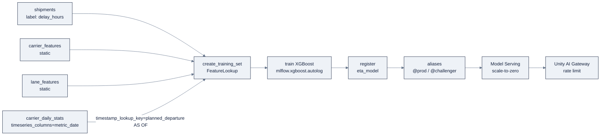

# Week 23: Databricks ML & GenAI: Training、Serving、Genie

> **日本語版** · [英語版](README.md) · [演習](exercises.ja.md) · [クイズ](quiz.ja.md)
> AI Engineering Labの一部 · Week 23 of 24 · Section: Databricks Zero to Hero · Category: ML & GenAI
> · Notebooks: [01-mlflow-feature-engineering-training.ipynb](notebooks/01-mlflow-feature-engineering-training.ipynb) · [02-vector-search-rag.ipynb](notebooks/02-vector-search-rag.ipynb) · [03-ai-functions-and-genie.ipynb](notebooks/03-ai-functions-and-genie.ipynb)
> 🎯 **Use case:** point-in-time ETA model + shipping docsに対するRAG + ops analyst向けGenie space。

## 問題

ZoroLogisticsは今やgovernedでvalidatedなlakehouseを持っていますが、誰も *act* しないdataはただのstorageです。ops roomで繰り返し出る三つのquestionは、どれもML/GenAIの問題です。**「このshipmentは実際にはいつ届くのか？」**（regression）、**「48時間遅れのrefundについてのpolicyは何か？」**（documentに対するretrieval）、**「今月どのlaneがon-time rateを殺しているのか？」**（self-service analytics）。今日、ops teamはこの三つすべてを手で答えています。ETAにはspreadsheet、policyにはPDF search、KPIにはanalyst ticketです。

二つの失敗modeが、今週のnaiveな版を危険にします。**第一に、leakage。** carrierのon-time rateを *full* historyで計算してETA modelに与えると、modelはshipment出発後のdataを使って「predict」します。trainingでは素晴らしく見えますが、productionでは未来は見えないので、黙って成績が落ちます。Week 3が警告したtime-aware-splitの罪そのものが、feature storeにscaleした形です。**第二に、根拠のない回答。** 自分のweightsからpolicy questionに答えるLLMはrefund rateをでっち上げます。hallucinateしたtariffは便利さではなくliabilityです。答えは *retrievalされ、citationされた* 一節から来なければなりません。

before/afterはこうです。beforeでは「carrier reliability」は未来をtrainingにleakさせるspreadsheet columnです。afterでは、各shipmentの出発時点に **AS OF** でjoinされた **time-series feature table** になり、leakするbaselineに対するmodelの改善は *測られた数字* になります。beforeではpolicy回答は当て推量です。afterでは、**groundedness score** とsource document付きのretrievalです。今週のすべてはこれです。leakしないgoverned modelと、hallucinateしないgoverned answer。

## 目標

- [ ] 金曜日までに、XGBoost ETA runをMLflow autologgingでlogし、modelをUnity Catalogにregisterし、固定stageではなく可動な **alias**（`@prod`）でpromoteできる。
- [ ] 金曜日までに、UC **feature table**（carrier reliability + lane stats）をbuildし、`FeatureLookup` でtraining setをassembleし、time-series feature table経由の **point-in-time join** を実行して、training featureが未来をleakしないようにできる。
- [ ] 金曜日までに、policy docをembedし、**AI Search**（旧Vector Search）のDelta Sync indexを作り、similarity + hybrid searchを実行し、`ai_query` とgroundedness数値付きのRAG回答をbuildできる。
- [ ] 金曜日までに、SQL **AI functions**（`ai_classify`、`ai_extract`、`ai_mask`、`ai_query`）を使え、verified answers付きの **Genie Agents** spaceを立ち上げる手順を列挙できる。

## 日ごとの計画

| Day | Study | Run | Ship | Time |
|---|---|---|---|---|
| **Mon** | MLflow tracking + Models in UC + aliases（[`07-mlflow-experiments.md`](../../reference/platforms/databricks/07-mlflow-experiments.md)）。feature tables + PIT joins（[`08-feature-engineering.md`](../../reference/platforms/databricks/08-feature-engineering.md)） | `01-mlflow-feature-engineering-training.ipynb`: feature tables + `FeatureLookup` + `create_training_set` | point-in-time training set（証拠: `timestamp_lookup_key`） | 約3時間 |
| **Tue** | Training + registration（[`09-model-training.md`](../../reference/platforms/databricks/09-model-training.md)） | champion XGBoostとchallenger（staticのみ）をtrainingし、両方registerし、`@prod`/`@challenger` を設定する | MAE比較付きの二つのregistered model version | 約2.5時間 |
| **Wed** | Serving + Unity AI Gateway（[`10-model-serving.md`](../../reference/platforms/databricks/10-model-serving.md)） | scale-to-zero endpointを作る。gatewayのrate limitをattachする。Pythonからcallする | limitが発動すると429sを返すendpoint | 約2.5時間 |
| **Thu** | AI Search + RAG（[`11-vector-search-rag.md`](../../reference/platforms/databricks/11-vector-search-rag.md)）。AI functions（[`12-ai-functions-genie.md`](../../reference/platforms/databricks/12-ai-functions-genie.md)） | `02-vector-search-rag.ipynb` + `03-ai-functions-and-genie.ipynb` | citation付きRAG回答 + groundedness score。AI-function SQL cell | 約3時間 |
| **Fri** | Use caseの日 | Genie spaceを立ち上げる。SQLをverifyする | Week 23 gate（下記） | 約2時間 |

## 概念（まず読むのはMon/Tue）

Fact base: [`reference/knowledge-base/research/06-databricks-deep-dive.md`](../../reference/knowledge-base/research/06-databricks-deep-dive.md)（§6、§7）。Deep-dive: [`07-mlflow-experiments.md`](../../reference/platforms/databricks/07-mlflow-experiments.md)、[`08-feature-engineering.md`](../../reference/platforms/databricks/08-feature-engineering.md)、[`09-model-training.md`](../../reference/platforms/databricks/09-model-training.md)、[`10-model-serving.md`](../../reference/platforms/databricks/10-model-serving.md)、[`11-vector-search-rag.md`](../../reference/platforms/databricks/11-vector-search-rag.md)、[`12-ai-functions-genie.md`](../../reference/platforms/databricks/12-ai-functions-genie.md)。

### すべてはgoverned UC objectであり、lifecycleはalias

ML stackは一文にcollapseします: **experiment → run → model。すべてUnity Catalogにgovernされ、stageではなくaliasでpromoteされる。** MLflowは **experiment**（container）→ **run**（params/metrics/artifacts付きの一回の実行）→ **model**（training済みartifact + environment）を追跡します。loggingは **autologging**（`mlflow.xgboost.autolog()`。一行でparams/metrics/modelをcapture）か、明示的なAPI（`log_param`/`log_metric`/`log_model`）のどちらかです。MLflow 3は **`databricks-uc` をdefault registry** にするので、"Model Registry"は今や **Models in Unity Catalog** で、`<catalog>.<schema>.<model>` としてaddressされます。

古い"Staging/Production" stageは **deprecated** で、**可動するalias**（`models:/<catalog>.<schema>.<model>@<alias>`）に置き換えられました。stageを書き換えるのではなく、*aliasの指し先を変える* ことでpromoteします:

| Alias | 意味 |
|---|---|
| `@prod` | productionでliveなもの |
| `Champion` / `Challenger` | A/B: 現時点のbest vs. candidate。Challengerが勝ったらChallenger → Championにpromote |

**実例: champion vs. challenger。** notebookは同じlabel（`delay_hours`）で二つのXGBoost regressorをtrainingします。point-in-time featureを持つ **champion** と、static featureのみ（`daily_*` columnをdrop）の **challenger** です。両方とも `zrl_.zorologistics.eta_model` にregisterし、test MAEでaliasを設定します:

```python
client = MlflowClient()
name = "zrl_.zorologistics.eta_model"
best  = champion_version  if mae < mae2 else challenger_version
other = challenger_version if mae < mae2 else champion_version
client.set_registered_model_alias(name, "@prod", best)
client.set_registered_model_alias(name, "@challenger", other)
```

**最後のcellはPIT featureの測定値をprintします**: `point-in-time gain
= challenger_MAE − champion_MAE`（時間単位）。この一つの数字がanti-leakageの利益を具体化します。gainが正であることは、time-series featureが存在価値を果たしたということです。

### Feature engineeringはleakageとskewを殺すために存在する

**feature table** は **primary key** 付きのUC内のDelta tableで、他のtableと同じgovernanceとlineageを持ちます。`FeatureEngineeringClient` + **`FeatureLookup`** + `create_training_set()` がfeatureをlabel DataFrameにjoinし、`fe.log_model()` がlookupをmodelに同梱し、`fe.score_batch()` がbatch inferenceで *同じ* lookupを適用するため、training/serving skewを構成の時点で消せます。今週の主役は **point-in-time join** です。**time-series feature table** はtimestamp column（`timeseries_columns`）を宣言し、`timestamp_lookup_key` がすべてのlookupをlabel timestampでの **AS OF** joinにします。

**実例: as-of join。** あるshipmentは **Aug 1** に出発しAug 5に配達されたので、labelはAug 5に分かります。*今日の* `lane_transit` 平均（たとえばAug 20の）をjoinすると、未来をleakします。modelはAugustの平均を見てAugustのshipmentをpredictすることになります。`timestamp_lookup_key="planned_departure"` なら、joinは **Aug 1またはそれ以前** の最新のfeature値、すなわちproductionで手に入っていたはずのものとまったく同じものを使います。notebookでは `carrier_daily_stats` が `timeseries_columns=["metric_date"]` を宣言し、lookupが `timestamp_lookup_key="planned_departure"` を固定します。`exclude_columns` が `shipment_id` とtimestamp keyをfeature行列からdropします。PIT joinなしでは、full historyで計算された「carrier on-time rate」はtraining accuracyを静かに膨らませます。



### ServingとUnity AI Gateway

**Model Serving** は、registered modelまたはhosted foundation modelをserverlessでauto-scalingするREST APIにします。serveできるのは三つ: **custom model**（MLflow PyFunc。agentを含む）、**Databricks-hosted foundation model**（pay-per-tokenまたはprovisioned throughput）、**external model**（OpenAI、Anthropic、Bedrock…。認証を一元化）。`scale_to_zero_enabled: true` はidle中は無料で、日に数千回queryされるETA endpointに適したdefaultです。**Unity AI Gateway**（旧AI Gateway）はcontrol planeです。**asset**（model、MCP server）、**traffic**（rate limit、budget）、**behavior**（service policy `ALLOW`/`DENY`/`ASK`。`block_hallucination` のようなfail-closed guardrail付き）をgovernします。1,000 call/分/userのrate limitは、発動するとHTTP **429 `RATE_LIMIT_EXCEEDED`** を返します。clientにbackoffを入れてください。

### AI Search + RAG + AI functions

**AI Search**（旧Vector Search）はUCでretrievalを管理します。**index** はDelta tableから作られ（**Delta Sync** が自動sync）、searchは **ANN**（HNSW、vector）、**BM25**（keyword）、または **hybrid**（Reciprocal Rank Fusion）です:

| Index type | Embeddings | Sync | Best for |
|---|---|---|---|
| Delta Sync（managed） | Databricksがtext columnから計算 | 自動 | 最も簡単。policy-docsのuse case |
| Delta Sync（self-managed） | あなたが計算して `ARRAY<FLOAT>` に保存 | 自動 | 独自/chunk embedding |
| Direct upload | あなたが提供 | 手動CRUD | realtime、非Delta source |

**AI functions** はLLMを *SQLの中に* 置きます。`ai_classify`（textにlabel付け）、`ai_extract`（schemaで構造化fieldを抽出）、`ai_mask`（PII entity typeをredact）、`ai_query`（任意のprompt）、`ai_analyze_sentiment` など。これらは **serverless computeとDBR 18.2+** を要求し、costのruleは **一度だけmaterialize** です。すべてのcallが課金されるinferenceなので、結果をDelta tableにpersistし、downstreamのscanで再invokeしないでください。`ai_mask`（contentの書き換え）はUnity Catalogのcolumn mask（query時のgovernance policy）では *ありません*。二つは別の仕事のための別の道具です。

**実例: groundedなRAG回答。** policy corpus（`POL-001`…`POL-004`）はfoundation-model endpoint（`databricks-gte-large-en`）でembedされ、`create_delta_sync_index` でindexされ、queryされます。「遅れたshipmentのdamage claimはどう提出する？」というqueryに対してhybrid searchが `POL-002` をretrieveし、`ai_query` がretrieved contextに限定された回答を生成します:

```python
context = "\n\n".join([f"[{r[0]}] {r[2]}" for r in retrieved])
prompt = ("Answer ONLY from the context below and cite the document ids.\n\n"
          "Context:\n" + context + "\n\nQuestion: " + query)
answer = aiq(prompt)   # ai_query against databricks-meta-llama-3-3-70b-instruct
```

notebookは続いて **groundedness** のproxy、すなわち回答のtokenのうちretrieved contextにも現れる割合を計算します。高score（このcorpusで≈0.7以上）は、回答がmodelの先入観ではなくretrieved textから作られたことを意味します。（productionはrubric付きのLLM judgeを使います。このtoken-overlap数値は最初の安いcheckです。）

### Genie Agents: governedなself-service

**Genie Agents**（旧Genie Spaces）は、curateされたtable一式を自然言語Q&A spaceにします。setupのdisciplineは **verified answers** です。dataset（`gold_on_time_kpis`、`silver_shipments`、`carriers`、`lanes`）を選び、plain-Englishのinstruction（「on-timeとは `is_on_time = TRUE` のこと」）を書き、example SQLをseedし、**goldの数字を返すことを確認した後にのみ生成SQLをverifiedとマークする**。Genieは *viewer* として実行され、callerのgrantを超えられないので、maskされたemailはGenieの回答でもmaskされたままです。rule of thumb: batch column transformには **AI function**、realtime callには **serving endpoint**、ad-hocなbusiness questionには **Genie**。

### うまくいかない理由

- **PIT leakage、定量化。** time-series lookupを外すと、challengerのtest MAEがproductionでは決して成り立たない形で *改善するか同点* になります。modelが未来のcarrier統計を暗記したのです。fixは構造的です（`timeseries_columns` + `timestamp_lookup_key`）。notebookの `point-in-time gain` cellがそれを測ります。
- **hallucinateしたpolicy回答がshipされる。** retrievalなし（あるいは弱いgroundedness gate）では、LLMがrefund条項をでっち上げます。gatewayの `block_hallucination`（fail-closed）とcitation必須のpromptが守りです。
- **queryごとに再invokeされる `ai_classify`。** *view* の中のAI functionは、読み取られるたびにtokenを課金します。一度だけDelta tableにmaterializeする。
- **aliasではなく固定stage。** "Promote to Production"はstageを書き換え、A/Bの組を失います。aliasならChampion *と* Challengerを保持し、一つのpointerの付け替えでrollbackできます。
- **route内の間違った `served_model_name`。** routeの値はcatalog pathではなく `"eta_model-2"` です。間違えるとtrafficは黙ってどこも指さなくなります。

## Notebook walkthrough

**`01-mlflow-feature-engineering-training.ipynb`**: PIT ETA model。Cell 1は `FeatureEngineeringClient`、`FeatureLookup`、MLflow、XGBoostをimportします。Cell 3はCSVsをloadし、速くseededなrunのために20%をsampleします（labelは `delay_hours`、timestamp keyは `planned_departure`）。Cell 5はprimary key付きの二つの **static** feature table（`carrier_features`、`lane_features`）を作ります。Cell 7は `timeseries_columns=["metric_date"]` 付きの **`carrier_daily_stats`** を作ります。Cell 9は三つのlookup（二つはkeyless、一つは **point-in-time**）と `exclude_columns=["shipment_id", "planned_departure"]` 付きの `create_training_set` です。Cell 11は `mlflow.xgboost.autolog()` で **champion** をtrainingし、`test_mae`/`test_rmse` をlogし、registerします。Cell 13は `daily_*` columnをdropしてから **challenger** をtrainingします。Cell 15は `@prod`/`@challenger` を設定します。**最後のcellは** champion MAE、challenger MAE、`point-in-time gain (hours)`、championのfeature数をprintします。正しい出力: 二つのMAEsは小さく（このgrainではdelayはおおむね0〜20 hなので数時間程度）、`point-in-time gain` は小さな正の数。challengerはAS-OF signalを欠くので、通常わずかに悪い数字になります。

**`02-vector-search-rag.ipynb`**: policy docsに対するRAG。Cell 1は四つのpolicy docを `policy_docs` Delta tableとして書きます。Cell 3は `mlflow.deployments` で `databricks-gte-large-en` に対してembedし、vectorを `embedding` columnに保存します。Cell 5は **Delta Sync index** を作ります（`create_delta_sync_index`、`pipeline_type="TRIGGERED"`、`embedding_vector_column="embedding"`）。Cell 7はquery vectorで **similarity search**、cell 9は **hybrid search**（`query_type="HYBRID"` に `query_text` と `query_vector` の両方）を実行します。Cell 11はretrieved contextから `ai_query` 回答をbuildし、cell 13は **groundedness** のtoken-overlap scoreを計算します。**最後のcellは** `retrieved docs` と `groundedness score` をprintします。「正しい」とは、claim質問のtop hitが `POL-002` であること、groundednessが高いこと（回答がmodelの先入観ではなくretrieved textから作られている）です。

**`03-ai-functions-and-genie.ipynb`**: SQLの中のAI。Cell 1は `support_tickets` をloadします。Cell 3は `ai_classify`（ticketを `damage/refund/tracking/billing/customs/
documents` に振り分け）、cell 5は `ai_analyze_sentiment`、cell 7は二つのBoL sampleをstagingしcell 8は `ai_extract`（自分で定義するschema）で抽出、cell 10は `ai_mask` で `person_name`/`email` をredact、cell 12は `ai_query` でrefund policyを要約します。Cell 14は **Genie Agents checklist** です（space作成 → instruction → SQL function → example question → verified answers → publish）。**最後のcellは** `support tickets` と `high/critical fraction` をprintします。正しい出力: CSVに一致するticket count（generatorから2,000）と、0.25前後のhigh/critical fraction（`p=[0.4,
0.35, 0.2, 0.05]` のpriority重み）です。

## Use case（Friday）

**Deliverable:** point-in-time feature付きのregistered ETA modelを `@prod` に、challengerを `@challenger` にpromoteしたもの。policy docsに対して動くVector Search RAGとgroundedness数値。そしてops analyst向けのdocument化されたGenie Agents setup。

**Zorost gate:** 見知らぬ人がexperimentを開き、test MAE/RMSEを読み、`@prod` がどのversionを指し、なぜか（champion vs. challenger）を確認し、RAG queryを再実行してあなたのgroundedness scoreを再現し、あなたのGenie checklistをたどってspaceを設定できること。point-in-time training setのschema（time-series featureが *AS OF* でjoinされた証拠）、model alias、そしてsource doc付きの一つのretrievalを見せられること。

**Stretch variant:** notebook 01で、time-series lookupを完全に *外した* 変種（static featureのみ）をtrainingし、test MAEがどれだけ悪化するかを定量化する。point-in-time featureの測定値を、数字として述べてください。

## よくあるpitfall

| Pitfall | なぜ起きるか | Fix |
|---|---|---|
| leakする「carrier on-time rate」 | full historyで平均している | time-series feature table + `timestamp_lookup_key` |
| training/serving skew | featureが各段階で異なる計算になる | `fe.log_model` + `fe.score_batch`（同じlookup） |
| aliasではなくstage | 古いRegistryの習慣 | `@prod` + Champion/Challenger。promoteは付け替えで |
| live viewの中のAI function | 読み取るたびにLLMを再invokeする | 一度だけDelta tableにmaterializeする |
| hallucinateしたpolicy回答 | retrievalなし、またはgroundedness gateなし | citation必須prompt + `block_hallucination` |
| `ai_mask` とcolumn maskの混同 | 同じ単語、別の仕組み | `ai_mask` はtextを一度書き換え、column maskはquery時にgovernする |
| 間違ったserved-model route名 | routeはcatalog pathではなく `"<model>-<version>"` を期待する | `zrl_.zorologistics.eta_model` ではなく `eta_model-2` を使う |
| trainingに流れ込む `NaN` weight | Week 1/2の仕込まれたnull | feature tableの *前* にsilverでclean/imputeする |

## Glossary

- **Experiment / Run / Model**: MLflowの階層。container、一回の実行、training済みartifact。
- **Autologging**: frameworkのparams/metrics/modelを一行でcaptureすること（`mlflow.xgboost.autolog()`）。
- **Models in Unity Catalog**: `<catalog>.<schema>.<model>` のregistry（旧Model Registry）。
- **Alias**: deprecatedになったstageに取って代わった、可動な名前付き参照（`@prod`、Champion/Challenger）。
- **Feature table**: primary key付きのUC内Delta table。ML feature sourceとして使う。
- **Point-in-time join**: label timestampでのAS OF join。未来leakageを防ぐ。
- **`FeatureLookup`**: 宣言的なfeature join（table + lookup key + 任意のtimestamp key）。
- **AI Search**: managed vector retrieval（旧Vector Search）。HNSW/BM25/hybrid。
- **Delta Sync index**: Delta tableから自動syncするAI Search index。
- **AI function**: LLMをin placeで適用するbuilt-in SQL/PySpark function（serverless + DBR 18.2+）。
- **Unity AI Gateway**: LLM/agent/MCP trafficのgovernance control plane（rate limit、guardrail）。
- **Genie Agents**: analystが設定する自然言語→SQLのQ&A（旧Genie Spaces）。

## Self-check（quiz）

[`quiz.md`](quiz.md) を受けてください。10問、**8/10で合格**。Concepts sectionとnotebook cellに紐付いたmultiple choiceとshort answerの混成です。

## Exercises

四つのgraded exerciseがhint付きで [`exercises.md`](exercises.md) にあります。portfolio itemは `@prod` modelをserveしてlatency + predictionを記録し、**ZoroLogistics point-in-time ETA model** milestoneを進めます。

## Sources

- MLflow: https://docs.databricks.com/mlflow/
- Manage model lifecycle & aliases: https://docs.databricks.com/machine-learning/manage-model-lifecycle/
- Feature Store: https://docs.databricks.com/machine-learning/feature-store/
- Train with feature tables: https://docs.databricks.com/machine-learning/feature-store/train-models-with-feature-store
- Time-series / point-in-time: https://docs.databricks.com/machine-learning/feature-store/time-series
- Model Serving: https://docs.databricks.com/machine-learning/model-serving/
- Unity AI Gateway: https://docs.databricks.com/ai-gateway/
- AI Search (Vector Search): https://docs.databricks.com/ai-search/ai-search/
- AI functions: https://docs.databricks.com/large-language-models/ai-functions
- Genie Agents: https://docs.databricks.com/genie-agents/
