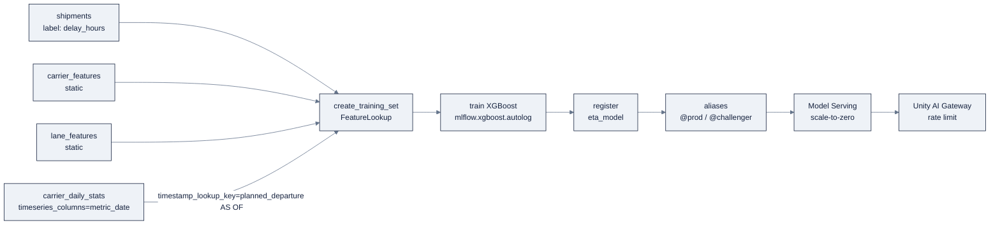

# Week 23, Databricks ML & GenAI: Training, Serving, Genie

> Part of AI Engineering Lab · Week 23 of 24 · Section: Databricks Zero to Hero · Category: ML & GenAI
> 🎯 Use case: A point-in-time ETA model + RAG over shipping docs + a Genie space for ops analysts.

## The problem

ZoroLogistics now has a governed, validated lakehouse, but data that no one *acts*
on is just storage. Three questions keep recurring in the ops room, and each is an
ML/GenAI problem: **"When will this shipment actually arrive?"** (a regression),
**"What is our policy on a 48-hour-late refund?"** (retrieval over documents), and
**"Which lane is killing our on-time rate this month?"** (self-service analytics).
Today the ops team answers all three by hand, a spreadsheet for ETA, a PDF search
for policy, and an analyst ticket for the KPI.

Two failure modes make the naive version of this week dangerous. **First, leakage.**
If you compute a carrier's on-time rate over its *full* history and feed it to an ETA
model, the model "predicts" using data from after the shipment departed. In training
it looks brilliant; in production it cannot see the future, so it silently
underperforms, the exact time-aware-split sin Week 3 warned about, now scaled to a
feature store. **Second, ungrounded answers.** An LLM that answers policy questions
from its own weights will invent a refund rate, and a hallucinated tariff is a
liability, not a convenience. The answer must come from *retrieved, cited* passages.

The before/after: before, "carrier reliability" is a spreadsheet column that leaks
the future into training; after, it is a **time-series feature table** joined
**AS OF** each shipment's departure, and the model's improvement over a leaking
baseline is a *measured number*. Before, a policy answer is a guess; after, it is a
retrieval with a **groundedness score** and its source documents. That is the whole
week: governed models that don't leak, and governed answers that don't hallucinate.

## Objectives

- [ ] By Friday you can log an XGBoost ETA run with MLflow autologging, register the model to Unity Catalog, and promote it with a movable **alias** (`@prod`) instead of a fixed stage.
- [ ] By Friday you can build UC **feature tables** (carrier reliability + lane stats), assemble a training set with `FeatureLookup`, and run a **point-in-time join** via a time-series feature table so training features never leak the future.
- [ ] By Friday you can embed policy docs, create an **AI Search** (Vector Search) Delta Sync index, run similarity + hybrid search, and build a RAG answer with `ai_query` plus a groundedness number.
- [ ] By Friday you can use SQL **AI functions** (`ai_classify`, `ai_extract`, `ai_mask`, `ai_query`) and list the steps to stand up a **Genie Agents** space with verified answers.

## Day-by-day plan

| Day | Study | Run | Ship | Time |
|---|---|---|---|---|
| **Mon** | MLflow tracking + Models in UC + aliases ([`07-mlflow-experiments.md`](../../reference/platforms/databricks/07-mlflow-experiments.md)); feature tables + PIT joins ([`08-feature-engineering.md`](../../reference/platforms/databricks/08-feature-engineering.md)) | `01-mlflow-feature-engineering-training.ipynb`: feature tables + `FeatureLookup` + `create_training_set` | A point-in-time training set (proof: `timestamp_lookup_key`) | ~3 h |
| **Tue** | Training + registration ([`09-model-training.md`](../../reference/platforms/databricks/09-model-training.md)) | Train champion XGBoost, challenger (static-only), register both, set `@prod`/`@challenger` | Two registered model versions with a MAE comparison | ~2.5 h |
| **Wed** | Serving + Unity AI Gateway ([`10-model-serving.md`](../../reference/platforms/databricks/10-model-serving.md)) | Create a scale-to-zero endpoint; attach a gateway rate limit; call from Python | An endpoint that 429s when the limit trips | ~2.5 h |
| **Thu** | AI Search + RAG ([`11-vector-search-rag.md`](../../reference/platforms/databricks/11-vector-search-rag.md)); AI functions ([`12-ai-functions-genie.md`](../../reference/platforms/databricks/12-ai-functions-genie.md)) | `02-vector-search-rag.ipynb` + `03-ai-functions-and-genie.ipynb` | A cited RAG answer + groundedness score; AI-function SQL cells | ~3 h |
| **Fri** | Use case day | Stand up the Genie space; verify its SQL | The Week 23 gate (below) | ~2 h |

## Concepts (study first: Mon/Tue)

Fact base: [`reference/knowledge-base/research/06-databricks-deep-dive.md`](../../reference/knowledge-base/research/06-databricks-deep-dive.md) (§6, §7). Deep-dives: [`07-mlflow-experiments.md`](../../reference/platforms/databricks/07-mlflow-experiments.md), [`08-feature-engineering.md`](../../reference/platforms/databricks/08-feature-engineering.md), [`09-model-training.md`](../../reference/platforms/databricks/09-model-training.md), [`10-model-serving.md`](../../reference/platforms/databricks/10-model-serving.md), [`11-vector-search-rag.md`](../../reference/platforms/databricks/11-vector-search-rag.md), [`12-ai-functions-genie.md`](../../reference/platforms/databricks/12-ai-functions-genie.md).

### Everything is a governed UC object, and the lifecycle is aliases

The ML stack collapses to one sentence: **experiments → runs → models, all governed
by Unity Catalog, promoted by aliases, not stages.** MLflow tracks an
**experiment** (a container) → **runs** (one execution, with params/metrics/
artifacts) → **models** (the trained artifact + environment). Logging is either
**autologging** (`mlflow.xgboost.autolog()`, one line capturing params/metrics/model)
or the explicit API (`log_param`/`log_metric`/`log_model`). MLflow 3 makes
**`databricks-uc` the default registry**, so "Model Registry" is now **Models in
Unity Catalog**, addressed as `<catalog>.<schema>.<model>`.

The old "Staging/Production" stages are **deprecated** in favor of **movable
aliases**, `models:/<catalog>.<schema>.<model>@<alias>`. Promote by *re-pointing an
alias*, not mutating a stage:

| Alias | Meaning |
|---|---|
| `@prod` | What is live in production |
| `Champion` / `Challenger` | A/B: current best vs. candidate, promote Challenger → Champion when it wins |

**Worked example: champion vs. challenger.** The notebook trains two XGBoost
regressors on the same label (`delay_hours`): a **champion** with point-in-time
features and a **challenger** on static features only (dropping the `daily_*`
columns). Both register to `zrl_.zorologistics.eta_model`; then aliases are set by
test MAE:

```python
client = MlflowClient()
name = "zrl_.zorologistics.eta_model"
best  = champion_version  if mae < mae2 else challenger_version
other = challenger_version if mae < mae2 else champion_version
client.set_registered_model_alias(name, "@prod", best)
client.set_registered_model_alias(name, "@challenger", other)
```

The **final cell prints the measured value of the PIT feature**: `point-in-time gain
= challenger_MAE − champion_MAE` (in hours). That single number is the anti-leakage
payoff made concrete, a positive gain means the time-series feature earned its keep.

### Feature engineering exists to kill leakage and skew

A **feature table** is a Delta table in UC with a **primary key**; it carries the
same governance and lineage as any table. `FeatureEngineeringClient` +
**`FeatureLookup`** + `create_training_set()` join features to a label DataFrame,
`fe.log_model()` packages the lookup with the model, and `fe.score_batch()` applies
the *same* lookups at batch inference, eliminating training/serving skew by
construction. The star of the week is the **point-in-time join**: a **time-series
feature table** declares its timestamp column (`timeseries_columns`), and
`timestamp_lookup_key` makes every lookup an **AS OF** join at the label timestamp.

**Worked example: the as-of join.** A shipment departed **Aug 1** and was delivered
Aug 5, so its label is known Aug 5. If you join *today's* `lane_transit` average
(say Aug 20's), you leak the future: the model sees August's average to predict an
August shipment. With `timestamp_lookup_key="planned_departure"`, the join uses the
latest feature value **on or before Aug 1**, exactly what production would have
had. In the notebook, `carrier_daily_stats` declares `timeseries_columns=["metric_date"]`
and the lookup pins `timestamp_lookup_key="planned_departure"`; the `exclude_columns`
drops `shipment_id` and the timestamp key from the feature matrix. Without the PIT
join, "carrier on-time rate" computed over full history silently inflates training
accuracy.



### Serving + the Unity AI Gateway

**Model Serving** turns a registered model or a hosted foundation model into a
serverless, auto-scaling REST API. Three things you can serve: **custom models**
(MLflow PyFunc, including agents), **Databricks-hosted foundation models**
(pay-per-token or provisioned throughput), and **external models** (OpenAI,
Anthropic, Bedrock…) behind centralized credentials. `scale_to_zero_enabled: true`
costs nothing while idle, the right default for an ETA endpoint queried a few
thousand times a day. The **Unity AI Gateway** (formerly AI Gateway) is the control
plane: it governs **assets** (models, MCP servers), **traffic** (rate limits,
budgets), and **behavior** (service policies `ALLOW`/`DENY`/`ASK`, with fail-closed
guardrails like `block_hallucination`). A rate limit of 1,000 calls/minute/user
returns HTTP **429 `RATE_LIMIT_EXCEEDED`** when tripped, add client backoff.

### AI Search + RAG + AI functions

**AI Search** (formerly Vector Search) manages retrieval in UC: an **index** is
created from a Delta table (**Delta Sync** auto-syncs it), and search is **ANN**
(HNSW, vector), **BM25** (keyword), or **hybrid** (Reciprocal Rank Fusion):

| Index type | Embeddings | Sync | Best for |
|---|---|---|---|
| Delta Sync (managed) | Databricks computes from a text column | Auto | Easiest; the policy-docs use case |
| Delta Sync (self-managed) | You compute + store an `ARRAY<FLOAT>` | Auto | Custom/chunked embeddings |
| Direct upload | You provide | Manual CRUD | Real-time, non-Delta sources |

**AI functions** put an LLM *inside SQL*, `ai_classify` (label text), `ai_extract`
(structured fields by schema), `ai_mask` (redact PII entity types), `ai_query` (any
prompt), `ai_analyze_sentiment`, and more. They require **serverless compute and DBR
18.2+**, and the cost rule is **materialize once**: every call is a billed inference,
so persist the result to a Delta table and never re-invoke it in a downstream scan.
`ai_mask` (a content rewrite) is *not* a Unity Catalog column mask (a query-time
governance policy), the two are different tools for different jobs.

**Worked example: the grounded RAG answer.** The policy corpus (`POL-001`…`POL-004`)
is embedded with a foundation-model endpoint (`databricks-gte-large-en`), indexed via
`create_delta_sync_index`, then queried. For "How do I file a damage claim for a late
shipment?", hybrid search retrieves `POL-002`, and `ai_query` generates an answer
restricted to the retrieved context:

```python
context = "\n\n".join([f"[{r[0]}] {r[2]}" for r in retrieved])
prompt = ("Answer ONLY from the context below and cite the document ids.\n\n"
          "Context:\n" + context + "\n\nQuestion: " + query)
answer = aiq(prompt)   # ai_query against databricks-meta-llama-3-3-70b-instruct
```

The notebook then computes a **groundedness** proxy, the fraction of the answer's
tokens that also appear in the retrieved context. A high score (≈0.7+ on this corpus)
means the answer is built from retrieved text, not the model's prior. (Production
uses an LLM judge with a rubric; this token-overlap number is the cheap first check.)

### Genie Agents: governed self-service

**Genie Agents** (formerly Genie Spaces) turn a curated set of tables into a
natural-language Q&A space. The setup discipline is the **verified answers**: pick
datasets (`gold_on_time_kpis`, `silver_shipments`, `carriers`, `lanes`), write
plain-English instructions ("on-time means `is_on_time = TRUE`"), seed example SQL,
and **mark generated SQL as verified only after you confirm it returns the gold
numbers**. Genie runs as the *viewer* and cannot exceed the caller's grants, a
masked email stays masked in a Genie answer. The rule of thumb: **AI function** for
batch column transforms, **serving endpoint** for real-time calls, **Genie** for ad-hoc
business questions.

### How it breaks

- **PIT leakage, quantified.** Drop the time-series lookup and the challenger's test
  MAE *improves or stays equal* in a way that never holds in production, the model
  memorized future carrier stats. The fix is structural (`timeseries_columns` +
  `timestamp_lookup_key`), and the notebook's `point-in-time gain` cell measures it.
- **A hallucinated policy answer ships.** Without retrieval (or with a weak
  groundedness gate), the LLM invents a refund clause. The gateway's
  `block_hallucination` (fail-closed) plus a citations-required prompt is the guard.
- **`ai_classify` re-invoked per query.** An AI function in a *view* scanned on every
  read bills tokens on every scan. Materialize once into a Delta table.
- **A fixed stage instead of an alias.** "Promote to Production" mutates a stage and
  loses the A/B pair; aliases let you hold Champion *and* Challenger and re-point one
  pointer to roll back.
- **Wrong `served_model_name` in a route.** The route value is `"eta_model-2"`, not
  the catalog path; get it wrong and traffic silently points nowhere.

## Notebook walkthrough

**`01-mlflow-feature-engineering-training.ipynb`**: the PIT ETA model. Cell 1
imports `FeatureEngineeringClient`, `FeatureLookup`, MLflow, and XGBoost. Cell 3
loads the CSVs and samples 20% for a fast, seeded run (the label is `delay_hours`,
the timestamp key `planned_departure`). Cell 5 creates two **static** feature tables
(`carrier_features`, `lane_features`) with primary keys. Cell 7 creates
**`carrier_daily_stats`** with `timeseries_columns=["metric_date"]`. Cell 9 is
`create_training_set` with three lookups, two keyless, one **point-in-time**, and
`exclude_columns=["shipment_id", "planned_departure"]`. Cell 11 trains the
**champion** with `mlflow.xgboost.autolog()`, logs `test_mae`/`test_rmse`, and
registers it. Cell 13 trains the **challenger** after dropping `daily_*` columns.
Cell 15 sets `@prod`/`@challenger`. The **final cell prints** champion MAE,
challenger MAE, `point-in-time gain (hours)`, and the champion feature count.
Correct output: both MAEs are small (a few hours, since delay is roughly 0 to 20 h at
this grain), and `point-in-time gain` is a small positive number, the challenger is
usually slightly worse because it lacks the AS-OF signal.

**`02-vector-search-rag.ipynb`**: RAG over policy docs. Cell 1 writes the four
policy docs as a `policy_docs` Delta table. Cell 3 embeds them via
`mlflow.deployments` against `databricks-gte-large-en` and stores the vectors in an
`embedding` column. Cell 5 creates the **Delta Sync index**
(`create_delta_sync_index`, `pipeline_type="TRIGGERED"`,
`embedding_vector_column="embedding"`). Cell 7 runs **similarity search** on the
query vector; cell 9 runs **hybrid search** (`query_type="HYBRID"` with both
`query_text` and `query_vector`). Cell 11 builds the `ai_query` answer from the
retrieved context; cell 13 computes the **groundedness** token-overlap score. The
**final cell prints** `retrieved docs` and `groundedness score`. "Correct" means the
top hit for a claim question is `POL-002`, and groundedness is high (the answer is
built from retrieved text, not the model's prior).

**`03-ai-functions-and-genie.ipynb`**: AI in SQL. Cell 1 loads `support_tickets`.
Cell 3 runs `ai_classify` (route a ticket to `damage/refund/tracking/billing/customs/
documents`); cell 5 `ai_analyze_sentiment`; cell 7 stages two BoL samples and cell 8
extracts them with `ai_extract` (a schema you define); cell 10 `ai_mask` redacts
`person_name`/`email`; cell 12 `ai_query` summarizes the refund policy. Cell 14 is
the **Genie Agents checklist** (create space → instructions → SQL functions → example
questions → verified answers → publish). The **final cell prints** `support tickets`
and the `high/critical fraction`. Correct output: a ticket count matching your CSV
(2,000 from the generator) and a high/critical fraction near 0.25 (the `p=[0.4,
0.35, 0.2, 0.05]` priority weights).

## The use case (Friday)

**Deliverable:** a registered ETA model (with point-in-time features) promoted to
`@prod` and a challenger to `@challenger`, a working Vector Search RAG over policy
docs with a groundedness number, and a documented Genie Agents setup for ops
analysts.

**Zorost gate:** a stranger can open the experiment, read the test MAE/RMSE, see
which version `@prod` points to and why (champion vs. challenger), re-run the RAG
query and reproduce your groundedness score, and follow your Genie checklist to
configure the space. You can show the point-in-time training-set schema (proof the
time-series feature joined *AS OF*), the model aliases, and one retrieval with its
source docs.

**Stretch variant:** in notebook 01, train a variant that *drops* the time-series
lookup entirely (static features only) and quantify how much test MAE degrades, the
measured value of the point-in-time feature, stated as a number.

## Common pitfalls

| Pitfall | Why it happens | Fix |
|---|---|---|
| Leaky "carrier on-time rate" | Averaging over full history | Time-series feature table + `timestamp_lookup_key` |
| Training/serving skew | Features computed differently at each stage | `fe.log_model` + `fe.score_batch` (same lookups) |
| Stages instead of aliases | Old Registry habits | `@prod` + Champion/Challenger, re-point to promote |
| AI function in a live view | Re-invokes the LLM on every scan | Materialize once into a Delta table |
| Hallucinated policy answer | No retrieval or no groundedness gate | Citations-required prompt + `block_hallucination` |
| `ai_mask` vs. column mask confusion | Same word, different mechanism | `ai_mask` rewrites text once; a column mask governs at query time |
| Wrong served-model route name | Route expects `"<model>-<version>"`, not the catalog path | Use `eta_model-2`, not `zrl_.zorologistics.eta_model` |
| `NaN` weights flowing into training | Planted nulls from Week 1/2 | Clean/impute in silver *before* feature tables |

## Glossary

- **Experiment / Run / Model**: MLflow's hierarchy: a container, one execution, and the trained artifact.
- **Autologging**: one-line capture of params/metrics/model for a framework (`mlflow.xgboost.autolog()`).
- **Models in Unity Catalog**: the registry at `<catalog>.<schema>.<model>` (formerly Model Registry).
- **Alias**: a movable named reference (`@prod`, Champion/Challenger) that replaced deprecated stages.
- **Feature table**: a Delta table in UC with a primary key, used as an ML feature source.
- **Point-in-time join**: an AS OF join at the label timestamp, preventing future leakage.
- **`FeatureLookup`**: a declared feature join (table + lookup key + optional timestamp key).
- **AI Search**: managed vector retrieval (formerly Vector Search); HNSW/BM25/hybrid.
- **Delta Sync index**: an AI Search index that auto-syncs from a Delta table.
- **AI function**: a built-in SQL/PySpark function applying an LLM in place (serverless + DBR 18.2+).
- **Unity AI Gateway**: the governance control plane for LLM/agent/MCP traffic (rate limits, guardrails).
- **Genie Agents**: analyst-configured natural-language-to-SQL Q&A (formerly Genie Spaces).

## Self-check (quiz)

Take [`quiz.md`](quiz.md), 10 questions, **8/10 to pass**, mixing multiple-choice
and short-answer tied to the Concepts sections and notebook cells.

## Exercises

Four graded exercises are in [`exercises.md`](exercises.md) with hints, the
portfolio item advances the **ZoroLogistics point-in-time ETA model** milestone by
serving the `@prod` model and recording latency + a prediction.

## Sources

- MLflow: https://docs.databricks.com/mlflow/
- Manage model lifecycle & aliases: https://docs.databricks.com/machine-learning/manage-model-lifecycle/
- Feature Store: https://docs.databricks.com/machine-learning/feature-store/
- Train with feature tables: https://docs.databricks.com/machine-learning/feature-store/train-models-with-feature-store
- Time-series / point-in-time: https://docs.databricks.com/machine-learning/feature-store/time-series
- Model Serving: https://docs.databricks.com/machine-learning/model-serving/
- Unity AI Gateway: https://docs.databricks.com/ai-gateway/
- AI Search (Vector Search): https://docs.databricks.com/ai-search/ai-search/
- AI functions: https://docs.databricks.com/large-language-models/ai-functions
- Genie Agents: https://docs.databricks.com/genie-agents/
