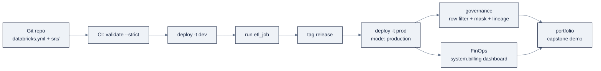

# Week 24: Databricks Production: DABs、GovernanceとCapstone

> **日本語版** · [英語版](README.md) · [演習](exercises.ja.md) · [クイズ](quiz.ja.md)
> AI Engineering Labの一部 · Week 24 of 24 · Section: Databricks Zero to Hero · Category: Production & Capstone
> · Notebooks: [01-governance-and-finopps.ipynb](notebooks/01-governance-and-finopps.ipynb)
> 🎯 **Use case:** Capstone。ZoroLogistics Lakehouse Intelligenceを、governanceとFinOps付きでcode（DABs）としてshipする。

## 問題

Weeks 21〜23は本物のassetsを生み出しました。medallion lakehouse、streaming pipeline、point-in-time ETA model、RAG assistant。しかし、それらはworkspaceで手作業でbuildされました。それは古典的な「works on my workspace」trapです。clickで設定されたpipelineは別のworkspaceで再作成できず、きめ細かい制御なしにshareされたtableは顧客のPIIを誤ったgroupにleakさせ、誰も読んでいないbillは、free trialが驚きのinvoiceになる経路です。productionは追加するfeatureではなく、disciplineです: **すべてをcodeとして、すべてをgovernedに、すべてにcostを。**

三つの失敗modeが最終週を強制します。**第一に、drift。** deployment pathが「誰かがUIでclickする」なら、devとprodは分岐し、*job定義* は変更されたcodeとともにversion化されることがありません。**第二に、過剰な公開。** Unity Catalogのgrantはadditiveなので、「ほんのdemoのために」shareされたtableは誰からでも読めるまま黙って残ります。**row filter、column mask、dynamic view** がなければ、support担当とdata engineerが同じ顧客dataを見ることになります。**第三に、見えないspend。** DBUは秒単位で課金されるcomputeの単位で、scheduled job clusterとidleなall-purpose clusterの差は一桁違いです。誰かが `system.billing.usage` をqueryしない限り見えません。

before/afterはこうです。beforeでは「ship it」はpipelineをclickし直して祈ることです。afterでは `databricks bundle deploy -t prod` が `databricks.yml` からstack全体をrebuildし、非特権userはmaskされたPIIを *証明つきで* 見て、cost dashboardはdocument化された一つの改善のdollar差分を示します。今週は卒業です。Week 13で鍛えた「codeとしてshipする」筋肉を、Databricks stack全体に適用します。

## 目標

- [ ] 金曜日までに、**row filter**、**column mask**、**dynamic view** を適用して、異なるgroupが同じtableの異なるsliceを見るようにし、その効果をverifyできる。
- [ ] 金曜日までに、**audit**（`system.access.audit`）と **lineage**（`system.access.table_lineage` / `column_lineage`）のqueryを書き、誰が何に触れたか、どのtableがgoldを支えるかを証明できる。
- [ ] 金曜日までに、**FinOps** data（`system.billing.usage`）をcost-by-day tableにqueryし、具体的なcost metricをprintできる。
- [ ] 金曜日までに、Weeks 21〜23のassetsをCI/CD付きの **Declarative Automation Bundles (DABs)** projectにbundleする方法を説明し、**capstone** のoutlineを書ける（[`reference/platforms/databricks/capstone/`](../../reference/platforms/databricks/capstone/) を参照）。

## 日ごとの計画

| Day | Study | Run | Ship | Time |
|---|---|---|---|---|
| **Mon** | DABsの構造 + CLI lifecycle（[`15-dabs-ci-cd.md`](../../reference/platforms/databricks/15-dabs-ci-cd.md)） | bundleをscaffoldする。`bundle validate --strict`。`deploy -t dev` | validでdeploy可能な `databricks.yml` | 約3時間 |
| **Tue** | CI/CD + auth（M2M/OIDC）（[`15-dabs-ci-cd.md`](../../reference/platforms/databricks/15-dabs-ci-cd.md) §5〜6） | validate + deployするGitHub Actions workflowを組む | 保存されたsecretのないCI job | 約2.5時間 |
| **Wed** | fine-grained governance（[`16-governance-security.md`](../../reference/platforms/databricks/16-governance-security.md)） | `01-governance-and-finopps.ipynb`: row filter + column mask + dynamic view + audit + lineage | 各controlのbefore/afterの証拠 | 約3時間 |
| **Thu** | FinOps（[`17-finopps-cost.md`](../../reference/platforms/databricks/17-finopps-cost.md)） | Billing query → cost-by-day。cost改善を一つ見つける | cost metric + document化されたDBU/dollar差分 | 約2.5時間 |
| **Fri** | Capstone + graduation（[`18-certification-path.md`](../../reference/platforms/databricks/18-certification-path.md)、capstone） | Weeks 21〜23の全assetをbundle resourceにmapする。end-to-endでdemoする | capstone gate（下記）+ portfolio | 約3時間 |

## 概念（まず読むのはMon/Tue）

Fact base: [`reference/knowledge-base/research/06-databricks-deep-dive.md`](../../reference/knowledge-base/research/06-databricks-deep-dive.md)（§8、§10）。Deep-dive: [`13-agents.md`](../../reference/platforms/databricks/13-agents.md)、[`14-apps-dashboards.md`](../../reference/platforms/databricks/14-apps-dashboards.md)、[`15-dabs-ci-cd.md`](../../reference/platforms/databricks/15-dabs-ci-cd.md)、[`16-governance-security.md`](../../reference/platforms/databricks/16-governance-security.md)、[`17-finopps-cost.md`](../../reference/platforms/databricks/17-finopps-cost.md)、[`18-certification-path.md`](../../reference/platforms/databricks/18-certification-path.md)、そして[capstone](../../reference/platforms/databricks/capstone/)。

### Governanceはgrantの上に乗るfine-grained access

UCのprivilege modelは **additive-only、`DENY` は存在しません**。principalには **traversal**（`USE CATALOG`/`USE SCHEMA`）*plus* **action**（`SELECT`、`MODIFY`、`READ VOLUME`、`EXECUTE`）が必要です。そのtable grantの上に、callerが *どのrow* を *どんな値* で見るかを狭める三つのfine-grained controlが乗ります:

| Mechanism | 守る対象 | Best for |
|---|---|---|
| **Row filter** | row。base tableにて（`SET ROW FILTER` によるBOOLEAN UDF） | 「userは自分のregionだけを見る」 |
| **Column mask** | columnの値。base tableにて（`ALTER COLUMN … SET MASK`） | 「権限がなければPIIをredact」 |
| **Dynamic view** | row + column。view経由（`current_user()`/`is_account_group_member()`） | read-only consumer。UDF lifecycle不要 |

**実例: PII control。** notebookはrow filterとcolumn maskの両方を `silver_shipments` にattachし、続いて `support_tickets` をdynamic viewでwrapします:

```sql
-- Row filter: carrier_ops sees everything; everyone else sees three carriers.
CREATE OR REPLACE FUNCTION zrl_.zorologistics.filter_carrier(carrier_id STRING)
RETURN IF(is_account_group_member('carrier_ops'), TRUE,
          carrier_id IN ('C001', 'C002', 'C003'));
ALTER TABLE zrl_.zorologistics.silver_shipments
  SET ROW FILTER zrl_.zorologistics.filter_carrier ON (carrier_id);

-- Column mask: finance sees value_usd; everyone else sees NULL (return type must match).
CREATE OR REPLACE FUNCTION zrl_.zorologistics.mask_value(value DOUBLE)
RETURN IF(is_account_group_member('finance'), value, NULL);
ALTER TABLE zrl_.zorologistics.silver_shipments
  ALTER COLUMN value_usd SET MASK zrl_.zorologistics.mask_value;

-- Dynamic view: full ticket text only for the support team.
CREATE OR REPLACE VIEW zrl_.zorologistics.v_customer_tickets AS
SELECT ticket_id, shipment_id, customer_id,
  CASE WHEN is_account_group_member('support_team') THEN text ELSE '*** REDACTED ***' END AS text,
  category, priority
FROM zrl_.zorologistics.support_tickets;
```

policy UDFは **table ownerの** 権限で実行され、callerに `EXECUTE` は不要です。column maskのreturn typeは **columnの型と一致しなければなりません**（`value_usd` なら `DOUBLE`）。間違えると `SET MASK` が失敗します。なお `ai_mask`（LLMによるtext書き換え）はcolumn mask（query時のgovernance policy）では *ありません*。

### System tablesがobservabilityの背骨

Unity Catalogはすべてを **system tables** に、`system` catalog内でread-onlyに記録し、約365日保持します。今週重要な三つ: `system.access.audit`（誰が何をしたか）、`system.access.table_lineage` / `column_lineage`（何が何を支えるか）、`system.billing.usage`（SKUとtag別のDBUs）。**常に `event_date` でfilterしてください。**

**実例: auditとlineage。** 「機密tableを誰が読んだか。goldを支えるのは何か」:

```sql
-- Audit: recent events, newest first.
SELECT event_time, action_name, user_identity.email, workspace_id
FROM system.access.audit
ORDER BY event_time DESC LIMIT 20;

-- Lineage: which source tables feed the gold KPI table?
SELECT source_table_full_name, target_table_full_name
FROM system.access.table_lineage
WHERE target_table_full_name LIKE '%gold_on_time_kpis';

-- Column lineage for the on_time_rate column.
SELECT source_table_full_name, source_column_name
FROM system.access.column_lineage
WHERE target_column_name = 'on_time_rate';
```

lineageはcomplianceの背骨です。gold KPIが特定のbronze sourceまで遡ることをregulatorに証明します。（system schemaは有効化が必要で、accessはdefaultではgrantされません: `GRANT USE CATALOG ON CATALOG system`、続いて `USE SCHEMA` + `SELECT`。）

### DABsはstack全体をcodeにする

**Declarative Automation Bundles**（DABs。旧Databricks Asset Bundles）は、data + AI projectのためのinfrastructure-as-codeです。source file + resource定義（job、pipeline、dashboard、model、schema、volume、app）+ testを `databricks.yml` で宣言し、一つの単位としてdeployします。configはbundle名、**`targets`**（dev/staging/prod。`mode: development` と `mode: production`）、**`variables`**（targetごとのcatalog/schema/warehouse）、**`resources`** を宣言します。CLI lifecycle:

```bash
databricks bundle init                              # scaffold
databricks bundle validate --strict -t dev          # config is sound (warnings = errors)
databricks bundle deploy -t dev --auto-approve      # create/update resources
databricks bundle run etl_job -t dev                # run a resource
databricks bundle destroy -t dev                    # destructive cleanup
```

**実例: capstone bundle。** starterの [`capstone/databricks.yml`](../../reference/platforms/databricks/capstone/databricks.yml) は、variableとtarget付きのpipeline + jobを宣言します:

```yaml
variables:
  catalog: { default: zrl_ }
  schema:  { default: zorologistics }
targets:
  dev:
    mode: development
    workspace: { profile: zrl-dev }
  prod:
    mode: production
    workspace: { profile: zrl-prod }
resources:
  pipelines:
    medallion:
      name: 'ZoroLogistics Medallion'
      catalog: ${var.catalog}
      target: ${var.schema}
      libraries: [{ file: { path: ./src/pipeline.sql } }]
      serverless: true
      photon: true
      continuous: false
  jobs:
    etl_job:
      name: 'ZoroLogistics Medallion ETL'
      tasks:
        - task_key: run_medallion
          pipeline_task: { pipeline_id: ${resources.pipelines.medallion.id} }
```

promote = `bundle deploy -t prod` です。variableが環境ごとのcatalog/schemaをparameterizeするので、同じbundleがdevとprodをきれいに使い分けます。CI/CDは **OAuth M2M**（service principal）か **OIDC token federation** で認証し、CI platformのidentity tokenをDatabricks OAuthと交換するので、**secretはrepoに一切置かれません**（`DATABRICKS_AUTH_TYPE=github-oidc-azure` のGitHub Actions workflow）。



### FinOpsがloopを閉じる

**DBU（Databricks Unit）** は時間あたりの処理能力の単位です。cost ≈ **(DBU rate × workload SKU) × instance数 × duration**、秒単位の細かさです。`system.billing.usage` は細粒度のDBU記録（`sku_name`、`usage_quantity`、`billing_origin_product`、`custom_tags`）を持ちます。dollarにするには `system.billing.list_prices` をjoinします。

**実例: cost-by-dayとdollar metric。** notebookはaggregateしてから見積もります:

```sql
CREATE OR REPLACE TABLE zrl_.zorologistics.cost_by_day AS
SELECT usage_date AS usage_day, sum(usage_quantity) AS total_dbu,
       count(DISTINCT workspace_id) AS workspaces
FROM system.billing.usage
GROUP BY usage_date ORDER BY usage_date;
```

```python
total_dbu = spark.sql("SELECT sum(total_dbu) FROM cost_by_day").collect()[0][0] or 0.0
est_cost  = total_dbu * 0.55   # illustrative $/DBU; join list_prices for real cost
```

Zorostのmodernization consultantが毎週下すFinOps判断: **serverlessはpremium DBU rateだが、TCOではしばしば勝つ**。idleと過剰provisioningを消せるからです。nightly runの間に約22 h/day idleするall-purpose clusterは、2 hの仕事に対して約24 hのinteractive DBUsを請求します。serverlessは高いrateで約2 hだけ請求し、idleはゼロです。trapは *rate* 同士を比較して *月次総spend* を比較しないことです。

### Agent、App、そしてcertificationの風景

[`13-agents.md`](../../reference/platforms/databricks/13-agents.md) と [`14-apps-dashboards.md`](../../reference/platforms/databricks/14-apps-dashboards.md) がGenAI surfaceを完成させます。**Agent Framework**（任意のframeworkを `ResponsesAgent` でwrapし、MCP toolをattachし、Model Servingまたは **Databricks Apps** でdeploy）と、人に向くsurfaceとしての **AI/BI dashboards + Databricks Apps** です。このmoduleはDatabricks certifications、Data Engineer Associate/Professional、ML Associate/Professional、Generative AI Engineer Associate、Data Analyst Associateにきれいにmapし、無料の **accreditation**（Databricks Fundamentals、Generative AI Fundamentals）がwarm-upになります（[`18-certification-path.md`](../../reference/platforms/databricks/18-certification-path.md)）。

### うまくいかない理由

- **間違ったreturn typeのcolumn mask。** `DOUBLE` columnに対して `STRING` を返す `mask_value` は `SET MASK` で失敗します。mask functionのsignatureはmaskされるcolumnの型と一致しなければなりません。
- **縮まない広すぎるgrant。** UCはadditive-onlyなので、「demo用に」grantされた `SELECT` は明示的に `REVOKE` するまで残ります。row filter/maskはgrantされたprincipalの見えるものを狭めますが、最もcleanな姿勢は狭いgrant *plus* fine-grained controlです。
- **`validate --strict` なしの `bundle deploy`。** configのtypo（変数置換の誤り、file pathの欠落）は、resourceを部分的に適用した後でdeployの途中に失敗します。まずvalidateする。warnings-as-errorsがdeploy前に捕まえます。
- **idleやscaleによるcost暴騰。** 放置されたall-purpose clusterや、`scale_to_zero` が無効なserving endpointは課金し続けます。clusterはauto-terminate、endpointはscale-to-zero、そして初日にbudget alertを設定する。
- **batch dataをfull tiltで回すstreaming pipeline。** 一晩一回のmedallionにContinuous modeはDBUsの無駄です。`availableNow`/scheduled triggerが適正サイズにします。

## Notebook walkthrough

**`01-governance-and-finopps.ipynb`**: 一つのnotebookでgovernance + FinOpsの一巡。Cell 1は、Weeks 21〜23が未実行でも成り立つよう、`silver_shipments` と `support_tickets` を再作成します。Cells 3〜5は **row filter**（`filter_carrier`: `carrier_ops` は全部、それ以外は `C001`/`C002`/`C003`）を適用し、**visible row count** をprintします。非`carrier_ops` userは、より少ないrowとより少ないdistinct carrierを見ます。Cells 7〜9は **column mask**（`mask_value`: `finance` は `value_usd` を、それ以外は `NULL` を見る）を適用してpreviewします。Cells 11〜13は **dynamic view** `v_customer_tickets`（fullの `text` は `support_team` のみ）を作り、redact結果をpreviewします。Cells 15〜17は **audit**（`system.access.audit`）と **lineage**（`table_lineage` + `column_lineage`、`on_time_rate` 対象）をqueryします。Cells 19〜21は `system.billing.usage` から **cost-by-day** tableをbuildして表示します。**最後のcellは三つの数字をprintします**: `total DBUs (billing)`、`estimated cost USD`、そして `audit
events`。正しい出力: fresh trialではDBU合計は `0.0` のこともあります（billing tableは時間とともに埋まる）。queryはそれでも有効な数値を返し、`audit events` は自分の操作を反映した正のcountになります。

## Use case（Friday）

**Deliverable:** governance + FinOpsのwrite-up。適用したfilter/mask/view（before/afterの証拠付き）、auditとlineageのquery結果、cost-by-day table、document化されたcost改善、そしてcapstone outline。

**Zorost gate:** 見知らぬ人があなたのgovernance notebookを実行し、各access controlの効果を見え（row filterがvisible row countを変える。maskが `value_usd` をnullにする）、audit/lineage出力を読み、`system.billing.usage` からあなたのcost metricを再現できること。capstoneについては、[`reference/platforms/databricks/capstone/`](../../reference/platforms/databricks/capstone/) にDAB deployment planを見つけ、Weeks 21〜23の全assetをbundle resource（pipeline、job、dashboard、model、FinOps view）にmapできること。

**Stretch variant:** `gold_on_time_kpis` をbronze source tableまで遡るlineage queryを書き、`on_time_rate` の **column-level** lineageを確認する。regulatorが受け入れる完全なupstream traceです。

## よくあるpitfall

| Pitfall | なぜ起きるか | Fix |
|---|---|---|
| maskのreturn type ≠ column型 | `DOUBLE` columnに `STRING` UDFで `SET MASK` | UDF signatureをcolumn型に合わせる |
| 「demo用に」grantされた `SELECT` がrevokeされない | additive-only model | 狭いgrant + row filter/mask。`SHOW GRANTS` でaudit |
| `validate --strict` なしのdeploy | config typoで部分的apply | まずvalidate。warnings-as-errors |
| idle all-purpose clusterが放置される | auto-termination忘れ | auto-terminate（10分）かserverless |
| batch dataにContinuous pipeline | triggerの誤り | `availableNow`/scheduled。continuousは本物のstreamだけに |
| 低traffic endpointで `scale_to_zero` 無効 | default provisioning | `scale_to_zero_enabled: true` |
| repoの中のsecret | 手作りのPATs | CIにはOAuth M2M / OIDC federation |
| date filterなしのbilling query | `system.billing.usage` は大きい | 常に `usage_date` でfilterする |

## Glossary

- **Row filter**: groupごとにrowを隠す、tableにattachされたboolean UDF。
- **Column mask**: 権限のないcallerに対してcolumnの値を書き換えるUDF。
- **Dynamic view**: `current_user()`/`is_account_group_member()` で自己検閲するview。
- **System table**: `system` catalog内のread-onlyな運用data（audit、lineage、billing）。
- **Lineage**: table/columnのdata flowの自動追跡（Catalog Explorer + `system.access.*`）。
- **DBU**: Databricks Unit。時間あたりの正規化された処理能力。秒単位で課金。
- **SKU tier**: workloadが分類されるbilling bucket（Jobs、All-Purpose、SQL、Serverless）。
- **DAB**: Declarative Automation Bundle。`databricks.yml` + resources + srcを一つの単位としてdeploy。
- **Target**: 独自のworkspace + variableを持つbundle環境（dev/staging/prod）。
- **`mode: production`**: workspaceをうっかりした上書きから守るbundle target mode。
- **OIDC federation**: CI platformのidentity tokenをDatabricks OAuthと交換すること（保存secretなし）。
- **Capstone**: ZoroLogistics Lakehouse Intelligence。Weeks 21〜23のstackを一つのDABとしてshipする。

## Self-check（quiz）

[`quiz.md`](quiz.md) を受けてください。10問、**8/10で合格**。Concepts sectionとnotebook cellに紐付いたmultiple choiceとshort answerの混成です。

## Exercises

四つのgraded exerciseがhint付きで [`exercises.md`](exercises.md) にあります。portfolio itemはWeeks 21〜23のassetsをtarget、governance、FinOps dashboard付きのDABにbundleして、**ZoroLogistics Lakehouse Intelligence capstone** を完成させます。

## Sources

- Row filters & column masks: https://docs.databricks.com/data-governance/unity-catalog/filters-and-masks
- Access control: https://docs.databricks.com/data-governance/unity-catalog/access-control
- Data lineage: https://docs.databricks.com/data-governance/unity-catalog/data-lineage
- System tables: https://docs.databricks.com/admin/system-tables/
- Billing system tables: https://docs.databricks.com/admin/system-tables/billing
- Bundles (DABs): https://docs.databricks.com/dev-tools/bundles/
- CI/CD: https://docs.databricks.com/dev-tools/ci-cd/
- Databricks CLI: https://docs.databricks.com/dev-tools/cli/
- Authentication (OAuth M2M / OIDC): https://docs.databricks.com/dev-tools/auth/
- Usage & cost monitoring: https://docs.databricks.com/admin/usage
- Certifications: https://www.databricks.com/learn/certification
