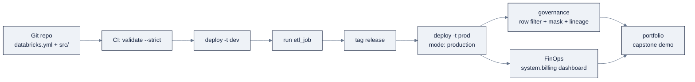

# Week 24, Databricks Production: DABs, Governance & the Capstone

> Part of AI Engineering Lab · Week 24 of 24 · Section: Databricks Zero to Hero · Category: Production & Capstone
> 🎯 Use case: Capstone, ZoroLogistics Lakehouse Intelligence, shipped as code (DABs) with governance and FinOps.

## The problem

Weeks 21 to 23 produced real assets, a medallion lakehouse, a streaming pipeline, a
point-in-time ETA model, a RAG assistant, but they were built by hand in a
workspace. That is the classic "works on my workspace" trap: a pipeline configured by
clicking cannot be re-created on another workspace, a table shared without fine
grained control leaks customer PII to the wrong group, and a bill nobody is reading
is how a free trial becomes a surprise invoice. Production is not a feature you add,
it is a discipline: **everything as code, everything governed, everything costed.**

Three failure modes force this final week. **First, drift.** When the deployment path
is "someone clicks it in the UI," dev and prod diverge, and the *job definition* is
never versioned with the code that changed. **Second, over-exposure.** Unity Catalog
grants are additive, so a table shared for "just one demo" quietly stays readable by
everyone; without **row filters, column masks, and dynamic views**, a support rep and
a data engineer see the same customer data. **Third, invisible spend.** A DBU is a
unit of compute you are billed per second, and the difference between a scheduled job
cluster and an idle all-purpose cluster is an order of magnitude, invisible unless
someone queries `system.billing.usage`.

The before/after: before, "ship it" means re-clicking the pipeline and hoping; after,
`databricks bundle deploy -t prod` rebuilds the whole stack from a `databricks.yml`,
a non-privileged user *provably* sees masked PII, and the cost dashboard shows the
dollar delta of one documented win. This week is the graduation: the same
"ship it as code" muscle from Week 13, applied to the entire Databricks stack.

## Objectives

- [ ] By Friday you can apply **row filters**, **column masks**, and a **dynamic view** so different groups see different slices of the same table, and verify the effect.
- [ ] By Friday you can write **audit** (`system.access.audit`) and **lineage** (`system.access.table_lineage` / `column_lineage`) queries to prove who touched what and which tables feed gold.
- [ ] By Friday you can query **FinOps** data (`system.billing.usage`) into a cost-by-day table and print a concrete cost metric.
- [ ] By Friday you can describe how to bundle the Weeks 21 to 23 assets into a **Declarative Automation Bundles (DABs)** project with CI/CD, and outline the **capstone** (see [`reference/platforms/databricks/capstone/`](../../reference/platforms/databricks/capstone/)).

## Day-by-day plan

| Day | Study | Run | Ship | Time |
|---|---|---|---|---|
| **Mon** | DABs anatomy + CLI lifecycle ([`15-dabs-ci-cd.md`](../../reference/platforms/databricks/15-dabs-ci-cd.md)) | Scaffold a bundle; `bundle validate --strict`; `deploy -t dev` | A valid, deployable `databricks.yml` | ~3 h |
| **Tue** | CI/CD + auth (M2M/OIDC) ([`15-dabs-ci-cd.md`](../../reference/platforms/databricks/15-dabs-ci-cd.md) §5 to 6) | Wire a GitHub Actions workflow that validates + deploys | A CI job with no stored secrets | ~2.5 h |
| **Wed** | Fine-grained governance ([`16-governance-security.md`](../../reference/platforms/databricks/16-governance-security.md)) | `01-governance-and-finopps.ipynb`: row filter + column mask + dynamic view + audit + lineage | Before/after evidence of each control | ~3 h |
| **Thu** | FinOps ([`17-finopps-cost.md`](../../reference/platforms/databricks/17-finopps-cost.md)) | Billing query → cost-by-day; find one cost win | A cost metric + a documented DBU/dollar delta | ~2.5 h |
| **Fri** | Capstone + graduation ([`18-certification-path.md`](../../reference/platforms/databricks/18-certification-path.md), capstone) | Map every Weeks 21 to 23 asset to a bundle resource; demo end-to-end | The capstone gate (below) + portfolio | ~3 h |

## Concepts (study first: Mon/Tue)

Fact base: [`reference/knowledge-base/research/06-databricks-deep-dive.md`](../../reference/knowledge-base/research/06-databricks-deep-dive.md) (§8, §10). Deep-dives: [`13-agents.md`](../../reference/platforms/databricks/13-agents.md), [`14-apps-dashboards.md`](../../reference/platforms/databricks/14-apps-dashboards.md), [`15-dabs-ci-cd.md`](../../reference/platforms/databricks/15-dabs-ci-cd.md), [`16-governance-security.md`](../../reference/platforms/databricks/16-governance-security.md), [`17-finopps-cost.md`](../../reference/platforms/databricks/17-finopps-cost.md), [`18-certification-path.md`](../../reference/platforms/databricks/18-certification-path.md), and the [capstone](../../reference/platforms/databricks/capstone/).

### Governance is fine-grained access on top of grants

UC's privilege model is **additive-only: there is no `DENY`**, and a principal needs
**traversal** (`USE CATALOG`/`USE SCHEMA`) *plus* an **action** (`SELECT`, `MODIFY`,
`READ VOLUME`, `EXECUTE`). On top of those table grants sit three fine-grained
controls that narrow *which rows* and *what values* a caller sees:

| Mechanism | Protects | Best for |
|---|---|---|
| **Row filter** | Rows, at the base table (a BOOLEAN UDF via `SET ROW FILTER`) | "Users only see their region" |
| **Column mask** | Column values, at the base table (`ALTER COLUMN … SET MASK`) | "Redact PII unless entitled" |
| **Dynamic view** | Rows + columns, via the view (`current_user()`/`is_account_group_member()`) | Read-only consumers, no UDF lifecycle |

**Worked example: the PII controls.** The notebook attaches both a row filter and a
column mask to `silver_shipments`, then wraps `support_tickets` in a dynamic view:

```sql
-- Row filter: carrier_ops sees everything; everyone else sees three carriers.
CREATE OR REPLACE FUNCTION zrl_.zorologistics.filter_carrier(carrier_id STRING)
RETURN IF(is_account_group_member('carrier_ops'), TRUE,
          carrier_id IN ('C001', 'C002', 'C003'));
ALTER TABLE zrl_.zorologistics.silver_shipments
  SET ROW FILTER zrl_.zorologistics.filter_carrier ON (carrier_id);

-- Column mask: finance sees value_usd; everyone else sees NULL (return type must match).
CREATE OR REPLACE FUNCTION zrl_.zorologistics.mask_value(value DOUBLE)
RETURN IF(is_account_group_member('finance'), value, NULL);
ALTER TABLE zrl_.zorologistics.silver_shipments
  ALTER COLUMN value_usd SET MASK zrl_.zorologistics.mask_value;

-- Dynamic view: full ticket text only for the support team.
CREATE OR REPLACE VIEW zrl_.zorologistics.v_customer_tickets AS
SELECT ticket_id, shipment_id, customer_id,
  CASE WHEN is_account_group_member('support_team') THEN text ELSE '*** REDACTED ***' END AS text,
  category, priority
FROM zrl_.zorologistics.support_tickets;
```

The policy UDF runs with the **table owner's** authority; callers do not need
`EXECUTE`. The column mask's return type **must match the column type** (`DOUBLE` for
`value_usd`), get it wrong and the `SET MASK` fails. Note `ai_mask` (an LLM text
rewrite) is *not* a column mask (a query-time governance policy).

### System tables are the observability backbone

Unity Catalog records everything in **system tables**, read-only, in the `system`
catalog, retaining ~365 days. The three that matter this week: `system.access.audit`
(who did what), `system.access.table_lineage` / `column_lineage` (what feeds what),
and `system.billing.usage` (DBUs by SKU and tag). **Always filter `event_date`.**

**Worked example: audit and lineage.** "Who read the sensitive table, and what feeds
gold?":

```sql
-- Audit: recent events, newest first.
SELECT event_time, action_name, user_identity.email, workspace_id
FROM system.access.audit
ORDER BY event_time DESC LIMIT 20;

-- Lineage: which source tables feed the gold KPI table?
SELECT source_table_full_name, target_table_full_name
FROM system.access.table_lineage
WHERE target_table_full_name LIKE '%gold_on_time_kpis';

-- Column lineage for the on_time_rate column.
SELECT source_table_full_name, source_column_name
FROM system.access.column_lineage
WHERE target_column_name = 'on_time_rate';
```

Lineage is the compliance backbone, prove to a regulator that a gold KPI traces to a
specific bronze source. (System schemas must be enabled, and access is not granted by
default: `GRANT USE CATALOG ON CATALOG system`, then `USE SCHEMA` + `SELECT`.)

### DABs make the whole stack code

**Declarative Automation Bundles** (DABs; formerly Databricks Asset Bundles) are
infrastructure-as-code for data + AI projects: source files + resource definitions
(jobs, pipelines, dashboards, models, schemas, volumes, apps) + tests, declared in
`databricks.yml` and deployed as a unit. The config declares the bundle name,
**`targets`** (dev/staging/prod, with `mode: development` vs `mode: production`),
**`variables`** (catalog/schema/warehouse per target), and **`resources`**. The CLI
lifecycle:

```bash
databricks bundle init                              # scaffold
databricks bundle validate --strict -t dev          # config is sound (warnings = errors)
databricks bundle deploy -t dev --auto-approve      # create/update resources
databricks bundle run etl_job -t dev                # run a resource
databricks bundle destroy -t dev                    # destructive cleanup
```

**Worked example: the capstone bundle.** The starter [`capstone/databricks.yml`](../../reference/platforms/databricks/capstone/databricks.yml)
declares a pipeline + job with variables and targets:

```yaml
variables:
  catalog: { default: zrl_ }
  schema:  { default: zorologistics }
targets:
  dev:
    mode: development
    workspace: { profile: zrl-dev }
  prod:
    mode: production
    workspace: { profile: zrl-prod }
resources:
  pipelines:
    medallion:
      name: 'ZoroLogistics Medallion'
      catalog: ${var.catalog}
      target: ${var.schema}
      libraries: [{ file: { path: ./src/pipeline.sql } }]
      serverless: true
      photon: true
      continuous: false
  jobs:
    etl_job:
      name: 'ZoroLogistics Medallion ETL'
      tasks:
        - task_key: run_medallion
          pipeline_task: { pipeline_id: ${resources.pipelines.medallion.id} }
```

Promotion = `bundle deploy -t prod`; variables parameterize catalog/schema per
environment so the same bundle targets dev vs. prod cleanly. CI/CD authenticates with
**OAuth M2M** (service principal) or **OIDC token federation**, exchanging the CI
platform's identity token for Databricks OAuth so **no secret ever sits in the repo**
(a GitHub Actions workflow with `DATABRICKS_AUTH_TYPE=github-oidc-azure`).



### FinOps closes the loop

A **DBU (Databricks Unit)** is a unit of processing capability per hour; cost ≈
**(DBU rate × workload SKU) × instances × duration**, at per-second granularity.
`system.billing.usage` holds granular DBU records (`sku_name`, `usage_quantity`,
`billing_origin_product`, `custom_tags`); join `system.billing.list_prices` for
dollars.

**Worked example: cost-by-day and a dollar metric.** The notebook aggregates then
estimates:

```sql
CREATE OR REPLACE TABLE zrl_.zorologistics.cost_by_day AS
SELECT usage_date AS usage_day, sum(usage_quantity) AS total_dbu,
       count(DISTINCT workspace_id) AS workspaces
FROM system.billing.usage
GROUP BY usage_date ORDER BY usage_date;
```

```python
total_dbu = spark.sql("SELECT sum(total_dbu) FROM cost_by_day").collect()[0][0] or 0.0
est_cost  = total_dbu * 0.55   # illustrative $/DBU; join list_prices for real cost
```

The FinOps judgment call a Zorost modernization consultant makes weekly: **serverless
charges a premium DBU rate but often wins on TCO** because it eliminates idle and
over-provisioning. An all-purpose cluster idling ~22 h/day between nightly runs bills
~24 h of interactive DBUs for 2 h of work; serverless bills ~2 h at a higher rate with
no idle. The trap is comparing *rates* instead of *total monthly spend*.

### Agents, Apps, and the certification landscape

[`13-agents.md`](../../reference/platforms/databricks/13-agents.md) and [`14-apps-dashboards.md`](../../reference/platforms/databricks/14-apps-dashboards.md)
round out the GenAI surface: the **Agent Framework** (wrap any framework in
`ResponsesAgent`, attach MCP tools, deploy via Model Serving or **Databricks Apps**)
and **AI/BI dashboards + Databricks Apps** as the human-facing surface. The module
maps cleanly to Databricks certifications, Data Engineer Associate/Professional, ML
Associate/Professional, Generative AI Engineer Associate, and Data Analyst Associate,
with free **accreditations** (Databricks Fundamentals, Generative AI Fundamentals) as
the warm-up ([`18-certification-path.md`](../../reference/platforms/databricks/18-certification-path.md)).

### How it breaks

- **A column mask with the wrong return type.** `mask_value` returning `STRING` on a
  `DOUBLE` column fails at `SET MASK`. The mask function's signature must match the
  masked column's type.
- **Over-broad grants that never shrink.** Because UC is additive-only, a `SELECT`
  granted "for a demo" persists until explicitly `REVOKE`d. Row filters/masks narrow
  what a granted principal sees, but the cleanest posture is narrow grants *plus*
  fine-grained controls.
- **`bundle deploy` without `validate --strict`.** A config typo (a bad variable
  substitution, a missing file path) fails mid-deploy after partially applying
  resources. Validate first; warnings-as-errors catches it before deploy.
- **Cost blowups from idle or scale.** An all-purpose cluster left running, or a
  serving endpoint with `scale_to_zero` disabled, bills continuously. Auto-terminate
  clusters, scale-to-zero endpoints, and set a budget alert on day one.
- **A streaming pipeline at full tilt for batch data.** Continuous mode for a
  once-nightly medallion wastes DBUs; `availableNow`/scheduled triggers right-size it.

## Notebook walkthrough

**`01-governance-and-finopps.ipynb`**: one notebook, the whole governance + FinOps
pass. Cell 1 recreates `silver_shipments` and `support_tickets` if Weeks 21 to 23 did not
run, so the notebook is self-contained. Cells 3 to 5 apply the **row filter**
(`filter_carrier`: `carrier_ops` sees all, everyone else sees `C001`/`C002`/`C003`)
and print the **visible row count**, a non-`carrier_ops` user sees fewer rows and
fewer distinct carriers. Cells 7 to 9 apply the **column mask** (`mask_value`: `finance`
sees `value_usd`, others see `NULL`) and preview it. Cells 11 to 13 create the
**dynamic view** `v_customer_tickets` (full `text` only for `support_team`) and
preview the redacted result. Cells 15 to 17 query **audit** (`system.access.audit`) and
**lineage** (`table_lineage` + `column_lineage` for `on_time_rate`). Cells 19 to 21
build the **cost-by-day** table from `system.billing.usage` and show it. The **final
cell prints three numbers**: `total DBUs (billing)`, `estimated cost USD`, and `audit
events`. Correct output: on a fresh trial the DBU total may be `0.0` (the billing
table fills over time), the query still returns a valid number, and `audit events`
is a positive count reflecting your own actions.

## The use case (Friday)

**Deliverable:** a governance + FinOps write-up, the filters/masks/view you applied
(with before/after evidence), an audit and lineage query result, a cost-by-day table,
and a documented cost win, plus the capstone outline.

**Zorost gate:** a stranger can run your governance notebook, see each access control
in effect (a row filter changes the visible row count; a mask nulls `value_usd`), read
the audit/lineage output, and reproduce your cost metric from `system.billing.usage`.
For the capstone, they can find the DAB deployment plan in
[`reference/platforms/databricks/capstone/`](../../reference/platforms/databricks/capstone/) and map every
Weeks 21 to 23 asset to a bundle resource, pipeline, job, dashboard, model, and FinOps
view.

**Stretch variant:** write the lineage query that traces `gold_on_time_kpis` all the
way back to its bronze source tables, and confirm the **column-level** lineage for
`on_time_rate`: a full upstream trace a regulator would accept.

## Common pitfalls

| Pitfall | Why it happens | Fix |
|---|---|---|
| Mask return type ≠ column type | `SET MASK` on a `DOUBLE` column with a `STRING` UDF | Match the UDF signature to the column type |
| `SELECT` granted "for a demo" never revoked | Additive-only model | Narrow grants + row filters/masks; `SHOW GRANTS` to audit |
| Deploy without `validate --strict` | Partial apply on a config typo | Validate first, warnings-as-errors |
| Idle all-purpose cluster left running | Forgot auto-termination | Auto-terminate (10 min) or serverless |
| Continuous pipeline for batch data | Wrong trigger | `availableNow`/scheduled; continuous only for real streams |
| `scale_to_zero` disabled on low-traffic endpoints | Default provisioning | `scale_to_zero_enabled: true` |
| Secrets in the repo | Hand-rolled PATs | OAuth M2M / OIDC federation for CI |
| Billing query without a date filter | `system.billing.usage` is large | Always filter `usage_date` |

## Glossary

- **Row filter**: a boolean UDF attached to a table that hides rows per group.
- **Column mask**: a UDF that rewrites a column's value for unauthorized callers.
- **Dynamic view**: a view that self-censors with `current_user()`/`is_account_group_member()`.
- **System table**: read-only operational data in the `system` catalog (audit, lineage, billing).
- **Lineage**: automatic table/column data-flow tracking (Catalog Explorer + `system.access.*`).
- **DBU**: a Databricks Unit: normalized processing capability per hour, billed per second.
- **SKU tier**: the billing bucket (Jobs, All-Purpose, SQL, Serverless) a workload falls into.
- **DAB**: a Declarative Automation Bundle: `databricks.yml` + resources + src, deployed as a unit.
- **Target**: a bundle environment (dev/staging/prod) with its own workspace + variables.
- **`mode: production`**: a bundle target mode that locks the workspace against accidental overwrites.
- **OIDC federation**: exchanging a CI platform's identity token for Databricks OAuth (no stored secret).
- **Capstone**: ZoroLogistics Lakehouse Intelligence: the Weeks 21 to 23 stack shipped as one DAB.

## Self-check (quiz)

Take [`quiz.md`](quiz.md), 10 questions, **8/10 to pass**, mixing multiple-choice
and short-answer tied to the Concepts sections and notebook cells.

## Exercises

Four graded exercises are in [`exercises.md`](exercises.md) with hints, the
portfolio item completes the **ZoroLogistics Lakehouse Intelligence capstone** by
bundling the Weeks 21 to 23 assets into a DAB with targets, governance, and a FinOps
dashboard.

## Sources

- Row filters & column masks: https://docs.databricks.com/data-governance/unity-catalog/filters-and-masks
- Access control: https://docs.databricks.com/data-governance/unity-catalog/access-control
- Data lineage: https://docs.databricks.com/data-governance/unity-catalog/data-lineage
- System tables: https://docs.databricks.com/admin/system-tables/
- Billing system tables: https://docs.databricks.com/admin/system-tables/billing
- Bundles (DABs): https://docs.databricks.com/dev-tools/bundles/
- CI/CD: https://docs.databricks.com/dev-tools/ci-cd/
- Databricks CLI: https://docs.databricks.com/dev-tools/cli/
- Authentication (OAuth M2M / OIDC): https://docs.databricks.com/dev-tools/auth/
- Usage & cost monitoring: https://docs.databricks.com/admin/usage
- Certifications: https://www.databricks.com/learn/certification
