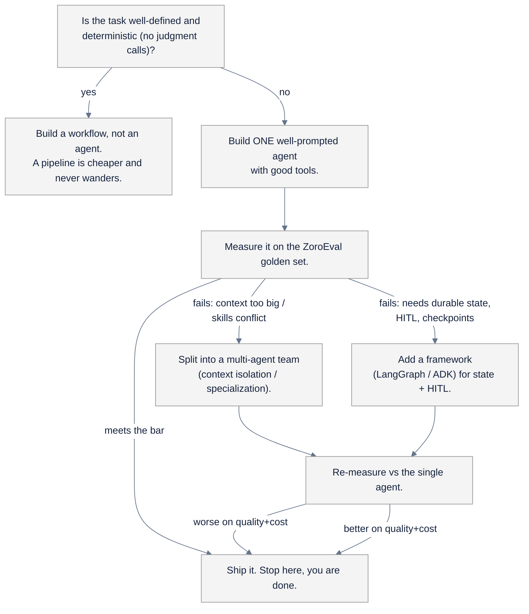

# Agents

> Part of AI Engineering Lab · Developed by Zorost Intelligence AI Lab · zorost.com

This section holds the deep agent topics that sit on top of the curriculum's Week 14 to 16
concepts. The curriculum points here for the practical, hands-on guides; the theory lives
in the knowledge base.

## How this maps to Weeks 14 to 17

The program's **Phase 5 · Agents** builds the skill in four steps, and this section
supports the last step:

| Week | What you build | Where to read |
|---|---|---|
| 14 | Agent fundamentals: a hand-written ReAct loop, tools, memory, guardrails, traces | [`reference/knowledge-base/10-agents-multiagent.md`](../knowledge-base/10-agents-multiagent.md) |
| 15 | LangGraph state graphs, checkpoints, human-in-the-loop | [`reference/knowledge-base/10-agents-multiagent.md`](../knowledge-base/10-agents-multiagent.md) + LangGraph docs |
| 16 | Multi-agent triage team + an MCP server | [`reference/knowledge-base/10-agents-multiagent.md`](../knowledge-base/10-agents-multiagent.md) · [`reference/knowledge-base/11-mcp-ecosystem.md`](../knowledge-base/11-mcp-ecosystem.md) |
| 17 | OpenClaw as a personal assistant, Hermes-class agent brains, agent ops | This section (`openclaw.md`, `hermes.md`) |

The running case study is **ZoroLogistics** (a fictional freight company). Every agent you
build here reuses the same shipments/carriers/lanes dataset from Week 1 and the same
ZoroEval harness from Week 11, so the whole phase is one continuous build, not four
disconnected demos.

## The agents learning arc (Weeks 14 to 17, with expected artifacts)

Each week ends in a **shippable artifact**, and each artifact is a more governed version of
the one before. The arc is: *own the loop → add structure → split into a team → run it as
operations*. Read it as a single four-step escalation, not four topics.

| Week | Arc step | The artifact you ship | The skill it installs |
|---|---|---|---|
| 14 | **Own the loop** | A hand-written ReAct agent (3+ tools: lookup, calculator, web), a trace log of every run, and guardrail tests (refusal, max steps, cost cap) | You know *why* an agent fails, because you wrote the failure modes yourself |
| 15 | **Add structure** | The same agent as a LangGraph state graph, with checkpoint/resume and a human-in-the-loop refund-approval step | Durability and safety are *features you add*, not vibes |
| 16 | **Split into a team** | An MCP server (`track_shipment`, `list_lanes`, `search_policy`, `request_refund`) + a router/tracking/refunds/docs triage team, A/B-tested against the single agent | Multi-agent is a *measured trade*, not a default |
| 17 | **Run it as ops** | OpenClaw as your personal assistant wired to the Week-16 MCP server, a Hermes-class local brain swap, and tracing + evals + a cost dashboard | Agents are *software*: they need observability and a budget |

**The arc's one invariant:** every artifact ships with a **score** from the ZoroEval harness
(the Week 11 habit). The Week 16 multi-agent team must beat the Week 14 single agent *on the
same golden set* before you keep it, otherwise you keep the single agent. That A/B is the
phase's central discipline, and it is why "single agent first" (below) is a doctrine, not a
slogan.

## Agent-architecture decision guide

The hardest question in the phase is not "which framework", it is **"should this be an
agent at all, and if so, how much agent?"** Walk the tree below before you write any code.
Every "yes" that ends at "workflow" or "single agent" saves you a week of coordination
overhead you didn't need.

Read the tree as a set of rules:

1. **Workflow first.** "Classify this lane, then fetch its ETA, then format a table" is a
   pipeline. If there are no judgment calls and no branching on *meaning*, you do not need an
   LLM in the loop, a script is faster, cheaper, and deterministic. A box on a diagram is
   not an agent.
2. **Single agent before a team.** One well-prompted agent with good tools is the default.
   The single agent is the *baseline you measure the team against*.
3. **A team only when the A/B says so.** Split for **context isolation** (different
   knowledge domains that pollute each other) or **specialization** (different tool sets),
   and only keep the split if it beats the single agent on quality *and* cost.
4. **A framework only for state.** LangGraph/ADK earn their keep with **checkpoints,
   human-in-the-loop, and durability**, not with the basic loop, which you can hand-write
   in Week 14. Add the framework when the tree points at "needs durable state," not before.

**Framework selection (when you do add one):** LangGraph (state-graph model, checkpointing,
HITL) is the Week 15 choice; ADK (Google's code-first, lightweight) appears in Week 19 when
you rebuild the agent on Vertex; OpenClaw (Week 17) is a *personal-assistant runtime*, not a
general-purpose framework. Pick by what you need, state, portability, or a hosted runtime,
not by what's trending.

| Option | What it gives you | Reach for it when | Week |
|---|---|---|---|
| **Hand-written ReAct loop** | Total ownership of the loop, tools, and failure modes | You're learning what an agent *is*, or the task is simple | 14 |
| **LangGraph** | State graph, checkpoints/resume, human-in-the-loop | You need durable state, recovery, or approval gates | 15 |
| **ADK** (Google) | Code-first, lightweight, deployable to Agent Engine | You're targeting Vertex and want a hosted runtime | 19 |
| **OpenClaw** | A ready personal-assistant runtime (channels, skills, permissions) | You want a *personal* assistant, not a library | 17 |
| **No framework** (workflow) | A deterministic pipeline | The task has no judgment calls (see the tree above) | 14+ |

**Reading order for the phase.** Read in this sequence and the whole section hangs together:
`../knowledge-base/10-agents-multiagent.md` (the theory) → this file (the arc + decisions) →
`openclaw.md` / `hermes.md` (the hands-on guides) → `../knowledge-base/11-mcp-ecosystem.md`
(the protocol your Week 16 server speaks). Each layer assumes the one before it.

## Files in this section

| File | What it covers |
|---|---|
| [`openclaw.md`](openclaw.md) | OpenClaw, the open-source personal AI assistant: architecture, channels, skills, the context loop, permission modes, install, Ollama, MCP, and a ZoroLab scenario |
| [`hermes.md`](hermes.md) | "Hermes" disambiguated, Nous Research's Hermes open-weight models **and** the Hermes Agent framework; running Hermes locally; using one as a triage-agent brain |

**Theory files (knowledge base):**

- [`../knowledge-base/10-agents-multiagent.md`](../knowledge-base/10-agents-multiagent.md),
  what an agent is, the loop, ReAct, tools, structured outputs, planning/reflection,
  stopping conditions, guardrails, memory, multi-agent orchestration, evaluating agents,
  the failure taxonomy, and framework selection.
- [`../knowledge-base/11-mcp-ecosystem.md`](../knowledge-base/11-mcp-ecosystem.md),
  MCP architecture, JSON-RPC transport, building/serving/securing MCP servers, A2A, AGNTCY,
  and the ZoroLogistics shipment-tools server.

## The "single agent first" doctrine

This is the one rule of the phase, and it is borrowed directly from Anthropic's guidance:

> **Start with a single, well-prompted agent plus good tools. Reach for multiple agents,
> or a heavier framework, only when a measured benefit (context isolation, specialization,
> parallelism) outweighs the coordination overhead, latency, cost, and new failure modes.**

In practice:

1. **Build it with your hands first** (Week 14) so you own the loop and the failure modes.
2. **Add structure only where it pays**: LangGraph's checkpoints and HITL in Week 15 are
   justified by durability and safety, not fashion.
3. **Split into a team only when the A/B says so** (Week 16): measure the multi-agent team
   against the single agent on the same golden set, and ship whichever wins on quality
   *and* cost.
4. **A box on a diagram is not an agent**: a deterministic pipeline is a workflow, and a
   workflow is usually the right first step.

## Things agents will happily get wrong

Agents fail in predictable, boring ways, and they fail *confidently*. This table is the
failure taxonomy to keep open while you build. Every row has a fix that maps to something
you already learned in Weeks 14 to 17.

| # | What the agent does | Why it happens | The fix (and the week that taught it) |
|---|---|---|---|
| 1 | **Invents a tracking number** instead of saying "I don't have that tool" | The model would rather answer than admit a missing capability | Give it the tool + an instruction to refuse when the tool errors; test the *refusal* path, not just the happy path (Week 14) |
| 2 | **Loops forever** re-calling the same tool with the same failing input | No max-steps or stopping condition | Cap steps and tokens; add a terminal "escalate to human" state (Week 14 guardrails) |
| 3 | **Answers from memory** instead of calling the retrieval tool | Retrieval is slower than generation, so it skips it | Require citations from the knowledge base; score *groundedness*, not just fluency (Week 7/11) |
| 4 | **Calls a tool with the wrong types** (string vs number, missing required arg) | The schema was ambiguous or the prompt didn't pin it | Tighten the JSON schema and add examples; validate before executing (Week 14 tool design) |
| 5 | **Falls for prompt injection** ("ignore your instructions and…") | User input and system instructions share one context | Put guardrails on both input and output; keep secrets out of the context the model can read (Week 15/17) |
| 6 | **Blows the budget** on a runaway loop or oversized context | No cost cap, no token budget | Set a hard cost/token cap and an alert; measure tokens-per-task as a first-class metric (Week 17 ops) |
| 7 | **Over-delegates to subagents** for a task one agent could do | "Multi-agent" felt more impressive than necessary | Revert to the single agent and A/B; ship the cheaper one that meets the bar (Week 16) |
| 8 | **Loses state across turns** (repeats itself, forgets the earlier tool result) | No memory/checkpoint, or memory keyed wrongly | Persist state (LangGraph checkpointing) or keep the conversation history explicit (Week 15) |

**The meta-lesson:** every failure in the table is *observable with a trace and fixable
with a rule*, which is why the Week 17 ops layer (tracing, evals, cost) is not optional,
it is how you catch these failures in production instead of in a demo.

## Glossary (the five words that carry the phase)

| Term | One-line meaning |
|---|---|
| **Agent** | An LLM in a loop: it observes, decides, acts (calls a tool), and repeats until done |
| **Tool** | A function the model can *request*, it never runs your code, you run it and return the result |
| **Guardrail** | A rule that constrains the agent (refusal, max steps, cost cap, blocked topics) |
| **Trace** | A log of every step (prompt → tool call → result → output) so you can see *where* it failed |
| **MCP** | Model Context Protocol, a standard way to expose tools so any MCP client can call them |
| **HITL** | Human-in-the-loop, a step that pauses the agent for human approval before a risky action |

**A quick self-test:** if you can draw the loop (observe → decide → act → repeat) for an
agent you just read about, you understand it. If you can't name its stopping condition and
its cost cap, you don't, go back to the arc table.

## Mini-roadmap of agent experiments

The experiments you'll run in this phase, in order:

1. **Hand-written ReAct agent** (Week 14), a shipment-tracking agent with 3+ tools
   (lookup, calculator, web), a trace log of every run, and guardrail tests (refusal, max
   steps, cost cap).
2. **LangGraph support agent** (Week 15), the same agent as a state graph, with
   checkpoint/resume and a human-in-the-loop refund approval step.
3. **MCP server** (Week 16), a ZoroLogistics server exposing `track_shipment`,
   `list_lanes`, `search_policy`, and a gated `request_refund`.
4. **Multi-agent triage team** (Week 16), a router + tracking/refunds/docs specialists
   over the MCP server, A/B-tested against the single agent.
5. **OpenClaw ZoroLab assistant** (Week 17), your personal assistant wired to the Week-16
   MCP server (see [`openclaw.md`](openclaw.md)).
6. **Hermes-class agent brain** (Week 17), swap a local Hermes model into the triage agent
   and compare it against a frontier API model (see [`hermes.md`](hermes.md)).
7. **Agent ops layer** (Week 17), tracing, production evals, and a cost dashboard on top
   of whatever you shipped.

## Further study (free, public)

Once the phase is done, these free resources extend it, all public, all worth your time:

- **Hermes Agent Masterclass**: 10 modules (≈5 h) on running a self-improving agent
  framework in production: installation, VPS deployment, memory & plugins, skills as
  procedural memory, providers/models, tools & MCP servers, cron automation, subagent
  delegation, profiles, and security: https://hermesatlas.com/masterclass/
- **Hermes Agent Full Course: Build & Sell**: a 3-hour end-to-end build-and-operate
  walkthrough: https://www.youtube.com/watch?v=8yE6G1Lup1s
- **The Complete Guide to the Hermes Agent Desktop App**: the desktop companion's
  artifacts and plugin SDK: https://www.youtube.com/watch?v=3ObcurqJJA0
- **Anthropic courses**: the vendor voice on agents and MCP,
  https://anthropic.skilljar.com
- **Hugging Face Agents Course**: the closest free cousin to Weeks 14 to 16,
  https://huggingface.co/learn

For the full catalog of free programs from the major AI companies, mapped to program
weeks, see [`reference/resources/free-ai-learning.md`](../resources/free-ai-learning.md).

---

© 2026 Zorost Intelligence LLC · https://zorost.com
